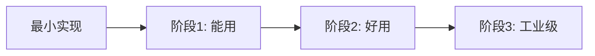

# 费曼学习笔记模板

基于游戏引擎源码分析，提取可带走的通用工程知识。所有笔记输出到 `Notes/SelfGameEngine/` 目录。

## 存放路径

```
Notes/SelfGameEngine/
├── 索引.md
├── 01-基础层/字符串系统.md
├── 02-核心运行时/组件系统架构.md
└── ...
```

## Frontmatter

```yaml
---
title: <主题>
date: YYYY-MM-DD
tags:
  - self-game-engine
  - feynman
  - <分类标签>
aliases:
  - <简短别名>
---
```

## 内容结构

```markdown
# <主题>

> [← 返回 SelfGameEngine 索引]([[Notes/SelfGameEngine/索引|SelfGameEngine 索引]])
> [→ 对应源码分析笔记]([[Game/<路径>/<模块>-源码解析：<主题>|源码分析笔记]])

---

## Why：为什么游戏引擎需要 <X>？

### 问题背景
（描述 X 解决的核心问题。从"没有 X 时世界有多糟"开始讲起。）

### 不用 X 的后果
- 后果 1
- 后果 2
- 后果 3

### 应用场景
- 场景 1
- 场景 2
- 场景 3

---

## What：最简化版本的 <X> 长什么样？

> 目标：用 50~100 行代码写出一个**能跑的最小实现**。这是 vibe coding 时可以直接借鉴的骨架。

```cpp
// 最小实现示例（通用命名，不引用公司源码）
class MinimalX {
public:
    void DoTheThing() {
        // 最核心的逻辑，去掉所有工程噪音
    }
};
```

### 这个最小实现解决了什么？
（列出 2~3 个它已解决的核心问题）

### 这个最小实现还缺什么？
（列出 2~3 个在真实项目中会立刻暴露的短板）

---

## How：真实引擎的 <X> 是如何一步一步复杂起来的？

### 演进阶段 1：从最小实现到"能用"
**触发原因**：某个具体工程问题
**新增设计**：...
**代码层面的变化**：...

### 演进阶段 2：从"能用"到"好用"
**触发原因**：...
**新增设计**：...
**代码层面的变化**：...

### 演进阶段 3：从"好用"到"工业级"
**触发原因**：...
**新增设计**：...
**代码层面的变化**：...

### 复杂度演进路线图


---

## 设计权衡表

| 设计选择 | 优点 | 代价 | 适用场景 |
|---------|------|------|---------|
| 选择 A | ... | ... | ... |
| 选择 B | ... | ... | ... |

---

## 如果我要 vibe coding 一个自己的引擎，该偷哪几招？

> 只列出**可迁移、无版权风险**的通用技巧。

1. **技巧 1**：...
2. **技巧 2**：...
3. **技巧 3**：...

---

## 关联阅读

- [[对应源码分析笔记]]
- [[同目录下的其他费曼笔记]]
- [[专题笔记]]
```

## 脱敏规范（必须遵守）

### ✅ 可以写的内容
- 通用设计模式（如 Handle-Table、Command Pattern、Double Buffering）
- 算法原理（如拓扑排序、A* 寻路、BVH 构建）
- 工程权衡的理由（"为了减少 cache miss，采用了 SoA 布局"）
- 伪代码和最小实现示例（通用命名）

### ❌ 禁止写的内容
- 公司源码中的具体类名、函数名、变量名
- 具体的文件路径（如 `chaos/core/ECS/private/InternalArchetype.cpp`）
- 游戏项目特有的业务逻辑（如 `ProvenGround` 中的特定技能 ID、关卡名）
- 内部工具链的详细配置（如 CI 脚本中的服务器 IP、密钥名）
- 任何可能暴露公司技术债务或未完成功能的负面评价

### 引用边界
- 费曼笔记中**不引用源码片段**。
- 如需说明代码演变，使用**经过改写的伪代码**或**通用化的示意图**。
