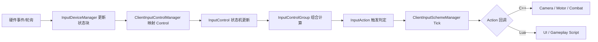

# client-源码解析：输入系统

> [← 返回 全解析主索引]([[00-引擎与游戏全解析主索引|全解析主索引]])

## 一、模块定位

| 属性 | 内容 |
|------|------|
| 物理路径 | `chaos/_source/_engine/source/client/input/`、`client/controller/` |
| 依赖深度 | 依赖 `base/`、`platform/`（OIS / Raw Input / XInput） |
| 编译条件 | `"6client": "@BUILD_CLIENT@"` |
| 下游依赖 | `Camera`（相机控制器）、`UIManager`（UI 事件）、`GameActor`（Pawn 移动/战斗） |

`client/input/` 是 chaos 引擎的**输入抽象与映射层**。它负责将底层硬件事件（键盘、鼠标、手柄、触摸）转换为游戏语义动作（如 "MoveForward"、"Jump"、"OpenMap"），并提供运行时切换输入方案（如战斗模式 / 载具模式 / UI 模式）的能力。

---

## 二、公共接口梳理（第 1 层：接口层）

### 2.1 核心公共头文件

> 文件：`public/chaos/client/input/chaos_input_device_manager.h`

定义 `InputDeviceManager` —— 设备管理层。基于 OIS（Object Oriented Input System）封装，管理 Mouse/Keyboard/Gamepad 的创建、捕获、轮询和状态缓冲。

> 文件：`public/chaos/client/input/input_device/chaos_input_device_base.h`

定义 `InputDeviceBase` —— 设备抽象基类。维护 `m_state` 状态块和 `m_control_offset_map`。

> 文件：`public/chaos/client/input/input_control/chaos_client_input_control_manager.h`

定义 `ClientInputControlManager` —— 控制管理层。注册 Native Control（硬件直接映射）、Custom Control（逻辑派生）。

> 文件：`public/chaos/client/input/input_control/chaos_input_control.h`

定义 `InputControl` —— 输入控制原子。支持状态机、触发器、Processor、Callback。

> 文件：`public/chaos/client/input/input_action/chaos_input_action.h`

定义 `InputAction` —— 输入动作。绑定到一个或多个 `InputControlGroup`，维护触发状态，支持 C++/Lua 回调。

> 文件：`public/chaos/client/input/input_action/chaos_client_input_scheme_manager.h`

定义 `ClientInputSchemeManager` —— 方案管理层。负责 Scheme 注册、切换、Tick、按键冲突检测。

### 2.2 关键 public 类与职责

| 层级 | 类名 | 职责 |
|------|------|------|
| 硬件层 | `InputDeviceManager` | OIS 封装：设备创建、轮询、双缓冲状态、触摸/光标控制 |
| 硬件层 | `InputDeviceBase` | 设备抽象：状态块、Control 偏移映射 |
| 硬件层 | `InputDeviceMouse` / `Keyboard` / `Gamepad` | 具体设备封装：灵敏度、改键、死区 |
| 控制层 | `ClientInputControlManager` | Control 注册：Native / Custom / Derivative |
| 控制层 | `InputControl` | 控制原子：idle → started → performed → cancelled |
| 控制层 | `InputControlGroup` | 控制组：OR / AND / Single 组合，输出统一 Signal |
| 动作层 | `InputAction` | 游戏动作：绑定 ControlGroup， triggered / holding |
| 动作层 | `InputScheme` | 输入方案：聚合 Action + Group，支持重绑定、组合、保留状态 |
| 管理层 | `ClientInputSchemeManager` | 方案总管：注册、切换、Tick、Lua 回调、冲突检测 |

---

## 三、核心数据结构（第 2 层：数据层）

### 2.1 输入系统四层架构

```
硬件事件层
    ├── Win32 Raw Input / XInput / DirectInput / OIS
    └── platform/ Window / InputDevice
        ↓
引擎输入层
    ├── InputDeviceManager（轮询硬件状态）
    ├── InputDeviceBase（状态块抽象）
    └── ClientInputControlManager（Control 注册）
        ↓
控制语义层
    ├── InputControl（原子控制 + 状态机）
    ├── InputControlGroup（组合控制）
    └── InputAction（游戏动作语义）
        ↓
方案管理层
    ├── InputScheme（方案配置）
    └── ClientInputSchemeManager（运行时切换）
        ↓
游戏逻辑层
    ├── Camera Controller（移动/旋转）
    ├── GameActor Motor（角色移动）
    ├── UIManager（UI 事件）
    └── Lua 脚本回调
```

### 2.2 InputControl 状态机

```cpp
enum class InputControlState {
    idle,       // 未激活
    started,    // 本帧开始激活
    performed,  // 持续激活中
    cancelled   // 本帧取消/释放
};

enum class InputActionState {
    idle,
    triggered,  // 本帧触发（如按键按下）
    busy        // 持续按住
};
```

- `InputControl` 维护当前状态和上帧状态，通过比较边缘检测生成 `started` / `cancelled`。
- `InputControlDataSourceComponent` 决定 Control 的值来源（native 硬件或 custom 逻辑）。
- `InputControlTriggerComponent` 决定什么条件下从 `started` 进入 `performed`（如按住超过某阈值）。

### 2.3 InputControlGroup 的组合模式

```cpp
enum class InputControlGroupType {
    or_group,      // 任一 Control 激活即输出
    and_group,     // 所有 Control 同时激活才输出
    single_group   // 仅取第一个激活的 Control
};

class InputControlGroup {
    DynamicArray<InputControl*> m_controls;
    InputControlGroupType m_type;
    InputSignal m_output_signal;  // rising / falling / hold
};
```

### 2.4 InputScheme 的结构

```cpp
class InputScheme {
    StringID m_scheme_id;
    UnorderedMap<StringID, InputAction*> m_actions;
    UnorderedMap<StringID, InputControlGroup*> m_groups;
    DynamicArray<StringID> m_preserved_atoms;  // 切换方案时保留状态的原子 Control
    Bool m_is_compound;  // 是否可与其他 Scheme 组合
};
```

---

## 四、关键行为分析（第 3 层：逻辑层）

### 4.1 一帧输入处理完整链路



1. **硬件轮询**：`InputDeviceManager::tick()` 调用 OIS 或平台 API 轮询当前鼠标/键盘/手柄状态。
2. **状态块更新**：`InputDeviceBase` 将原始硬件值（按键 0/1、摇杆 -1~1）写入 `m_state` 缓冲区。
3. **Control 映射**：`ClientInputControlManager` 根据 `m_control_offset_map` 将状态块切片映射为具体的 `InputControl` 值。
4. **Control 状态机**：每个 `InputControl` 比较当前帧与上一帧值，更新为 `started` / `performed` / `cancelled`。
5. **Group 组合**：`InputControlGroup` 根据类型（OR/AND/Single）和成员 Control 状态，输出统一的 `InputSignal`。
6. **Action 触发**：`InputAction` 检查绑定的 Group 是否满足触发条件，更新 `triggered` / `holding`。
7. **SchemeManager Tick**：`ClientInputSchemeManager::tick()` 遍历当前激活 Scheme 的所有 Action，分发 C++ 或 Lua 回调。

### 4.2 输入方案切换与状态保留

```cpp
void ClientInputSchemeManager::switchScheme(StringID new_scheme_id) {
    // 1. 记录当前 Scheme 中需要保留的 Control 状态
    auto preserved = capturePreservedStates(current_scheme);
    
    // 2. 卸载旧 Scheme 的 Action 回调
    unregisterActions(current_scheme);
    
    // 3. 加载新 Scheme
    current_scheme = m_schemes[new_scheme_id];
    registerActions(current_scheme);
    
    // 4. 恢复保留的 Control 状态
    restorePreservedStates(preserved);
}
```

- 典型应用场景：玩家从步行模式切换到载具驾驶模式，再切回步行模式。WASD 移动控制的状态可以保留，避免切换瞬间输入中断。

### 4.3 与 UI 的事件竞争

输入系统需要与 UI 系统协调事件消费权：
- 当 `UIManager::processCoherentInput()` 检测到鼠标 hover 在 UI 上时，输入事件优先路由给 UI。
- `IntermediateGUIManager`（ImGui）通过 `WantCaptureMouse` / `WantCaptureKeyboard` 标志告知输入系统是否已消费事件。
- 若 UI 消费了事件，则对应的 `InputControl` 被强制置为 `cancelled`，防止"点击按钮同时开枪"。

---

## 五、与上下层的关系

### 5.1 向下依赖
- `platform/`：`Window` 事件（Win32 WndProc）、OIS 库、XInput 手柄支持
- `base/`：字符串 ID、哈希表、动态数组、日志

### 5.2 向上被依赖
- `client/camera/`：相机控制器读取 InputAction（如 "LookUp"、"Turn"）更新相机旋转
- `client/motor/`：`ClientGameActorMotorManager` 读取 "MoveForward"、"MoveRight" 驱动角色移动
- `client/ui/`：`UIManager` 和 `LusionApplication` 接收输入事件做 UI 交互
- `client/combat/`：战斗系统读取 "Attack"、"Dodge"、"Skill1" 触发战斗动作

### 5.3 数据流向

```
硬件（Mouse / Keyboard / Gamepad / Touch）
    ↓
InputDeviceManager → InputDeviceBase（状态块）
    ↓
ClientInputControlManager → InputControl（状态机）
    ↓
InputControlGroup（组合）→ InputAction（游戏语义）
    ↓
ClientInputSchemeManager（方案切换）
    ↓
Camera Controller / Motor / Combat / UI / Lua
```

---

## 六、设计亮点与潜在陷阱

### 设计亮点
1. **状态机驱动的 Control 原子化**：`idle → started → performed → cancelled` 四态模型精确刻画了按键的生命周期，避免了简单的 bool 标志导致的"一帧多次触发"或"边缘丢失"问题。
2. **Group 组合逻辑**：OR / AND / Single 三种组合模式让复杂输入映射变得简单。例如"跳跃"可以绑定 Space OR Gamepad_A，" stealth  walk"可以绑定 Shift AND W。
3. **Scheme 状态保留**：切换输入方案时保留关键 Control 状态，是 gameplay 流畅性的重要保障，尤其在频繁切换战斗/载具/UI 模式的游戏中。
4. **DataSource + Trigger 插件化**：`InputControlDataSourceComponent` 和 `InputControlTriggerComponent` 让 Control 的行为可扩展，支持从非硬件来源（如 AI、网络同步、动画事件）驱动输入。

### 潜在陷阱
1. **状态机竞争**：若 UI 系统和 gameplay 系统同时监听同一个 InputAction，且没有正确的事件消费机制，可能出现"开枪同时打开地图"的冲突。
2. **方案切换的回调泄漏**：若旧 Scheme 的 Action 回调在切换时未被正确注销，新 Scheme 的同名 Action 可能触发旧回调，导致异常行为。
3. **摇杆死区与精度**：`InputDeviceGamepad` 的死区处理若过于保守，会降低小幅度操作的精度；若过于宽松，会出现摇杆漂移。需要在不同手柄型号上做校准。

---

## 七、关键源码片段

> 文件：`public/chaos/client/input/input_control/chaos_input_control.h`，状态机定义（示意）

```cpp
enum class InputControlState {
    idle,
    started,
    performed,
    cancelled
};

class InputControl {
public:
    InputControlState getState() const { return m_state; }
    void update(float raw_value);
    void registerProcessor(InputControlProcessor* processor);
    void registerCallback(std::function<void(InputControlState)> callback);
    
private:
    InputControlState m_state;
    InputControlState m_last_state;
    float m_current_value;
    InputControlDataSourceComponent* m_data_source;
    InputControlTriggerComponent* m_trigger;
};
```

> 文件：`public/chaos/client/input/input_action/chaos_input_action.h`，Action 触发（示意）

```cpp
enum class InputActionState {
    idle,
    triggered,
    busy
};

class InputAction {
public:
    void bindControlGroup(InputControlGroup* group);
    InputActionState getState() const { return m_state; }
    void registerCallback(std::function<void()> on_triggered);
    void registerLuaCallback(LuaFunctionRef callback);
    
private:
    InputActionState m_state;
    DynamicArray<InputControlGroup*> m_groups;
};
```

---

## 八、关联阅读

- [[client-源码解析：相机与视锥剔除]] —— 输入系统的重要消费者之一（相机控制器）
- [[client-源码解析：UI 运行时]] —— 与输入系统竞争事件消费的 UI 层
- [[client-源码解析：网络同步可视化]] —— 玩家输入通过网络同步到服务器后的预测与插值
- [[00-客户端模块总览|客户端模块总览]] —— 第四阶段总览与架构上下文

---

**索引状态**：所属阶段：第四阶段；对应计划笔记：[[client-源码解析：输入系统]]
