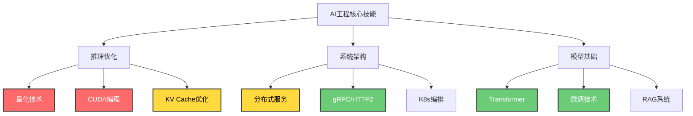

> [!goal] 转型目标
> **目标**：从C++游戏开发转向大模型AI工程，瞄准Kimi/Moonshot AI等公司的AI Infra/推理优化岗位
> **核心策略**：发挥C++工程优势，补足AI理论基础，聚焦推理优化与系统架构

---

## 第一部分：你的独特优势分析

### 为什么C++游戏开发背景是转型AI的利器

| 游戏开发经验 | AI工程对应能力 | 市场稀缺性 |
|-------------|--------------|:----------:|
| 实时渲染优化（60FPS+） | LLM推理延迟优化、吞吐提升 | ⭐⭐⭐⭐⭐ |
| GPU编程（Shader/Compute Shader） | CUDA编程、Kernel优化 | ⭐⭐⭐⭐⭐ |
| 内存管理与缓存优化 | KV Cache优化、模型量化 | ⭐⭐⭐⭐ |
| 3D数学（线性代数/矩阵运算） | 注意力机制、多模态模型 | ⭐⭐⭐⭐ |
| 游戏引擎架构（多线程/ECS） | 分布式训练、推理服务架构 | ⭐⭐⭐⭐ |

> [!tip] 关键洞察
> AI行业不缺算法研究员，但极度缺乏**能让大模型在生产环境跑得快、省资源、高可用的工程专家**。

---

## 第二部分：学习路线图（6-12个月）

### 🔰 阶段一：AI基础与Python生态（1-2个月）

> [!note] 阶段目标
> 建立AI概念地图，能用PyTorch实现基础模型

#### 必学内容

- **Python快速上手**：利用C++基础，重点学习动态类型、装饰器、上下文管理器
- **PyTorch核心概念**：
  - 张量操作（类比游戏引擎的Vector/Matrix类）
  - 自动微分（Autograd，理解计算图概念）
  - DataLoader与数据流水线（类比游戏资源加载系统）
- **深度学习基础**（利用你已有的书）：
  - 精读：CNN原理、反向传播、优化器（SGD/Adam）
  - 浏览：RNN/LSTM（了解即可，Transformer已取代）
  - 跳过：复杂数学证明、传统机器学习算法

#### 实战项目

1. **图像分类器**：用ResNet-18分类游戏截图（角色/场景/道具）
2. **风格迁移**：将游戏画面转换为水墨/赛博朋克风格（类比后期处理Shader）
3. **简单GAN**：生成游戏纹理贴图

#### 关键资源

> [!info] 推荐资源
> - 书籍：《动手学深度学习》（李沐，免费在线）
> - 课程：Fast.ai Practical Deep Learning（工程导向）
> - 文档：PyTorch官方Tutorials（60分钟入门）

---

### 🔶 阶段二：大模型核心技术（2-3个月）

> [!note] 阶段目标
> 理解Transformer与预训练范式，能微调开源模型

#### 必学内容

- **Transformer架构**（重中之重）：
  - 自注意力机制（Self-Attention）：理解Q/K/V矩阵运算
  - 位置编码（Positional Encoding）
  - 多头注意力（Multi-Head Attention）
  - 前馈网络与层归一化
- **预训练与微调**：
  - GPT系列：自回归语言建模（Next Token Prediction）
  - BERT系列：掩码语言模型（Masked LM）
  - 指令微调（Instruction Tuning/SFT）
  - RLHF原理（人类反馈强化学习，了解概念即可）
- **高效微调技术**：
  - LoRA/QLoRA：低秩适配，降低显存占用
  - 提示工程（Prompt Engineering）与上下文学习

#### 实战项目

1. **对话机器人微调**：用LoRA微调Llama-2-7B在特定游戏剧情数据上
2. **代码生成助手**：微调StarCoder在C++游戏引擎API上
3. **RAG系统**：构建游戏知识库问答（向量数据库+LLM）

#### 关键资源

> [!info] 推荐资源
> - 论文：《Attention Is All You Need》（必读，Transformer原始论文）
> - 代码：Hugging Face Transformers库、PEFT库（LoRA实现）
> - 课程：Stanford CS25（Transformer专题）、DeepLearning.AI的《LangChain实战》

---

### ⚡ 阶段三：C++ AI工程化（3-4个月）——你的差异化优势

> [!note] 阶段目标
> 掌握大模型推理优化，能用C++实现高性能AI服务

#### 必学内容

- **模型推理优化**：
  - 量化技术：INT8/INT4/FP16，理解对精度与速度的影响
  - KV Cache优化：减少重复计算，提升长文本性能
  - 投机解码（Speculative Decoding）：用草稿模型加速
  - 连续批处理（Continuous Batching）：提升吞吐
- **推理框架深度使用**：
  - **ONNX Runtime**：跨平台部署，C++ API实战
  - **TensorRT**：NVIDIA GPU极致优化
  - **vLLM**：PagedAttention技术，高吞吐服务
  - **llama.cpp**：纯C++实现，CPU/GPU混合推理（重点研究）
- **CUDA编程**：
  - CUDA基础：Kernel编写、内存管理（Global/Shared/Local）
  - 优化技术：内存合并访问、Bank Conflict避免、Warp级优化
  - cuBLAS/cuDNN：利用现有高性能库
- **高性能服务架构**：
  - gRPC/HTTP2服务化
  - 模型并行与流水线并行
  - 动态批处理与请求调度

#### 实战项目

1. **C++重写推理引擎**：用ONNX Runtime C++ API实现BERT推理服务，对比Python版本延迟（目标：提升5-10倍）
2. **llama.cpp深度优化**：为特定游戏NPC对话场景优化7B模型推理，实现单卡实时对话（<100ms/token）
3. **多模态推理服务**：用C++构建CLIP图像编码+LLM文本生成的联合服务
4. **CUDA Kernel优化**：手写自定义CUDA算子（如特定激活函数），集成到PyTorch

#### 关键资源

> [!info] 推荐资源
> - 项目：llama.cpp（GitHub，纯C++，必读源码）、vLLM（Python+C++混合）
> - 书籍：《CUDA编程：基础与实践》《高性能深度学习推理》
> - 文档：NVIDIA TensorRT文档、ONNX Runtime C++ API文档

---

### 🚀 阶段四：AI系统与产品思维（2-3个月）

> [!note] 阶段目标
> 构建完整AI应用，理解AI-Native产品架构

#### 必学内容

- **RAG系统架构**：
  - 向量数据库：Milvus/Pinecone/Weaviate
  - 嵌入模型（Embedding Models）：Sentence-BERT等
  - 检索策略：Dense Retrieval、Hybrid Search、重排序
- **Agent系统**：
  - 工具调用（Tool Use）：Function Calling机制
  - 多Agent协作：ReAct、Reflexion等范式
  - 长期记忆：向量存储、知识图谱
- **AI基础设施**：
  - Kubernetes：模型服务编排
  - Ray：分布式AI计算框架
  - 监控与可观测：模型性能监控、延迟追踪
- **Rust基础**（Moonshot AI偏好）：
  - 所有权与生命周期（类比C++ RAII）
  - 并发安全（对比C++多线程）
  - 在AI服务中的应用（如Tonic gRPC服务）

#### 实战项目

1. **游戏AI助手完整系统**：
   - 前端：Unity/Unreal集成（你的老本行）
   - 后端：C++高性能推理服务
   - RAG：游戏Wiki知识库
   - Agent：能查询数据库、调用游戏API的AI助手
2. **AI代码生成工具**：类似Cursor的C++游戏代码补全，基于本地模型
3. **开源贡献**：给vLLM/llama.cpp提交性能优化PR（量化Kernel优化、新硬件支持）

---

## 第三部分：针对Moonshot AI/Kimi的准备

### 目标岗位分析

根据Moonshot AI招聘信息，重点瞄准：

#### AI Infra工程师（C++方向）

> 要求：C++/Go/Rust，熟悉Linux，有高性能系统经验
> 你的优势：游戏引擎优化经验直接迁移到推理优化

#### 全栈极客工程师（AI-Native方向）

> 要求：全栈交付能力，AI驱动研发，能深入系统底层（C++/JNI）
> 你的优势：游戏开发本身就是全栈（图形、物理、网络、脚本）

#### 大模型算法工程师（工程偏重型）

> 要求：深度学习基础，但强调工程实现与系统优化
> 你的优势：C++工程能力 + 快速学习的AI基础

### 技能树优先级

---

## 第四部分：学习资源清单

### 书籍

#### AI基础

- 《动手学深度学习》（李沐）- 免费在线，工程导向
- 《深度学习》（Goodfellow，你已有的书）- 重点读第6-9章（CNN、RNN、优化）
- 《Understanding Deep Learning》（Simon J.D. Prince，2023）- 现代视角，免费PDF

#### 工程优化

- 《CUDA编程：基础与实践》
- 《高性能深度学习推理》（NVIDIA工程师经验）
- 《大规模分布式系统架构》（系统设计面试）

#### Rust（Moonshot偏好）

- 《The Rust Programming Language》（官方免费）
- 《Rust for Rustaceans》（进阶）

### 在线课程

| 课程                                          | 平台       | 重点               |
| ------------------------------------------- | -------- | ---------------- |
| Stanford CS25: Transformers United          | Stanford | Transformer专题，必看 |
| Fast.ai: Practical Deep Learning for Coders | Fast.ai  | 工程实战             |
| DeepLearning.AI: MLOps Specialization       | Coursera | AI系统             |
| Udacity: CUDA Programming                   | Udacity  | GPU优化            |

### 关键开源项目（精读源码）

> [!warning] 源码阅读建议
> 按优先级从高到低阅读，先深入理解1-2个项目，再拓展到其他。

| 项目 | 语言 | 学习重点 |
|-----|------|---------|
| **llama.cpp** | C++ | 纯C++如何实现LLM推理、量化实现、GGUF格式、CPU/GPU混合调度 |
| **vLLM** | Python+C++ | PagedAttention、Continuous Batching服务架构 |
| **TensorRT-LLM** | C++ | NVIDIA极致优化、Kernel融合、多卡并行 |
| **ONNX Runtime** | C++ | 跨平台部署、图优化、执行提供程序（Execution Providers） |
| **Hugging Face Transformers** | Python | 模型架构实现、Tokenizer、Generation策略 |

---

## 第五部分：时间规划与里程碑

### 6个月速成计划（全职学习）

| 月份 | 重点 | 里程碑 |
|:---:|:---|:---|
| 1 | Python+PyTorch基础 | 完成3个CV项目，理解Autograd |
| 2 | Transformer+微调 | 用LoRA微调7B模型，构建简单对话Bot |
| 3 | C++推理优化入门 | 用ONNX Runtime C++部署模型，延迟优化5倍+ |
| 4 | CUDA+llama.cpp | 手写CUDA Kernel，优化llama.cpp在特定硬件 |
| 5 | RAG+Agent系统 | 构建完整游戏AI助手（前端+后端+RAG） |
| 6 | 面试准备+开源贡献 | 完成2个开源PR，刷题+系统设计 |

### 12个月稳健计划（在职学习）

> [!example] 学习时间分配
> - **工作日晚上**：2小时理论学习（书/论文/课程）
> - **周末**：8小时实战（项目/代码/优化）
> - **每季度**：完成1个完整项目，更新GitHub

---

## 第六部分：建立个人品牌

### GitHub项目建议

> [!success] 项目方向
>
> #### cpp-ai-toolkit
> 类似lite.ai.toolkit的C++推理工具集
> - 包含：ONNX/TensorRT封装、常用模型C++实现、性能Benchmark
>
> #### game-llm-optimizer
> 针对游戏场景的LLM优化方案
> - NPC实时对话系统（<50ms延迟）
> - 游戏剧情生成器
> - C++插件集成Unity/Unreal Demo
>
> #### cuda-kernel-collection
> 手写CUDA算子集合
> - 自定义Attention Kernel
> - 量化/反量化Kernel
> - 与PyTorch集成示例

### 技术博客主题

- "从游戏引擎优化到LLM推理优化：我的性能优化方法论"
- "用C++重写PyTorch推理：性能对比与优化技巧"
- "llama.cpp源码解析：纯C++如何实现大模型推理"
- "CUDA优化实战：将游戏Shader经验应用于AI计算"

---

## 第七部分：面试准备要点

### 技术面试重点

#### C++基础

- 智能指针、内存模型、并发编程（锁、原子操作、无锁队列）
- 模板元编程、CRTP、SFINAE（现代C++特性）
- 性能优化：缓存友好性、分支预测、SIMD

#### 系统设计

- 设计一个高并发LLM推理服务（类似vLLM架构）
- 设计一个RAG系统（延迟与准确性权衡）
- 设计一个游戏AI Agent系统（实时性要求）

#### AI基础

- 解释Transformer的注意力机制，手写Attention公式
- 解释LoRA原理，为什么能降低显存占用
- 解释KV Cache，如何优化长文本生成

#### 工程优化

- 如何降低LLM推理延迟？（量化、投机解码、算子融合）
- 如何提升LLM服务吞吐？（Continuous Batching、动态批处理）
- 多卡并行策略选择？（张量并行vs流水线并行）

### 项目展示

> [!todo] 项目准备清单
> 准备3个项目深度讲解：
> - [ ] **C++推理优化项目**：展示性能数据（延迟、吞吐、内存占用对比）
> - [ ] **完整AI应用**：展示系统设计图、技术选型理由、遇到的挑战
> - [ ] **开源贡献**：展示PR内容、代码Review过程、性能提升数据

---

## 结语

> [!quote] 核心信念
> **你的转型不是"从零开始"，而是"将已有优势迁移到新领域"**。

游戏开发的实时系统思维、性能优化本能、工程架构能力，正是当前AI行业最稀缺的。不要试图成为另一个算法研究员，而要成为**懂AI原理的顶尖工程专家**——这是Kimi/Moonshot AI这类公司急需的人才。

---

### 🎯 立即行动清单

- [ ] **今天**：安装PyTorch，跑通第一个MNIST示例
- [ ] **本周**：读完《动手学深度学习》前5章
- [ ] **本月**：完成第一个PyTorch项目，开始读llama.cpp源码
- [ ] **本季度**：完成C++推理优化项目，建立GitHub项目

> [!tip] 记住
> 在AI领域，工程实现能力往往比理论推导更能创造实际价值。你的C++背景不是劣势，而是让你脱颖而出的关键优势。
