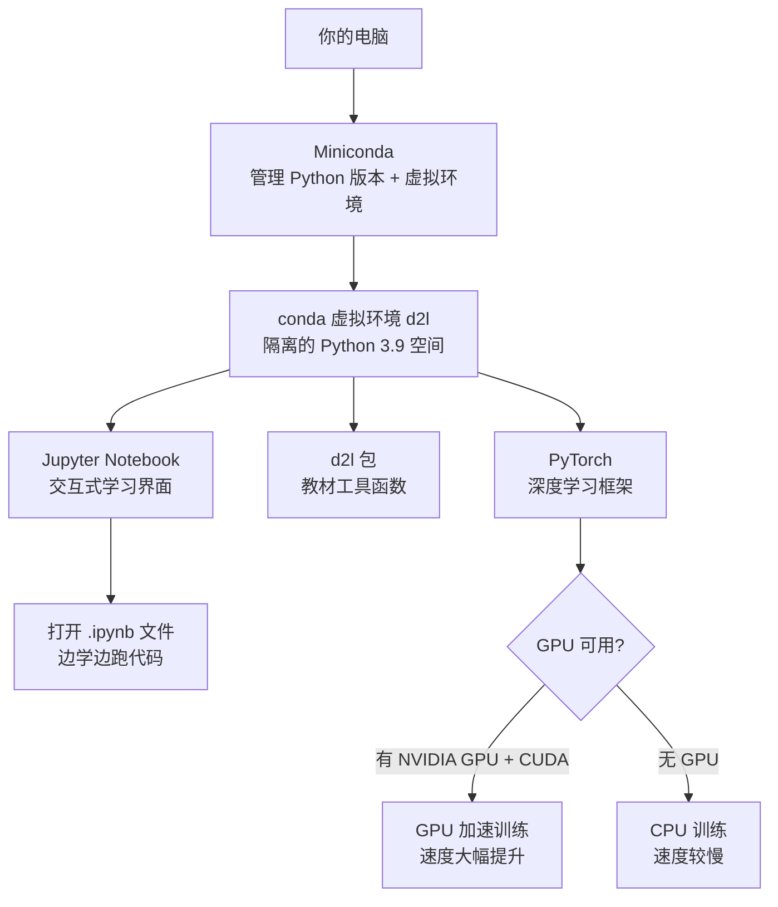

# 深度学习环境搭建（D2L）

> [!abstract] 概述
> 本笔记记录《动手学深度学习》的环境配置步骤，并解释三个核心概念：**为什么要用 Miniconda**、**conda 虚拟环境是什么**、**Jupyter Notebook 是什么**。

---

## 一、为什么要用 Miniconda，不能直接用纯 Python 吗？

> [!question] 疑问：能不能直接 `pip install` 搞定一切？

**可以，但很容易出问题。** 原因如下：

### 纯 Python 环境的痛点

| 问题               | 说明                                                 |
| ---------------- | -------------------------------------------------- |
| **版本冲突**         | 不同项目依赖不同版本的库（如 TensorFlow 2.x vs 1.x），装在同一环境里会互相破坏 |
| **Python 本身的版本** | 纯 pip 无法管理 Python 解释器本身的版本切换                       |
| **非 Python 依赖**  | 深度学习框架往往依赖 CUDA、cuDNN 等 C++ 库，pip 管不了这些，conda 可以   |
| **复现困难**         | 没有隔离，换台机器就可能跑不起来                                   |

### Miniconda 解决了什么

Miniconda 是 **conda 的最小化安装包**（只含 conda + Python，不带额外库）。

- conda 既是**包管理器**（类似 pip），又是**环境管理器**（可以创建完全隔离的 Python 环境）
- 能管理 Python 版本本身（`conda create --name myenv python=3.9`）
- 能安装非 Python 的二进制依赖（CUDA toolkit、MKL 等）

> [!tip] 简单类比
> - `pip` = 只管理 Python 包的快递员
> - `conda` = 既管 Python 包，又能给每个项目建一个独立房间（虚拟环境），还能搞定底层 C/C++ 库

---

## 二、conda 虚拟环境（conda environment）是什么？

> [!question] 疑问：`conda create --name d2l` 创建的环境到底是什么东西？

### 直觉理解

想象你的电脑是一栋大楼，**每个 conda 环境就是一个独立的房间**：

- 每个房间有自己的 Python 版本
- 每个房间有自己独立安装的库
- 房间之间互不干扰，一个房间装坏了不影响其他房间

```
~/miniconda3/envs/
├── base/          ← 默认环境（conda 自带）
├── d2l/           ← 你为 D2L 创建的环境
│   ├── python3.9
│   ├── torch
│   ├── d2l
│   └── jupyter
└── another-proj/  ← 另一个项目的环境
```

### 核心命令

```bash
# 创建一个名为 d2l、Python 版本为 3.9 的环境
conda create --name d2l python=3.9 -y

# 激活环境（进入这个房间）
conda activate d2l

# 退出环境（离开这个房间）
conda deactivate

# 查看所有环境
conda env list
```

> [!warning] 重要习惯
> 每次开始工作前，先 `conda activate d2l`，否则你装的包会装到错误的环境里！

### 为什么激活后 pip install 就装到对应环境里？

激活环境后，`python` 和 `pip` 命令会被重定向到该环境目录下的可执行文件，所以所有操作都在隔离空间内进行。

---

## 三、Jupyter Notebook 是什么？

> [!question] 疑问：为什么不直接写 `.py` 文件，要用 Jupyter？

### Jupyter 是一种交互式编程环境

普通 Python 脚本是**批处理**模式：写完整个文件 → 一次性运行 → 看结果。

Jupyter Notebook 是**交互式**模式：

- 文件由若干**单元格（cell）**组成
- 每个 cell 可以单独运行，立即看到输出
- 输出可以是文字、表格、**图像**（这对深度学习非常重要！）
- 代码、运行结果、文字说明可以混排在同一文档中

### 对深度学习学习者的意义

```
传统脚本方式：                    Jupyter 方式：
─────────────                    ──────────────
写完整个训练代码                  一步一步运行，随时查看
         ↓                              ↓
运行 → 等待 → 看日志              每个 cell 立即输出结果
         ↓                              ↓
调参 → 重新运行全部               只重跑需要修改的 cell
```

> [!example] 典型使用场景
> 1. 加载数据集 → 运行 → 立即打印数据形状和样例图片
> 2. 定义模型 → 运行 → 确认参数量
> 3. 训练一个 epoch → 运行 → 查看 loss 曲线
> 4. 调整学习率 → 只重跑训练 cell，不用重新加载数据

### 如何启动

```bash
# 先激活环境
conda activate d2l

# 启动 Jupyter
jupyter notebook
```

浏览器会自动打开 `http://localhost:8888`，在网页界面里打开 `.ipynb` 文件即可。

---

## 四、PyTorch 和 CUDA 是什么？

> [!question] 疑问：PyTorch 是什么？为什么深度学习需要它？装完 PyTorch 为什么还要检查 CUDA？

### PyTorch 是什么

PyTorch 是 Meta 开发的**深度学习框架**（Python 库），提供：

- **张量（Tensor）计算**：类似 NumPy，但能在 GPU 上运行
- **自动微分（Autograd）**：自动计算梯度，训练神经网络的核心
- **神经网络模块（nn.Module）**：构建模型的高级 API

**为什么需要它？**

训练神经网络的本质是：矩阵乘法 → 计算损失 → 求梯度 → 更新参数，循环往复。手动实现这套流程极其繁琐，PyTorch 把这一切封装好，让你专注于模型设计。

### CUDA 是什么

CUDA（Compute Unified Device Architecture）是 NVIDIA 开发的**并行计算平台**，允许程序直接调用 GPU 进行通用计算。

**GPU vs CPU：**

| | CPU | GPU |
|---|---|---|
| 核心数 | 几个～几十个 | 几千个～上万个 |
| 擅长 | 复杂串行逻辑 | 大规模并行计算 |
| 深度学习 | 慢（小时～天） | 快（分钟～小时） |

矩阵乘法天然适合并行——1000×1000 的矩阵乘法包含 100 万次独立运算，GPU 可以同时处理，CPU 只能排队算。

### 为什么装完 PyTorch 要检查 CUDA

PyTorch 有两个版本：

```
PyTorch (CPU-only)  ← 只用 CPU，慢
PyTorch (CUDA)      ← 能调用 GPU，快
```

> [!warning] 版本必须匹配
> PyTorch 的 CUDA 版本必须和机器上的 NVIDIA 驱动版本兼容，不匹配则 GPU 不可用。

验证命令：

```python
import torch
print(torch.cuda.is_available())    # True = GPU 可用
print(torch.cuda.get_device_name(0)) # 显示 GPU 型号
```

> [!tip] 三句话总结
> - **PyTorch** = 搭建和训练神经网络的工具箱
> - **CUDA** = 让 PyTorch 能用 GPU 加速的"驱动层"
> - 没有 CUDA 也能跑，但训练速度慢很多倍

---

## 五、完整安装步骤（PyTorch 版）

### Step 1：安装 Miniconda

前往 [Miniconda 官网](https://conda.io/en/latest/miniconda.html) 下载对应系统的安装包并安装，然后初始化 shell：

```bash
~/miniconda3/bin/conda init
# 关闭并重新打开终端使其生效
```

### Step 2：创建并激活 d2l 环境

```bash
conda create --name d2l python=3.9 -y
conda activate d2l
```

### Step 3：安装 PyTorch

**无 GPU（CPU 版）：**
```bash
pip install torch==1.12.0
pip install torchvision==0.13.0
```

**有 NVIDIA GPU（先用 `nvcc --version` 查 CUDA 版本）：**
```bash
# 以 CUDA 11.x 为例，去 PyTorch 官网获取对应命令
pip install torch --index-url https://download.pytorch.org/whl/cu118
```

### Step 4：安装 d2l 工具包

```bash
pip install d2l==0.17.6
```

### Step 5：下载课程 Notebook

```bash
mkdir d2l-zh && cd d2l-zh
curl https://zh-v2.d2l.ai/d2l-zh-2.0.0.zip -o d2l-zh.zip
unzip d2l-zh.zip && rm d2l-zh.zip
cd pytorch
```

### Step 6：启动 Jupyter

```bash
jupyter notebook
```

---

## 六、总结



> [!success] 记住这四句话
> 1. **Miniconda** = 让你能创建隔离环境的工具，避免版本冲突
> 2. **conda 环境** = 每个项目的独立房间，互不干扰
> 3. **Jupyter** = 交互式笔记本，代码+结果+说明混排，深度学习必备
> 4. **CUDA** = 让 PyTorch 调用 GPU 的驱动层，版本必须与驱动匹配
