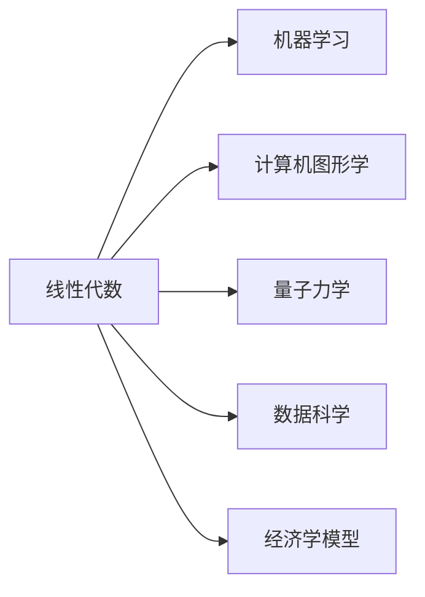

# 00 - 序言

## 视频信息

- **系列**: 线性代数的本质 (Essence of Linear Algebra)
- **来源**: [Bilibili](https://www.bilibili.com/video/BV1ys411472E)
- **3Blue1Brown原版**: [YouTube](http://bit.ly/2kDa5o0)

## 系列概述

> "线性代数的本质"系列将带你从**几何直观**的角度理解线性代数，而非仅仅记忆公式和计算步骤。

### 核心理念

传统线性代数教学往往：
- ❌ 从矩阵运算开始
- ❌ 强调计算技巧
- ❌ 缺乏几何直觉

本系列将展示：
- ✅ 向量的几何意义
- ✅ 矩阵作为线性变换
- ✅ 行列式的体积解释
- ✅ 特征向量的不变性

## 为什么要学线性代数？

## 学习路径预览

| 章节 | 核心概念 |
|------|---------|
| 01 | 向量 — 不仅仅是数字列表 |
| 02 | 线性组合与张成的空间 |
| 03 | 矩阵即线性变换 |
| 04 | 矩阵乘法的复合视角 |
| 05-06 | 行列式与逆矩阵 |
| 07 | 点积与对偶性 |
| 08 | 叉积的几何本质 |
| 09-12 | 基变换、特征值、抽象空间 |

## 关键洞察

> **"理解比计算更重要"**

当你能将抽象的代数表达式与直观的几何图像联系起来时，线性代数就从一门计算课程变成了一门视觉艺术。

## 学习建议

1. **边看边画** — 准备纸笔，跟着视频画向量、矩阵变换
2. **暂停思考** — 不要急于看完，每看完一集用自己的话复述
3. **建立联系** — 尝试将新概念与已学内容关联
4. **动手实现** — 用代码（Python/Matlab）复现视频中的可视化

---

*笔记整理中...*