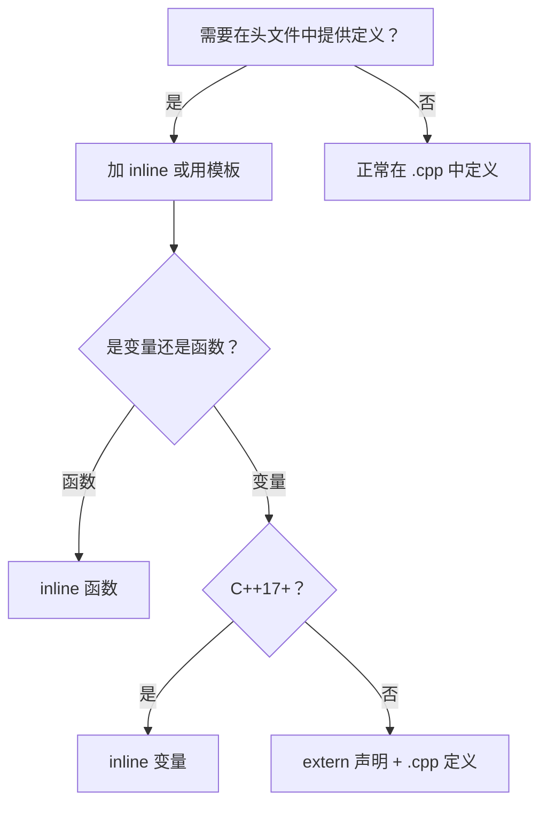

# C++ `inline` 关键字

## 两个截然不同的含义

> [!warning] 常见误解
> 很多人以为 `inline` 就是"让编译器把函数展开"，其实这只是它**历史上**的含义。现代 C++ 中，`inline` 最重要的语义是**解决 ODR（One Definition Rule）问题**。

`inline` 有两层语义，它们是**相互独立**的：

| 语义 | 含义 | 谁来决定 |
|------|------|---------|
| **展开提示** | 建议编译器在调用处展开函数体 | 编译器自行判断，可忽略 |
| **ODR 豁免** | 允许同一符号在多个翻译单元中有定义 | 链接器强制保证行为 |

---

## 一、内联展开（Inline Expansion）

### 什么是内联展开？

普通函数调用会产生以下开销：

```
调用方                 被调函数
  │                      │
  ├── 压栈参数 ──────────►│
  ├── call 指令 ─────────►│  执行函数体
  │◄─── ret 指令 ──────── │
  └── 恢复栈帧            │
```

**内联展开**将函数体直接复制到调用处，消除这些开销：

```cpp
// 源代码
inline int add(int a, int b) { return a + b; }
int result = add(1, 2);

// 编译器可能展开为：
int result = 1 + 2;  // 甚至直接得到 int result = 3;
```

### 编译器才是最终决策者

`inline` 只是一个**建议**，编译器可以：

- **忽略**：函数体过大、递归函数、虚函数等情况下不展开
- **反向内联**：即使你没写 `inline`，编译器也会主动展开小函数（尤其是开启 `-O2` 以上优化时）

> [!tip] 现代实践
> 现代编译器的内联决策比程序员更准确。不要依赖 `inline` 来追求性能，应该相信编译器的 LTO（链接时优化）和自动内联。

---

## 二、ODR 豁免（核心语义）

### 什么是 ODR？

C++ 的**单一定义规则（One Definition Rule）**规定：

- 一个符号在整个程序中只能有**一个定义**
- 声明可以有多个，定义只能有一个

### 问题场景

假设你在头文件中定义了一个函数，并在多个 `.cpp` 中包含它：

```
// utils.h
int square(int x) { return x * x; }  // ❌ 定义在头文件中

// a.cpp
#include "utils.h"   // 包含一次定义

// b.cpp
#include "utils.h"   // 又包含一次定义
```

链接时：`a.o` 和 `b.o` 都有 `square` 的定义 → **链接错误（multiple definition）**

### `inline` 的解决方案

```cpp
// utils.h
inline int square(int x) { return x * x; }  // ✅ 加上 inline

// a.cpp 和 b.cpp 都包含它也没问题
```

加上 `inline` 后，链接器得知：

1. 这个符号允许出现在多个翻译单元中
2. 所有定义**必须完全相同**
3. 链接器只保留其中一份，其余丢弃

### 与 `#pragma once` 的区别

> [!question] 可以用 `#pragma once` 代替 `inline` 吗？
> **不能。** 它们解决的是**不同层面**的问题。

| 机制 | 解决的问题 | 作用阶段 | 作用范围 |
|------|-----------|---------|---------|
| `#pragma once` | 同一 `.cpp` 内头文件被多次 `#include` | 预处理阶段 | 单个翻译单元 |
| `inline` | 多个 `.cpp` 链接时出现重复符号 | 链接阶段 | 整个程序 |

**场景对比：**

```
// a.cpp           // b.cpp
#include "utils.h"  #include "utils.h"
        ↓                  ↓
    a.o (有square)      b.o (有square)
           \              /
            \            /
            链接器 ld ←─── ❌ multiple definition!
```

`#pragma once` 只管得了预处理阶段的重复包含，**管不到链接阶段**两个 `.o` 文件的符号冲突。两者是**互补**关系：

```cpp
// utils.h
#pragma once          // ✅ 防止单个 .cpp 内重复包含
inline int square(int x) { return x * x; }  // ✅ 防止多 .cpp 链接冲突
```

实际工程中，头文件中的函数定义**两者都要写**。

### "完全相同"的陷阱

> [!warning] 编译器无法检查跨文件的 ODR 违规
> C++ 标准要求所有翻译单元中的 `inline` 函数定义**必须完全相同**，但**编译器和链接器都不会检查这一点**。

假设你犯了这样的错误：

```cpp
// a.cpp
inline int getValue() { return 42; }

// b.cpp
inline int getValue() { return 100; }  // ⚠️ 定义不同！但编译通过
```

链接时会发生什么？

```
翻译单元 a:        翻译单元 b:
┌─────────┐        ┌─────────┐
│ getValue│        │ getValue│
│ return 42│       │ return 100│
└────┬────┘        └────┬────┘
     │                  │
     ▼                  ▼
   a.o                b.o
     \\                /
      \\              /
       ▼            ▼
         链接器 ld
           │
           ▼
    ❓ 选哪个？随便挑一个...
```

**后果：**
- 链接器**任意选择**其中一个定义（通常是第一个遇到的）
- **没有警告，没有错误**
- 程序静默地产生**未定义行为（Undefined Behavior）**

**如何保证安全？**

| 正确做法 | 说明 |
|---------|------|
| ✅ 定义在头文件中 | 通过 `#include` 保证所有 `.cpp` 看到的是**同一份代码** |
| ✅ 使用 `constexpr` | 隐式 inline，且强制在头文件中定义 |
| ❌ 各 `.cpp` 分别手写 | 极易出错，**严禁这样做** |

---

## 三、`inline` 的使用场景

### 3.1 头文件中的函数定义

最经典的用法——在 `.h` / `.hpp` 中直接提供实现：

```cpp
// math_utils.h
inline double lerp(double a, double b, double t) {
    return a + (b - a) * t;
}
```

### 3.2 类内定义的成员函数（隐式 inline）

在类体内部定义的成员函数**自动具有 inline 语义**，无需显式写：

```cpp
class Circle {
public:
    double area() const { return 3.14159 * r_ * r_; }  // 隐式 inline
private:
    double r_;
};
```

### 3.3 模板函数（天然 inline）

模板函数必须在头文件中定义，因此天然地满足 inline 的 ODR 豁免需求（编译器自动处理）：

```cpp
// 模板本身就解决了 ODR 问题，无需额外加 inline
template<typename T>
T clamp(T val, T lo, T hi) {
    return val < lo ? lo : val > hi ? hi : val;
}
```

### 3.4 `inline` 变量（C++17）

C++17 将 `inline` 扩展到**变量**，解决全局常量在多个翻译单元中的 ODR 问题：

```cpp
// config.h（C++17）
inline constexpr int MAX_CONNECTIONS = 100;  // ✅ 多个 .cpp 包含也没问题
inline const std::string APP_NAME = "MyApp"; // ✅ 非 POD 类型也支持
```

> [!note] C++17 之前的做法
> ```cpp
> // 旧做法：在 .h 中声明，在 .cpp 中定义
> // config.h
> extern const int MAX_CONNECTIONS;
> // config.cpp
> const int MAX_CONNECTIONS = 100;
> ```

---

## 四、`__forceinline` 与编译器扩展

标准 `inline` 只是建议，各编译器提供了强制内联的扩展：

| 编译器         | 强制内联语法                           |
| ----------- | -------------------------------- |
| MSVC        | `__forceinline`                  |
| GCC / Clang | `__attribute__((always_inline))` |
| 跨平台宏        | 自定义宏封装                           |

```cpp
// 跨平台写法
#if defined(_MSC_VER)
    #define FORCE_INLINE __forceinline
#elif defined(__GNUC__) || defined(__clang__)
    #define FORCE_INLINE inline __attribute__((always_inline))
#else
    #define FORCE_INLINE inline
#endif

FORCE_INLINE int fast_abs(int x) {
    return x < 0 ? -x : x;
}
```

> [!warning] 谨慎使用强制内联
> 强制内联大函数会导致**代码膨胀（code bloat）**，可能因 i-cache 压力增大而**降低性能**。

---

## 五、常见误区总结

| 误区                     | 真相                    |
| ---------------------- | --------------------- |
| "`inline` 一定会展开函数"     | 只是建议，编译器可忽略           |
| "不写 `inline` 函数就不会被展开" | 编译器会主动内联小函数           |
| "`inline` 是性能优化手段"     | 主要作用是解决 ODR，现代编译器自动优化 |
| "类内函数需要显式写 `inline`"   | 类内定义自动具有 inline 语义    |
| "只有函数能用 `inline`"      | C++17 起变量也支持          |

---

## 六、决策流程



---

## 相关笔记

- [[C++编译过程原理]]
- [[静态库与动态库]]
