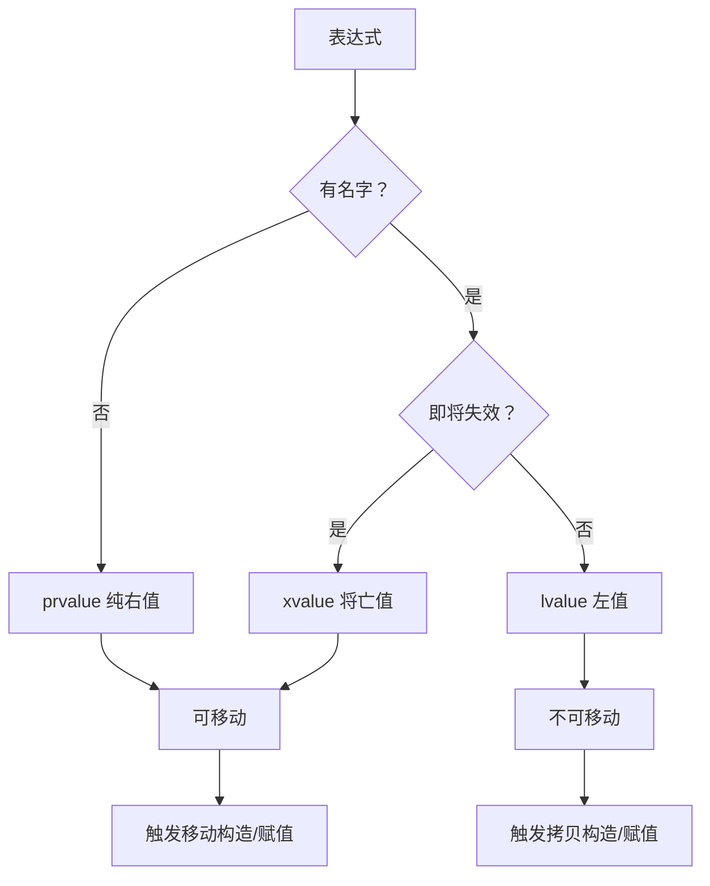

# C++ 值类别与移动语义

> [!info] 概述
> 值类别（Value Category）是 C++ 表达式的基本属性，决定了一个表达式是否可以被"移动"。移动语义（Move Semantics）建立在值类别之上，通过"窃取"临时对象的资源来消除不必要的拷贝，是 C++11 最重要的性能优化特性之一。
>
> 本文与 [[C++ 对象生存期与 RAII]] 密切相关——理解对象的生存期，有助于判断何时可以安全地移动一个对象。

---

## 一、值类别体系

### 1.1 C++11 的三分法

C++11 将所有表达式划分为三种基本值类别：

```
        表达式
       /      \
    glvalue   rvalue
    /    \   /    \
lvalue  xvalue  prvalue
```

| 值类别         | 全称                 | 特征                   |
| ----------- | ------------------ | -------------------- |
| **lvalue**  | left value         | 有名字，有持久地址，**不可移动**   |
| **prvalue** | pure rvalue        | 无名字，无持久地址，**可移动**    |
| **xvalue**  | expiring value     | 有地址，但**即将失效**，可移动    |
| **glvalue** | generalized lvalue | lvalue + xvalue，有地址  |
| **rvalue**  | right value        | xvalue + prvalue，可移动 |

> [!abstract] 判断口诀
> - **有名字、能取地址** → lvalue（左值）
> - **无名字、临时对象** → prvalue（纯右值）
> - **有地址、但即将失效**（如 `std::move(x)` 的结果）→ xvalue（将亡值）

### 1.2 各类别示例

```cpp
int x = 42;

// lvalue：有名字，能取地址
x;           // lvalue
"hello";     // lvalue（字符串字面量）
++x;         // lvalue（前置递增返回引用）

// prvalue：临时对象，无法取地址
42;          // prvalue（整数字面量）
x + 1;       // prvalue（算术表达式结果）
x++;         // prvalue（后置递增返回临时副本）
Widget{};    // prvalue（临时对象）

// xvalue：通过 std::move 或返回右值引用产生
std::move(x);             // xvalue
static_cast<int&&>(x);    // xvalue
```

### 1.3 为什么需要这么多类别？

> [!note] 核心问题
> C++ 需要区分"**可以移动**"和"**有身份（地址）**"这两个独立的属性：
>
> | | 有身份（glvalue） | 无身份（prvalue） |
> |---|---|---|
> | **不可移动** | lvalue | ——（不存在） |
> | **可移动** | xvalue | prvalue |
>
> xvalue 的存在是关键：它是"有地址但程序员显式声明放弃所有权"的值，`std::move` 的本质就是将 lvalue 转换为 xvalue。

### 1.4 类型（Type）与值类别（Value Category）的区别

这是两个**正交**的概念，容易混淆：

- **类型**（Type）：描述数据的结构，属于**编译期静态属性**，如 `int`、`int&`、`int&&`
- **值类别**（Value Category）：描述表达式的"行为特征"，决定**重载决议**和**移动语义**是否触发

同一个类型可以对应不同的值类别，同一个值类别也可以有不同的类型：

| 表达式 | 类型 | 值类别 |
|--------|------|--------|
| `x`（`int x = 42`） | `int` | lvalue |
| `42` | `int` | prvalue |
| `x + 1` | `int` | prvalue |
| `r`（`int&& r = 42`） | `int&&` | **lvalue**（有名字！） |
| `std::move(x)` | `int&&` | **xvalue** |

> [!note] 关键结论
> `std::move(x)` 的**类型**是 `int&&`（右值引用），其**值类别**是 xvalue。
> 说"返回右值引用"和"产生 xvalue"是同一件事的两种描述：
> - 从**类型系统**角度：返回 `T&&`
> - 从**值类别系统**角度：表达式是 xvalue
>
> 值类别才是驱动重载决议（选移动构造 vs 拷贝构造）的依据，因此笔记中优先使用值类别术语。

---

## 二、右值引用与移动语义

### 2.1 引用类型对比

```cpp
int x = 10;

int&  lref = x;         // 左值引用：只能绑定 lvalue
int&& rref = 42;        // 右值引用：只能绑定 rvalue（prvalue 或 xvalue）
int&& rref2 = std::move(x);  // xvalue，可以绑定到右值引用

const int& clref = 42;  // const 左值引用：可以绑定任意值（历史兼容）
```

> [!warning] 右值引用变量本身是 lvalue
> 这是最常见的误区：
> ```cpp
> int&& r = 42;
> // r 的类型是 int&&，但 r 作为表达式是 lvalue（它有名字，能取地址）
> // 因此不能直接将 r 传给接受 int&& 的函数
> void foo(int&&);
> foo(r);             // ❌ 编译错误！r 是 lvalue
> foo(std::move(r));  // ✅ 显式转为 xvalue
> ```

### 2.2 移动语义的动机

```cpp
// 没有移动语义时（C++03）：拷贝构造开销巨大
std::vector<int> makeVector() {
    std::vector<int> v(10000, 0);
    return v;  // 拷贝整个 vector！
}

auto v = makeVector();  // 再次拷贝

// 有移动语义（C++11）：窃取资源，O(1) 操作
// makeVector() 返回的是临时对象（prvalue），
// 移动构造函数"窃取"其内部数组指针，而非深拷贝
```

### 2.3 移动构造函数与移动赋值运算符

```cpp
class Buffer {
    size_t size_;
    int*   data_;

public:
    // 普通构造函数
    explicit Buffer(size_t size)
        : size_(size), data_(new int[size]) {}

    // 析构函数
    ~Buffer() { delete[] data_; }

    // 拷贝构造：深拷贝
    Buffer(const Buffer& other)
        : size_(other.size_), data_(new int[other.size_]) {
        std::copy(other.data_, other.data_ + size_, data_);
    }

    // 移动构造：窃取资源，O(1)
    Buffer(Buffer&& other) noexcept
        : size_(other.size_), data_(other.data_) {
        other.size_ = 0;
        other.data_ = nullptr;  // 置空，防止析构时 double-free
    }

    // 拷贝赋值
    Buffer& operator=(const Buffer& other) {
        if (this != &other) {
            delete[] data_;
            size_ = other.size_;
            data_ = new int[size_];
            std::copy(other.data_, other.data_ + size_, data_);
        }
        return *this;
    }

    // 移动赋值：窃取资源，O(1)
    Buffer& operator=(Buffer&& other) noexcept {
        if (this != &other) {
            delete[] data_;          // 释放自身原有资源
            size_ = other.size_;
            data_ = other.data_;     // 窃取
            other.size_ = 0;
            other.data_ = nullptr;   // 置空
        }
        return *this;
    }
};
```

> [!tip] 移动后的对象状态
> 移动后，原对象处于**有效但未指定（valid but unspecified）**状态：
> - 可以被析构（不会崩溃）
> - 可以被重新赋值
> - **不应该**再读取其值（行为未定义）
>
> 将 `data_` 置为 `nullptr` 是标准做法，确保析构函数中 `delete[] nullptr` 是安全的。

### 2.4 noexcept 的重要性

> [!warning] 移动操作必须声明 `noexcept`
> `std::vector` 等容器在重新分配内存时，只有当移动构造函数是 `noexcept` 的，才会使用移动而非拷贝。否则为了保证异常安全，它会退回到拷贝。
>
> ```cpp
> Buffer(Buffer&& other) noexcept { ... }      // ✅ vector 会移动
> Buffer(Buffer&& other)          { ... }      // ⚠️  vector 可能拷贝
> ```

---

## 三、std::move

### 3.1 std::move 的本质

`std::move` **不移动任何东西**，它只是一个类型转换：

```cpp
// std::move 的近似实现
template<typename T>
std::remove_reference_t<T>&& move(T&& t) noexcept {
    return static_cast<std::remove_reference_t<T>&&>(t);
}
```

它将任意值转换为 ==xvalue==（将亡值），从而触发重载决议选择移动构造/移动赋值。

```cpp
std::string a = "hello";
std::string b = std::move(a);  // a → xvalue，触发移动构造
// 之后 a 为空字符串，b 为 "hello"
```

### 3.2 何时使用 std::move

```cpp
// ✅ 场景1：将局部变量的所有权转移给容器
std::vector<std::string> words;
std::string word = "expensive string";
words.push_back(std::move(word));  // 避免拷贝

// ✅ 场景2：在移动构造/赋值中转移成员
class Wrapper {
    std::string name_;
    std::vector<int> data_;
public:
    Wrapper(Wrapper&& other) noexcept
        : name_(std::move(other.name_))   // 移动成员
        , data_(std::move(other.data_)) {}
};

// ✅ 场景3：返回局部变量（通常 RVO 更好，见下文）
std::unique_ptr<Widget> create() {
    auto p = std::make_unique<Widget>();
    return p;  // 编译器会自动移动，无需 std::move
}
```

> [!warning] 不要对返回值使用 std::move
> ```cpp
> // ❌ 错误：阻止了 NRVO（具名返回值优化）
> std::string bad() {
>     std::string s = "hello";
>     return std::move(s);  // 多此一举，反而可能更慢
> }
>
> // ✅ 正确：编译器自动应用 NRVO 或隐式移动
> std::string good() {
>     std::string s = "hello";
>     return s;
> }
> ```

---

## 四、完美转发与 std::forward

### 4.1 转发问题

```cpp
// 想写一个通用包装函数，将参数原样传给 process()
void process(Widget& w)  { /* 处理左值：只能拷贝，因为调用方还持有对象 */ }
void process(Widget&& w) { /* 处理右值：可以移动，因为调用方已放弃所有权 */ }

// ❌ 朴素实现：右值变成了左值
template<typename T>
void wrapper(T&& arg) {
    process(arg);  // arg 有名字，是 lvalue！永远调用左值版本
}

Widget w;
wrapper(w);            // 期望调用 process(Widget&)  ✅
wrapper(Widget{});     // 期望调用 process(Widget&&) ❌ 实际调用了左值版本
```

> [!note] 关于右值重载"效率更高"的说明
> 右值重载本身并不天然更高效，效率差异来自**函数体内部能做的事不同**：
> - 左值版本：调用方仍持有对象，只能拷贝（`store(w)`）
> - 右值版本：调用方已放弃所有权，可以移动（`store(std::move(w))`）
>
> ```cpp
> void process(Widget& w)  { storage_.push_back(w); }            // 深拷贝
> void process(Widget&& w) { storage_.push_back(std::move(w)); } // 移动，O(1)
> ```
>
> **实践中很少直接写 `void foo(T&&)` 重载**，这种模式主要出现在：
> 1. 标准库内部（如 `vector::push_back` 的两个重载）
> 2. 移动构造/移动赋值函数
> 3. 这里的 `process` 是教学用的人造场景，真实代码通常用**按值传递**代替两个重载（见 6.1 节 sink 参数模式）

### 4.2 引用折叠规则

#### 为什么会有"折叠"？

C++ 不允许在用户代码里写"引用的引用"：

```cpp
int x = 1;
int& &  r = x;   // ❌ 语法错误，用户代码中禁止
int&& && r = x;  // ❌ 同上
```

但是**模板实例化**会在内部产生这种情况。例如：

```cpp
template<typename T>
void wrapper(T&& arg);  // 注意：这里 T 是待推导的，不是具体类型

Widget w;
wrapper(w);  // T 被推导为 Widget&，于是函数签名变成 wrapper(Widget& &&)
             // "Widget& &&" 就是"引用的引用"，必须折叠成一种合法类型
```

**引用折叠（Reference Collapsing）** 就是编译器处理模板实例化中"引用的引用"的规则，将其归约为单一引用类型。

---

#### 四条折叠规则

两种引用各自与对方组合，共四种情况：

| 原始组合（内部） | 折叠后 | 记忆规则 |
|---------------|--------|---------|
| `T& &`        | `T&`   | `&` + `&` → `&` |
| `T& &&`       | `T&`   | `&` + `&&` → `&` |
| `T&& &`       | `T&`   | `&&` + `&` → `&` |
| `T&& &&`      | `T&&`  | `&&` + `&&` → `&&` |

> [!abstract] 一句话记忆
> **只要出现一个 `&`（左值引用），结果就是左值引用；必须两个都是 `&&` 才能得到右值引用。**

---

#### 何时触发折叠？

折叠发生的场景有三类，最重要的是第一类：

**① 模板类型推导中的万能引用（最常见）**

当函数模板参数写成 `T&&` 时，这个 `&&` 不是普通右值引用，而是**万能引用（Universal Reference / Forwarding Reference）**，可以绑定任意值类别：

```cpp
template<typename T>
void wrapper(T&& arg);
```

此时 T 的推导规则是：
- 传入**左值** `w`（类型 `Widget`）→ T 推导为 `Widget&`
- 传入**右值** `Widget{}`    → T 推导为 `Widget`（不带引用）

然后展开 `T&&`：

```
传入左值：T = Widget&   → T&& = Widget& && → 折叠 → Widget&
传入右值：T = Widget    → T&& = Widget&&              （无需折叠）
```

**② typedef / using 别名**

```cpp
using LRef = int&;
using RRef = int&&;

LRef&  a;   // int& &  → 折叠为 int&
LRef&& b;   // int& && → 折叠为 int&
RRef&  c;   // int&& & → 折叠为 int&
RRef&& d;   // int&& && → 折叠为 int&&
```

**③ decltype**

```cpp
int x = 1;
decltype(x)&&  r1;   // decltype(x) = int，r1 类型 = int&&
decltype((x))& r2;   // decltype((x)) = int&，r2 类型 = int& & → int&
```

---

#### 完整推导链：以 `wrapper(w)` 为例

下面逐步追踪一次调用的完整推导过程，把值类别、T 推导、引用折叠串联起来：

```
步骤①：调用方
  Widget w;
  wrapper(w);
  ↓ w 是 lvalue，类型为 Widget

步骤②：模板类型推导
  模板签名：void wrapper(T&& arg)
  规则：传入 lvalue 时，T 推导为 T 带左值引用
  → T = Widget&

步骤③：展开模板参数
  T&&  =  Widget& &&  （引用的引用，触发折叠）

步骤④：引用折叠
  Widget& &&  →  Widget&

步骤⑤：最终函数签名
  void wrapper(Widget& arg)
  arg 类型：Widget&（左值引用）
  arg 值类别：lvalue（有名字）
```

对比传入右值时：

```
wrapper(Widget{});
  ↓ Widget{} 是 prvalue

步骤②：T = Widget（无引用）
步骤③：T&& = Widget&&（无需折叠）
步骤⑤：void wrapper(Widget&& arg)
  arg 类型：Widget&&（右值引用）
  arg 值类别：lvalue（有名字！——这正是问题所在，见 4.1 节）
```

> [!note] 折叠之后，问题还没解决
> 折叠保证了 `arg` 的**类型**正确（左值传入得到 `Widget&`，右值传入得到 `Widget&&`）。
> 但 `arg` 作为表达式，值类别永远是 **lvalue**（因为它有名字）。
> 这就是为什么还需要 `std::forward`——它利用 T 中保存的信息，将 arg 恢复为原始的值类别。

### 4.3 std::forward 的实现

`std::forward` 正是利用引用折叠来完成"有条件转换"的：

```cpp
// std::forward 的近似实现
template<typename T>
T&& forward(std::remove_reference_t<T>& t) noexcept {
    return static_cast<T&&>(t);
}
```

代入两种情况，看 `static_cast<T&&>` 如何展开：

| 调用方式 | T 的值 | `T&&` 展开 | 折叠结果 | 效果 |
|---------|--------|-----------|---------|------|
| `forward<Widget&>(arg)` | `Widget&` | `Widget& &&` | `Widget&` | 保持左值 |
| `forward<Widget>(arg)` | `Widget` | `Widget&&` | `Widget&&` | 转为右值 |

T 中"藏着"原始调用时的值类别信息（左值 → T=`Widget&`，右值 → T=`Widget`），`std::forward` 通过引用折叠把这个信息还原成正确的 cast。

### 4.4 完美转发的正确写法

```cpp
// ✅ 完美转发：原样传递值类别
template<typename T>
void wrapper(T&& arg) {
    process(std::forward<T>(arg));  // 保留 arg 原来的值类别
}

Widget w;
wrapper(w);         // T=Widget&,  forward<Widget&>(arg)  → lvalue 传出
wrapper(Widget{});  // T=Widget,   forward<Widget>(arg)   → rvalue 传出
wrapper(std::move(w)); // T=Widget, forward<Widget>(arg)  → rvalue 传出
```

> [!tip] std::move vs std::forward
> | | `std::move` | `std::forward<T>` |
> |---|---|---|
> | 用途 | **无条件**转为右值 | **有条件**保留原值类别 |
> | 适用场景 | 明确放弃所有权 | 泛型函数转发参数 |
> | 需要模板参数 T | 否 | 是 |

### 4.5 完美转发的典型应用

```cpp
// 工厂函数：完美转发构造参数
template<typename T, typename... Args>
std::unique_ptr<T> make_unique(Args&&... args) {
    return std::unique_ptr<T>(new T(std::forward<Args>(args)...));
}

// emplace 系列函数的原理
std::vector<Widget> v;
v.emplace_back(arg1, arg2);  // 在容器内原地构造，无拷贝/移动
```

---

## 五、特殊成员函数的生成规则

### 5.1 五法则（Rule of Five）

C++11 起，若定义了以下任一特殊成员函数，通常需要显式定义全部五个：

1. 析构函数
2. 拷贝构造函数
3. 拷贝赋值运算符
4. **移动构造函数**（C++11 新增）
5. **移动赋值运算符**（C++11 新增）

```cpp
class Resource {
public:
    ~Resource();                                    // 1. 析构
    Resource(const Resource&);                      // 2. 拷贝构造
    Resource& operator=(const Resource&);           // 3. 拷贝赋值
    Resource(Resource&&) noexcept;                  // 4. 移动构造
    Resource& operator=(Resource&&) noexcept;       // 5. 移动赋值
};
```

### 5.2 零法则（Rule of Zero）

> [!tip] 最佳实践：优先零法则
> 如果可以，**不要定义任何特殊成员函数**，让编译器自动生成。
> 通过使用 [[C++ 对象生存期与 RAII|RAII 封装类]]（如智能指针、`std::string`、`std::vector`），成员的特殊函数会自动组合出正确行为：
>
> ```cpp
> // ✅ 零法则：编译器自动生成所有特殊成员函数
> class Widget {
>     std::string name_;
>     std::vector<int> data_;
>     std::unique_ptr<Impl> pImpl_;
>     // 无需手写任何特殊成员函数！
> };
> ```

### 5.3 自动生成规则速查

| 用户定义了 | 默认构造 | 拷贝构造 | 拷贝赋值 | 移动构造 | 移动赋值 | 析构 |
|-----------|--------|--------|--------|--------|--------|------|
| 无 | 生成 | 生成 | 生成 | 生成 | 生成 | 生成 |
| 析构函数 | 生成 | 生成⚠️ | 生成⚠️ | **不生成** | **不生成** | — |
| 拷贝构造 | **不生成** | — | 生成⚠️ | **不生成** | **不生成** | 生成 |
| 移动构造 | **不生成** | **删除** | **删除** | — | **不生成** | 生成 |

> [!warning] ⚠️ 标记表示"已废弃的隐式生成"
> 定义了析构函数后，编译器仍会生成拷贝操作，但这是历史遗留行为（deprecated）。正确做法是遵循五法则或零法则，显式 `= default` / `= delete`。

### 5.4 违反五法则的后果

> [!danger] 三类典型后果
> 1. **未定义行为（UB）**：double-free、use-after-free、内存踩踏
> 2. **悄悄退化为拷贝**：移动变成深拷贝，性能崩溃但编译器不报错
> 3. **编译错误**：拷贝/移动操作被隐式删除，代码无法通过编译

#### 后果一：double-free（只定义析构，遗漏拷贝构造）

```cpp
class Buffer {
    int* data_;
public:
    Buffer(size_t n) : data_(new int[n]) {}
    ~Buffer() { delete[] data_; }
    // ❌ 未定义拷贝构造：编译器生成浅拷贝（逐成员复制原始指针）
};

Buffer a(10);
{
    Buffer b = a;  // 浅拷贝：b.data_ == a.data_，指向同一块内存
}                  // b 析构 → delete[] b.data_，内存已释放
// a 析构 → delete[] a.data_ → ❌ double-free！程序崩溃或静默损坏堆
```

#### 后果二：移动退化为深拷贝（有析构和拷贝，无移动）

```cpp
class Buffer {
    size_t size_;
    int*   data_;
public:
    Buffer(size_t n) : size_(n), data_(new int[n]) {}
    ~Buffer()              { delete[] data_; }
    Buffer(const Buffer& o): size_(o.size_), data_(new int[o.size_]) {
        std::copy(o.data_, o.data_ + size_, data_);
    }
    Buffer& operator=(const Buffer& o) { /* 深拷贝 */ return *this; }
    // ❌ 定义了析构 + 拷贝 → 编译器不再自动生成移动操作
};

std::vector<Buffer> v;
v.push_back(Buffer(1'000'000));  // ⚠️ 期望移动构造 O(1)，实际深拷贝 O(n)！
                                  // 编译通过，性能崩溃，无任何警告
```

> [!warning] 为什么移动消失了？
> 根据 5.3 的生成规则：**一旦用户定义了析构函数，编译器就不再生成移动操作**。
> 所有针对该类型的"移动"请求都静默退化为拷贝。`std::vector` 扩容时也一样——每次 rehash 都是 O(n) 深拷贝，整体复杂度从 O(n) 变为 O(n²)。

#### 后果三：拷贝被隐式删除（只定义移动，无拷贝）

```cpp
class UniqueHandle {
    int fd_;
public:
    UniqueHandle(int fd) : fd_(fd) {}
    ~UniqueHandle() { close(fd_); }
    UniqueHandle(UniqueHandle&& o) noexcept : fd_(o.fd_) { o.fd_ = -1; }
    UniqueHandle& operator=(UniqueHandle&& o) noexcept { /* ... */ return *this; }
    // ❌ 定义了移动操作 → 编译器隐式删除拷贝构造和拷贝赋值
};

UniqueHandle h1(open("file.txt", O_RDONLY));
UniqueHandle h2 = h1;       // ❌ 编译错误：use of deleted function
std::vector<UniqueHandle> v;
v.push_back(h1);            // ❌ 同上，push_back 需要可拷贝
```

> [!note] 有时这是刻意为之
> `std::unique_ptr` 正是利用此机制——定义移动、删除拷贝，在**编译期**强制独占所有权。
> 但如果你的类本应可以拷贝，忘记定义拷贝构造就是 bug。

#### 后果四：移动赋值缺失，赋值场景退化为深拷贝

```cpp
class Buffer {
    size_t size_;
    int*   data_;
public:
    Buffer(size_t n);
    ~Buffer();
    Buffer(const Buffer&);           // ✅ 定义了拷贝构造
    Buffer& operator=(const Buffer&);// ✅ 定义了拷贝赋值
    Buffer(Buffer&&) noexcept;       // ✅ 定义了移动构造
    // ❌ 忘记定义移动赋值！编译器不会自动生成
};

Buffer a(100), b(200);
a = std::move(b);  // ⚠️ 期望移动赋值 O(1)，实际调用拷贝赋值 O(n)
                   // 且 b 的资源未被清空，存在 double-free 风险
```

> [!tip] 快速修复
> 若资源管理逻辑相同，可用 `= default` 让编译器补齐缺失的函数，或用零法则改用 RAII 成员，彻底避免手写五法则。

---

## 六、实践：何时移动，何时拷贝

### 6.1 函数参数传递策略

```cpp
// 只读：传 const 引用
void read(const std::string& s);

// 修改但不获取所有权：传左值引用
void modify(std::string& s);

// 获取所有权（sink 参数）：传值，让调用者决定移动还是拷贝
void sink(std::string s) {
    store(std::move(s));  // 内部移动
}

// 调用方式
sink(lvalue);            // 拷贝一次，再移动一次
sink(std::move(lvalue)); // 移动两次（代价极低）
sink("literal");         // 移动一次（字符串字面量构造临时对象）
```

### 6.2 返回值策略

```cpp
// ✅ 直接返回局部变量：编译器应用 NRVO
std::vector<int> makeVec() {
    std::vector<int> v;
    v.push_back(1);
    return v;  // NRVO：直接在返回位置构造，零拷贝
}

// ✅ 条件返回：NRVO 失效，但编译器会隐式 move
std::string getName(bool flag) {
    std::string a = "Alice";
    std::string b = "Bob";
    return flag ? a : b;  // 无法 NRVO，但会隐式 move（C++20 保证）
}
```

### 6.3 隐式移动的触发规则

返回局部变量时，编译器按以下优先级处理：

```
1. NRVO（具名返回值优化）  →  零开销，直接在调用方内存构造
2. 隐式移动               →  调用移动构造，O(1)
3. 拷贝构造               →  最差情况，深拷贝
```

**核心触发条件**（C++11 起）：`return` 语句中的表达式必须满足：

1. 是一个**具名局部变量**（不是参数、全局变量、成员变量）
2. 类型与返回类型**相同**（或基类关系，C++20 放宽）
3. **没有写 `std::move()`**（写了反而阻止 NRVO）

```cpp
std::string f1() {
    std::string s = "hello";
    return s;          // ✅ NRVO 优先，失败则隐式移动
}

std::string f2(std::string s) {
    return s;          // ✅ 函数参数也支持隐式移动（C++11）
}

std::string f3() {
    std::string* p = new std::string("hi");
    return *p;         // ❌ 解引用不是局部变量，只能拷贝
}

Base f4() {
    Derived d;
    return d;          // ✅ C++20 起支持派生类→基类的隐式移动
                       // C++17 及之前：拷贝
}
```

> [!note] NRVO 与隐式移动的区别
> | | NRVO | 隐式移动 |
> |---|---|---|
> | 本质 | 省略构造，原地构造 | 调用移动构造函数 |
> | 开销 | 零 | O(1) |
> | 触发时机 | 编译器能静态确定返回哪个对象 | NRVO 不适用时的兜底 |
>
> **NRVO 失效场景**（退化为隐式移动）：
> ```cpp
> // 多路径返回：编译器不知道返回哪个对象
> std::string getName(bool flag) {
>     std::string a = "Alice", b = "Bob";
>     return flag ? a : b;  // NRVO 失效，隐式移动
> }
>
> // 返回容器元素：不是局部变量
> std::string getFromMap(std::map<int,std::string>& m) {
>     return m[0];  // ❌ 只能拷贝
> }
> ```

> [!question] if 分支、switch/case 也会触发隐式移动吗？
> **会**。隐式移动的触发条件与控制流结构**无关**，只看 `return` 语句本身。
> `if`、`switch/case`、三目运算符均等效：
>
> ```cpp
> std::string foo(bool flag) {
>     std::string s = "hello";
>     if (flag)
>         return s;  // ✅ 隐式移动，等同于 return std::move(s)
>     return std::string("world");
> }
>
> std::string bar(int x) {
>     std::string s = "result";
>     switch (x) {
>         case 1: return s;  // ✅ 隐式移动
>         case 2: return s;  // ✅ 隐式移动
>         default: return std::string("other");
>     }
> }
> ```
>
> 真正受控制流影响的是 **NRVO**，而非隐式移动：
>
> | 情况 | NRVO | 隐式移动 |
> |------|------|---------|
> | 所有分支返回同一变量 | ✅ 通常触发 | ✅ |
> | 不同分支返回不同变量 | ❌ 编译器放弃 | ✅ 仍然触发 |
> | 返回函数参数 | ❌ | ✅（C++11 起） |
>
> 因此即使 NRVO 因多分支失效，**隐式移动依然保底**，不会退化为拷贝。

**各 C++ 版本的演进**：

| 版本 | 新增支持 |
|------|---------|
| C++11 | 具名局部变量隐式移动 |
| C++14 | 明确函数参数也支持 |
| C++17 | prvalue 强制省略（RVO 成为语言规则而非优化） |
| C++20 | 派生类返回基类、右值引用局部变量 |
| C++23 | 进一步放宽，更多表达式支持隐式移动 |

> [!tip] 实践结论
> - **局部变量 `return s`** → 几乎总是 NRVO 或隐式移动，无需手写 `std::move`
> - **写 `return std::move(s)`** → 阻止 NRVO，强制走移动构造，通常更慢
> - **不是局部变量**（解引用、容器元素、成员变量）→ 拷贝，除非显式写 `std::move`

---

## 七、常见陷阱

### 7.1 移动后继续使用

```cpp
std::string s = "hello";
std::string t = std::move(s);
std::cout << s;  // ⚠️ 未定义行为！s 已被移动
// 正确：可以重新赋值
s = "world";     // ✅ 重新赋值后可以使用
```

### 7.2 在 const 对象上 move

```cpp
const std::string s = "hello";
std::string t = std::move(s);  // ⚠️ 实际上调用了拷贝构造！
// const 对象无法绑定到 string&&，
// 但可以绑定到 const string&（拷贝构造参数）
```

### 7.3 循环中的移动

两个例子的**循环代码本身写法相同**，区别在于循环结束后程序员是否还会使用 `items`。

```cpp
std::vector<std::string> items = {"a", "b", "c"};

// ❌ 错误：循环移走了所有元素，却在循环后继续使用 items
for (auto& item : items) {
    process(std::move(item));
    // 每次迭代：item 的内容被"窃取"，该元素变成空字符串 ""
    // 循环结束后：items = {"", "", ""}，所有元素均已清空
}
// 错误就在这里 ↓ 程序员误以为 items 里还有数据
for (auto& item : items) {
    std::cout << item << "\n";  // 输出：""  ""  ""  ← 全是空！
}
// 或者：
std::string first = items[0];  // first = ""，而不是 "a"
```

> [!warning] 为什么 items 里的元素会变成空字符串？
> `std::move(item)` 把 `item` 的值类别转为 xvalue，触发 `std::string` 的**移动构造**。
> 移动构造会"窃取"字符串内部的堆内存指针，并将原字符串的指针置为空。
> 因此每次循环后，`items[i]` 变为空字符串，而不是保留原来的值。

```cpp
// ✅ 正确：明确知道这是"消耗"操作，循环后不再使用 items
for (auto& item : items) {
    sink(std::move(item));  // 每个元素只移动一次，没有问题
}
// 承诺：循环结束后不再读取 items 中的元素
// （可以选择性地清空，表明意图）
items.clear();
```

> [!note] 核心区别
> 两个例子的循环代码几乎一样，**区别只在于程序员的意图**：
>
> | | ❌ 错误 | ✅ 正确 |
> |---|---|---|
> | 循环写法 | `std::move(item)` | `std::move(item)` |
> | 循环后的 items | 全是空字符串 | 全是空字符串（相同！） |
> | 程序员的误解 | 以为 items 还有数据，继续使用 | 知道 items 已被消耗，不再使用 |
> | 结果 | bug：读到空字符串 | 正确：资源被安全转移 |

---

## 八、总结



| 概念 | 要点 |
|------|------|
| **lvalue** | 有名字，能取地址，不可直接移动 |
| **rvalue** | 临时或将亡，可移动（xvalue + prvalue） |
| **std::move** | 无条件转为 xvalue，触发移动语义 |
| **std::forward** | 有条件转发，保留原值类别，用于泛型 |
| **移动语义** | 窃取资源而非深拷贝，O(1) 而非 O(n) |
| **noexcept** | 移动操作必须声明，容器才会真正使用移动 |
| **五法则** | 定义析构就要定义五个，或用零法则避免 |

> [!tip] 核心原则
> - **有疑问时不要 move**：编译器的 RVO/NRVO 通常比手动 `std::move` 更优
> - **拥有资源才能 move**：借用（引用/裸指针）不应该移动他人的资源
> - **move 后置空**：移动构造/赋值后将原对象置于有效的空状态

---

## 相关笔记

- [[C++ 对象生存期与 RAII]] — 对象生存期与所有权模型，移动语义的应用场景
- [[C++ explicit 关键字]] — 防止隐式类型转换，与移动/拷贝构造相关
