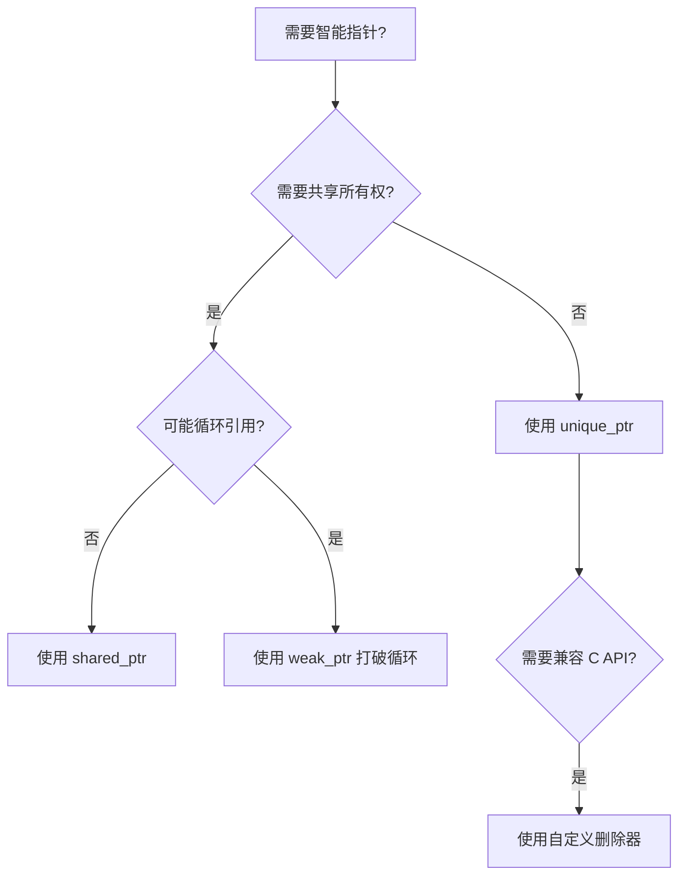

# C++ 对象生存期与 RAII

> [!info] 概述
> 对象生存期（Object Lifetime）是 C++ 核心概念之一，理解它对于编写安全、高效的代码至关重要。RAII（Resource Acquisition Is Initialization）是 C++ 管理资源的标准范式，它将资源生命周期与对象生命周期绑定，确保资源正确释放。

---

## 一、对象生存期基础

### 1.1 什么是对象生存期

对象生存期指**对象从构造完成到析构开始**的时间段。在此期间：

- 对象占用内存
- 可以安全地访问其成员
- 对象具有确定的类型和状态

```cpp
{
    std::string s = "hello";  // 构造开始 → 生存期开始
    // s 处于生存期内，可以安全使用
}  // 块结束 → 调用析构函数 → 生存期结束
```

### 1.2 存储期（Storage Duration）与生存期的关系

| 存储期类型 | 生存期特点     | 典型场景                 |
| ----- | --------- | -------------------- |
| 自动存储期 | 随代码块开始/结束 | 局部变量                 |
| 静态存储期 | 程序整个运行期间  | 全局变量、`static` 局部变量   |
| 动态存储期 | 由程序员控制    | `new`/`delete` 分配的对象 |
| 线程存储期 | 线程整个运行期间  | `thread_local` 变量    |

> [!note] 关键区别
> **存储期**决定内存何时分配/释放，**生存期**决定对象何时可用。两者通常一致，但在某些情况下（如联合体成员、动态内存）可能不同。

### 1.3 所有权（Ownership）概念

> [!abstract] 所有权的本质
> **所有权 = 谁负责释放这个资源？**
>
> 注意区分两个概念：
> - **访问权**：可以读写这个资源（任何人都可以有）
> - **所有权**：必须在用完后销毁/释放资源（只有所有者承担这个责任）

对一个资源的使用者，有三种角色：

| 角色 | 责任 | C++ 表示 |
| --- | --- | --- |
| **所有者（Owner）** | 负责最终释放 | `unique_ptr`、`shared_ptr`、值类型 |
| **借用者（Borrower）** | 使用但不释放 | `T&`、`const T&`、`T*`（非拥有） |
| **观察者（Observer）** | 观察，随时可能失效 | `weak_ptr` |

为什么 C++ 需要显式思考所有权？

| 语言 | 所有权如何解决 |
| --- | --- |
| C | 程序员全手动，容易出错 |
| Java / Python | 垃圾收集器全包，有运行时开销 |
| **C++** | **编译期通过类型系统表达，零运行时开销** |

```cpp
// 裸指针：所有权不明确，容易出错
Widget* create() { return new Widget(); }  // 谁来 delete？

// 用类型明确所有权意图
std::unique_ptr<Widget> create();          // 返回值接收者拥有它
void use(Widget* w);                       // 借用，不拥有，不负责释放
void use(Widget& w);                       // 借用，不拥有，不负责释放
void take(std::unique_ptr<Widget> w);      // 接管所有权，负责释放
```

> [!tip] 判断所有权的四个问题
> 1. 这个资源最终由谁来 `delete` / `fclose` / `free`？
> 2. 如果代码提前 `return` 或抛出异常，资源还能被释放吗？
> 3. 有没有两处代码都以为自己是所有者？（→ 双重释放）
> 4. 有没有谁都不认为自己是所有者？（→ 资源泄漏）

RAII 和智能指针正是将**"释放责任"编码进对象的析构函数**，让编译器和作用域自动保证所有权规则的执行。

---

## 二、RAII 核心原则

### 2.1 什么是 RAII

**R**esource **A**cquisition **I**s **I**nitialization（资源获取即初始化）

> [!abstract] 核心思想
> 将**资源的生命周期**绑定到**对象的生命周期**：
> - 构造函数中获取资源
> - 析构函数中释放资源

```cpp
// 传统 C 风格（容易出错）
void badExample() {
    FILE* f = fopen("file.txt", "r");
    // ... 如果这里提前 return 或抛出异常 → 资源泄漏！
    fclose(f);  // 必须记得手动释放
}

// RAII 风格（C++ 推荐）
class FileHandle {
    FILE* file_;
public:
    explicit FileHandle(const char* path) 
        : file_(fopen(path, "r")) {
        if (!file_) throw std::runtime_error("打开失败");
    }
    
    ~FileHandle() { 
        if (file_) fclose(file_);  // 析构时自动释放
    }
    
    // 禁止拷贝，允许移动
    FileHandle(const FileHandle&) = delete;
    FileHandle& operator=(const FileHandle&) = delete;
    
    FileHandle(FileHandle&& other) noexcept : file_(other.file_) {
        other.file_ = nullptr;
    }
    
    FILE* get() const { return file_; }
};

void goodExample() {
    FileHandle file("file.txt");  // 获取资源
    // ... 任意代码，包括 return、异常
}  // 离开作用域，自动调用析构函数释放资源
```

> [!tip] 为什么构造函数要加 `explicit`？
> `FileHandle` 的构造函数使用了 `explicit`，这会禁止编译器将 `const char*` **隐式转换**为 `FileHandle`。
> 对于 RAII 资源管理类，构造函数往往有**副作用**（如打开文件、分配内存），不应悄悄发生。
> - ❌ 不加 `explicit`：`useFile("file.txt")` 会隐式打开文件，行为出乎意料
> - ✅ 加 `explicit`：必须写 `useFile(FileHandle("file.txt"))`，意图清晰
>
> 详见 [[C++ explicit 关键字]]。

### 2.2 RAII 的优势

| 优势       | 说明               |
| -------- | ---------------- |
| **异常安全** | 即使发生异常，析构函数仍会被调用 |
| **代码简洁** | 无需在多个出口点手动释放资源   |
| **异常中立** | 不干扰异常传播          |
| **可组合**  | 资源管理对象可以嵌套使用     |

---

## 三、智能指针：RAII 的最佳实践

### 3.1 为什么需要智能指针

```cpp
// 裸指针的问题
void rawPointerProblems() {
    Widget* w = new Widget();
    
    // 问题1：忘记 delete
    if (earlyExitCondition) return;  // 泄漏！
    
    // 问题2：重复 delete
    delete w;
    delete w;  // 未定义行为！
    
    // 问题3：delete 后继续使用
    w->doSomething();  // 悬空指针，未定义行为！
}
```

### 3.2 std::unique_ptr：独占所有权

```cpp
#include <memory>

// ✅ 创建 unique_ptr
auto ptr = std::make_unique<Widget>(args...);

// ✅ 访问成员
ptr->doSomething();
(*ptr).doSomething();

// ✅ 获取裸指针（不转移所有权）
Widget* raw = ptr.get();

// ✅ 释放所有权（谨慎使用）
Widget* released = ptr.release();  // 需要手动 delete released

// ✅ 重置（释放原对象，接管新对象）
ptr.reset();           // 释放原对象，置为 nullptr
ptr.reset(newPtr);     // 释放原对象，接管新对象

// ✅ 转移所有权
std::unique_ptr<Widget> ptr2 = std::move(ptr);  // ptr 变为空
```

> [!warning] 不要 `delete` 由 `get()` 获取的裸指针
> `ptr.get()` 仅用于**借用**，所有权仍在智能指针。对其调用 `delete` 会导致**双重释放（double-free）**，这是未定义行为。
> `get()` 的唯一合法用途是将指针传给**不接管所有权**的函数（如 C API）：
> ```cpp
> void c_api(Widget* w);  // 不 delete
> c_api(ptr.get());       // ✅ 借用，ptr 仍然负责释放
> ```
> 若需转移所有权，应使用 `ptr.release()` 或 `std::move(ptr)`。

> [!tip] 最佳实践
> **优先使用 `std::make_unique`**（C++14 起），它更高效且异常安全。

#### unique_ptr 的应用场景

```cpp
// 场景1：工厂函数返回资源
std::unique_ptr<DatabaseConnection> createConnection() {
    auto conn = std::make_unique<DatabaseConnection>();
    conn->connect();
    return conn;  // 移动语义，无拷贝开销
}

// 场景2：PIMPL 惯用法
class Widget {
    class Impl;  // 前置声明
    std::unique_ptr<Impl> pImpl;  // 编译防火墙
public:
    Widget();
    ~Widget();  // 必须在 .cpp 中定义，因 Impl 不完整
    // ...
};

// 场景3：动态数组
auto buffer = std::make_unique<char[]>(1024);
```

### 3.3 std::shared_ptr：共享所有权

```cpp
// ✅ 创建 shared_ptr
auto ptr1 = std::make_shared<Widget>(args...);  // 推荐
auto ptr2 = std::shared_ptr<Widget>(new Widget(args...));  // 次选

// ✅ 拷贝增加引用计数
auto ptr3 = ptr1;  // 引用计数 = 2
auto ptr4 = ptr1;  // 引用计数 = 3

// ✅ reset 减少引用计数
ptr1.reset();  // 引用计数 = 2，ptr1 变为空

// ✅ 获取引用计数
size_t count = ptr2.use_count();  // 当前引用计数（仅用于调试）
```

#### shared_ptr 的内存布局

```cpp
// make_shared 的优势：一次分配
auto ptr = std::make_shared<Widget>();
// 内存布局： [控制块 + Widget对象] 连续存储

// 对比：两次分配
auto ptr = std::shared_ptr<Widget>(new Widget());
// 分配1：控制块（引用计数）
// 分配2：Widget 对象
// 内存不连续，多一次分配开销
```

> [!info] 为什么会有两次分配？
> `shared_ptr` 内部由两部分组成：
> - **控制块（Control Block）**：存储引用计数、弱引用计数、删除器等元数据
> - **被管理的对象**：`Widget` 本身
>
> 使用 `shared_ptr<Widget>(new Widget())` 时：
> 1. `new Widget()` 先在堆上分配 Widget 对象（第一次分配）
> 2. `shared_ptr` 构造时，再单独申请一块内存存放控制块（第二次分配）
>
> 两块内存各自独立，地址**不连续**：
> ```
> 堆内存：
> ┌──────────────────┐        ┌──────────────────────┐
> │   控制块          │        │   Widget 对象          │
> │  use_count: 1    │──ptr──▶│   (业务数据)           │
> │  weak_count: 0   │        └──────────────────────┘
> └──────────────────┘
>    （某个地址）                  （另一个地址）
> ```
>
> 而 `make_shared` 一次性申请 `sizeof(控制块) + sizeof(Widget)` 的连续空间：
> ```
> 堆内存（一整块）：
> ┌──────────────────┬──────────────────────┐
> │   控制块          │   Widget 对象          │
> │  use_count: 1    │   (业务数据)           │
> │  weak_count: 0   │                      │
> └──────────────────┴──────────────────────┘
>          地址连续，缓存友好
> ```
>
> **连续存储的优势**：减少 `malloc` 调用次数；控制块与对象数据相邻，访问时减少 cache miss；减少堆碎片。
>
> **`make_shared` 的权衡**：控制块与对象合并分配，即使所有 `shared_ptr` 销毁，只要还有 `weak_ptr` 存在，控制块就无法释放，**对象内存也随之无法释放**（因为是同一块）。对象很大且弱引用生命期很长时需注意。

> [!warning] 注意性能
> - `shared_ptr` 有引用计数的原子操作开销
> - 避免不必要的拷贝，使用 `const std::shared_ptr<T>&` 传参
> - 循环引用会导致内存泄漏

### 3.4 std::weak_ptr：打破循环引用

```cpp
// 循环引用问题示例
struct Node {
    std::shared_ptr<Node> next;  // 循环引用！
    ~Node() { std::cout << "Node destroyed\n"; }
};

auto a = std::make_shared<Node>();
auto b = std::make_shared<Node>();
a->next = b;
b->next = a;  // 循环引用！引用计数永远不为0，内存泄漏

// ✅ 解决方案：使用 weak_ptr
struct Node {
    std::weak_ptr<Node> next;  // 弱引用，不增加引用计数
    ~Node() { std::cout << "Node destroyed\n"; }
};

// 使用 weak_ptr
std::weak_ptr<Widget> weak = sharedPtr;

if (auto locked = weak.lock()) {  // 尝试提升为 shared_ptr
    // 提升成功，对象仍然存在
    locked->doSomething();
} else {
    // 对象已被销毁
}
```

### 3.5 智能指针选择指南



| 智能指针 | 所有权 | 拷贝 | 适用场景 |
|---------|-------|------|---------|
| `unique_ptr` | 独占 | 不可拷贝，可移动 | 默认选择，大多数情况 |
| `shared_ptr` | 共享 | 可拷贝 | 需要多个所有者 |
| `weak_ptr` | 无 | 可拷贝 | 观察者模式、缓存、打破循环 |

---

## 四、常见陷阱与最佳实践

### 4.1 避免裸指针所有权

```cpp
// ❌ 不要：裸指针拥有资源
void process(Widget* w) {  // 谁负责 delete？
    // ...
}

// ✅ 推荐：明确所有权语义
void process(std::unique_ptr<Widget> w);  // 转移所有权
void process(const Widget& w);            // 借用，不拥有
void process(Widget* w);                  // 非拥有（原始观察指针）
```

### 4.2 不要混合使用裸指针和智能指针

```cpp
// ❌ 严重错误：重复释放
Widget* raw = new Widget();
std::shared_ptr<Widget> p1(raw);
std::shared_ptr<Widget> p2(raw);  // 两个独立的控制块！
// p1 和 p2 都会 delete raw → 未定义行为

// ✅ 正确做法
auto p1 = std::make_shared<Widget>();
std::shared_ptr<Widget> p2 = p1;  // 共享同一控制块

// ✅ 如果必须从裸指针创建
Widget* raw = createWidget();  // 工厂返回裸指针
std::shared_ptr<Widget> p(raw);  // 只包装一次
```

### 4.3 不要在构造函数中暴露 this

> [!info] 什么是 `enable_shared_from_this`？
> 在成员函数内需要将 `this` 作为 `shared_ptr` 传出时，直接写 `shared_ptr<T>(this)` 会创建**独立的控制块**，与原有 `shared_ptr` 互不知情，最终 double-free。
>
> 继承 `std::enable_shared_from_this<T>` 后，对象被 `shared_ptr` 接管时会在内部存一个 `weak_ptr` 指向自己，`shared_from_this()` 从中提升，**共享同一控制块**。
>
> 构造函数中不可用的原因：此时对象还未被任何 `shared_ptr` 接管，内部 `weak_ptr` 为空，调用会抛 `std::bad_weak_ptr`，需改用工厂方法（见下方示例）。

```cpp
// ❌ 危险：shared_from_this 在构造函数中不可用
class Bad : public std::enable_shared_from_this<Bad> {
public:
    Bad() {
        registerCallback(shared_from_this());  // 崩溃！对象还未被 shared_ptr 管理
    }
};

// ✅ 解决方案：使用工厂方法
class Good : public std::enable_shared_from_this<Good> {
    Good() = default;
public:
    static std::shared_ptr<Good> create() {
        auto ptr = std::shared_ptr<Good>(new Good());
        ptr->registerCallback(ptr->shared_from_this());
        return ptr;
    }
};
```

### 4.4 自定义删除器

> [!info] `unique_ptr` 的两个模板参数
> `unique_ptr` 完整签名为：
> ```cpp
> template<typename T, typename Deleter = std::default_delete<T>>
> class unique_ptr;
> ```
> - **第一个参数** `T`：被管理的对象类型
> - **第二个参数** `Deleter`：释放资源时调用的删除器，默认是 `delete`
>
> 对于 `FILE*` 这类 C 资源，默认的 `delete` 是未定义行为，必须换成 `fclose`，因此需要指定第二个参数：
> ```cpp
> std::unique_ptr<FILE, CDeleter>   // 用 CDeleter 代替默认的 delete
> std::unique_ptr<int>              // 等价于 unique_ptr<int, default_delete<int>>
> ```

```cpp
// C API 资源管理
struct CDeleter {
    void operator()(FILE* f) const {
        if (f) fclose(f);
    }
};

std::unique_ptr<FILE, CDeleter> openFile(const char* path) {
    return std::unique_ptr<FILE, CDeleter>(fopen(path, "r"));
}

// C++11 lambda 删除器
auto fileDeleter = [](FILE* f) { if (f) fclose(f); };
std::unique_ptr<FILE, decltype(fileDeleter)> file(
    fopen("test.txt", "r"), 
    fileDeleter
);

// C++14 更简洁
auto file = std::unique_ptr<FILE, decltype([](FILE* f){ fclose(f); })>(
    fopen("test.txt", "r")
);
```

### 4.5 异常安全与函数参数

```cpp
// ❌ 问题：异常不安全
void process(std::unique_ptr<Widget> a, std::unique_ptr<Widget> b);

process(std::make_unique<Widget>(), std::make_unique<Widget>());
// C++17 前，函数参数求值顺序不确定，可能 new 后异常导致泄漏

// ✅ 解决方案1：C++17 后已修复（严格求值顺序）

// ✅ 解决方案2：分开语句
auto a = std::make_unique<Widget>();
auto b = std::make_unique<Widget>();
process(std::move(a), std::move(b));
```

---

## 五、现代 C++ 资源管理技巧

### 5.1 Scope Guard 模式

```cpp
// 简单的 Scope Guard 实现
template<typename F>
class ScopeGuard {
    F func_;
    bool active_ = true;
public:
    explicit ScopeGuard(F func) : func_(std::move(func)) {}
    
    ~ScopeGuard() { if (active_) func_(); }
    
    void dismiss() { active_ = false; }
    
    ScopeGuard(ScopeGuard&& other) 
        : func_(std::move(other.func_)), 
          active_(std::exchange(other.active_, false)) {}
    
    ScopeGuard(const ScopeGuard&) = delete;
    ScopeGuard& operator=(const ScopeGuard&) = delete;
};

// 使用宏方便创建（C++17 前）
#define CONCAT(a, b) a##b
#define SCOPE_GUARD_NAME CONCAT(scopeGuard_, __LINE__)
#define ON_SCOPE_EXIT(f) auto SCOPE_GUARD_NAME = ScopeGuard(f)

// 使用示例
void transaction() {
    beginTransaction();
    ON_SCOPE_EXIT([]{ rollbackTransaction(); });  // 默认回滚
    
    // ... 执行操作
    
    commitTransaction();
    SCOPE_GUARD_NAME.dismiss();  // 成功则取消回滚
}
```

### 5.2 使用标准库封装类型

```cpp
// 文件锁
std::unique_lock<std::mutex> lock(mutex);

// 文件流（RAII 封装）
std::ifstream file("data.txt");

// 锁（C++17）
std::scoped_lock lock(mutex1, mutex2);  // 避免死锁

// 共享锁（C++14）
std::shared_lock<std::shared_mutex> readLock(rwMutex);
```

---

## 六、总结

> [!abstract] 核心原则
> 1. **默认使用 `std::unique_ptr`**，简单高效，无开销
> 2. **需要共享时用 `std::shared_ptr`**，但注意引用计数开销
> 3. **用 `std::weak_ptr` 打破循环引用**
> 4. **避免裸指针拥有资源**，裸指针仅用于非拥有观察
> 5. **优先使用 `std::make_unique` 和 `std::make_shared`**

| 场景 | 推荐方案 |
|-----|---------|
| 单一所有权 | `std::unique_ptr<T>` |
| 共享所有权 | `std::shared_ptr<T>` |
| 循环引用 | `std::weak_ptr<T>` |
| 数组 | `std::vector<T>` 或 `std::unique_ptr<T[]>` |
| C API 资源 | 自定义删除器的智能指针 |
| 临时操作 | Scope Guard 模式 |

> [!quote] 记住
> **C++ 中不应该有裸的 `new` 和 `delete`**。如果能用智能指针，就不要用裸指针；如果能用标准容器，就不要用裸数组。

---

## 相关笔记

- [[C++ 值类别与移动语义]] — 移动语义原理、std::move 与完美转发
- [[C++类型转换]]
- [[C++ inline 关键字]]
- [[C++ volatile 关键字]]
- [[C++ explicit 关键字]]
- [[C++ decltype 关键字]]
- [[静态库与动态库]]
