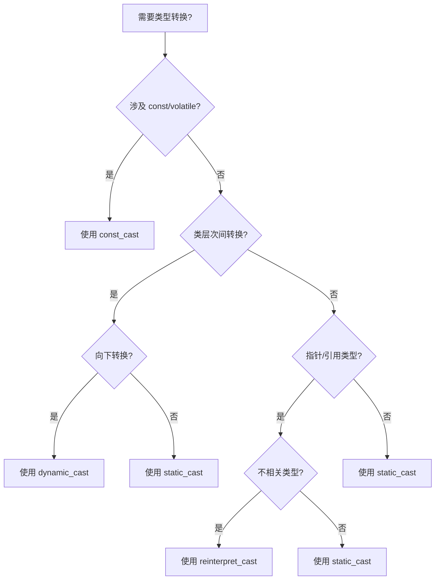

# C++ 类型转换详解

> [!info] 概述
> C++ 提供了四种类型转换操作符，相比 C 风格的强制转换更加安全和明确。本文将深入探讨各种类型转换的使用场景、区别和最佳实践。

## 一、大纲

1. [[#二、为什么需要 C++ 风格类型转换|为什么需要 C++ 风格类型转换]]
2. [[#三、四种 C++ 类型转换操作符|四种 C++ 类型转换操作符]]
   - `static_cast`
   - `dynamic_cast`
   - `const_cast`
   - `reinterpret_cast`
3. [[#四、C 风格类型转换|C 风格类型转换]]
4. [[#五、各种转换的对比与选择|各种转换的对比与选择]]
5. [[#六、常见陷阱与最佳实践|常见陷阱与最佳实践]]

---

## 二、为什么需要 C++ 风格类型转换

> [!warning] C 风格转换的问题
> C 风格的 `(type)expression` 转换存在以下问题：
> 1. 可以在任意类型之间转换，太过随意
> 2. 难以在代码中搜索定位
> 3. 不能明确表达程序员的意图
> 4. 编译期无法进行更严格的类型检查

### 2.1 C++ 风格转换的优势

| 特性 | C 风格 | C++ 风格 |
|------|--------|----------|
| 语法识别度 | 低，括号难以搜索 | 高，`xxx_cast` 容易搜索 |
| 类型安全 | 弱 | 强，每种转换有明确语义 |
| 意图表达 | 模糊 | 清晰 |
| 运行时检查 | 无 | `dynamic_cast` 有检查 |

---

## 三、四种 C++ 类型转换操作符

### 3.1 static_cast

> [!tip] 使用场景
> 用于编译期已知的、合理的类型转换。是最常用的转换方式。

#### 基本用法

```cpp
// 基本类型转换
double d = 3.14;
int i = static_cast<int>(d);  // 截断小数部分

// 类层次中的向上转换（安全）
class Base {};
class Derived : public Base {};

Derived d;
Base* b = static_cast<Base*>(&d);  // 向上转换，隐式也可完成
```

#### 特点与限制

```cpp
class Base {
public:
    virtual void foo() {}
};

class Derived : public Base {
public:
    void derivedOnly() {}
};

// ✅ 正确：向上转换
Base* b = new Derived();

// ⚠️ 危险：向下转换，无运行时检查
Derived* d = static_cast<Derived*>(b);  // 编译通过，但可能不安全

// ❌ 错误：不能转换无关类型
class Unrelated {};
Unrelated* u = static_cast<Unrelated*>(b);  // 编译错误！
```

> [!danger] 向下转换的风险
> `static_cast` 进行向下转换时**不会进行运行时类型检查**。如果对象实际类型不匹配，会导致未定义行为。

---

### 3.2 dynamic_cast

> [!tip] 使用场景
> 用于类层次间的安全向下转换，需要运行时类型信息（RTTI）支持。

#### 基本用法

```cpp
class Base {
public:
    virtual ~Base() {}  // 必须有虚函数！
};

class Derived : public Base {
public:
    void derivedOnly() {
        std::cout << "Derived method\n";
    }
};

Base* b = new Derived();

// 安全的向下转换
Derived* d = dynamic_cast<Derived*>(b);
if (d != nullptr) {
    d->derivedOnly();  // 转换成功
} else {
    // 转换失败，b 实际不是 Derived 类型
}

// 引用类型的转换（失败时抛出异常）
try {
    Base& b_ref = *b;
    Derived& d_ref = dynamic_cast<Derived&>(b_ref);
} catch (const std::bad_cast& e) {
    std::cerr << "转换失败: " << e.what() << '\n';
}
```

#### 关键要求

> [!important] 必要条件
> 使用 `dynamic_cast` 的类必须**至少有一个虚函数**（通常是虚析构函数），否则编译错误。

```cpp
class NoVirtual {};  // 没有虚函数

class Derived : public NoVirtual {};

NoVirtual* nv = new Derived();
// ❌ 编译错误：NoVirtual 不是多态类型
Derived* d = dynamic_cast<Derived*>(nv);
```

#### 性能考虑

```cpp
// dynamic_cast 有运行时开销
// 在高性能场景下，考虑设计模式替代：

// 方案1：虚函数多态
class Base {
public:
    virtual void doSomething() = 0;
};

// 方案2：类型标识 + static_cast
class Base {
public:
    enum Type { DERIVED_A, DERIVED_B };
    virtual Type getType() const = 0;
};

// 使用时
if (base->getType() == Base::DERIVED_A) {
    auto* a = static_cast<DerivedA*>(base);  // 确定安全后使用 static_cast
}
```

---

### 3.3 const_cast

> [!tip] 使用场景
> 用于添加或移除 `const` 或 `volatile` 限定符。

#### 基本用法

```cpp
void legacyFunction(char* str);  // 旧接口，非 const

void modernFunction(const std::string& str) {
    // 需要调用旧接口时
    char* mutable_str = const_cast<char*>(str.c_str());
    legacyFunction(mutable_str);
}
```

#### 危险用法（未定义行为）

```cpp
const int x = 10;

// ❌ 严重错误：修改真正的 const 对象
int* px = const_cast<int*>(&x);
*px = 20;  // 未定义行为！可能崩溃或无效

// ✅ 安全：修改原本是 non-const 的对象
int y = 10;
const int* py = &y;
int* py_mutable = const_cast<int*>(py);
*py_mutable = 20;  // OK，y 本身不是 const
```

> [!danger] 禁止修改真正的 const
> 通过 `const_cast` 修改原本就是 `const` 的对象是**未定义行为**！

---

### 3.4 reinterpret_cast

> [!tip] 使用场景
> 用于底层的、与实现相关的类型转换。结果几乎总是与编译器相关。

#### 基本用法

```cpp
// 指针与整数的转换
uintptr_t addr = reinterpret_cast<uintptr_t>(somePtr);
void* ptr = reinterpret_cast<void*>(addr);

// 不相关类型的指针转换
class A {};
class B {};  // A 和 B 无继承关系

A* a = new A();
B* b = reinterpret_cast<B*>(a);  // 强制转换，危险！
```

#### 典型应用场景

```cpp
// 场景1：将对象指针转为 void* 传递给回调
void callback(void* userData) {
    auto* obj = reinterpret_cast<MyClass*>(userData);
    obj->handleCallback();
}

// 场景2：序列化/反序列化时的字节操作
struct Packet {
    uint32_t header;
    uint32_t data;
};

char buffer[sizeof(Packet)];
Packet* p = reinterpret_cast<Packet*>(buffer);
p->header = 0x12345678;

// 场景3：联合体类型的替代方案（C++17 前）
template<typename T>
void writeToMemory(void* addr, const T& value) {
    *reinterpret_cast<T*>(addr) = value;
}
```

> [!warning] 极度危险
> `reinterpret_cast` 是**最危险**的转换方式，使用时必须完全理解内存布局。

---

## 四、C 风格类型转换

### 4.1 语法形式

```cpp
// C 风格
type (expression)      // 函数风格
(type) expression      // C 风格
```

### 4.2 转换优先级（C++ 风格无法替代时）

C 风格转换会按以下顺序尝试：

1. `const_cast`
2. `static_cast`
3. `static_cast` + `const_cast`
4. `reinterpret_cast`
5. `reinterpret_cast` + `const_cast`

```cpp
// 这种转换 C++ 风格无法直接表达
// C 风格：static_cast + const_cast
const char* cstr = "hello";
int* ptr = (int*)cstr;  // 先去掉 const，再 reinterpret_cast

// 必须拆分为两步的 C++ 风格
auto* temp = const_cast<char*>(cstr);
int* ptr2 = reinterpret_cast<int*>(temp);
```

---

## 五、各种转换的对比与选择

### 5.1 决策流程图



### 5.2 快速对照表

| 转换需求 | 推荐操作符 | 说明 |
|----------|------------|------|
| 基本类型转换 | `static_cast` | 如 `int` ↔ `double` |
| 类层次向上转换 | `static_cast` 或隐式 | 总是安全的 |
| 类层次向下转换 | `dynamic_cast` | 需要虚函数，安全 |
| 去掉 const | `const_cast` | 注意不修改真正的 const |
| 不相关指针类型 | `reinterpret_cast` | 底层操作，危险 |
| void* 转具体指针 | `static_cast` | C++ 推荐 |
| 多继承的指针调整 | `dynamic_cast` 或 `static_cast` | 注意指针值可能变化 |

---

## 六、常见陷阱与最佳实践

### 6.1 最佳实践

> [!success] 推荐做法
> 1. **优先使用 C++ 风格转换**，禁用 C 风格转换
> 2. **使用编译器警告**：`-Wold-style-cast` (GCC/Clang)
> 3. **明确表达意图**，选择合适的转换操作符
> 4. **向下转换前先考虑设计**，虚函数多态通常更好

```cpp
// 使用编译器选项禁用 C 风格转换
// GCC/Clang: -Wold-style-cast -Werror=old-style-cast
// MSVC: /W4 (启用后会警告 C 风格转换)
```

### 6.2 常见陷阱

#### 陷阱1： sliced 对象

```cpp
class Base {
public:
    virtual void foo() {}
    int baseData;
};

class Derived : public Base {
public:
    int derivedData;
};

// ❌ 错误：对象切片
Derived d;
Base b = d;  // derivedData 被切掉！

// ✅ 正确：使用指针或引用
Base& b_ref = d;  // 完整保留
Base* b_ptr = &d;  // 完整保留
```

#### 陷阱2： dynamic_cast 失败处理

```cpp
// ❌ 容易遗漏检查
Derived* d = dynamic_cast<Derived*>(base);
d->doSomething();  // 如果转换失败，崩溃！

// ✅ 总是检查返回值
if (Derived* d = dynamic_cast<Derived*>(base)) {
    d->doSomething();
} else {
    // 处理失败情况
}
```

#### 陷阱3： reinterpret_cast 的别名问题

```cpp
// ❌ 严格的别名规则违规
float f = 1.0f;
uint32_t bits = *reinterpret_cast<uint32_t*>(&f);  // 未定义行为！

// ✅ 正确做法：使用 memcpy（编译器会优化）
#include <cstring>
uint32_t bits;
std::memcpy(&bits, &f, sizeof(bits));

// ✅ C++20 替代方案：使用 bit_cast
#include <bit>
auto bits = std::bit_cast<uint32_t>(f);
```

### 6.3 现代 C++ 的替代方案

```cpp
// C++17: std::optional 代替可能失败的转换
std::optional<Derived> tryConvert(const Base& b);

// C++20: std::bit_cast 代替 reinterpret_cast
auto bits = std::bit_cast<uint32_t>(1.0f);

// 使用类型安全的封装避免裸转换
class TypeSafeHandle {
    void* ptr_;
public:
    template<typename T>
    T* as() {
        return static_cast<T*>(ptr_);
    }
};
```

---

## 七、总结

| 操作符                | 安全性   | 性能  | 使用频率 | 记住口诀        |
| ------------------ | ----- | --- | ---- | ----------- |
| `static_cast`      | ⭐⭐⭐   | ⭐⭐⭐ | 高频   | 编译期已知，最常用   |
| `dynamic_cast`     | ⭐⭐⭐⭐⭐ | ⭐⭐  | 中频   | 向下转换要检查     |
| `const_cast`       | ⭐⭐    | ⭐⭐⭐ | 低频   | 去 const 要小心 |
| `reinterpret_cast` | ⭐     | ⭐⭐⭐ | 极低   | 底层操作最危险     |
|                    |       |     |      |             |

> [!quote] 核心原则
> **"能用 static_cast 就不用其他的，必须用其他的时要清楚为什么。"**

---

## 相关链接

- [[C++编译选项|C++ 编译选项详解]]
- RTTI 机制
- 虚函数表实现原理
- 对象内存布局
