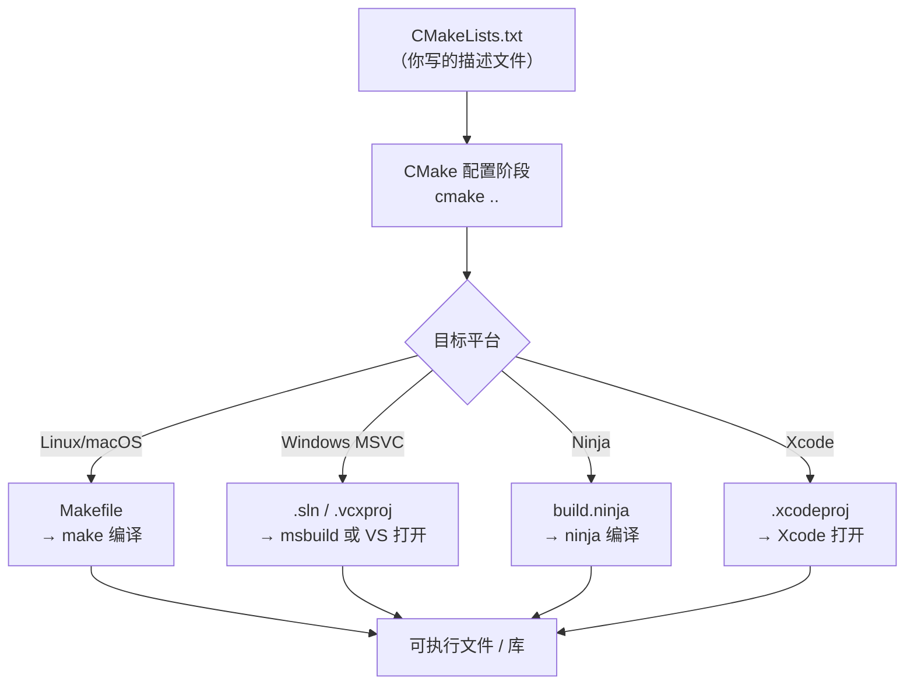
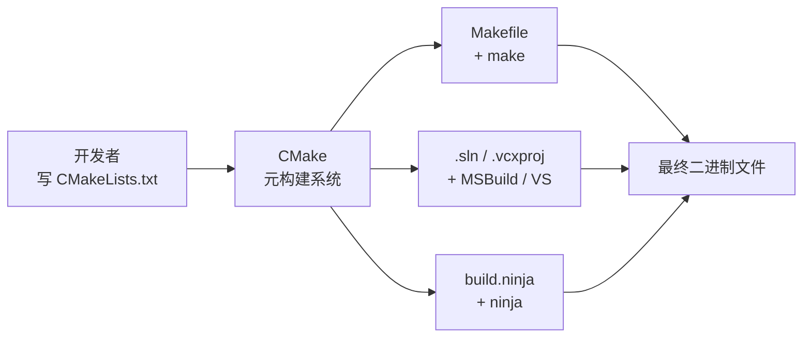

# 构建系统：make 与 CMake

## 一句话总结

> `make` 解决了**重复编译**问题；`CMake` 解决了**跨平台构建描述**问题，并能生成 Makefile、Visual Studio 解决方案等各种构建文件。

---

## 一、为什么需要构建工具？

### 手动编译的痛苦

假设项目有 100 个 `.cpp` 文件，每次改动一个文件就要手动重新编译所有文件：

```bash
g++ -c a.cpp -o a.o
g++ -c b.cpp -o b.o
# ... 100 次
g++ a.o b.o ... -o my_app
```

问题很快暴露出来：

| 问题 | 描述 |
|------|------|
| **效率极低** | 改一行代码，所有文件都要重编 |
| **依赖难管** | 手动维护哪个 `.o` 依赖哪个 `.h` 极易出错 |
| **命令难记** | 编译选项、链接顺序全靠记忆 |
| **协作困难** | 每个人本地操作不一致 |

这就是构建工具出现的根本动机：**自动化、增量、可重复**。

---

## 二、make —— 第一代解决方案

### 历史背景

`make` 诞生于 **1976 年**，由 Stuart Feldman 在贝尔实验室（Bell Labs）开发，最初发布在 Unix 系统上。它是第一个被广泛使用的构建自动化工具。

> [!info] 历史小故事
> Feldman 写 make 的直接原因：一个同事花了整整一天调试一个 bug，最后发现只是忘记重新编译某个文件——新的源码根本没生效。这件事促使他设计了一套能**追踪文件依赖和时间戳**的工具。

### make 的核心思想

make 的关键机制只有两点：
1. **依赖图**：描述"要生成 A，需要先有 B 和 C"
2. **时间戳比较**：只有当源文件比目标文件**更新**时，才重新执行命令

```
目标文件 比 源文件 旧 → 重新编译
目标文件 比 源文件 新 → 跳过（无需重编）
```

### Makefile 基本语法

```makefile
# 语法结构：
# 目标: 依赖1 依赖2
# <TAB>命令   ← 注意：必须是 TAB，不能是空格！

my_app: main.o utils.o math.o
	g++ main.o utils.o math.o -o my_app

main.o: main.cpp utils.h
	g++ -c main.cpp -o main.o

utils.o: utils.cpp utils.h
	g++ -c utils.cpp -o utils.o

math.o: math.cpp math.h
	g++ -c math.cpp -o math.o

# 伪目标（不对应真实文件）
clean:
	rm -f *.o my_app
```

> [!tip] TAB 的历史遗留问题
> Makefile 规定命令行**必须以 TAB 开头**，这是 make 最臭名昭著的设计缺陷之一。Feldman 后来承认这是一个错误，但由于用户量太大无法修改。

### make 的变量与函数

```makefile
# 变量定义
CXX    = g++
CFLAGS = -Wall -O2 -std=c++17
TARGET = my_app
SRCS   = main.cpp utils.cpp math.cpp
OBJS   = $(SRCS:.cpp=.o)   # 字符串替换：将 .cpp 替换为 .o

# 使用变量
$(TARGET): $(OBJS)
	$(CXX) $(OBJS) -o $(TARGET)

# 模式规则：所有 .cpp → .o 的通用规则
%.o: %.cpp
	$(CXX) $(CFLAGS) -c $< -o $@
#                         ↑    ↑
#                    $< = 依赖的第一个文件（源文件）
#                    $@ = 目标文件名

clean:
	rm -f $(OBJS) $(TARGET)
```

### make 的局限性

make 解决了增量编译问题，但随着项目的跨平台需求出现，新的问题浮出水面：

| 局限 | 说明 |
|------|------|
| **平台绑定** | Makefile 依赖 Unix shell 命令（`rm`、`cp`）；Windows 上无法直接用 |
| **IDE 无关** | 无法生成 Visual Studio、Xcode 等 IDE 的项目文件 |
| **语法混乱** | 大型项目的 Makefile 极难维护和阅读 |
| **移植繁琐** | 为每个平台手写一套构建脚本，重复劳动 |

---

## 三、CMake —— 构建系统的构建系统

### 历史背景

`CMake` 诞生于 **2000 年**，最初由 Kitware 公司为 ITK（医学图像分析库）项目开发，目的是让一套源码能在 Windows（MSVC）、Linux（GCC）、macOS（Clang/AppleClang）上构建。

CMake 的名字取自 **"Cross-platform Make"**（跨平台 Make）。

> [!info] CMake 的定位
> CMake **不是**直接的编译工具，而是**元构建系统（Meta Build System）**——它读取 `CMakeLists.txt`，然后**生成**目标平台的原生构建文件（Makefile、.sln、.xcodeproj 等），再交由原生工具编译。

### CMake 的工作流程



### CMakeLists.txt 基本写法

```cmake
# 最低 CMake 版本要求
cmake_minimum_required(VERSION 3.20)

# 项目名称和语言
project(MyProject VERSION 1.0 LANGUAGES CXX)

# 设置 C++ 标准
set(CMAKE_CXX_STANDARD 17)
set(CMAKE_CXX_STANDARD_REQUIRED ON)

# 收集源文件
set(SOURCES
    src/main.cpp
    src/utils.cpp
    src/math.cpp
)

# 定义可执行目标
add_executable(my_app ${SOURCES})

# 添加头文件搜索路径
target_include_directories(my_app PRIVATE include/)

# 链接库（如果有）
# target_link_libraries(my_app PRIVATE some_lib)
```

### 典型目录结构

```
my_project/
├── CMakeLists.txt        ← 根构建描述
├── include/
│   └── utils.h
├── src/
│   ├── main.cpp
│   └── utils.cpp
├── libs/
│   └── mathlib/
│       ├── CMakeLists.txt   ← 子模块也有自己的 CMakeLists
│       ├── include/
│       └── src/
└── build/               ← 构建输出目录（不提交到 git！）
```

### 外部构建（Out-of-source Build）

CMake 强烈推荐将构建文件放在独立目录，不污染源码树：

```bash
# 在项目根目录
mkdir build
cd build

# 配置阶段：CMake 读取 CMakeLists.txt，生成构建文件
cmake ..

# 构建阶段：调用原生工具编译
cmake --build .

# 或者直接用
make        # Linux/macOS
```

> [!tip] 把 `build/` 加入 `.gitignore`
> 构建目录是生成物，不应提交到版本库。

---

## 四、CMake 生成 Visual Studio .sln 文件

这是工作中常见的需求：用同一套 CMake 脚本，在 Windows 上生成可以直接用 VS 打开的解决方案。

### 工作原理

CMake 通过**生成器（Generator）**来决定输出什么类型的构建文件。Visual Studio 系列是 CMake 内置支持的生成器之一。

```bash
# 查看本机所有可用生成器
cmake --help
# 末尾会列出类似：
# * Visual Studio 17 2022
#   Visual Studio 16 2019
#   Visual Studio 15 2017
#   Unix Makefiles
#   Ninja
#   ...
```

### 生成 .sln 的完整工作流

**第一步：打开 Developer Command Prompt（或普通 PowerShell/CMD 均可）**

```powershell
# 进入项目目录
cd C:\my_project

# 创建构建目录
mkdir build_vs
cd build_vs

# 指定生成器：生成 VS2022 的 x64 解决方案
cmake .. -G "Visual Studio 17 2022" -A x64

# 完成后，build_vs/ 目录下会出现：
# MyProject.sln     ← 双击用 VS 打开
# MyProject.vcxproj
# ...
```

**第二步：用 Visual Studio 打开**

直接双击 `.sln` 文件，或：

```powershell
start MyProject.sln
```

VS 打开后，你会看到完整的项目结构，可以直接按 `F5` 编译运行、设置断点调试。

**第三步（可选）：不打开 VS，直接命令行编译**

```powershell
# 在 build_vs 目录下
cmake --build . --config Release
# 等价于让 msbuild 编译 .sln，输出在 Release/ 子目录
```

### 常用生成器速查

| 生成器命令 | 说明 |
|-----------|------|
| `"Visual Studio 17 2022"` | VS 2022，默认 x86 |
| `"Visual Studio 17 2022" -A x64` | VS 2022，x64 架构 |
| `"Visual Studio 16 2019" -A x64` | VS 2019，x64 架构 |
| `"Ninja"` | Ninja 构建（快速，常用于 CI） |
| `"Unix Makefiles"` | 标准 Makefile（Linux/macOS 默认） |
| `"Xcode"` | macOS Xcode 项目 |

### 配置类型：Debug vs Release

Visual Studio 是多配置生成器，配置类型在**编译时**选择，不在配置阶段：

```powershell
# 配置阶段不需要指定 Debug/Release
cmake .. -G "Visual Studio 17 2022" -A x64

# 编译时指定
cmake --build . --config Debug    # Debug 版本
cmake --build . --config Release  # Release 版本
```

> [!warning] 与 Linux Makefile 的区别
> 在 Linux 用 `cmake .. -DCMAKE_BUILD_TYPE=Release` 是在**配置阶段**决定的（单配置生成器）；Visual Studio 是多配置生成器，`-DCMAKE_BUILD_TYPE` 无效，必须在 `--build` 时用 `--config` 指定。

---

## 五、CMake 进阶用法速查

### 查找和链接第三方库

```cmake
# 查找系统已安装的库（如 OpenSSL）
find_package(OpenSSL REQUIRED)
target_link_libraries(my_app PRIVATE OpenSSL::SSL OpenSSL::Crypto)

# 使用 vcpkg / conan 等包管理器时，通过 toolchain file 集成
# cmake .. -DCMAKE_TOOLCHAIN_FILE=C:/vcpkg/scripts/buildsystems/vcpkg.cmake
```

### 子目录 / 子模块

```cmake
# 根 CMakeLists.txt 中引入子目录
add_subdirectory(libs/mathlib)

# my_app 链接子模块提供的库
target_link_libraries(my_app PRIVATE mathlib)
```

### 安装规则

```cmake
install(TARGETS my_app DESTINATION bin)
install(FILES include/utils.h DESTINATION include)
```

```bash
cmake --install . --prefix /usr/local
```

### 常用 CMake 命令速查

| 命令 | 作用 |
|------|------|
| `cmake .. -G "..."` | 配置，指定生成器 |
| `cmake .. -DCMAKE_BUILD_TYPE=Release` | 配置，设置构建类型（单配置生成器） |
| `cmake --build .` | 构建 |
| `cmake --build . --config Release` | 构建指定配置（多配置生成器） |
| `cmake --install .` | 安装 |
| `cmake -LAH ..` | 列出所有可配置选项 |
| `ctest` | 运行测试（需要配合 `enable_testing()`） |

---

## 六、总结：三者关系一览



| 工具 | 层次 | 解决的问题 |
|------|------|-----------|
| **make** | 原生构建工具 | 增量编译、依赖追踪 |
| **CMake** | 元构建系统 | 跨平台构建描述、生成各种构建文件 |
| **MSBuild/VS** | 原生构建工具（Windows） | 实际编译链接，IDE 集成 |
| **Ninja** | 原生构建工具 | 极速增量构建，常用于 CI |

> [!quote] 核心思想
> 你只需要维护**一套** `CMakeLists.txt`，CMake 负责把它翻译成各个平台的"母语"——Linux 用 Makefile，Windows 用 .sln，macOS 用 Xcode 项目。这就是现代 C++ 工程跨平台构建的基础。

---

## 相关笔记

- [[C++/C++编译过程原理]]
- [[C++/静态库与动态库]]
- [[C++/C++编译选项]]
