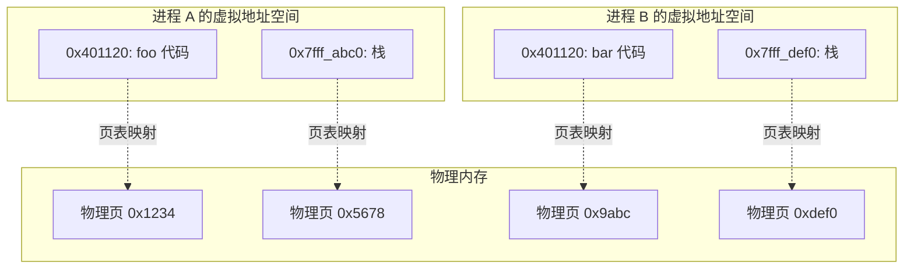

# 调试器如何找到变量位置——进程隔离与 DWARF 调试信息

## 问题起源

在学习调试器原理时，看到一个例子：

```cpp
void foo(int param) {      // param 可能在寄存器 %edi
    int local = param;     // local 在栈上 [rbp-4]
    int *ptr = &local;     // ptr 在栈上 [rbp-16]
    // ...
}
```

DWARF 调试信息会记录：
- `param`: 在 `0x401120-0x401130` 范围内位于 `%edi` 寄存器
- `local`: 在 `0x401130-0x401140` 范围内位于 `[rbp-4]`
- `ptr`: 在 `0x401140-0x401150` 范围内位于 `[rbp-16]`

**产生的疑问**：操作系统并行运行很多程序，万一实际运行时那块寄存器或内存地址被其他进程占用了怎么办？

---

## 核心答案：进程隔离机制

### 1. 寄存器隔离——上下文切换

虽然 CPU 只有一套物理寄存器，但**每个进程有独占的寄存器状态**。


**上下文切换过程**：
1. 触发切换（时间片用完、系统调用、中断）
2. 将当前进程的所有寄存器值保存到内存（进程的内核栈/PCB）
3. 从内存恢复下一个进程的寄存器值到物理寄存器
4. 新进程开始运行，看到的就是"它的寄存器"

> [!note]
> 从进程视角看，它独占 CPU 和寄存器。进程的寄存器状态在暂停时被"冻结"在内存中。

---

### 2. 内存隔离——虚拟内存



**关键点**：
- 每个进程的 `0x401120` 是**虚拟地址**
- 通过页表映射到**不同的物理地址**
- 进程之间无法直接访问对方的内存

---

## DWARF 调试信息原理

### 编译器如何记录信息

```cpp
void foo(int param) {      // 编译器决定：param 放入 %edi
    int local = param;     // 编译器决定：local 在 [rbp-4]
    int *ptr = &local;     // 编译器决定：ptr 在 [rbp-16]
    // ...
}
```

| 变量 | 地址范围 | 位置 | 说明 |
|------|---------|------|------|
| `param` | `0x401120-0x401130` | `%edi` | 函数入口处，参数在寄存器 |
| `local` | `0x401120-0x401140` | `[rbp-4]` | 始终在栈上 |
| `ptr` | `0x401120-0x401140` | `[rbp-16]` | 始终在栈上 |

### 为什么需要地址范围？

变量的位置可能随代码执行改变：

```cpp
void bar() {
    int a = 10;        // a 在 [rbp-4]

    // ... 很多代码 ...

    a = a * 2;         // 编译器可能把 a 加载到 %eax 运算
    // 此时 a 同时在 [rbp-4]（内存）和 %eax（寄存器）

    some_function();   // 调用后 %eax 被破坏
    // 此后 a 只在 [rbp-4]
}
```

DWARF 使用**位置列表（Location List）**记录这种变化。

---

## 调试器如何读取变量

### 被调试进程的状态

```mermaid
graph TB
    subgraph "系统整体"
        direction TB

        subgraph "调试器 gdb"
            G1[读取进程寄存器<br/>ptrace PTRACE_GETREGS]
            G2[读取进程内存<br/>/proc/pid/mem]
        end

        subgraph "被调试进程 A（暂停状态）"
            A1[保存的寄存器状态<br/>包括 %edi 的值]
            A2[虚拟内存空间<br/>包括栈 [rbp-4]]
        end

        G1 -.->|系统调用| A1
        G2 -.->|系统调用| A2
    end
```

### 读取流程

1. **用户请求**：`(gdb) print param`
2. **查询 DWARF**：找到 `param` 在当前程序计数器处的位置 → `%edi`
3. **读取寄存器**：通过 `ptrace(PTRACE_GETREGS)` 获取进程保存的寄存器状态
4. **返回值**：从寄存器值中得到 `param` 的值

---

## 常见疑问总结

| 疑问 | 解答 |
|------|------|
| 寄存器被其他进程占用？ | 不会。每个进程有独占的寄存器状态，暂停时保存在内存中 |
| 内存地址冲突？ | 不会。虚拟内存让每个进程有独立的地址空间，相同虚拟地址映射到不同物理地址 |
| DWARF 记录的是物理地址？ | 不是。记录的是**虚拟地址**相对于进程自身的偏移 |
| 调试器怎么知道变量在哪？ | 编译时决定 → DWARF 记录 → 调试时根据程序计数器查询 |

---

## 类比理解

想象两个孩子在各自的纸上画画：

- 每个孩子（进程）都有自己的纸（虚拟地址空间）
- 他们都说"我在纸的左上角画"（`[rbp-4]`）
- 但实际上是**两张不同的纸**，不会互相覆盖
- 老师（调试器）可以拿起任意一张查看

---

## 查看实际 DWARF 信息

```bash
# 查看 ELF 文件中的调试信息
readelf --debug-dump=info a.out | less

# 或者
objdump --dwarf=info a.out | less

# 查看特定变量
readelf --debug-dump=info a.out | grep -A 10 "DW_AT_name.*param"
```

---

## 相关笔记

- [[调试器核心概念与原理]]
- [[C++ 编译过程详解]]
- [[虚拟内存与内存管理]]
