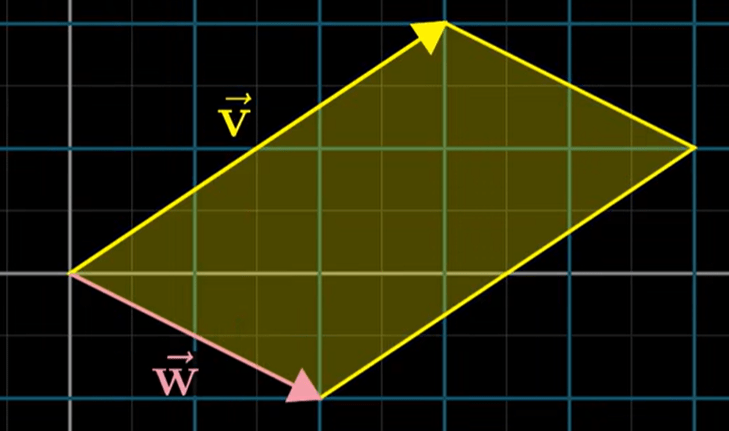
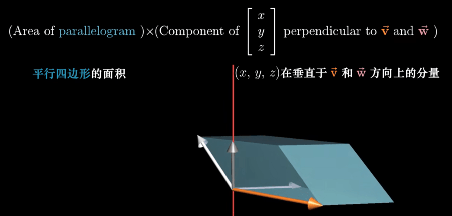

# 叉积

> 所属系列：[[00-索引|线性代数的本质]] · 第 8 章

---

## 8.1 叉积的基本属性

对于 $\vec{v} \times \vec{w}$（三维向量）：

1. **数值（模长）**: 等于两个向量围成的平行四边形的面积
2. **方向**: 垂直于该平行四边形所在平面（由右手定则确定）
3. **符号**: 当 $\vec{v}$ 在 $\vec{w}$ 的"右边"时为正（即从 $\vec{v}$ 到 $\vec{w}$ 逆时针时正）

> [!note] 叉积只在三维空间中定义
> 严格意义上，叉积是三维空间特有的运算。二维中存在类似操作，但结果是标量。

---

## 8.2 二维叉积（伪叉积）

二维情形下，叉积的结果是一个**标量**（有向面积）：

$$
\vec{v} \times \vec{w} = \det\begin{bmatrix} v_x & w_x \\ v_y & w_y \end{bmatrix} = v_x w_y - v_y w_x
$$

这等于两个向量张成的平行四边形的**有向面积**：

- 正值：从 $\vec{v}$ 到 $\vec{w}$ 是逆时针方向
- 负值：从 $\vec{v}$ 到 $\vec{w}$ 是顺时针方向

---

## 8.3 三维叉积

### 计算公式

$$
\vec{v} \times \vec{w} = \begin{bmatrix} v_y w_z - v_z w_y \\ v_z w_x - v_x w_z \\ v_x w_y - v_y w_x \end{bmatrix}
$$

### 行列式记忆法

$$
\vec{v} \times \vec{w} = \det\begin{bmatrix} \hat{i} & \hat{j} & \hat{k} \\ v_x & v_y & v_z \\ w_x & w_y & w_z \end{bmatrix}
$$

沿第一行展开：

$$
= \hat{i}(v_y w_z - v_z w_y) - \hat{j}(v_x w_z - v_z w_x) + \hat{k}(v_x w_y - v_y w_x)
$$

---

### 输出向量的性质

| 属性 | 公式 | 含义 |
|------|------|------|
| **模长** | $|\vec{v} \times \vec{w}| = |\vec{v}||\vec{w}|\sin\theta$ | 等于平行四边形面积 |
| **方向** | 垂直于 $\vec{v}$ 和 $\vec{w}$ 所在的平面 | 右手定则确定朝向 |

---

## 8.4 右手定则

**右手定则**：将右手四指从 $\vec{v}$ 弯向 $\vec{w}$，大拇指指向的方向就是 $\vec{v} \times \vec{w}$ 的方向。

- 食指指向 $\vec{v}$ 的方向
- 中指指向 $\vec{w}$ 的方向
- 大拇指指向叉积 $\vec{v} \times \vec{w}$ 的方向

---

## 8.5 叉积的性质

| 性质 | 公式 | 说明 |
|------|------|------|
| 反交换律 | $\vec{v} \times \vec{w} = -(\vec{w} \times \vec{v})$ | 顺序不同，方向相反 |
| 分配律 | $\vec{v} \times (\vec{u} + \vec{w}) = \vec{v} \times \vec{u} + \vec{v} \times \vec{w}$ | |
| 与数乘结合 | $(c\vec{v}) \times \vec{w} = c(\vec{v} \times \vec{w})$ | |
| 自身叉积 | $\vec{v} \times \vec{v} = \vec{0}$ | 面积为零 |
| 平行向量 | $\vec{v} \times \vec{w} = \vec{0}$ 当 $\vec{v} \parallel \vec{w}$ | |

> [!warning] 叉积不满足结合律！
> $(\vec{a} \times \vec{b}) \times \vec{c} \neq \vec{a} \times (\vec{b} \times \vec{c})$

---

## 8.6 叉积的应用

### 求法向量

空间中两个向量 $\vec{v}$ 和 $\vec{w}$ 所在平面的**法向量**为 $\vec{v} \times \vec{w}$。

### 求三角形面积

三角形面积 $= \dfrac{1}{2}|\vec{v} \times \vec{w}|$

### 判断向量的朝向关系

$\vec{v} \times \vec{w} \cdot \vec{n} > 0$ 可用来判断 $\vec{v}, \vec{w}$ 与法向量 $\vec{n}$ 的方向关系。

---

## 8.7 叉积的对偶性（选读）

**核心思想**：三维向量 $\vec{v}$ 和 $\vec{w}$ 的叉积，就是寻找一个向量 $\vec{p}$，使得对所有向量 $\vec{x}$：

$$
\vec{p} \cdot \vec{x} = \det\begin{bmatrix} x_x & v_x & w_x \\ x_y & v_y & w_y \\ x_z & v_z & w_z \end{bmatrix}
$$

**几何解释**：
- 右侧是 $\vec{x}$、$\vec{v}$、$\vec{w}$ 三向量围成的平行六面体的**有向体积**
- 左侧是 $\vec{x}$ 投影到 $\vec{p}$ 上的长度乘以 $|\vec{p}|$
- 当 $\vec{p} = \vec{v} \times \vec{w}$（模为平行四边形面积）时，两者恒等

---

**上一章**: [[07-点积与对偶性]] | **下一章**: [[09-基变换]]
