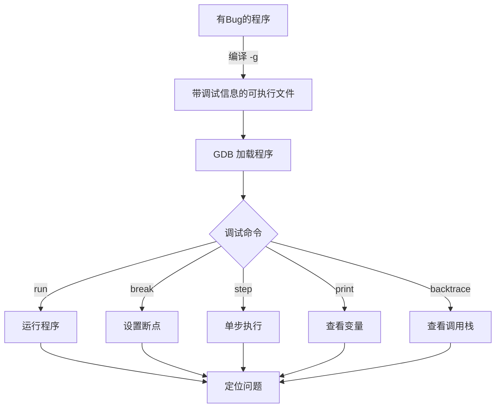
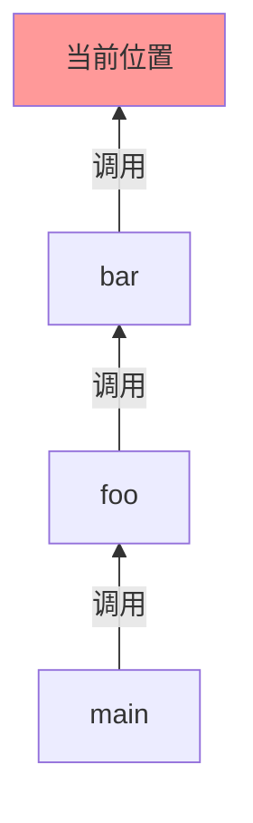

# GDB 调试学习笔记

> [!info] 前置知识
> - 了解 [[03-C++编程/C++编译选项.md|C++ 编译基础]] 有助于理解 GDB 的使用，特别是 `-g` 选项的作用
> - 深入理解调试器原理，参见 [[03-C++编程/调试器核心概念与原理.md|调试器核心概念与原理]]

## 什么是 GDB

**GDB**（GNU Debugger）是 GNU 项目开发的程序调试工具，主要用于调试 C/C++ 程序。

GDB 的主要功能：
- 逐行执行代码，观察程序运行流程
- 在特定位置设置断点，暂停程序执行
- 查看和修改变量的值
- 分析程序崩溃时的调用栈
- 调试多线程程序



---

## 准备工作：编译带调试信息的程序

使用 GDB 调试前，编译时需要加上 `-g` 选项：

```bash
# 基础调试信息
g++ -g main.cpp -o main

# 更多调试信息（包含宏定义）
g++ -g3 main.cpp -o main

# 推荐的调试编译组合
g++ -std=c++17 -Wall -Wextra -g -O0 main.cpp -o main
```

> [!warning] 注意事项
> 使用 `-O0`（无优化）调试体验最佳。高优化级别（`-O2`/`-O3`）可能导致代码与源码行号对不上，影响调试。

---

## 启动 GDB

### 基本启动方式

```bash
# 方式1：直接加载可执行文件
gdb ./main

# 方式2：加载文件并传入参数
gdb --args ./main arg1 arg2

# 方式3：先启动 gdb，再加载文件
gdb
(gdb) file ./main
```

### GDB 常用启动选项

| 选项 | 说明 |
|------|------|
| `--silent` / `-q` | 静默启动，不显示版本信息 |
| `--batch` | 批处理模式，执行命令后退出 |
| `--command=<file>` | 从文件加载 GDB 命令 |
| `--pid=<pid>` | 附加到运行中的进程 |
| `--core=<file>` | 分析 core dump 文件 |

---

## 核心命令

### 程序控制

| 命令         | 简写  | 说明         |
| ---------- | --- | ---------- |
| `run`      | `r` | 开始运行程序     |
| `continue` | `c` | 继续运行到下一个断点 |
| `quit`     | `q` | 退出 GDB     |
| `kill`     | `k` | 终止当前调试的程序  |

### 断点管理

| 命令                 | 简写    | 说明     |
| ------------------ | ----- | ------ |
| `break <位置>`       | `b`   | 设置断点   |
| `info breakpoints` | `i b` | 查看所有断点 |
| `delete <编号>`      | `d`   | 删除断点   |
| `disable <编号>`     | `dis` | 禁用断点   |
| `enable <编号>`      | `ena` | 启用断点   |

### 单步执行

| 命令       | 简写    | 说明          |
| -------- | ----- | ----------- |
| `step`   | `s`   | 单步执行（进入函数）  |
| `next`   | `n`   | 单步执行（不进入函数） |
| `finish` | `fin` | 运行到当前函数返回   |
| `until`  | `u`   | 运行到指定行      |

### 查看信息

| 命令 | 简写 | 说明 |
|------|------|------|
| `print <变量>` | `p` | 打印变量值 |
| `display <变量>` | `disp` | 每次暂停时显示变量 |
| `info locals` | `i lo` | 显示局部变量 |
| `info args` | `i ar` | 显示函数参数 |
| `backtrace` | `bt` | 显示调用栈 |
| `list` | `l` | 显示源码 |

---

## 断点设置

### 按行号设置

```gdb
# 在当前文件第 10 行设置断点
(gdb) break 10

# 在指定文件第 20 行设置断点
(gdb) break main.cpp:20

# 在函数入口处设置断点
(gdb) break main
(gdb) break MyClass::myFunction
```

### 条件断点

```gdb
# 条件断点：仅当 i > 100 时暂停
(gdb) break 20 if i > 100

# 复杂条件
(gdb) break 30 if ptr != nullptr && ptr->value > 10
```

> [!tip] 条件断点
> 条件断点比手动检查更高效，特别是在循环中调试时。

### 临时断点

```gdb
# 临时断点：只生效一次，然后自动删除
(gdb) tbreak 15

# 临时条件断点
(gdb) tbreak 20 if x == 0
```

---

## 变量查看与修改

### 打印变量

```gdb
# 打印基本变量
(gdb) print x
(gdb) print array[0]
(gdb) print ptr->member

# 打印表达式
(gdb) print x + y
(gdb) print sizeof(myStruct)

# 格式化输出
(gdb) print /x value      # 十六进制
(gdb) print /d value      # 十进制
(gdb) print /o value      # 八进制
(gdb) print /t value      # 二进制
(gdb) print /c value      # 字符
(gdb) print /f value      # 浮点数
```

### 查看数组和字符串

```gdb
# 打印数组
(gdb) print *array@10      # 打印数组前 10 个元素
(gdb) print arr[0]@5       # 打印 arr[0] 到 arr[4]

# 打印字符串
(gdb) print str            # 如果 str 是 char*
(gdb) print /s str         # 强制作为字符串打印
```

### 修改变量

```gdb
# 修改变量值
(gdb) set var x = 100
(gdb) set var ptr = nullptr

# 调用函数（可能有副作用）
(gdb) print myFunction(1, 2, 3)
```

### 自动显示变量

```gdb
# 每次暂停时自动显示
(gdb) display x
(gdb) display y

# 查看所有 display
(gdb) info display

# 删除自动显示
(gdb) undisplay 1
```

---

## 调用栈分析

### 查看调用栈

```gdb
# 显示完整调用栈
(gdb) backtrace
(gdb) bt

# 显示指定层数的调用栈
(gdb) bt 10

# 显示所有线程的调用栈
(gdb) thread apply all bt
```

### 切换栈帧

```gdb
# 查看当前帧信息
(gdb) info frame

# 切换到上一层调用者
(gdb) up

# 切换到下一层被调用者
(gdb) down

# 切换到指定帧
(gdb) frame 3

# 查看当前帧的局部变量
(gdb) info locals
```



---

## 多线程调试

### 线程管理

```gdb
# 查看所有线程
(gdb) info threads

# 切换到指定线程
(gdb) thread 2

# 对特定线程执行命令
(gdb) thread 3 print x

# 对所有线程执行命令
(gdb) thread apply all print x
```

### 线程断点

```gdb
# 只在特定线程上触发断点
(gdb) break 20 thread 2
```

---

## 高级功能

### Watchpoint（观察点）

Watchpoint 在变量值被修改时暂停，适合追踪变量修改来源。

```gdb
# 设置观察点（变量被写入时触发）
(gdb) watch global_var

# 读取观察点（变量被读取时触发）
(gdb) rwatch some_var

# 访问观察点（读写都触发）
(gdb) awatch my_variable

# 条件观察点
(gdb) watch x if x > 10
```

### Catchpoint（捕获点）

```gdb
# 捕获异常抛出（C++）
(gdb) catch throw

# 捕获异常捕获
(gdb) catch catch

# 捕获系统调用
(gdb) catch syscall open

# 捕获库函数调用
(gdb) catch call malloc
```

### 反向调试

> [!note] 需要支持反向调试的环境

```gdb
# 启用进程记录
(gdb) target record-full

# 反向执行（后退一步）
(gdb) reverse-step
(gdb) reverse-next

# 反向继续（后退到上一个断点）
(gdb) reverse-continue
```

---

## 调试示例

### 示例程序

```cpp
// buggy.cpp
#include <iostream>
#include <vector>

int divide(int a, int b) {
    return a / b;  // 潜在的除零错误
}

int main() {
    int x = 10;
    int y = 0;

    std::cout << "Before division" << std::endl;
    int result = divide(x, y);
    std::cout << "Result: " << result << std::endl;

    return 0;
}
```

### 调试会话

```bash
# 编译
g++ -g -O0 buggy.cpp -o buggy

# 启动 GDB
gdb ./buggy
```

```gdb
(gdb) break main          # 在 main 函数入口设置断点
(gdb) run                 # 运行程序
(gdb) next                # 单步执行（不进入函数）
(gdb) print x             # 查看变量 x 的值
(gdb) print y             # 查看变量 y 的值
(gdb) break divide        # 在 divide 函数设置断点
(gdb) continue            # 继续运行到 divide
(gdb) print b             # 查看除数
(gdb) set var y = 2       # 修改 y 的值
(gdb) continue            # 继续运行
```

---

## Core Dump 分析

当程序崩溃时，系统可能生成 core dump 文件。

```bash
# 启用 core dump（ulimit 设置）
ulimit -c unlimited

# 分析 core dump
gdb ./program core
# 或
gdb ./program core.xxxx
```

```gdb
# 在 GDB 中查看崩溃信息
(gdb) bt              # 查看崩溃时的调用栈
(gdb) info registers  # 查看寄存器值
(gdb) info locals     # 查看局部变量
(gdb) list            # 查看崩溃位置附近的代码
```

---

## GDB TUI 模式

TUI 模式可以同时查看源码和调试信息。

```bash
# 启动 TUI 模式
gdb -tui ./program

# 或在 GDB 中切换
(gdb) layout src      # 显示源码
(gdb) layout asm      # 显示汇编
(gdb) layout split    # 同时显示源码和汇编
(gdb) layout regs     # 显示寄存器
(gdb) focus cmd       # 切换到命令窗口
(gdb) Ctrl+x+a        # 切换 TUI 模式开关
```

---

## GDB 脚本与自动化

### 命令脚本

创建 `.gdbinit` 文件自动执行命令：

```gdb
# .gdbinit
set pagination off
set print pretty on

break main
run

define hook-stop
    info locals
    backtrace 3
end
```

### Python 扩展

GDB 支持 Python 脚本扩展：

```python
# 在 GDB 中执行 Python
(gdb) python print("Hello from Python")

# 定义自定义命令
(gdb) python
import gdb

class HelloCommand(gdb.Command):
    def __init__(self):
        super().__init__("hello", gdb.COMMAND_USER)

    def invoke(self, arg, from_tty):
        print(f"Hello, {arg}!")

HelloCommand()
end

# 使用自定义命令
(gdb) hello World
```

---

## 常见问题

### 1. STL 容器打印

GDB 默认打印 STL 容器不够直观，可使用 pretty printers 改善。

```gdb
# 打印 vector 内容（没有 pretty printer 时）
(gdb) print *(vec._M_impl._M_start)@vec.size()
```

在 `~/.gdbinit` 中添加 pretty printers：

```python
python
import sys
sys.path.insert(0, '/usr/share/gcc-python/')
from libstdcxx.v6.printers import register_libstdcxx_printers
register_libstdcxx_printers(None)
end
```

### 2. 断点性能优化

在频繁执行的循环中设置断点会影响性能。

```gdb
# 使用条件断点
(gdb) break 100 if i % 1000 == 0

# 或使用忽略计数
(gdb) ignore 1 100      # 忽略断点 1 的前 100 次触发
```

### 3. 保存和加载断点

```gdb
# 保存断点
(gdb) save breakpoints breakpoints.txt

# 加载断点
(gdb) source breakpoints.txt
```

---

## GDB vs LLDB 对比

| 功能 | GDB | LLDB |
|------|-----|------|
| 所属项目 | GNU | LLVM |
| macOS 支持 | 需安装 | 原生支持 |
| 启动命令 | `gdb ./prog` | `lldb ./prog` |
| 设置断点 | `break main` / `b main` | `breakpoint set -n main` / `b main` |
| 单步执行 | `step` / `s` | `step` / `s` |
| 查看变量 | `print x` / `p x` | `print x` / `p x` |
| 调用栈 | `backtrace` / `bt` | `thread backtrace` / `bt` |
| Python 支持 | 内置 | 原生 |

---

## 参考资源

- [[03-C++编程/调试器核心概念与原理.md|调试器核心概念与原理]] - 深入理解 Symbol、DWARF、断点原理等核心概念
- [[03-C++编程/C++编译选项.md|C++ 编译选项详解]]
- [[03-C++编程/C++编译过程原理.md|C++ 编译过程原理]]
- [GDB 官方文档](https://sourceware.org/gdb/current/onlinedocs/gdb/)
- [GDB Cheat Sheet](https://darkdust.net/files/GDB%20Cheat%20Sheet.pdf)

---

## 核心命令速记

| 命令 | 简写 | 用途 |
|------|------|------|
| `break` | `b` | 设置断点 |
| `run` | `r` | 运行程序 |
| `next` | `n` | 单步执行（不进入函数）|
| `print` | `p` | 查看变量 |
| `backtrace` | `bt` | 查看调用栈 |
