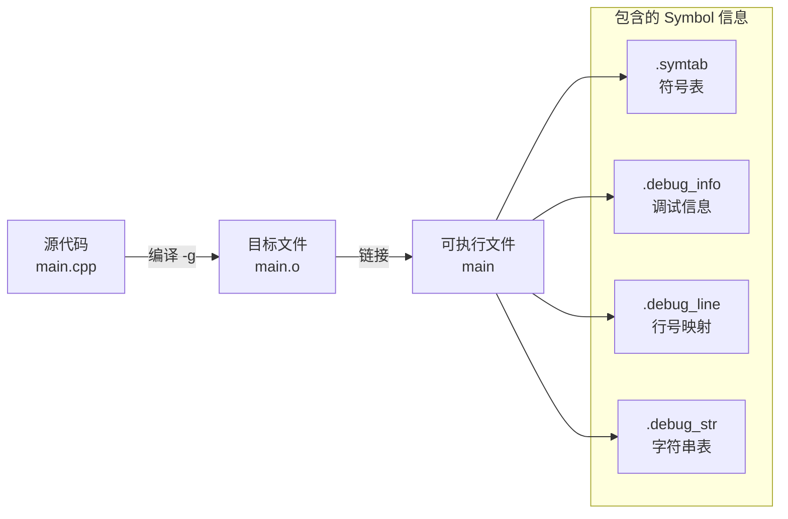
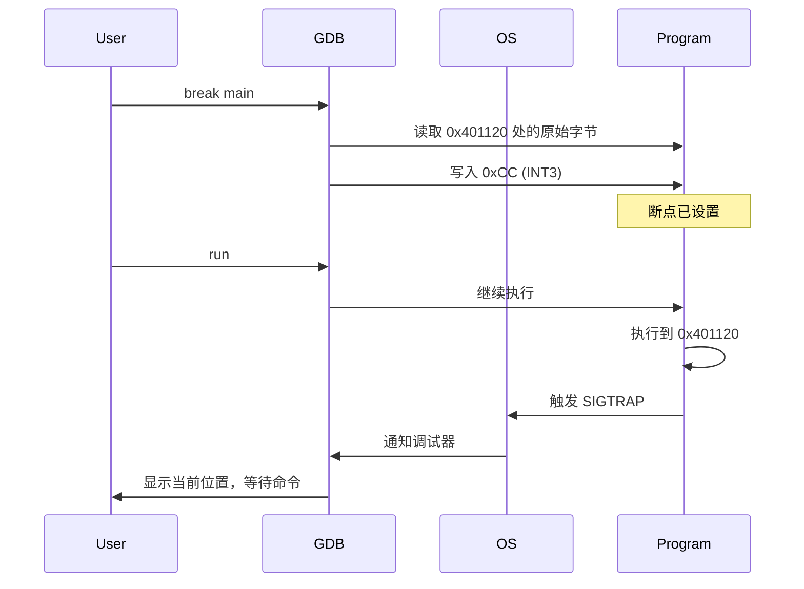
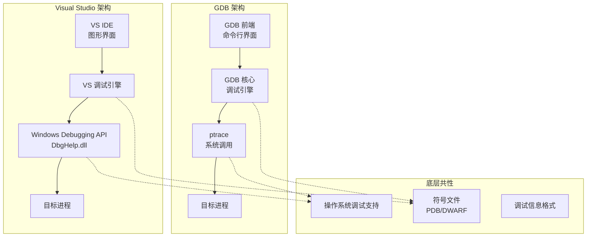
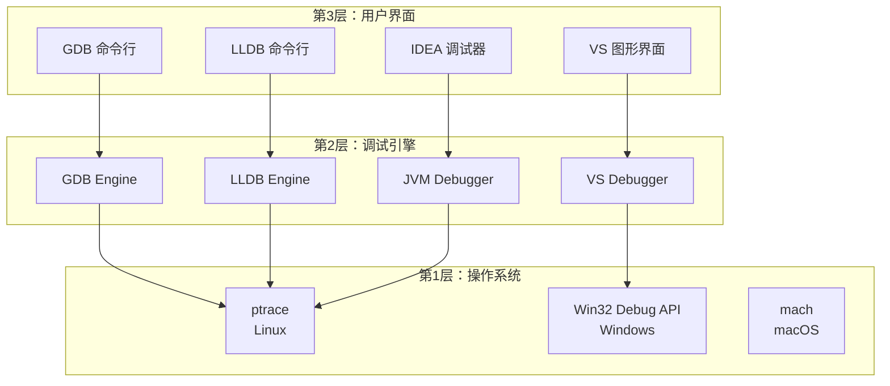

# 调试器核心概念与原理

> [!info] 阅读建议
> 本文从「原理层」理解调试器，建议配合 [[03-C++编程/GDB调试指南.md|GDB 使用指南]] 一起学习。

---

## 一、调试的本质：程序执行的「时间旅行」

### 1.1 调试器能做什么？

调试器的核心能力可以归纳为：**在程序执行的任意时刻，暂停、观察、修改、继续**。


### 1.2 实现调试的关键：操作系统支持

调试器并非「魔法」，它依赖操作系统的机制：

| 机制             | 作用        | Linux实现           |
| -------------- | --------- | ----------------- |
| **信号(Signal)** | 通知调试器事件发生 | `SIGTRAP` 断点触发    |
| **系统调用**       | 控制目标进程    | `ptrace` 系统调用     |
| **内存访问**       | 读写目标进程内存  | `/proc/[pid]/mem` |

> [!note] ptrace 系统调用
> `ptrace` 是 Linux 下调试的基石。它允许一个进程（调试器）控制另一个进程（被调试程序）的执行，读取/修改其内存和寄存器。

---

## 二、核心概念：Symbol（符号）

### 2.1 什么是 Symbol？

**Symbol（符号）** 是程序中「有名字的实体」的统称。它建立了**二进制地址 ↔ 人类可读名称** 的映射。

```
┌─────────────────────────────────────────────────────────┐
│  地址（二进制）    │    Symbol（人类可读）               │
├─────────────────────────────────────────────────────────┤
│  0x401120         │    main() 函数入口                  │
│  0x401156         │    main() 第 20 行代码              │
│  0x4040a0         │    global_var 全局变量              │
│  0x7ffd...        │    local_var (栈上)                 │
│  0x401230         │    MyClass::process() 方法          │
└─────────────────────────────────────────────────────────┘
```

### 2.2 Symbol 的类型

| Symbol 类型 | 说明            | 示例                                  |
| --------- | ------------- | ----------------------------------- |
| **函数符号**  | 函数的名称和地址      | `main`, `printf`, `calculate`       |
| **变量符号**  | 全局/静态变量的名称和地址 | `g_count`, `s_instance`             |
| **类型符号**  | 结构体/类的定义信息    | `struct Point`, `class std::string` |
| **行号符号**  | 源代码行与机器码的对应   | `main.cpp:42 ↔ 0x401156`            |

### 2.3 Symbol 从哪里来？



> [!warning] 注意区分
> - **符号表（Symbol Table）**：即使没有 `-g` 也会存在，包含函数名和全局变量（用于链接）
> - **调试信息（Debug Info）**：需要 `-g` 编译选项，包含局部变量、行号、类型定义等

### 2.4 查看 Symbol 信息

```bash
# 查看可执行文件的符号表
nm ./program

# 查看详细的调试信息（需安装 dwarfdump）
dwarfdump ./program

# GDB 中查看符号
(gdb) info functions        # 列出所有函数
(gdb) info variables        # 列出所有全局/静态变量
(gdb) info scope main       # 查看 main 函数的局部变量
```

---

## 三、核心概念：调试信息格式（DWARF）

### 3.1 什么是 DWARF？

**DWARF** 是调试信息的标准格式（不是缩写的首字母，只是模仿 ELF 的命名风格）。

当使用 `-g` 编译时，编译器生成 DWARF 格式的调试信息，嵌入到可执行文件中。

> [!important] 调试格式由编译器决定，而非操作系统
> DWARF 是 GNU 工具链（GCC/Clang）使用的格式，不是跨平台的唯一标准。

### 3.2 各平台的调试信息格式对比

| 平台/编译器                  | 调试格式      | 说明                              |
| ----------------------- | --------- | ------------------------------- |
| **Linux + GCC/Clang**   | **DWARF** | 嵌入可执行文件（ELF）内部                  |
| **macOS + Clang**       | **DWARF** | 默认嵌入，也可用 `dsymutil` 分离成 `.dSYM` |
| **Windows + MSVC**      | **PDB**   | 生成独立的 `.pdb` 文件                 |
| **Windows + MinGW/g++** | **DWARF** | GNU 工具链即使在 Windows 上也用 DWARF    |

> [!example] 关键理解
> **调试格式由编译器决定，不是操作系统。**
>
> ```bash
> # Windows 上，MinGW 的 g++ 仍然生成 DWARF
> g++ -g main.cpp -o main.exe   # 包含 DWARF 信息
>
> # Windows 上，MSVC 的 cl 生成 PDB
> cl /Zi main.cpp               # 生成 main.exe + main.pdb
> ```

### 3.3 DWARF 的核心段

```
可执行文件中的调试相关段：

.debug_info     → 主要的调试信息（编译单元、函数、变量）
.debug_abbrev   → 信息格式的缩写表（压缩用）
.debug_line     → 行号映射（机器码 ↔ 源代码行）
.debug_str      → 字符串表（变量名、函数名等）
.debug_frame    → 调用栈展开信息
.debug_loc      → 变量的位置信息（寄存器/栈/内存）
```

### 3.4 行号映射的工作原理

这是调试器显示「当前执行到哪一行」的基础：

```
源代码:                    机器码:
int add(int a, int b) {    0x401120: push rbp
    int c = a + b;         0x401121: mov rbp, rsp
    return c;              0x401124: mov eax, [rbp+8]
}                          0x401127: add eax, [rbp+12]
                           0x40112a: mov [rbp-4], eax  ← c = a + b
                           0x40112d: mov eax, [rbp-4]  ← return c
                           0x401130: pop rbp
                           0x401131: ret

.debug_line 中的映射:
  0x401120 ↔ add.cpp:1  (函数入口)
  0x40112a ↔ add.cpp:3  (c = a + b)
  0x40112d ↔ add.cpp:4  (return c)
```

### 3.5 变量位置信息

调试器如何知道变量 `x` 存储在哪里？

```cpp
void foo(int param) {      // param 可能在寄存器 %edi
    int local = param;     // local 在栈上 [rbp-4]
    int *ptr = &local;     // ptr 在栈上 [rbp-16]
    // ...
}
```

DWARF 会记录：
- `param`: 在 `0x401120-0x401130` 范围内位于 `%edi` 寄存器
- `local`: 在 `0x401130-0x401140` 范围内位于 `[rbp-4]`
- `ptr`: 在 `0x401140-0x401150` 范围内位于 `[rbp-16]`

这让调试器能**在任意执行点找到变量的值**。

> [!tip] 深入阅读
> 关于"多个进程同时运行时，调试器如何确保变量位置不冲突"的详细解答，见 [[调试器如何找到变量位置——进程隔离与DWARF调试信息]]。

---

## 四、核心概念：断点的实现原理

### 4.1 软件断点（Software Breakpoint）

这是最常见的断点类型，也是 GDB 默认使用的。

> [!question] 疑惑：INT3 插入到哪里？
> 是插入磁盘上的可执行文件，还是内存中的进程？详细解答见 [[调试器 INT3 断点插入的位置详解]]。

**原理：插入 INT3 指令**

```
正常代码：              设置断点后：
0x401120: mov eax, 1    0x401120: 0xCC (INT3)
0x401121: add eax, 2    0x401121: add eax, 2
0x401124: ret           0x401124: ret
```

当 CPU 执行到 `0xCC`（INT3 指令，单字节）时：
1. 触发 `SIGTRAP` 信号
2. 操作系统暂停进程
3. 调试器收到通知
4. 调试器恢复原始指令，让用户查看状态
5. 用户继续执行时，重新插入断点



### 4.2 硬件断点（Hardware Breakpoint）

当需要调试 **ROM/只读内存** 或 **不修改代码** 时，使用硬件断点。

**原理：CPU 调试寄存器**

x86/x64 处理器有 4 个调试寄存器（DR0-DR3）：
- 写入需要监控的地址
- CPU 自动检测访问
- 不修改目标代码

```gdb
# GDB 设置硬件断点
(gdb) hbreak function_name
(gdb) watch variable_name   # 实际上也使用硬件资源
```

> [!warning] 硬件断点限制
> 数量受限（通常最多 4 个），由 CPU 决定。

### 4.3 观察点（Watchpoint）的实现

**软件观察点**：单步执行，每次检查变量值（极慢）

**硬件观察点**：使用 CPU 调试寄存器监控内存地址
- 写入观察点：变量被修改时触发
- 读取观察点：变量被读取时触发
- 访问观察点：读写都触发

---

## 五、调用栈（Call Stack）的实现

### 5.1 栈帧（Stack Frame）结构

```
高地址
┌─────────────────┐
│  返回地址        │ ← 调用者的下一条指令
├─────────────────┤
│  保存的 RBP      │ ← 上一个栈帧的基址
├─────────────────┤ ← RBP（当前栈帧基址）
│  局部变量 2      │
├─────────────────┤
│  局部变量 1      │
├─────────────────┤
│  参数（如果多于6个）│
├─────────────────┤ ← RSP（栈顶）
│    ...          │
└─────────────────┘
低地址
```

### 5.2 栈展开（Stack Unwinding）

调试器如何「回溯」调用链？

**方式 1：帧指针链（Frame Pointer）**
```
RBP → 当前函数的保存 RBP → 调用者的保存 RBP → ...
```

**方式 2：DWARF 的 .debug_frame**
当编译优化（`-fomit-frame-pointer`）去掉了帧指针，调试器依赖 DWARF 信息来恢复栈帧。


---

## 六、GDB vs Visual Studio：深度对比

### 6.1 架构层面的对比



### 6.2 功能对比表

| 特性        | GDB              | Visual Studio | 说明          |
| --------- | ---------------- | ------------- | ----------- |
| **用户界面**  | 命令行 / TUI        | 图形界面          | VS 更适合可视化调试 |
| **符号格式**  | DWARF            | PDB           | 不同但等效的调试信息  |
| **多线程调试** | ✅ `info threads` | ✅ 线程窗口        | 概念相同，操作不同   |
| **条件断点**  | ✅ `break if`     | ✅ 断点条件        | 功能一致        |
| **数据断点**  | ✅ `watch`        | ✅ 数据断点        | 都依赖硬件支持     |
| **内存查看**  | ✅ `x` 命令         | ✅ 内存窗口        | VS 可视化更好    |
| **表达式求值** | ✅ `print`        | ✅ 监视窗口        | 功能相同        |
| **调用栈**   | ✅ `backtrace`    | ✅ 调用堆栈窗口      | 原理相同        |
| **即时窗口**  | ❌                | ✅ 即时窗口        | VS 独有优势     |
| **编辑并继续** | 有限支持             | ✅ 完善支持        | VS 开发效率更高   |

### 6.3 核心概念的对应关系

| 概念     | GDB 术语                  | Visual Studio 术语 |
| ------ | ----------------------- | ---------------- |
| 调试信息文件 | 含 DWARF 的可执行文件          | `.pdb` 文件        |
| 断点类型   | breakpoint / watchpoint | 断点 / 数据断点        |
| 单步执行   | step / next             | 逐语句 / 逐过程        |
| 调用栈    | backtrace / frame       | 调用堆栈 / 堆栈帧       |
| 变量查看   | print / display         | 监视 / 自动窗口        |
| 内存检查   | x / examine             | 内存窗口             |

### 6.4 本质共性：都是「调试器」

无论 GDB 还是 VS，它们的**核心能力**都来自相同的原理：

```
┌─────────────────────────────────────────────┐
│           调试器的本质能力                    │
├─────────────────────────────────────────────┤
│  1. 控制执行流（暂停/继续/单步）              │
│  2. 访问程序状态（内存/寄存器/变量）          │
│  3. 符号解析（地址 ↔ 名称转换）              │
│  4. 栈展开（调用链重建）                      │
└─────────────────────────────────────────────┘
                    ↓
┌─────────────────────────────────────────────┐
│           依赖的操作系统机制                  │
├─────────────────────────────────────────────┤
│  Linux: ptrace, /proc, signals              │
│  Windows: DebugActiveProcess, DbgHelp       │
│  macOS: mach_exc_server, task_for_pid       │
└─────────────────────────────────────────────┘
```

---

## 七、如何建立整体理解框架

### 7.1 三层理解模型



**学习建议**：
1. **先理解第1层**：了解操作系统如何支持调试（`ptrace`、信号、内存访问）
2. **再理解第2层**：调试引擎如何解析符号、设置断点、展开栈
3. **最后学第3层**：具体工具的使用只是「界面差异」

### 7.2 核心知识图谱

```
                    ┌─────────────────┐
                    │   调试器原理     │
                    └────────┬────────┘
                             │
        ┌────────────────────┼────────────────────┐
        ↓                    ↓                    ↓
   ┌─────────┐         ┌──────────┐         ┌──────────┐
   │ Symbol  │         │ 执行控制  │         │ 状态观察  │
   │ 符号系统 │         │          │         │          │
   └────┬────┘         └────┬─────┘         └────┬─────┘
        │                   │                    │
   ┌────┴────┐         ┌────┴────┐          ┌────┴────┐
   │DWARF/PDB│         │软件/硬件 │          │内存/寄存器│
   │符号表   │         │断点     │          │变量解析  │
   │行号映射 │         │单步执行 │          │表达式   │
   └─────────┘         └─────────┘          └─────────┘
```

### 7.3 从 VS 迁移到 GDB 的思维转换

| Visual Studio 思维 | GDB 对应思维 |
|-------------------|-------------|
| 点击行号设置断点 | `break filename:line` |
| F11 逐语句 | `step` |
| F10 逐过程 | `next` |
| 鼠标悬停查看变量 | `print variable` |
| 监视窗口 | `display variable` |
| 调用堆栈窗口 | `backtrace` |
| 断点条件输入框 | `break line if condition` |
| 附加到进程 | `attach pid` |

---

## 八、实践：查看调试信息

### 8.1 查看编译后的符号信息

```bash
# 编译测试程序
cat > test.cpp << 'EOF'
int global_var = 42;

int add(int a, int b) {
    int c = a + b;
    return c;
}

int main() {
    int x = 10;
    int y = 20;
    int result = add(x, y);
    return result;
}
EOF

# 带调试信息编译
g++ -g -O0 test.cpp -o test_debug

# 不带调试信息编译
g++ -O0 test.cpp -o test_no_debug
```

### 8.2 对比有无调试信息的文件

```bash
# 查看文件大小
ls -lh test_*
# test_debug 明显更大，因为包含 DWARF 信息

# 查看符号表（两者都有）
nm test_debug | grep add
nm test_no_debug | grep add

# 查看 DWARF 信息（只有 debug 版本有）
readelf --debug-dump=info test_debug | head -50

# 使用 GDB 对比
(gdb) file test_debug
(gdb) list                    # ✅ 能显示源码
(gdb) info locals             # ✅ 能显示局部变量

(gdb) file test_no_debug
(gdb) list                    # ❌ 没有源码信息
(gdb) info locals             # ❌ 无法显示局部变量
```

---

## 九、总结

### 核心要点回顾

1. **Symbol（符号）**：程序实体的命名，调试器通过符号将二进制地址转换为人类可读的名称

2. **调试信息（DWARF/PDB）**：编译器生成的元数据，包含行号映射、变量位置、类型定义等

3. **断点原理**：软件断点通过插入 INT3 指令实现，硬件断点使用 CPU 调试寄存器

4. **GDB vs VS**：
   - **差异**：界面、命令语法、符号格式（DWARF vs PDB）
   - **共性**：底层原理相同（控制执行、观察状态、解析符号）

5. **学习路径**：理解操作系统机制 → 理解调试引擎原理 → 掌握具体工具使用

### 思维转变

```
从：「GDB 命令怎么用？」
到：「调试器需要哪些信息才能工作？这些信息从哪里来？」
```

当你理解 **为什么** 需要 `-g` 选项、**为什么** 有时候变量显示不出来、**为什么** 优化后的代码难以调试——你就真正理解了调试器的本质。

---

## 参考资源

- [[03-C++编程/GDB调试指南.md|GDB 调试学习笔记]]
- [[03-C++编程/C++编译选项.md|C++ 编译选项详解]]
- [[03-C++编程/C++编译过程原理.md|C++ 编译过程原理]]
- [DWARF 标准文档](http://dwarfstd.org/)
- [Linux ptrace 手册](https://man7.org/linux/man-pages/man2/ptrace.2.html)
