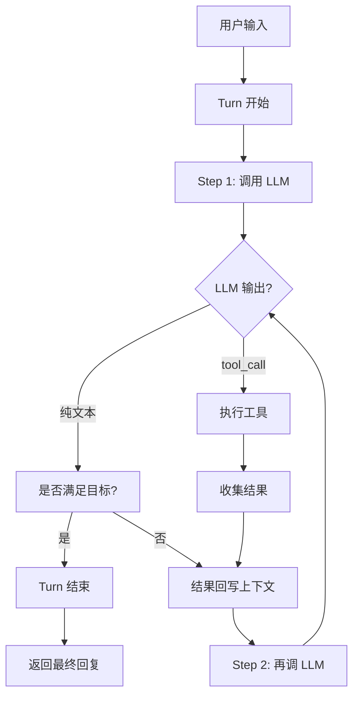

> [← 返回 Agent 索引]([[Notes/Agent/索引|Agent 索引]])

# Agent Loop 架构解析：从对话框到自主执行

## Why：为什么要理解 Agent Loop？

### 问题背景

没有 Agent Loop 时，**LLM（大语言模型，Large Language Model）** 只能做**一问一答**。你问它"帮我改一下这个文件"，它把代码写出来给你，但**不会真的去改文件**。因为 LLM 本身没有手，也不会主动发起第二次调用。

> [!info] 前置概念：LLM 是什么？
> 
> **直觉版**：你可以把 LLM 想象成一个**读过人类几乎所有公开书籍、论文、代码、网页的"超级文字预测器"**。你给它一段话，它根据之前读过的海量文本，**一个词一个词地预测接下来最可能出现的词**，最后拼成一段完整的回复。它本身不会读文件、不会上网、也不会运行代码——它只会"说话"。
> 
> **为什么 Agent 离不开它**：LLM 是 Agent 的"大脑"，负责理解意图、制定计划、生成回复。而 **Agent Loop 就是套在这个大脑外面的"神经系统和手脚"**——它把 LLM 说的话翻译成工具调用，执行完再把结果反馈给大脑。

在**游戏引擎**里，这个问题会以更危险的形式出现：
- 你让 AI "把玩家移动速度减半"，它改了一个深层继承树的基类字段，但运行时这个字段根本不会被读取
- 运行时崩溃，AI 拿到了调用栈文本，却不知道内存中真正发生了什么
- 多个 AI Agent 同时工作，一个的改动覆盖了另一个的结果

Agent Loop 不是让模型变聪明了，而是**在模型外部套了一个循环**，让 AI 能够：
1. **观察**（读文件、读引擎状态）
2. **行动**（改文件、调用引擎工具）
3. **再观察**（基于结果继续推理）

### 不用它的后果

如果去掉 Agent Loop，Claude Code 会退化为一个普通 Chat 客户端，Kimi CLI 会变成一次性的 API 调用器。所有多轮推理、错误恢复、上下文压缩、并行工具执行全部消失。

### 应用场景

1. **自动修复 bug**：AI 读取报错 → 搜索相关文件 → 定位根因 → 修改代码 → 运行测试 → 根据测试结果再次调整
2. **引擎参数调优**：AI 读取当前物理参数 → 修改碰撞体尺寸 → 运行模拟 → 观察结果 → 继续微调
3. **多工具并行收集信息**：同时调用 `ReadFile` 和 `Grep`，然后综合回答

> [!tip] 从对话框出发
> 在引入 Agent Loop 之前，AI 只能生成"你应该改什么"的文本。引入之后，它能在同一轮对话里**边想边做**——生成工具调用、等待结果、继续推理。这个质变的核心不是模型，而是**套在模型外面的那个循环**。

## What：Agent Loop 的本质是什么？

**核心定义**：Agent Loop 是一个**以 LLM 调用为核心的事件驱动循环**。它的职责是：持续地把"当前上下文"喂给 LLM，把 LLM 的输出（文本或工具调用）解析成可执行动作，执行动作，收集结果，然后**把结果回写到上下文**，再次进入下一轮——直到达成目标或被终止。

### 核心概念速查

| 概念 | 作用 | 在 Agent 中的体现 |
|-----|------|-----------------|
| **LLM** | 负责理解、推理和生成回复的"大脑" | Claude、Kimi 等模型 |
| **Turn（回合）** | 从用户输入到 Agent 给出最终回应的完整周期 | Kimi CLI 的 `TurnBegin` / `TurnEnd` |
| **Step（步）** | Turn 内部的一次 LLM 调用 + 工具执行 | Kimi CLI 的 `StepBegin(n=step_no)` |
| **Streaming** | LLM 的响应是流式的，不需要等全部说完 | Claude Code 的 `yield` 事件流 |
| **Tool Call** | LLM 生成的结构化调用请求（Function Calling） | `tool_use` 块 / `ToolCall` 事件 |
| **State Carry-over** | 每轮循环把新结果追加到上下文中 | `messages` 数组的不可变更新 |
| **Checkpoint / Rollback** | 在关键节点保存状态，失败时回滚 | Kimi CLI 的 `BackToTheFuture` |

### 架构图解



---

前面我们搞懂了 **Agent Loop 的本质是一个"套在 LLM 外面的事件驱动循环"**。现在我们要回答的问题是：**这个循环在 Claude Code 和 Kimi CLI 的源码里，到底长什么样？** 我们将分别从"整体架构对比"、"核心流程伪代码"、"关键源码印证"三个层面展开。不要担心，我会先把代码翻译成日常语言，再贴出真正的源码。

---

## How：不同 Agent 工具是如何实现的？

### 1. 宏观对比：Claude Code vs Kimi CLI

**先给一个总体的直觉比喻**：

> 想象两家快递公司。Claude Code 像一家把所有流程（接单、分拣、配送）都写进一本厚厚手册的公司，所有快递员按同一本手册内联执行，追求极致效率；Kimi CLI 像一家公司把业务拆成「调度中心 → 分拣站 → 配送员」三层，每一层通过标准单据（Wire 协议）交接，方便接入不同的客户端（APP、小程序、网页）。

接下来再展开细节对比：

| 维度 | Claude Code | Kimi CLI | 差异原因分析 |
|------|-------------|----------|-------------|
| **核心抽象** | 把所有逻辑写进一个 `while(true)` 循环函数里，像一本厚厚的操作手册 | 拆成三层：一次完整对话（Turn）→ 循环调度层（Agent Loop）→ 单次 LLM 调用（Step） | Claude Code 像本地应用追求极致效率；Kimi CLI 像餐厅把后厨（LLM）外包给中央厨房（`kosong` 库），自己专注点菜和上菜 |
| **事件通知方式** | 循环函数内部直接 `yield`（产出一个值），像主持人边说边播，听众（UI）听到一段就能立刻反应 | 通过 `wire_send()` 发送标准化事件，像快递公司的标准单据，Web 端、CLI 端、SDK 端都能统一看懂 | Kimi 需要支持多种客户端，必须用"普通话"；Claude 只有终端一个客户端，可以直接"耳语" |
| **工具执行时机** | 在 Agent Loop 层显式实现 `StreamingToolExecutor`：边消费 LLM 流式输出，边提前派发已完成的工具调用 | 把 LLM 调用 + 工具执行封装在 `kosong.step()` 中。`kosong` 的 `generate()` 在消费 LLM 流式输出时，一旦解析出完整的 `ToolCall`，就立即回调 `on_tool_call` → `toolset.handle()` 执行工具。工具结果通过 `ToolResultFuture` 异步完成，再用 `on_tool_result` 实时回传 | Claude 在"前台"（Loop 层）显式控制流式调度；Kimi 把流式调度细节下沉到"后厨"（`kosong` 子包），Loop 层只负责"点菜和收盘子" |
| **错误恢复策略** | 非常丰富：模型出错了换备用模型、上下文太长了自动压缩三层、还能紧急截断（reactive compact） | 相对简洁：失败了重试几次、实在不行就通过 `BackToTheFuture` 回到上一个存档点 | Claude 面对的是超大代码库和超长对话，必须准备更多"急救包"；Kimi 更偏向轻量快速任务 |
| **状态回滚方式** | 不保存"存档点"，而是每次用全新的 `State` 对象替换旧的，像用新照片覆盖旧照片 | 显式地给上下文拍快照（`checkpoint`），不满意时直接 `revert_to(checkpoint_id)`，像游戏读档 | Kimi 更直观、更像人类的 Undo 习惯；Claude 更函数式、更不可变 |
| **对引擎的启示** | 如果你追求**最低延迟**（比如运行时 AI 实时调参），学 Claude 的扁平循环 | 如果你需要**多端一致**（比如 Editor 面板、Web 调试器、CLI 都要看到同样的 AI 状态），学 Kimi 的分层 + Wire 协议 | 引擎可以融合两者：运行时借鉴 Claude 的低延迟，Editor 借鉴 Kimi 的标准化事件 |

> **用人话讲**：Claude Code 之所以把所有逻辑塞在一个 `while(true)` 里，是因为它想让自己像一个"本地应用"——开机即跑，不依赖外部服务；而 Kimi CLI 把 LLM 调用外包给 `kosong` 子包，就像餐厅把配菜外包给中央厨房，自己只负责点菜和上菜，这样前端（UI）和后厨（LLM）可以独立升级。

> [!info] 概念插播：kosong
> 
> **直觉版**：你可以把 `kosong` 想象成一家"中央厨房"。餐厅老板（Kimi CLI）不需要自己买菜、切菜、炒菜，只需要对厨房喊一声"来一单"，厨房就会把做好的菜端上来。
> 
> **定义版**：`kosong` 是 Kimi CLI monorepo 中的一个开源子包（`packages/kosong`），也是一个独立的 LLM 抽象层库（[`MoonshotAI/kosong`](https://github.com/MoonshotAI/kosong)）。它负责封装 LLM API 调用、流式响应解析、工具执行和结果格式化。
> 
> **为什么这里要用它**：Kimi CLI 的 Agent Loop 层不需要关心"HTTP 请求怎么发"、"SSE 流式字节怎么拆"、"tool_calls 怎么从 JSON 里提取"这些脏活累活。`kosong.step()` 一次性把这些事全包办了，Loop 层只负责"什么时候调用下一步"和"把事件广播给 UI"。
> 
> **引擎审视**：这相当于把"LLM 通信层"从引擎 Editor 插件里完全剥离出去。如果你的引擎需要支持多个 AI 客户端（Claude Desktop、Kimi CLI、Cursor），最好也把 LLM 交互细节封装在一个独立的"中央厨房"模块里，而不是让每个客户端都自己实现一遍 HTTP + 流式解析。

> [!info] 概念插播：AsyncGenerator / yield
> 
> **直觉版**：想象一个广播电台，主持人不是一次性把整期节目录好给你，而是边说边播。你听到一段，他再讲下一段。
> 
> **定义版**：`async function*` 返回一个异步生成器，每次 `yield` 产出一个值，调用方可以立即处理这个值，而不需要等待函数全部执行完毕。
> 
> **为什么 Claude Code 要用它**：因为 LLM 的回复是流式的，工具调用可能在回复中途就被触发。`yield` 让 Loop 可以在"听到一半"时就采取行动（比如更新 UI、提前执行工具），而不是傻等全部说完。
>
> **引擎审视**：`Notes/SelfGameEngine/从零开始的引擎骨架` 中 **AgentBridge** 和 **确定性 Tick** 的设计假设 Agent 只能在 Tick 边界观察/干预。但源码中的 `yield` 事件流表明，Agent 与引擎的通信应该是一个**流式协议**。读操作可以在 Tick 中途通过事件流实时响应，只有写操作才需要累积到 Tick 边界统一提交。

> [!warning] 如果不这么做会怎样？
> 如果 Claude Code 不用 `StreamingToolExecutor` 提前执行工具，而是等 LLM 全部说完再跑工具，那么"模型生成时间"和"工具执行时间"就会串行相加。用户本来可以边看到 AI 思考边等工具跑完，结果变成了"先发呆 5 秒看 AI 写字，再发呆 10 秒等工具执行"。
>
> **Kimi CLI 没有这个问题吗？** 实际上，根据 `kosong` 源码（`packages/kosong/src/kosong/_generate.py` 与 `__init__.py`），`generate()` 在消费 LLM 流式输出时，一旦遇到完整的 `ToolCall` part，就会立即回调 `on_tool_call`，而 `step()` 里的回调会立刻调用 `toolset.handle(tool_call)` 并注册 `ToolResultFuture` 的完成监听。这意味着 **Kimi CLI 同样能在 LLM 还在"说话"的过程中就开始执行工具**，只是这个调度逻辑封装在 `kosong` 子包里，对 Agent Loop 层不可见。**差异不在"有没有流式"，而在"谁来负责调度流式工具"**——Claude Code 把调度权放在 Loop 层，Kimi CLI 把它下沉到 `kosong`。

> [!warning] 如果 Kimi CLI 不分层会怎样？
> 如果 Kimi CLI 也把所有逻辑塞在一个函数里，那么每当要支持一个新的客户端（比如 Web UI 或 VS Code 插件），就得重写一遍循环逻辑。而有了 `wire_send()` 这个标准接口，新客户端只需要"听懂"同一套事件语言，就能接入。

### 2. 核心机制伪代码

#### 方案 A：Claude Code 模式（扁平内联生成器）

这段伪代码模拟了 Claude Code 的 `queryLoop`：一个函数包揽所有的事情。

```typescript
async function* agentLoop(messages, tools) {
  while (true) {
    yield { type: 'stream_request_start' }
    
    const assistantMessages = []
    const toolUseBlocks = []
    const streamingExecutor = new StreamingToolExecutor(tools)
    
    // 流式调用 LLM
    for await (const chunk of streamLLM(messages, tools)) {
      if (chunk.type === 'text') {
        yield chunk  // UI 实时更新
      }
      if (chunk.type === 'tool_use') {
        toolUseBlocks.push(chunk)
        streamingExecutor.addTool(chunk)  // 提前开跑
      }
      // 流式过程中就把已完成的工具结果 yield 出去
      for (const result of streamingExecutor.getCompletedResults()) {
        yield result.message
      }
    }
    
    // 收集剩余工具结果
    const toolResults = []
    for await (const result of streamingExecutor.getRemainingResults()) {
      yield result.message
      toolResults.push(result)
    }
    
    if (toolUseBlocks.length === 0) {
      return { reason: 'completed' }  // 没有工具调用，结束 Turn
    }
    
    // 组装下一轮上下文（不可变更新：不修改原数组，而是创建新数组）
    messages = [...messages, ...assistantMessages, ...toolResults]
    // while(true) 继续下一轮
  }
}
```

**这段代码在做什么**：就像一个不停转圈的水车。每一圈，它先向 LLM 要一段流式回复；在回复还没结束时，如果发现 AI 已经"写好了"一张工具调用纸条，就立刻把纸条交给 `StreamingToolExecutor` 去执行；执行过程中产生的进度也实时 `yield` 出去给用户看。

**核心设计思想**：
- 所有控制权都在这一个生成器里，没有中间商赚差价
- `StreamingToolExecutor` 把"模型生成时间"和"工具执行时间"重叠起来，减少用户等待
- 每一轮的状态更新是**不可变的**（`messages = [...]`），像拍照留档，便于调试和回溯

#### 方案 B：Kimi CLI 模式（分层编排）

这段伪代码模拟了 Kimi CLI 的 `KimiSoul`：把一次完整对话拆成三层，各司其职。

```python
class KimiSoul:
    async def run(self, user_input):
        # 通知所有人：一轮新对话开始了
        wire_send(TurnBegin(user_input=user_input))
        
        # Turn 层：决定走普通对话还是特殊命令（如 /task）
        if is_slash_command(user_input):
            await self._run_slash_command(user_input)
        else:
            await self._turn(user_message)
        
        wire_send(TurnEnd())
    
    async def _turn(self, user_message):
        # Agent Loop 层：管理 Step 序列
        outcome = await self._agent_loop()
        return outcome
    
    async def _agent_loop(self):
        step_no = 0
        while True:
            step_no += 1
            # 通知 UI：开始第 N 步思考
            wire_send(StepBegin(n=step_no))
            
            # 自动上下文压缩：如果记忆太满，先摘要一下
            if should_auto_compact(self._context):
                await self.compact_context()
            
            # Step 层：调用 kosong 子包执行 LLM + 工具
            step_outcome = await self._step()
            
            if step_outcome.stop_reason == "no_tool_calls":
                return TurnOutcome(final_message=step_outcome.assistant_message)
            
            # 有 steers（用户中途追加输入），强制再走一步
            if await self._consume_pending_steers():
                continue
    
    async def _step(self):
        # 调用 kosong.step 完成一次 LLM 调用和工具执行
        # kosong 的 generate() 在流式消费 LLM 输出时，一旦遇到完整 ToolCall
        # 就会立即回调 on_tool_call → toolset.handle()，所以工具在流式过程中就被派发了
        result = await kosong.step(
            chat_provider, system_prompt, toolset, history,
            on_message_part=wire_send,      # 流式消息实时发给 UI
            on_tool_result=wire_send,       # 工具结果异步完成后实时发给 UI
        )
        
        # Loop 层等待所有工具执行完毕（对 Loop 层而言，这里是"批处理"边界）
        tool_results = await result.tool_results()
        
        # 更新上下文
        await self._grow_context(result, tool_results)
        
        # 处理 D-Mail（来自子 Agent / 未来的消息）
        if dmail := self._denwa_renji.fetch_pending_dmail():
            raise BackToTheFuture(dmail.checkpoint_id, dmail.messages)
        
        if result.tool_calls:
            return None  # 有工具调用，需要继续下一步
        return StepOutcome(stop_reason="no_tool_calls")
```

**这段代码在做什么**：Kimi CLI 把一次完整对话比作一场演出。`run` 是舞台总监，负责开场和闭幕；`_agent_loop` 是节目主持人，负责安排每一个环节（Step）；`_step` 是具体的演员，负责和 LLM 这位"编剧"对接。所有台前幕后的状态变化，都通过 `wire_send()` 这个"舞台广播"实时通知给观众（UI）。

> [!info] 关键点
> 根据 `kosong` 源码（`packages/kosong/src/kosong/_generate.py:64-65`），`generate()` 在消费 LLM 流式输出时，一旦解析出完整的 `ToolCall` part，就会立即调用 `on_tool_call` 回调。而 `kosong.step()` 中的 `on_tool_call` 回调会立刻调用 `toolset.handle(tool_call)` 并注册 `ToolResultFuture` 的完成监听（`packages/kosong/src/kosong/__init__.py:144-155`）。
>
> 这说明 **Kimi CLI 同样能在 LLM 还在"说话"的过程中就开始执行工具**，并通过 `on_tool_result` 实时把结果发给 UI。只是这个调度逻辑完全封装在 `kosong` 子包里，Agent Loop 层（`_agent_loop`）只能在 `_step()` 返回后批量收集最终结果。这和 Claude Code 的 `queryLoop` 在 Loop 层显式调度流式工具，是**控制粒度**的差异，不是"有无流式"的差异。

**核心设计思想**：
- **明确的分层**：`run` (Turn) → `_agent_loop` (Step 序列) → `_step` (单次 LLM 调用)，每层只关心自己的职责
- **标准化事件协议**：所有对 UI 的输出都通过 `wire_send()`，像快递单号一样标准化，Web 端、CLI 端、SDK 端都能消费
- **状态管理外置**：`self._context` 专门负责历史消息的增删改查和 checkpoint，像图书馆的管理员
- **显式回滚机制**：`BackToTheFuture` + `_context.revert_to(checkpoint_id)`，不满意就"读档重来"

### 3. 关键源码印证

#### Claude Code：扁平循环与 StreamingToolExecutor

**这段代码在做什么**：这是 Claude Code 真正的"心脏"——`queryLoop` 函数。它用一个 `while(true)` 无限循环，把"调用 LLM → 消费流式输出 → 提前执行工具 → 组装状态"这四件事全部包在一个函数里。`state = next` 这一行体现了"不可变更新"：不修改旧状态，而是创建一个新状态对象替换它。

```typescript
// D:/workspace/claude-code-main/src/query.ts:241
async function* queryLoop(
  params: QueryParams,
  consumedCommandUuids: string[],
): AsyncGenerator<...> {
  let state: State = { messages: params.messages, ... }
  
  while (true) {
    yield { type: 'stream_request_start' }
    ...
    // 流式过程中提前执行工具
    for (const result of streamingToolExecutor.getCompletedResults()) {
      yield result.message
    }
    ...
    // 组装下一轮状态
    const next: State = {
      messages: [...messagesForQuery, ...assistantMessages, ...toolResults],
      ...
      transition: { reason: 'next_turn' },
    }
    state = next
  }
}
```

**为什么这样设计**：把所有控制权集中在一个生成器里，最大的好处是"没有中间商赚差价"。状态更新、流式消费、UI 通知都在同一个函数里完成，调试时只需要看这一个地方。`state = next` 的不可变更新让回溯变得简单：如果你想知道第 5 轮发生了什么，只需要保存第 5 个 `state` 对象即可。

#### Kimi CLI：分层与 Wire 事件协议

**这段代码在做什么**：这是 Kimi CLI 的 `_agent_loop` 方法。它自己不直接调用 LLM API，而是像一个"调度员"，不断调用 `_step()` 这个"外包团队"。每次 Step 开始前，它都会通过 `wire_send(StepBegin(...))` 向所有客户端广播"我要开始第 N 步思考了"。

```python
# D:/workspace/kimi-cli-main/src/kimi_cli/soul/kimisoul.py:670
async def _agent_loop(self) -> TurnOutcome:
    step_no = 0
    while True:
        step_no += 1
        wire_send(StepBegin(n=step_no))
        
        if should_auto_compact(...):
            await self.compact_context()
        
        step_outcome = await self._step()
        
        if step_outcome.stop_reason == "no_tool_calls":
            return TurnOutcome(...)
        
        if await self._consume_pending_steers():
            continue
```

**为什么这样设计**：`_agent_loop` 不直接调用 LLM API，而是调用 `_step()`，这让它可以专注做"流程编排"：决定什么时候开始压缩上下文、什么时候因为用户追加输入而多走一步、什么时候结束这一轮对话。真正的 LLM 调用细节全部下沉到 `kosong` 子包，Loop 层完全不用关心流式字节怎么解析。

**这段代码在做什么**：这是 `_step()` 的核心。它把 LLM 调用、流式消费、工具执行全部委托给 `kosong.step()`。`kosong` 源码证实，`generate()` 会在流式消费 LLM 输出的过程中立即回调 `on_tool_call` 派发工具，但 `_step()` 作为 Agent Loop 层的边界，只能等 `kosong.step()` 返回后统一收集最终结果。

```python
# D:/workspace/kimi-cli-main/src/kimi_cli/soul/kimisoul.py:833
result = await kosong.step(
    chat_provider,
    self._agent.system_prompt,
    self._agent.toolset,
    effective_history,
    on_message_part=wire_send,      # 流式消息回调
    on_tool_result=wire_send,       # 工具结果回调
)
```

**为什么这样设计**：`kosong` 作为 Kimi CLI 的 monorepo 子包，把"LLM 流式消费 + 工具异步派发"的复杂度完全封装在库层。Loop 层只关心"Step 是否结束"和"是否需要继续"，而不关心流式字节怎么解析、工具怎么并行执行。这就像是餐厅老板只关心"菜有没有上桌"，而不关心厨师怎么切菜、怎么炒菜。

## 引擎映射：这个设计对我的游戏引擎有什么启发？

### 1. 对应系统

Agent Loop 最像引擎里的 **脚本系统 + 编辑器命令队列 + AI 行为树调度器** 的混合体。

- **Claude Code 模式** 更像一个**紧耦合的运行时脚本系统**：所有逻辑在一个循环里跑，追求最低延迟
- **Kimi CLI 模式** 更像一个**编辑器 AI 插件架构**：通过标准化事件协议把 AI 状态桥接到 Editor UI，层次清晰，适合多人/多端协作

### 2. 可借鉴点

**借鉴 1：流式执行重叠（Claude Code 的 StreamingToolExecutor）**

引擎里，当 AI 生成一个"修改 100 个实体 Transform"的指令时，如果等 LLM 全部说完再执行，用户就要干等。可以借鉴 Claude Code 的思路：
- **读操作**：LLM 还在生成指令列表时，一旦解析出第一个实体 ID，就可以**提前并行查询** ECS 状态
- **写操作**：先进入 `CommandBuffer`，在 Tick 边界统一提交

**借鉴 2：标准化事件协议（Kimi CLI 的 Wire 协议）**

引擎 Editor 内嵌 AI 时，AI 的"正在思考"、"调用了工具 X"、"遇到错误"等状态需要同步到 UI。与其让 AI 模块直接操作 UI 控件，不如定义一套引擎专属的事件协议：

```cpp
enum class AIEvent {
    TurnBegin,      // AI 开始处理用户请求
    StepBegin,      // 开始一轮 LLM 调用
    ToolInvoked,    // AI 调用了某个引擎工具
    ToolCompleted,  // 工具执行完毕
    StatusUpdate,   // Token 消耗、上下文压力等
    TurnEnd,        // 当前请求处理完毕
}
```

这样 Editor UI、日志系统、网络同步模块都可以统一消费这套事件。

**借鉴 3：Checkpoint / Rollback（Kimi CLI 的 BackToTheFuture）**

引擎里 AI 的改动可能是破坏性的。引入显式 checkpoint：
1. AI 提出改动前，引擎保存 `WorldSnapshot`
2. AI 执行改动并运行几帧模拟
3. 如果结果不理想（比如物理爆炸、NPC 卡死），自动 `revert_to(checkpoint)`
4. 把失败信息回写给 AI，让它尝试另一种方案

### 3. 审视与修正行动项

> 以下修改已直接应用到 `Notes/SelfGameEngine/从零开始的引擎骨架.md`：

**发现 1：AgentBridge 的通信模型过于"批处理化"**

原笔记中 `AgentBridge` 的设计隐含了一个假设：Agent 只能在 Tick 边界调用工具，然后等下一帧观察结果。这相当于"没有 StreamingToolExecutor 的 Claude Code"——AI 必须等 LLM 完全说完才能开始行动。

**修正**：在 `AgentBridge` 小节补充说明：Agent 与引擎的交互应该是**流式协议**。对于读操作，允许在 Tick 执行过程中通过事件流实时查询；对于写操作，仍然累积到 Tick 边界统一提交。这样既能保持引擎执行的确定性，又能减少 AI 的等待延迟。

**发现 2：缺少对"变更指令列表"的显式设计**

原笔记提到了 `ChangeLog`（用于观察变更），但没有提到"命令缓冲"（Command Buffer）——一种让 AI 的改动先排队、再批量提交的数据结构。

**修正**：在 `阶段 2：好用` 的 `ChangeLog` 部分之后，补充 `CommandBuffer` 设计：
- AI 生成的每个 `set_component` 调用先进入 `CommandBuffer`
- Tick 结束时一次性应用所有命令
- 如果命令冲突或权限检查失败，整批回滚

**发现 3：没有体现 Loop 本身的结构**

原笔记把 `AgentBridge` 描述为一组孤立工具，但没有描述"谁来驱动这些工具的循环调用"。

**修正**：在笔记末尾的`必偷`清单中新增一条：
> **引入 Agent Loop 层**：不要只给 AI 暴露工具，还要有一个循环层负责 "调用 LLM → 解析 tool_calls → 执行引擎工具 → 把结果回写 → 再调 LLM"。这是让 AI 从"写代码"进化到"自主调试"的关键。

## 从源码到直觉：一句话总结

> 读了这些源码之后，我终于明白为什么 AI 能从"对话框"变成能自主干活的 Agent 了——因为 **Agent Loop 在 LLM 外部套了一个事件驱动循环**，让模型每一次输出都能被实时拦截、解析成工具调用、执行、再把结果喂回去。**这个循环不是模型的能力，而是套在模型外面的一层操作系统。**

## 延伸阅读与待办

- [ ] [[Tool-System-架构解析：AI的手脚与边界]]
- [ ] [[Context-Management-架构解析：记忆与压缩]]
- [ ] [[从零开始的引擎骨架]]（已根据本篇洞察修正）
- [ ] 手写一个最小 Python Agent Loop，对比 Claude Code 模式与 Kimi CLI 模式的实现差异
