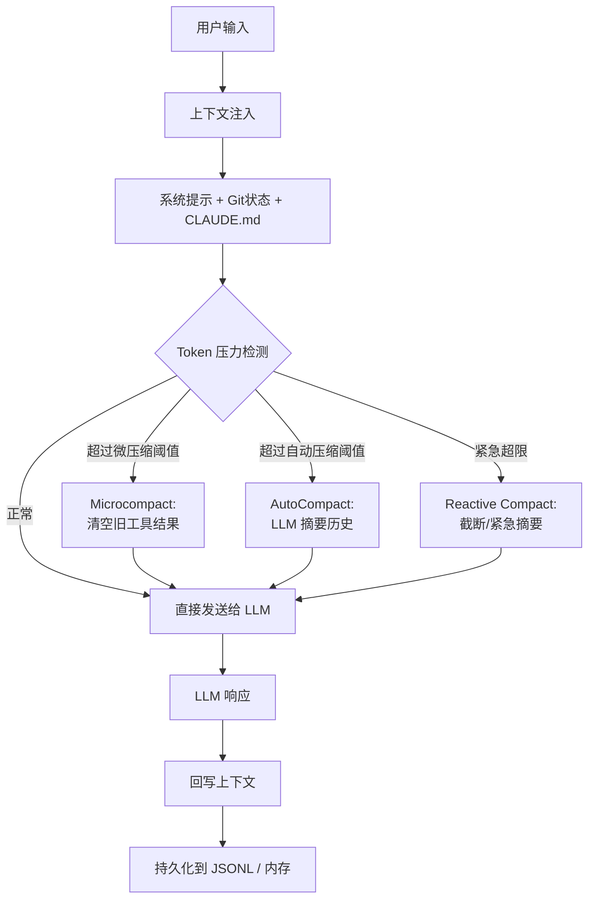

> [← 返回 Agent 索引]([[Notes/Agent/索引|Agent 索引]])

# Context Management 架构解析：记忆与压缩

## Why：为什么要理解 Context Management？

### 问题背景

**LLM 没有原生记忆**。你和朋友聊天，他记得你们昨天聊了什么，因为人类大脑有海马体。但 LLM 每次被调用时，本质上都是"第一次见你"——它之所以看起来记得之前的话，是因为**你把之前的对话记录原封不动地复制粘贴进了新请求**。

这个"复制粘贴"的行为有一个致命限制：**上下文窗口（Context Window）是有限的，而且非常昂贵**。

- Claude 的上下文窗口可能是 20 万 token，一长串对话很容易触及上限
- 每次请求都要把整段历史发给模型，token 费用按长度线性增长
- 如果历史里塞满了过时的工具结果（比如 20 轮前读的一个文件），AI 会被噪音淹没，反而抓不住重点

在游戏引擎里，这个问题会以更危险的形式出现：
- AI 每次调参都要 dump 整个世界的状态，10 万个实体的位置、速度、组件值全部塞进上下文
- 多轮调试后，上下文里混杂着 50 帧前的旧状态和 3 帧前的新状态，AI 开始"幻觉"某个参数的效果
- 没有压缩机制意味着 AI 很快"失忆"，忘了你最初让它优化的是什么目标

### 不用它的后果

如果没有上下文管理机制，Agent 会在长对话中不可避免地走向三种结局：
1. **烧钱**：上下文越来越长，每轮 API 费用翻倍
2. **失忆**：触及窗口上限后，最早的关键指令被截断丢失
3. **幻觉**：旧工具结果和新状态混在一起，AI 做出基于错误信息的决策

### 应用场景

1. **长代码重构**：AI 连续修改了 30 个文件，需要记住最初的架构约束和用户的特殊要求
2. **引擎长时间调参**：AI 花了 50 轮调整物理参数，需要保留"优化目标"但清空中间失败的尝试细节
3. **多 Agent 协作**：一个子 Agent 返回了 2 万 token 的研究报告，主 Agent 只需要摘要而不是全文

> [!tip] 从对话框出发
> 在引入 Context Management 之前，AI 的"记忆"就是不断增长的消息列表。引入之后，系统开始**主动决定什么该记住、什么该遗忘、什么该压缩成摘要**。这个质变让 Agent 从"短期对话工具"变成了能处理数小时连续任务的"长时程工作者"。

## What：Context Management 的本质是什么？

**核心定义**：Context Management 是一套**在有限且昂贵的上下文窗口内，动态选择、压缩、注入和遗忘信息**的控制系统。它的目标不是保存所有历史，而是**确保在任何时候，AI 看到的上下文都是对当前任务最有价值的信息集合**。

### 核心概念速查

| 概念 | 作用 | 在 Agent 中的体现 |
|-----|------|-----------------|
| **Context Window** | LLM 单次请求能处理的最大 token 数 | Claude 200K / Kimi 200K |
| **System Prompt** | 每轮都前置的静态指令，定义 AI 的行为模式 | `prompts.ts` 中的 Section 化系统提示 |
| **Microcompact** | 在消息层级删除或清空旧的工具结果，不做 LLM 摘要 | Claude 的 `microCompactMessages()` |
| **AutoCompact** | 当 token 超过阈值时，调用 LLM 把历史对话摘要成一条消息 | Claude 的 `autoCompactIfNeeded()` / Kimi 的 `compact_context()` |
| **Prompt Caching** | 重复的前缀内容只付 10% 费用 | `SYSTEM_PROMPT_DYNAMIC_BOUNDARY` 的分界线设计 |
| **Checkpoint** | 在关键节点保存上下文状态，支持回滚 | Kimi 的 `context.checkpoint()` / `revert_to()` |
| **Token Budget** | 为系统提示、工具定义、用户消息分配不同的 token 配额 | Claude 的 `analyzeContext.ts` 可视化分析 |

### 架构图解



---

前面我们搞懂了 **Context Management 的本质是在有限且昂贵的上下文窗口内，动态选择、压缩、注入和遗忘信息**。现在我们要回答的问题是：**Claude Code 和 Kimi CLI 具体是怎么管理 AI 记忆的？** Claude 像一位精打细算的管家，准备了三层"垃圾处理站"；Kimi 则像一位简洁明了的图书管理员，按规则定期整理书架。接下来我们把源码翻译成日常语言，一层层拆开看。

---

## How：不同 Agent 工具是如何实现的？

### 1. 宏观对比：Claude Code vs Kimi CLI

**先给一个总体的直觉比喻**：

> 想象你的办公桌（上下文窗口）只有 2 米长，但每天堆积的文件（对话历史）越来越多。Claude Code 像一位极度强迫症的高管，桌上摆着三层文件柜：第一层专门丢过期便利贴（microcompact），第二层请秘书把旧报告摘要成一句话（autocompact），第三层是应急碎纸机（reactive compact）。Kimi CLI 则像一位简洁的图书管理员，定期把旧书打包进仓库，只保留最近两本在桌上。

接下来再展开细节对比：

| 维度 | Claude Code | Kimi CLI | 差异原因分析 |
|------|-------------|----------|-------------|
| **压缩策略** | 三层渐进式清理：先快速丢垃圾（microcompact），再请 LLM 做摘要（autocompact），最后紧急碎纸（reactive compact） | 单层策略：当上下文占用超过一定比例时，触发一次 LLM 摘要，然后清空重来 | Claude 面向超大代码库和数小时长对话，必须准备更多"急救包"；Kimi 更简洁，适合快速任务 |
| **触发时机** | 固定阈值触发（有效窗口 - 13000 token），还会根据时间触发（用户离开 5 分钟就清理旧结果） | 比例触发（比如达到 80% 就压缩）或预留空间触发（剩余空间不够了） | Claude 基于固定阈值 + 时间策略，更像"定时闹钟"；Kimi 基于比例，更像"水满则溢" |
| **系统提示管理** | 把系统提示拆成多个 Section（段落），只有真正变化的部分才重新计算，稳定部分享受缓存折扣 | 直接把系统提示写入 `context.jsonl` 文件的第一行，直观但不做缓存优化 | Claude 像把办公桌分成"固定家具区"和"临时文件区"，只打扫临时区；Kimi 每次重新摆整张桌子 |
| **持久化方式** | 主要保存在内存中，UI 层负责持久化 | 用 `context.jsonl` + `wire.jsonl` 双文件记录，像写日记一样逐行追加 | Kimi 的 JSONL 格式方便进程崩溃后恢复，像写日志；Claude 追求内存访问的低延迟 |
| **回滚机制** | 不保存"存档点"，而是通过构造新的 `State` 对象实现逻辑回滚 | 显式拍快照（`checkpoint`）和读档（`revert_to`），像游戏存档 | Kimi 的回滚更直观，像人类的 Undo；Claude 的回滚更函数式，像拍照覆盖 |
| **对引擎的启示** | 如果你需要**处理超长 AI 工作流**（如 AI 连续调参 50 轮），学 Claude 的三层压缩 | 如果你需要**简洁可恢复的系统**，学 Kimi 的显式 checkpoint 和 JSONL 日志 | 引擎可以融合两者：Claude 的分层压缩 + Kimi 的显式回滚 |

> **用人话讲**：Claude Code 之所以搞三层压缩，是因为它在真实世界里服务的是"鲸鱼级"用户——一次对话能读几百个文件、聊好几个小时。如果只用一层压缩，要么太早摘要（丢失细节），要么太晚摘要（费用爆炸）。而 Kimi CLI 更偏向"够用就好"，一层比例触发简单直接，也更容易理解和维护。

> [!info] 概念插播：Prompt Caching
> 
> **直觉版**：就像你点外卖，如果地址和昨天一样，平台可能会给你打折，因为它不需要重新录入地址。
> 
> **定义版**：Anthropic API 提供的一种计费优化。如果请求的前缀内容与上一回合完全相同，这部分 token 只需支付 10% 的费用。
> 
> **为什么 Claude Code  obsession 于它**：因为系统提示通常很长（几千到上万 token），如果每轮都全额付费，长对话成本会爆炸。Claude Code 用 `SYSTEM_PROMPT_DYNAMIC_BOUNDARY` 把"稳定前缀"和"动态后缀"分开，确保只有动态部分触发全额计费。
>
> **引擎审视**：`Notes/SelfGameEngine/从零开始的引擎骨架` 中 **快照（Snapshot）** 和 **上下文注入** 的设计可以借鉴 Prompt Caching 的思想：把"引擎架构说明、组件约定、常用模式"作为**静态前缀**预加载给 AI，把"当前世界状态、ChangeLog"作为**动态后缀**每轮更新。这样可以减少 AI 反复学习引擎规则的成本。

> [!warning] 如果不这么做会怎样？
> 如果 Claude Code 不用三层压缩，只用一层"等满了再摘要"，会出现两个极端：要么摘要太早，把刚刚读过的文件内容也压缩掉，导致 AI 下一轮还得重新读；要么摘要太晚，API 账单已经爆了。三层压缩就像漏斗——大石头先拦下，中等石头再过滤，最后细沙用筛子。

> [!warning] 如果 Kimi CLI 不用 JSONL 会怎样？
> 如果 Kimi CLI 也把上下文全放内存里，一旦进程崩溃（比如用户按了 Ctrl+C），整个对话历史就消失了。而 JSONL 的逐行追加特性保证了：即使写到一半断电，已经写进去的行不会丢失，重启后可以从断点恢复。

### 2. 核心机制伪代码

#### 方案 A：Claude Code 模式（三段式垃圾处理站）

这段伪代码模拟了 Claude Code 在每次发请求前的"三段式清理"。

```typescript
async function buildRequest(messages, tools, model) {
  // 第一层：Microcompact —— 快速清理旧工具结果
  // 相当于把"已经修改过的文件的旧读取记录"直接丢进垃圾桶
  const microcompactResult = await microcompactMessages(messages)
  messages = microcompactResult.messages

  // 第二层：AutoCompact —— 如果还超阈值，调用 LLM 做摘要
  // 相当于请秘书把 50 页旧报告浓缩成 1 页 Executive Summary
  const tokenCount = estimateTokens(messages)
  const threshold = getEffectiveContextWindowSize(model) - 13000
  
  if (tokenCount > threshold) {
    const compactResult = await compactConversation(messages)
    messages = compactResult.messages
    // 插入 compact_boundary 标记，像书签一样标记"从这里开始是摘要"
  }

  // 第三层：Reactive Compact —— 如果 API 返回 prompt_too_long
  // 相当于垃圾桶突然爆了，紧急把最不重要的东西丢出去
  // 在 API 错误处理路径中紧急压缩

  return {
    messages: normalizeMessagesForAPI(messages),
    tools,
    systemPrompt: buildSystemPromptWithCacheBoundary(tools),
  }
}
```

**这段代码在做什么**：就像你家有三道垃圾处理工序。第一道是"快速分拣"——把明显过期的报纸（旧工具结果）直接扔掉；第二道是"压缩打包"——如果垃圾还太多，请一个人把旧报纸摘要成一句话；第三道是"应急倾倒"——如果垃圾桶突然满了装不下，紧急把最不重要的一袋垃圾先丢出去。

**核心设计思想**：
- **Microcompact 是廉价的**：不需要额外 LLM 调用，直接清空或 cache-edit 旧工具结果，像扔垃圾
- **AutoCompact 是昂贵的**：需要一次专门的 LLM 调用来生成摘要，但能大幅压缩历史，像请秘书写总结
- **Reactive Compact 是保险**：当意外超限时做最后的兜底，像消防栓

#### 方案 B：Kimi CLI 模式（比例触发 + 全量重置）

这段伪代码模拟了 Kimi CLI 的 `_agent_loop` 中如何检测上下文压力并触发压缩。

```python
class KimiSoul:
    async def _agent_loop(self):
        step_no = 0
        while True:
            step_no += 1
            
            # 检查是否需要自动压缩
            # 像是水缸里的水：超过 80% 就放水，或者预留空间不够了也放水
            if should_auto_compact(
                self._context.token_count_with_pending,
                self._runtime.llm.max_context_size,
                trigger_ratio=self._loop_control.compaction_trigger_ratio,
                reserved_context_size=self._loop_control.reserved_context_size,
            ):
                await self.compact_context()
            
            step_outcome = await self._step()
            # ...

    async def compact_context(self, custom_instruction: str = ""):
        # 通知 UI：我开始整理书架了
        wire_send(CompactionBegin())
        
        # 调用 SimpleCompaction：保留最近 N 条消息，摘要之前的历史
        result = await self._compaction.compact(
            self._context.history, self._runtime.llm,
            custom_instruction=custom_instruction
        )
        
        # 清空上下文，重新写入 system prompt 和压缩后的消息
        # 相当于把书架上的书全部撤下，只放回最近两本和一本摘要手册
        await self._context.clear()
        await self._context.write_system_prompt(self._agent.system_prompt)
        await self._checkpoint()
        await self._context.append_message(result.messages)
        
        wire_send(CompactionEnd())
```

**这段代码在做什么**：Kimi CLI 的压缩机制像一个"智能水缸"。水缸容量有限，当水位达到 80% 或者底部预留空间不够时，就会自动触发一次"放水"。放水的过程是：保留最近的几条对话（最近两本书），把之前的所有历史摘要成一本小册子，然后把水缸清空，只放回最近的书和这本小册子。

**核心设计思想**：
- **显式事件通知**：压缩开始/结束都通过 `wire_send` 发送事件，UI 可以显示"正在压缩上下文..."
- **全量重置**：压缩后 `context.clear()` 彻底清空，从干净状态重新开始，像重新摆书架
- **保留最近消息**：`SimpleCompaction` 默认保留最近 2 条 user/assistant 消息不被摘要，确保连续性

### 3. 关键源码印证

#### Claude Code：三层压缩阈值与触发逻辑

**这段代码在做什么**：Claude Code 对 token 预算的计算极其精细。它先为"摘要输出"预留 20000 token（相当于秘书写总结至少需要这么多纸），再在剩余的窗口上留出 13000 token 的安全缓冲带。这意味着对于一个 200K 的模型，自动压缩大约在 167K token 时触发。

```typescript
// D:/workspace/claude-code-main/src/services/compact/autoCompact.ts:33-48
export function getEffectiveContextWindowSize(model: string): number {
  const reservedTokensForSummary = Math.min(
    getMaxOutputTokensForModel(model),
    MAX_OUTPUT_TOKENS_FOR_SUMMARY,  // 20,000
  )
  let contextWindow = getContextWindowForModel(model, getSdkBetas())
  // ... env override ...
  return contextWindow - reservedTokensForSummary
}

// D:/workspace/claude-code-main/src/services/compact/autoCompact.ts:72-90
export function getAutoCompactThreshold(model: string): number {
  const effectiveContextWindow = getEffectiveContextWindowSize(model)
  const autocompactThreshold = effectiveContextWindow - AUTOCOMPACT_BUFFER_TOKENS  // 13,000
  // ... env override ...
  return autocompactThreshold
}
```

**为什么这样设计**：如果不给摘要输出预留空间，那么当上下文触顶时，系统可能已经没有足够的 token 让 LLM 写出完整的摘要，导致压缩失败。这就像你请秘书写总结，但只给她一张便利贴，她根本写不下。预留 20K + 13K 的缓冲带，确保了"需要摘要时，一定还有纸可用"。

#### Claude Code：微压缩的 Time-Based 触发

**这段代码在做什么**：这是一段非常工程化的细节。Claude Code 会检测"用户上次收到回复距今多久"。如果超过了 5 分钟，就主动清空旧工具结果。原因是：服务器端的 Prompt Cache 在 5 分钟后已经失效了，保留旧结果既不能省钱也不能提速，不如清空腾地方。

```typescript
// D:/workspace/claude-code-main/src/services/compact/microCompact.ts:422-444
export function evaluateTimeBasedTrigger(
  messages: Message[],
  querySource: QuerySource | undefined,
): { gapMinutes: number; config: TimeBasedMCConfig } | null {
  const config = getTimeBasedMCConfig()
  if (!config.enabled || !querySource || !isMainThreadSource(querySource)) {
    return null
  }
  const lastAssistant = messages.findLast(m => m.type === 'assistant')
  if (!lastAssistant) return null
  const gapMinutes =
    (Date.now() - new Date(lastAssistant.timestamp).getTime()) / 60_000
  if (!Number.isFinite(gapMinutes) || gapMinutes < config.gapThresholdMinutes) {
    return null
  }
  return { gapMinutes, config }
}
```

**为什么这样设计**：很多开发者会犯一个错误：以为"保留越多历史越好"。但实际上，如果 Prompt Cache 已经失效，旧历史不仅没有价值，还会白白占用上下文窗口、增加 API 费用。这段代码体现了一个重要的工程直觉：**缓存失效时，保留旧数据就是沉没成本**。

#### Claude Code：系统提示的 Section 化缓存

**这段代码在做什么**：Claude Code 把长长的系统提示拆成很多个 Section（段落）。每个段落要么被标记为"可缓存"（稳定内容），要么被标记为"不可缓存"（动态内容，如 MCP 连接状态）。这样只有真正变化的部分才会触发全额计费。

```typescript
// D:/workspace/claude-code-main/src/constants/systemPromptSections.ts:20-38
export function systemPromptSection(
  name: string,
  compute: ComputeFn,
): SystemPromptSection {
  return { name, compute, cacheBreak: false }
}

export function DANGEROUS_uncachedSystemPromptSection(
  name: string,
  compute: ComputeFn,
  _reason: string,
): SystemPromptSection {
  return { name, compute, cacheBreak: true }
}
```

**为什么这样设计**：系统提示通常很长（可能几千甚至上万 token），如果每轮都全额付费，长对话的成本会呈线性爆炸。通过把"稳定内容"（如行为准则、工具定义）和"易变内容"（如当前 MCP 服务器状态）分开，Claude Code 让稳定部分享受 90% 的缓存折扣。名字里的 `DANGEROUS_` 前缀也很有意思——开发者用这个名字时，会下意识思考"这个 Section 真的必须每轮重新计算吗？"

#### Kimi CLI：`should_auto_compact` 的触发条件

**这段代码在做什么**：Kimi CLI 的压缩触发条件非常直接。它有两个判断标准：一是"比例触发"（比如上下文占到总容量的 80% 就压缩），二是"预留空间触发"（当前上下文 + 预留空间 >= 总容量就压缩）。满足任一条件就开始压缩。

```python
# D:/workspace/kimi-cli-main/src/kimi_cli/soul/compaction.py:56-72
def should_auto_compact(
    token_count: int,
    max_context_size: int,
    *,
    trigger_ratio: float,
    reserved_context_size: int,
) -> bool:
    """Determine whether auto-compaction should be triggered.

    Returns True when either condition is met (whichever fires first):
    - Ratio-based: token_count >= max_context_size * trigger_ratio
    - Reserved-based: token_count + reserved_context_size >= max_context_size
    """
    return (
        token_count >= max_context_size * trigger_ratio
        or token_count + reserved_context_size >= max_context_size
    )
```

**为什么这样设计**：这种双条件设计比 Claude Code 的固定阈值更灵活。比如当你换到一个上下文只有 32K 的小模型时，80% 比例触发会自动调整到 25.6K，而不需要手动修改阈值。预留空间触发则保证了"无论如何都要为下一轮对话留出呼吸空间"。

#### Kimi CLI：上下文持久化与恢复

**这段代码在做什么**：Kimi CLI 用 JSONL（每行一个 JSON 对象）作为上下文的持久化格式。当需要更新系统提示时，它不会直接修改原文件，而是先写到一个临时文件，再用临时文件替换原文件。这是一种"原子写入"策略，确保即使写入过程中程序崩溃，原文件也不会变成半拉子状态。

```python
# D:/workspace/kimi-cli-main/src/kimi_cli/soul/context.py:91-119
async def write_system_prompt(self, prompt: str) -> None:
    prompt_line = json.dumps({"role": "_system_prompt", "content": prompt}) + "\n"
    def _write_system_prompt_sync() -> None:
        if not self._file_backend.exists() or self._file_backend.stat().st_size == 0:
            self._file_backend.write_text(prompt_line, encoding="utf-8")
            return
        tmp_path = self._file_backend.with_suffix(".tmp")
        with (
            tmp_path.open("w", encoding="utf-8") as tmp_f,
            self._file_backend.open(encoding="utf-8") as src_f,
        ):
            tmp_f.write(prompt_line)
            while True:
                chunk = src_f.read(64 * 1024)
                if not chunk:
                    break
                tmp_f.write(chunk)
        tmp_path.replace(self._file_backend)
    await asyncio.to_thread(_write_system_prompt_sync)
```

**为什么这样设计**：对话历史是 Agent 的"生命线"，一旦损坏就无法恢复。原子写入（先写临时文件再替换）是数据库和日志系统的经典做法，确保"要么完全成功，要么完全失败"，不会出现中间状态。`_system_prompt` 作为特殊 `role` 记录在第一行，也保证了恢复时系统提示始终可读。

## 引擎映射：这个设计对我的游戏引擎有什么启发？

### 1. 对应系统

Context Management 最像引擎里的 **Save/Load 系统 + 回放系统（Replay）+ 编辑器 Undo 历史** 的混合体。

- **Claude Code 的 Microcompact** 对应引擎的 **增量日志截断**：只保留最近 N 帧的详细输入记录，旧记录只保留哈希或摘要
- **AutoCompact** 对应 **关键帧压缩（Key-frame Compression）**：每隔一段时间保存一个完整世界快照，中间帧只保存 diff
- **Kimi CLI 的 checkpoint/revert** 对应 **快速存档（Quick Save）+ 读档**：AI 可以在"尝试改动前"快速存档，不满意就一键回滚

### 2. 可借鉴点

**借鉴 1：三层压缩思维（Claude Code）**

引擎给 AI 注入世界状态时，不应该每次都 dump 完整世界。可以借鉴 Claude 的分层压缩：

| 层级 | 引擎对应操作 | 成本 |
|------|-------------|------|
| **Microcompact** | 只保留最近 10 帧的 `ChangeLog`，旧记录清空为 `[Old changes cleared]` | 极低（本地操作） |
| **AutoCompact** | 当 ChangeLog 超过阈值时，用一个小模型把 N 帧前的历史摘要成一句话 | 中等（一次本地 LLM 调用） |
| **Reactive Compact** | 当上下文紧急超限时，只保留核心实体状态，截断次要系统 | 应急兜底 |

**借鉴 2：静态上下文预加载（Prompt Caching 思想）**

引擎应该有一份类似 `CLAUDE.md` 的 `ENGINE_AI.md`，把以下内容作为"静态前缀"预加载给 AI：
- 引擎的 ECS 架构说明
- 各组件的语义和约束
- 常用的调参模式（如"物理调参一般从 gravity 和 friction 开始"）
- 错误排查的决策树

这样 AI 不需要在每一轮对话中重新学习引擎规则，只需关注动态变化的"当前状态"。

**借鉴 3：显式 Checkpoint 与回滚（Kimi CLI）**

在引擎的 `AgentBridge` 中引入 `checkpoint()` 和 `revert_to()`：

```cpp
class AgentBridge {
public:
    void checkpoint(const std::string& name);  // 快照当前世界
    void revert_to(const std::string& name);   // 回滚到快照
    
    // AI 工作流：
    // 1. checkpoint("before_tuning")
    // 2. 调参 + 运行 30 帧
    // 3. 结果不好？revert_to("before_tuning")
};
```

这比单纯依赖 `Undo` 更强大，因为它允许 AI 在回滚后**基于失败经验再次尝试**。

**借鉴 4：Token 可观测性（Claude Code 的 analyzeContext）**

引擎应该能告诉 AI（和开发者）"当前上下文的 token 都花在哪了"：

```cpp
struct ContextBreakdown {
    int engine_ai_md_tokens;      // 静态规则
    int tool_registry_tokens;     // 可用工具列表
    int world_state_tokens;       // 当前世界状态
    int changelog_tokens;         // 变更历史
    int total_tokens;
    int max_tokens;
};
```

这有助于调试"为什么 AI 突然开始失忆"——可能是因为某个工具的描述太长了。

### 3. 审视与修正行动项

> 以下修改已直接应用到 `Notes/SelfGameEngine/从零开始的引擎骨架.md`：

**发现 1：快照（Snapshot）设计过于理想化——只提到"全量状态拷贝"**

原笔记中 `WorldSnapshot` 的描述是 `rawData` 的完整 dump。但在 Claude Code 源码中，压缩不是"要么全要要么全不要"，而是**分层渐进**的：先清空旧工具结果（微压缩），再摘要历史（自动压缩），最后才考虑截断。

**修正**：在 `阶段 2：好用` 的 `WorldSnapshot` 部分补充三层压缩设计：
- **Level 1（帧内截断）**：`ChangeLog` 只保留最近 N 帧，旧帧自动清空
- **Level 2（局部摘要）**：当 `ChangeLog` 超过阈值时，用轻量规则引擎（或本地小模型）把历史摘要成自然语言描述（如"过去 20 帧主要调整了 gravity.y"）
- **Level 3（全量快照+回滚）**：只有在 AI 显式调用 `checkpoint()` 时才保存完整世界状态

**发现 2：没有体现"静态上下文预加载"的设计**

原笔记假设 AI 每次都能通过 `get_component` 等工具逐步了解引擎。但这非常低效——就像每次打开 Claude Code 都要重新阅读项目 README 一样。

**修正**：在 `阶段 2：好用` 新增 `ENGINE_AI.md` 设计：
- 引擎启动时自动生成一份 `ENGINE_AI.md`，包含 `TypeRegistry` 中所有组件的说明、常用工具的示例调用、以及项目特定的约定
- `AgentBridge` 在每轮对话开始时，把 `ENGINE_AI.md` 作为 system prompt 的一部分注入
- 这份文档是"静态前缀"，只有在 ECS 架构发生重大变化时才更新，可以复用 Prompt Caching 的收益

**发现 3：ChangeLog 缺少"过期清理"机制**

原笔记的 `ChangeLog` 会无限增长。虽然它在阶段 2 被引入，但没有说明当历史过长时如何处理。

**修正**：在 `ChangeLog` 部分补充"滚动窗口"设计：
- `ChangeLog` 默认只保留最近 16 帧（约 1 秒 @ 60fps）的详细记录
- 超过 16 帧的旧记录自动折叠为每个组件的"累计变更次数"统计
- 如果 AI 需要查询更久远的历史，使用专门的历史查询工具（如 `query_changelog(start_frame, end_frame)`），而不是把所有历史都塞进 LLM 上下文

## 从源码到直觉：一句话总结

> 读了这些源码之后，我终于明白为什么 AI 能在长达数小时的对话中不"失忆"了——因为 **Context Management 在 LLM 外部构建了一套主动的记忆控制系统**：它决定什么该保留、什么该压缩、什么该遗忘。**上下文窗口不是仓库，而是舞台——只有最有价值的演员才能留在上面。**

## 延伸阅读与待办

- [ ] [[Multi-Agent-架构解析：并行与协作]]
- [ ] [[Permission-Model-架构解析：边界与信任]]
- [ ] [[从零开始的引擎骨架]]（已根据本篇洞察修正）
- [ ] 设计一份 `ENGINE_AI.md` 模板，包含 ECS 架构说明、组件语义、常用调参模式
