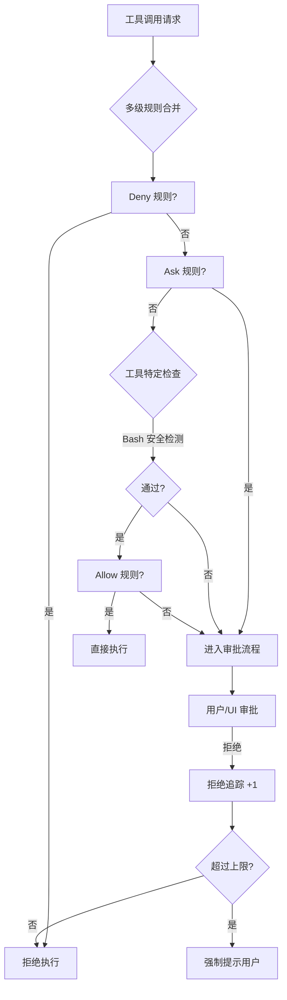

> [← 返回 Agent 索引]([[Agent/索引|Agent 索引]])

# Permission-System-架构解析：权限与安全边界

## Why：为什么要理解权限模型？

- **问题背景**：AI Agent 能自动执行 Shell 命令、修改文件、访问网络。如果没有边界，它就是一枚“有脑子的核弹”——可能误删项目、泄露密钥、执行不可回滚的破坏。在游戏引擎中，当 AI 被授予修改场景、调整物理参数、触发构建流水线的能力时，同样的问题会以更隐蔽的方式出现。
- **不用它的后果**：去掉权限控制，Agent 会在用户不知情时执行高危操作。一旦出错，损失不仅是几个文件，可能是整个关卡的破坏、发布包的错误配置，甚至源代码泄露。
- **应用场景**：
  1. **自动修复代码**：Agent 调用 Bash 执行测试和补丁——需要拦截 `rm -rf /` 级别的命令。
  2. **多 Agent 并行编辑**：Coordinator 派出的 Worker 同时修改不同文件——需要按文件集串行化写入权限。
  3. **引擎 AI 调参**：Gameplay Agent 试图修改玩家血量上限——需要组件级别的写权限白名单。

> [!tip] 从对话框出发
> 在引入权限模型之前，AI 只能“建议”你做什么。引入之后，它突然能“替你动手”了。这个质变的核心不是模型变安全了，而是**外部套了一层决策树**——在每一只手伸出去之前，先问规则允不允许。

---

## What：权限模型的本质是什么？

- **核心定义**：权限模型是在 LLM 的“意图”与真实世界的“动作”之间插入的一道可配置的闸门。它把“AI 想做什么”转换成“系统允许做什么”，并在不确定时回退到人类审批。
- **关键概念表**：

| 概念 | 作用 | 在 Agent 中的体现 |
|-----|------|-----------------|
| **多级规则来源** | 从持久配置到临时会话，共 8 个层级逐层覆盖权限设定 | `userSettings` → `projectSettings` → `localSettings` → `flagSettings` → `policySettings` → `cliArg` → `command` → `session` |
| **三级决策树** | 任何工具调用都必须经过 Deny → Ask → Allow 的严格顺序判断 | `hasPermissionsToUseToolInner` 中的层级判断 |
| **拒绝追踪 (Denial Tracking)** | 防止自动审批模式陷入无限拒绝循环 | 连续拒绝 3 次或累计 20 次后强制回退到人工提示 |
| **Bash 安全检查** | 在规则匹配之前，先对 Shell 命令做语法级危险检测 | `bashSecurity.ts` 中的 25 项检查清单 |
| **迭代固定点算法** | 逐层剥开 `env FOO=bar sudo bash -c` 等嵌套包装，防止绕过 | `bashPermissions.ts` 中的 `stripSafeWrappers` |
| **Sandbox 适配器** | 把高层权限规则翻译成底层运行时隔离配置 | `sandbox-adapter.ts` 构建 allowWrite/denyWrite 列表 |

### 架构图解



---

---

前面我们搞懂了 **权限模型是在 LLM 的"意图"与真实世界的"动作"之间插入的一道可配置闸门**。现在我们要回答的问题是：**Claude Code 和 Kimi CLI 分别是怎样实现这道闸门的？** Claude 像一座多层安检大楼，从门口到电梯有四层关卡、三层决策树；Kimi 像一个统一的前台接待处，所有访客（工具调用）都要在这里登记、等待批准。接下来我们把源码拆开，一层层看。

---

## How：不同 Agent 工具是如何实现的？

### 1. 宏观对比：Claude Code vs Kimi CLI

**先给一个总体的直觉比喻**：

> 想象一家银行。Claude Code 的做法是在大楼里设置四层身份核查（门禁卡、楼层权限、柜台验证、单笔限额）和三层决策树（黑名单直接拒 → 黄名单问经理 → 白名单直接过）。Kimi CLI 的做法是在大门口设一个统一的前台（ApprovalRuntime），所有访客都在这里登记，前台一个电话打给经理（UI），经理说"进"才能进。

接下来再展开细节对比：

| 维度 | Claude Code | Kimi CLI | 差异原因分析 |
|------|-------------|----------|-------------|
| **核心抽象** | 分布式规则引擎 + Hook：权限检查分散在工具定义和各个安全模块中 | 集中式审批运行时（ApprovalRuntime）：所有审批请求统一排队、统一调度 | Claude 强调"规则先行"，像一座多层安检大楼；Kimi 强调"运行时统一调度"，像一个大前台 |
| **数据流** | 工具调用前 → 合并多级规则 → 跑三级决策树 → 可能进入 React UI 审批队列 | 工具调用前 → `Approval.request()` → `runtime.create_request()` → Wire Hub 广播 → UI JSON-RPC | Claude 的决策在本地快速完成；Kimi 的决策通过 Wire 协议与 UI 解耦，像前台打电话 |
| **错误恢复** | 拒绝追踪（Denial Tracking）：连续被拒绝 3 次后自动回退到人工提示 | 按审批源（ApprovalSource）批量取消 + 300 秒超时 | Claude 防止 Agent 陷入"反复尝试 → 反复被拒"的死循环；Kimi 防止审批请求变成"僵尸请求" |
| **Bash 安全** | 25 项语法级检查 + 迭代固定点解包，像 X 光机逐层扫描行李 | 由 ApprovalRuntime 统一审批，危险命令拦截可能通过 `PreToolUse` Hook 实现；源码中没有独立的 25 项清单 | Claude 作为通用代码工具把 Bash 安全内嵌在工具层做深度防御；Kimi 作为多客户端架构更依赖统一的审批 gate，但不代表它不做危险命令拦截——只是拦截逻辑可能下沉到 Hook 或运行时层 |
| **对引擎的启示** | 需要"规则引擎 + 语法检查"双层防御 | 需要"统一审批运行时 + 事件广播"机制 | 引擎应融合两者：本地规则树做快速过滤，统一运行时做 UI 审批和取消 |

> **用人话讲**：Claude Code 的权限模型像一座戒备森严的大楼——从进门到动手，要经过多层检查，规则来自不同的管理部门（`userSettings` → `projectSettings` → `localSettings` → `flagSettings` → `policySettings` → `cliArg` → `command` → `session`）。Kimi CLI 则像只有一个大前台的写字楼——不管你是谁、想干什么，都得在前台登记，前台统一打电话给老板（用户/UI）请示。

> [!warning] 如果 Claude Code 不做 25 项 Bash 检查会怎样？
> 用户可能会写 `env FOO=bar sudo bash -c "rm -rf /"`，如果系统只检查最外层字符串，就会漏掉真正的危险命令。25 项检查就像机场的 X 光机 + 金属探测门 + 人工搜身，虽然繁琐，但能有效拦截伪装过的危险品。

> [!warning] 如果 Kimi CLI 不做 ApprovalSource 隔离会怎样？
> 父 Agent 和子 Agent 的审批请求会混在一起。想象一下：你允许父 Agent 读文件，但子 Agent 突然发起了一个删除操作——如果没有独立的审批源，你就无法区分"这是谁发起的"，也就无法一键撤销某个子 Agent 的所有 pending 请求。

### 2. 核心机制伪代码

#### Claude Code 的权限决策树

这段伪代码模拟了 Claude Code 的"三级决策树"：先查黑名单（Deny），再查黄名单（Ask），最后查白名单（Allow）。

```typescript
function resolvePermission(tool, input, context):
    // 1. 多级规则合并
    // 像把四张不同部门的告示贴合成一张总清单
    rules = mergePermissionSources(settings, cliArgs, command, session)
    
    // 2. 三级决策树
    if hasDenyRule(rules, tool):           return DENY
    if hasAskRule(rules, tool):            return ASK
    
    // 3. 工具特定安全检查（以 Bash 为例）
    if tool === BashTool:
        safety = runBashSecurityChecks(input)
        if safety === ASK:                 return ASK
        if safety === DENY:                return DENY
    
    // 4. 模式与规则允许
    if bypassPermissions:                  return ALLOW
    if hasAllowRule(rules, tool):          return ALLOW
    
    // 5. 默认回退
    return ASK
```

**这段代码在做什么**：这就像你进入一座大楼时的安检流程。第一步，保安把四张不同部门的告示贴合成一张总清单；第二步，先查黑名单（"此人禁止入内"）→ 再查黄名单（"此人需经理确认"）；第三步，如果你带的是行李箱（Bash 命令），还要过 X 光机；第四步，只有持 VIP 卡（Allow Rule）的人才能直接进；第五步，如果以上都不符合，默认"问经理"。

**核心设计思想**：
- **Deny 必须排在第一位**：安全铁律——"默认拒绝不如显式拒绝可靠"
- **工具特定检查在规则之后**：先过滤"谁不能用"，再检查"具体输入是否安全"
- **默认回退到 Ask**：不确定时永远问用户，宁可烦人也不要闯祸

#### Kimi CLI 的审批运行时

这段伪代码模拟了 Kimi CLI 的统一前台——ApprovalRuntime。

```python
class ApprovalRuntime:
    def request(self, action, description):
        // 如果是 yolo 模式（自动驾驶），直接放行
        if yolo_mode:                       return ALLOW
        // 如果这个动作已经在自动批准列表里，直接放行
        if action in auto_approve:          return ALLOW
        
        // 生成一个唯一的请求 ID
        req_id = uuid()
        // 获取当前是谁在发起这个请求（父 Agent 还是子 Agent）
        source = get_current_approval_source()
        self.create_request(req_id, source)
        
        // 广播到 Wire Hub，不阻塞 UI
        self.root_wire_hub.publish_nowait(req_id)
        
        // 阻塞工具执行，等待用户响应（300 秒超时）
        response, feedback = await wait_for_response(req_id, timeout=300)
        
        if response == "approve":           return ALLOW
        if response == "approve_for_session":
            auto_approve.add(action)
            return ALLOW
        if response == "reject":            return DENY
```

**这段代码在做什么**：Kimi CLI 的 ApprovalRuntime 就像一个银行大堂的前台。每个工具调用请求都要来前台登记（`create_request`），前台会给一个号码牌（`req_id`），然后通过广播（`Wire Hub`）通知经理（UI）。经理说"可以"（approve）、"以后这类都可以"（approve_for_session）或"不行"（reject）。如果经理 5 分钟没回应，前台就默认超时拒绝。

**核心设计思想**：
- **统一入口**：所有审批请求都走同一个运行时，便于监控和审计
- **不阻塞 UI 广播**：通过 `publish_nowait` 异步转发，让同一个请求可以在多个客户端同时显示
- **按源批量管理**：通过 `ApprovalSource` 可以一键撤销某个 Agent 的所有 pending 请求

### 3. 关键源码印证

#### 多级规则来源与合并

**这段代码在做什么**：Claude Code 的权限规则来自四个层级，就像一个公司的规章制度：最顶层是托管策略（比如企业的安全部门），中间是 CLI 参数和当前命令参数，最底层是用户自己的配置文件。数组的顺序就是冲突时的仲裁顺序——越靠前的优先级越高。

```typescript
// D:/workspace/claude-code-main/src/utils/settings/constants.ts:7-22
export const SETTING_SOURCES = [
  'userSettings',      // 全局用户配置
  'projectSettings',   // 项目级共享配置
  'localSettings',     // 本地 gitignored 配置
  'flagSettings',      // --settings 命令行标志
  'policySettings',    // 托管策略（如企业 settings.json 或远程 API）
] as const

// D:/workspace/claude-code-main/src/utils/permissions/permissions.ts:109-114
const PERMISSION_RULE_SOURCES = [
  ...SETTING_SOURCES,
  'cliArg',
  'command',
  'session',
] as const satisfies readonly PermissionRuleSource[]
```

**为什么这样设计**：`PERMISSION_RULE_SOURCES` 数组的顺序代表**从低优先级到高优先级**的覆盖链。越靠后的来源越能覆盖前面的来源：
1. `userSettings` / `projectSettings` / `localSettings`：持久化在磁盘上的个人/项目配置
2. `flagSettings` / `policySettings`：命令行注入的和企业托管的策略
3. `cliArg` / `command`：当前启动命令带的参数
4. `session`：会话期间的临时状态（最高优先级）

这意味着：**当前会话里你手动改的一条规则，可以覆盖企业策略；而企业策略又可以覆盖你本地的 `.claude.json`。** 如果不按这个顺序合并，一个误配置的本地设置就可能覆盖企业安全策略，或者会话期间的临时调整无法生效，造成权限漏洞。

#### 三级决策树核心

**这段代码在做什么**：这是 Claude Code 权限判断的"心脏"。任何工具调用都必须经过五步判断：先查 Deny 规则 → 再查 Ask 规则 → 再看是否 bypass → 再查 Allow 规则 → 最后默认 Ask。

```typescript
// D:/workspace/claude-code-main/src/utils/permissions/permissions.ts (~1170-1310)
// STEP 1a: Always Deny
const denyRule = getDenyRuleForTool(appState.toolPermissionContext, tool)
if (denyRule) {
  return { behavior: 'deny', ... }
}

// STEP 1b: Always Ask
const askRule = getAskRuleForTool(appState.toolPermissionContext, tool)
if (askRule) {
  return { behavior: 'ask', ... }
}

// STEP 2a: bypassPermissions → Allow
if (shouldBypassPermissions) {
  return { behavior: 'allow', ... }
}

// STEP 2b: Entire tool allowed
const alwaysAllowedRule = toolAlwaysAllowedRule(...)
if (alwaysAllowedRule) {
  return { behavior: 'allow', ... }
}

// STEP 3: fallback → Ask
return { behavior: 'ask', ... }
```

**为什么这样设计**：安全设计的铁律是"默认拒绝不如显式拒绝可靠"。如果 Allow 先匹配，一个误配置的 allow 规则就会覆盖 deny 规则，造成漏洞。把 Deny 放在第一位，确保了"黑名单永远优先于白名单"。最后的 `fallback → Ask` 也体现了一个原则：**不确定时，永远选择最安全的路径**。

#### 拒绝追踪与策略回退

**这段代码在做什么**：在自动审批模式下，如果分类器（Classifier）连续误判，Agent 可能陷入"尝试 → 被拒绝 → 再尝试 → 再被拒绝"的死循环。Claude Code 用 `DENIAL_LIMITS` 来检测这种死循环：连续拒绝 3 次或累计拒绝 20 次后，强制从自动模式回退到人工提示。

```typescript
// D:/workspace/claude-code-main/src/utils/permissions/denialTracking.ts (~12-44)
export const DENIAL_LIMITS = {
  maxConsecutive: 3,
  maxTotal: 20,
} as const

export function shouldFallbackToPrompting(state: DenialTrackingState): boolean {
  return (
    state.consecutiveDenials >= DENIAL_LIMITS.maxConsecutive ||
    state.totalDenials >= DENIAL_LIMITS.maxTotal
  )
}
```

**为什么这样设计**：3 次连续拒绝是一个经验阈值，足够容忍正常的误报，又能及时刹车。如果没有这个机制，Agent 可能在一个死胡同里反复撞墙，既浪费 token 又让用户感到烦躁。这就像汽车的安全气囊——平时不用，但一旦检测到剧烈碰撞就必须立刻弹出。

#### Bash 命令的迭代固定点解包

**这段代码在做什么**：用户可能会写 `env FOO=bar sudo bash -c "rm -rf /"`。如果只剥一层包装，`sudo bash -c` 还在，规则匹配会失败。这段代码用一个固定点循环，不断剥掉环境变量前缀（`env FOO=bar`）和安全包装器（`sudo bash -c`），直到没有新的字符串产生为止。

```typescript
// D:/workspace/claude-code-main/src/tools/BashTool/bashPermissions.ts (~826-852)
const seen = new Set(commandsToTry)
let startIdx = 0

while (startIdx < commandsToTry.length) {
    const endIdx = commandsToTry.length
    for (let i = startIdx; i < endIdx; i++) {
        const cmd = commandsToTry[i]
        const envStripped = stripAllLeadingEnvVars(cmd)
        if (!seen.has(envStripped)) {
            commandsToTry.push(envStripped)
            seen.add(envStripped)
        }
        const wrapperStripped = stripSafeWrappers(cmd)
        if (!seen.has(wrapperStripped)) {
            commandsToTry.push(wrapperStripped)
            seen.add(wrapperStripped)
        }
    }
    startIdx = endIdx
}
```

**为什么这样设计**：黑客最常用的绕过手段就是"包装"——把危险命令藏在安全命令里面。固定点算法确保所有嵌套包装都被彻底展开，直到露出最核心的命令字符串。这就像是安检时的"逐层开箱"——不管危险品包了多少层泡沫纸，最终都要露出真面目。

#### Kimi CLI 的审批运行时与 Wire Hub 解耦

**这段代码在做什么**：这是 Kimi CLI 的审批运行时核心。当一个工具调用需要审批时，它不会直接阻塞 UI 服务器，而是先创建一个请求记录，然后通过 `RootWireHub` 异步广播。工具执行线程阻塞在 `wait_for_response()` 上，而 UI 服务器可以独立地响应用户操作。

```python
# D:/workspace/kimi-cli-main/src/kimi_cli/approval_runtime/runtime.py (~60-83)
def create_request(...):
    request = ApprovalRequestRecord(...)
    self._requests[request.id] = request
    self._publish_event(ApprovalRuntimeEvent(kind="request_created", request=request))
    self._publish_wire_request(request)   # -> RootWireHub.publish_nowait
    return request
```

```python
# D:/workspace/kimi-cli-main/src/kimi_cli/wire/server.py (~1004-1012)
async def _request_approval(self, request: ApprovalRequest) -> None:
    msg_id = request.id
    self._pending_requests[msg_id] = request
    await self._send_msg(JSONRPCRequestMessage(id=msg_id, params=request))
    # Do NOT await request.wait() here.
```

**为什么这样设计**：这种"请求创建"与"响应等待"的分离，让同一个审批请求可以同时在 Web UI、桌面客户端、甚至多个观察者处显示，而不阻塞 Agent Loop。想象一下：如果 UI 服务器直接在 `_request_approval` 里等待用户点击"批准"，那么当用户手机没电、转而用电脑操作时，审批请求就会被卡在手机上。`publish_nowait` 确保了"多设备无缝切换"。

## 引擎映射：这个设计对我的游戏引擎有什么启发？

### 1. 对应系统

我引擎中最接近权限模型的是 `AgentBridge` 中的 `ApprovalRuntime` 与 `allowedComponents` 白名单。它们试图在 AI 与 ECS 世界状态之间建立边界，但目前只实现了**粗粒度拦截**（组件名是否在集合里），缺少**细粒度规则引擎**和**运行时隔离**。

### 2. 可借鉴点

1. **三级决策树前置到 `AgentBridge` 内部**：在 `can_mutate` 之前插入规则引擎，支持“按工具名拒绝 / 按组件名拒绝 / 按输入参数拒绝”三级粒度。
2. **为每个 Agent 绑定独立的 `ApprovalSource`**：借鉴 Kimi CLI 的 `ContextVar` 设计，让 Director 可以一键取消或批准某个 Worker 的所有 pending 操作。

### 3. 审视与修正行动项

> [!warning] 源码洞察 vs 已有设计
> 阅读 Claude Code 和 Kimi CLI 的权限源码后，发现 `Notes/SelfGameEngine/从零开始的引擎骨架` 中的权限设计存在以下理想化或遗漏：

**A. `ApprovalRuntime` 过于简化**
- **现状**：`ApprovalRuntime` 只有 `checkAndRecord`、`cancelBySource` 和 `cancelByAgentId`，没有决策树，没有规则合并，没有拒绝追踪。
- **修正**：需要引入三级决策树（Deny → Ask → Allow）和多级规则来源（`userSettings` → `projectSettings` → `localSettings` → `flagSettings` → `policySettings` → `cliArg` → `command` → `session`）。`checkAndRecord` 应该改名为 `resolvePermission`，返回值从 `bool` 扩展为 `PermissionResult { behavior, reason, rule }`。

**B. 缺少拒绝追踪（Denial Tracking）**
- **现状**：骨架中完全没有提到 AI 连续被拒绝后的回退策略。
- **修正**：增加 `DenialTracker` 结构，记录 `consecutiveDenials` 和 `totalDenials`。当连续 3 次被拒绝时，自动从 Auto 模式回退到 Ask 模式，防止 Agent 在死胡同里反复撞墙。

**C. Bash 安全检查的缺失映射**
- **现状**：骨架中假设 AI 只通过结构化工具操作引擎，没有考虑引擎内嵌的 `ScriptTool` 或 `ConsoleCommand` 可能执行危险脚本。
- **修正**：如果引擎暴露类似 `execute_console_command` 的工具，必须配套一个 `ConsoleSecurity` 模块，做至少以下检查：
  - 拦截文件删除类命令（`rm`, `del`, `format`）
  - 拦截网络外发类命令（`curl`, `wget`, `Invoke-WebRequest`）
  - 拦截环境变量注入（`set FOO=bar && command`）
  - 对嵌套命令做固定点解包（`cmd /c cmd /c rd /s /q`）

**D. Sandbox 只有概念，没有落地规则**
- **现状**：`TransactionalWorld` 提供了事务隔离的设想，但缺少“哪些路径可读、哪些路径可写、哪些网络域可访问”的具体规则。
- **修正**：引入 `SandboxConfig` 结构，明确：
  - `allowWrite`: 当前项目目录、临时目录、版本控制允许编辑的路径
  - `denyWrite`: 引擎配置文件（如 `engine.ini`）、技能目录（`.agents/skills`）、裸 Git 仓库文件
  - `allowRead`: 项目源码、资源目录
  - `network`: 只允许访问内部资源服务器，禁止访问公网

**E. Component Whitelist 太粗**
- **现状**：`allowedComponents` 只按组件名做二元判断。
- **修正**：引入 **Tool-specific checkPermissions**。例如 `set_component` 不仅要看组件是否在白名单，还要检查输入值是否越界（`Health.max > 9999` 时应 Ask）、是否修改了受保护字段（`Entity.id` 永远 Deny）。

---

## 从源码到直觉：一句话总结

> 读了这些源码之后，我终于明白为什么 AI 敢自动执行 `rm -rf` 了——因为它根本**没在执行前的一瞬间“敢”或“不敢”**，而是**外部有一棵决策树在每一只手伸出去之前先问规则、再问安全、再问用户**。

---

## 延伸阅读与待办

- [ ] [[Claude-Code-BashTool-安全机制解析]]
- [ ] [[Kimi-CLI-审批运行时解析]]
- [ ] [[引擎-AI-权限模型设计]]
- [ ] [[引擎-AI-操作审批流程设计]]
