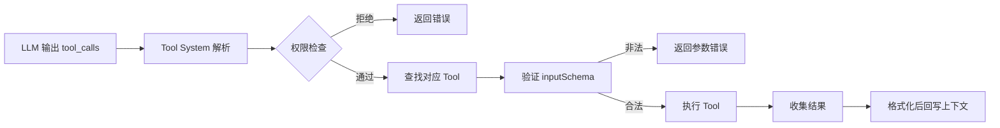

> [← 返回 Agent 索引]([[Notes/Agent/索引|Agent 索引]])

# Tool-System-架构解析：AI的手脚与边界

## Why：为什么要理解 Tool System？

### 问题背景

没有 Tool System 时，**LLM 只是一个会说话的大脑**。它能告诉你"应该改哪行代码"，但它不能真的打开文件、不能运行测试、不能查询数据库。这个大脑缺了两样东西：**手**（执行动作的能力）和**眼睛**（观察结果的能力）。

Tool System 就是给 LLM 安装手脚的手术室。它解决的核心问题是：
1. **如何把外部能力翻译成 LLM 能理解的格式？**（结构化输入输出）
2. **如何让 LLM 生成合法的工具调用？**（Schema 约束与验证）
3. **如何防止 AI 乱动手？**（权限、只读标记、破坏性标记）
4. **如何让不同 Agent 共享同样的外部能力？**（MCP 标准化协议）

在游戏引擎里，这个问题会以更具体的形式出现：
- 你想让 AI 调整物理参数，但它不知道有哪些参数可调
- AI 生成了 `set_transform(player, 100, 0, 0)`，但引擎的接口其实是 `entity_set_position`
- AI 同时修改了 10 个文件，其中一个是正在编译的关键头文件，导致引擎崩溃

### 不用它的后果

如果去掉 Tool System，Claude Code 和 Kimi CLI 都会退化为纯文本聊天工具。Agent 能"想"但不能"做"，所有代码改动都需要用户手动复制粘贴执行。

### 应用场景

1. **AI 自动重构代码**：AI 调用 `Grep` 找到所有引用 → `ReadFile` 读取上下文 → `StrReplaceFile` 批量替换 → `Shell` 运行测试验证
2. **引擎场景编辑**：AI 调用 `get_scene_hierarchy` 观察 → `add_node` 添加节点 → `set_property` 调整参数 → `play_scene` 运行验证
3. **跨工具协作**：通过 MCP 协议，Claude 可以调用你自定义的 Godot 工具、Unity 工具、Blender 工具

> [!tip] 从对话框出发
> 在引入 Tool System 之前，AI 只能告诉你"你应该做什么"。引入之后，它能直接**生成工具调用请求**——就像写一张纸条给秘书。这个纸条（`tool_call`）被 Tool System 拦截、解析、执行，结果再喂回给 AI。**LLM 本身没有变聪明，但它突然能动手了。**

## What：Tool System 的本质是什么？

**核心定义**：Tool System 是一套**将 LLM 的文本输出映射到结构化函数调用**的桥梁层。它由三个子系统构成：**工具注册表**（有什么工具）、**调用执行器**（怎么执行工具）、**安全边界**（什么能做什么不能做）。

### 核心概念速查

| 概念 | 作用 | 在 Agent 中的体现 |
|-----|------|-----------------|
| **Tool（工具）** | 一个可执行的原子能力，包含输入模式、执行逻辑、元数据 | `ReadFile`、`Bash`、`set_component` |
| **inputSchema** | 用 Zod/JSON Schema 定义工具参数结构 | AI 生成调用的唯一约束来源 |
| **Tool Registry（工具注册表）** | 所有可用工具的集合，支持动态加载和过滤 | Claude 的 `getAllBaseTools()` / Kimi 的 `KimiToolset` |
| **Function Calling** | LLM 输出结构化 JSON 而非纯文本，表示"我要调用 X 工具，参数是 Y" | `tool_use` 块 / `tool_calls` 列表 |
| **MCP（Model Context Protocol）** | AI 与外部工具的标准通信协议，类似"USB-C" | Claude 的 `services/mcp/` / Kimi 的 `fastmcp.Client` |
| **并发安全** | 标记工具是否可以并行执行 | `isConcurrencySafe` |
| **只读/破坏性标记** | 区分读取、写入、不可逆操作 | `isReadOnly` / `isDestructive` |

### 架构图解



---

前面我们搞懂了 **Tool System 的本质是一套将 LLM 的文本输出映射到结构化函数调用的桥梁层**。现在我们要回答的问题是：**Claude Code 和 Kimi CLI 分别是怎样给 AI 安装"手脚"的？** Claude 像一位精密的机械师，每个工具都有 60 多个参数和接口方法；Kimi 像一位灵活的装配工，用简洁的 `call()` 方法就能搞定。接下来我们把源码拆开，一层层看。

---

## How：不同 Agent 工具是如何实现的？

### 1. 宏观对比：Claude Code vs Kimi CLI

**先给一个总体的直觉比喻**：

> 想象你要给机器人设计一套工具箱。Claude Code 的做法是为每个工具写一本厚厚的说明书，包含输入规格、输出格式、安全标记、UI 渲染方式、并发规则等 60 多项参数，像 NASA 的航天器接口规范。Kimi CLI 的做法是给每个工具贴一张标签（名字、描述、参数），然后统一扔进一个工具箱（`KimiToolset`），像家庭工具箱一样简洁实用。

接下来再展开细节对比：

| 维度 | Claude Code | Kimi CLI | 差异原因分析 |
|------|-------------|----------|-------------|
| **核心抽象** | 泛型 `Tool<Input, Output, P>` 接口，像一本 60 多页的航天器说明书 | `CallableTool` / `CallableTool2`，简洁的 `call()` 方法，像家用工具的使用标签 | Claude 的 UI 深度集成，需要大量渲染和元数据方法；Kimi 的 UI 通过 Wire 协议解耦 |
| **工具注册** | 手动导入 + 条件编译，像工厂按订单装配特定型号的汽车 | 动态 importlib 加载，像自动售货机根据货道编号出货 | Claude 是打包应用，编译时确定工具集；Kimi 是 Python CLI，运行时动态加载更灵活 |
| **Schema 定义** | Zod `lazySchema`，像建筑图纸的详细规范 | `pydantic` / 纯 dict，通过 `kosong` 库处理，像简化的表格模板 | 两者都依赖运行时类型校验，但 Claude 的图纸更复杂 |
| **MCP 集成** | `MCPTool.ts` 是空壳，字段在 `mcpClient.ts` 运行时覆盖，像预留了通用插槽 | `MCPTool` 直接继承 `CallableTool`，包装 `fastmcp.Client`，像即插即用的 USB 设备 | Claude 需要深度兼容现有 UI 渲染框架；Kimi 直接复用 `kosong` 的 MCP 能力 |
| **Hook 系统** | `PreToolUse` / `PostToolUse` 分散在权限和 UI 层实现，像各部门各自把关 | 集中的 `HookEngine`，在 `KimiToolset.handle()` 中显式触发，像统一安检口 | Kimi 的 Hook 更像 AOP（面向切面编程），Claude 的权限检查与工具定义耦合更紧 |
| **安全模型** | `isReadOnly` / `isDestructive` / `isConcurrencySafe` + 多级权限规则，像工具的"危险品标签" | 运行时 `Approval` 层 + `PreToolUse` Hook，像统一门禁系统 | Claude 把安全标记静态贴在工具定义上；Kimi 把安全检查动态放在 Hook 和审批运行时中——**两者都能实现细粒度控制**，只是选择的层不同 |
| **对引擎的启示** | 如果你需要**丰富的 Inspector UI 和细粒度权限**，选 Claude 模式 | 如果你需要**快速扩展工具和标准化事件协议**，选 Kimi 模式 | 引擎 Editor 内嵌 AI 可以融合两者：Claude 的元数据标记 + Kimi 的集中 Hook |

> **用人话讲**：Claude Code 的 Tool System 像一位精密机械师为每个工具写的"航天器接口规范"——包含 60 多个字段，从输入约束到 UI 渲染无所不包。Kimi CLI 则像家庭工具箱里贴的使用标签——只有"名字、用途、参数"三项，但换工具、加工具特别快。

> [!info] 概念插播：kosong
> 
> **直觉版**：你可以把 `kosong` 想象成一家"中央厨房"。餐厅老板（Kimi CLI）不需要自己买菜、切菜、炒菜，只需要对厨房喊一声"来一单"，厨房就会把做好的菜端上来。
> 
> **定义版**：`kosong` 是 Kimi CLI monorepo 中的一个开源子包（`packages/kosong`），也是一个独立的 LLM 抽象层库（[`MoonshotAI/kosong`](https://github.com/MoonshotAI/kosong)）。它负责封装 LLM API 调用、流式响应解析、工具执行和结果格式化。
> 
> **为什么这里要用它**：Kimi CLI 的 Agent Loop 层不需要关心"HTTP 请求怎么发"、"SSE 流式字节怎么拆"、"tool_calls 怎么从 JSON 里提取"这些脏活累活。`kosong.step()` 一次性把这些事全包办了，Loop 层只负责"什么时候调用下一步"和"把事件广播给 UI"。
> 
> **对 Tool System 的影响**：因为 `kosong` 已经处理了 Schema 校验和 MCP 封装，Kimi CLI 的 `Toolset` 只需要提供"名字 + 描述 + 参数结构"三张标签，就可以交给 `kosong` 去和 LLM 打交道。这让 Kimi CLI 的工具定义远比 Claude Code 轻量。

> [!info] 概念插播：Function Calling / tool_calls
> 
> **直觉版**：LLM 本身不会读文件，但它可以"假装自己有一个秘书"，写一张纸条告诉秘书："去把 `README.md` 的内容拿来。"这张纸条就是 `tool_call`。
> 
> **定义版**：Function Calling 是 LLM API 提供的一种输出格式。LLM 不是返回 `"这里是 README.md 的内容..."`，而是返回一个 JSON 对象：`{"name": "ReadFile", "arguments": {"file_path": "/path/to/README.md"}}`。Tool System 收到这个 JSON 后，真正去执行文件读取。
> 
> **为什么这里要用它**：这是把 LLM 的"想法"连接到外部世界的唯一桥梁。没有它，AI 永远只是"建议者"。
>
> **引擎审视**：`Notes/SelfGameEngine/从零开始的引擎骨架` 中 **自描述注册表** 和 **Mutate 边界** 的设计假设 AI 已经知道怎么调用工具。但源码中 `inputSchema` 的严格要求说明：AI 生成工具调用的可靠性**完全取决于反射信息的完整度**。如果注册表只有"名字和字段类型"，AI 会频繁生成非法调用。必须补充字段约束、默认值、有效范围等元数据。

> [!warning] 如果 Claude Code 不做 fail-closed 默认值会怎样？
> 如果工具开发者忘记标记 `isConcurrencySafe: true`，系统默认认为它不安全，最多就是串行执行。但如果默认是"安全"（fail-open），一旦开发者遗漏标记，就可能导致两个写操作同时修改同一个文件，造成数据损坏。这就像是"宁可错杀一千，不可放过一个"。

> [!warning] 如果 Kimi CLI 不做集中式 Hook 会怎样？
> 如果权限检查、日志记录、性能统计都散落在每个工具的实现里，那么新增一个切面（比如"记录所有工具调用"）就要修改几十个文件。集中式 `HookEngine` 让新增切面只需要注册一个 Hook，不需要改动任何现有工具。

### 2. 核心机制伪代码

#### 方案 A：Claude Code 模式（富接口 + 条件编译）

这段伪代码模拟了 Claude Code 的 Tool 定义：一本厚厚的说明书。

```typescript
// 1. 定义 Tool 泛型接口
// 像一本包含 60 多页的说明书：输入规格、输出格式、安全标记、并发规则、UI 渲染...
type Tool<Input, Output, Progress> = {
  name: string
  inputSchema: z.ZodType<Input>      // 输入约束：AI 生成调用的唯一依据
  outputSchema?: z.ZodType<Output>   // 输出约束：返回值的序列化格式
  call(args: Input, ctx: ToolUseContext): Promise<ToolResult<Output>>
  isReadOnly(input: Input): boolean
  isDestructive(input: Input): boolean
  isConcurrencySafe(input: Input): boolean
  checkPermissions(input: Input, ctx: ToolUseContext): Promise<PermissionResult>
  // ... 还有 50+ 个 UI 渲染和元数据方法
}

// 2. 构建工具（提供安全默认值）
// 如果开发者忘了填某些字段，系统默认选最安全的选项
function buildTool<D extends ToolDef>(def: D): Tool {
  return {
    isEnabled: () => true,
    isConcurrencySafe: () => false,   // fail-closed：默认不安全
    isReadOnly: () => false,          // fail-closed：默认不是只读
    isDestructive: () => false,
    checkPermissions: async () => ({ behavior: 'allow' }),
    ...def,
  }
}

// 3. 工具装配中心
// 像工厂按订单装配汽车：基础车型 + 可选配置 + 外部 MCP 工具
function getAllBaseTools(): Tools {
  return [
    FileReadTool, FileEditTool, BashTool,
    ...(feature('COORDINATOR_MODE') ? [AgentTool] : []),
    ...(hasEmbeddedSearchTools() ? [] : [GlobTool, GrepTool]),
    // MCP 工具在运行时动态合并
  ]
}

function assembleToolPool(builtInTools: Tools, mcpTools: Tools): Tools {
  const allowedMcpTools = filterToolsByDenyRules(mcpTools, permissionContext)
  return uniqBy(
    [...builtInTools].sort(byName).concat(allowedMcpTools.sort(byName)),
    'name'  // 内置工具优先
  )
}
```

**这段代码在做什么**：Claude Code 把每个工具定义得像一本厚厚的航天器说明书，包含从输入约束到 UI 渲染的 60 多个字段。`buildTool` 提供了一个"安全默认值"机制：如果你忘记标记某个工具是"并发安全"的，系统默认认为它不安全（`fail-closed`）。`assembleToolPool` 则像工厂装配线，把内置工具和外部 MCP 工具合并成一个统一的工具池，并按名称排序以优化 Prompt Caching。

**核心设计思想**：
- **Fail-Closed 默认值**：遗漏标记时，系统默认选择最安全的选项
- **内置工具优先排序**：稳定前缀放在一起，最大化 Prompt Caching 收益
- **MCP 工具动态过滤**：根据权限规则过滤外部工具，确保不越界

#### 方案 B：Kimi CLI 模式（轻量接口 + 动态加载）

这段伪代码模拟了 Kimi CLI 的 `KimiToolset`：一个简洁的家庭工具箱。

```python
class KimiToolset:
    def __init__(self):
        self._tool_dict = {}
        self._hidden_tools = set()
        self._hook_engine = HookEngine()

    def add(self, tool: CallableTool):
        self._tool_dict[tool.name] = tool

    def hide(self, tool_name: str):
        self._hidden_tools.add(tool_name)

    @property
    def tools(self) -> list[Tool]:
        return [
            tool.base for tool in self._tool_dict.values()
            if tool.name not in self._hidden_tools
        ]

    def handle(self, tool_call: ToolCall) -> HandleResult:
        tool = self._tool_dict.get(tool_call.function.name)
        arguments = json.loads(tool_call.function.arguments)

        # --- PreToolUse Hook ---
        # 统一安检口：所有工具调用前都要过这一关
        results = await self._hook_engine.trigger(
            "PreToolUse",
            matcher_value=tool_call.function.name,
            input_data={...},
        )
        for result in results:
            if result.action == "block":
                return ToolResult(..., return_value=ToolError("Blocked by hook"))

        # --- 执行工具 ---
        ret = await tool.call(arguments)

        # --- PostToolUse Hook ---
        # 工具执行后的后置处理（日志、统计等）
        asyncio.create_task(
            self._hook_engine.trigger("PostToolUse", ...)
        )

        return ToolResult(tool_call_id=tool_call.id, return_value=ret)

    def load_tools(self, tool_paths: list[str], dependencies: dict):
        for tool_path in tool_paths:
            module_name, class_name = tool_path.rsplit(":", 1)
            module = importlib.import_module(module_name)
            tool_cls = getattr(module, class_name)
            # 依赖注入：像给工具注入它需要的"电池"
            args = [dependencies[param.annotation] for param in ...]
            tool = tool_cls(*args)
            self.add(tool)
```

**这段代码在做什么**：Kimi CLI 的 `KimiToolset` 就像一个家庭工具箱。每个工具只有一张简单的标签（`CallableTool`），包含名字、描述、参数三个关键信息。工具箱里有一个 `HookEngine`（统一安检口），所有工具调用前都要过 `PreToolUse` 安检，执行后还要过 `PostToolUse` 安检。新增工具时，`load_tools` 通过字符串动态加载 Python 模块，像自动售货机根据货道编号出货。

**核心设计思想**：
- **轻量接口**：工具定义只关心"名字、描述、参数、执行逻辑"
- **集中式 Hook**：权限、日志、统计等切面统一在 `handle()` 中触发
- **动态加载**：通过 `importlib` 运行时加载新工具，无需重新编译

### 3. 关键源码印证

#### Claude Code：`Tool.ts` 的泛型接口与安全默认值

**这段代码在做什么**：这是 Claude Code 的 Tool 泛型接口定义，像一本厚厚的说明书。`call` 是执行逻辑，`inputSchema` 是 AI 生成调用的唯一约束来源，`isConcurrencySafe` / `isReadOnly` / `isDestructive` 是安全标记。下面的 `TOOL_DEFAULTS` 提供了故障安全（fail-closed）的默认值。

```typescript
// D:/workspace/claude-code-main/src/Tool.ts:362-405
export type Tool<
  Input extends AnyObject = AnyObject,
  Output = unknown,
  P extends ToolProgressData = ToolProgressData,
> = {
  call(args: z.infer<Input>, context: ToolUseContext, ...): Promise<ToolResult<Output>>
  readonly inputSchema: Input
  outputSchema?: z.ZodType<unknown>
  isConcurrencySafe(input: z.infer<Input>): boolean
  isReadOnly(input: z.infer<Input>): boolean
  isDestructive?(input: z.infer<Input>): boolean
  checkPermissions(input: z.infer<Input>, context: ToolUseContext): Promise<PermissionResult>
  // ... 以及大量 UI 渲染方法
}

// D:/workspace/claude-code-main/src/Tool.ts:757-769
const TOOL_DEFAULTS = {
  isEnabled: () => true,
  isConcurrencySafe: (_input?: unknown) => false,  // fail-closed
  isReadOnly: (_input?: unknown) => false,         // fail-closed
  isDestructive: (_input?: unknown) => false,
  checkPermissions: async () => ({ behavior: 'allow', updatedInput: input }),
  toAutoClassifierInput: (_input?: unknown) => '',
  userFacingName: (_input?: unknown) => '',
}
```

**为什么这样设计**：`buildTool` 的 `TOOL_DEFAULTS` 体现了**故障安全（fail-closed）** 的设计哲学。如果工具开发者忘了标记并发安全，系统默认认为它不安全；如果忘了标记只读，系统默认认为它会写数据。这避免了因为遗漏标记而导致的安全事故。这是一种"宁可错杀一千，不可放过一个"的保守策略，在 AI 自动执行工具的场景下尤为重要。

#### Claude Code：`tools.ts` 的工具装配与 MCP 合并

**这段代码在做什么**：`getAllBaseTools` 像工厂装配线，根据功能开关（`feature`）和系统能力（`hasEmbeddedSearchTools`）有条件地加载工具。`assembleToolPool` 则把内置工具和外部 MCP 工具合并，并按名称排序。

```typescript
// D:/workspace/claude-code-main/src/tools.ts:193-250
export function getAllBaseTools(): Tools {
  return [
    AgentTool, TaskOutputTool, BashTool,
    ...(hasEmbeddedSearchTools() ? [] : [GlobTool, GrepTool]),
    FileReadTool, FileEditTool, FileWriteTool,
    // ... 条件编译加载更多工具
    ListMcpResourcesTool, ReadMcpResourceTool,
    ...(isToolSearchEnabledOptimistic() ? [ToolSearchTool] : []),
  ]
}

// D:/workspace/claude-code-main/src/tools.ts:345-367
export function assembleToolPool(
  permissionContext: ToolPermissionContext,
  mcpTools: Tools,
): Tools {
  const builtInTools = getTools(permissionContext)
  const allowedMcpTools = filterToolsByDenyRules(mcpTools, permissionContext)
  // 为 prompt caching 稳定性排序：内置工具前缀 contiguous
  const byName = (a: Tool, b: Tool) => a.name.localeCompare(b.name)
  return uniqBy(
    [...builtInTools].sort(byName).concat(allowedMcpTools.sort(byName)),
    'name',
  )
}
```

**为什么这样设计**：`assembleToolPool` 不仅是简单的数组合并，它还考虑了 **Prompt Caching 的稳定性**。内置工具作为"稳定前缀"排序在一起，MCP 工具作为"可变后缀"放在后面。这样当 MCP 服务器增删工具时，不会使内置工具的缓存断点失效。这就像是搬家时：先把固定的家具（内置工具）按固定顺序摆放，再把临时的箱子（MCP 工具）放在后面，这样每次开箱都不会影响家具的位置。

#### Kimi CLI：`KimiToolset.handle()` 的集中 Hook

**这段代码在做什么**：这是 Kimi CLI 处理每个工具调用的"统一安检口"。它先查找工具、解析参数，然后通过 `HookEngine` 触发 `PreToolUse` 安检，安检通过后才执行工具，执行完再触发 `PostToolUse` 后置处理。

```python
# D:/workspace/kimi-cli-main/src/kimi_cli/soul/toolset.py:134-245
class KimiToolset:
    def handle(self, tool_call: ToolCall) -> HandleResult:
        tool = self._tool_dict[tool_call.function.name]
        arguments = json.loads(tool_call.function.arguments or "{}")

        # PreToolUse
        results = await self._hook_engine.trigger(
            "PreToolUse", matcher_value=tool_call.function.name, ...
        )
        for result in results:
            if result.action == "block":
                return ToolResult(..., return_value=ToolError("Blocked by PreToolUse hook"))

        # Execute
        ret = await tool.call(arguments)

        # PostToolUse (fire-and-forget)
        asyncio.create_task(self._hook_engine.trigger("PostToolUse", ...))
        return ToolResult(tool_call_id=tool_call.id, return_value=ret)
```

**为什么这样设计**：Kimi CLI 把 Hook 系统集中在了 `handle()` 这一个方法里。这让它更容易扩展——如果你想加一个新的切面（比如"记录所有工具调用的日志"），只需要注册一个新 Hook，而不需要修改每个工具的定义。这就像是机场的统一安检口：不管你坐哪个航班，都走同一个安检通道，新增安检项目只需要改一个地方。

#### Kimi CLI：MCP 工具的包装

**这段代码在做什么**：这是 Kimi CLI 如何把外部 MCP 工具包装成内部"一等公民"。`MCPTool` 直接继承自 `CallableTool`，和内置工具共用同样的执行路径。调用时先走审批，再通过 `fastmcp.Client` 调用外部 MCP Server。

```python
# D:/workspace/kimi-cli-main/src/kimi_cli/soul/toolset.py:533-598
class MCPTool(CallableTool):
    def __init__(self, server_name, mcp_tool, client, runtime):
        super().__init__(
            name=mcp_tool.name,
            description=f"This is an MCP tool from `{server_name}`.\n\n{mcp_tool.description}",
            parameters=mcp_tool.inputSchema,
        )
        self._client = client

    async def __call__(self, *args, **kwargs):
        # 审批
        result = await self._runtime.approval.request(self.name, ...)
        # 调用 MCP Server
        async with self._client as client:
            result = await client.call_tool(self._mcp_tool.name, kwargs, ...)
            return convert_mcp_tool_result(result)
```

**为什么这样设计**：MCP 工具对 Kimi CLI 来说是"一等公民"：它直接继承自 `CallableTool`，和内置工具共用同样的执行路径。而对 Claude Code 来说，MCP 工具是通过 `MCPTool.ts` 的空壳 + `mcpClient.ts` 的运行时覆盖实现的，更强调与现有 UI 渲染框架的兼容。Kimi 的方式更适合快速接入新 MCP Server，Claude 的方式更适合保持 UI 体验的一致性。

## 引擎映射：这个设计对我的游戏引擎有什么启发？

### 1. 对应系统

Tool System 最像引擎里的 **脚本绑定系统 + Editor 命令系统 + 网络 RPC 系统** 的混合体。

- **Claude Code 的 `Tool<Input, Output>`** 对应引擎里的 **C++ 函数绑定到脚本/蓝图**：需要输入参数类型检查、输出序列化、并发安全考虑
- **Kimi CLI 的 `KimiToolset`** 对应引擎 Editor 的 **命令队列/撤销系统**：统一管理所有可执行操作，支持前置拦截（Hook）和后置回调
- **MCP 协议** 对应引擎对外的 **编辑器扩展协议**（如 Unreal 的 Remote Control API、Godot 的 WebSocket MCP 插件）

### 2. 可借鉴点

**借鉴 1：Fail-Closed 的默认安全策略**

Claude Code 的 `TOOL_DEFAULTS` 中 `isConcurrencySafe: false` 和 `isReadOnly: false` 是极好的设计。引擎中给 AI 暴露工具时，应该默认：
- 所有工具**不是只读**的（需要显式白名单才能免审批）
- 所有工具**不是并发安全**的（需要显式标记才能并行执行）
- 所有工具**不是破坏性操作**的（但删除、覆盖等操作必须显式标记）

**借鉴 2：Prompt Caching 稳定的工具排序**

Claude Code 的 `assembleToolPool` 把内置工具和 MCP 工具分开排序，确保缓存前缀稳定。映射到引擎：如果你的 AI 上下文注入包含"可用工具列表"，那么应该：
- 把**引擎核心工具**（`query_entities`、`set_component`）放在列表前面，保持固定顺序
- 把**项目自定义工具**（关卡生成器、特效调参器）放在后面，避免它们的变动导致核心工具缓存失效

**借鉴 3：Kimi CLI 的集中式 Hook 引擎**

与其把权限检查散落在每个工具的实现里，不如在 `AgentBridge` 中引入一个统一的 `HookEngine`：
- `PreMutateHook`：在写操作前检查组件白名单、冲突检测
- `PostMutateHook`：在写操作后记录 ChangeLog、触发 Inspector 刷新
- `PostStepHook`：在每帧结束后自动注入性能监控数据到 AI 上下文

**借鉴 4：MCP 作为引擎的"USB-C"接口**

Godot MCP 的成功证明了一件事：**把引擎能力包装成 MCP Server，比写自定义 AI 插件更有生态价值**。因为你的引擎工具可以同时被 Claude、Kimi、Cursor、Cline 使用，而不是绑定到某一个 AI 客户端。

### 3. 审视与修正行动项

> 以下修改已直接应用到 `Notes/SelfGameEngine/从零开始的引擎骨架.md`：

**发现 1：`AgentBridge` 缺少对工具元数据的严格设计**

原笔记中 `AgentBridge` 只有 `query_entities`、`set_velocity`、`step` 三个手写工具，但没有提到每个工具需要携带的元数据（`inputSchema`、`isReadOnly`、`isConcurrencySafe`、`description`）。

**修正**：在 `AgentBridge` 小节补充说明：所有暴露给 AI 的工具必须携带完整的自描述元数据。引擎应该有一个 `ToolRegistry`（类比 `TypeRegistry`），不仅注册工具的执行函数，还注册：
- `inputSchema`：参数的 JSON Schema，约束 AI 生成合法调用
- `outputSchema`：返回值的序列化格式
- `isReadOnly`：是否只读（影响审批策略和缓存策略）
- `isConcurrencySafe`：是否可以并行执行（影响调度）
- `isDestructive`：是否不可逆（影响警告级别）

**发现 2：没有体现工具与引擎系统的"绑定"机制**

原笔记假设 AI 调用 `set_component` 时，引擎已经知道怎么执行。但没有说明：一个新系统（比如新加入的 `ParticleSystem`）如何自动向 AI 注册它的调参工具？

**修正**：在 `阶段 2：好用` 的 `AgentBridge` 扩展部分，补充**工具自注册机制**：
- 每个 `System` 在初始化时，可以向 `ToolRegistry` 注册自己的观测/调参工具
- `ToolRegistry` 自动从 `TypeRegistry` 生成默认的 `get_component` / `set_component` 工具
-  specialized 系统可以覆盖默认工具，提供更语义化的接口（如 `spawn_enemy_wave` 而非原始的 `add_component`）

**发现 3：缺少对 MCP 协议的直接映射**

原笔记把 AI 接口描述为"自定义的 AgentBridge"，但没有提到 MCP 这个已经标准化的协议。如果未来想让外部 AI 客户端（Claude Desktop、Kimi CLI）直接连接引擎，自定义协议会带来巨大的集成成本。

**修正**：在笔记末尾的`必偷`清单中新增一条：
> **优先实现 MCP 协议而非自定义协议**：MCP 已经成为事实标准。引擎的 AI 接口应该首先是一套 MCP Server，AgentBridge 是引擎内部对这套 MCP 接口的封装。这样你的引擎可以直接被任何支持 MCP 的 AI 客户端调用。

## 从源码到直觉：一句话总结

> 读了这些源码之后，我终于明白为什么 AI 能从"纸上谈兵"变成能直接改代码、查文件、运行命令的助手了——因为 **Tool System 在 LLM 和真实世界之间搭了一座桥**：LLM 只需要生成一张标准化的纸条（`tool_call`），Tool System 就会替它验证、审批、执行，再把结果送回去。**AI 的手脚不是长在自己身上的，而是借来的。**

## 延伸阅读与待办

- [ ] [[Context-Management-架构解析：记忆与压缩]]
- [ ] [[Multi-Agent-架构解析：并行与协作]]
- [ ] [[从零开始的引擎骨架]]（已根据本篇洞察修正）
- [ ] 用 Python `mcp` SDK 写一个最小 MCP Server，暴露 `get_scene_hierarchy` 和 `set_actor_transform`
