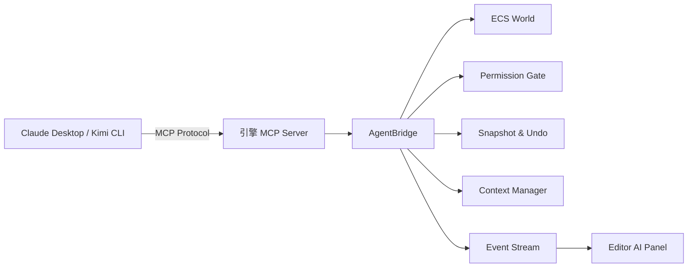

> [← 返回 Agent 索引]([[Agent/索引|Agent 索引]])

# 引擎 AI 集成实战 MVP

## Why：为什么前六个模块学完后，必须做一个端到端 MVP？

- **问题背景**：前六个阶段分别拆解了 Agent Loop、Tool System、Context Management、Multi-Agent、UI 系统、Permission Model。但**分散的知识不等于可用的系统**。就像你分别学会了发动机、轮胎、方向盘、变速箱的原理，却还没组装成一辆能开的车。
- **不做集成的后果**：
  1. **纸上架构**：引擎设计文档写得很漂亮，但从未验证过 LLM 能否真正理解你的 ECS 组件结构。
  2. **接口错位**：你设计的 `AgentBridge` 工具协议可能和 Claude Desktop / Kimi CLI 的 MCP 消费方式不兼容，导致任何主流 AI 客户端都接不进来。
  3. **安全盲区**：只读工具和写工具混在一起，没有权限 gate，AI 一次"手滑"就能删掉关卡核心数据。
- **应用场景**：
  1. **AI 辅助关卡编辑**：对 AI 说"把场景中所有敌人的血量减半"，AI 通过 MCP 查询场景 → 找到 Enemy 组件 → 批量修改 → 生成 Undo 记录 → 在 Editor 面板上显示 diff。
  2. **自主调参 Agent**：AI 连续 20 轮调整物理参数，每轮 `step(dt)` 后观察结果，不满意就 `rollback` 到上一个 checkpoint。
  3. **多 Agent 协作构建**：Director Agent 把"搭建一个射击关卡"拆给 LevelDesignAgent 和 GameplayAgent，Orchestrator 调度执行、合并结果、解决冲突。

> [!tip] 从对话框出发
> 在集成之前，AI 只能帮你"写代码"。集成之后，AI 突然能**直接操作运行中的引擎**——查询状态、修改参数、推进帧、撤销改动。这个质变来自一个简单但完整的闭环：把引擎能力封装成 MCP 工具 → 让 Agent Loop 驱动 LLM 调用这些工具 → 把执行结果通过事件流同步回 Editor UI。

---

## What：引擎 AI 集成 MVP 的本质是什么？

- **核心定义**：一个**最小可行**的端到端系统，让标准 MCP 客户端（如 Claude Desktop、Kimi CLI、Cursor）能够发现、调用并消费你的引擎暴露的 AI 工具，同时引擎内部具备 Agent Loop、上下文注入、权限控制、Undo/Redo 和状态可视化五大能力。
- **关键概念速查**

| 概念 | 作用 | 在 MVP 中的体现 |
|------|------|----------------|
| **MCP Server** | 引擎对外的标准 USB-C 接口 | 暴露 `query_entities`、`get_component`、`step`、`snapshot` 等工具 |
| **Agent Loop** | 协调 LLM 调用与工具执行的循环 | 引擎 Editor 内嵌或外部脚本驱动：调 LLM → 解析 tool_calls → 执行 → 回写结果 |
| **Context Injection** | 把引擎状态塞进 LLM 的 system prompt | 每次发消息前自动注入 viewport 状态、选中对象、ENGINE_AI.md |
| **Permission Gate** | 绿/黄/红三级操作审批 | 只读工具绿灯通过，`set_component` 黄灯记录 Undo，`delete_level` 红灯强制人工确认 |
| **UI Bridge** | 把 Agent 内部状态变成 Editor 可渲染的画面 | `EngineDisplayBlock` 协议：diff、changelog、task_status、screenshot |
| **Checkpoint/Rollback** | AI 的"撤销"能力 | `snapshot` 工具保存状态，`rollback` 工具恢复，支撑自主试错 |

### 端到端架构图解



> 注意：MCP Server 是**边界**，AgentBridge 是**封装**。外部 AI 客户端只认识 MCP，引擎内部只认识 AgentBridge。这种分层让引擎不绑定任何特定 AI 工具。

---

---

前面我们搞懂了 **引擎 AI 集成 MVP 的本质是一个最小可行的端到端系统，让标准 MCP 客户端能够发现、调用并消费引擎暴露的 AI 工具**。现在我们要回答的问题是：**如何把前六个模块的知识，一步步落地成一个能跑起来的系统？** 这就像组装一辆能开的车——不能一次性把所有零件都装上去，而要分里程碑渐进式推进。接下来我们把组装过程拆开，一层层看。

---

## How：如何把六大模块知识落地成一个 MVP？

### 1. 宏观设计：渐进式四个里程碑

**先给一个总体的直觉比喻**：

> 想象你要开一家自动驾驶出租车公司。M1 是先让车能"看见"路（只读 MCP Server）；M2 是让司机能记住乘客的上车点和目的地（Agent Loop + 上下文注入）；M3 是让车能自己打方向盘、同时有安全气囊和保险（写操作 + 安全边界）；M4 是让一个调度中心指挥多辆车协同拉客（多 Agent 编排）。

这是从"完全不可运行"到"AI 能自主工作"的最小路径：

| 里程碑 | 目标 | 核心验证问题 |
|--------|------|-------------|
| **M1：只读 MCP Server** | 让外部 AI 能"看见"引擎状态 | "当前场景里有哪些带 RigidBody 的实体？" |
| **M2：Agent Loop + 上下文注入** | 让 AI 能在对话中持续引用引擎状态 | "我选中的那个立方体位置在哪？" |
| **M3：写操作 + 安全边界** | 让 AI 能修改状态且有后悔药 | "把所有敌人的速度减半" → 验证 → Undo |
| **M4：多 Agent 编排** | 让多个 Agent 能分工协作 | "帮我搭一个射击关卡" → 拆解 → 并行 → 合并 |

> [!info] 为什么必须先做只读 MCP？
> 只读工具没有破坏风险，却能快速验证"LLM 是否理解你的 ECS 结构"。如果 AI 连 `query_entities` 都调用不对，说明 `ToolDesc` 的 `description` 或 `inputSchema` 写得不清楚，必须在引入写操作前修正。这就像是教新手开车——先让他在空地上练习直线行驶，再让他上高速。

> [!warning] 如果跳过 M1 直接做 M3 会怎样？
> 如果 AI 还没学会正确地"看"引擎状态，就给它开放写权限，结果很可能是：AI 以为自己改对了，但实际上改的是错误的实体或错误的组件。由于没有经过 M1 的验证，你很难判断是"AI 的理解错了"还是"写逻辑错了"，调试成本会翻倍。

### 2. 核心机制伪代码：MVP 的完整闭环

这段伪代码模拟了一个最小可行的引擎 MCP Server，包含权限检查、Undo 快照、事件流收集和 Agent Loop 驱动。

```python
class EngineMcpServer:
    def __init__(self, bridge: AgentBridge):
        self.bridge = bridge
        self.tools = self._register_tools()
    
    def _register_tools(self):
        return [
            ToolDesc("query_entities", readonly=True, ...),
            ToolDesc("get_component", readonly=True, ...),
            ToolDesc("set_component", readonly=False, ...),
            ToolDesc("step", readonly=False, ...),
            ToolDesc("snapshot", readonly=False, ...),
            ToolDesc("rollback", readonly=False, ...),
        ]
    
    def call_tool(self, name: str, args: dict) -> ToolResult:
        # 1. 权限检查
        # 像大楼门口的安检：绿灯直接过，黄灯问经理，红灯禁止入内
        perm = self.bridge.request_permission(name, json.dumps(args))
        if perm.behavior == PermissionBehavior.Deny:
            return ToolResult(ok=False, error="Permission denied")
        if perm.behavior == PermissionBehavior.Ask:
            if not self._prompt_user(name, args):
                return ToolResult(ok=False, error="User rejected")
        
        # 2. 写操作前生成 Undo 记录
        # 像做手术前的拍照存档：万一出了问题可以恢复到之前的状态
        if not self.tools[name].isReadOnly:
            self.bridge.snapshot(f"auto_before_{name}")
        
        # 3. 执行工具
        result = self.bridge.execute(name, args)
        
        # 4. 收集事件流供 UI 渲染
        # 像手术室的实时监控录像，同步到观察室的屏幕上
        events = self.bridge.consume_events()
        result.blocks = [event_to_display_block(e) for e in events]
        
        return result


def agent_loop(server: EngineMcpServer, user_message: str):
    messages = [
        { "role": "system", "content": build_engine_context() },
        { "role": "user", "content": user_message }
    ]
    
    while True:
        response = stream_llm(messages, tools=server.tools)
        tool_calls = []
        
        for chunk in response:
            if chunk.type == "tool_call":
                tool_calls.append(chunk)
            yield chunk  # 实时同步到 Editor UI
        
        if not tool_calls:
            break  # AI 没有调用工具，对话结束
        
        results = []
        for call in tool_calls:
            result = server.call_tool(call.name, call.args)
            results.append(result)
        
        messages.append(assistant_message_from_response(response))
        messages.extend(tool_result_messages(results))
```

**这段代码在做什么**：`EngineMcpServer` 就像引擎对外开设的一家"AI 服务窗口"。每个工具调用都要经过四道手续：安检（权限检查）、拍照存档（Undo 快照）、实际执行、监控录像（事件流收集）。`agent_loop` 则像一个不知疲倦的接线员：把用户的话转给 LLM，把 LLM 的工具调用转给引擎，把引擎的结果再转回给 LLM，周而复始直到任务完成。

**核心设计思想**：
- **MCP 是边界，AgentBridge 是封装**：外部 AI 客户端只认识 MCP，引擎内部只认识 AgentBridge
- **每次写操作前自动快照**：给 AI 提供"后悔药"
- **事件流实时同步**：让 Editor UI 能实时看到 AI 在做什么

### 3. 关键源码印证

#### Claude Code 的 MCP 客户端实现

**这段代码在做什么**：Claude Code 作为 **MCP 客户端**，使用 `@modelcontextprotocol/sdk` 连接外部 MCP Server。这告诉我们：如果你的引擎要成为 AI 可操作的系统，**优先实现 MCP Server，而不是自定义协议**。

```typescript
// D:/workspace/claude-code-main/src/services/mcp/client.ts
import { Client } from '@modelcontextprotocol/sdk/client/index.js'
import { StdioClientTransport } from '@modelcontextprotocol/sdk/client/stdio.js'
import { SSEClientTransport } from '@modelcontextprotocol/sdk/client/sse.js'
// ...

const client = new Client({ name: 'claude-code', version: '1.0.0' })
await client.connect(transport)
const tools = await client.listTools()  // 动态发现外部工具
```

**为什么这样设计**：MCP 正在成为 AI 工具连接的"USB-C"标准。Claude Code 的 Tool System 不是封闭的——它通过 MCP 把外部 Server 的工具**动态映射**成内部 `Tool` 对象。你的引擎只要实现标准 MCP Server，就能被 Claude Desktop、Kimi CLI、Cursor 等任何 MCP 客户端调用。如果搞自定义协议，就等于自己发明一种新接口，每个 AI 客户端都要单独适配，集成成本会高到不可接受。

#### Kimi CLI 的审批运行时

**这段代码在做什么**：Kimi CLI 把审批逻辑抽成了独立的 `approval_runtime`，支持按 `ApprovalSource` 精确撤销和批量管理。这对应引擎 MVP 中 **Permission Gate** 的设计。

```python
# D:/workspace/kimi-cli-main/src/kimi_cli/approval_runtime/
class ApprovalSource:
    kind: str       # "foreground_turn" / "background_agent"
    id: str
    agent_id: str
```

**为什么这样设计**：如果没有 `ApprovalSource` 的隔离，多 Agent 场景下就会出现"权限混在一起"的混乱局面。比如 Director Agent 派出的 PhysicsAgent 和 GameplayAgent 同时 pending 审批，用户想"只取消 PhysicsAgent 的所有操作"就做不到。`ApprovalSource` 让每个 Agent 的审批请求都有独立的"身份证"，实现了精确控制。

## 引擎映射：这个设计对 SelfGameEngine 有什么启发？

### 1. 对应系统

`从零开始的引擎骨架` 中的 `AgentBridge` + `ToolRegistry` + `TypeRegistry` 组合，本质上就是引擎内部的 **MCP Server 内核**。但它目前缺少两个关键分层：
1. **对外的 MCP 协议适配层**：把 `AgentBridge` 的工具描述翻译成 MCP 的 `ListToolsResult` / `CallToolRequest`
2. **对内的 Permission Gate 接入点**：`AgentBridge` 已经能检查组件白名单，但还没有把审批流程和 Undo 机制嵌入工具调用主路径

### 2. 可借鉴点

| Agent 源码实践 | SelfGameEngine 落地建议 |
|----------------|------------------------|
| Claude Code 动态发现 MCP 工具 | `ToolRegistry` 增加 `to_mcp_tools()` 方法，自动生成 JSON Schema |
| Kimi CLI 的统一审批运行时 | `AgentBridge` 的 `request_permission` 应该在**每次工具调用前**执行，而不是只在组件白名单处检查 |
| Claude Code 的 `StreamingToolExecutor` | `AgentBridge` 的事件流 (`emitEvent`) 应该支持在工具执行中途产生 `DisplayBlock`，而不只是最后返回 |
| 三层压缩策略 | `ContextCompressor` 应该被显式集成进 `AgentLoop` 层，而不是只留在 `World` 内部 |

### 3. 审视与修正行动项

#### 修正 1：MCP 协议应该是最外层接口

`从零开始的引擎骨架` 中写道：
> "`AgentBridge` 是引擎内部对这套 MCP 接口的封装"

但实际上目前的代码示例中，`AgentBridge` 是直接暴露的，没有展示 MCP 适配层。**需要修正为**：

```cpp
// 新增：MCP 适配层（引擎对外暴露的标准接口）
class McpAdapter {
    AgentBridge& bridge;
public:
    // 把 ToolRegistry 翻译成 MCP 的 ListToolsResult
    std::string list_tools() {
        json tools = json::array();
        for (const auto& [name, desc] : bridge.toolRegistry.tools) {
            tools.push_back({
                {"name", name},
                {"description", desc.description},
                {"inputSchema", json::parse(desc.inputSchema)}
            });
        }
        return tools.dump();
    }
    
    // 把 MCP 的 CallToolRequest 路由到 AgentBridge
    ToolResult call_tool(const std::string& name, const std::string& argsJson) {
        return bridge.execute(name, argsJson);
    }
};
```

> **修正原因**：如果没有显式的 MCP 适配层，未来任何协议变更都会渗透到 `AgentBridge` 内部。MCP 是"外设接口"，AgentBridge 是"系统总线"，两者必须解耦。

#### 修正 2：Permission Gate 必须嵌入工具调用主路径

当前 `AgentBridge::set_velocity` 等工具直接修改世界状态，没有调用 `request_permission`。根据 Claude Code `hooks/toolPermission/` 和 Kimi CLI `approval_runtime` 的源码实践，**权限检查必须在每次工具调用前执行**：

```cpp
class AgentBridge {
public:
    ToolResult execute_tool(const std::string& name, const std::string& input) {
        // 步骤 1：权限 gate
        auto perm = request_permission(name, input);
        if (perm.behavior != PermissionBehavior::Allow) {
            return {false, R"({"error":"permission denied"})", {}};
        }
        
        // 步骤 2：写操作前自动 snapshot（Undo）
        auto& desc = toolRegistry.tools[name];
        if (!desc.isReadOnly) {
            compressor.checkpoint("auto_before_" + name);
        }
        
        // 步骤 3：实际执行
        return toolRegistry.tools[name].call(input);
    }
};
```

> **修正原因**：权限不是装饰，而是安全边界。如果每个工具自己决定是否检查权限，必然有遗漏。必须统一在 `execute_tool` 入口做 gate。

#### 修正 3：ENGINE_AI.md 的生成和注入需要明确化

当前骨架中 `EngineAIMD` 的生成逻辑很好，但没有说明**何时注入到 LLM 的 system prompt 中**。需要补充：

```cpp
std::string build_engine_context(const AgentBridge& bridge) {
    std::string ctx = bridge.get_engine_ai_md();
    ctx += "\n\n## Current Selection\n";
    ctx += format_selected_entities(bridge.world);
    ctx += "\n\n## Recent Changes\n";
    ctx += bridge.compressor.summarize_history(bridge.world.get_changes(), 
                                                bridge.world.get_compacted_stats());
    return ctx;
}
```

> **修正原因**：上下文注入不是一次性配置，而是每次 Agent Loop 迭代时动态构建的。`ENGINE_AI.md` 是静态前缀（可缓存），当前选中和最近变更是动态后缀（不可缓存）。明确这个分层能优化 Token 成本。

#### 修正 4：明确 Agent Loop 的位置

当前骨架的 `main()` 函数展示了一个极简的"手动调用"模式，但没有展示真正的 **Agent Loop**。需要补充说明：

> Agent Loop 可以运行在三个位置：
> 1. **外部脚本**：Python 脚本通过 MCP 调用引擎（适合自动化测试）
> 2. **引擎 Editor 内嵌面板**：C++ Editor 直接内嵌一个 LLM 客户端（响应最快）
> 3. **外部 AI 客户端 + MCP**：Claude Desktop 通过 MCP 连接引擎（零额外开发）
>
> MVP 阶段推荐从 **方案 3** 开始，因为 Claude Desktop / Kimi CLI 已经自带完整的 Agent Loop、上下文管理、权限审批和 UI。你的引擎只需要做好 MCP Server，就能立刻获得一个成熟的 Agent 前端。

---

## 从源码到直觉：一句话总结

> 读了 Claude Code 的 MCP 客户端和 Kimi CLI 的审批运行时源码之后，我终于明白为什么 AI 能直接操作引擎了——因为**引擎把自己的能力封装成了标准 MCP 工具，而 Agent Loop 就是那个不知疲倦地 "问 LLM → 调工具 → 把结果再问回去" 的外部循环**。没有 MCP，AI 看不懂引擎；没有 Agent Loop，AI 不能自主工作。两者合体，才是真正的"引擎 + AI"。

---

## 延伸阅读与待办

- [ ] [[引擎-MCP-Server-搭建记录]] ——  Milestone 1 的具体实现
- [ ] [[引擎-AI-Chat-Panel-开发记录]] —— Milestone 2 的 Editor 内嵌方案
- [ ] [[从零开始的引擎骨架]] —— 已根据本分析完成修正
- [ ] [[MCP与Agent桥接层]] —— SelfGameEngine 中待补充的专门笔记（指向未来）
