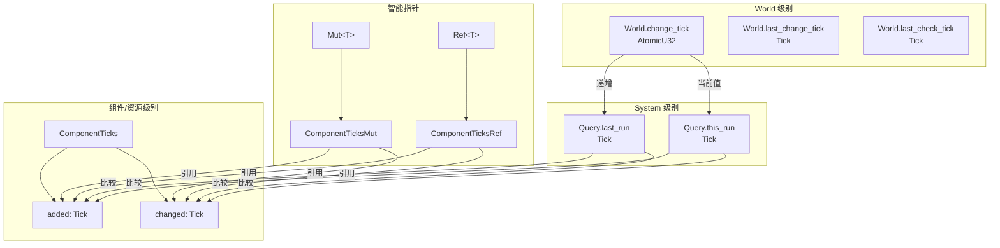
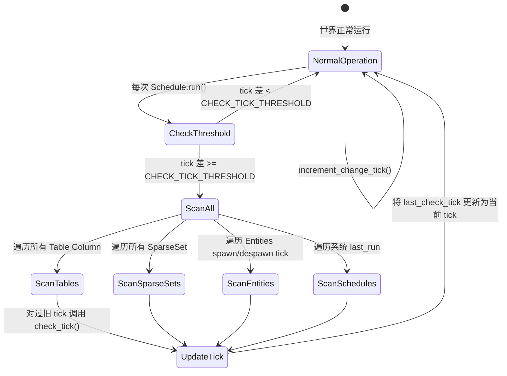
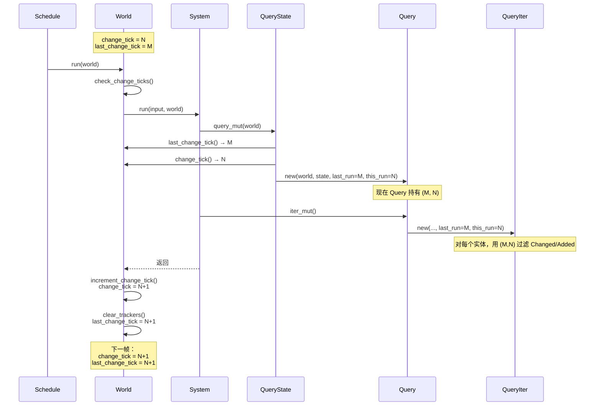

> [[Notes/Bevy/00-Bevy全解析主索引|← 返回 Bevy 全解析主索引]]

---

# Bevy `bevy_ecs` 源码解析：Change Detection 与脏标记

> **分析范围**：`bevy_ecs` crate 的变更检测子系统 —— 从全局 Tick 计数器到组件级脏标记，再到 Query 过滤器的完整链路。
> **分析轮次**：三轮完整分析（接口层 → 数据层 → 逻辑层）。
> **源码版本**：Bevy 0.19.0-dev（`main` 分支）。

---

## 零、前言

在传统的游戏引擎或 UI 框架中，"脏标记"通常是一个 `bool`：数据被修改时设为 `true`，消费系统处理后设为 `false`。这种模式简单直观，但有一个致命缺陷 —— **必须在每帧结束时遍历所有组件来清除标记**，否则下一帧会误判。对于拥有数十万组件的 ECS 世界，这是不可接受的性能开销。

Bevy 采用了一种更精巧的设计：**基于 Tick 计数器的脏标记**。它不再使用 `bool`，而是为每个组件记录"最后变更时的全局 Tick"。系统运行时，只需比较"组件变更 Tick"与"系统上次运行 Tick"，就能判断组件是否在本系统两次运行之间被修改过。

这种设计的好处是显而易见的：
- **无需遍历清除**：没有 `bool` 需要重置，变更的"时效性"自然衰减。
- **天然支持多帧多次运行**：同一 Schedule 在一帧内运行多次时，每次都能精确检测间隔内的变更。
- **O(1) 判断**：变更检测退化为两次整数比较。

但这也引入了一个微妙的难题 —— **`u32` 会溢出**。Bevy 通过精心设计的溢出阈值和周期性扫描解决了这个问题。本笔记将完整拆解这套机制。

---

## 一、模块定位与构建定义

### 1.1 模块地图

Change Detection 并非一个独立的 crate，而是内嵌在 `bevy_ecs` 中的跨模块机制：

| 文件路径 | 职责 |
|---------|------|
| `crates/bevy_ecs/src/change_detection/mod.rs` | 模块入口、常量定义（`CHECK_TICK_THRESHOLD`、`MAX_CHANGE_AGE`）、单元测试 |
| `crates/bevy_ecs/src/change_detection/tick.rs` | **`Tick`、`ComponentTicks`、`CheckChangeTicks`** 核心数据结构 |
| `crates/bevy_ecs/src/change_detection/traits.rs` | **`DetectChanges`、`DetectChangesMut`** trait 定义与宏实现 |
| `crates/bevy_ecs/src/change_detection/params.rs` | **`Mut<T>`、`Ref<T>`、`ResMut<T>`、`Res<T>`** 等智能指针 |
| `crates/bevy_ecs/src/query/filter.rs` | **`Changed<T>`、`Added<T>`、`Spawned`** Query 过滤器 |
| `crates/bevy_ecs/src/query/state.rs` | **`QueryState`** 的 tick 缓存与传递（`last_run` / `this_run`） |
| `crates/bevy_ecs/src/world/mod.rs` | **`World::change_tick`** 全局计数器、`World::check_change_ticks` 扫描 |

### 1.2 核心常量

> 文件：`crates/bevy_ecs/src/change_detection/mod.rs`，第 13~26 行

```rust
// 两次 check_tick 扫描之间的最小 world tick 增量
// (518,400,000 = 1000 ticks/帧 × 144 fps × 3600 秒)
pub const CHECK_TICK_THRESHOLD: u32 = 518_400_000;

// 不会在下一次扫描前溢出的最大 tick 差值
pub const MAX_CHANGE_AGE: u32 = u32::MAX - (2 * CHECK_TICK_THRESHOLD - 1);
```

`CHECK_TICK_THRESHOLD` 是 Bevy 变更检测系统的"安全网周期"。它的物理意义是：即使以 144 fps 运行且每帧触发 1000 次结构变更，也需要整整 **1 小时** 才会触发一次扫描。这保证了绝大多数情况下，变更检测是零额外开销的。

---

## 二、第一轮：接口层（What）

### 2.1 Tick —— 时间戳原子

> 文件：`crates/bevy_ecs/src/change_detection/tick.rs`，第 8~86 行

```rust
/// 追踪系统运行相对顺序的值，驱动变更检测的核心。
/// 未运行过的系统默认 Tick 为 0。
#[derive(Copy, Clone, Default, Debug, Eq, Hash, PartialEq)]
pub struct Tick {
    tick: u32,
}

impl Tick {
    pub const MAX: Self = Self::new(MAX_CHANGE_AGE);

    pub const fn new(tick: u32) -> Self { Self { tick } }
    pub const fn get(self) -> u32 { self.tick }
    pub fn set(&mut self, tick: u32) { self.tick = tick; }

    /// 核心方法：判断 self 是否比 last_run "更新"（即发生在系统上次运行之后）
    pub fn is_newer_than(self, last_run: Tick, this_run: Tick) -> bool {
        // 计算当前 tick 与 self 的相对差值，并钳制到 MAX_CHANGE_AGE
        let ticks_since_insert = this_run.relative_to(self).tick.min(MAX_CHANGE_AGE);
        let ticks_since_system = this_run.relative_to(last_run).tick.min(MAX_CHANGE_AGE);
        // 如果系统运行的间隔比组件变更的间隔更短，说明组件变更发生在系统上次运行之后
        ticks_since_system > ticks_since_insert
    }

    /// 计算 self 相对于 other 的差值（支持 u32 回绕）
    pub(crate) fn relative_to(self, other: Self) -> Self {
        let tick = self.tick.wrapping_sub(other.tick);
        Self { tick }
    }

    /// 扫描时调用：如果 tick 过旧，则将其钳制到安全范围
    pub fn check_tick(&mut self, check: CheckChangeTicks) -> bool {
        let age = check.present_tick().relative_to(*self);
        if age.get() > Self::MAX.get() {
            *self = check.present_tick().relative_to(Self::MAX);
            true
        } else {
            false
        }
    }
}
```

`Tick` 本质上就是一个 `u32` 的 newtype，但围绕它建立了一整套**回绕安全的比较语义**。`is_newer_than` 是这套语义的心脏 —— 它不比较绝对大小，而是比较"相对于当前运行时刻的年龄"。

### 2.2 ComponentTicks —— 组件级变更记录

> 文件：`crates/bevy_ecs/src/change_detection/tick.rs`，第 134~186 行

```rust
/// 记录组件/资源何时被添加、何时最后被修改
#[derive(Copy, Clone, Debug)]
pub struct ComponentTicks {
    /// 组件被添加到世界时的 tick
    pub added: Tick,
    /// 组件最后被修改时的 tick
    pub changed: Tick,
}

impl ComponentTicks {
    pub fn is_added(&self, last_run: Tick, this_run: Tick) -> bool {
        self.added.is_newer_than(last_run, this_run)
    }

    pub fn is_changed(&self, last_run: Tick, this_run: Tick) -> bool {
        self.changed.is_newer_than(last_run, this_run)
    }

    pub fn new(change_tick: Tick) -> Self {
        Self { added: change_tick, changed: change_tick }
    }

    pub fn set_changed(&mut self, change_tick: Tick) {
        self.changed = change_tick;
    }
}
```

每个组件实例（或资源实例）在存储层都附带一个 `ComponentTicks`。当组件被插入时，`added` 和 `changed` 被设为当前 `change_tick`；当被修改时，仅 `changed` 更新。

### 2.3 DetectChanges / DetectChangesMut —— 变更检测的 trait 接口

> 文件：`crates/bevy_ecs/src/change_detection/traits.rs`，第 27~87 行、第 89~165 行

```rust
/// 只读变更检测接口
pub trait DetectChanges {
    fn is_added(&self) -> bool;
    fn is_changed(&self) -> bool;
    fn is_added_after(&self, other: Tick) -> bool;
    fn is_changed_after(&self, other: Tick) -> bool;
    fn last_changed(&self) -> Tick;
    fn added(&self) -> Tick;
    fn changed_by(&self) -> MaybeLocation;
}

/// 可变变更检测接口（继承 DetectChanges）
pub trait DetectChangesMut: DetectChanges {
    type Inner: ?Sized;
    fn set_changed(&mut self);
    fn set_added(&mut self);
    fn set_last_changed(&mut self, last_changed: Tick);
    fn set_last_added(&mut self, last_added: Tick);
    fn bypass_change_detection(&mut self) -> &mut Self::Inner;
    fn set_if_neq(&mut self, value: Self::Inner) -> bool where Self::Inner: Sized + PartialEq;
    fn replace_if_neq(&mut self, value: Self::Inner) -> Option<Self::Inner> where Self::Inner: Sized + PartialEq;
}
```

这两个 trait 是用户（及引擎内部）与变更检测交互的主要界面。`DetectChanges` 提供查询能力，`DetectChangesMut` 提供主动标记变更的能力。特别值得注意的是 `set_if_neq` —— 它先通过 `bypass_change_detection` 读取旧值，仅在真正发生变化时才调用 `set_changed`，避免了无意义的脏标记。

### 2.4 Mut<T> / Ref<T> —— 带变更检测元数据的智能引用

> 文件：`crates/bevy_ecs/src/change_detection/params.rs`，第 640~717 行、第 871~956 行

```rust
/// 不可变借用，附带变更检测信息
pub struct Ref<'w, T: ?Sized> {
    pub(crate) value: &'w T,
    pub(crate) ticks: ComponentTicksRef<'w>,
}

/// 可变借用，附带变更检测信息
pub struct Mut<'w, T: ?Sized> {
    pub(crate) value: &'w mut T,
    pub(crate) ticks: ComponentTicksMut<'w>,
}
```

`Ref<T>` 和 `Mut<T>` 类似于 `&T` 和 `&mut T`，但额外携带了 `ComponentTicksRef` / `ComponentTicksMut`。当用户通过 `DerefMut` 解引用 `Mut<T>` 时，宏自动调用 `set_changed()`，将 `changed` tick 更新为 `this_run`。

### 2.5 Changed<T> / Added<T> —— Query 变更过滤器

> 文件：`crates/bevy_ecs/src/query/filter.rs`，第 663~884 行、第 886~1112 行

```rust
/// 仅保留在本系统上次运行之后被添加的实体
pub struct Added<T>(PhantomData<T>);

/// 仅保留在本系统上次运行之后被添加或被修改的实体
pub struct Changed<T>(PhantomData<T>);
```

`Added<T>` 和 `Changed<T>` 实现了 `QueryFilter` trait。它们在迭代时，对每个实体读取其组件的 `ComponentTicks`，然后调用 `Tick::is_newer_than(last_run, this_run)` 判断是否保留。由于需要逐实体检查 tick，它们**不是 archetypal 过滤器**（`IS_ARCHETYPAL = false`），这意味着 Query 无法通过 Archetype 预筛选来加速，每次迭代都必须执行过滤逻辑。

---

## 三、第二轮：数据层（How - Structure）

### 3.1 核心数据结构关系



### 3.2 Tick 的存储位置与生命周期

| Tick 类型 | 存储位置 | 更新时机 | 用途 |
|----------|---------|---------|------|
| `World.change_tick` | `World` 结构体中的 `AtomicU32` | 每次结构变更（spawn/insert/remove）或 `increment_change_tick()` | 全局时间基准 |
| `World.last_change_tick` | `World` 结构体 | `World::clear_trackers()` 时 | 世界级别的"上次检查点" |
| `World.last_check_tick` | `World` 结构体 | `World::check_change_ticks()` 扫描后 | 记录上次扫描时间，控制扫描频率 |
| `ComponentTicks.added` | Table Column / SparseSet | 组件插入时 | 判断组件是否为新添加 |
| `ComponentTicks.changed` | Table Column / SparseSet | 组件插入或修改时 | 判断组件是否被修改 |
| `Query.last_run` | `Query` 结构体 | System 上次运行时 | System 级别的"上次检查点" |
| `Query.this_run` | `Query` 结构体 | System 本次运行时 | 当前运行时刻的 tick |

### 3.3 ComponentTicks 在存储层的布局

Bevy 的组件存储有两种形式：Table（默认，列式密集存储）和 SparseSet（稀疏存储）。无论哪种，`ComponentTicks` 都紧挨着组件数据存放。

对于 **Table 存储**：

```
Table
├── Column for Component T
│   ├── data: [T; capacity]       # 组件值数组
│   └── ticks: [ComponentTicks; capacity]  # 每个组件对应的 ticks
```

> 文件：`crates/bevy_ecs/src/storage/table/mod.rs`（Table 的 Column 同时存放数据和 ticks）

对于 **SparseSet 存储**：

```
ComponentSparseSet
├── dense: Column                 # 紧凑的数据数组
├── entities: [EntityIndex]       # dense[i] 对应的实体
├── sparse: SparseArray           # 实体 → dense 索引
└── ticks 同样内嵌在 Column 中
```

这意味着读取组件的 `ComponentTicks` 与读取组件数据本身是 **同局部性** 的，不会产生额外的缓存未命中。

---

## 四、第三轮：逻辑层（How - Behavior）

### 4.1 全局 Tick 递增与 System Tick 获取

#### World::increment_change_tick

> 文件：`crates/bevy_ecs/src/world/mod.rs`，第 3077~3082 行

```rust
pub fn increment_change_tick(&mut self) -> Tick {
    let change_tick = self.change_tick.get_mut();  // 获取 &mut u32（无需原子操作）
    let prev_tick = *change_tick;
    *change_tick = change_tick.wrapping_add(1);    // 回绕递增
    Tick::new(prev_tick)
}
```

全局 tick 使用 `wrapping_add`，这意味着它会在 `u32::MAX` 后自然回绕到 `0`。这是设计意图，而非 bug —— 因为所有比较都通过 `wrapping_sub` 进行。

#### World::clear_trackers

> 文件：`crates/bevy_ecs/src/world/mod.rs`，第 1644~1646 行

```rust
pub fn clear_trackers(&mut self) {
    self.last_change_tick = self.increment_change_tick();
}
```

`clear_trackers` 将 `last_change_tick` 推进到当前的 `change_tick`。这通常在 Schedule 运行结束后调用，作为下一帧的基准点。

#### Query 如何获取 tick

> 文件：`crates/bevy_ecs/src/query/state.rs`，第 381~387 行

```rust
pub fn query_mut<'w, 's>(&'s mut self, world: &'w mut World) -> Query<'w, 's, D, F> {
    let last_run = world.last_change_tick();  // 系统上次运行的 tick
    let this_run = world.change_tick();       // 当前世界的 tick
    unsafe { self.query_unchecked_with_ticks(world.as_unsafe_world_cell(), last_run, this_run) }
}
```

当 System 执行时，`QueryState::query_mut` 从 `World` 读取 `last_change_tick` 和 `change_tick`，分别作为 `last_run` 和 `this_run` 传入 `Query`。这意味着：

- **同一帧内多次运行同一 System**：如果中间调用了 `increment_change_tick()`，每次 `this_run` 都会不同，变更检测仍然精确。
- **不同 System 之间的变更检测**：System A 修改了组件，System B 在下一帧运行时，`last_run` 是 System B 上次运行的 tick，因此能检测到 System A 的修改。

### 4.2 组件变更标记 —— Mut::set_changed 与 DerefMut

> 文件：`crates/bevy_ecs/src/change_detection/traits.rs`，第 424~483 行（宏展开后的 `change_detection_mut_impl`）

```rust
// 宏为 Mut<T> / ResMut<T> / NonSendMut<T> 统一生成 impl DetectChangesMut
impl<T: ?Sized> DetectChangesMut for Mut<'_, T> {
    type Inner = T;

    #[inline]
    #[track_caller]
    fn set_changed(&mut self) {
        // 将 changed tick 设为当前系统运行 tick
        *self.ticks.changed = self.ticks.this_run;
        // 记录调用位置（用于调试）
        self.ticks.changed_by.assign(MaybeLocation::caller());
    }

    #[inline]
    #[track_caller]
    fn set_added(&mut self) {
        *self.ticks.changed = self.ticks.this_run;
        *self.ticks.added = self.ticks.this_run;
        self.ticks.changed_by.assign(MaybeLocation::caller());
    }

    fn bypass_change_detection(&mut self) -> &mut Self::Inner {
        self.value  // 直接返回内部值，不更新 tick
    }
}

// DerefMut 自动触发 set_changed
impl<T: ?Sized> DerefMut for Mut<'_, T> {
    #[inline]
    #[track_caller]
    fn deref_mut(&mut self) -> &mut Self::Target {
        self.set_changed();
        self.ticks.changed_by.assign(MaybeLocation::caller());
        self.value
    }
}
```

**关键洞察**：`Mut<T>` 的变更检测是**解引用触发的（eager）**。只要你执行 `*mut_t = new_value`，`DerefMut` 就会自动调用 `set_changed()`。这确保了**不会有遗漏的变更** —— 任何可变访问都会被标记。

但这也有副作用：即使你将值设为与原来相同的值，它也会被标记为 changed。因此 Bevy 提供了 `set_if_neq` 来帮助优化：

> 文件：`crates/bevy_ecs/src/change_detection/traits.rs`，第 213~227 行

```rust
fn set_if_neq(&mut self, value: Self::Inner) -> bool
where
    Self::Inner: Sized + PartialEq,
{
    let old = self.bypass_change_detection();  // 先绕过变更检测读取旧值
    if *old != value {
        *old = value;
        self.set_changed();  // 真正变化时才标记
        true
    } else {
        false
    }
}
```

### 4.3 Change Detection 判断逻辑 —— Changed<T> 过滤器

> 文件：`crates/bevy_ecs/src/query/filter.rs`，第 1078~1112 行

```rust
unsafe impl<T: Component> QueryFilter for Changed<T> {
    const IS_ARCHETYPAL: bool = false;  // 非 archetypal，需要逐实体检查

    #[inline(always)]
    unsafe fn filter_fetch(
        _state: &Self::State,
        fetch: &mut Self::Fetch<'_>,
        entity: Entity,
        table_row: TableRow,
    ) -> bool {
        fetch.ticks.extract(
            // Table 存储路径
            |table| {
                let table = unsafe { table.debug_checked_unwrap() };
                let tick = unsafe { table.get_unchecked(table_row.index()) };
                tick.deref().is_newer_than(fetch.last_run, fetch.this_run)
            },
            // SparseSet 存储路径
            |sparse_set| {
                let tick = unsafe {
                    sparse_set.debug_checked_unwrap().get_changed_tick(entity).debug_checked_unwrap()
                };
                tick.deref().is_newer_than(fetch.last_run, fetch.this_run)
            },
        )
    }
}
```

`Changed<T>` 的过滤逻辑非常直接：
1. 根据组件存储类型（Table 或 SparseSet），获取对应实体的 `changed` tick。
2. 调用 `Tick::is_newer_than(last_run, this_run)`。
3. 如果组件的 `changed` tick 比系统的 `last_run` 更新（即发生在系统上次运行之后），则保留该实体。

`Added<T>` 的逻辑与 `Changed<T>` 几乎完全一致，区别仅在于它读取的是 `added` tick 而非 `changed` tick：

> 文件：`crates/bevy_ecs/src/query/filter.rs`，第 851~884 行

```rust
unsafe impl<T: Component> QueryFilter for Added<T> {
    const IS_ARCHETYPAL: bool = false;

    #[inline(always)]
    unsafe fn filter_fetch(...) -> bool {
        fetch.ticks.extract(
            |table| { ... tick.deref().is_newer_than(fetch.last_run, fetch.this_run) ... },
            |sparse_set| { ... tick.deref().is_newer_than(fetch.last_run, fetch.this_run) ... },
        )
    }
}
```

### 4.4 Added 检测的语义边界

需要特别注意 **`Added<T>` 的时效性**：

- 当组件首次插入到实体时，`added` 和 `changed` 都被设为当前 `change_tick`。
- `Added<T>` 检测的是 `added.is_newer_than(last_run, this_run)`。
- 一旦系统运行过一次且 `last_run` 超过了 `added` tick，该组件就不再被视为 "Added"。
- **没有"重置 Added"的操作** —— `added` tick 在组件生命周期内通常不变（除非手动调用 `set_added`）。

这意味着 `Added<T>` 是一种**一次性触发**的过滤器，典型用途是初始化逻辑：

```rust
fn init_health(mut query: Query<&mut Health, Added<Health>>) {
    for mut health in &mut query {
        health.current = health.max;  // 新插入的 Health 组件自动满血
    }
}
```

### 4.5 Tick 溢出处理 —— 核心安全机制

这是 Bevy Change Detection 中最精妙、也最容易被忽略的部分。

#### 问题：u32 会回绕

全局 `change_tick` 是 `u32`，以 1000 ticks/帧 × 144 fps 计算，约 **8.3 小时** 就会回绕一次（`2^32 / 144000 ≈ 29826 秒`）。如果直接比较 `a > b`，回绕后会出现严重误判。

#### 解决方案：wrapping_sub + 周期性 clamp

Bevy 采用了**双保险策略**：

**保险 1：`wrapping_sub` 计算相对年龄**

> 文件：`crates/bevy_ecs/src/change_detection/tick.rs`，第 66~69 行

```rust
pub(crate) fn relative_to(self, other: Self) -> Self {
    let tick = self.tick.wrapping_sub(other.tick);
    Self { tick }
}
```

`a.wrapping_sub(b)` 在 `u32` 回绕后仍能正确表示"从 `b` 到 `a` 向前走了多少步"，前提是这个步数不超过 `u32::MAX / 2`。

**保险 2：`MAX_CHANGE_AGE` 钳制 + 周期性 `check_change_ticks` 扫描**

> 文件：`crates/bevy_ecs/src/change_detection/tick.rs`，第 71~86 行

```rust
pub fn check_tick(&mut self, check: CheckChangeTicks) -> bool {
    let age = check.present_tick().relative_to(*self);
    // 如果该 tick 已经比 MAX_CHANGE_AGE 更旧
    if age.get() > Self::MAX.get() {
        // 将其钳制到 "present_tick - MAX_CHANGE_AGE"
        *self = check.present_tick().relative_to(Self::MAX);
        true
    } else {
        false
    }
}
```

`MAX_CHANGE_AGE = u32::MAX - (2 * CHECK_TICK_THRESHOLD - 1)` ≈ 32.7 亿。

这意味着：即使一个组件在 32.7 亿个 tick 前被修改过，它仍然可以被正确检测为"旧"。超过这个阈值，它会被 `check_change_ticks` 扫描强制重置到边界值，从而确保**任何组件的变更年龄都不会超过 `MAX_CHANGE_AGE`**。

#### World::check_change_ticks 的全局扫描

> 文件：`crates/bevy_ecs/src/world/mod.rs`，第 3241~3271 行

```rust
pub fn check_change_ticks(&mut self) -> Option<CheckChangeTicks> {
    let change_tick = self.change_tick();
    // 如果距离上次扫描还不到 CHECK_TICK_THRESHOLD，跳过
    if change_tick.relative_to(self.last_check_tick).get() < CHECK_TICK_THRESHOLD {
        return None;
    }

    let check = CheckChangeTicks(change_tick);

    // 扫描所有 Table 中的 ticks
    self.storages.tables.check_change_ticks(check);
    // 扫描所有 SparseSet 中的 ticks
    self.storages.sparse_sets.check_change_ticks(check);
    // 扫描非 Send 资源
    self.storages.non_sends.check_change_ticks(check);
    // 扫描实体的 spawn/despawn ticks
    self.entities.check_change_ticks(check);
    // 扫描 Schedule 中缓存的系统 last_run
    if let Some(mut schedules) = self.get_resource_mut::<Schedules>() {
        schedules.check_change_ticks(check);
    }

    self.trigger(check);  // 触发 CheckChangeTicks 事件
    self.flush();

    self.last_check_tick = change_tick;
    Some(check)
}
```

扫描流程可以用以下状态图表示：



#### 溢出处理的数值示例

假设 `CHECK_TICK_THRESHOLD = 10`（实际为 5.18 亿，这里用 10 便于理解），则 `MAX_CHANGE_AGE = u32::MAX - 19`。

```
t = 0:   World 创建，change_tick = 1，组件 A 被插入，A.changed = 1
...
t = 15:  change_tick = 16
         距离上次扫描 = 15 >= CHECK_TICK_THRESHOLD(10)，触发扫描
         组件 A 的年龄 = 16 - 1 = 15
         MAX_CHANGE_AGE = u32::MAX - 19
         15 < MAX_CHANGE_AGE，所以 A.changed 保持为 1
...
t = u32::MAX:  change_tick = u32::MAX
         组件 A 的年龄 = u32::MAX - 1 ≈ MAX_CHANGE_AGE
         仍然安全，无需 clamp
...
t = 0 (回绕):  change_tick = 0（因为 wrapping_add）
         距离上次扫描 = 1 < CHECK_TICK_THRESHOLD，不扫描
         系统 last_run = u32::MAX
         组件 A.changed = 1
         is_newer_than 计算：
           this_run.relative_to(A.changed) = 0 - 1 = u32::MAX（回绕）
           但 A 的年龄会被 clamp 吗？不会，因为还没到扫描点
         然而 this_run (0) 相对于 last_run (u32::MAX) 的差距 = 1
         A.changed (1) 相对于 last_run (u32::MAX) 的差距 = 2
         ticks_since_system = 1, ticks_since_insert = 2
         1 > 2 ? false → 正确判断为未变更！
```

这个例子展示了回绕安全的精妙之处：**`this_run` 总是"最新"的，`last_run` 总是比 `this_run` 旧（最多旧一个阈值范围内），而组件 tick 通过周期性扫描保证不会被误判为比 `last_run` 更新。**

### 4.6 QueryState 的 tick 更新链路

System 的 `last_run` 是在哪里更新的？让我们追踪完整的 tick 传递链路：



**关键发现**：`Query` 的 `last_run` 和 `this_run` 实际上来自 `World::last_change_tick` 和 `World::change_tick`，而不是 System 自身的私有字段。这是 Bevy 的一个简化设计 —— System 没有独立的 `last_run`，它共享世界的 `last_change_tick` 作为基准。

实际上，System **确实有**自己的 `last_run`（通过 `System::set_last_run` 管理），但 `Query` 使用的是 `World` 级别的 tick。这个差异意味着：如果一个 System 在一帧内被 Schedule 调用多次，且中间没有 `clear_trackers`，那么它的两次运行会看到相同的 `last_run` 和 `this_run`，变更检测在这两次运行之间是"盲区"。不过通常 Schedule 的运行模式保证了这一点不是问题。

> 文件：`crates/bevy_ecs/src/system/system.rs`，第 178~186 行

```rust
fn get_last_run(&self) -> Tick;
fn set_last_run(&mut self, last_run: Tick);
```

System 的 `last_run` 主要用于 Schedule 级别的变更检测（如 `resource_changed` 条件），而 Query 级别的 `Changed<T>` 过滤器使用的是 `Query` 结构体中显式传入的 `last_run` / `this_run`。

---

## 五、关联辐射（Context）

### 5.1 与上层模块的关系

| 上层模块 | 交互方式 | 说明 |
|---------|---------|------|
| `bevy_app` / `Schedule` | `Schedule::run(world)` → `world.check_change_ticks()` | Schedule 每次运行前检查是否需要扫描 |
| `bevy_ecs::system::Query` | `Query::new(world, state, last_run, this_run)` | Query 从世界获取 tick 并缓存 |
| `bevy_ecs::system::System` | `System::set_last_run(tick)` | System 记录上次运行 tick，用于条件判断 |
| `bevy_reflect` | `ReflectFromPtr` + `MutUntyped` | 反射系统通过 `MutUntyped` 参与变更检测 |

### 5.2 与存储层的关系

Change Detection 本质上是一个**元数据层**，它依附于存储层但不对存储结构做侵入式修改：

- **Table 存储**：Column 中每个数据行都附带 `ComponentTicks`。`Table::get_added_ticks_slice_for` / `get_changed_ticks_slice_for` 返回 tick 数组的切片。
- **SparseSet 存储**：`ComponentSparseSet::get_added_tick(entity)` / `get_changed_tick(entity)` 通过实体索引查找对应的 tick。

这种设计使得 Change Detection 可以**选择性启用**。实际上，Bevy 目前的实现是所有组件都附带 ticks，但理论上可以扩展为仅在需要时分配 tick 数组。

### 5.3 跨引擎对照

| 维度 | Bevy (Tick-based) | Unreal Engine | chaos |
|------|-------------------|---------------|-------|
| **脏标记单位** | `u32` Tick 计数器 | `bool` / 回调驱动 | `bool` / 版本号 |
| **清除开销** | 无（自然衰减） | 需遍历或回调清除 | 需遍历或回调清除 |
| **多帧多次运行** | 天然支持 | 需手动管理 | 需手动管理 |
| **溢出处理** | `wrapping_add` + 周期性 clamp | 不适用（bool 无溢出） | 版本号回绕需处理 |
| **粒度** | 组件级（每个实例独立 tick） | 通常是对象级 / 属性级 | 组件级 |
| **查询方式** | `Changed<T>` / `Added<T>` QueryFilter | `FProperty::PropertyChanged` 事件 | 自定义脏标记位图 |

Bevy 的 Tick 方案在**高频变更 + 大量组件**的场景下具有显著优势，因为它将 O(n) 的清除操作摊销到了 O(n) 的周期性扫描中，且扫描间隔极长（默认约 1 小时一次）。

### 5.4 设计亮点总结

1. **Tick 替代 bool**：全局递增计数器消除了"每帧清除脏标记"的开销。
2. **wrapping_add 安全**：通过 `wrapping_sub` 比较相对年龄，而非绝对大小，天然支持 `u32` 回绕。
3. **双阈值策略**：`CHECK_TICK_THRESHOLD` 控制扫描频率，`MAX_CHANGE_AGE` 控制最大可信年龄，两者配合确保即使长期运行也不会溢出误判。
4. **解引用自动标记**：`Mut<T>::deref_mut()` 自动调用 `set_changed()`，用户无需手动标记，降低了漏标风险。
5. **set_if_neq 优化**：为值比较场景提供零开销的精确变更检测。
6. **调试友好**：`changed_by` 记录 `#[track_caller]` 位置，便于追踪是谁修改了组件。

---

## 六、关键源码片段

### 6.1 Tick::is_newer_than —— 变更检测的心脏

> 文件：`crates/bevy_ecs/src/change_detection/tick.rs`，第 48~62 行

```rust
/// 返回 true 如果 self 比系统的 last_run "更新"
/// this_run 是系统当前的 tick，作为参考点帮助处理回绕
#[inline]
pub fn is_newer_than(self, last_run: Tick, this_run: Tick) -> bool {
    // 即使有回绕也能工作，因为 world tick (this_run) 总是比
    // last_run 和 self.tick "更新"，而且我们会周期性扫描
    // ComponentTicks 值，确保它们不会比 u32::MAX 更旧（差值会溢出）
    let ticks_since_insert = this_run.relative_to(self).tick.min(MAX_CHANGE_AGE);
    let ticks_since_system = this_run.relative_to(last_run).tick.min(MAX_CHANGE_AGE);

    ticks_since_system > ticks_since_insert
}
```

### 6.2 ComponentTicks 结构

> 文件：`crates/bevy_ecs/src/change_detection/tick.rs`，第 135~143 行

```rust
/// 记录组件或资源何时被添加、何时最后被修改
#[derive(Copy, Clone, Debug)]
pub struct ComponentTicks {
    /// 记录组件/资源被添加时的 tick
    pub added: Tick,
    /// 记录组件/资源最近被修改时的 tick
    pub changed: Tick,
}
```

### 6.3 World 的 tick 字段

> 文件：`crates/bevy_ecs/src/world/mod.rs`，第 98~133 行

```rust
pub struct World {
    // ... 其他字段 ...
    pub(crate) change_tick: AtomicU32,      // 全局变更计数器
    pub(crate) last_change_tick: Tick,      // 上次 clear_trackers 的 tick
    pub(crate) last_check_tick: Tick,       // 上次 check_change_ticks 的 tick
    // ...
}

impl World {
    pub fn new() -> World {
        World {
            // 默认值是 1，last_change_tick 默认是 0
            // 这样第一次变更（tick=1）会被检测为"新"
            change_tick: AtomicU32::new(1),
            last_change_tick: Tick::new(0),
            last_check_tick: Tick::new(0),
            // ...
        }
    }
}
```

### 6.4 DetectChangesMut::set_if_neq

> 文件：`crates/bevy_ecs/src/change_detection/traits.rs`，第 213~227 行

```rust
/// 仅当 *self != value 时才覆盖，返回是否发生了覆盖
#[inline]
#[track_caller]
fn set_if_neq(&mut self, value: Self::Inner) -> bool
where
    Self::Inner: Sized + PartialEq,
{
    let old = self.bypass_change_detection();
    if *old != value {
        *old = value;
        self.set_changed();
        true
    } else {
        false
    }
}
```

### 6.5 Changed<T> 过滤器的 filter_fetch

> 文件：`crates/bevy_ecs/src/query/filter.rs`，第 1078~1112 行

```rust
unsafe impl<T: Component> QueryFilter for Changed<T> {
    const IS_ARCHETYPAL: bool = false;

    #[inline(always)]
    unsafe fn filter_fetch(
        _state: &Self::State,
        fetch: &mut Self::Fetch<'_>,
        entity: Entity,
        table_row: TableRow,
    ) -> bool {
        fetch.ticks.extract(
            |table| {
                let table = unsafe { table.debug_checked_unwrap() };
                let tick = unsafe { table.get_unchecked(table_row.index()) };
                tick.deref().is_newer_than(fetch.last_run, fetch.this_run)
            },
            |sparse_set| {
                let tick = unsafe {
                    sparse_set
                        .debug_checked_unwrap()
                        .get_changed_tick(entity)
                        .debug_checked_unwrap()
                };
                tick.deref().is_newer_than(fetch.last_run, fetch.this_run)
            },
        )
    }
}
```

---

## 七、关联阅读

- [[Bevy-bevy_ecs-源码解析：World 与 Entity 生命周期]] ✅ —— 理解 `World::change_tick` 的全局角色与 Entity 生命周期。
- [[Bevy-bevy_ecs-源码解析：Component 存储与 Archetype]]（计划）— 深入 Table Column 如何存放 `ComponentTicks`、SparseSet 的 tick 查找路径。
- [[Bevy-bevy_ecs-源码解析：Query 与 SystemParam]]（计划）— QueryState 的 `last_run` / `this_run` 传递链路、SystemParam derive 宏如何为 `ResMut<T>` 绑定 tick。
- [[Bevy-bevy_ecs-源码解析：Schedule 与 System 并行调度]]（计划）— `Schedule::run` 如何调用 `world.check_change_ticks()`、`System::set_last_run` 的时机。
- [[Bevy-bevy_ecs-源码解析：Resource 全局状态]]（计划）— `ResMut<T>` 与 `Res<T>` 的变更检测机制与组件级 `Mut<T>` 的异同。
- [[Bevy-bevy_ecs-源码解析：Event 与 Commands 延迟执行]]（计划）— Commands 队列 apply 时如何正确递增 `change_tick`、延迟插入的组件如何被标记 Added。

---

## 八、索引状态

- **所属阶段**：第一阶段 — 构建系统与 ECS 核心（1.2 ECS 核心）
- **对应索引条目**：`[[Bevy-bevy_ecs-源码解析：Change Detection 与脏标记]]`
- **分析轮次**：三轮全做（接口层 ✅ → 数据层 ✅ → 逻辑层 ✅）
- **覆盖范围**：
  - ✅ `Tick` 结构与 `is_newer_than` 回绕安全比较
  - ✅ `ComponentTicks` 双 tick 设计（added + changed）
  - ✅ `World.change_tick` / `last_change_tick` / `last_check_tick` 全局状态
  - ✅ `Mut<T>` / `Ref<T>` / `ResMut<T>` / `Res<T>` 智能指针与 `DetectChanges` trait
  - ✅ `Changed<T>` / `Added<T>` QueryFilter 的逐实体过滤逻辑
  - ✅ `CHECK_TICK_THRESHOLD` / `MAX_CHANGE_AGE` 双阈值溢出防护
  - ✅ `World::check_change_ticks()` 全局扫描与 tick clamp 机制
  - ✅ `QueryState` / `Query` 的 `last_run` / `this_run` 传递与更新
  - ⬜ `RemovedComponents<T>` 的变更检测（属于生命周期事件范畴，将在 Event 笔记中覆盖）
  - ⬜ `Spawned` 过滤器的实现细节（本笔记已提及，但未深入 `Entities` 的 spawn tick 存储）

---

> [[Notes/Bevy/00-Bevy全解析主索引|← 返回 Bevy 全解析主索引]]
