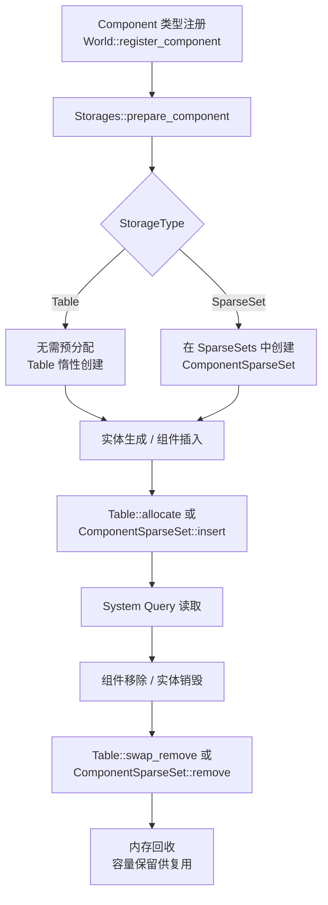
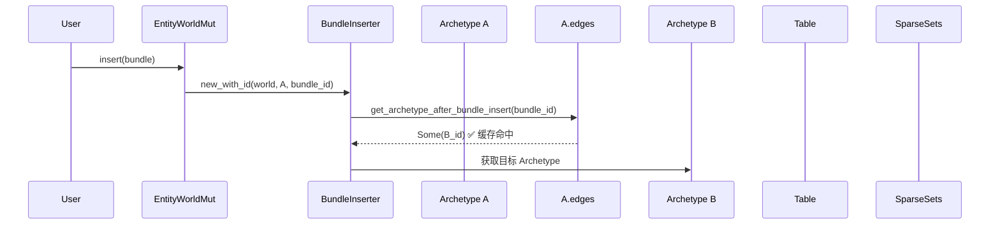
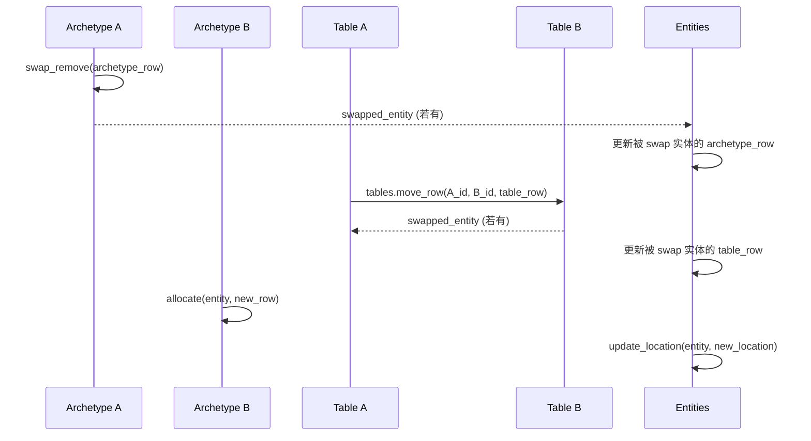
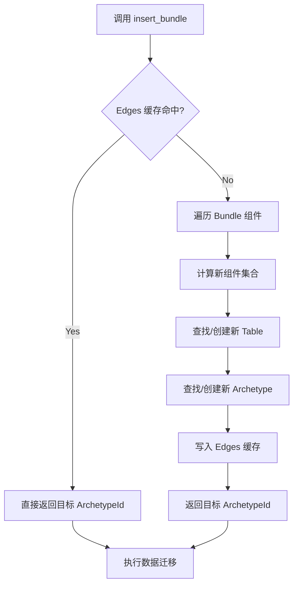

> [[Notes/Bevy/00-Bevy全解析主索引|← 返回 Bevy 全解析主索引]]

---

# Bevy `bevy_ecs` 源码解析：Component 存储与 Archetype

> **分析范围**：`bevy_ecs` crate 的存储子系统——`storage/` 模块与 `archetype.rs`。
> **分析轮次**：三轮完整分析（接口层 → 数据层 → 逻辑层）+ 关联辐射。
> **源码版本**：Bevy 0.19.0-dev（`main` 分支）。

---

## 零、这个模块解决什么问题？

在 ECS 中，**Entity** 只是一个 ID，**Component** 是纯数据，**System** 是处理逻辑的函数。那么这些数据到底存放在哪里？当实体的组件组合发生变化时，数据如何在内存中移动？

Bevy 的答案是：**Archetype + 双轨存储（Table / SparseSet）**。

- **Archetype** 是"组件组合的指纹"——具有完全相同组件集合的所有实体属于同一个 Archetype。
- **Table** 是列式连续存储（SoA），为批量迭代优化。
- **SparseSet** 是稀疏数组 + 密集数组的三元结构，为频繁插入/移除优化。
- **Edges** 是 Archetype 之间的图缓存，记录"从 A 插入 Bundle B 会到达哪个 Archetype"，避免重复计算组件组合。

这套设计的核心目标只有一个：**让 System 的 Query 迭代尽可能快地顺序访问内存，同时让组件的增删尽可能少地移动数据**。

---

## 一、模块定位与构建定义

### 1.1 Cargo.toml 概览

> 文件：`crates/bevy_ecs/Cargo.toml`

版本 `0.19.0-dev`，`edition = "2024"`。本模块无额外 feature 开关，存储策略通过 `Component` derive 宏的属性控制（`#[component(storage = "SparseSet")]`）。

### 1.2 目录结构与模块地图

> 文件：`crates/bevy_ecs/src/storage/mod.rs`、`crates/bevy_ecs/src/archetype.rs`、`crates/bevy_ecs/src/component/mod.rs`

| 模块 | 文件路径 | 职责 |
|------|---------|------|
| `storage/mod.rs` | `src/storage/mod.rs` | **Storages 聚合体**：Tables + SparseSets + NonSends |
| `storage/table/mod.rs` | `src/storage/table/mod.rs` | **Table / Tables / TableBuilder / TableId / TableRow** |
| `storage/table/column.rs` | `src/storage/table/column.rs` | **Column**：类型擦除的列存储 + Tick 数组 |
| `storage/blob_array.rs` | `src/storage/blob_array.rs` | **BlobArray**：类型擦除的原始内存块（`void*` 数组） |
| `storage/thin_array_ptr.rs` | `src/storage/thin_array_ptr.rs` | **ThinArrayPtr**：无长度/容量字段的紧凑数组指针 |
| `storage/sparse_set.rs` | `src/storage/sparse_set.rs` | **SparseSet / ComponentSparseSet / SparseArray** |
| `archetype.rs` | `src/archetype.rs` | **Archetype / Archetypes / Edges / ArchetypeRow** |
| `component/mod.rs` | `src/component/mod.rs` | **Component trait / StorageType / ComponentId** |

---

## 二、第一轮：接口层（What）

### 2.1 Storages —— 双轨存储的顶层聚合

> 文件：`crates/bevy_ecs/src/storage/mod.rs`，第 42~51 行

```rust
/// The raw data stores of a [`World`](crate::world::World)
#[derive(Default)]
pub struct Storages {
    /// Backing storage for [`SparseSet`] components.
    pub sparse_sets: SparseSets,
    /// Backing storage for [`Table`] components.
    pub tables: Tables,
    /// Backing storage for `!Send` data.
    pub non_sends: NonSends,
}
```

`Storages` 是 World 中所有组件数据的底层容器。它对外暴露三种存储类别：
- `tables`：`Table` 存储的集合，按 `TableId` 索引。
- `sparse_sets`：`ComponentSparseSet` 的集合，按 `ComponentId` 索引。
- `non_sends`：存放 `!Send` 类型组件的特殊存储（本文不深入）。

> **设计约束**：从 `World` 中**无法获取 `&mut Storages`**。这是有意为之的安全设计——避免通过公共 API 直接破坏存储内部的一致性。

### 2.2 Archetype —— 组件组合的指纹

> 文件：`crates/bevy_ecs/src/archetype.rs`，第 383~390 行

```rust
pub struct Archetype {
    id: ArchetypeId,                      // 本 Archetype 的唯一 ID
    table_id: TableId,                    // Table 存储位置（Table 组件存放处）
    edges: Edges,                         // 缓存 insert/remove/take 的目标 Archetype
    entities: Vec<ArchetypeEntity>,       // 属于该 Archetype 的所有实体
    components: ImmutableSparseSet<ComponentId, ArchetypeComponentInfo>,
    pub(crate) flags: ArchetypeFlags,     // 钩子/观察者的存在标记（用于快速跳过）
}
```

Archetype 不直接存储组件数据，它只存储**元数据**：
- `entities` 数组记录 `(Entity, TableRow)`——每个实体在 Table 中的行号。
- `components` 记录本 Archetype 包含哪些组件，以及每个组件的 `StorageType`（Table 还是 SparseSet）。
- `table_id` 指向一个 `Table`，该 Table 存放所有 Table 类型的组件数据。

> **关键区分**：多个 Archetype 可以共享同一个 `Table`。这发生在它们具有完全相同的 Table 组件集合，但 SparseSet 组件不同的情况下。

### 2.3 Table —— 列式连续存储

> 文件：`crates/bevy_ecs/src/storage/table/mod.rs`，第 202~205 行

```rust
pub struct Table {
    columns: ImmutableSparseSet<ComponentId, Column>,  // SoA 列存储：ComponentId → Column
    entities: Vec<Entity>,                              // 每行对应的实体 ID
}
```

`Table` 是**列式存储（Structure of Arrays）**。概念上等同于 `HashMap<ComponentId, Column>`，其中每个 `Column` 是一个类型擦除的 `Vec<T: Component>`。

同一行的不同列属于同一个 Entity。例如，Table 行号 3 的 `Column A[3]` 和 `Column B[3]` 是同一个实体的两个组件。

### 2.4 Column —— 单列的内存布局

> 文件：`crates/bevy_ecs/src/storage/table/column.rs`，第 25~30 行

```rust
pub struct Column {
    pub(super) data: BlobArray,                                    // 组件数据的原始字节
    pub(super) added_ticks: ThinArrayPtr<UnsafeCell<Tick>>,        // 添加时的全局 Tick
    pub(super) changed_ticks: ThinArrayPtr<UnsafeCell<Tick>>,      // 最后修改时的全局 Tick
    pub(super) changed_by: MaybeLocation<ThinArrayPtr<UnsafeCell<&'static Location<'static>>>>,
}
```

`Column` 是类型擦除的连续数组。它不自己维护长度和容量——这些信息由外部（`Table` 或 `ComponentSparseSet`）统一管理。

每行组件附带两个 `Tick`：
- `added_ticks`：组件被插入时的全局 `change_tick`。
- `changed_ticks`：组件最后被修改时的全局 `change_tick`。

这是 Bevy **Change Detection** 的基础设施。

### 2.5 ComponentSparseSet —— 稀疏密集三元组

> 文件：`crates/bevy_ecs/src/storage/sparse_set.rs`，第 157~168 行

```rust
pub struct ComponentSparseSet {
    /// Capacity and length match those of `entities`.
    dense: Column,                        // 紧凑的组件数据（按 dense index 连续存储）
    #[cfg(not(debug_assertions))]
    entities: Vec<EntityIndex>,           // dense[i] 对应的 entity index
    #[cfg(debug_assertions)]
    entities: Vec<Entity>,                // debug 模式下存完整 Entity 以验证 generation
    sparse: SparseArray<EntityIndex, TableRow>,  // entity index → dense index
}
```

`ComponentSparseSet` 采用经典的三元稀疏集结构：
- **`sparse`**：`Vec<Option<V>>`，以 `EntityIndex` 为键，值是对应的 dense index。
- **`dense`**：`Column`，按 dense index 紧凑存储实际组件数据。
- **`entities`**：记录每个 dense 槽位对应的实体，用于反向查找。

查找流程：`entity.index()` → `sparse[ index ]` → `dense[ dense_index ]`。

### 2.6 StorageType —— 存储策略选择

> 文件：`crates/bevy_ecs/src/component/mod.rs`，第 728~735 行

```rust
pub enum StorageType {
    /// 默认。为批量迭代优化，缓存友好。
    #[default]
    Table,
    /// 为频繁插入/移除优化，随机访问友好。
    SparseSet,
}
```

开发者通过 derive 属性选择：
```rust
#[derive(Component)]
#[component(storage = "SparseSet")]
struct MyRareComponent;
```

### 2.7 Edges —— Archetype 图缓存

> 文件：`crates/bevy_ecs/src/archetype.rs`，第 205~210 行

```rust
#[derive(Default)]
pub struct Edges {
    insert_bundle: SparseArray<BundleId, ArchetypeAfterBundleInsert>,
    remove_bundle: SparseArray<BundleId, Option<ArchetypeId>>,
    take_bundle: SparseArray<BundleId, Option<ArchetypeId>>,
}
```

`Edges` 是 Archetype 级别的**图缓存**。当向 Archetype A 中的实体插入 Bundle B 时，World 需要找到目标 Archetype C。`edges.insert_bundle[B]` 缓存了 `BundleId → 目标 Archetype` 的映射。

这是从"每次计算组件组合"到 O(1) 缓存查找的关键优化。

---

## 三、第二轮：数据层（How - Structure）

### 3.1 Archetype 的内存布局与索引结构

Archetype 本身是一个轻量元数据结构，但 World 维护了两张全局索引：

```
Archetypes (World 全局)
├── archetypes: Vec<Archetype>                     // 按 ArchetypeId 索引
├── by_components: HashMap<ArchetypeComponents, ArchetypeId>  // 组件组合 → ID
└── by_component: ComponentIndex                    // ComponentId → {ArchetypeId → ArchetypeRecord}

ComponentIndex = HashMap<ComponentId, HashMap<ArchetypeId, ArchetypeRecord>>
ArchetypeRecord { column: Option<usize> }  // Some(idx) 表示 Table 列索引，None 表示 SparseSet
```

**为什么需要 `by_components`？**

当创建新实体或插入组件时，World 需要知道"这种组件组合是否已存在"。`by_components` 以排序后的 `ComponentId` 数组为键，快速查找或创建 Archetype。

**为什么需要 `by_component`？**

Query 的 `QueryState` 初始化时需要回答："哪些 Archetype 包含组件 T？"`by_component` 提供了从组件到 Archetype 的反向索引。

> 文件：`crates/bevy_ecs/src/archetype.rs`，第 757~790 行

```rust
#[derive(Hash, PartialEq, Eq)]
struct ArchetypeComponents {
    table_components: Box<[ComponentId]>,
    sparse_set_components: Box<[ComponentId]>,
}

pub type ComponentIndex = HashMap<ComponentId, HashMap<ArchetypeId, ArchetypeRecord>>;

pub struct ArchetypeRecord {
    pub(crate) column: Option<usize>,  // Table 中的列索引，None 表示 SparseSet 组件
}
```

### 3.2 Table 的 SoA 列存储布局

```
Table (for Archetype with components [A, B, C])
├── entities: Vec<Entity> = [e0, e1, e2, e3, ...]        // 行号 → 实体
└── columns: ImmutableSparseSet<ComponentId, Column>
    ├── Column for A
    │   ├── data: BlobArray      = [A0, A1, A2, A3, ...]  // 类型擦除的原始数据
    │   ├── added_ticks          = [t0, t1, t2, t3, ...]
    │   ├── changed_ticks        = [t0, t1, t2, t3, ...]
    │   └── changed_by           = [loc0, loc1, ...]
    ├── Column for B
    │   └── ...
    └── Column for C
        └── ...
```

**行号语义**：`TableRow(i)` 表示第 `i` 行的数据。`entities[i]` 是该行的实体，`Column.data[i]` 是该实体对应组件的值。

Table 的容量由 `entities.capacity()` 驱动。所有 Column 的容量必须与 `entities.capacity()` 保持同步。

### 3.3 Column 的底层：BlobArray + ThinArrayPtr

`Column` 不直接使用 `Vec<T>`，而是拆分为更底层的结构：

#### BlobArray —— 类型擦除的数据块

> 文件：`crates/bevy_ecs/src/storage/blob_array.rs`，第 16~28 行

```rust
pub(super) struct BlobArray {
    item_layout: Layout,                              // 元素布局（size + align）
    data: NonNull<u8>,                                // 原始内存指针
    pub drop: Option<unsafe fn(OwningPtr<'_>)>,       // 析构函数（None 表示无需 drop）
    #[cfg(debug_assertions)]
    capacity: usize,
}
```

`BlobArray` 类似于 C 的 `void*` 数组。它存储同质数据的原始字节，通过 `item_layout.size()` 计算偏移量来索引元素。

> **安全前提**：`item_layout.size()` 必须是 `item_layout.align()` 的整数倍。Rust 类型的 `Layout` 天然满足此条件。

#### ThinArrayPtr —— 剥离长度/容量的数组指针

> 文件：`crates/bevy_ecs/src/storage/thin_array_ptr.rs`，第 17~21 行

```rust
pub struct ThinArrayPtr<T> {
    data: NonNull<T>,
    #[cfg(debug_assertions)]
    capacity: usize,
}
```

`ThinArrayPtr` 是一个不存储 `len` 和 `capacity` 的瘦指针数组。长度和容量由外部（`Table` 或 `ComponentSparseSet`）统一管理。这减少了内存占用，同时允许统一的内存分配/重分配策略。

### 3.4 ComponentSparseSet 的三元结构详解

```
ComponentSparseSet (for component type X)
├── dense: Column                // 紧凑数组，存储实际的组件数据
│   └── data[i] = 实体 e 的组件 X 的值
├── entities: Vec<EntityIndex>   // entities[i] = dense[i] 对应的实体 index
└── sparse: SparseArray<EntityIndex, TableRow>
    └── sparse[entity_index] = Some(TableRow(dense_index))
```

**示例**：假设世界有 1000 个实体，但只有 3 个实体拥有组件 `X`：
- `sparse` 数组长度约为 1000（按最大 entity index），其中只有 3 个位置是 `Some(...)`。
- `dense` 数组长度只有 3，连续存放 3 个组件值。
- `entities` 数组长度也是 3，记录这 3 个组件分别属于哪个实体。

**查找流程**：
1. `sparse.get(entity.index())` → 得到 `Some(TableRow(dense_index))` 或 `None`。
2. 若为 `Some`，`dense.get_data_unchecked(TableRow)` → 得到组件指针。

### 3.5 StorageType 的选择策略与内存影响

| 维度 | Table | SparseSet |
|------|-------|-----------|
| **内存布局** | 连续数组，每行一个实体 | 稀疏数组 + 紧凑数据 |
| **迭代性能** | 极佳（顺序访问，缓存命中率高） | 一般（需要间接跳转） |
| **插入/移除** | 需要 `swap_remove`，破坏行顺序 | O(1)，仅更新 sparse/dense |
| **随机访问** | 通过 `TableRow` 直接索引 | 通过 `sparse` 数组两次索引 |
| **适用场景** | 大多数组件（Transform, Mesh 等） | 稀有组件、频繁变更的标记组件 |

### 3.6 组件生命周期状态流转



---

## 四、第三轮：逻辑层（How - Behavior）

### 4.1 实体在 Archetype 间迁移：insert_bundle 的完整流程

当一个已有组件的实体被插入新 Bundle 时，它必须**迁移到新的 Archetype**。这是 ECS 中最频繁的结构变更操作。

#### 4.1.1 Edges 缓存命中路径



> 文件：`crates/bevy_ecs/src/archetype.rs`，第 218~222 行

```rust
#[inline]
pub fn get_archetype_after_bundle_insert(&self, bundle_id: BundleId) -> Option<ArchetypeId> {
    self.get_archetype_after_bundle_insert_internal(bundle_id)
        .map(|bundle| bundle.archetype_id)
}
```

#### 4.1.2 Edges 缓存未命中：计算新 Archetype

> 文件：`crates/bevy_ecs/src/bundle/insert.rs`，第 506~631 行

```rust
pub(crate) unsafe fn insert_bundle_into_archetype(
    &self,
    archetypes: &mut Archetypes,
    storages: &mut Storages,
    components: &Components,
    observers: &Observers,
    archetype_id: ArchetypeId,
) -> (ArchetypeId, bool) {
    // 1. 先查缓存
    if let Some(archetype_after_insert_id) = archetypes[archetype_id]
        .edges()
        .get_archetype_after_bundle_insert(self.id)
    {
        return (archetype_after_insert_id, false);
    }

    // 2. 缓存未命中：遍历 Bundle 的每个组件
    let mut new_table_components = Vec::new();
    let mut new_sparse_set_components = Vec::new();
    // ... 区分 Added / Existing 组件 ...

    // 3. 如果不需要新组件，缓存"自身"并返回
    if new_table_components.is_empty() && new_sparse_set_components.is_empty() {
        edges.cache_archetype_after_bundle_insert(
            self.id, archetype_id, /* ... */
        );
        (archetype_id, false)
    } else {
        // 4. 合并现有组件 + 新组件，排序后查找/创建 Table
        let table_id = unsafe {
            storages.tables.get_id_or_insert(&new_table_components, components)
        };
        // 5. 查找或创建新 Archetype
        let (new_archetype_id, is_new_created) = unsafe {
            archetypes.get_id_or_insert(
                components, observers, table_id,
                table_components, sparse_set_components,
            )
        };
        // 6. 写入缓存
        archetypes[archetype_id].edges_mut().cache_archetype_after_bundle_insert(
            self.id, new_archetype_id, /* ... */
        );
        (new_archetype_id, is_new_created)
    }
}
```

**关键逻辑**：
1. 遍历 Bundle 的显式组件和 Required 组件。
2. 对每个组件，检查当前 Archetype 是否已包含：
   - 若已包含 → `ComponentStatus::Existing`。
   - 若未包含 → `ComponentStatus::Added`，并按其 `StorageType` 归入 `new_table_components` 或 `new_sparse_set_components`。
3. 若没有任何新组件，目标 Archetype 就是自身。
4. 否则，合并当前 Archetype 的组件集合 + 新组件，排序后：
   - 通过 `Tables::get_id_or_insert` 查找或创建目标 `Table`。
   - 通过 `Archetypes::get_id_or_insert` 查找或创建目标 `Archetype`。
5. 将结果缓存到 `Edges`。

#### 4.1.3 数据迁移的三种情况

> 文件：`crates/bevy_ecs/src/bundle/insert.rs`，第 89~101 行、第 184~329 行

```rust
let archetype_move_type = if let Some(new_archetype) = new_archetype {
    if archetype.table_id() == new_archetype.table_id() {
        ArchetypeMoveType::NewArchetypeSameTable { /* ... */ }
    } else {
        ArchetypeMoveType::NewArchetypeNewTable { /* ... */ }
    }
} else {
    ArchetypeMoveType::SameArchetype
};
```

| 情况 | 条件 | 数据移动范围 |
|------|------|-------------|
| **SameArchetype** | Bundle 中所有组件已存在 | 仅替换现有组件值，不移动实体 |
| **NewArchetypeSameTable** | 新增 SparseSet 组件，Table 组件不变 | Archetype 变更，但 Table 行号不变 |
| **NewArchetypeNewTable** | 新增 Table 组件 | Archetype + Table 均变更，数据跨 Table 复制 |

**NewArchetypeNewTable 的详细流程**：



> 文件：`crates/bevy_ecs/src/storage/table/mod.rs`，第 750~823 行

```rust
pub(crate) unsafe fn move_row<const DROP: bool>(
    &mut self,
    old_table_id: TableId,
    new_table_id: TableId,
    row: TableRow,
) -> TableMoveResult<'_> {
    // 1. 同时获取源 Table 和目标 Table 的可变引用
    let [src_table, dst_table] = unsafe {
        self.tables.get_disjoint_unchecked_mut(
            [old_table_id.as_usize(), new_table_id.as_usize()]
        )
    };

    let last_index = (src_table.entity_count() - 1) as usize;

    // 2. 在目标 Table 分配新行（复用被移除实体的 ID）
    let dst_row = unsafe {
        dst_table.allocate(src_table.entities.swap_remove(row.index()))
    };

    let mut dst_iter = dst_table.columns.iter_mut().peekable();

    // 3. 双指针合并：遍历源 Table 的列，按 ComponentId 顺序匹配目标列
    for (src_component_id, src_column) in src_table.columns.iter_mut() {
        // 跳过目标 Table 中有、但源 Table 中没有的列（由调用者初始化）
        while dst_iter.next_if(|(id, _)| *id < src_component_id).is_some() {}

        if let Some((_, dst_column)) =
            dst_iter.next_if(|(id, _)| *id == src_component_id)
        {
            // 3a. 两表都有该列：将数据从源列 move 到目标列
            unsafe {
                dst_column.initialize_from_unchecked(
                    src_column, last_index, row, dst_row
                );
            }
        } else {
            // 3b. 目标表没有该列：从源列 swap_remove 并 drop（或 forget）
            unsafe {
                src_column.swap_remove_unchecked::<DROP>(last_index, row);
            }
        }
    }

    TableMoveResult {
        new_table: dst_table,
        new_row: dst_row,
        swapped_entity: /* 若源表 swap_remove 了非末尾元素，返回被 swap 的实体 */
    }
}
```

**`move_row` 的设计亮点**：
- 使用 **双指针合并**（类似归并排序的合并步骤）来匹配两表的列。由于列按 `ComponentId` 排序，这一步是 O(n) 的。
- `DROP` 泛型参数决定：被移除的组件是立即 `drop`（`true`）还是将所有权交给调用者（`false`）。
- 所有操作基于 `swap_remove`，保证 O(1) 复杂度。

### 4.2 Table 的 allocate / swap_remove 详解

#### allocate —— 分配新行

> 文件：`crates/bevy_ecs/src/storage/table/mod.rs`，第 492~514 行

```rust
pub(crate) unsafe fn allocate(&mut self, entity: Entity) -> TableRow {
    self.reserve(1);  // 按需扩容
    let len = self.entity_count();
    // 新行的行号 = 当前长度（追加在末尾）
    let row = unsafe { TableRow::new(NonMaxU32::new_unchecked(len)) };
    let len = len as usize;
    self.entities.push(entity);
    for col in self.columns.values_mut() {
        // 初始化 added_ticks / changed_ticks 为 0
        col.added_ticks.initialize_unchecked(len, UnsafeCell::new(Tick::new(0)));
        col.changed_ticks.initialize_unchecked(len, UnsafeCell::new(Tick::new(0)));
        // 初始化 changed_by（若启用）
        col.changed_by.as_mut().zip(MaybeLocation::caller()).map(|(changed_by, caller)| {
            changed_by.initialize_unchecked(len, UnsafeCell::new(caller));
        });
    }
    row
}
```

`allocate` 不初始化组件数据本身——调用者必须在返回后立即写入有效值。Ticks 被初始化为 0，表示"尚未设置"。

#### swap_remove_unchecked —— 移除行

> 文件：`crates/bevy_ecs/src/storage/table/mod.rs`，第 226~260 行

```rust
pub(crate) unsafe fn swap_remove_unchecked(&mut self, row: TableRow) -> Option<Entity> {
    let last_element_index = self.entity_count() - 1;
    if row.index_u32() != last_element_index {
        // 非末尾：所有列执行 swap_remove（将末尾元素移到被移除位置）
        for col in self.columns.values_mut() {
            unsafe {
                col.swap_remove_and_drop_unchecked_nonoverlapping(
                    last_element_index as usize, row,
                );
            };
        }
    } else {
        // 末尾：只需 drop 最后一行的组件
        for col in self.columns.values_mut() {
            col.drop_last_component(last_element_index as usize);
        }
    }
    let is_last = row.index_u32() == last_element_index;
    self.entities.swap_remove(row.index());
    if is_last { None } else { Some(self.entities[row.index()]) }
}
```

**为什么用 `swap_remove` 而不是 `remove`？**

因为 ECS 中实体没有内在的顺序要求。`swap_remove` 是 O(1) 的，而 `remove` 是 O(n) 的（需要移动后续所有元素）。唯一的代价是：被 swap 到 `row` 位置的实体需要更新其在 `Entities` 元数据中的 `TableRow`。

### 4.3 Column 的内存操作细节

#### initialize_from_unchecked —— 跨 Column 移动数据

> 文件：`crates/bevy_ecs/src/storage/table/column.rs`，第 222~254 行

```rust
pub(crate) unsafe fn initialize_from_unchecked(
    &mut self,
    other: &mut Column,
    other_last_element_index: usize,
    src_row: TableRow,
    dst_row: TableRow,
) {
    debug_assert!(self.data.layout() == other.data.layout());
    // 1. 从 other 的 src_row swap_remove 出数据
    let src_val = other.data.swap_remove_unchecked(src_row.index(), other_last_element_index);
    // 2. 写入 self 的 dst_row（未初始化位置）
    self.data.initialize_unchecked(dst_row.index(), src_val);

    // 3. 同样处理 added_ticks
    let added_tick = other.added_ticks.swap_remove_unchecked(src_row.index(), other_last_element_index);
    self.added_ticks.initialize_unchecked(dst_row.index(), added_tick);

    // 4. 同样处理 changed_ticks
    let changed_tick = other.changed_ticks.swap_remove_unchecked(src_row.index(), other_last_element_index);
    self.changed_ticks.initialize_unchecked(dst_row.index(), changed_tick);

    // 5. 同样处理 changed_by（若启用）
    // ...
}
```

这个方法在 `Tables::move_row` 中被调用，实现跨 Table 的组件数据迁移。注意：`swap_remove_unchecked` 返回的是 `OwningPtr`（拥有所有权的指针），而 `initialize_unchecked` 接收 `OwningPtr` 并将其复制到目标位置——这意味着源位置的数据被**移出**后，由末尾元素填补。

### 4.4 SparseSet 的插入/移除/查找

#### insert —— 插入或替换

> 文件：`crates/bevy_ecs/src/storage/sparse_set.rs`，第 212~255 行

```rust
pub(crate) unsafe fn insert(
    &mut self,
    entity: Entity,
    value: OwningPtr<'_>,
    change_tick: Tick,
    caller: MaybeLocation,
) {
    if let Some(&dense_index) = self.sparse.get(entity.index()) {
        // ✅ 已存在：替换 dense 中的值
        #[cfg(debug_assertions)]
        assert_eq!(entity, self.entities[dense_index.index()]);
        self.dense.replace(dense_index, value, change_tick, caller);
    } else {
        // ❌ 不存在：追加到 dense 末尾
        let dense_index = self.entities.len();
        self.entities.push(entity.index());

        // 分配保护：若扩容失败则 abort
        let _guard = AbortOnPanic;
        if capacity != self.entities.capacity() {
            // 需要扩容 Column
            let new_capacity = unsafe { NonZero::new_unchecked(self.entities.capacity()) };
            if let Some(capacity) = NonZero::new(capacity) {
                unsafe { self.dense.realloc(capacity, new_capacity) };
            } else {
                self.dense.alloc(new_capacity);
            }
        }

        let table_row = unsafe { TableRow::new(NonMaxU32::new_unchecked(dense_index as u32)) };
        self.dense.initialize(table_row, value, change_tick, caller);
        self.sparse.insert(entity.index(), table_row);
        core::mem::forget(_guard);
    }
}
```

#### remove —— 移除并 drop

> 文件：`crates/bevy_ecs/src/storage/sparse_set.rs`，第 421~465 行

```rust
pub(crate) fn remove(&mut self, entity: Entity) -> bool {
    self.sparse.remove(entity.index()).map(|dense_index| {
        let last = self.entities.len() - 1;
        if dense_index.index() >= last {
            // 移除的是末尾元素：直接缩短长度并 drop
            unsafe { self.entities.set_len(last) };
            unsafe { self.dense.drop_last_component(last) };
        } else {
            // 移除的是中间元素：swap_remove
            unsafe {
                self.entities.swap_remove_nonoverlapping_unchecked(dense_index.index());
            };
            let swapped_entity = unsafe { self.entities.get_unchecked(dense_index.index()) };
            // 更新被 swap 的实体在 sparse 中的索引
            unsafe {
                *self.sparse.get_mut(swapped_entity.index()).debug_checked_unwrap() = dense_index;
            }
            unsafe {
                self.dense.swap_remove_and_drop_unchecked_nonoverlapping(last, dense_index);
            }
        }
    }).is_some()
}
```

SparseSet 的 `remove` 与 Table 的 `swap_remove` 遵循相同的哲学：**用顺序换取速度**。被移除的槽位由末尾元素填补，然后更新 `sparse` 数组中对应实体的 dense index。

### 4.5 Edges 缓存的完整工作流程



**缓存的粒度**：以 `BundleId` 为键，而非单个 `ComponentId`。这是因为用户层面的操作单位是 Bundle（`commands.insert((A, B))`），以 Bundle 为单位缓存能最大程度减少缓存条目数量。

**三种缓存类型**：
- `insert_bundle`：`A + Bundle → C`（添加组件，忽略已存在的）。
- `remove_bundle`：`A - Bundle → C`（移除 Bundle 中存在的组件，忽略不存在的）。
- `take_bundle`：`A - Bundle → C`（要求 Bundle 中所有组件都必须存在，否则失败）。

---

## 五、关联辐射（Context）

### 5.1 与上层模块的关系

| 上层模块 | 交互方式 | 说明 |
|---------|---------|------|
| `bundle` | `BundleInfo::insert_bundle_into_archetype` / `remove_bundle_from_archetype` | Bundle 的增删是触发 Archetype 迁移的唯一入口。 |
| `world` | `World::storages` / `World::archetypes` | World 持有 `Storages` 和 `Archetypes`，但公开的是只读引用。 |
| `query` | `QueryState` 遍历 `Archetypes` | Query 初始化时通过 `by_component` 索引找到匹配的 Archetype，再访问其 Table/SparseSet。 |
| `entity` | `Entities` 更新 `EntityLocation` | 每次 Archetype/Table 变更后，必须同步更新 `Entities.meta` 中的位置信息。 |

### 5.2 与下层模块的关系

| 下层模块 | 交互方式 | 说明 |
|---------|---------|------|
| `bevy_ptr` | `Ptr` / `OwningPtr` / `PtrMut` | 存储层大量使用类型擦除指针，避免泛型膨胀。 |
| `bevy_platform` | `HashMap` / `FixedBitSet` | `Archetypes::by_components` 使用平台无关的 HashMap。 |

### 5.3 跨引擎对照

| 维度 | Bevy (bevy_ecs) | chaos | Unreal Engine |
|------|-----------------|-------|---------------|
| **存储模型** | Archetype + Table/SparseSet | 组件池 + 稀疏集 | UObject 属性表（UProperty） |
| **组件组合** | Archetype（每种组合唯一） | 动态组合 | 类继承树 |
| **列存储** | Table（SoA） | 类似 SoA | 对象内联属性 |
| **稀疏组件** | SparseSet（全局按 ComponentId） | 稀疏集（按 Archetype 或全局） | 不适用 |
| **实体迁移** | Archetype 图缓存（Edges） | 手动池管理 | 无（对象是静态类型） |
| **数据移动** | `swap_remove`（O(1)） | 类似 swap_remove | 无需移动 |
| **Change Detection** | Tick 数组附加在 Column 上 | 脏标记位图 | Property 通知回调 |

### 5.4 设计亮点总结

1. **Archetype 与 Table 分离**：多个 Archetype 可共享同一个 Table（只要 Table 组件相同）。这减少了 Table 的数量，降低了内存碎片。
2. **Edges 图缓存**：以 Bundle 为粒度的缓存策略，完美匹配用户 API 的调用模式，避免了以 Component 为粒度导致的缓存爆炸。
3. **Column 的 Tick 旁路数组**：Change Detection 不依赖外部数据结构，而是将 `added_ticks` / `changed_ticks` 直接存放在 Column 旁边，保证了缓存局部性。
4. **BlobArray + ThinArrayPtr 的组合**：将"类型擦除数据"和"元数据数组"拆分为最底层原语，使得 Column 和 ComponentSparseSet 可以复用同一套内存管理代码。
5. **move_row 的双指针合并**：跨 Table 迁移时，按 `ComponentId` 排序的列使得数据迁移可以用类似归并的 O(n) 双指针完成，而非 O(n²) 的嵌套查找。
6. **`AbortOnPanic` 守护**：在扩容/重分配的关键路径上，如果分配失败触发 panic，程序会直接 abort 而非 unwinding——避免了存储处于不一致状态导致的 UB。

---

## 六、关键源码片段

### 6.1 Archetype 核心结构

> 文件：`crates/bevy_ecs/src/archetype.rs`，第 383~390 行

```rust
pub struct Archetype {
    id: ArchetypeId,
    table_id: TableId,
    edges: Edges,
    entities: Vec<ArchetypeEntity>,
    components: ImmutableSparseSet<ComponentId, ArchetypeComponentInfo>,
    pub(crate) flags: ArchetypeFlags,
}
```

### 6.2 Storages 双轨聚合

> 文件：`crates/bevy_ecs/src/storage/mod.rs`，第 42~51 行

```rust
#[derive(Default)]
pub struct Storages {
    pub sparse_sets: SparseSets,
    pub tables: Tables,
    pub non_sends: NonSends,
}
```

### 6.3 Table 的 SoA 定义

> 文件：`crates/bevy_ecs/src/storage/table/mod.rs`，第 202~205 行

```rust
pub struct Table {
    columns: ImmutableSparseSet<ComponentId, Column>,
    entities: Vec<Entity>,
}
```

### 6.4 Column 的四元布局

> 文件：`crates/bevy_ecs/src/storage/table/column.rs`，第 25~30 行

```rust
pub struct Column {
    pub(super) data: BlobArray,
    pub(super) added_ticks: ThinArrayPtr<UnsafeCell<Tick>>,
    pub(super) changed_ticks: ThinArrayPtr<UnsafeCell<Tick>>,
    pub(super) changed_by: MaybeLocation<ThinArrayPtr<UnsafeCell<&'static Location<'static>>>>,
}
```

### 6.5 ComponentSparseSet 三元结构

> 文件：`crates/bevy_ecs/src/storage/sparse_set.rs`，第 157~168 行

```rust
pub struct ComponentSparseSet {
    dense: Column,
    #[cfg(not(debug_assertions))]
    entities: Vec<EntityIndex>,
    #[cfg(debug_assertions)]
    entities: Vec<Entity>,
    sparse: SparseArray<EntityIndex, TableRow>,
}
```

### 6.6 Edges 图缓存

> 文件：`crates/bevy_ecs/src/archetype.rs`，第 205~210 行

```rust
#[derive(Default)]
pub struct Edges {
    insert_bundle: SparseArray<BundleId, ArchetypeAfterBundleInsert>,
    remove_bundle: SparseArray<BundleId, Option<ArchetypeId>>,
    take_bundle: SparseArray<BundleId, Option<ArchetypeId>>,
}
```

### 6.7 StorageType 枚举

> 文件：`crates/bevy_ecs/src/component/mod.rs`，第 728~735 行

```rust
pub enum StorageType {
    #[default]
    Table,
    SparseSet,
}
```

### 6.8 Tables::move_row 跨表迁移

> 文件：`crates/bevy_ecs/src/storage/table/mod.rs`，第 750~823 行

```rust
pub(crate) unsafe fn move_row<const DROP: bool>(
    &mut self,
    old_table_id: TableId,
    new_table_id: TableId,
    row: TableRow,
) -> TableMoveResult<'_> {
    let [src_table, dst_table] = unsafe {
        self.tables.get_disjoint_unchecked_mut(
            [old_table_id.as_usize(), new_table_id.as_usize()]
        )
    };
    let last_index = (src_table.entity_count() - 1) as usize;
    let dst_row = unsafe {
        dst_table.allocate(src_table.entities.swap_remove(row.index()))
    };
    let mut dst_iter = dst_table.columns.iter_mut().peekable();
    for (src_component_id, src_column) in src_table.columns.iter_mut() {
        while dst_iter.next_if(|(id, _)| *id < src_component_id).is_some() {}
        if let Some((_, dst_column)) =
            dst_iter.next_if(|(id, _)| *id == src_component_id)
        {
            unsafe {
                dst_column.initialize_from_unchecked(
                    src_column, last_index, row, dst_row
                );
            }
        } else {
            unsafe { src_column.swap_remove_unchecked::<DROP>(last_index, row); }
        }
    }
    // ...
}
```

---

## 七、关联阅读

- [[Bevy-bevy_ecs-源码解析：World 与 Entity 生命周期]]（已完成）— World 全局聚合、Entity 分配器、生命周期状态机。
- [[Bevy-bevy_ecs-源码解析：Query 与 SystemParam]]（计划）— QueryState 如何遍历 Archetype/Table、WorldQuery trait 的 unsafe 实现。
- [[Bevy-bevy_ecs-源码解析：Schedule 与 System 并行调度]]（计划）— ScheduleGraph 构建、多线程执行器。
- [[Bevy-bevy_ecs-源码解析：Event 与 Commands 延迟执行]]（计划）— CommandQueue 的内存布局、Event 的 RingBuffer。
- [[Bevy-bevy_ecs-源码解析：Change Detection 与脏标记]]（计划）— ComponentTicks 的逐组件更新、Tick 溢出处理。
- [[Bevy-专题：ECS 内存布局与 Archetype 演进]]（计划）— 从 chaos/UE 的组件模型对照 Bevy 的 Archetype 设计。

---

## 八、索引状态

- **所属阶段**：第一阶段 — 构建系统与 ECS 核心（1.2 ECS 核心）
- **对应索引条目**：`[[Bevy-bevy_ecs-源码解析：Component 存储与 Archetype]]`
- **分析轮次**：三轮全做（接口层 ✅ → 数据层 ✅ → 逻辑层 ✅ → 关联辐射 ✅）
- **覆盖范围**：
  - ✅ `storage/mod.rs` — Storages 聚合体、prepare_component。
  - ✅ `storage/table/mod.rs` — Table / Tables / TableBuilder / allocate / swap_remove / move_row。
  - ✅ `storage/table/column.rs` — Column / BlobArray + ThinArrayPtr 的四元布局 / initialize_from_unchecked。
  - ✅ `storage/blob_array.rs` — BlobArray 的类型擦除内存管理。
  - ✅ `storage/thin_array_ptr.rs` — ThinArrayPtr 的瘦指针数组。
  - ✅ `storage/sparse_set.rs` — SparseSet / ComponentSparseSet / SparseArray 的三元结构。
  - ✅ `archetype.rs` — Archetype / Archetypes / Edges / ArchetypeRow / ComponentIndex。
  - ✅ `component/mod.rs` — Component trait / StorageType。
  - ✅ `bundle/insert.rs` — BundleInserter / insert_bundle_into_archetype 的缓存与迁移逻辑。
  - ✅ `bundle/remove.rs` — BundleRemover / remove_bundle_from_archetype 的缓存与迁移逻辑。

---

> [[Notes/Bevy/00-Bevy全解析主索引|← 返回 Bevy 全解析主索引]]
