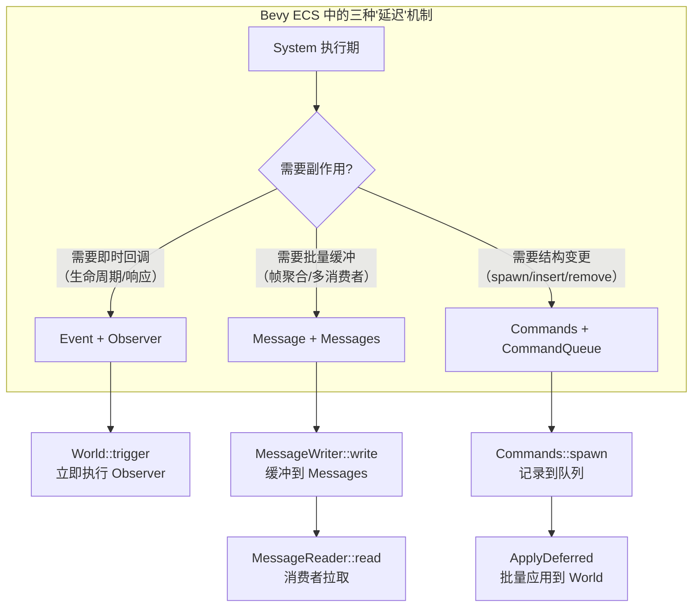
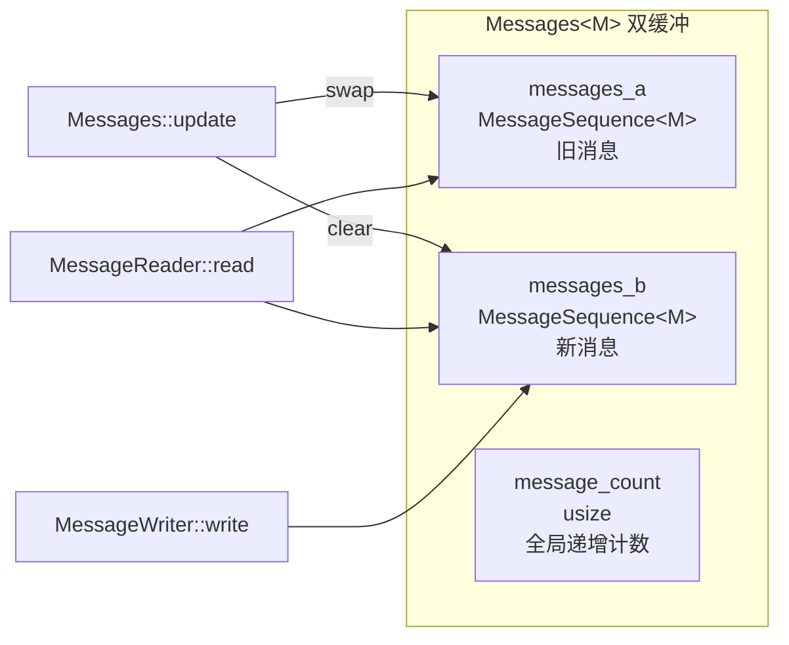
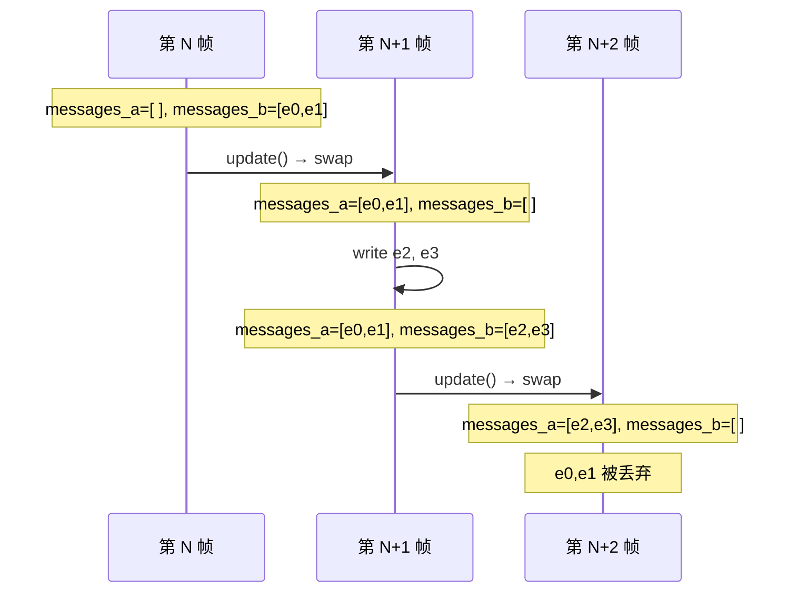
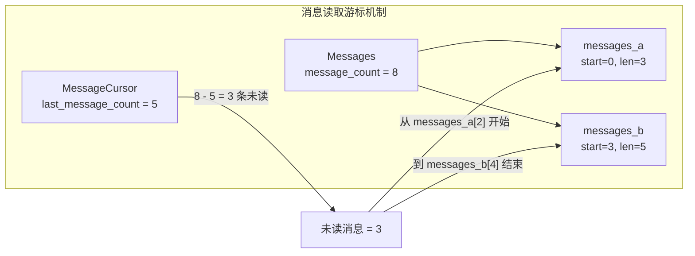
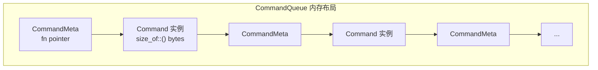
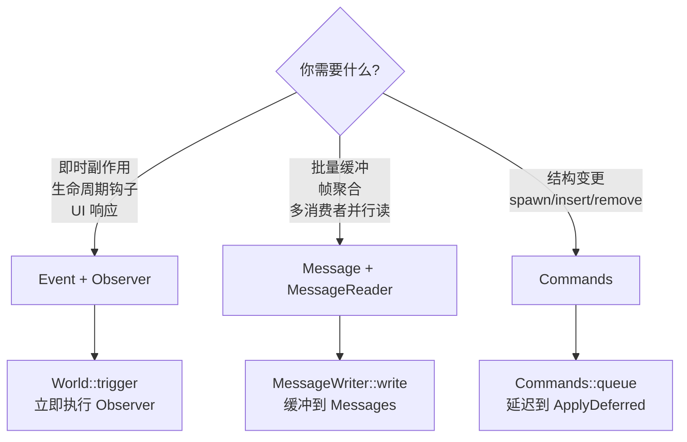

> [[Notes/Bevy/00-Bevy全解析主索引|← 返回 Bevy 全解析主索引]]

---

# Bevy `bevy_ecs` 源码解析：Event 与 Commands 延迟执行

> **分析范围**：`bevy_ecs` crate 中的事件机制（Event / Message）与延迟命令系统（Commands / CommandQueue）。
> **分析轮次**：三轮完整分析（接口层 → 数据层 → 逻辑层 → 关联辐射）。
> **源码版本**：Bevy 0.19.0-dev（`main` 分支）。

---

## 零、前言

如果你之前接触过 Bevy 的旧版本（0.14 及以前），可能会熟悉 `Events<T>`、`EventWriter<T>`、`EventReader<T>` 这套"事件"API。但在 Bevy 的最新主线版本中，**事件机制被拆分为两套独立的系统**：

1. **`Event` + `Trigger` + `Observer`** —— **即时触发**的观察者模式。事件被触发后立即执行关联的 Observer，不存在缓冲队列。这是 Bevy 新引入的"钩子回调"风格事件系统，位于 `crates/bevy_ecs/src/event/`。
2. **`Message` + `Messages<M>` + `MessageWriter<M>` + `MessageReader<M>`** —— **延迟缓冲**的拉取式事件系统。消息被写入双缓冲队列，由消费者在调度周期的固定节点拉取读取。这是旧版 `Events<T>` 的继任者，位于 `crates/bevy_ecs/src/message/`。

**为什么要拆分？** 因为旧版 `Events<T>` 的语义非常模糊——它既像"消息队列"（缓冲、延迟消费），又像"事件通知"（触发回调）。Bevy 团队将两者彻底分离：
- 需要**即时副作用**（如实体生命周期钩子、UI 点击响应）→ 用 `Event` + `Observer`。
- 需要**批量缓冲处理**（如输入事件帧聚合、网络包缓冲）→ 用 `Message` + `MessageReader`。

而 **`Commands`** 则是 ECS 中另一套至关重要的延迟执行机制。System 在运行时通常只持有 World 的只读引用（或部分数据的读写引用），但很多时候 System 需要"发起结构变更"（如创建实体、插入组件、删除资源）。`Commands` 让 System 在不独占 World 的情况下，**记录**这些变更请求，等到 `ApplyDeferred` 同步点时再**批量应用**到 World。

本篇笔记将同时覆盖：
- `Message` 系统的双缓冲延迟事件机制（旧版 `Event` 的继任）。
- `Event` + `Trigger` 的即时观察者触发机制（新引入的回调系统）。
- `Commands` + `CommandQueue` 的延迟命令执行机制。

---

## 一、模块定位与构建定义

### 1.1 相关源码文件

| 模块 | 文件路径 | 职责 |
|------|---------|------|
| `event` | `src/event/mod.rs` | **Event trait、EntityEvent trait、EventKey** —— 观察者模式的事件定义 |
| `event::trigger` | `src/event/trigger.rs` | **Trigger trait、GlobalTrigger、EntityTrigger** —— 事件触发策略 |
| `message` | `src/message/mod.rs` | **Message trait、MessageId、MessageInstance** —— 缓冲消息的定义 |
| `message::messages` | `src/message/messages.rs` | **Messages<M>** —— 双缓冲消息存储容器 |
| `message::message_cursor` | `src/message/message_cursor.rs` | **MessageCursor<M>** —— 消息读取游标 |
| `message::message_writer` | `src/message/message_writer.rs` | **MessageWriter<M>** —— SystemParam 消息写入器 |
| `message::message_reader` | `src/message/message_reader.rs` | **MessageReader<M>** —— SystemParam 消息读取器 |
| `message::iterators` | `src/message/iterators.rs` | **MessageIterator、MessageIteratorWithId** —— 消息迭代器 |
| `message::update` | `src/message/update.rs` | **message_update_system** —— 消息缓冲更新系统 |
| `system::commands` | `src/system/commands/mod.rs` | **Commands、EntityCommands** —— 延迟命令队列接口 |
| `system::commands::command` | `src/system/commands/command.rs` | **Command trait** —— 命令抽象与内置命令 |
| `system::commands::entity_command` | `src/system/commands/entity_command.rs` | **EntityCommand trait** —— 实体级命令抽象 |
| `world::command_queue` | `src/world/command_queue.rs` | **CommandQueue、RawCommandQueue** —— 命令队列底层存储 |
| `schedule::executor` | `src/schedule/executor/mod.rs` | **ApplyDeferred** —— 延迟命令应用同步点 |

### 1.2 三种延迟/异步机制的定位



---

## 二、第一轮：接口层（What）

### 2.1 Event —— 即时触发的事件定义

> 文件：`crates/bevy_ecs/src/event/mod.rs`，第 88~91 行

```rust
/// An [`Event`] is something that "happens" at a given moment.
pub trait Event: Send + Sync + Sized + 'static {
    /// Defines which observers will run, what data will be passed to them, and the order they will be run in.
    type Trigger<'a>: Trigger<Self>;
}
```

`Event` 是一个标记 trait，通过 `#[derive(Event)]` 自动实现。它的核心关联类型是 `Trigger<'a>`，决定了该事件被触发时，哪些 Observer 会响应、以什么顺序响应。

与之配套的还有 `EntityEvent`：

> 文件：`crates/bevy_ecs/src/event/mod.rs`，第 327~330 行

```rust
/// An [`EntityEvent`] is an [`Event`] that is triggered for a specific entity.
pub trait EntityEvent: Event {
    /// The [`Entity`] "target" of this [`EntityEvent`].
    fn event_target(&self) -> Entity;
}
```

`EntityEvent` 用于"目标化事件"——比如一个 `Explode` 事件绑定到某个具体实体上，只有监视该实体的 Observer 才会响应。

### 2.2 Trigger —— 事件触发策略

> 文件：`crates/bevy_ecs/src/event/trigger.rs`，第 38~56 行

```rust
/// [`Trigger`] determines _how_ an [`Event`] is triggered.
pub unsafe trait Trigger<E: Event> {
    unsafe fn trigger(
        &mut self,
        world: DeferredWorld,
        observers: &CachedObservers,
        trigger_context: &TriggerContext,
        event: &mut E,
    );
}
```

`Trigger` 是"策略模式"：
- `GlobalTrigger`：触发所有全局 Observer（通过 `World::add_observer` 注册的）。
- `EntityTrigger`：既触发全局 Observer，也触发监视特定实体的 Observer。
- `PropagateEntityTrigger`：在 `EntityTrigger` 基础上，支持事件沿层级向上传播（如 UI 点击冒泡）。

### 2.3 Message —— 缓冲消息的定义

> 文件：`crates/bevy_ecs/src/message/mod.rs`，第 96 行

```rust
/// A buffered message for pull-based event handling.
pub trait Message: Send + Sync + 'static {}
```

`Message` 是一个极简的标记 trait，等价于旧版的 `Event`。通过 `#[derive(Message)]` 实现。与 `Event` 最大的区别在于：**`Message` 不触发 Observer，而是被缓冲到 `Messages<M>` 资源中，等待消费者主动读取。**

### 2.4 Messages<M> —— 双缓冲消息容器

> 文件：`crates/bevy_ecs/src/message/messages.rs`，第 95~102 行

```rust
/// A message collection that represents the messages that occurred within the last two update calls.
#[derive(Debug, Resource)]
pub struct Messages<M: Message> {
    /// Holds the oldest still active messages.
    pub(crate) messages_a: MessageSequence<M>,
    /// Holds the newer messages.
    pub(crate) messages_b: MessageSequence<M>,
    pub(crate) message_count: usize,
}
```

`Messages<M>` 是一个**Resource**（全局单例），内部使用双缓冲策略存储消息。所有同一类型的消息共享同一个 `Messages<M>` 资源。

### 2.5 MessageWriter<M> —— 消息写入器

> 文件：`crates/bevy_ecs/src/message/message_writer.rs`，第 62~65 行

```rust
#[derive(SystemParam)]
pub struct MessageWriter<'w, M: Message> {
    #[system_param(validation_message = "Message not initialized")]
    messages: ResMut<'w, Messages<M>>,
}
```

`MessageWriter` 是 System 的参数类型，内部持有 `ResMut<Messages<M>>`。这意味着**同一类型的 MessageWriter 不能并发**——多个系统同时写同一类型消息需要串行化。

### 2.6 MessageReader<M> —— 消息读取器

> 文件：`crates/bevy_ecs/src/message/message_reader.rs`，第 34~38 行

```rust
#[derive(SystemParam, Debug)]
pub struct MessageReader<'w, 's, M: Message> {
    pub(super) reader: Local<'s, MessageCursor<M>>,
    #[system_param(validation_message = "Message not initialized")]
    messages: Res<'w, Messages<M>>,
}
```

`MessageReader` 是 System 的参数类型，内部持有：
- `Local<MessageCursor<M>>`：每个 System 实例独立的游标状态，记录已读到哪条消息。
- `Res<Messages<M>>`：对消息缓冲的只读引用。

这意味着**同一类型的 MessageReader 可以并发**——多个系统同时读同一类型消息是安全的，因为每个系统有自己的游标。

### 2.7 Commands —— 延迟命令队列

> 文件：`crates/bevy_ecs/src/system/commands/mod.rs`，第 105~109 行

```rust
pub struct Commands<'w, 's> {
    queue: InternalQueue<'s>,
    entities: &'w Entities,
    allocator: &'w EntityAllocator,
}
```

`Commands` 是 System 中最常用的参数类型之一。它的设计非常精巧：
- `queue`：命令队列（可以是 `CommandQueue` 或 `RawCommandQueue`）。
- `entities`：对 World 中实体元数据的只读引用（用于验证实体有效性）。
- `allocator`：实体 ID 分配器的引用（用于 `spawn_empty` 时预分配 ID）。

注意：`Commands` 本身**不持有 `&mut World`**，所以 System 可以在只读访问 World 的同时发起结构变更。

### 2.8 Command trait —— 命令抽象

> 文件：`crates/bevy_ecs/src/system/commands/command.rs`，第 52~62 行

```rust
/// A [`World`] mutation.
pub trait Command: Send + 'static {
    type Out: CommandOutput;
    /// Applies this command, causing it to mutate the provided `world`.
    fn apply(self, world: &mut World) -> Self::Out;
}
```

`Command` 是延迟执行的核心抽象。任何类型只要实现 `apply(self, world: &mut World)`，就可以被压入命令队列，稍后批量执行。

**闭包自动实现**：所有满足 `FnOnce(&mut World) -> Out + Send + 'static` 的闭包都会自动实现 `Command`。

### 2.9 EntityCommand —— 实体级命令抽象

> 文件：`crates/bevy_ecs/src/system/commands/entity_command.rs`，第 86~92 行

```rust
/// A command which gets executed for a given [`Entity`].
pub trait EntityCommand: Send + 'static {
    type Out: EntityCommandOutput;
    /// Executes this command for the given [`Entity`].
    fn apply(self, entity: EntityWorldMut) -> Self::Out;
}
```

`EntityCommand` 与 `Command` 的区别在于：`EntityCommand` 操作的是一个**具体实体**（通过 `EntityWorldMut`），而不是整个 World。`EntityCommands::insert`、`.remove`、`.despawn` 等方法底层都是生成对应的 `EntityCommand` 并包装为 `Command` 压入队列。

### 2.10 EntityCommands —— 针对单个实体的命令构建器

> 文件：`crates/bevy_ecs/src/system/commands/mod.rs`，第 1285~1288 行

```rust
pub struct EntityCommands<'a> {
    pub(crate) entity: Entity,
    pub(crate) commands: Commands<'a, 'a>,
}
```

`EntityCommands` 是 `Commands::entity(entity)` 返回的构建器。它持有目标实体的 ID 和一个 `Commands` 的 reborrow，所有方法（`.insert`、`.remove`、`.despawn`）最终都会生成一个绑定到该实体的 `EntityCommand`，通过内部的 `Commands` 压入队列。

### 2.11 ApplyDeferred —— 延迟命令应用同步点

> 文件：`crates/bevy_ecs/src/schedule/executor/mod.rs`，第 160~165 行

```rust
#[doc(alias = "apply_system_buffers")]
pub struct ApplyDeferred;
```

`ApplyDeferred` 是一个特殊的"空系统"，本身不做任何事情。但 Schedule 的执行器会识别它，并在运行它时**应用所有之前系统积累的延迟命令**。它是 Schedule 中的"同步点"——在这里，并行执行的系统必须全部完成，然后串行地批量应用所有 Commands。

---

## 三、第二轮：数据层（How - Structure）

### 3.1 Messages<M> 的双缓冲结构

`Messages<M>` 的核心是一个**双缓冲（Double Buffer）**策略：



#### MessageSequence<M> —— 单缓冲序列

> 文件：`crates/bevy_ecs/src/message/messages.rs`，第 331~334 行

```rust
pub(crate) struct MessageSequence<M: Message> {
    pub(crate) messages: Vec<MessageInstance<M>>,
    pub(crate) start_message_count: usize,
}
```

每个 `MessageSequence` 是一个简单的 `Vec<MessageInstance<M>>`，外加 `start_message_count` 记录该缓冲区的起始全局消息序号。两个缓冲区的 `start_message_count` 是连续的：`messages_a.start + messages_a.len() == messages_b.start`。

#### MessageInstance<M> —— 消息包装

> 文件：`crates/bevy_ecs/src/message/mod.rs`，第 100~103 行

```rust
pub(crate) struct MessageInstance<M: Message> {
    pub message_id: MessageId<M>,
    pub message: M,
}
```

每条消息被包装为 `MessageInstance`，附带一个 `MessageId`（包含全局递增的 `id` 和调用位置 `caller`）。

#### 为什么需要双缓冲？



双缓冲确保：
1. **MessageReader 如果每帧都读**，它总能看到上一帧和当前帧的所有消息（不会丢消息）。
2. **MessageReader 如果偶尔读一次**（比如每两帧读一次），它至少能看到最近两帧的消息。
3. **MessageReader 如果超过两帧不读**，最旧的消息会被丢弃。

### 3.2 MessageCursor<M> —— 游标读取机制

> 文件：`crates/bevy_ecs/src/message/message_cursor.rs`，第 54~57 行

```rust
pub struct MessageCursor<M: Message> {
    pub(super) last_message_count: usize,
    pub(super) _marker: PhantomData<M>,
}
```

`MessageCursor` 是消息读取的核心状态。它只记录一个 `last_message_count`——**该读取器上次读到的全局消息序号**。



读取流程：
1. 计算 `unread = message_count - last_message_count`。
2. 根据 `last_message_count` 和两个缓冲区的 `start_message_count`，定位到每个缓冲区中的起始索引。
3. 使用 `Chain<Iter, Iter>` 将两个缓冲区的未读部分串联起来迭代。
4. 迭代过程中，`last_message_count` 逐步递增。

> 文件：`crates/bevy_ecs/src/message/iterators.rs`，第 54~76 行

```rust
pub fn new(reader: &'a mut MessageCursor<M>, messages: &'a Messages<M>) -> Self {
    // 根据全局序号计算在每个缓冲区中的本地索引
    let a_index = reader.last_message_count.saturating_sub(messages.messages_a.start_message_count);
    let b_index = reader.last_message_count.saturating_sub(messages.messages_b.start_message_count);
    let a = messages.messages_a.get(a_index..).unwrap_or_default();
    let b = messages.messages_b.get(b_index..).unwrap_or_default();

    let unread_count = a.len() + b.len();
    // 关键：先更新游标，确保后续迭代过程中游标始终一致
    reader.last_message_count = messages.message_count - unread_count;
    let chain = a.iter().chain(b.iter());
    // ...
}
```

**关键设计**：游标在迭代器创建时就被"预推进"到第一个未读消息的位置。这样在迭代过程中即使消息被并发写入（在单线程调度中不会发生，但这是防御性设计），迭代器仍然安全。

### 3.3 CommandQueue —— 密集存储的命令队列

`CommandQueue` 是 Bevy ECS 中最精妙的数据结构设计之一。

> 文件：`crates/bevy_ecs/src/world/command_queue.rs`，第 34~44 行

```rust
pub struct CommandQueue {
    pub(crate) bytes: Vec<MaybeUninit<u8>>,
    pub(crate) cursor: usize,
    pub(crate) panic_recovery: Vec<MaybeUninit<u8>>,
    pub(crate) caller: MaybeLocation,
}
```

**为什么不用 `Vec<Box<dyn Command>>`？**

Bevy 的注释非常直白：

> NOTE: `CommandQueue` is implemented via a `Vec<MaybeUninit<u8>>` instead of a `Vec<Box<dyn Command>>` as an optimization. Since commands are used frequently in systems as a way to spawn entities/components/resources, and it's not currently possible to parallelize these due to mutable `World` access, maximizing performance for `CommandQueue` is preferred to simplicity of implementation.

简单来说：**每个 Command 都 `Box` 一次太浪费了**。Bevy 选择了一种类似"arena allocator"的密集存储策略：



#### CommandMeta —— 类型抹除的元数据

> 文件：`crates/bevy_ecs/src/world/command_queue.rs`，第 17~26 行

```rust
struct CommandMeta {
    /// SAFETY: The `value` must point to a value of type `T: Command`.
    /// Advances `cursor` by the size of `T` in bytes.
    consume_command_and_get_size:
        unsafe fn(value: OwningPtr<Unaligned>, world: Option<NonNull<World>>, cursor: &mut usize),
}
```

`CommandMeta` 只有一个字段：一个**函数指针**。这个函数指针在 `push` 时被特化为具体类型 `C` 的闭包，负责：
1. 从字节缓冲区中读取该类型的命令实例。
2. 如果提供了 `world`，调用 `command.apply(world)`。
3. 如果没有 `world`（如在 `Drop` 时），直接 `drop(command)`。
4. 更新 `cursor`，使其指向下一个 `CommandMeta`。

#### RawCommandQueue —— 指针包装

> 文件：`crates/bevy_ecs/src/world/command_queue.rs`，第 61~65 行

```rust
#[derive(Clone)]
pub(crate) struct RawCommandQueue {
    pub(crate) bytes: NonNull<Vec<MaybeUninit<u8>>>,
    pub(crate) cursor: NonNull<usize>,
    pub(crate) panic_recovery: NonNull<Vec<MaybeUninit<u8>>>,
}
```

`RawCommandQueue` 使用 `NonNull` 指针指向 `CommandQueue` 的各个字段。它的用途是**避免栈借用规则的冲突**——当命令在执行过程中又递归地向同一个队列压入新命令时，通过裸指针绕过 Rust 的借用检查。

### 3.4 Commands 的内部队列类型

> 文件：`crates/bevy_ecs/src/system/commands/mod.rs`，第 213~216 行

```rust
enum InternalQueue<'s> {
    CommandQueue(Deferred<'s, CommandQueue>),
    RawCommandQueue(RawCommandQueue),
}
```

`Commands` 的 `queue` 字段是一个枚举：
- `CommandQueue`：普通的延迟命令队列，通过 `Deferred<'s, CommandQueue>` 持有（这是 `SystemParam` 的状态模式）。
- `RawCommandQueue`：从 `DeferredWorld` 构造时使用的原始指针队列，用于在 `DeferredWorld` 上下文中压入命令。

### 3.5 System 执行时 Commands 的生命周期

```mermaid
sequenceDiagram
    participant S as System 执行
    participant C as Commands
    participant CQ as CommandQueue
    participant AD as ApplyDeferred
    participant W as World

    S->>C: commands.spawn(bundle)
    C->>C: allocator.alloc() 预分配 Entity ID
    C->>C: 创建闭包/struct实现Command
    C->>CQ: queue_internal() 压入队列
    CQ->>CQ: 密集存储到 Vec&lt;MaybeUninit&lt;u8&gt;&gt;

    Note over S,CQ: System 运行结束<br/>延迟命令仍未应用

    AD->>W: 执行器到达同步点
    AD->>CQ: apply_or_drop_queued(Some(world))
    CQ->>CQ: 遍历 bytes 缓冲区
    loop 逐个 Command
        CQ->>CQ: 读取 CommandMeta
        CQ->>CQ: 读取 Command 实例
        CQ->>W: command.apply(world)
        W->>W: flush() 递归命令
    end
    CQ->>CQ: 清空缓冲区，重置 cursor
```

---

## 四、第三轮：逻辑层（How - Behavior）

### 4.1 Message 发送流程

> 文件：`crates/bevy_ecs/src/message/message_writer.rs`，第 74~76 行

```rust
pub fn write(&mut self, message: M) -> MessageId<M> {
    self.messages.write(message)
}
```

MessageWriter 的 `write` 直接委托给 `Messages::write`：

> 文件：`crates/bevy_ecs/src/message/messages.rs`，第 129~147 行

```rust
pub(crate) fn write_with_caller(&mut self, message: M, caller: MaybeLocation) -> MessageId<M> {
    let message_id = MessageId {
        id: self.message_count,
        caller,
        _marker: PhantomData,
    };
    let message_instance = MessageInstance {
        message_id,
        message,
    };
    // 始终写入 messages_b（当前活跃缓冲区）
    self.messages_b.push(message_instance);
    self.message_count += 1;
    message_id
}
```

**发送流程的关键点**：
1. 新消息**始终写入 `messages_b`**（当前活跃缓冲区）。
2. `message_count` 全局递增，作为消息的唯一 ID。
3. 发送是 `O(1)` 的——只是 `Vec::push`。

### 4.2 Message 读取流程

> 文件：`crates/bevy_ecs/src/message/message_reader.rs`，第 44~46 行

```rust
pub fn read(&mut self) -> MessageIterator<'_, M> {
    self.reader.read(&self.messages)
}
```

MessageReader 的 `read` 委托给 `MessageCursor::read`，进而创建 `MessageIteratorWithId`：

> 文件：`crates/bevy_ecs/src/message/iterators.rs`，第 54~76 行

```rust
pub fn new(reader: &'a mut MessageCursor<M>, messages: &'a Messages<M>) -> Self {
    // 1. 计算在 messages_a 中的起始索引
    let a_index = reader.last_message_count.saturating_sub(messages.messages_a.start_message_count);
    // 2. 计算在 messages_b 中的起始索引
    let b_index = reader.last_message_count.saturating_sub(messages.messages_b.start_message_count);
    // 3. 获取两个缓冲区的未读切片
    let a = messages.messages_a.get(a_index..).unwrap_or_default();
    let b = messages.messages_b.get(b_index..).unwrap_or_default();

    let unread_count = a.len() + b.len();
    // 4. 预推进游标：将 last_message_count 设置为第一个未读消息的位置
    reader.last_message_count = messages.message_count - unread_count;
    // 5. 串联两个切片
    let chain = a.iter().chain(b.iter());

    Self { reader, chain, unread: unread_count }
}
```

**读取流程的关键点**：
1. 通过全局序号 `last_message_count` 和每个缓冲区的 `start_message_count`，计算出本地索引。
2. 使用 `Chain<Iter, Iter>` 将旧缓冲区的尾部和新缓冲区的头部串联，保证消息按时间顺序输出。
3. 迭代器创建时"预推进"游标，迭代过程中逐条推进，确保 `last_message_count` 始终准确。

### 4.3 Message 清理流程

> 文件：`crates/bevy_ecs/src/message/messages.rs`，第 193~200 行

```rust
pub fn update(&mut self) {
    core::mem::swap(&mut self.messages_a, &mut self.messages_b);
    self.messages_b.clear();
    self.messages_b.start_message_count = self.message_count;
    debug_assert_eq!(
        self.messages_a.start_message_count + self.messages_a.len(),
        self.messages_b.start_message_count
    );
}
```

`update()` 的清理逻辑极其简洁：
1. **交换** `messages_a` 和 `messages_b`。
2. 清空新的 `messages_b`（原来的 `messages_a`，即更旧的消息）。
3. 设置新的 `messages_b.start_message_count = message_count`。

交换后：
- `messages_a` 保留了上一帧的消息（供未读的 MessageReader 消费）。
- `messages_b` 被清空，准备接收新帧的消息。

> 文件：`crates/bevy_ecs/src/message/update.rs`，第 27~41 行

```rust
pub fn message_update_system(world: &mut World, mut last_change_tick: Local<Tick>) {
    world.try_resource_scope(|world, mut registry: Mut<MessageRegistry>| {
        registry.run_updates(world, *last_change_tick);
        registry.should_update = match registry.should_update {
            ShouldUpdateMessages::Always => ShouldUpdateMessages::Always,
            ShouldUpdateMessages::Waiting | ShouldUpdateMessages::Ready => {
                ShouldUpdateMessages::Waiting
            }
        };
    });
    *last_change_tick = world.change_tick();
}
```

`message_update_system` 是一个普通的 System，由 `MessageRegistry` 管理，通常每帧自动运行一次。它会调用所有已注册消息类型的 `Messages::update()`。

### 4.4 Commands 记录流程

以 `Commands::spawn` 为例：

> 文件：`crates/bevy_ecs/src/system/commands/mod.rs`，第 398~408 行

```rust
pub fn spawn<T: Bundle>(&mut self, bundle: T) -> EntityCommands<'_> {
    let entity = self.allocator.alloc();  // 1. 预分配 Entity ID
    let caller = MaybeLocation::caller();
    self.queue(move |world: &mut World| {  // 2. 创建闭包 Command
        move_as_ptr!(bundle);
        world
            .spawn_at_with_caller(entity, bundle, caller)
            .map(|_| ())
    });
    self.entity(entity)  // 3. 返回 EntityCommands
}
```

**spawn 流程的关键点**：
1. **预分配 Entity ID**：`EntityAllocator::alloc()` 是原子操作，线程安全。这使得 `spawn` 可以在不独占 World 的情况下"预订"一个实体 ID。
2. **创建闭包 Command**：将 `entity` 和 `bundle` 捕获到闭包中，形成一个延迟执行的 `Command`。
3. **压入队列**：通过 `queue_internal` 将闭包写入 `CommandQueue` 的字节缓冲区。
4. **返回 EntityCommands**：调用者可以立即链式调用 `.insert`、`.remove` 等，这些操作都会绑定到同一个预分配的 `entity` 上。

再看 `queue_internal`：

> 文件：`crates/bevy_ecs/src/system/commands/mod.rs`，第 707~720 行

```rust
fn queue_internal(&mut self, command: impl Command<Out = ()>) {
    match &mut self.queue {
        InternalQueue::CommandQueue(queue) => {
            queue.push(command);  // 通过 Deferred 调用 CommandQueue::push
        }
        InternalQueue::RawCommandQueue(queue) => {
            unsafe { queue.push(command); }  // 通过 RawCommandQueue 直接压入
        }
    }
}
```

### 4.5 Commands 应用流程

> 文件：`crates/bevy_ecs/src/world/command_queue.rs`，第 163~225 行

```rust
pub unsafe fn push<C: Command<Out = ()>>(&mut self, command: C) {
    // 使用 repr(C, packed) 确保元数据和命令实例紧密排列，无填充字节
    #[repr(C, packed)]
    struct Packed<C: Command<Out = ()>> {
        meta: CommandMeta,
        command: C,
    }

    let meta = CommandMeta {
        consume_command_and_get_size: |command, world, cursor| {
            *cursor += size_of::<C>();
            // 从字节缓冲区中读取命令实例（按值移动，所有权转移）
            let command: C = unsafe { command.read_unaligned() };
            match world {
                Some(mut world) => {
                    let world = unsafe { world.as_mut() };
                    command.apply(world);  // 执行命令
                    // 关键：命令执行过程中可能又压入新命令，递归 flush
                    world.flush();
                }
                None => drop(command),  // Drop 时直接丢弃
            }
        },
    };

    let bytes = unsafe { self.bytes.as_mut() };
    let old_len = bytes.len();
    bytes.reserve(size_of::<Packed<C>>());
    let ptr = unsafe { bytes.as_mut_ptr().add(old_len) };
    // 将 Packed { meta, command } 整体写入缓冲区
    unsafe {
        ptr.cast::<Packed<C>>().write_unaligned(Packed { meta, command });
        bytes.set_len(old_len + size_of::<Packed<C>>());
    }
}
```

**push 流程的关键点**：
1. `Packed<C>` 使用 `#[repr(C, packed)]`，确保 `CommandMeta` 和 `C` 紧密排列，编译器不会插入填充字节。
2. `meta` 中的闭包被**单态化**为具体类型 `C`，这是类型抹除的关键——运行时不需要知道 `C` 是什么，只需要调用这个函数指针。
3. `write_unaligned` 允许在非对齐地址写入，因为 Vec 的扩容不保证类型对齐。

再看 `apply_or_drop_queued`：

> 文件：`crates/bevy_ecs/src/world/command_queue.rs`，第 235~320 行

```rust
pub(crate) unsafe fn apply_or_drop_queued(&mut self, world: Option<NonNull<World>>) {
    let start = *self.cursor.as_ref();  // 记录起始位置
    let stop = self.bytes.as_ref().len();  // 当前缓冲区末尾
    let mut local_cursor = start;
    // 关键：将全局 cursor 设为 stop，防止命令执行时递归触发自己
    *self.cursor.as_mut() = stop;

    while local_cursor < stop {
        // 读取 CommandMeta
        let meta = unsafe {
            self.bytes.as_mut().as_mut_ptr().add(local_cursor).cast::<CommandMeta>().read_unaligned()
        };
        local_cursor += size_of::<CommandMeta>();
        // 构造指向命令实例的 OwningPtr
        let cmd = unsafe {
            OwningPtr::<Unaligned>::new(NonNull::new_unchecked(
                self.bytes.as_mut().as_mut_ptr().add(local_cursor).cast(),
            ))
        };
        // 执行命令（带 panic 恢复）
        let f = AssertUnwindSafe(|| {
            unsafe { (meta.consume_command_and_get_size)(cmd, world, &mut local_cursor) };
        });
        // ... panic 处理逻辑
        (f)();
    }

    // 清空已应用的命令
    unsafe {
        self.bytes.as_mut().set_len(start);
        *self.cursor.as_mut() = start;
    }
}
```

**apply 流程的关键点**：
1. **全局 cursor 预推进到 `stop`**：这是为了处理命令执行过程中又压入新命令的情况。新命令会追加到 `stop` 之后，当前 `apply` 不会处理它们，但外层可能递归调用 `flush` 来处理。
2. **Panic 安全**：如果某个命令 panic，剩余命令会被移动到 `panic_recovery` 缓冲区，已执行的命令占用的空间被截断，然后重新抛出 panic。这确保了整个队列的内存安全。
3. **所有权转移**：`read_unaligned()` 按值移动命令实例，缓冲区中该位置的数据变为未初始化，避免了重复 drop。

### 4.6 Event（即时触发）流程

与 `Message` 的缓冲机制不同，`Event` 是**即时触发**的：

> 文件：`crates/bevy_ecs/src/event/trigger.rs`，第 68~122 行（GlobalTrigger）

```rust
unsafe impl<E: for<'a> Event<Trigger<'a> = Self>> Trigger<E> for GlobalTrigger {
    unsafe fn trigger(
        &mut self,
        world: DeferredWorld,
        observers: &CachedObservers,
        trigger_context: &TriggerContext,
        event: &mut E,
    ) {
        unsafe {
            self.trigger_internal(world, observers, trigger_context, event.into());
        }
    }
}

impl GlobalTrigger {
    unsafe fn trigger_internal(
        &mut self,
        mut world: DeferredWorld,
        observers: &CachedObservers,
        trigger_context: &TriggerContext,
        mut event: PtrMut,
    ) {
        unsafe {
            world.as_unsafe_world_cell().increment_trigger_id();
        }
        // 遍历所有全局 Observer，逐个执行
        for (observer, runner) in observers.global_observers() {
            unsafe {
                (runner)(
                    world.reborrow(),
                    *observer,
                    trigger_context,
                    event.reborrow(),
                    self.into(),
                );
            }
        }
    }
}
```

**Event 触发流程的关键点**：
1. `World::trigger(event)` 被调用时，会查找该事件类型注册的所有 Observer。
2. 根据事件的 `Trigger` 类型（`GlobalTrigger` 或 `EntityTrigger`），决定执行哪些 Observer。
3. 每个 Observer 的 `runner` 被直接调用，传入 `DeferredWorld`（允许 Observer 在回调中压入 Commands）。
4. **没有缓冲、没有延迟**——触发即执行。

### 4.7 EntityCommands 的特殊性

`EntityCommands` 的所有操作最终都转化为 `EntityCommand`，再包装为 `Command` 压入队列：

> 文件：`crates/bevy_ecs/src/system/commands/mod.rs`，第 1416~1418 行

```rust
pub fn insert(&mut self, bundle: impl Bundle) -> &mut Self {
    self.queue(entity_command::insert(bundle, InsertMode::Replace))
}
```

`EntityCommands::queue` 的实现：

> 文件：`crates/bevy_ecs/src/system/commands/mod.rs`，第 2100~2115 行（近似位置）

```rust
pub fn queue(&mut self, command: impl EntityCommand) -> &mut Self {
    let entity = self.entity;
    self.commands.queue(
        command.with_entity(entity)  // 将 EntityCommand 绑定到具体 Entity，转化为 Command
    );
    self
}
```

`with_entity` 的实现：

> 文件：`crates/bevy_ecs/src/system/commands/entity_command.rs`，第 96~104 行

```rust
fn with_entity(self, entity: Entity) -> impl Command
where
    Self: Sized,
{
    move |world: &mut World| {
        let entity = world.get_entity_mut(entity)?;
        self.apply(entity).into_result()
    }
}
```

**关键点**：`EntityCommand` 通过 `with_entity` 被包装为一个闭包 `Command`。当这个闭包被执行时：
1. 从 World 中获取 `EntityWorldMut`（需要 `&mut World`）。
2. 调用 `EntityCommand::apply(entity_world_mut)` 执行具体操作。
3. 如果实体不存在，返回错误（由错误处理器处理）。

---

## 五、关联辐射（Context）

### 5.1 与上层模块的关系

| 上层模块 | 交互方式 | 说明 |
|---------|---------|------|
| `bevy_app` | `App::add_message::<M>()` | 注册消息类型到 `MessageRegistry`，并自动添加 `message_update_system`。 |
| `bevy_app` | `App::add_event::<E>()`（旧版） | 在旧版中注册 `Events<E>` 资源；新版中使用 `add_message` 或 `add_observer`。 |
| `bevy_ecs::schedule` | `ApplyDeferred` 同步点 | Schedule 执行器自动在需要的地方插入 `ApplyDeferred`，批量应用 Commands。 |
| `bevy_ecs::observer` | `Observer` + `Event` | `Event` 是 Observer 的触发源，`Observer` 是 `Event` 的消费者。 |

### 5.2 Event vs Message 的选择指南



| 维度 | Event（Observer） | Message（缓冲） |
|------|------------------|-----------------|
| **触发时机** | 即时（`World::trigger` 调用时） | 延迟（消费者主动读取时） |
| **消费者数量** | 所有匹配的 Observer | 任意数量的 MessageReader，各自独立游标 |
| **并发性** | 同步执行，不能并发 | MessageWriter 串行，MessageReader 可并发 |
| **适用场景** | 生命周期钩子、UI 事件、即时响应 | 输入缓冲、网络消息、帧聚合处理 |
| **存储位置** | 不存储（触发即消费） | `Messages<M>` Resource（双缓冲） |

### 5.3 Commands 的设计哲学

Commands 是 ECS 架构中"**解耦数据访问与结构变更**"的关键设计：

1. **System 可以只读访问 World**：大多数 System 只需要 `Query` 和 `Res`，不需要 `&mut World`。这允许调度器最大限度地并行化 System 执行。
2. **结构变更被集中处理**：所有的 `spawn`、`despawn`、`insert_resource` 等操作被记录到队列中，在 `ApplyDeferred` 同步点统一应用。这样 World 的结构变更始终是串行的，避免了复杂的并发控制。
3. **Panic 安全**：`CommandQueue` 的 `apply_or_drop_queued` 在 `std` 环境下会 `catch_unwind`，确保单个命令的 panic 不会导致内存泄漏或队列损坏。

### 5.4 跨引擎对照

| 维度 | Bevy (bevy_ecs) | Unreal Engine | chaos |
|------|-----------------|---------------|-------|
| **即时事件** | `Event` + `Observer` | `FScriptDelegate` / `AActor::ReceiveTick` | `EventDispatcher` |
| **缓冲消息** | `Message` + `Messages<M>` | `TQueue<T>` / 自定义队列 | `MessageQueue` |
| **延迟命令** | `Commands` + `CommandQueue` | 直接修改（非延迟） | `CommandBuffer` |
| **命令存储** | 密集字节缓冲（`Vec<MaybeUninit<u8>>`） | N/A | 通常是 `Vec<Box<dyn Command>>` |
| **并行调度** | System 并行 + ApplyDeferred 同步 | Game Thread 串行为主 | 自定义任务图 |

---

## 六、关键源码片段

### 6.1 Messages<M> 双缓冲结构

> 文件：`crates/bevy_ecs/src/message/messages.rs`，第 95~102 行

```rust
#[derive(Debug, Resource)]
pub struct Messages<M: Message> {
    /// 旧消息缓冲区（保留上一帧的消息）
    pub(crate) messages_a: MessageSequence<M>,
    /// 新消息缓冲区（当前帧写入的目标）
    pub(crate) messages_b: MessageSequence<M>,
    /// 全局递增消息计数器
    pub(crate) message_count: usize,
}
```

### 6.2 MessageCursor 游标机制

> 文件：`crates/bevy_ecs/src/message/message_cursor.rs`，第 54~57 行

```rust
pub struct MessageCursor<M: Message> {
    /// 该读取器上一次读到的全局消息序号
    pub(super) last_message_count: usize,
    pub(super) _marker: PhantomData<M>,
}
```

### 6.3 CommandQueue 密集存储

> 文件：`crates/bevy_ecs/src/world/command_queue.rs`，第 34~44 行

```rust
pub struct CommandQueue {
    /// 密集存储所有命令的字节缓冲区
    pub(crate) bytes: Vec<MaybeUninit<u8>>,
    /// 当前读取位置（全局游标）
    pub(crate) cursor: usize,
    /// panic 恢复缓冲区
    pub(crate) panic_recovery: Vec<MaybeUninit<u8>>,
    pub(crate) caller: MaybeLocation,
}
```

### 6.4 Command trait 定义

> 文件：`crates/bevy_ecs/src/system/commands/command.rs`，第 52~62 行

```rust
pub trait Command: Send + 'static {
    type Out: CommandOutput;
    /// 应用命令，修改 World
    fn apply(self, world: &mut World) -> Self::Out;
}
```

### 6.5 Commands 结构体

> 文件：`crates/bevy_ecs/src/system/commands/mod.rs`，第 105~109 行

```rust
pub struct Commands<'w, 's> {
    queue: InternalQueue<'s>,
    entities: &'w Entities,
    allocator: &'w EntityAllocator,
}
```

### 6.6 ApplyDeferred 空系统

> 文件：`crates/bevy_ecs/src/schedule/executor/mod.rs`，第 160~178 行

```rust
pub struct ApplyDeferred;

impl System for ApplyDeferred {
    type In = ();
    type Out = ();

    fn flags(&self) -> SystemStateFlags {
        // 独占访问、非 Send、无延迟
        SystemStateFlags::NON_SEND | SystemStateFlags::EXCLUSIVE
    }

    unsafe fn run_unsafe(&mut self, _input: SystemIn<'_, Self>, _world: UnsafeWorldCell) -> Result<Self::Out, RunSystemError> {
        // 这个系统本身什么都不做。
        // 执行器会在运行它时，应用之前系统积累的延迟命令。
        Ok(())
    }
}
```

---

## 七、关联阅读

- [[Bevy-bevy_ecs-源码解析：World 与 Entity 生命周期]] ✅ —— World 的全局状态容器、Entity 的分配与生命周期。
- [[Bevy-bevy_ecs-源码解析：Component 存储与 Archetype]]（计划）— Table/Column/SparseSet 的内存布局、Archetype 迁移。
- [[Bevy-bevy_ecs-源码解析：Query 与 SystemParam]]（计划）— QueryState 缓存、`SystemParam` 派生宏、`Deferred` 机制。
- [[Bevy-bevy_ecs-源码解析：Schedule 与 System 并行调度]]（计划）— `ScheduleGraph` 构建、`ApplyDeferred` 自动插入策略、多线程执行器。
- [[Bevy-bevy_ecs-源码解析：Observer 与生命周期钩子]]（计划）— `Observer` 的注册与触发、`CachedObservers` 的缓存结构。
- [[Bevy-bevy_app-源码解析：App 构建与 Plugin 系统]]（计划）— `App::add_message` 的注册流程、`MessageRegistry` 的管理。
- [[Bevy-专题：ECS 内存布局与 Archetype 演进]]（计划）— 从 chaos/UE 的组件模型对照 Bevy 的 Archetype 设计。

---

## 八、索引状态

- **所属阶段**：第一阶段 — 构建系统与 ECS 核心（1.2 ECS 核心）
- **对应索引条目**：`[[Bevy-bevy_ecs-源码解析：Event 与 Commands 延迟执行]]`
- **分析轮次**：三轮全做（接口层 ✅ → 数据层 ✅ → 逻辑层 ✅ → 关联辐射 ✅）
- **覆盖范围**：
  - ✅ `event.rs` / `event::trigger` —— `Event`、`EntityEvent`、`Trigger`、`GlobalTrigger`、`EntityTrigger` 的接口层、数据层、逻辑层全覆盖。
  - ✅ `message/` —— `Message`、`Messages<M>`、`MessageWriter`、`MessageReader`、`MessageCursor` 的双缓冲机制、游标读取机制、update 清理流程全覆盖。
  - ✅ `system/commands/` —— `Commands`、`EntityCommands`、`Command`、`EntityCommand` 的接口层、CommandQueue 密集存储布局、push/apply 流程全覆盖。
  - ✅ `world/command_queue.rs` —— `CommandQueue`、`RawCommandQueue` 的内存布局、类型抹除、Panic 安全机制全覆盖。
  - ✅ `schedule::executor::ApplyDeferred` —— 同步点机制、执行器中的应用逻辑全覆盖。
  - ⬜ `observer/mod.rs` —— `Observer` 的完整注册与缓存机制未深入，留待 Observer 专题笔记。
  - ⬜ `message/message_registry.rs` —— `MessageRegistry` 的动态注册细节未深入，留待 bevy_app 专题笔记。

---

> [[Notes/Bevy/00-Bevy全解析主索引|← 返回 Bevy 全解析主索引]]
