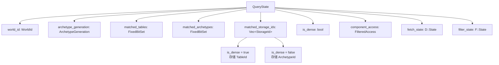

> [[Notes/Bevy/00-Bevy全解析主索引|← 返回 Bevy 全解析主索引]]

---

# Bevy `bevy_ecs` 源码解析：Query 与 SystemParam

> **分析范围**：`bevy_ecs` crate 中 `query/` 与 `system/` 模块的 Query、QueryState、SystemParam 核心机制。
> **分析轮次**：三轮完整分析（接口层 → 数据层 → 逻辑层）。
> **源码版本**：Bevy 0.19.0-dev（`main` 分支）。

---

## 零、Query 与 SystemParam 是什么？

在 Bevy 的 ECS 架构中，System 是普通函数，但它不能直接访问 World。Bevy 需要一种机制，让函数参数声明"我要读取/写入哪些数据"，然后由框架在运行时把这些数据注入进来。

**SystemParam** 就是这个机制的核心抽象。它是一个 trait，定义了系统参数如何从 World 中获取。Query、Res、ResMut、Commands、Local 等所有系统参数类型，都是 SystemParam 的实现。

**Query** 则是最常用的 SystemParam，用于检索符合特定组件组合的实体。它背后依赖 **QueryState** 缓存匹配结果，通过 **WorldQuery** trait 定义如何安全地读取组件数据。

简单来说：
- **SystemParam** = "系统能要什么"
- **Query** = "从世界里找符合条件的实体及其组件"
- **QueryState** = "缓存查询匹配结果，避免每帧重新计算"
- **WorldQuery** = "定义如何安全地从存储中抓取数据"

---

## 一、模块定位与构建定义

### 1.1 模块文件地图

| 文件路径 | 职责 |
|---------|------|
| `crates/bevy_ecs/src/query/mod.rs` | Query 模块入口，导出 QueryData、QueryFilter、QueryState、迭代器等 |
| `crates/bevy_ecs/src/query/state.rs` | **QueryState** 定义与缓存更新逻辑 |
| `crates/bevy_ecs/src/query/iter.rs` | **QueryIter**、**QueryIterationCursor** 迭代器实现 |
| `crates/bevy_ecs/src/query/par_iter.rs` | **QueryParIter** 并行迭代器 |
| `crates/bevy_ecs/src/query/fetch.rs` | **WorldQuery**、**QueryData** trait 及 `&T`、`&mut T` 等实现 |
| `crates/bevy_ecs/src/query/filter.rs` | **QueryFilter** trait 及 `With`、`Without`、`Changed`、`Added` 实现 |
| `crates/bevy_ecs/src/query/world_query.rs` | **WorldQuery** 基础 trait 定义 |
| `crates/bevy_ecs/src/system/query.rs` | **Query**（SystemParam 版）的定义与 API |
| `crates/bevy_ecs/src/system/system_param.rs` | **SystemParam** trait 及 Res、ResMut、ParamSet 等实现 |

### 1.2 核心 trait 层级

```
WorldQuery（最底层：定义 Fetch/State/组件访问）
├── QueryData（数据获取：&T、&mut T、Entity、Option<&T> 等）
│   ├── ReadOnlyQueryData（只读标记）
│   ├── IterQueryData（可并发迭代标记）
│   └── SingleEntityQueryData（单实体访问）
└── QueryFilter（过滤条件：With、Without、Changed、Or 等）

SystemParam（系统参数抽象）
├── Query<'w, 's, D, F>
├── Res<'w, T> / ResMut<'w, T>
├── Commands<'w, 's>
├── Local<'s, T>
├── ParamSet<(...)>
└── ...（用户自定义 #[derive(SystemParam)]）
```

---

## 二、第一轮：接口层（What）

### 2.1 Query —— System 的数据检索器

> 文件：`crates/bevy_ecs/src/system/query.rs`，第 487~493 行

```rust
pub struct Query<'world, 'state, D: QueryData, F: QueryFilter = ()> {
    // SAFETY: Must have access to the components registered in `state`.
    world: UnsafeWorldCell<'world>,
    state: &'state QueryState<D, F>,
    last_run: Tick,
    this_run: Tick,
}
```

`Query` 是 System 最常见的参数类型。它包含四个字段：
- `world`：对 World 的 unsafe 只读引用（通过 `UnsafeWorldCell` 封装，内部是裸指针）。
- `state`：指向缓存的 `QueryState`，由 System 的初始化阶段创建并复用。
- `last_run` / `this_run`：上一次运行和本次运行的 Tick，用于 Change Detection（如 `Changed<T>` 过滤器）。

开发者写 `Query<&Position, With<Player>>` 时，泛型参数 `D = &Position`（QueryData）决定取什么数据，`F = With<Player>`（QueryFilter）决定过滤条件。

### 2.2 QueryState —— 缓存查询匹配的元数据

> 文件：`crates/bevy_ecs/src/query/state.rs`，第 79~101 行

```rust
#[repr(C)]
pub struct QueryState<D: QueryData, F: QueryFilter = ()> {
    world_id: WorldId,
    pub(crate) archetype_generation: ArchetypeGeneration,
    pub(crate) matched_tables: FixedBitSet,
    pub(crate) matched_archetypes: FixedBitSet,
    pub(crate) component_access: FilteredAccess,
    pub(super) matched_storage_ids: Vec<StorageId>,
    pub(super) is_dense: bool,
    pub(crate) fetch_state: D::State,
    pub(crate) filter_state: F::State,
    #[cfg(feature = "trace")]
    par_iter_span: Span,
}
```

`QueryState` 是 Query 的"幕后大脑"。它在 System 初始化时创建，之后每帧只需增量更新。核心缓存包括：
- `matched_tables` / `matched_archetypes`：位图，标记哪些 Table/Archetype 符合查询条件。
- `matched_storage_ids`：匹配的存储单元 ID 列表（根据 `is_dense` 存储 TableId 或 ArchetypeId）。
- `component_access`：本查询的组件读写权限声明，用于调度器检测系统间冲突。
- `fetch_state` / `filter_state`：`D` 和 `F` 的初始化状态，供 `init_fetch` 使用。

### 2.3 WorldQuery —— 底层数据抓取的契约

> 文件：`crates/bevy_ecs/src/query/world_query.rs`，第 44~159 行

```rust
pub unsafe trait WorldQuery {
    type Fetch<'w>: Clone;
    type State: Send + Sync + Sized;

    unsafe fn init_fetch<'w, 's>(
        world: UnsafeWorldCell<'w>,
        state: &'s Self::State,
        last_run: Tick,
        this_run: Tick,
    ) -> Self::Fetch<'w>;

    const IS_DENSE: bool;

    unsafe fn set_archetype<'w, 's>(
        fetch: &mut Self::Fetch<'w>,
        state: &'s Self::State,
        archetype: &'w Archetype,
        table: &'w Table,
    );

    unsafe fn set_table<'w, 's>(
        fetch: &mut Self::Fetch<'w>,
        state: &'s Self::State,
        table: &'w Table,
    );

    fn update_component_access(state: &Self::State, access: &mut FilteredAccess);
    fn init_state(world: &mut World) -> Self::State;
    fn matches_component_set(
        state: &Self::State,
        set_contains_id: &impl Fn(ComponentId) -> bool,
    ) -> bool;
}
```

`WorldQuery` 是最底层的 trait，约定了"如何从 World 中抓取数据"。所有能在 Query 中使用的类型（`&T`、`&mut T`、`With<T>`、`Changed<T>`、tuple 等）都必须实现它。

关键设计：
- **`Fetch<'w>`**：每次迭代时持有的运行时状态（如指向列数据的指针），会被 `set_table` / `set_archetype` 更新。
- **`State`**：在 `QueryState` 中缓存的静态元数据（如 `ComponentId`）。
- **`IS_DENSE`**：是否可以在 Table 级别直接迭代（无需经过 Archetype 间接索引）。
- **`update_component_access`**：声明本查询要读取/写入哪些组件，用于并行冲突检测。

### 2.4 QueryData —— 声明要获取的数据

> 文件：`crates/bevy_ecs/src/query/fetch.rs`，第 324~393 行

```rust
pub unsafe trait QueryData: WorldQuery {
    const IS_READ_ONLY: bool;
    const IS_ARCHETYPAL: bool;
    type ReadOnly: ReadOnlyQueryData<State = <Self as WorldQuery>::State>;
    type Item<'w, 's>;

    unsafe fn fetch<'w, 's>(
        state: &'s Self::State,
        fetch: &mut Self::Fetch<'w>,
        entity: Entity,
        table_row: TableRow,
    ) -> Option<Self::Item<'w, 's>>;
}
```

`QueryData` 继承自 `WorldQuery`，专门用于"获取数据"。`Item` 是用户实际拿到的类型（如 `&Position`、`(&Position, &Velocity)`）。

Bevy 为以下类型实现了 `QueryData`：
- `&T`（只读组件引用）
- `&mut T`（可变组件引用）
- `Entity`（实体 ID）
- `Option<&T>`（可选组件）
- `AnyOf<(&A, &B)>`（至少有一个）
- `Ref<T>` / `Mut<T>`（带变更检测的包装）
- tuple（组合多个 QueryData）
- 用户自定义 struct（通过 `#[derive(QueryData)]`）

### 2.5 QueryFilter —— 声明过滤条件

> 文件：`crates/bevy_ecs/src/query/filter.rs`，第 84~113 行

```rust
pub unsafe trait QueryFilter: WorldQuery {
    const IS_ARCHETYPAL: bool;

    unsafe fn filter_fetch(
        state: &Self::State,
        fetch: &mut Self::Fetch<'_>,
        entity: Entity,
        table_row: TableRow,
    ) -> bool;
}
```

`QueryFilter` 也继承自 `WorldQuery`，但它不返回数据，只返回 `bool`（是否保留该实体）。

内置过滤器：
- `With<T>` / `Without<T>`：基于 Archetype 的静态过滤（`IS_ARCHETYPAL = true`）。
- `Changed<T>` / `Added<T>` / `Spawned`：基于 Tick 的动态过滤（`IS_ARCHETYPAL = false`）。
- `Or<(...)>`：逻辑或组合。
- tuple：逻辑与组合。

### 2.6 SystemParam —— 系统参数的抽象

> 文件：`crates/bevy_ecs/src/system/system_param.rs`，第 217~284 行

```rust
pub unsafe trait SystemParam: Sized {
    type State: Send + Sync + 'static;
    type Item<'world, 'state>: SystemParam<State = Self::State>;

    fn init_state(world: &mut World) -> Self::State;
    fn init_access(
        state: &Self::State,
        system_meta: &mut SystemMeta,
        component_access_set: &mut FilteredAccessSet,
        world: &mut World,
    );
    unsafe fn get_param<'world, 'state>(
        state: &'state mut Self::State,
        system_meta: &SystemMeta,
        world: UnsafeWorldCell<'world>,
        change_tick: Tick,
    ) -> Result<Self::Item<'world, 'state>, SystemParamValidationError>;
}
```

`SystemParam` 是 Bevy 将普通函数转换为 System 的关键。一个函数能作为 System 运行，当且仅当它的每个参数都实现了 `SystemParam`。

生命周期设计：
- `'w`：World 数据的生命周期（指向组件/资源的实际内存）。
- `'s`：State 数据的生命周期（缓存在 System 中的元数据）。

### 2.7 常见 SystemParam 一览

| SystemParam | State 类型 | 说明 |
|------------|-----------|------|
| `Query<D, F>` | `QueryState<D, F>` | 查询实体组件 |
| `Res<T>` | `ComponentId` | 读取 Resource |
| `ResMut<T>` | `ComponentId` | 可变访问 Resource |
| `Commands` | `CommandQueue` | 延迟执行的结构化变更 |
| `Local<T>` | `T` | 系统私有状态 |
| `ParamSet<(A, B)>` | `(A::State, B::State)` | 互斥访问冲突参数 |
| `&World` | `()` | 只读访问整个 World |
| `Single<D, F>` | `QueryState<D, F>` | 要求恰好一个匹配实体 |

---

## 三、第二轮：数据层（How - Structure）

### 3.1 QueryState 的缓存结构



#### StorageId —— 编译期决定存储类型的 union

> 文件：`crates/bevy_ecs/src/query/state.rs`，第 50~54 行

```rust
#[derive(Clone, Copy)]
pub(super) union StorageId {
    pub(super) table_id: TableId,
    pub(super) archetype_id: ArchetypeId,
}
```

`StorageId` 是一个 **union** 而非 enum。因为对于一个具体的 `QueryState<D, F>`，`is_dense` 是编译期确定的常量（由 `D::IS_DENSE && F::IS_DENSE` 决定）。迭代时不需要分支判断 discriminator，减少了运行时开销和内存占用。

#### FixedBitSet —— 匹配存储的快速位图

`matched_tables` 和 `matched_archetypes` 使用 `fixedbitset::FixedBitSet`。当世界中有大量 Archetype 时，位图可以快速判断某个 Archetype/Table 是否被查询匹配。

### 3.2 FilteredAccess —— 读写权限声明

> 文件：`crates/bevy_ecs/src/query/access.rs`（相关逻辑）

`FilteredAccess` 是 Query 并行冲突检测的核心数据结构。它包含：
- `access: Access`：记录了读取和写入的 `ComponentId` 集合。
- `with` / `without`：静态过滤条件。
- `filter_sets`：更复杂的过滤集合（用于 `Or` 等组合）。

当 Schedule 构建依赖图时，它会比较两个系统的 `FilteredAccessSet`。如果存在"一个读、另一个写"或"两个都写"的冲突，这两个系统就不能并行执行。

### 3.3 QueryIterationCursor —— 迭代游标

> 文件：`crates/bevy_ecs/src/query/iter.rs`，第 2724~2736 行

```rust
struct QueryIterationCursor<'w, 's, D: QueryData, F: QueryFilter> {
    is_dense: bool,
    storage_id_iter: core::slice::Iter<'s, StorageId>,
    table_entities: &'w [Entity],
    archetype_entities: &'w [ArchetypeEntity],
    fetch: D::Fetch<'w>,
    filter: F::Fetch<'w>,
    current_len: u32,
    current_row: u32,
}
```

`QueryIterationCursor` 是迭代器的核心状态机。它的工作流程：
1. `storage_id_iter` 遍历 `matched_storage_ids`。
2. 对每个 StorageId，根据 `is_dense` 获取 Table 或 Archetype。
3. 调用 `D::set_table` / `F::set_table` 或 `set_archetype` 更新 `fetch` 和 `filter`。
4. `current_row` 在当前 Table/Archetype 内递增，直到 `current_len`。
5. 对每个行，先调用 `F::filter_fetch` 判断是否跳过，再调用 `D::fetch` 获取数据。

### 3.4 Fetch 结构 —— 运行时数据指针

以 `&T` 为例：

> 文件：`crates/bevy_ecs/src/query/fetch.rs`，第 1830~1870 行（大致位置，`&T` 的 WorldQuery impl）

```rust
#[doc(hidden)]
pub struct ReadFetch<'w, T: Component> {
    components: StorageSwitch<T,
        Option<ThinSlicePtr<'w, UnsafeCell<T>>>,
        Option<&'w ComponentSparseSet>,
    >,
}
```

`ReadFetch` 通过 `StorageSwitch` 根据组件的 `StorageType` 选择不同的存储访问方式：
- **Table 存储**：直接持有指向列数据的 `ThinSlicePtr`，迭代时通过索引直接访问。
- **SparseSet 存储**：持有 `ComponentSparseSet` 的引用，通过 `entity → dense index` 间接查找。

`Changed<T>` 的 Fetch 结构更复杂：

> 文件：`crates/bevy_ecs/src/query/filter.rs`，第 959~968 行

```rust
pub struct ChangedFetch<'w, T: Component> {
    ticks: StorageSwitch<T,
        Option<ThinSlicePtr<'w, UnsafeCell<Tick>>>,
        Option<&'w ComponentSparseSet>,
    >,
    last_run: Tick,
    this_run: Tick,
}
```

它不仅需要访问组件数据，还需要访问组件的变更 Tick（`ComponentTicks`），以便在 `filter_fetch` 中比较 `last_changed_tick > last_run`。

### 3.5 SystemParam 的 State 设计

不同 SystemParam 的 State 类型差异很大：

```
Query<D, F>          → QueryState<D, F>（缓存匹配的 archetype/table）
Res<T> / ResMut<T>   → ComponentId（Resource 的组件 ID）
Commands             → CommandQueue（延迟命令队列）
Local<T>             → T（系统私有数据，直接从 World 的 Local 存储获取）
&World               → ()（无需状态，直接返回 World 引用）
ParamSet<(A, B)>     → (A::State, B::State)（元组组合）
```

State 的生命周期是 `'static`，它在 `System::initialize` 时被创建，之后随 System 实例一起复用。

---

## 四、第三轮：逻辑层（How - Behavior）

### 4.1 QueryState 初始化与更新流程

#### 初始化：QueryState::new

> 文件：`crates/bevy_ecs/src/query/state.rs`，第 224~230 行

```rust
pub fn new(world: &mut World) -> Self {
    let state = unsafe { Self::new_unchecked(world) };
    state.init_access(None, &mut FilteredAccessSet::new(), world.into());
    state
}
```

`new` 的执行步骤：
1. **创建 fetch/filter 状态**：调用 `D::init_state(world)` 和 `F::init_state(world)`，注册组件获取 ComponentId。
2. **计算 component_access**：调用 `D::update_component_access` 和 `F::update_component_access`，合并为完整的读写声明。
3. **检测访问冲突**：`init_access` 检查本查询的访问是否与系统内其他参数冲突（如两个 `&mut T`）。
4. **匹配所有现有 Archetype**：`update_archetypes(world)` 遍历 World 中所有 Archetype，调用 `new_archetype` 缓存匹配结果。

#### 增量更新：update_archetypes

> 文件：`crates/bevy_ecs/src/query/state.rs`，第 559~612 行

```rust
pub fn update_archetypes_unsafe_world_cell(&mut self, world: UnsafeWorldCell) {
    self.validate_world(world.id());
    D::update_archetypes(&mut self.fetch_state, world);
    F::update_archetypes(&mut self.filter_state, world);
    if self.component_access.required.is_clear() {
        let archetypes = world.archetypes();
        let old_generation =
            core::mem::replace(&mut self.archetype_generation, archetypes.generation());
        for archetype in &archetypes[old_generation..] {
            unsafe { self.new_archetype(archetype); }
        }
    } else {
        // 有 required components 时优化：只遍历包含 required 组件的 archetype
        // ...
    }
}
```

`update_archetypes` 是增量更新的核心。它通过 `archetype_generation` 判断 World 自上次更新以来新增了多少 Archetype，只处理新增的部分。

如果查询声明了 `required` 组件（如 `With<T>` 会隐式添加），Bevy 会进一步优化：只遍历包含该组件的 Archetype 子集，而不是全部 Archetype。

#### 单个 Archetype 匹配：new_archetype

> 文件：`crates/bevy_ecs/src/query/state.rs`，第 640~664 行

```rust
pub unsafe fn new_archetype(&mut self, archetype: &Archetype) {
    if D::matches_component_set(&self.fetch_state, &|id| archetype.contains(id))
        && F::matches_component_set(&self.filter_state, &|id| archetype.contains(id))
        && self.matches_component_set(&|id| archetype.contains(id))
    {
        let archetype_index = archetype.id().index();
        if !self.matched_archetypes.contains(archetype_index) {
            self.matched_archetypes.grow_and_insert(archetype_index);
            if !self.is_dense {
                self.matched_storage_ids.push(StorageId { archetype_id: archetype.id() });
            }
        }
        let table_index = archetype.table_id().as_usize();
        if !self.matched_tables.contains(table_index) {
            self.matched_tables.grow_and_insert(table_index);
            if self.is_dense {
                self.matched_storage_ids.push(StorageId { table_id: archetype.table_id() });
            }
        }
    }
}
```

匹配条件有三层：
1. `D::matches_component_set`：QueryData 要求的组件是否都在 Archetype 中。
2. `F::matches_component_set`：QueryFilter 的静态条件是否满足。
3. `self.matches_component_set`：QueryState 自身的 `FilteredAccess` 条件是否满足。

通过后，将 ArchetypeId 或 TableId 加入缓存列表。

### 4.2 Query 迭代器执行流程

#### 迭代器创建

> 文件：`crates/bevy_ecs/src/system/query.rs`，第 716~718 行、第 751~757 行

```rust
pub fn iter_mut(&mut self) -> QueryIter<'_, 's, D, F> {
    self.reborrow().iter_inner()
}

pub fn iter_inner(self) -> QueryIter<'w, 's, D, F> {
    unsafe { QueryIter::new(self.world, self.state, self.last_run, this_run) }
}
```

`iter_mut` 先通过 `reborrow` 创建一个短生命周期的 Query，再调用 `iter_inner` 构造 `QueryIter`。`QueryIter::new` 会初始化 `QueryIterationCursor`。

#### QueryIter 与 QueryIterationCursor::next

> 文件：`crates/bevy_ecs/src/query/iter.rs`，第 2882~2933 行

```rust
unsafe fn next(&mut self, tables: &'w Tables, archetypes: &'w Archetypes, query_state: &'s QueryState<D, F>)
    -> Option<D::Item<'w, 's>> {
    if self.is_dense {
        loop {
            if self.current_row == self.current_len {
                let table_id = self.storage_id_iter.next()?.table_id;
                let table = tables.get(table_id).debug_checked_unwrap();
                if table.is_empty() { continue; }
                unsafe {
                    D::set_table(&mut self.fetch, &query_state.fetch_state, table);
                    F::set_table(&mut self.filter, &query_state.filter_state, table);
                }
                self.table_entities = table.entities();
                self.current_len = table.entity_count();
                self.current_row = 0;
            }
            let entity = unsafe { self.table_entities.get_unchecked(self.current_row as usize) };
            let row = unsafe { TableRow::new(NonMaxU32::new_unchecked(self.current_row)) };
            self.current_row += 1;
            if !F::filter_fetch(&query_state.filter_state, &mut self.filter, *entity, row) {
                continue;
            }
            let item = unsafe { D::fetch(&query_state.fetch_state, &mut self.fetch, *entity, row) };
            if let Some(item) = item { return Some(item); }
        }
    } else {
        // 类似的 archetype 级别迭代...
    }
}
```

执行流程（以 dense 模式为例）：
1. **切换 Table**：当 `current_row == current_len` 时，从 `storage_id_iter` 取出下一个 `TableId`。
2. **设置 fetch/filter**：调用 `D::set_table` 和 `F::set_table`，让 `fetch` 持有指向新 Table 列数据的指针。
3. **逐行迭代**：`current_row` 递增，通过 `table_entities` 数组获取 Entity。
4. **过滤**：调用 `F::filter_fetch` 判断该行是否满足动态过滤条件（如 `Changed<T>`）。
5. **获取数据**：调用 `D::fetch` 返回 `Item`。

#### 并行迭代：par_iter

> 文件：`crates/bevy_ecs/src/query/par_iter.rs`，第 42~130 行

```rust
pub fn for_each<FN: Fn(QueryItem<'w, 's, D>) + Send + Sync + Clone>(self, func: FN) {
    // 单线程/WASM：退化为普通迭代
    // 多线程：通过 ComputeTaskPool 分 batch 并行执行
    let batch_size = self.get_batch_size(thread_count).max(1);
    self.state.par_fold_init_unchecked_manual(
        init, self.world, batch_size, func, self.last_run, self.this_run
    );
}
```

`par_iter` 将 `matched_storage_ids` 划分为多个 batch，每个 batch 包含一组连续的 Table/Archetype 行。通过 `bevy_tasks::ComputeTaskPool` 将 batch 分派到多个线程并行执行。

### 4.3 QueryFilter 的匹配逻辑

#### With<T> / Without<T> —— Archetypal 过滤

> 文件：`crates/bevy_ecs/src/query/filter.rs`，第 205~217 行（With）、第 305~318 行（Without）

```rust
unsafe impl<T: Component> QueryFilter for With<T> {
    const IS_ARCHETYPAL: bool = true;
    unsafe fn filter_fetch(_state: &Self::State, _fetch: &mut Self::Fetch<'_>, _entity: Entity, _table_row: TableRow) -> bool {
        true  // Archetypal 过滤已在 new_archetype 阶段完成
    }
}
```

`With<T>` 和 `Without<T>` 是纯 Archetypal 过滤器。它们在 `new_archetype` 阶段通过 `matches_component_set` 决定了哪些 Archetype 匹配，迭代时 `filter_fetch` 永远返回 `true`，零运行时开销。

#### Changed<T> —— 基于 Tick 的动态过滤

> 文件：`crates/bevy_ecs/src/query/filter.rs`，第 1038~1070 行

```rust
unsafe impl<T: Component> QueryFilter for Changed<T> {
    const IS_ARCHETYPAL: bool = false;

    unsafe fn filter_fetch(
        state: &Self::State,
        fetch: &mut Self::Fetch<'_>,
        entity: Entity,
        table_row: TableRow,
    ) -> bool {
        let ticks = fetch.ticks.extract(
            |table_ticks| {
                let table_ticks = table_ticks.debug_checked_unwrap();
                unsafe { table_ticks.get_unchecked(table_row.index()) }
            },
            |sparse_set| {
                unsafe { sparse_set.debug_checked_unwrap().get_changed_by_ticks(entity).debug_checked_unwrap() }
            },
        );
        ticks.is_changed(fetch.last_run, fetch.this_run)
    }
}
```

`Changed<T>` 的 `IS_ARCHETYPAL = false`，意味着它不能仅靠 Archetype 信息过滤，必须在每次 `filter_fetch` 时比较组件的 `last_changed_tick` 与 `last_run`。

这带来了性能代价：即使一个 Archetype 包含 `T`，其中的每个实体都要单独检查 Tick。所以 `Changed<T>` 的时间复杂度是 `O(a + n)`（a = archetype 数量，n = 实体数量），而 `With<T>` 是 `O(a)`。

### 4.4 WorldQuery 的 unsafe 读取

以 `&T` 的 `fetch` 为例：

> 文件：`crates/bevy_ecs/src/query/fetch.rs`，第 1884~1909 行

```rust
unsafe fn fetch<'w, 's>(
    _state: &'s Self::State,
    fetch: &mut Self::Fetch<'w>,
    entity: Entity,
    table_row: TableRow,
) -> Option<Self::Item<'w, 's>> {
    Some(fetch.components.extract(
        |table| {
            let table = unsafe { table.debug_checked_unwrap() };
            let item = unsafe { table.get_unchecked(table_row.index()) };
            item.deref()
        },
        |sparse_set| {
            let item = unsafe {
                sparse_set.debug_checked_unwrap().get(entity).debug_checked_unwrap()
            };
            item.deref()
        },
    ))
}
```

`fetch` 被标记为 `unsafe`，因为调用者必须保证：
1. 之前已调用 `set_table` 或 `set_archetype`。
2. `entity` 和 `table_row` 在当前 Table/Archetype 范围内。
3. 没有并发的可变访问冲突。

`StorageSwitch` 是一个编译期选择结构，根据 `T::STORAGE_TYPE` 决定走 Table 分支还是 SparseSet 分支。对于 Table 存储，它直接从列数组通过索引取数据；对于 SparseSet，它先通过 `sparse[entity] → dense index`，再从 dense 数组取数据。

### 4.5 SystemParam 的 derive 宏展开

用户可以通过 `#[derive(SystemParam)]` 创建自定义参数：

```rust
#[derive(SystemParam)]
struct MyParam<'w, 's> {
    query: Query<'w, 's, &'static Position>,
    res: Res<'w, Time>,
}
```

`bevy_ecs_macros` 中的 `SystemParam` derive 宏会展开为：

```rust
unsafe impl<'w, 's> SystemParam for MyParam<'w, 's> {
    type State = MyParamState;
    type Item<'w2, 's2> = MyParam<'w2, 's2>;

    fn init_state(world: &mut World) -> Self::State {
        MyParamState {
            query: Query::init_state(world),
            res: Res::init_state(world),
        }
    }

    fn init_access(state: &Self::State, system_meta: &mut SystemMeta, access_set: &mut FilteredAccessSet, world: &mut World) {
        Query::init_access(&state.query, system_meta, access_set, world);
        Res::init_access(&state.res, system_meta, access_set, world);
    }

    unsafe fn get_param<'w2, 's2>(state: &'s2 mut Self::State, ...) -> Result<Self::Item<'w2, 's2>, ...> {
        Ok(MyParam {
            query: unsafe { Query::get_param(&mut state.query, ...)? },
            res: unsafe { Res::get_param(&mut state.res, ...)? },
        })
    }
}
```

本质上，derive 宏为每个字段递归调用对应类型的 `SystemParam` 方法，将多个参数组合成一个。

### 4.6 ParamSet —— 解决访问冲突

> 文件：`crates/bevy_ecs/src/system/system_param.rs`，第 552~664 行

```rust
pub struct ParamSet<'w, 's, T: SystemParam> {
    param_states: &'s mut T::State,
    world: UnsafeWorldCell<'w>,
    system_meta: SystemMeta,
    change_tick: Tick,
}
```

`ParamSet` 用于将多个**理论上冲突**的参数封装在一起。例如：

```rust
fn system(mut set: ParamSet<(
    Query<&mut Health, With<Player>>,
    Query<&mut Health, With<Enemy>>,
)>) {
    for mut health in set.p0().iter_mut() { /* ... */ }
    for mut health in set.p1().iter_mut() { /* ... */ }
}
```

在 `init_access` 阶段，`ParamSet` 对每个子参数单独做冲突检测（因为实际上它们不会同时被访问）。`p0()`、`p1()` 等方法通过独占借用 `&mut self` 保证同一时刻只有一个参数被使用。

---

## 五、关联辐射（Context）

### 5.1 与上层模块的关系

| 上层模块 | 交互方式 | 说明 |
|---------|---------|------|
| `bevy_app` | `App::add_systems()` | 将用户函数通过 `IntoSystem` 转换为 System，提取参数类型并验证 SystemParam |
| `bevy_ecs_macros` | `#[derive(SystemParam)]` / `#[derive(QueryData)]` | 过程宏自动展开 trait 实现 |
| `bevy_tasks` | `ComputeTaskPool` | `par_iter` 依赖的任务池，提供多线程并行迭代 |

### 5.2 与下层模块的关系

| 下层模块 | 依赖方式 | 说明 |
|---------|---------|------|
| `storage`（Table/SparseSet） | `set_table` / `set_archetype` | Query 迭代最终落到 Table 的列数据或 SparseSet 的密集数组 |
| `archetype` | `matches_component_set` | Archetype 级别的快速筛选 |
| `change_detection` | `Tick` | `Changed` / `Added` 过滤器依赖全局 Tick 和组件级 Tick |
| `component` | `ComponentId` | 所有查询条件最终都转化为 ComponentId 集合的比较 |

### 5.3 Query 与 SystemParam 的设计亮点

1. **State 缓存复用**：`QueryState` 在 System 初始化时构建，之后每帧仅增量更新新增 Archetype，避免了每帧全量扫描。
2. **Dense vs Sparse 双路径**：`IS_DENSE` 在编译期决定迭代策略。纯 Table 查询直接按行迭代，缓存友好；涉及 SparseSet 或动态过滤时退化为 Archetype 级迭代。
3. **Union 优化 StorageId**：用 union 替代 enum 存储 TableId/ArchetypeId，消除了运行时分支和 discriminant 内存开销。
4. **Access 声明驱动并行调度**：SystemParam 在初始化时就声明了完整的读写需求，Schedule 构建器可以静态分析冲突并自动并行化。
5. **UnsafeWorldCell 的精细权限**：`UnsafeWorldCell` 是裸指针的封装，它本身不限制访问，但 `Query` 通过 `init_access` 的声明配合调度器确保运行时不会越权。
6. **Change Detection 零清除开销**：基于全局递增 Tick 的比较，避免了传统脏标记"遍历清除"的开销。

### 5.4 跨引擎对照

| 维度 | Bevy Query/SystemParam | UE（UObject 体系） | chaos/自定义 ECS |
|------|------------------------|-------------------|------------------|
| **参数注入** | `SystemParam` trait + derive 宏 | 直接函数调用，无参数注入概念 | 手动从 Context/World 获取 |
| **查询语法** | `Query<&A, With<B>>`（类型级声明） | `GetComponents<A>()`（运行时模板） | 自定义查询接口 |
| **迭代优化** | Archetype 缓存 + Dense/Table 直接迭代 | 对象数组遍历 | Archetype/Chunk 迭代 |
| **并行安全** | 静态 `FilteredAccess` 冲突检测 | GameThread 单线程为主 | 手动同步/任务图 |
| **变更检测** | Tick 比较（全局递增） | `UProperty` 标记 / 手动回调 | 手动脏标记 |
| **自定义参数** | `#[derive(SystemParam)]` | 无直接对应 | 手动实现 |

---

## 六、关键源码片段

### 6.1 Query 结构体

> 文件：`crates/bevy_ecs/src/system/query.rs`，第 487~493 行

```rust
pub struct Query<'world, 'state, D: QueryData, F: QueryFilter = ()> {
    world: UnsafeWorldCell<'world>,
    state: &'state QueryState<D, F>,
    last_run: Tick,
    this_run: Tick,
}
```

### 6.2 QueryState 结构体

> 文件：`crates/bevy_ecs/src/query/state.rs`，第 79~101 行

```rust
#[repr(C)]
pub struct QueryState<D: QueryData, F: QueryFilter = ()> {
    world_id: WorldId,
    pub(crate) archetype_generation: ArchetypeGeneration,
    pub(crate) matched_tables: FixedBitSet,
    pub(crate) matched_archetypes: FixedBitSet,
    pub(crate) component_access: FilteredAccess,
    pub(super) matched_storage_ids: Vec<StorageId>,
    pub(super) is_dense: bool,
    pub(crate) fetch_state: D::State,
    pub(crate) filter_state: F::State,
    #[cfg(feature = "trace")]
    par_iter_span: Span,
}
```

### 6.3 WorldQuery trait

> 文件：`crates/bevy_ecs/src/query/world_query.rs`，第 44~159 行

```rust
pub unsafe trait WorldQuery {
    type Fetch<'w>: Clone;
    type State: Send + Sync + Sized;

    unsafe fn init_fetch<'w, 's>(world: UnsafeWorldCell<'w>, state: &'s Self::State, last_run: Tick, this_run: Tick) -> Self::Fetch<'w>;
    const IS_DENSE: bool;
    unsafe fn set_archetype<'w, 's>(fetch: &mut Self::Fetch<'w>, state: &'s Self::State, archetype: &'w Archetype, table: &'w Table);
    unsafe fn set_table<'w, 's>(fetch: &mut Self::Fetch<'w>, state: &'s Self::State, table: &'w Table);
    fn update_component_access(state: &Self::State, access: &mut FilteredAccess);
    fn init_state(world: &mut World) -> Self::State;
    fn matches_component_set(state: &Self::State, set_contains_id: &impl Fn(ComponentId) -> bool) -> bool;
}
```

### 6.4 SystemParam trait

> 文件：`crates/bevy_ecs/src/system/system_param.rs`，第 217~284 行

```rust
pub unsafe trait SystemParam: Sized {
    type State: Send + Sync + 'static;
    type Item<'world, 'state>: SystemParam<State = Self::State>;

    fn init_state(world: &mut World) -> Self::State;
    fn init_access(state: &Self::State, system_meta: &mut SystemMeta, component_access_set: &mut FilteredAccessSet, world: &mut World);
    unsafe fn get_param<'world, 'state>(state: &'state mut Self::State, system_meta: &SystemMeta, world: UnsafeWorldCell<'world>, change_tick: Tick) -> Result<Self::Item<'world, 'state>, SystemParamValidationError>;
}
```

### 6.5 Query 作为 SystemParam 的实现

> 文件：`crates/bevy_ecs/src/system/system_param.rs`，第 303~336 行

```rust
unsafe impl<D: QueryData + 'static, F: QueryFilter + 'static> SystemParam for Query<'_, '_, D, F> {
    type State = QueryState<D, F>;
    type Item<'w, 's> = Query<'w, 's, D, F>;

    fn init_state(world: &mut World) -> Self::State {
        unsafe { QueryState::new_unchecked(world) }
    }

    fn init_access(state: &Self::State, system_meta: &mut SystemMeta, component_access_set: &mut FilteredAccessSet, world: &mut World) {
        state.init_access(Some(system_meta.name()), component_access_set, world.into());
    }

    unsafe fn get_param<'w, 's>(state: &'s mut Self::State, system_meta: &SystemMeta, world: UnsafeWorldCell<'w>, change_tick: Tick) -> Result<Self::Item<'w, 's>, SystemParamValidationError> {
        Ok(unsafe { state.query_unchecked_with_ticks(world, system_meta.last_run, change_tick) })
    }
}
```

### 6.6 QueryIterationCursor::next（Dense 分支）

> 文件：`crates/bevy_ecs/src/query/iter.rs`，第 2888~2933 行

```rust
if self.is_dense {
    loop {
        if self.current_row == self.current_len {
            let table_id = self.storage_id_iter.next()?.table_id;
            let table = tables.get(table_id).debug_checked_unwrap();
            if table.is_empty() { continue; }
            unsafe {
                D::set_table(&mut self.fetch, &query_state.fetch_state, table);
                F::set_table(&mut self.filter, &query_state.filter_state, table);
            }
            self.table_entities = table.entities();
            self.current_len = table.entity_count();
            self.current_row = 0;
        }
        let entity = unsafe { self.table_entities.get_unchecked(self.current_row as usize) };
        let row = unsafe { TableRow::new(NonMaxU32::new_unchecked(self.current_row)) };
        self.current_row += 1;
        if !F::filter_fetch(&query_state.filter_state, &mut self.filter, *entity, row) {
            continue;
        }
        let item = unsafe { D::fetch(&query_state.fetch_state, &mut self.fetch, *entity, row) };
        if let Some(item) = item { return Some(item); }
    }
}
```

### 6.7 Changed<T> 的 filter_fetch

> 文件：`crates/bevy_ecs/src/query/filter.rs`，第 1038~1070 行

```rust
unsafe fn filter_fetch(state: &Self::State, fetch: &mut Self::Fetch<'_>, entity: Entity, table_row: TableRow) -> bool {
    let ticks = fetch.ticks.extract(
        |table_ticks| {
            let table_ticks = table_ticks.debug_checked_unwrap();
            unsafe { table_ticks.get_unchecked(table_row.index()) }
        },
        |sparse_set| {
            unsafe { sparse_set.debug_checked_unwrap().get_changed_by_ticks(entity).debug_checked_unwrap() }
        },
    );
    ticks.is_changed(fetch.last_run, fetch.this_run)
}
```

### 6.8 With<T> / Without<T> 的零开销过滤

> 文件：`crates/bevy_ecs/src/query/filter.rs`，第 205~217 行

```rust
unsafe impl<T: Component> QueryFilter for With<T> {
    const IS_ARCHETYPAL: bool = true;
    unsafe fn filter_fetch(_state: &Self::State, _fetch: &mut Self::Fetch<'_>, _entity: Entity, _table_row: TableRow) -> bool {
        true // 过滤在 new_archetype 阶段已完成
    }
}
```

---

## 七、关联阅读

- [[Bevy-bevy_ecs-源码解析：World 与 Entity 生命周期]] — World 的整体结构、Entity 分配器、Archetype 与 Table 的关系。
- [[Bevy-bevy_ecs-源码解析：Component 存储与 Archetype]] — Table/Column/SparseSet 的内存布局、BlobArray、组件存储的底层细节。
- [[Bevy-bevy_ecs-源码解析：Schedule 与 System 并行调度]] — `FilteredAccessSet` 如何被 ScheduleGraph 使用来构建并行执行图。
- [[Bevy-bevy_ecs-源码解析：Event 与 Commands 延迟执行]] — `Commands` 作为 SystemParam 的延迟执行机制、`CommandQueue` 的 apply 流程。
- [[Bevy-bevy_ecs-源码解析：Change Detection 与脏标记]] — `Tick` 的溢出处理、`ComponentTicks` 的逐组件更新、`CHECK_TICK_THRESHOLD`。
- [[Bevy-专题：ECS 内存布局与 Archetype 演进]] — 跨引擎对照：Bevy 的 Archetype+Table vs chaos/UE 的组件模型。

---

## 八、索引状态

- **所属阶段**：第一阶段 — 构建系统与 ECS 核心（1.2 ECS 核心）
- **对应索引条目**：`[[Bevy-bevy_ecs-源码解析：Query 与 SystemParam]]`
- **分析轮次**：三轮全做（接口层 ✅ → 数据层 ✅ → 逻辑层 ✅）
- **覆盖范围**：
  - ✅ `Query` / `QueryState` / `QueryIter` / `QueryIterationCursor` 的完整接口与执行流程
  - ✅ `WorldQuery` / `QueryData` / `QueryFilter` trait 体系与实现约束
  - ✅ `SystemParam` trait 及 `Query`、`Res`、`ResMut`、`ParamSet`、`Local` 的实现
  - ✅ `#[derive(SystemParam)]` / `#[derive(QueryData)]` 宏展开原理
  - ✅ `With` / `Without` / `Changed` / `Added` / `Or` 过滤器的实现差异
  - ✅ `UnsafeWorldCell` + unsafe fetch 的安全边界
  - ✅ `par_iter` 的并行迭代策略
  - ⬜ `QueryBuilder` 动态查询的构建流程（涉及 `query/builder.rs`）
  - ⬜ `QueryLens` / `transmute` / `join` 的高级查询转换（本笔记提及但未深入完整实现）
  - ⬜ `bevy_ecs_macros` 中 `QueryData` / `QueryFilter` derive 宏的 Token 级展开

---

> [[Notes/Bevy/00-Bevy全解析主索引|← 返回 Bevy 全解析主索引]]
