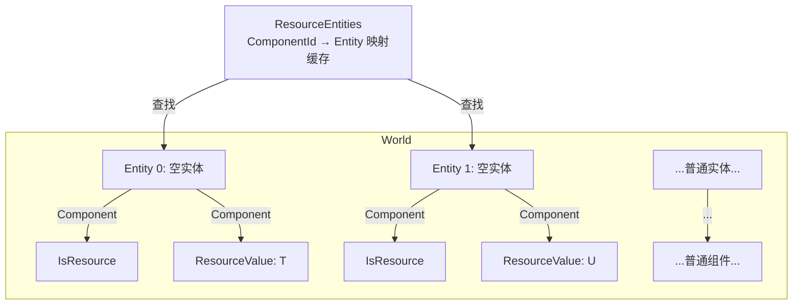
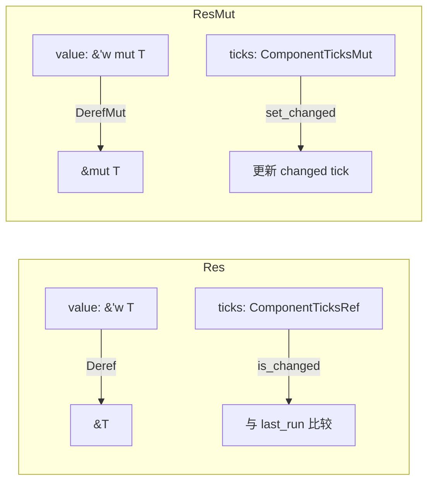
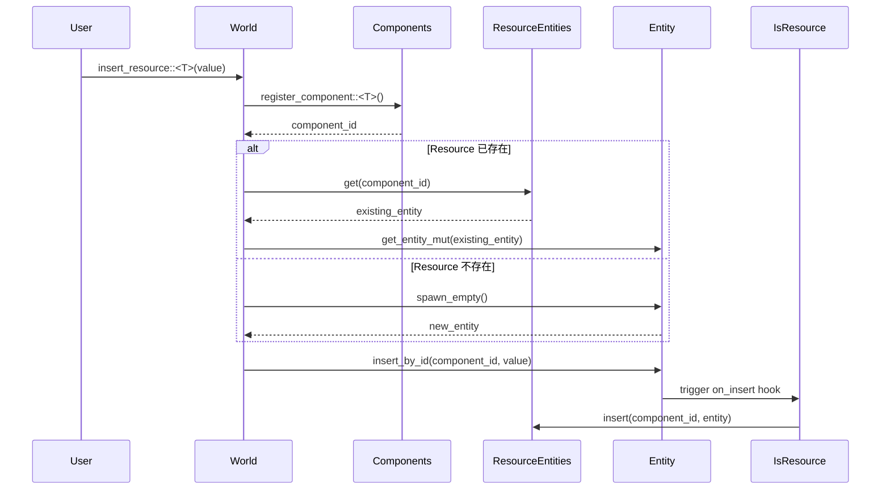

> [[Notes/Bevy/00-Bevy全解析主索引|← 返回 Bevy 全解析主索引]]

---

# Bevy `bevy_ecs` 源码解析：Resource 全局状态

> **分析范围**：`Resource` trait、`Res`/`ResMut`/`Local`/`NonSend` SystemParam、World 中 Resource 的存储与生命周期。
> **分析轮次**：三轮完整分析（接口层 → 数据层 → 逻辑层）。
> **源码版本**：Bevy 0.19.0-dev（`main` 分支）。

---

## 零、Resource 是什么？

在 ECS 架构中，**Entity** 是 ID，**Component** 是附加在 Entity 上的数据。但游戏中还有很多"不属于任何实体"的全局状态——比如当前帧率、游戏配置、物理世界的重力参数、输入状态等。

Bevy 用 **Resource** 来解决这个问题。Resource 是一种**全局单例**数据：一个 World 中，每种 Resource 类型最多只有一个实例。

但不要把它想象成传统引擎中的"全局变量"。Bevy 的 Resource 有一个非常精妙的设计——**Resource 本质上是一种特殊的 Component**，它被存放在一个"只有它自己"的特殊 Entity 上。这意味着 Resource 可以复用 Component 的全部基础设施：注册表、存储、变更检测、生命周期钩子。

---

## 一、模块定位与构建定义

### 1.1 涉及文件

| 文件路径 | 职责 |
|---------|------|
| `crates/bevy_ecs/src/resource.rs` | **Resource trait、ResourceEntities 缓存、IsResource marker** |
| `crates/bevy_ecs/src/change_detection/params.rs` | **Res、ResMut、NonSend、NonSendMut 结构定义** |
| `crates/bevy_ecs/src/change_detection/traits.rs` | **DetectChanges / DetectChangesMut trait 与宏** |
| `crates/bevy_ecs/src/system/system_param.rs` | **Res/ResMut/Local/NonSend/NonSendMut 的 SystemParam 实现** |
| `crates/bevy_ecs/src/world/mod.rs` | **World 中 insert/remove/get_resource 等方法** |
| `crates/bevy_ecs/src/world/unsafe_world_cell.rs` | **unsafe 层面的 resource 访问原语** |
| `crates/bevy_ecs/src/storage/non_send.rs` | **NonSendData / NonSends 存储（!Send 资源的独立存储）** |

### 1.2 Resource 在 bevy_ecs 中的位置

```
bevy_ecs
├── resource.rs          ← Resource trait、IsResource、ResourceEntities
├── change_detection/
│   ├── params.rs        ← Res、ResMut、NonSend、NonSendMut、Ref、Mut
│   └── traits.rs        ← DetectChanges、DetectChangesMut
├── system/
│   └── system_param.rs  ← SystemParam 实现
├── world/
│   ├── mod.rs           ← World::insert_resource、remove_resource...
│   └── unsafe_world_cell.rs
└── storage/
    └── non_send.rs      ← !Send 资源的独立存储
```

---

## 二、第一轮：接口层（What）

### 2.1 Resource trait —— 单例数据的标记

> 文件：`crates/bevy_ecs/src/resource.rs`，第 87 行

```rust
pub trait Resource: Component<Mutability = Mutable> {}
```

这是 Bevy 0.19 中 Resource 的完整定义。它没有任何方法，只是一个**带约束的 Component trait 子类型**：

- **`Component<Mutability = Mutable>`**：Resource 必须是可变的 Component。这意味着 Resource 会自动获得 Component 的全部元数据（`ComponentId`、`StorageType`、drop 函数、布局信息等）。
- **`Send + Sync + 'static`**：通过 Component 的父约束继承而来。

```rust
// 使用方式：通过 derive 宏自动实现
#[derive(Resource)]
struct GameConfig {
    gravity: f32,
}
```

**关键洞察**：Resource = Component + 单例语义。Bevy 没有为 Resource 创建独立的存储系统，而是完全复用 Component 的基础设施。

### 2.2 Res<T> —— 只读资源访问

> 文件：`crates/bevy_ecs/src/change_detection/params.rs`，第 461~464 行

```rust
pub struct Res<'w, T: ?Sized + Resource> {
    pub(crate) value: &'w T,               // 指向资源数据的引用
    pub(crate) ticks: ComponentTicksRef<'w>, // 变更检测的 tick 信息
}
```

`Res<T>` 是 System 参数类型，表示对某个 Resource 的**只读借用**。它实现了：
- `Deref<Target = T>`：可以像 `&T` 一样使用。
- `DetectChanges`：可以检查资源是否被添加/修改（`is_added()`、`is_changed()`）。

### 2.3 ResMut<T> —— 可变资源访问

> 文件：`crates/bevy_ecs/src/change_detection/params.rs`，第 534~537 行

```rust
pub struct ResMut<'w, T: ?Sized + Resource> {
    pub(crate) value: &'w mut T,           // 指向资源数据的可变引用
    pub(crate) ticks: ComponentTicksMut<'w>, // 可变的 tick 信息（可更新）
}
```

`ResMut<T>` 是对 Resource 的**可变借用**。除了 `DerefMut` 外，它还实现了 `DetectChangesMut`：
- `DerefMut` 时会**自动**调用 `set_changed()`，将 `changed tick` 更新为当前 tick。
- `bypass_change_detection()`：绕过变更检测直接修改。
- `set_if_neq()`：只在值真正改变时才触发变更检测。

### 2.4 Local<T> —— System 级别的局部状态

> 文件：`crates/bevy_ecs/src/system/system_param.rs`，第 972 行

```rust
pub struct Local<'s, T: FromWorld + Send + 'static>(pub(crate) &'s mut T);
```

`Local<T>` 是一种特殊的 SystemParam——它**不访问 World 中的任何数据**，而是为每个 System 实例维护一个私有的、持久的局部状态。

- 首次使用时通过 `T::from_world(world)` 初始化。
- 同一类型的 `Local<T>` 在不同 System 中是**隔离的**（每个 System 有自己的实例）。
- 适合用作系统内部的计数器、缓存、临时分配器等。

### 2.5 NonSend / NonSendMut —— !Send 资源的隔离访问

> 文件：`crates/bevy_ecs/src/change_detection/params.rs`，第 591~622 行

```rust
pub struct NonSend<'w, T: ?Sized + 'static> {
    pub(crate) value: &'w T,
    pub(crate) ticks: ComponentTicksRef<'w>,
}

pub struct NonSendMut<'w, T: ?Sized + 'static> {
    pub(crate) value: &'w mut T,
    pub(crate) ticks: ComponentTicksMut<'w>,
}
```

`NonSend<T>` / `NonSendMut<T>` 用于访问**不实现 `Send` trait** 的数据（如 `Rc`、`RefCell`、平台相关的句柄等）。使用这些参数的 System 会被调度器强制放在**主线程**上运行。

### 2.6 World 的 Resource API

> 文件：`crates/bevy_ecs/src/world/mod.rs`

World 提供了丰富的 Resource 操作方法：

| 方法 | 签名 | 说明 |
|------|------|------|
| `register_resource` | `pub fn register_resource<R: Resource>(&mut self) -> ComponentId` | 仅注册类型，不插入值 |
| `init_resource` | `pub fn init_resource<R: Resource + FromWorld>(&mut self) -> ComponentId` | 若不存在则通过 `FromWorld` 初始化 |
| `insert_resource` | `pub fn insert_resource<R: Resource>(&mut self, value: R)` | 插入/覆盖 Resource |
| `remove_resource` | `pub fn remove_resource<R: Resource>(&mut self) -> Option<R>` | 移除并返回 Resource |
| `get_resource` | `pub fn get_resource<R: Resource>(&self) -> Option<&R>` | 获取只读引用 |
| `get_resource_mut` | `pub fn get_resource_mut<R: Resource>(&mut self) -> Option<Mut<'_, R>>` | 获取可变引用（带变更检测） |
| `contains_resource` | `pub fn contains_resource<R: Resource>(&self) -> bool` | 检查是否存在 |

对应的 NonSend API（`init_non_send`、`insert_non_send`、`remove_non_send`、`non_send`、`non_send_mut`）与 Resource API 类似，但作用于独立的 `NonSends` 存储。

---

## 三、第二轮：数据层（How - Structure）

### 3.1 Resource 的存储位置：一个特殊的 Entity

这是 Bevy Resource 最核心的设计决策：**Resource 不是独立存储的，而是以 Component 的形式存储在一个特殊 Entity 上**。



每个 Resource 对应一个独立的 Entity：
- 该 Entity 只有两个 Component：
  1. **`IsResource(ComponentId)`** —— marker component，标记"这是一个 Resource 实体"。
  2. **实际的 Resource 值** —— 类型为 `T` 的 Component。

> 文件：`crates/bevy_ecs/src/resource.rs`，第 122~124 行

```rust
#[derive(Component, Debug)]
#[component(on_insert, on_discard, on_despawn)]
pub struct IsResource(ComponentId);
```

`IsResource` 带有三个生命周期钩子：
- **`on_insert`**：将 `(resource_component_id, entity)` 插入 `ResourceEntities` 缓存。如果同一 Resource 已存在，则移除新插入的重复值并发出警告。
- **`on_discard`**：当 `IsResource` 被移除时，从 `ResourceEntities` 中清除对应条目，同时移除实际的 Resource Component。
- **`on_despawn`**：Resource 实体不应该被直接 despawn，触发警告。

### 3.2 ResourceEntities —— ComponentId 到 Entity 的映射缓存

> 文件：`crates/bevy_ecs/src/resource.rs`，第 90~118 行

```rust
#[derive(Default)]
pub struct ResourceEntities(SyncUnsafeCell<SparseArray<ComponentId, Entity>>);

impl ResourceEntities {
    pub fn iter(&self) -> impl Iterator<Item = (ComponentId, Entity)>;
    pub fn get(&self, id: ComponentId) -> Option<Entity>;
}
```

`ResourceEntities` 是一个**线程不安全的内部可变性缓存**（`SyncUnsafeCell`），存储 `ComponentId → Entity` 的映射：

- `get(component_id)`：O(1) 查找某个 Resource 所在的 Entity。
- `iter()`：遍历所有已注册的 Resource（需要扫描整个数组）。

> **为什么用 `SyncUnsafeCell`？**
> ResourceEntities 的只读引用通过 `&World` 暴露，但钩子（`on_insert`/`on_discard`）运行在 `DeferredWorld` 上下文中，拥有独占访问权。Bevy 通过**运行时借用规则**（不同时在共享和独占上下文暴露）保证安全，而非编译期检查。

### 3.3 ComponentId 与 Resource 的关系

Resource 完全复用 Component 的注册体系：

1. `world.register_resource::<T>()` 内部调用 `components_registrator().register_component::<T>()`。
2. 返回的 `ComponentId` 与 Component 使用的 `ComponentId` 是同一种类型。
3. Resource 的 `StorageType` 默认也是 `Table`（与普通 Component 相同）。

这意味着：**从存储层的视角看，Resource Component 和普通 Component 没有任何区别**。它们都存放在 Table 的 Column 中，都遵循相同的内存布局规则。

### 3.4 Res<T> / ResMut<T> 的数据结构



**ComponentTicksRef**（只读）：
- `added: &'w Tick` —— 资源被添加时的 tick。
- `changed: &'w Tick` —— 资源上次被修改时的 tick。
- `last_run: Tick` —— 本系统上次运行的 tick。
- `this_run: Tick` —— 本次运行的 tick。

**ComponentTicksMut**（可变）：
- 与 `ComponentTicksRef` 结构相同，但持有 `&mut Tick`。
- 可以通过 `*changed = this_run` 更新变更时间戳。

### 3.5 NonSendResources —— !Send 资源的独立存储

> 文件：`crates/bevy_ecs/src/storage/non_send.rs`

`!Send` 资源**不存储在 Entity/Component 体系中**，而是存放在独立的 `NonSends` 存储中：

```rust
#[derive(Default)]
pub struct NonSends {
    non_sends: SparseSet<ComponentId, NonSendData>,
}
```

每个 `NonSendData` 包含：
- `data: BlobArray` —— 容量为 1 的类型擦除数据存储。
- `is_present: bool` —— 是否有值。
- `added_ticks / changed_ticks` —— 变更检测 tick。
- `origin_thread_id: Option<ThreadId>` —— **插入线程 ID**，用于运行时线程安全检查。

**为什么 NonSend 要独立存储？**

因为 `!Send` 数据不能安全地通过 `&World` 在不同线程间共享。Entity/Component 存储可能会被多线程 System 并行访问，而 `NonSends` 是单独管理的：
- 每次访问都检查 `origin_thread_id == current_thread_id()`，否则 panic。
- System 使用 `NonSend<T>` 时，调度器会将其标记为 `non_send`，强制在主线程运行。

### 3.6 Local<T> 的存储

`Local<T>` 的 State 是 `SyncCell<T>`，存储在 System 的 `SystemState` 中，**不在 World 中**：

```rust
unsafe impl<'a, T: FromWorld + Send + 'static> SystemParam for Local<'a, T> {
    type State = SyncCell<T>;  // ← 不是 World 中的数据！
    // ...
}
```

---

## 四、第三轮：逻辑层（How - Behavior）

### 4.1 Resource 插入流程



> 文件：`crates/bevy_ecs/src/world/mod.rs`，第 1906~1924 行、第 2969~2989 行

```rust
pub fn insert_resource<R: Resource>(&mut self, value: R) {
    let component_id = self.components_registrator().register_component::<R>();
    OwningPtr::make(value, |ptr| {
        unsafe {
            self.insert_resource_by_id(component_id, ptr, caller);
        }
    });
}

pub unsafe fn insert_resource_by_id(
    &mut self,
    component_id: ComponentId,
    value: OwningPtr<'_>,
    caller: MaybeLocation,
) {
    let mut entity_mut = if let Some(entity) = self.resource_entities.get(component_id) {
        self.get_entity_mut(entity).expect("ResourceCache is in sync")
    } else {
        self.spawn_empty()  // ← 如果不存在，创建一个空实体
    };
    entity_mut.insert_by_id_with_caller(
        component_id,
        value,
        InsertMode::Replace,
        caller,
        RelationshipHookMode::Run,
    );  // ← 插入 Component，触发 IsResource 的 on_insert 钩子
}
```

**关键步骤解析**：

1. **注册 ComponentId**：如果类型 `T` 尚未注册，在 `Components` 注册表中创建新的 `ComponentId`。
2. **查找或创建 Entity**：通过 `ResourceEntities` 查找该 Resource 是否已有对应实体。如果有，复用该实体；否则 `spawn_empty()` 创建新实体。
3. **插入 Component**：将 Resource 值作为 Component 插入该实体。
4. **触发钩子**：由于 `IsResource` 带有 `#[component(on_insert)]`，当实体上首次插入 `IsResource` 或任何 Component 触发结构变化时，`on_insert` 钩子会自动将 `(component_id, entity)` 加入 `ResourceEntities` 缓存。

### 4.2 Resource 获取流程

```mermaid
sequenceDiagram
    participant System
    participant Res<T>
    participant UnsafeWorldCell
    participant ResourceEntities
    participant EntityCell
    participant Table/Column

    System->>Res<T>: get_param(component_id, world)
    Res<T>->>UnsafeWorldCell: get_resource_with_ticks(component_id)
    UnsafeWorldCell->>ResourceEntities: get(component_id)
    ResourceEntities-->>UnsafeWorldCell: entity
    UnsafeWorldCell->>EntityCell: get_entity(entity)
    EntityCell->>Table/Column: 查找 component_id 对应的列
    Table/Column-->>EntityCell: Ptr + ComponentTickCells
    EntityCell-->>UnsafeWorldCell: (ptr, ticks)
    UnsafeWorldCell-->>Res<T>: (ptr, ticks)
    Res<T>-->>System: Res { value, ticks }
```

> 文件：`crates/bevy_ecs/src/world/unsafe_world_cell.rs`，第 676~690 行

```rust
pub(crate) unsafe fn get_resource_with_ticks(
    self,
    component_id: ComponentId,
) -> Option<(Ptr<'w>, ComponentTickCells<'w>)> {
    let entity = unsafe { self.resource_entities() }.get(component_id)?;
    let storage_type = self.components().get_info(component_id)?.storage_type();
    let location = self.get_entity(entity).ok()?.location();
    get_component_and_ticks(self, component_id, storage_type, entity, location)
}
```

**关键步骤解析**：

1. **通过 ResourceEntities 找到 Entity**：O(1) 查找 `ComponentId → Entity`。
2. **获取 EntityLocation**：通过 `Entities.meta[index]` 得到 `(ArchetypeId, TableRow)`。
3. **读取 Component 数据**：根据 `StorageType`（Table 或 SparseSet），从对应存储中读取数据指针和 tick 信息。
4. **包装为 Res/ResMut**：将原始指针和 ticks 包装为带变更检测的智能指针。

> **注意**：Resource 的读取路径与普通 Component 的 Query 读取路径**完全一致**。唯一的区别是 Resource 通过 `ResourceEntities` 缓存跳过了"按 Archetype 匹配"的步骤。

### 4.3 Resource 变更检测机制

Resource 的变更检测与普通 Component **完全共享同一套 Tick 机制**：

```rust
// 全局递增计数器
pub(crate) change_tick: AtomicU32

// 每个组件/资源实例的 tick
struct ComponentTicks {
    added: Tick,    // 被添加时的世界 tick
    changed: Tick,  // 上次被修改时的世界 tick
}
```

当 `ResMut<T>` 被 `DerefMut` 时：

> 文件：`crates/bevy_ecs/src/change_detection/traits.rs`，第 465~473 行

```rust
fn deref_mut(&mut self) -> &mut Self::Target {
    self.set_changed();  // ← 自动标记为已修改
    self.ticks.changed_by.assign(MaybeLocation::caller());
    self.value
}

fn set_changed(&mut self) {
    *self.ticks.changed = self.ticks.this_run;  // ← changed tick = 当前 tick
    self.ticks.changed_by.assign(MaybeLocation::caller());
}
```

`is_changed()` 的判断逻辑：

```rust
fn is_changed(&self) -> bool {
    self.ticks.changed.is_newer_than(self.ticks.last_run, self.ticks.this_run)
}
```

即：`changed_tick > last_run_tick`（考虑 u32 环绕）。

### 4.4 SystemParam 中 Res/ResMut 的初始化

> 文件：`crates/bevy_ecs/src/system/system_param.rs`，第 671~724 行

```rust
unsafe impl<'a, T: Resource> SystemParam for Res<'a, T> {
    type State = ComponentId;  // ← State 只有一个 ComponentId！
    type Item<'w, 's> = Res<'w, T>;

    fn init_state(world: &mut World) -> Self::State {
        world.components_registrator().register_component::<T>()
    }

    fn init_access(
        &component_id: &Self::State,
        system_meta: &mut SystemMeta,
        component_access_set: &mut FilteredAccessSet,
        world: &mut World,
    ) {
        let mut filter = FilteredAccess::default();
        filter.add_read(component_id);
        filter.and_with(IS_RESOURCE);  // ← 关键：只访问带 IsResource 的实体
        // ... 冲突检测 ...
    }

    unsafe fn get_param<'w, 's>(
        &mut component_id: &'s mut Self::State,
        system_meta: &SystemMeta,
        world: UnsafeWorldCell<'w>,
        change_tick: Tick,
    ) -> Result<Self::Item<'w, 's>, SystemParamValidationError> {
        let (ptr, ticks) = world.get_resource_with_ticks(component_id).ok_or_else(|| {
            SystemParamValidationError::invalid::<Self>("Resource does not exist")
        })?;
        Ok(Res {
            value: ptr.deref(),
            ticks: ComponentTicksRef { /* ... */ },
        })
    }
}
```

**State 设计**：`Res<T>` 的 State 仅是一个 `ComponentId`。在 System 首次初始化时：
1. `init_state` 注册类型并获取 `ComponentId`。
2. `init_access` 向调度器声明"我要读取/写入 `ComponentId` 且该实体必须有 `IsResource`"，用于并行调度冲突检测。
3. 每次 `run` 时，`get_param` 用缓存的 `ComponentId` 直接通过 `get_resource_with_ticks` 获取数据。

### 4.5 NonSend 的获取路径

> 文件：`crates/bevy_ecs/src/system/system_param.rs`，第 1322~1362 行

`NonSend<T>` 的 `init_access` 除了注册 ComponentId 访问外，还调用 `system_meta.set_non_send()`：

```rust
fn init_access(
    &component_id: &Self::State,
    system_meta: &mut SystemMeta,
    component_access_set: &mut FilteredAccessSet,
    _world: &mut World,
) {
    system_meta.set_non_send();  // ← 强制主线程运行
    // ... 冲突检测 ...
}

unsafe fn get_param<'w, 's>(...) -> Result<Self::Item<'w, 's>, ...> {
    let (ptr, ticks) = world.get_non_send_with_ticks(component_id).ok_or_else(|| {
        SystemParamValidationError::invalid::<Self>("Non-send data not found")
    })?;
    Ok(NonSend {
        value: ptr.deref(),
        ticks: ComponentTicksRef::from_tick_cells(ticks, system_meta.last_run, change_tick),
    })
}
```

`get_non_send_with_ticks` 不走 Entity/Component 路径，而是直接访问 `storages.non_sends`：

> 文件：`crates/bevy_ecs/src/world/unsafe_world_cell.rs`，第 701~713 行

```rust
pub(crate) unsafe fn get_non_send_with_ticks(
    self,
    component_id: ComponentId,
) -> Option<(Ptr<'w>, ComponentTickCells<'w>)> {
    unsafe { self.storages() }
        .non_sends
        .get(component_id)?
        .get_with_ticks()  // ← 内部检查 origin_thread_id
}
```

### 4.6 Resource 与 Entity 的对比

| 维度 | 普通 Component | Resource |
|------|---------------|----------|
| **存储位置** | Entity 的 Component | 特殊 Entity 的 Component |
| **唯一性** | 同一类型可存在于多个 Entity | 同一类型全局只有一个 |
| **注册方式** | `#[derive(Component)]` | `#[derive(Resource)]` |
| **底层 trait** | `Component` | `Component<Mutability = Mutable>` |
| **访问方式** | `Query<&T>` | `Res<T>` / `ResMut<T>` |
| **变更检测** | `Ref<T>` / `Mut<T>` | `Res<T>` / `ResMut<T>` |
| **存储系统** | Table / SparseSet | Table / SparseSet（完全相同） |
| **查找方式** | 遍历匹配的 Archetype | 通过 `ResourceEntities` O(1) 定位 |

**结论**：Resource 本质上是"只有一个实例的特殊 Component"。Bevy 通过 `IsResource` marker + `ResourceEntities` 缓存 + `on_insert`/`on_discard` 钩子，在 Component 基础设施之上构建了单例语义，而不是创建一套平行系统。

---

## 五、关联辐射（Context）

### 5.1 与上层模块的关系

| 上层模块 | 交互方式 | 说明 |
|---------|---------|------|
| `bevy_app` | `App::insert_resource` / `App::init_resource` | App 将 Resource 插入其持有的 World 中。 |
| `bevy_reflect` | `ReflectResource` | 开启反射 feature 后，Resource 支持运行时类型信息。 |
| `bevy_ecs` (Schedule) | `Res<T>` / `ResMut<T>` 作为 SystemParam | 调度器通过 `init_access` 分析 Resource 的读写依赖，构建并行图。 |

### 5.2 与下层模块的关系

| 下层模块 | 交互方式 | 说明 |
|---------|---------|------|
| `component/mod.rs` | `ComponentId`、`Components` 注册表 | Resource 复用 Component 的完整注册/元数据体系。 |
| `storage/` | `Table` / `Column` / `SparseSet` | Resource Component 与普通 Component 共用同一套存储。 |
| `entity/` | `Entity` ID 分配器 | 每个 Resource 需要一个专属 Entity。 |
| `change_detection/` | `Tick` / `ComponentTicks` | Resource 与普通 Component 共享变更检测机制。 |

### 5.3 跨引擎对照

| 维度 | Bevy Resource | Unreal Engine | chaos |
|------|--------------|---------------|-------|
| **全局状态模型** | Component-on-special-Entity | `UGameInstance` / `WorldSettings` | `Context` / `Global` 单例 |
| **单例保证** | `IsResource` 钩子 + `ResourceEntities` | UObject 引用 | 手动管理 |
| **存储方式** | 复用 ECS Component 存储 | UObject 属性表 | 独立全局变量 |
| **变更检测** | Tick 机制（自动） | 手动标记 / 代理通知 | 手动回调注册 |
| **!Send 支持** | `NonSends` 独立存储 + 线程 ID 检查 | 单线程 Game Thread 天然安全 | 无 |
| **局部状态** | `Local<T>`（System 级别） | Lambda 捕获 / 局部变量 | 无 |

### 5.4 设计亮点总结

1. **Resource = Component 的复用哲学**：不创建独立的 Resource 存储系统，而是将 Resource 实现为"单例 Component"。这极大减少了代码重复，使得 Resource 自动获得 Component 的所有能力（变更检测、反射、序列化、钩子）。
2. **ResourceEntities 缓存**：通过 `SparseArray<ComponentId, Entity>` 实现 O(1) 的 Resource 定位，避免了遍历所有 Entity。
3. **IsResource 钩子维护一致性**：`on_insert`/`on_discard` 钩子自动维护 `ResourceEntities` 缓存的同步，用户无需手动管理。
4. **NonSend 的线程隔离**：通过独立的 `NonSends` 存储 + `origin_thread_id` 运行时检查，在不破坏 ECS 并行模型的前提下支持 `!Send` 数据。
5. **Local<T> 的 System 私有状态**：不访问 World 的局部状态机制，为 System 提供了廉价的持久化缓存能力。

---

## 六、关键源码片段

### 6.1 Resource trait —— 空 trait + Component 约束

> 文件：`crates/bevy_ecs/src/resource.rs`，第 87 行

```rust
pub trait Resource: Component<Mutability = Mutable> {}
```

### 6.2 IsResource —— Resource 实体的 Marker Component

> 文件：`crates/bevy_ecs/src/resource.rs`，第 122~211 行

```rust
#[derive(Component, Debug)]
#[component(on_insert, on_discard, on_despawn)]
pub struct IsResource(ComponentId);

impl IsResource {
    pub fn resource_component_id(&self) -> ComponentId {
        self.0
    }

    pub(crate) fn on_insert(mut world: DeferredWorld, context: HookContext) {
        let resource_component_id = world
            .entity(context.entity)
            .get::<Self>()
            .unwrap()
            .resource_component_id();

        if let Some(original_entity) = world.resource_entities.get(resource_component_id) {
            if original_entity != context.entity {
                // 已存在同名 Resource，移除新插入的重复值
                world.commands().entity(context.entity)
                    .remove_by_id(resource_component_id);
                world.commands().entity(context.entity)
                    .remove_by_id(context.component_id);
                warn!("Tried inserting the resource ... while one already exists.");
            }
        } else {
            // 首次插入，更新 ResourceEntities 缓存
            let cache = unsafe { world.as_unsafe_world_cell().resource_entities() };
            unsafe { &mut *cache.0.get() }.insert(resource_component_id, context.entity);
        }
    }
    // ... on_discard、on_despawn 类似
}
```

### 6.3 ResourceEntities —— ComponentId → Entity 映射缓存

> 文件：`crates/bevy_ecs/src/resource.rs`，第 90~118 行

```rust
#[derive(Default)]
pub struct ResourceEntities(SyncUnsafeCell<SparseArray<ComponentId, Entity>>);

impl ResourceEntities {
    pub fn get(&self, id: ComponentId) -> Option<Entity> {
        self.deref().get(id).copied()
    }

    fn deref(&self) -> &SparseArray<ComponentId, Entity> {
        // SAFETY: 没有其他的可变引用；SyncUnsafeCell 只在钩子中通过 DeferredWorld 可变访问
        unsafe { &*self.0.get() }
    }
}
```

### 6.4 Res<T> / ResMut<T> 的 SystemParam 实现

> 文件：`crates/bevy_ecs/src/system/system_param.rs`，第 671~781 行

```rust
unsafe impl<'a, T: Resource> SystemParam for Res<'a, T> {
    type State = ComponentId;
    type Item<'w, 's> = Res<'w, T>;

    fn init_state(world: &mut World) -> Self::State {
        world.components_registrator().register_component::<T>()
    }

    fn init_access(
        &component_id: &Self::State,
        system_meta: &mut SystemMeta,
        component_access_set: &mut FilteredAccessSet,
        world: &mut World,
    ) {
        let mut filter = FilteredAccess::default();
        filter.add_read(component_id);
        filter.and_with(IS_RESOURCE);  // 关键：限定只访问 Resource 实体
        // ... 冲突检测与注册 ...
    }

    unsafe fn get_param<'w, 's>(
        &mut component_id: &'s mut Self::State,
        system_meta: &SystemMeta,
        world: UnsafeWorldCell<'w>,
        change_tick: Tick,
    ) -> Result<Self::Item<'w, 's>, SystemParamValidationError> {
        let (ptr, ticks) = world.get_resource_with_ticks(component_id)
            .ok_or_else(|| SystemParamValidationError::invalid::<Self>("Resource does not exist"))?;
        Ok(Res {
            value: ptr.deref(),
            ticks: ComponentTicksRef { added: ticks.added.deref(), changed: ticks.changed.deref(), /* ... */ },
        })
    }
}
```

### 6.5 NonSendData —— !Send 资源的独立存储单元

> 文件：`crates/bevy_ecs/src/storage/non_send.rs`，第 21~35 行

```rust
pub struct NonSendData {
    data: BlobArray,                        // 容量为 1 的类型擦除数据
    is_present: bool,
    added_ticks: UnsafeCell<Tick>,
    changed_ticks: UnsafeCell<Tick>,
    type_name: DebugName,
    #[cfg(feature = "std")]
    origin_thread_id: Option<ThreadId>,     // ← 线程安全检查关键
    changed_by: MaybeLocation<UnsafeCell<&'static Location<'static>>>,
}
```

### 6.6 insert_resource_by_id —— Resource 插入核心逻辑

> 文件：`crates/bevy_ecs/src/world/mod.rs`，第 2969~2989 行

```rust
pub unsafe fn insert_resource_by_id(
    &mut self,
    component_id: ComponentId,
    value: OwningPtr<'_>,
    caller: MaybeLocation,
) {
    let mut entity_mut = if let Some(entity) = self.resource_entities.get(component_id) {
        self.get_entity_mut(entity).expect("ResourceCache is in sync")
    } else {
        self.spawn_empty()  // 不存在则创建新实体
    };
    entity_mut.insert_by_id_with_caller(
        component_id, value, InsertMode::Replace, caller, RelationshipHookMode::Run,
    );  // 插入 Component，触发 IsResource 钩子自动更新缓存
}
```

---

## 七、关联阅读

- [[Bevy-bevy_ecs-源码解析：World 与 Entity 生命周期]] ✅ —— 本笔记的上下文基础，理解 World 的整体结构和 Entity 的生命周期。
- [[Bevy-bevy_ecs-源码解析：Component 存储与 Archetype]]（计划）— 深入 Table/Column/SparseSet 的内存布局，理解 Resource 与普通 Component 共享的存储层。
- [[Bevy-bevy_ecs-源码解析：Query 与 SystemParam]]（计划）— SystemParam trait 的完整实现、冲突检测机制、SystemState 缓存。
- [[Bevy-bevy_ecs-源码解析：Change Detection 与脏标记]]（计划）— Tick 机制的深入细节、CHECK_TICK_THRESHOLD 的溢出处理、ComponentTicks 的逐组件更新。
- [[Bevy-bevy_ecs-源码解析：Schedule 与 System 并行调度]]（计划）— ScheduleGraph 如何通过 `init_access` 的读写声明构建并行执行图。
- [[Bevy-bevy_app-源码解析：App 构建与 Plugin 系统]]（计划）— `App::insert_resource` 如何封装 `World::insert_resource`。

---

## 八、索引状态

- **所属阶段**：第一阶段 — 构建系统与 ECS 核心（1.2 ECS 核心）
- **对应索引条目**：`[[Bevy-bevy_ecs-源码解析：Resource 全局状态]]`
- **分析轮次**：三轮全做（接口层 ✅ → 数据层 ✅ → 逻辑层 ✅）
- **覆盖范围**：
  - ✅ `Resource` trait 与 `Component` 的关系
  - ✅ `ResourceEntities` 缓存与 `IsResource` 钩子的完整生命周期
  - ✅ `Res<T>` / `ResMut<T>` 的 SystemParam 实现与变更检测
  - ✅ `Local<T>` 的 System 私有状态机制
  - ✅ `NonSend` / `NonSendMut` 的独立存储与线程隔离
  - ✅ World 中 `insert_resource`、`get_resource`、`remove_resource` 的完整流程
  - ⬜ `FilteredResources` / `FilteredResourcesMut` —— World 中按条件过滤的 Resource 访问（进阶 API）
  - ⬜ Resource 在 Commands 中的延迟插入/移除（`Commands::insert_resource`）

---

> [[Notes/Bevy/00-Bevy全解析主索引|← 返回 Bevy 全解析主索引]]
