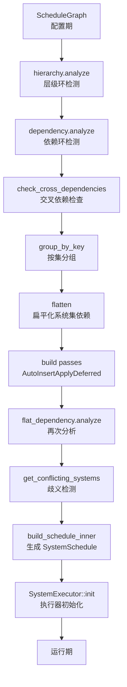
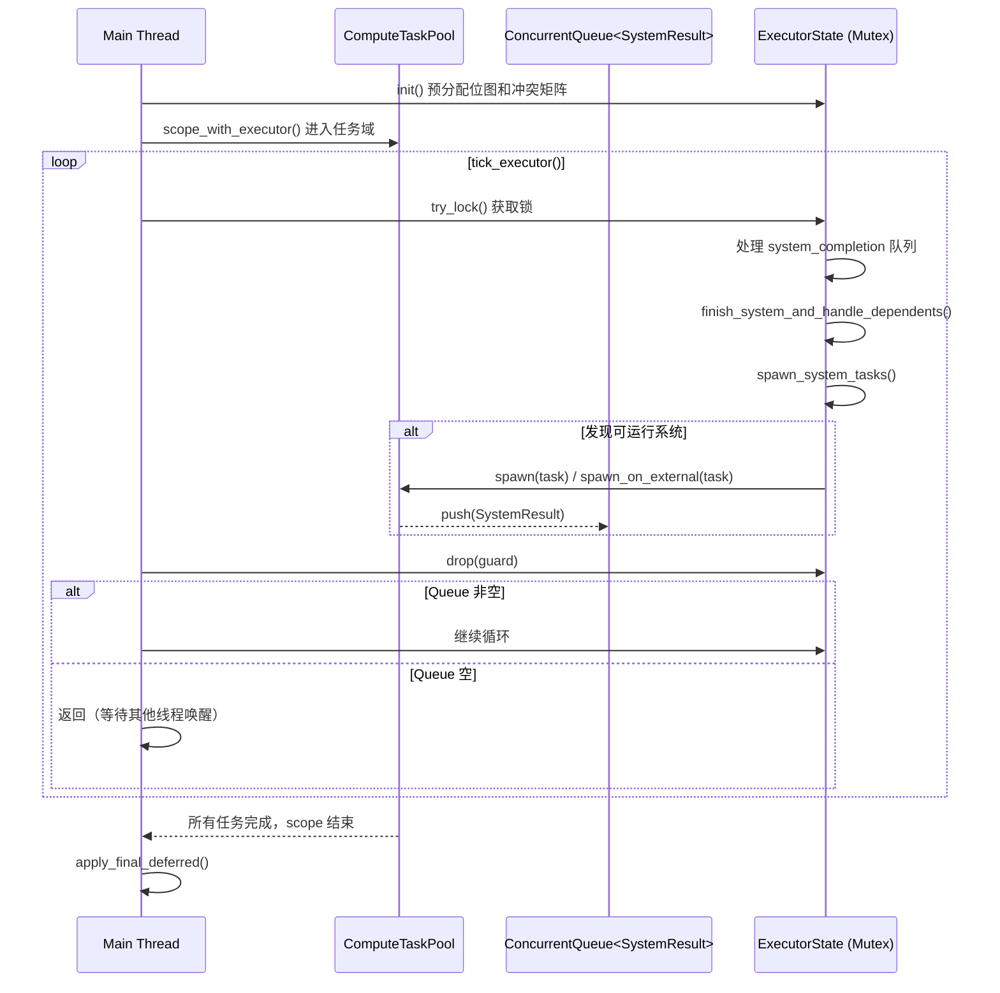

> [[Notes/Bevy/00-Bevy全解析主索引|← 返回 Bevy 全解析主索引]]

---

# Bevy `bevy_ecs` 源码解析：Schedule 与 System 并行调度

> **分析范围**：`bevy_ecs` crate 的 `schedule` 模块——从系统配置到并行执行的全链路。
> **分析轮次**：三轮完整分析（接口层 → 数据层 → 逻辑层）。
> **源码版本**：Bevy 0.19.0-dev（`main` 分支）。

---

## 零、Schedule 是什么？为什么需要它？

在 ECS 架构中，**System** 是处理逻辑的普通函数。但一个实际的游戏世界通常有几十个甚至上百个 System：处理输入的、更新物理的、检测碰撞的、渲染准备的……如果这些 System 随便跑，会出现什么问题？

- **顺序问题**：物理计算必须在碰撞检测之前完成，否则检测的是上一帧的位置。
- **数据竞争**：两个 System 同时修改同一个 `ResMut<Health>`，会导致未定义行为。
- **延迟命令**：System 通过 `Commands` 发起的结构变更（如生成实体）需要在一个合适的时机批量应用，否则其他 System 可能看到不一致的中间状态。

**Schedule** 就是 Bevy 解决这些问题的核心机制。它的职责可以概括为三点：
1. **排序**：根据开发者声明的依赖关系（`before`/`after`）和系统集层级，决定 System 的执行顺序。
2. **并行化**：基于每个 System 声明的数据访问（通过 `SystemParam` 的 `FilteredAccessSet`），静态分析出哪些 System 之间没有数据冲突，从而让它们并行执行。
3. **同步点**：在必要的位置自动插入 `ApplyDeferred`，将延迟命令批量应用到 `World`。

你可以把 Schedule 理解为一个**编译器**：输入是开发者配置的系统图（System Graph），输出是一个可执行的并行计划（SystemSchedule），而多线程执行器就是这个计划的运行时引擎。

---

## 一、模块定位与构建定义

### 1.1 目录结构

> 文件：`crates/bevy_ecs/src/schedule/mod.rs`，第 1~25 行

```rust
mod auto_insert_apply_deferred;  // 自动插入 ApplyDeferred 同步点
mod condition;                   // 系统运行条件（run_if）
mod config;                      // ScheduleConfig / IntoScheduleConfigs
mod error;                       // 构建错误与警告
mod executor;                    // 执行器（单线程 / 多线程）
mod node;                        // NodeId、Systems、SystemSets、SystemWithAccess
mod pass;                        // ScheduleBuildPass  trait
mod schedule;                    // Schedule、ScheduleGraph、SystemSchedule
mod set;                         // SystemSet、ScheduleLabel
mod stepping;                    // 调试步进支持
```

| 文件 | 职责 |
|------|------|
| `schedule.rs` | **Schedule / ScheduleGraph / SystemSchedule** 的核心定义与构建逻辑 |
| `executor/mod.rs` | `SystemExecutor` trait、`SystemSchedule`、默认执行器选择 |
| `executor/multi_threaded.rs` | **多线程执行器**：任务分派、冲突检测、完成回调 |
| `executor/single_threaded.rs` | **单线程执行器**：按拓扑顺序逐个运行 |
| `graph/dag.rs` | **DAG**（有向无环图）：拓扑排序、可达性分析、传递约简 |
| `graph/graph_map.rs` | **DiGraph / UnGraph**：邻接表 + 稀疏邻接矩阵的图结构 |
| `graph/tarjan_scc.rs` | Tarjan 强连通分量算法，用于拓扑排序和环检测 |
| `node.rs` | `NodeId`、`Systems`、`SystemSets`、`SystemWithAccess`、`ConditionWithAccess` |
| `set.rs` | `SystemSet`、`ScheduleLabel`、类型集（`SystemTypeSet`） |
| `config.rs` | `ScheduleConfig`、`IntoScheduleConfigs`、`.before()`/`.after()`/`.in_set()` 配置 |
| `auto_insert_apply_deferred.rs` | `AutoInsertApplyDeferredPass`：自动插入同步点 |
| `condition.rs` | `SystemCondition`、`BoxedCondition`：运行条件的类型系统 |

---

## 二、第一轮：接口层（What）

### 2.1 Schedule —— 调度的总入口

> 文件：`crates/bevy_ecs/src/schedule/schedule.rs`，第 382~388 行

```rust
pub struct Schedule {
    label: InternedScheduleLabel,           // 调度标签（如 Update、Startup）
    graph: ScheduleGraph,                   // 配置期的系统图（DAG）
    executable: SystemSchedule,             // 构建后的可执行计划
    executor: Box<dyn SystemExecutor>,      // 执行器（单线程或多线程）
    executor_initialized: bool,             // 执行器是否已初始化
}
```

`Schedule` 是开发者直接打交道的对象。核心公共 API：
- `Schedule::new(label)` —— 创建带标签的空 Schedule。
- `add_systems(systems)` —— 添加系统，支持 `.before()`/`.after()`/`.in_set()`/`.run_if()` 链式配置。
- `configure_sets(sets)` —— 配置系统集的层级和顺序。
- `run(world)` —— 运行调度：先 `initialize`（构建），再调用 `executor.run()`。
- `set_build_settings(settings)` —— 调整构建行为（歧义检测、自动插入 ApplyDeferred 等）。

### 2.2 ScheduleGraph —— 配置期的系统依赖图

> 文件：`crates/bevy_ecs/src/schedule/schedule.rs`，第 726~745 行

```rust
pub struct ScheduleGraph {
    pub systems: Systems,                           // 所有系统节点
    pub system_sets: SystemSets,                    // 所有系统集节点
    hierarchy: Dag<NodeId>,                         // 层级关系 DAG（哪些节点属于哪些集）
    dependency: Dag<NodeId>,                        // 显式依赖 DAG（before/after）
    set_systems: DagGroups<SystemSetKey, SystemKey>, // 按系统集分组的系统映射
    ambiguous_with: UnGraph<NodeId>,                // 允许模糊排序的节点对
    pub ambiguous_with_all: HashSet<NodeId>,        // 允许与任何系统模糊排序的节点
    conflicting_systems: ConflictingSystems,        // 检测到的歧义系统对
    anonymous_sets: usize,                          // 匿名集计数（用于元组链式配置）
    changed: bool,                                  // 图是否被修改，触发重新构建
    settings: ScheduleBuildSettings,                // 构建配置
    passes: IndexMap<TypeId, Box<dyn ScheduleBuildPassObj>, FixedHasher>, // 构建 pass
}
```

`ScheduleGraph` 是 Schedule 的**配置期数据结构**。开发者通过 `add_systems` 和 `configure_sets` 修改的就是这张图。它包含两张 DAG：
- `hierarchy`：描述**包含关系**——系统属于哪些系统集，系统集又属于哪些更大的集。
- `dependency`：描述**执行顺序**——哪些系统/集必须在哪些之前运行。

### 2.3 SystemSchedule —— 构建后的可执行计划

> 文件：`crates/bevy_ecs/src/schedule/executor/mod.rs`，第 74~107 行

```rust
pub struct SystemSchedule {
    pub(super) system_ids: Vec<SystemKey>,                          // 拓扑排序后的系统 ID
    pub(super) systems: Vec<SystemWithAccess>,                      // 系统实例（含访问权限）
    pub(super) system_conditions: Vec<Vec<ConditionWithAccess>>,    // 每个系统的运行条件
    pub(super) system_dependencies: Vec<usize>,                     // 每个系统的剩余依赖数
    pub(super) system_dependents: Vec<Vec<usize>>,                  // 每个系统的直接后继索引
    pub(super) sets_with_conditions_of_systems: Vec<FixedBitSet>,   // 系统所属的有条件集
    pub(super) set_ids: Vec<SystemSetKey>,                          // 有条件集的 ID 列表
    pub(super) set_conditions: Vec<Vec<ConditionWithAccess>>,       // 有条件集的运行条件
    pub(super) systems_in_sets_with_conditions: Vec<FixedBitSet>,   // 每个有条件集包含哪些系统
}
```

`SystemSchedule` 是 Schedule 构建流程的**产物**。与 `ScheduleGraph` 不同，它已经：
- 将系统集层级**扁平化**为系统级别的依赖。
- 完成**拓扑排序**，`system_ids` 的顺序就是合法的执行顺序。
- 预计算了每个系统的依赖数量和直接后继，供多线程执行器快速判断"何时可以启动下一个系统"。

### 2.4 SystemExecutor —— 执行策略的抽象

> 文件：`crates/bevy_ecs/src/schedule/executor/mod.rs`，第 30~43 行

```rust
pub trait SystemExecutor: Send + Sync {
    /// Schedule 构建或重建后调用一次，预分配状态
    fn init(&mut self, schedule: &SystemSchedule);
    /// 实际运行系统中的所有系统
    fn run(
        &mut self,
        schedule: &mut SystemSchedule,
        world: &mut World,
        skip_systems: Option<&FixedBitSet>,
        error_handler: fn(BevyError, ErrorContext),
    );
    /// 是否在最后统一应用 deferred buffers
    fn set_apply_final_deferred(&mut self, value: bool);
}
```

Bevy 提供两种实现：
- `SingleThreadedExecutor`：单线程顺序执行，适合 WASM 或 `multi_threaded` feature 关闭的场景。
- `MultiThreadedExecutor`：多线程并行执行，利用 `bevy_tasks::ComputeTaskPool` 分派任务。

### 2.5 NodeId —— 统一标识系统和系统集

> 文件：`crates/bevy_ecs/src/schedule/node.rs`，第 287~292 行

```rust
pub enum NodeId {
    System(SystemKey),   // 系统节点的标识
    Set(SystemSetKey),   // 系统集节点的标识
}
```

`NodeId` 是 `ScheduleGraph` 中 DAG 的**统一节点类型**。`SystemKey` 和 `SystemSetKey` 是由 `slotmap::new_key_type!` 生成的轻量句柄，保证了在 SlotMap 中 O(1) 索引且不会因删除而别名。

### 2.6 SystemSet 与 ScheduleLabel

> 文件：`crates/bevy_ecs/src/schedule/set.rs`，第 63~176 行

```rust
define_label!(
    SystemSet,
    SYSTEM_SET_INTERNER,
    extra_methods: {
        fn system_type(&self) -> Option<TypeId> { None }
        fn is_anonymous(&self) -> bool { false }
    }
);
```

- **`ScheduleLabel`**：标识一个 Schedule（如 `Update`、`PostUpdate`、`Startup`）。通过 `#[derive(ScheduleLabel)]` 创建。
- **`SystemSet`**：标识一组系统，用于批量配置顺序和条件。通过 `#[derive(SystemSet)]` 创建。
- **`SystemTypeSet`**：一种特殊的自动集，按系统函数类型分组。你不能手动添加成员或配置它。

### 2.7 ScheduleBuildSettings —— 构建配置

> 文件：`crates/bevy_ecs/src/schedule/schedule.rs`，第 1583~1610 行

```rust
pub struct ScheduleBuildSettings {
    pub ambiguity_detection: LogLevel,        // 歧义检测：Ignore / Warn / Error
    pub hierarchy_detection: LogLevel,        // 层级冗余检测
    pub auto_insert_apply_deferred: bool,     // 是否自动插入 ApplyDeferred
    pub use_shortnames: bool,                 // 报告中使用短名
    pub report_sets: bool,                    // 报告中标注系统所属集
}
```

默认情况下，`auto_insert_apply_deferred` 为 `true`，这意味着如果你写了 `system_a.before(system_b)`，而 `system_a` 使用了 `Commands`，Bevy 会自动在两者之间插入一个 `ApplyDeferred` 同步点，确保 `system_b` 能看到 `system_a` 的结构变更。

### 2.8 Dag<N> —— 有向无环图容器

> 文件：`crates/bevy_ecs/src/schedule/graph/dag.rs`，第 26~35 行

```rust
pub struct Dag<N: GraphNodeId, S: BuildHasher = FixedHasher> {
    graph: DiGraph<N, S>,       // 底层有向图
    toposort: Vec<N>,           // 缓存的拓扑排序结果
    dirty: bool,                // 图是否被修改过（需要重新排序）
}
```

`Dag` 是对 `DiGraph` 的包装，增加了**拓扑排序缓存**。当图被修改时标记为 `dirty`，下次访问拓扑排序时自动重新计算。如果图中存在环，则返回 `DiGraphToposortError::Cycle`。

### 2.9 DiGraph / UnGraph —— 图的基本结构

> 文件：`crates/bevy_ecs/src/schedule/graph/graph_map.rs`，第 72~78 行

```rust
pub struct Graph<const DIRECTED: bool, N: GraphNodeId, S = FixedHasher>
where S: BuildHasher,
{
    nodes: IndexMap<N, Vec<N::Adjacent>, S>,   // 邻接表：节点 → 邻居（含方向）
    edges: HashSet<N::Edge, S>,                  // 边集：O(1) 判断边是否存在
}
```

`Graph` 使用**邻接表 + 稀疏邻接矩阵**的混合表示，空间复杂度 O(|N| + |E|)，判断边是否存在为 O(1)。类型别名 `DiGraph`（有向）和 `UnGraph`（无向）通过常量泛型参数区分。

---

## 三、第二轮：数据层（How - Structure）

### 3.1 ScheduleGraph 的内部数据结构

`ScheduleGraph` 是理解 Schedule 构建流程的关键。它的字段可以归纳为"四张图 + 两个容器 + 配置"：

```
ScheduleGraph
├── systems: Systems                    # 系统容器（SlotMap<SystemKey, SystemNode>）
├── system_sets: SystemSets             # 系统集容器（SlotMap<SystemSetKey, SystemSetNode>）
├── hierarchy: Dag<NodeId>              # 层级 DAG：Set → System/SubSet（包含关系）
├── dependency: Dag<NodeId>             # 依赖 DAG：before/after 显式顺序约束
├── set_systems: DagGroups<SetKey, SysKey>  # 层级扁平化后的系统分组
├── ambiguous_with: UnGraph<NodeId>     # 无向图：允许歧义排序的节点对
├── ambiguous_with_all: HashSet<NodeId> # 允许与所有系统歧义的节点
├── conflicting_systems: ConflictingSystems  # 检测到的歧义冲突（构建时生成）
├── settings: ScheduleBuildSettings     # 构建配置
└── passes: IndexMap<TypeId, ...>       # 构建 pass（如 AutoInsertApplyDeferredPass）
```

#### Systems 容器

> 文件：`crates/bevy_ecs/src/schedule/node.rs`，第 445~452 行

```rust
pub struct Systems {
    nodes: SlotMap<SystemKey, SystemNode>,          // 系统节点存储
    conditions: SecondaryMap<SystemKey, Vec<ConditionWithAccess>>, // 每个系统的条件
    uninit: Vec<SystemKey>,                         // 尚未初始化的系统
}
```

`SlotMap` 是一个"删除安全"的数组：删除一个元素不会导致其他元素的键失效，且支持 O(1) 索引。`SystemNode` 持有 `Option<SystemWithAccess>`，在构建时允许临时取出系统。

#### SystemWithAccess —— 系统 + 访问权限

> 文件：`crates/bevy_ecs/src/schedule/node.rs`，第 36~42 行

```rust
pub struct SystemWithAccess {
    pub(crate) system: ScheduleSystem,      // 系统本身
    pub(crate) access: FilteredAccessSet,   // 系统初始化时返回的数据访问集合
}
```

`FilteredAccessSet` 记录了该系统会读/写哪些 `ComponentId` 和 `ResourceId`，以及是否有 `QueryFilter` 限制（如 `With<A>`、`Without<B>`）。这是**并行调度的数据基础**——两个系统的 `access` 如果不兼容，就不能同时运行。

### 3.2 SystemSchedule 的构建产物

`SystemSchedule` 是 `ScheduleGraph::build_schedule_inner()` 的输出。它的结构完全围绕"执行效率"设计：

```
SystemSchedule（拓扑排序后的数组结构）
├── system_ids: Vec<SystemKey>          # 系统 ID 按拓扑序排列
├── systems: Vec<SystemWithAccess>      # 与 system_ids 同序的系统实例
├── system_conditions: Vec<Vec<ConditionWithAccess>>  # 每个系统的条件列表
├── system_dependencies: Vec<usize>     # 每个系统还有多少前置依赖未完成
├── system_dependents: Vec<Vec<usize>>  # 每个系统的直接后继系统索引
├── sets_with_conditions_of_systems: Vec<FixedBitSet>   # 系统所属的有条件集
├── set_ids: Vec<SystemSetKey>          # 有条件集的 ID 列表
├── set_conditions: Vec<Vec<ConditionWithAccess>>       # 有条件集的条件列表
└── systems_in_sets_with_conditions: Vec<FixedBitSet>   # 每个有条件集包含哪些系统
```

**关键设计**：
- `system_dependencies` 和 `system_dependents` 使得多线程执行器可以在不扫描全图的情况下，O(1) 更新依赖计数和 O(后继数) 唤醒下游系统。
- `FixedBitSet` 替代 `HashSet<usize>`，极大降低了内存占用和位运算开销，特别适合描述"哪些系统属于哪些集"这种集合关系。

### 3.3 MultiThreadedExecutor 的运行时状态

> 文件：`crates/bevy_ecs/src/schedule/executor/multi_threaded.rs`，第 88~131 行

```rust
pub struct MultiThreadedExecutor {
    state: Mutex<ExecutorState>,                    // 受互斥锁保护的运行时状态
    system_completion: ConcurrentQueue<SystemResult>, // 系统完成事件队列
    apply_final_deferred: bool,                     // 最后是否统一 apply deferred
    panic_payload: Mutex<Option<Box<dyn Any + Send>>>, // panic 传播载荷
    starting_systems: FixedBitSet,                  // 入度为 0 的系统（可立即启动）
}

pub struct ExecutorState {
    system_task_metadata: Vec<SystemTaskMetadata>,          // 每个系统的调度元数据
    set_condition_conflicting_systems: Vec<FixedBitSet>,    // 集条件与哪些系统冲突
    local_thread_running: bool,                             // 是否有 !Send 系统在运行
    exclusive_running: bool,                                // 是否有独占系统在运行
    num_running_systems: usize,                             // 当前运行中的系统数
    num_dependencies_remaining: Vec<usize>,                 // 每个系统剩余未完成的依赖数
    evaluated_sets: FixedBitSet,                            // 已评估条件的集
    ready_systems: FixedBitSet,                             // 满足依赖且等待运行的系统
    ready_systems_copy: FixedBitSet,                        // ready_systems 的临时副本
    running_systems: FixedBitSet,                           // 正在运行的系统
    skipped_systems: FixedBitSet,                           // 因条件不满足被跳过的系统
    completed_systems: FixedBitSet,                         // 已完成（运行或跳过）的系统
    unapplied_systems: FixedBitSet,                         // 已运行但未 apply deferred 的系统
}
```

`system_task_metadata` 在 `init()` 阶段预计算，是执行器的**决策依据**：

> 文件：`crates/bevy_ecs/src/schedule/executor/multi_threaded.rs`，第 66~80 行

```rust
struct SystemTaskMetadata {
    conflicting_systems: FixedBitSet,           // 数据访问冲突的系统位图
    condition_conflicting_systems: FixedBitSet, // 条件评估时冲突的系统位图
    dependents: Vec<usize>,                     // 直接后继系统索引
    is_send: bool,                              // 是否可发送到其他线程
    is_exclusive: bool,                         // 是否需要独占 World
}
```

这些位图使得 `can_run()` 的判断变成了一系列**位集合运算**，而非遍历列表：

> 文件：`crates/bevy_ecs/src/schedule/executor/multi_threaded.rs`，第 543~578 行

```rust
fn can_run(&mut self, system_index: usize, conditions: &mut Conditions) -> bool {
    let system_meta = &self.system_task_metadata[system_index];
    if system_meta.is_exclusive && self.num_running_systems > 0 { return false; }
    if !system_meta.is_send && self.local_thread_running { return false; }
    // 检查集条件是否与运行中系统冲突
    for set_idx in conditions.sets_with_conditions_of_systems[system_index]
        .difference(&self.evaluated_sets)
    {
        if !self.set_condition_conflicting_systems[set_idx]
            .is_disjoint(&self.running_systems) { return false; }
    }
    // 检查系统条件是否与运行中系统冲突
    if !system_meta.condition_conflicting_systems.is_disjoint(&self.running_systems) {
        return false;
    }
    // 检查系统本身是否与运行中系统冲突（除非已被标记为跳过）
    if !self.skipped_systems.contains(system_index)
        && !system_meta.conflicting_systems.is_disjoint(&self.running_systems)
    { return false; }
    true
}
```

### 3.4 DagAnalysis —— DAG 的全分析结果

> 文件：`crates/bevy_ecs/src/schedule/graph/dag.rs`，第 253~266 行

```rust
pub struct DagAnalysis<N: GraphNodeId, S: BuildHasher = FixedHasher> {
    reachable: FixedBitSet,             // 布尔可达性矩阵
    connected: HashSet<(N, N), S>,      // 存在路径连接的节点对
    disconnected: Vec<(N, N)>,          // 不存在路径连接的节点对（用于歧义检测）
    transitive_edges: Vec<(N, N)>,      // 传递冗余的边（可通过其他路径到达）
    transitive_reduction: DiGraph<N, S>, // 传递约简图（移除所有冗余边）
    transitive_closure: DiGraph<N, S>,   // 传递闭包图（添加所有隐式边）
}
```

`DagAnalysis` 在 Schedule 构建时通过 Habib-Morvan-Rampon 算法一次性计算。它为后续的**环检测**、**冗余边移除**、**交叉依赖检查**和**歧义检测**提供了全部所需信息。

---

## 四、第三轮：逻辑层（How - Behavior）

### 4.1 Schedule 构建总流程

Schedule 的构建发生在**首次运行**或**图被修改后**。入口是 `Schedule::initialize()`：

> 文件：`crates/bevy_ecs/src/schedule/schedule.rs`，第 601~631 行

```rust
pub fn initialize(&mut self, world: &mut World)
    -> Result<Option<ScheduleBuildMetadata>, ScheduleBuildError>
{
    if self.graph.changed {
        self.graph.initialize(world);
        let ignored_ambiguities = world
            .get_resource_or_init::<Schedules>()
            .ignored_scheduling_ambiguities.clone();
        let mut event = ScheduleBuilt {
            label: self.label,
            build_metadata: self.graph.update_schedule(
                world, &mut self.executable, &ignored_ambiguities, self.label
            )?,
        };
        self.graph.changed = false;
        self.executor_initialized = false;
        world.trigger_ref(&mut event);
        build_metadata = Some(event.build_metadata);
    }
    if !self.executor_initialized {
        self.executor.init(&self.executable);
        self.executor_initialized = true;
    }
    Ok(build_metadata)
}
```

构建分为两个阶段：
1. **`ScheduleGraph::build_schedule()`**：将配置图转换为可执行计划。
2. **`SystemExecutor::init()`**：执行器根据 `SystemSchedule` 预分配运行时状态。

#### 阶段一：build_schedule() 的详细步骤

> 文件：`crates/bevy_ecs/src/schedule/schedule.rs`，第 1155~1271 行

```rust
pub fn build_schedule(...) -> Result<(SystemSchedule, ScheduleBuildMetadata), ScheduleBuildError> {
    // 1. 层级 DAG 分析：检测环和冗余边
    let hierarchy_analysis = self.hierarchy.analyze()
        .map_err(ScheduleBuildError::HierarchySort)?;
    // 2. 冗余层级检测与移除
    if self.settings.hierarchy_detection != LogLevel::Ignore {
        hierarchy_analysis.check_for_redundant_edges()?;
    }
    self.hierarchy.remove_redundant_edges(&hierarchy_analysis);
    // 3. 依赖 DAG 分析：检测环
    let dependency_analysis = self.dependency.analyze()
        .map_err(ScheduleBuildError::DependencySort)?;
    // 4. 检查交叉依赖（共享系统但存在排序约束的系统集）
    dependency_analysis.check_for_cross_dependencies(&hierarchy_analysis)?;
    // 5. 按系统集分组系统
    self.set_systems = self.hierarchy.group_by_key(self.system_sets.len())?;
    dependency_analysis.check_for_overlapping_groups(&self.set_systems)?;
    // 6. 扁平化：将系统集依赖展开为系统级别依赖
    let mut flat_dependency = self.set_systems.flatten(self.dependency.clone(), ...);
    // 7. 执行构建 pass（如 AutoInsertApplyDeferredPass）
    for pass in passes.values_mut() {
        pass.build(world, self, FlattenedDependencies { dag: &mut flat_dependency, ... })?;
    }
    // 8. 再次分析扁平化后的依赖
    let flat_dependency_analysis = flat_dependency.analyze()?;
    flat_dependency.remove_redundant_edges(&flat_dependency_analysis);
    // 9. 歧义检测：找出未排序但数据冲突的系统对
    self.conflicting_systems = self.systems.get_conflicting_systems(
        &flat_dependency_analysis, &flat_ambiguous_with, &self.ambiguous_with_all,
        ignored_ambiguities
    );
    // 10. 生成 SystemSchedule
    Ok((self.build_schedule_inner(flat_dependency, hierarchy_analysis), ...))
}
```

这个流程可以用下图概括：



#### 阶段二：build_schedule_inner() —— 生成执行数组

> 文件：`crates/bevy_ecs/src/schedule/schedule.rs`，第 1273~1366 行

```rust
fn build_schedule_inner(&self, flat_dependency: Dag<SystemKey>, hierarchy_analysis: DagAnalysis<NodeId>)
    -> SystemSchedule
{
    // 1. 获取拓扑排序后的系统 ID
    let dg_system_ids = flat_dependency.get_toposort().unwrap().to_vec();
    let dg_system_idx_map: HashMap<SystemKey, usize> = /* ID → 索引映射 */;
    // 2. 获取层级拓扑排序，提取有条件集
    let hierarchy_toposort = self.hierarchy.get_toposort().unwrap();
    let (hg_set_with_conditions_idxs, hg_set_ids): (Vec<_>, Vec<_>) = /* ... */;
    // 3. 计算每个系统的依赖数和后继
    let mut system_dependencies = Vec::with_capacity(sys_count);
    let mut system_dependents = Vec::with_capacity(sys_count);
    for &sys_key in &dg_system_ids {
        let num_dependencies = flat_dependency.neighbors_directed(sys_key, Incoming).count();
        let dependents = flat_dependency.neighbors_directed(sys_key, Outgoing)
            .map(|dep_id| dg_system_idx_map[&dep_id]).collect();
        system_dependencies.push(num_dependencies);
        system_dependents.push(dependents);
    }
    // 4. 计算层级可达性矩阵：系统 ↔ 有条件集的关系
    let mut systems_in_sets_with_conditions = vec![FixedBitSet::with_capacity(sys_count); set_count];
    let mut sets_with_conditions_of_systems = vec![FixedBitSet::with_capacity(set_count); sys_count];
    // ... 使用 hierarchy_analysis.reachable() 填充位图 ...
    SystemSchedule { systems: Vec::with_capacity(sys_count), ... }
}
```

`build_schedule_inner` 的核心任务是将**图结构**转换为**数组结构**。它预计算了多线程执行器需要的一切：
- 拓扑序 ID 列表
- 依赖计数（用于倒计时归零触发下游）
- 后继列表（用于快速通知下游）
- 集条件位图（用于快速判断系统是否属于未评估的条件集）

### 4.2 多线程执行器的工作流程

多线程执行器是 Bevy ECS 并行调度的核心。它的运行时循环基于**生产者-消费者模式**：



#### 启动系统：spawn_system_tasks()

> 文件：`crates/bevy_ecs/src/schedule/executor/multi_threaded.rs`，第 440~541 行

```rust
unsafe fn spawn_system_tasks(&mut self, context: &Context, conditions: &mut Conditions) {
    if self.exclusive_running { return; }  // 独占系统运行中，不启动任何新系统
    let mut ready_systems = core::mem::take(&mut self.ready_systems_copy);
    let mut check_for_new_ready_systems = true;
    while check_for_new_ready_systems {
        check_for_new_ready_systems = false;
        ready_systems.clone_from(&self.ready_systems);
        for system_index in ready_systems.ones() {
            let system = &mut unsafe { &mut *context.environment.systems[system_index].get() }.system;
            if !self.can_run(system_index, conditions) { continue; }
            self.ready_systems.remove(system_index);
            if !self.should_run(system_index, system, conditions, world, error_handler) {
                self.skip_system_and_signal_dependents(system_index);
                check_for_new_ready_systems = true;
                continue;
            }
            self.running_systems.insert(system_index);
            self.num_running_systems += 1;
            if self.system_task_metadata[system_index].is_exclusive {
                unsafe { self.spawn_exclusive_system_task(context, system_index); }
                break;  // 独占系统一次只能运行一个
            }
            unsafe { self.spawn_system_task(context, system_index); }
        }
    }
    self.ready_systems_copy = ready_systems;
}
```

这段代码展示了执行器的核心调度逻辑：
1. **独占系统阻塞**：如果当前有 `exclusive` 系统在运行，直接返回，不启动任何新系统。
2. **条件评估**：在 `can_run` 之后调用 `should_run`，评估系统集条件和系统条件。如果条件不满足，标记为跳过并立即通知下游（这可能导致新的系统变为 ready）。
3. **任务提交**：非独占系统通过 `spawn_system_task` 提交到线程池；独占系统通过 `spawn_exclusive_system_task` 在 scope 线程上运行（因为它需要 `&mut World`）。

#### 普通系统任务的提交

> 文件：`crates/bevy_ecs/src/schedule/executor/multi_threaded.rs`，第 650~690 行

```rust
unsafe fn spawn_system_task(&mut self, context: &Context, system_index: usize) {
    let system = &mut unsafe { &mut *context.environment.systems[system_index].get() }.system;
    let context = *context;  // Copy Context（全是引用，实现 Copy）
    let task = async move {
        let res = std::panic::catch_unwind(AssertUnwindSafe(|| {
            unsafe {
                if let Err(RunSystemError::Failed(err)) =
                    __rust_begin_short_backtrace::run_unsafe(system, context.environment.world_cell)
                {
                    (context.error_handler)(err, ErrorContext::System { name: system.name(), ... });
                }
            }
        }));
        context.system_completed(system_index, res, system);
    };
    if system_meta.is_send {
        context.scope.spawn(task);             // 提交到线程池
    } else {
        self.local_thread_running = true;
        context.scope.spawn_on_external(task); // 提交到外部线程（主线程）
    }
}
```

这里有几个关键设计：
- **`UnsafeWorldCell`**：非独占系统通过 `run_unsafe` 运行，使用 `UnsafeWorldCell` 进行受控的 World 访问。执行器通过静态分析保证同时运行的系统之间数据不冲突。
- **`AssertUnwindSafe` + `catch_unwind`**：捕获 System 中的 panic，防止单个系统崩溃导致整个引擎退出。
- **`system_completed` 回调**：系统完成后通过 `ConcurrentQueue` 通知执行器，触发下一轮调度。

#### 独占系统任务的提交

> 文件：`crates/bevy_ecs/src/schedule/executor/multi_threaded.rs`，第 694~739 行

```rust
unsafe fn spawn_exclusive_system_task(&mut self, context: &Context, system_index: usize) {
    let system = &mut unsafe { &mut *context.environment.systems[system_index].get() }.system;
    let context = *context;
    if is_apply_deferred(&**system) {
        let unapplied_systems = self.unapplied_systems.clone();
        self.unapplied_systems.clear();
        let task = async move {
            let world = unsafe { context.environment.world_cell.world_mut() };
            let res = apply_deferred(&unapplied_systems, context.environment.systems, world);
            context.system_completed(system_index, res, system);
        };
        context.scope.spawn_on_scope(task);  // 在 scope 线程上运行
    } else {
        let task = async move {
            let world = unsafe { context.environment.world_cell.world_mut() };
            let res = std::panic::catch_unwind(...);
            context.system_completed(system_index, res, system);
        };
        context.scope.spawn_on_scope(task);
    }
    self.exclusive_running = true;
    self.local_thread_running = true;
}
```

独占系统需要 `&mut World`，因此必须在**没有其他系统运行**时才能启动。`spawn_on_scope` 确保它在创建 `scope` 的线程上执行（即主线程），而 `world_mut()` 通过 unsafe 转换获取可变引用——这是安全的，因为 `can_run` 已确保此时没有任何其他系统持有 World 的引用。

#### 完成处理与下游触发

> 文件：`crates/bevy_ecs/src/schedule/executor/multi_threaded.rs`，第 741~775 行

```rust
fn finish_system_and_handle_dependents(&mut self, result: SystemResult) {
    let system_index = result.system_index;
    if self.system_task_metadata[system_index].is_exclusive {
        self.exclusive_running = false;
    }
    if !self.system_task_metadata[system_index].is_send {
        self.local_thread_running = false;
    }
    self.num_running_systems -= 1;
    self.running_systems.remove(system_index);
    self.completed_systems.insert(system_index);
    self.unapplied_systems.insert(system_index);
    self.signal_dependents(system_index);  // 通知下游系统
}

fn signal_dependents(&mut self, system_index: usize) {
    for &dep_idx in &self.system_task_metadata[system_index].dependents {
        let remaining = &mut self.num_dependencies_remaining[dep_idx];
        *remaining -= 1;
        if *remaining == 0 && !self.completed_systems.contains(dep_idx) {
            self.ready_systems.insert(dep_idx);  // 依赖全部完成，变为就绪
        }
    }
}
```

当一个系统完成时，执行器会遍历它的所有直接后继，将它们的 `num_dependencies_remaining` 减一。如果某个后继的计数归零，就将其插入 `ready_systems`，下一轮 `spawn_system_tasks` 就会尝试启动它。

### 4.3 单线程执行器的工作流程

> 文件：`crates/bevy_ecs/src/schedule/executor/single_threaded.rs`，第 50~170 行

```rust
fn run(&mut self, schedule: &mut SystemSchedule, world: &mut World, ...) {
    for system_index in 0..schedule.systems.len() {
        let system = &mut schedule.systems[system_index].system;
        // 1. 评估系统集条件
        let mut should_run = !self.completed_systems.contains(system_index);
        for set_idx in schedule.sets_with_conditions_of_systems[system_index].ones() {
            if self.evaluated_sets.contains(set_idx) { continue; }
            let set_conditions_met = evaluate_and_fold_conditions(
                &mut schedule.set_conditions[set_idx], world, error_handler, system, true
            );
            if !set_conditions_met {
                self.completed_systems.union_with(&schedule.systems_in_sets_with_conditions[set_idx]);
            }
            should_run &= set_conditions_met;
            self.evaluated_sets.insert(set_idx);
        }
        // 2. 评估系统条件
        let system_conditions_met = evaluate_and_fold_conditions(...);
        should_run &= system_conditions_met;
        self.completed_systems.insert(system_index);
        if !should_run { continue; }
        // 3. 运行系统或 ApplyDeferred
        if is_apply_deferred(&**system) {
            self.apply_deferred(schedule, world);
            continue;
        }
        __rust_begin_short_backtrace::run_without_applying_deferred(system, world);
        self.unapplied_systems.insert(system_index);
    }
    if self.apply_final_deferred {
        self.apply_deferred(schedule, world);
    }
}
```

单线程执行器逻辑非常简单：**按 `system_ids` 的顺序逐个运行**。由于 `SystemSchedule` 已经按拓扑序排列，所以天然满足依赖关系。不需要冲突检测，因为没有并行。它的优势是**零调度开销**——没有锁、没有队列、没有任务切换。

### 4.4 依赖图构建：从声明到扁平化

Bevy 允许开发者在三个层面声明依赖关系：

#### 层面 1：显式依赖（before / after）

> 文件：`crates/bevy_ecs/src/schedule/config.rs`，第 128~158 行

```rust
fn before_inner(&mut self, set: InternedSystemSet) {
    match self {
        Self::ScheduleConfig(config) => {
            config.metadata.dependencies.push(Dependency::new(DependencyKind::Before, set));
        }
        Self::Configs { configs, .. } => {
            for config in configs { config.before_inner(set); }
        }
    }
}
```

当调用 `system_a.before(system_b)` 时，`system_a` 的 `ScheduleConfig` 会记录一个 `Dependency { kind: Before, set: system_b }`。注意这里的 `set` 可以是单个系统，也可以是系统集。

#### 层面 2：层级关系（in_set）

> 文件：`crates/bevy_ecs/src/schedule/config.rs`，第 113~127 行

```rust
fn in_set_inner(&mut self, set: InternedSystemSet) {
    match self {
        Self::ScheduleConfig(config) => { config.metadata.hierarchy.push(set); }
        Self::Configs { configs, .. } => {
            for config in configs { config.in_set_inner(set); }
        }
    }
}
```

`in_set` 将系统或集注册为另一个集的成员，这条边进入 `hierarchy` DAG。

#### 层面 3：扁平化（Flatten）—— 合并为一张系统级 DAG

> 文件：`crates/bevy_ecs/src/schedule/schedule.rs`，第 1206~1230 行

```rust
let mut flat_dependency = self.set_systems.flatten(
    self.dependency.clone(),
    |set, systems, flattening, temp| {
        for pass in self.passes.values_mut() {
            pass.collapse_set(set, systems, flattening, temp);
        }
    }
);
```

`DagGroups::flatten()` 将 `dependency` DAG 中所有**系统集节点**替换为其成员系统。例如：
- 如果 `SetA`（包含 `sys1`, `sys2`）`before` `SetB`（包含 `sys3`, `sys4`）
- 扁平化后生成四条边：`sys1→sys3`, `sys1→sys4`, `sys2→sys3`, `sys2→sys4`

这一步之后，`flat_dependency` 只包含 `SystemKey` 节点，不再有 `SystemSetKey`。

### 4.5 歧义检测（Ambiguity Detection）

歧义检测解决的是：**两个系统存在数据访问冲突，但 Schedule 没有通过 before/after 或层级关系为它们确定顺序**。

> 文件：`crates/bevy_ecs/src/schedule/node.rs`，第 585~630 行

```rust
pub fn get_conflicting_systems(
    &self,
    flat_dependency_analysis: &DagAnalysis<SystemKey>,
    flat_ambiguous_with: &UnGraph<SystemKey>,
    ambiguous_with_all: &HashSet<NodeId>,
    ignored_ambiguities: &BTreeSet<ComponentId>,
) -> ConflictingSystems {
    let mut conflicting_systems = Vec::new();
    // 遍历所有在扁平化依赖图中"不连通"的系统对
    for &(a, b) in flat_dependency_analysis.disconnected() {
        // 如果这对被显式声明为允许歧义，跳过
        if flat_ambiguous_with.contains_edge(a, b)
            || ambiguous_with_all.contains(&NodeId::System(a))
            || ambiguous_with_all.contains(&NodeId::System(b))
        { continue; }
        let system_a = &self[a];
        let system_b = &self[b];
        // 独占系统与任何其他未排序系统都视为冲突
        if system_a.is_exclusive() || system_b.is_exclusive() {
            conflicting_systems.push((a, b, Box::new([])));
        } else if !system_a.access.is_compatible(&system_b.access) {
            // 检查具体冲突的 ComponentId
            match system_a.access.get_conflicts(&system_b.access) {
                AccessConflicts::Individual(conflicts) => {
                    let conflicts: Box<[_]> = conflicts.iter()
                        .filter(|id| !ignored_ambiguities.contains(id))
                        .collect();
                    if !conflicts.is_empty() {
                        conflicting_systems.push((a, b, conflicts));
                    }
                }
                AccessConflicts::All => {
                    conflicting_systems.push((a, b, Box::new([])));
                }
            }
        }
    }
    ConflictingSystems(conflicting_systems)
}
```

**检测逻辑**：
1. 从 `DagAnalysis::disconnected()` 获取所有**没有路径连接**的系统对（即既非 `a→b` 也非 `b→a`）。
2. 排除被 `ambiguous_with` 或 `ambiguous_with_all` 豁免的系统对。
3. 如果任一系统是 `exclusive`，直接标记为冲突（独占系统会锁定整个 World）。
4. 否则比较两者的 `FilteredAccessSet`：
   - `is_compatible()` 返回 `false` 表示存在冲突。
   - `get_conflicts()` 返回具体冲突的 `ComponentId` 列表。
   - 开发者可以通过 `ignored_ambiguities` 全局忽略某些组件类型的冲突（如内部标记组件）。

### 4.6 自动插入 ApplyDeferred

> 文件：`crates/bevy_ecs/src/schedule/auto_insert_apply_deferred.rs`，第 72~219 行

```rust
fn build(&mut self, _world: &mut World, graph: &mut ScheduleGraph,
         mut dependency_flattened: FlattenedDependencies<'_>) -> Result<(), ScheduleBuildError> {
    let (topo, flat_dependency) = dependency_flattened.toposort_and_graph()?;
    // 计算每个节点的 "distance"（到起点的同步点数量）
    let mut distances_and_pending_sync: HashMap<SystemKey, (u32, bool)> = ...;
    for &key in topo.iter() {
        let (node_distance, mut node_needs_sync) = ...;
        if is_valid_explicit_sync_point(key) {
            distance_to_explicit_sync_node.insert(node_distance, key);
            node_needs_sync = false;
        } else if !node_needs_sync {
            node_needs_sync = graph.systems[key].has_deferred();  // 系统是否有延迟参数
        }
        for target in flat_dependency.neighbors_directed(key, Outgoing) {
            let mut edge_needs_sync = node_needs_sync;
            // 如果边标记了 IgnoreDeferred，推迟同步到后面的边
            if node_needs_sync && self.no_sync_edges.contains(&(NodeId::System(key), NodeId::System(target))) {
                *target_pending_sync = true;
                edge_needs_sync = false;
            }
            let mut weight = 0;
            if edge_needs_sync || is_valid_explicit_sync_point(target) { weight = 1; }
            *target_distance = (node_distance + weight).max(*target_distance);
        }
    }
    // 在 distance 不同的相邻节点之间插入 ApplyDeferred
    for &key in topo.iter() {
        for target in flat_dependency.neighbors_directed(key, Outgoing) {
            if distances[&key].0 == distances[&target].0 { continue; }
            if is_apply_deferred(&graph.systems[target]) { continue; }
            let sync_point = distance_to_explicit_sync_node.get(&target_distance)
                .copied().unwrap_or_else(|| self.get_sync_point(graph, target_distance));
            dependency_flattened.add_edge(key, sync_point);
            dependency_flattened.add_edge(sync_point, target);
            dependency_flattened.remove_edge(key, target);
        }
    }
    Ok(())
}
```

`AutoInsertApplyDeferredPass` 的核心算法是**基于 distance 的同步点插入**：
1. 对每个节点计算 `distance`——从起点到该节点路径上经过的同步点数量。
2. 如果一个系统使用了 `Commands` 等延迟参数，它会将其出边的目标 distance 增加 1（意味着需要一个同步点）。
3. 遍历所有边：如果边的两端 distance 不同，说明需要一个同步点。如果目标已经是 `ApplyDeferred`，则不需要插入。
4. 插入后，原边被替换为 `源 → 同步点 → 目标`。

这保证了：**如果 system_a 使用了 Commands 且 system_b 依赖 system_a，那么 system_b 一定运行在 ApplyDeferred 之后，从而看到所有结构变更**。

### 4.7 任务窃取与 bevy_tasks 的集成

Bevy 的多线程执行器并不直接管理线程，而是依赖 `bevy_tasks` crate 提供的 `ComputeTaskPool`：

> 文件：`crates/bevy_ecs/src/schedule/executor/multi_threaded.rs`，第 274~288 行

```rust
ComputeTaskPool::get_or_init(TaskPool::default).scope_with_executor(
    false,                              // 是否让当前线程也执行任务
    thread_executor,                    // 主线程执行器（用于 !Send 系统）
    |scope| {
        let context = Context { environment, scope, error_handler };
        context.tick_executor();        // 启动第一轮调度
    },
);
```

`scope_with_executor` 创建一个**任务域（scope）**：
- 域内的所有 `spawn` 任务会被分发到 `ComputeTaskPool` 的工作线程。
- 域会阻塞直到所有任务完成。
- `thread_executor` 参数允许将某些任务固定到"外部线程"（即调用 `scope` 的线程），用于运行访问 `!Send` 数据的系统。

任务窃取（Work Stealing）由 `bevy_tasks` 内部的线程池实现：每个工作线程有自己的局部队列，当队列空时从其他线程"窃取"任务。这使得负载能够自动均衡，而不需要执行器显式分配任务给特定线程。

---

## 五、关联辐射（Context）

### 5.1 与上层模块的关系

| 上层模块 | 交互方式 | 说明 |
|---------|---------|------|
| `bevy_app` | `App` 持有 `Schedules` Resource | `App::add_systems(Update, system)` 等价于 `schedules.entry(Update).add_systems(system)`；`App::run()` 循环调用 `world.run_schedule(Update)`。 |
| `bevy_tasks` | `ComputeTaskPool` / `TaskPool` / `Scope` | 多线程执行器依赖 `bevy_tasks` 提供的线程池和任务域 API。`scope_with_executor` 是并发的核心入口。 |
| `bevy_ecs::system` | `System` trait / `SystemParam` / `FilteredAccessSet` | Schedule 的并行分析完全依赖 `System::initialize()` 返回的 `FilteredAccessSet`。`SystemParam` 的 `ReadOnlySystemParam` / `Write` / `Read` 声明决定了系统的冲突关系。 |
| `bevy_ecs::world` | `World` / `UnsafeWorldCell` | 执行器通过 `UnsafeWorldCell` 让非独占系统并行访问 World，通过独占系统获取 `&mut World`。 |

### 5.2 与下层模块的关系

`schedule` 模块是 `bevy_ecs` 的上层，它依赖：
- `graph/` 子模块提供的 `Dag`、`DiGraph`、`DagAnalysis` 等图算法。
- `node.rs` 中的 `Systems`、`SystemSets` 容器。
- `config.rs` 中的配置 trait 和宏支持。

但它**不依赖渲染、输入、窗口等上层模块**，使得 `bevy_ecs` 可以独立使用（如服务端逻辑）。

### 5.3 跨引擎对照

| 维度 | Bevy (bevy_ecs) | Unreal Engine | chaos |
|------|-----------------|---------------|-------|
| **调度描述** | ScheduleGraph（DAG）+ 配置宏 | Tick Group + Blueprint 事件图 | 自定义 TaskGraph |
| **并行粒度** | System 级（基于 `FilteredAccessSet` 静态分析） | Actor/Component 级（多线程 tick） | 任务级（手动标记依赖） |
| **依赖声明** | `.before()` / `.after()` / `.in_set()` | Tick Group 优先级 + 手动事件绑定 | 手动 `AddDependency()` |
| **延迟执行** | `Commands` + 自动 `ApplyDeferred` | 直接修改（非延迟） | `CommandBuffer` + 手动 flush |
| **图算法** | DAG 拓扑排序 + Tarjan SCC | 优先级排序 | 拓扑排序 |
| **执行模型** | 线程池 + 任务窃取（`bevy_tasks`） | 工作线程池（`FQueuedThreadPool`） | 自定义线程池 |
| **条件系统** | `.run_if()` 条件 + 系统集条件 | Blueprint Branch / Gate 节点 | 手动条件判断 |

### 5.4 设计亮点总结

1. **配置期与运行期分离**：`ScheduleGraph` 是配置期的"源码"，`SystemSchedule` 是运行期的"机器码"。构建一次、运行多次，避免了每次运行都重新分析依赖。
2. **DAG 全分析预计算**：`DagAnalysis` 一次性计算可达性矩阵、传递约简和传递闭包，为环检测、冗余边移除、歧义检测提供完整信息。
3. **位图驱动的并行调度**：`FixedBitSet` 广泛用于描述系统冲突、就绪状态、运行状态，将冲突检测和依赖唤醒转化为高效的位运算。
4. **静态分析决定并行性**：基于 `SystemParam` 的 `FilteredAccessSet` 在编译期/初始化期就确定了系统的读写依赖，运行时无需动态锁。
5. **自动同步点**：`AutoInsertApplyDeferredPass` 基于 distance 算法自动在依赖链中插入同步点，开发者无需手动管理 `Commands` 的 flush 时机。
6. **独占与非独占混合**：`exclusive` 系统可以安全地获取 `&mut World`，与非独占系统共存于同一个 Schedule，执行器自动串行化。
7. **条件系统的惰性评估**：系统集条件和系统条件在系统即将运行时才评估，且结果被缓存（`evaluated_sets`），避免重复计算。

---

## 六、关键源码片段

### 6.1 Schedule 的三层结构

> 文件：`crates/bevy_ecs/src/schedule/schedule.rs`，第 382~388 行、第 726~745 行

```rust
// Schedule：开发者接口
pub struct Schedule {
    label: InternedScheduleLabel,
    graph: ScheduleGraph,         // 配置期
    executable: SystemSchedule,   // 运行期（构建产物）
    executor: Box<dyn SystemExecutor>,
    executor_initialized: bool,
}

// ScheduleGraph：配置期的系统依赖图
pub struct ScheduleGraph {
    pub systems: Systems,
    pub system_sets: SystemSets,
    hierarchy: Dag<NodeId>,       // 层级关系
    dependency: Dag<NodeId>,      // 显式依赖
    set_systems: DagGroups<SystemSetKey, SystemKey>,
    ambiguous_with: UnGraph<NodeId>,
    conflicting_systems: ConflictingSystems,
    settings: ScheduleBuildSettings,
    passes: IndexMap<TypeId, Box<dyn ScheduleBuildPassObj>, FixedHasher>,
}
```

### 6.2 SystemSchedule：构建后的可执行数组

> 文件：`crates/bevy_ecs/src/schedule/executor/mod.rs`，第 74~107 行

```rust
pub struct SystemSchedule {
    pub(super) system_ids: Vec<SystemKey>,
    pub(super) systems: Vec<SystemWithAccess>,
    pub(super) system_conditions: Vec<Vec<ConditionWithAccess>>,
    pub(super) system_dependencies: Vec<usize>,
    pub(super) system_dependents: Vec<Vec<usize>>,
    pub(super) sets_with_conditions_of_systems: Vec<FixedBitSet>,
    pub(super) set_ids: Vec<SystemSetKey>,
    pub(super) set_conditions: Vec<Vec<ConditionWithAccess>>,
    pub(super) systems_in_sets_with_conditions: Vec<FixedBitSet>,
}
```

### 6.3 MultiThreadedExecutor 的核心状态

> 文件：`crates/bevy_ecs/src/schedule/executor/multi_threaded.rs`，第 88~131 行

```rust
pub struct MultiThreadedExecutor {
    state: Mutex<ExecutorState>,
    system_completion: ConcurrentQueue<SystemResult>,
    apply_final_deferred: bool,
    panic_payload: Mutex<Option<Box<dyn Any + Send>>>,
    starting_systems: FixedBitSet,
}

pub struct ExecutorState {
    system_task_metadata: Vec<SystemTaskMetadata>,
    set_condition_conflicting_systems: Vec<FixedBitSet>,
    local_thread_running: bool,
    exclusive_running: bool,
    num_running_systems: usize,
    num_dependencies_remaining: Vec<usize>,
    evaluated_sets: FixedBitSet,
    ready_systems: FixedBitSet,
    ready_systems_copy: FixedBitSet,
    running_systems: FixedBitSet,
    skipped_systems: FixedBitSet,
    completed_systems: FixedBitSet,
    unapplied_systems: FixedBitSet,
}
```

### 6.4 多线程执行器的 can_run 判断

> 文件：`crates/bevy_ecs/src/schedule/executor/multi_threaded.rs`，第 543~578 行

```rust
fn can_run(&mut self, system_index: usize, conditions: &mut Conditions) -> bool {
    let system_meta = &self.system_task_metadata[system_index];
    if system_meta.is_exclusive && self.num_running_systems > 0 { return false; }
    if !system_meta.is_send && self.local_thread_running { return false; }
    for set_idx in conditions.sets_with_conditions_of_systems[system_index]
        .difference(&self.evaluated_sets)
    {
        if !self.set_condition_conflicting_systems[set_idx].is_disjoint(&self.running_systems) {
            return false;
        }
    }
    if !system_meta.condition_conflicting_systems.is_disjoint(&self.running_systems) {
        return false;
    }
    if !self.skipped_systems.contains(system_index)
        && !system_meta.conflicting_systems.is_disjoint(&self.running_systems)
    { return false; }
    true
}
```

### 6.5 歧义检测核心逻辑

> 文件：`crates/bevy_ecs/src/schedule/node.rs`，第 585~630 行

```rust
pub fn get_conflicting_systems(...) -> ConflictingSystems {
    let mut conflicting_systems = Vec::new();
    for &(a, b) in flat_dependency_analysis.disconnected() {
        if flat_ambiguous_with.contains_edge(a, b)
            || ambiguous_with_all.contains(&NodeId::System(a))
            || ambiguous_with_all.contains(&NodeId::System(b))
        { continue; }
        let system_a = &self[a];
        let system_b = &self[b];
        if system_a.is_exclusive() || system_b.is_exclusive() {
            conflicting_systems.push((a, b, Box::new([])));
        } else if !system_a.access.is_compatible(&system_b.access) {
            match system_a.access.get_conflicts(&system_b.access) {
                AccessConflicts::Individual(conflicts) => {
                    let conflicts: Box<[_]> = conflicts.iter()
                        .filter(|id| !ignored_ambiguities.contains(id))
                        .collect();
                    if !conflicts.is_empty() {
                        conflicting_systems.push((a, b, conflicts));
                    }
                }
                AccessConflicts::All => {
                    conflicting_systems.push((a, b, Box::new([])));
                }
            }
        }
    }
    ConflictingSystems(conflicting_systems)
}
```

### 6.6 自动插入 ApplyDeferred 的 distance 算法

> 文件：`crates/bevy_ecs/src/schedule/auto_insert_apply_deferred.rs`，第 118~179 行

```rust
let mut distances_and_pending_sync: HashMap<SystemKey, (u32, bool)> = ...;
for &key in topo.iter() {
    let (node_distance, mut node_needs_sync) = distances_and_pending_sync.get(&key).copied().unwrap_or_default();
    if is_valid_explicit_sync_point(key) {
        distance_to_explicit_sync_node.insert(node_distance, key);
        node_needs_sync = false;
    } else if !node_needs_sync {
        node_needs_sync = graph.systems[key].has_deferred();
    }
    for target in flat_dependency.neighbors_directed(key, Direction::Outgoing) {
        let (target_distance, target_pending_sync) = distances_and_pending_sync.entry(target).or_default();
        let mut edge_needs_sync = node_needs_sync;
        if node_needs_sync && !graph.systems[target].is_exclusive()
            && self.no_sync_edges.contains(&(NodeId::System(key), NodeId::System(target)))
        {
            *target_pending_sync = true;
            edge_needs_sync = false;
        }
        let mut weight = 0;
        if edge_needs_sync || is_valid_explicit_sync_point(target) { weight = 1; }
        *target_distance = (node_distance + weight).max(*target_distance);
    }
}
```

### 6.7 DAG 的拓扑排序与缓存

> 文件：`crates/bevy_ecs/src/schedule/graph/dag.rs`，第 26~109 行

```rust
pub struct Dag<N: GraphNodeId, S: BuildHasher = FixedHasher> {
    graph: DiGraph<N, S>,
    toposort: Vec<N>,
    dirty: bool,
}

impl<N: GraphNodeId, S: BuildHasher> Dag<N, S> {
    pub fn ensure_toposorted(&mut self) -> Result<(), DiGraphToposortError<N>> {
        if self.dirty {
            self.toposort = self.graph.toposort(core::mem::take(&mut self.toposort))?;
            self.dirty = false;
        }
        Ok(())
    }
    pub fn get_toposort(&self) -> Option<&[N]> {
        if self.dirty { None } else { Some(&self.toposort) }
    }
}
```

---

## 七、关联阅读

- [[Bevy-bevy_ecs-源码解析：World 与 Entity 生命周期]]（已完成）— World 的内存布局、Entity 生命周期、Archetype 与 Storage。
- [[Bevy-bevy_ecs-源码解析：Component 存储与 Archetype]]（计划）— Table/Column/SparseSet 的内存布局与访问模式。
- [[Bevy-bevy_ecs-源码解析：Query 与 SystemParam]]（计划）— QueryState 缓存机制、`FilteredAccessSet` 的构建过程、`SystemParam` 派生宏。
- [[Bevy-bevy_ecs-源码解析：Event 与 Commands 延迟执行]]（计划）— `CommandQueue` 的内存布局、`RawCommandQueue` 的 apply 流程、`Event` 的 RingBuffer 实现。
- [[Bevy-bevy_tasks-源码解析：TaskPool 与并行计算]]（计划）— `ComputeTaskPool` 的工作窃取实现、`Scope` 的任务域机制。
- [[Bevy-bevy_app-源码解析：App 构建与 Plugin 系统]]（计划）— `App` 如何聚合 `World` + `Schedules`，`Plugin` 注册流程。
- [[Bevy-专题：System 并行调度与依赖图]]（计划）— 跨引擎的任务图调度对比，从 Bevy Schedule 到 UE 渲染图的通用原理提取。

---

## 八、索引状态

- **所属阶段**：第一阶段 — 构建系统与 ECS 核心（1.2 ECS 核心）
- **对应索引条目**：`[[Bevy-bevy_ecs-源码解析：Schedule 与 System 并行调度]]`
- **分析轮次**：三轮全做（接口层 ✅ → 数据层 ✅ → 逻辑层 ✅）
- **覆盖范围**：
  - ⬜ `[[Bevy-bevy_ecs-源码解析：Component 存储与 Archetype]]` — 本笔记未深入 Table/Column 的内存分配。
  - ⬜ `[[Bevy-bevy_ecs-源码解析：Query 与 SystemParam]]` — 本笔记覆盖了 `FilteredAccessSet` 的用途，但未深入 `WorldQuery` trait 和 `SystemParam` 派生宏的 unsafe 实现。
  - ⬜ `[[Bevy-bevy_ecs-源码解析：Event 与 Commands 延迟执行]]` — 本笔记覆盖了 `ApplyDeferred` 的调度机制，但未深入 `CommandQueue` 的内存布局。
  - ⬜ `[[Bevy-bevy_tasks-源码解析：TaskPool 与并行计算]]` — 本笔记覆盖了 `ComputeTaskPool` 的 API 使用，但未深入工作窃取队列的实现细节。
  - ⬜ `[[Bevy-bevy_app-源码解析：App 构建与 Plugin 系统]]` — 本笔记覆盖了 `Schedules` Resource 的接口，但未深入 `App` 的构建流程。

---

> [[Notes/Bevy/00-Bevy全解析主索引|← 返回 Bevy 全解析主索引]]
