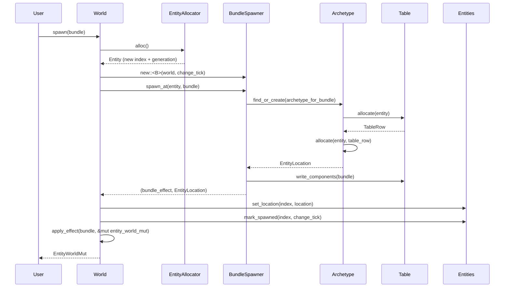

> [[Notes/Bevy/00-Bevy全解析主索引|← 返回 Bevy 全解析主索引]]

---

# Bevy `bevy_ecs` 源码解析：World 与 Entity 生命周期

> **分析范围**：`bevy_ecs` crate 全局骨架扫描 + `World`/`Entity` 核心数据结构与生命周期深入。
> **分析轮次**：三轮完整分析（骨架扫描 → 血肉填充 → 关联辐射）。
> **源码版本**：Bevy 0.19.0-dev（`main` 分支）。

---

## 零、bevy_ecs 是什么？

如果你之前接触过游戏引擎，可能会习惯用"类"和"对象"来组织游戏世界：一个 `GameObject` 类，挂各种 `Component` 脚本。但 Bevy 是一个**原生 ECS（Entity-Component-System）引擎**，它完全抛弃了"类继承"这套 OOP 思维。

在 Bevy 中：
- **Entity** 只是一个轻量级的 ID（类似于一个 u64 句柄），它本身没有任何数据。
- **Component** 是纯数据结构，通过 `#[derive(Component)]` 标记。
- **System** 是处理逻辑的普通函数，通过参数声明它要读取/写入哪些 Component 或 Resource。
- **World** 是唯一的全局状态容器，所有的 Entity、Component、Resource 都存放在里面。
- **Schedule** 负责决定哪些 System 在什么时候运行，并尽可能让它们并行执行。

**bevy_ecs** 就是实现这套机制的 crate。它是 Bevy 引擎的心脏，不依赖渲染、窗口、输入等上层模块，只提供纯粹的 ECS 运行时。

---

## 一、模块定位与构建定义

### 1.1 Cargo.toml 概览

> 文件：`crates/bevy_ecs/Cargo.toml`

```toml
[package]
name = "bevy_ecs"
version = "0.19.0-dev"
edition = "2024"
rust-version = "1.95.0"
```

关键特性（features）：
- `multi_threaded`：启用多线程调度，依赖 `bevy_tasks/multi_threaded`。
- `bevy_reflect`：启用运行时反射，依赖 `bevy_reflect` crate。
- `serialize`：启用 serde 序列化支持。
- `async_executor`：使用 `async-executor` 作为任务执行后端。
- `std` / `critical-section`：平台兼容相关。

关键依赖：
- `bevy_ptr`：原始指针操作抽象。
- `bevy_tasks`：任务池与并行计算。
- `bevy_utils`：工具类型。
- `bevy_platform`：跨平台集合与同步原语。
- `bevy_ecs_macros`：过程宏（`#[derive(Component)]`、`#[derive(Bundle)]` 等）。
- `slotmap`、`indexmap`、`fixedbitset`、`smallvec` 等：高性能数据结构。

### 1.2 目录结构与模块地图

> 文件：`crates/bevy_ecs/src/lib.rs`

`lib.rs` 中通过 `pub mod` 导出了以下核心模块：

| 模块 | 文件路径 | 职责 |
|------|---------|------|
| `world` | `src/world/mod.rs` | **World 定义与直接访问 API** |
| `entity` | `src/entity/mod.rs` | **Entity ID、分配器、生命周期管理** |
| `component` | `src/component/mod.rs` | **Component trait、注册、元数据** |
| `archetype` | `src/archetype.rs` | **Archetype 定义与图缓存** |
| `storage` | `src/storage/mod.rs` | **Table、SparseSet、底层存储** |
| `bundle` | `src/bundle/mod.rs` | **Bundle trait、批量插入/移除** |
| `system` | `src/system/mod.rs` | **System trait、Query、Commands、SystemParam** |
| `query` | `src/query/mod.rs` | **QueryState、QueryData、QueryFilter、迭代器** |
| `schedule` | `src/schedule/mod.rs` | **Schedule、SystemSet、执行器、依赖图** |
| `event` | `src/event.rs` | **Event 发送与接收** |
| `resource` | `src/resource.rs` | **Resource trait、全局单例状态** |
| `change_detection` | `src/change_detection/mod.rs` | **Tick、Mut、Ref、脏标记检测** |
| `observer` | `src/observer/mod.rs` | **Observer（钩子回调系统）** |
| `relationship` | `src/relationship.rs` | **实体关系（Parent-Child 等）** |
| `hierarchy` | `src/hierarchy.rs` | **ChildOf、Children 层级组件** |
| `lifecycle` | `src/lifecycle.rs` | **Add、Insert、Remove、Despawn 生命周期事件** |

---

## 二、第一轮：接口层（What）

### 2.1 World —— 唯一的全局状态容器

> 文件：`crates/bevy_ecs/src/world/mod.rs`，第 98~115 行

```rust
pub struct World {
    id: WorldId,
    pub(crate) entities: Entities,
    pub(crate) entity_allocator: EntityAllocator,
    pub(crate) components: Components,
    pub(crate) component_ids: ComponentIds,
    pub(crate) resource_entities: ResourceEntities,
    pub(crate) archetypes: Archetypes,
    pub(crate) storages: Storages,
    pub(crate) bundles: Bundles,
    pub(crate) observers: Observers,
    pub(crate) removed_components: RemovedComponentMessages,
    pub(crate) change_tick: AtomicU32,
    pub(crate) last_change_tick: Tick,
    pub(crate) last_check_tick: Tick,
    pub(crate) last_trigger_id: u32,
    pub(crate) command_queue: RawCommandQueue,
}
```

`World` 不直接暴露大部分字段（都是 `pub(crate)`），而是通过方法提供访问。核心公共 API：
- `World::new()` / `World::default()` —— 创建空世界。
- `World::spawn(bundle)` / `World::spawn_empty()` —— 创建实体。
- `World::despawn(entity)` —— 销毁实体。
- `World::query::<Q>()` —— 获取查询器。
- `World::insert_resource(resource)` / `World::resource::<R>()` —— 管理全局 Resource。
- `World::run_schedule(label)` —— 运行指定 Schedule。

### 2.2 Entity —— 轻量级 ID

> 文件：`crates/bevy_ecs/src/entity/mod.rs`，第 423~432 行

```rust
#[repr(C, align(8))]
pub struct Entity {
    index: EntityIndex,       // NonMaxU32
    generation: EntityGeneration,  // u32
}
```

`Entity` 是一个 64 位对齐的结构体，本质上等价于 `u64`。它不包含任何组件数据，只是世界中的一个"位置标记"。`generation` 用于防止**实体别名（Entity Aliasing）**——当一个实体被销毁后，其 `index` 可能被新实体复用，但 `generation` 会递增，从而让旧的 `Entity` ID 失效。

### 2.3 Component —— 纯数据标记

> 文件：`crates/bevy_ecs/src/component/mod.rs`，第 25~30 行

```rust
/// A data type that can be used to store data for an entity.
pub trait Component: Send + Sync + 'static {}
```

Component 是一个可派生 trait，通过 `#[derive(Component)]` 自动实现。支持两种存储方式：
- `Table`（默认）：列式连续存储，适合批量迭代。
- `SparseSet`：`#[component(storage = "SparseSet")]`，适合频繁插入/移除的场景。

### 2.4 System —— 逻辑执行单元

> 文件：`crates/bevy_ecs/src/system/system.rs`，第 48~78 行

```rust
pub trait System: Send + Sync + 'static {
    type In: SystemInput;
    type Out;

    fn name(&self) -> DebugName;
    fn flags(&self) -> SystemStateFlags;
    fn run(&mut self, input: SystemIn<'_, Self>, world: &mut World) -> Self::Out;
    // ... 其他生命周期方法
}
```

System 的核心是 `run` 方法。普通函数通过 `IntoSystem` trait 自动转换为 System。`SystemParam` trait 定义了 System 可以从 World 中获取哪些参数（如 `Query`、`Res`、`Commands`）。

### 2.5 Query —— 数据检索

> 文件：`crates/bevy_ecs/src/system/query.rs`，第 487~493 行

```rust
pub struct Query<'world, 'state, D: QueryData, F: QueryFilter = ()> {
    world: UnsafeWorldCell<'world>,
    state: &'state QueryState<D, F>,
    last_run: Tick,
    this_run: Tick,
}
```

`Query` 是 System 的参数类型，用于迭代符合特定 Component 组合的 Entity。`QueryData` 决定获取哪些组件，`QueryFilter` 决定过滤条件（如 `With<A>`、`Without<B>`、`Changed<C>`）。

### 2.6 Schedule —— 系统调度器

> 文件：`crates/bevy_ecs/src/schedule/schedule.rs`，第 382~388 行

```rust
pub struct Schedule {
    label: InternedScheduleLabel,
    graph: ScheduleGraph,
    executable: SystemSchedule,
    executor: Box<dyn SystemExecutor>,
    executor_initialized: bool,
}
```

Schedule 持有：
- `ScheduleGraph`：包含系统、系统集、层级关系、依赖关系的 DAG。
- `SystemSchedule`：构建后的可执行调度计划。
- `SystemExecutor`：实际运行系统的执行器（单线程或多线程）。

### 2.7 Commands —— 延迟执行的结构化变更

> 文件：`crates/bevy_ecs/src/system/commands/mod.rs`，第 105~109 行

```rust
pub struct Commands<'w, 's> {
    queue: InternalQueue<'s>,
    entities: &'w Entities,
    allocator: &'w EntityAllocator,
}
```

Commands 是一个延迟执行的命令队列。System 中调用 `commands.spawn(...)` 并不会立即创建实体，而是将命令加入队列，等到 `ApplyDeferred` 系统运行时才批量应用到 World。

### 2.8 Event —— 消息传递

Event 是一种特殊的 Component，通过 `EventWriter<T>` 发送、`EventReader<T>` 接收。底层使用 `RingBuffer` 存储事件，支持多生产者单消费者模式。

---

## 三、第二轮：数据层（How - Structure）

### 3.1 World 的内存布局

`World` 是 bevy_ecs 的顶层聚合体，它的字段揭示了 ECS 的核心数据流向：

```
World
├── entities: Entities              # Entity 元数据数组（index → location）
├── entity_allocator: EntityAllocator  # Entity ID 分配器（支持并发分配）
├── components: Components          # Component 类型注册表（TypeId → ComponentId）
├── component_ids: ComponentIds     # ComponentId 快速查询缓存
├── resource_entities: ResourceEntities  # Resource → Entity 的映射缓存
├── archetypes: Archetypes          # 所有 Archetype 的集合
├── storages: Storages              # Table + SparseSet + NonSend 底层存储
├── bundles: Bundles                # Bundle 类型注册表
├── observers: Observers            # 生命周期钩子/观察者注册表
├── removed_components: RemovedComponentMessages  # 被移除组件的消息记录
├── change_tick: AtomicU32         # 全局变更计数器（脏标记基础）
├── last_change_tick / last_check_tick: Tick  # Change Detection 时间戳
└── command_queue: RawCommandQueue  # 延迟命令队列
```

**设计要点**：
- `World` 本身不是线程安全的（没有锁），所有修改都需要 `&mut World`。
- `change_tick` 是一个自增的 `AtomicU32`，每次结构变更时递增。Query 的 `Changed`/`Added` 过滤器通过比较组件的 `last_changed_tick` 与 `last_run` 来判断是否变化。
- `command_queue` 使得 System 可以在只读访问 World 时"记录"变更，稍后由独占系统统一应用。

### 3.2 Entity 的生命周期与分配器

#### Entity 结构体

> 文件：`crates/bevy_ecs/src/entity/mod.rs`，第 423~432 行

```rust
#[repr(C, align(8))]
pub struct Entity {
    index: EntityIndex,       // NonMaxU32：在活跃实体数组中的索引
    generation: EntityGeneration,  // u32：回收代数，防止别名
}
```

`Entity` 采用 `#[repr(C, align(8))]` 确保内存布局等价于 `u64`，这允许 LLVM 生成高度优化的比较和哈希代码。

#### Entity 生命周期状态机

```
Unallocated（未分配）
    ↓ alloc()
Allocated（已分配但未生成）
    ↓ spawn_at()
Spawned（已生成，存在于 World）
    ↓ despawn()
Despawned（已销毁，但 index 未回收）
    ↓ free()
Freed（已回收，generation 递增）
    ↓ alloc()（复用）
Allocated（新实体，generation + 1）
```

#### Entities —— 位置元数据数组

> 文件：`crates/bevy_ecs/src/entity/mod.rs`

```rust
pub struct Entities {
    meta: Vec<EntityMeta>,   // 每个 EntityIndex 对应一条元数据
}

struct EntityMeta {
    location: Option<EntityLocation>,  // 实体当前所在 Archetype 和 TableRow
    // ... 其他管理字段
}
```

`Entities` 是一个按 `EntityIndex` 索引的数组。通过 `Entity::index()` 可以直接 O(1) 查到一个实体的 `EntityLocation`（包含 `ArchetypeId` 和 `TableRow`）。

#### EntityAllocator —— 并发安全的 ID 分配器

```rust
pub struct EntityAllocator {
    pub(crate) inner: remote_allocator::Allocator,
}
```

`EntityAllocator::alloc()` 是**并发安全**的（通过原子操作），这使得多个线程可以同时分配 Entity ID，而无需独占 World。但实际的 `spawn` 操作仍需 `&mut World`。

### 3.3 Archetype —— 组件组合的指纹

> 文件：`crates/bevy_ecs/src/archetype.rs`，第 1~20 行

Archetype 是 Bevy ECS 存储模型的核心概念。它表示**具有相同组件组合的所有实体的集合**。每个 World 中，每种唯一的组件组合只对应一个 Archetype。

```rust
pub struct Archetype {
    id: ArchetypeId,
    table_id: TableId,                    // Table 存储位置
    edges: Edges,                         // 缓存 insert/remove/take 的目标 Archetype
    entities: Vec<ArchetypeEntity>,       // 属于该 Archetype 的所有实体
    components: ImmutableSparseSet<ComponentId, ArchetypeComponentInfo>,
    flags: ArchetypeFlags,
}
```

**关键设计**：
- `edges` 是一个**图缓存**。当向一个 Archetype 中的实体插入一个 Bundle 时，World 需要找到目标 Archetype。`edges.insert_bundle` 缓存了 `BundleId → 目标 Archetype` 的映射，避免重复计算组件组合。这是从 O(组合数) 到 O(1) 的关键优化。
- `entities` 数组中的每个条目记录 `(Entity, TableRow)`，即实体在 Table 中的行号。

### 3.4 Storage —— 双轨存储策略

> 文件：`crates/bevy_ecs/src/storage/mod.rs`，第 42~51 行

```rust
pub struct Storages {
    pub sparse_sets: SparseSets,   // SparseSet 组件存储
    pub tables: Tables,            // Table 组件存储
    pub non_sends: NonSends,       // !Send 数据存储
}
```

Bevy 采用**双轨存储**策略，根据组件的 `StorageType` 选择不同的底层存储：

#### Table 存储（默认）

> 文件：`crates/bevy_ecs/src/storage/table/mod.rs`

```rust
pub struct Table {
    columns: ImmutableSparseSet<ComponentId, Column>,  // SoA 列存储
    entities: Vec<Entity>,                             // 每行对应的实体
}
```

Table 是**列式存储（Structure of Arrays）**。同一个 Archetype 的所有实体，其组件数据按列连续存放在内存中。这种布局对**批量顺序迭代**极其友好（缓存局部性极佳）。

当实体在 Archetype 间迁移时，它在 Table 中的数据通过 `swap_remove` 移动（O(1)），但会破坏原有行顺序。

#### SparseSet 存储

> 文件：`crates/bevy_ecs/src/storage/sparse_set.rs`

```rust
pub struct ComponentSparseSet {
    dense: Column,                        // 紧凑的组件数据
    entities: Vec<EntityIndex>,           // dense[i] 对应的 entity
    sparse: SparseArray<EntityIndex, TableRow>,  // entity → dense index
}
```

SparseSet 采用**稀疏数组 + 密集数组**的经典结构。适合：
- 组件数量远小于实体总数的场景（如只有 1% 的实体有该组件）。
- 需要频繁插入/移除组件的场景。

但 SparseSet 的迭代性能不如 Table（需要间接跳转），所以默认使用 Table。

### 3.5 ScheduleGraph —— 依赖关系的有向无环图

> 文件：`crates/bevy_ecs/src/schedule/schedule.rs`，第 726~745 行

```rust
pub struct ScheduleGraph {
    pub systems: Systems,
    pub system_sets: SystemSets,
    hierarchy: Dag<NodeId>,       // 系统集层级关系（哪些系统属于哪些集）
    dependency: Dag<NodeId>,      // 显式依赖关系（before/after）
    set_systems: DagGroups<SystemSetKey, SystemKey>,
    ambiguous_with: UnGraph<NodeId>,  // 允许模糊的节点对
    conflicting_systems: ConflictingSystems,
    settings: ScheduleBuildSettings,
    passes: IndexMap<TypeId, Box<dyn ScheduleBuildPassObj>, FixedHasher>,
}
```

Schedule 在首次运行时会执行**构建过程**（`initialize`）：
1. 解析系统集的层级关系，展开为扁平的节点图。
2. 检测系统间的数据访问冲突（基于 `SystemParam` 的读写声明）。
3. 为冲突但未显式排序的系统生成**歧义警告**（ambiguity）。
4. 自动插入 `ApplyDeferred` 同步点（如果启用了 `auto_insert_apply_deferred`）。
5. 将 DAG 转换为可执行的 `SystemSchedule`（拓扑排序后的系统列表）。

### 3.6 Change Detection —— 基于 Tick 的脏标记

> 文件：`crates/bevy_ecs/src/change_detection/mod.rs`

Bevy 不使用传统的"设置/清除脏标记"模式，而是使用一个全局递增的 `change_tick`（`AtomicU32`）。

每个组件实例有一个 `last_changed_tick`。当 System 在 tick = 100 时运行，Query 的 `Changed<T>` 过滤器会检查 `component.last_changed_tick > query.last_run_tick`。如果是，说明该组件自上次查询以来被修改过。

这种设计的好处：
- 不需要遍历所有组件来清除标记。
- 天然支持一帧内多次运行同一 Schedule（如固定时间步长）。

---

## 四、第二轮：逻辑层（How - Behavior）

### 4.1 实体创建流程：World::spawn

> 文件：`crates/bevy_ecs/src/world/mod.rs`，第 1265~1156 行



**关键步骤解析**：

1. **分配 ID**：`entity_allocator.alloc()` 原子地分配一个新的 `Entity` ID。这步是线程安全的。
2. **找到目标 Archetype**：`BundleSpawner` 根据 Bundle 的组件组合，查找或创建对应的 `Archetype`。如果这是 World 中第一次出现这种组件组合，会新建一个 Archetype 和一个 Table。
3. **Table 分配行**：在目标 Table 中分配一行（`swap_remove` 风格的重用空闲行），将实体写入 `table.entities` 数组。
4. **写入组件数据**：将 Bundle 中各个组件的值写入 Table 对应列的内存中。
5. **更新 EntityLocation**：在 `Entities.meta` 数组中记录该实体的新位置（ArchetypeId + TableRow）。
6. **触发生命周期钩子**：如果组件注册了 `on_insert` 钩子（通过 `#[component(on_insert)]`），在这里触发。
7. **应用 Bundle Effect**：某些 Bundle（如 `SpawnRelatedBundle`）需要在实体创建后执行额外操作（如建立父子关系）。

### 4.2 实体销毁流程：World::despawn

实体销毁是创建的逆过程，但有额外的复杂度：

1. **查找 EntityLocation**：通过 `Entities.meta[index]` 获取当前 Archetype 和 TableRow。
2. **从 Archetype 移除**：将该实体从 `archetype.entities` 中 `swap_remove`。被移除的最后一个实体需要更新其在 `Entities` 中的位置。
3. **从 Table 移除**：对该实体占用的 TableRow 执行 `swap_remove`，释放列存储空间。
4. **从 SparseSet 移除**：如果该实体有 SparseSet 存储的组件，从对应 SparseSet 中移除。
5. **标记为已释放**：`entity_allocator.free(entity)` 将该 ID 回收到空闲池，其 generation 递增。
6. **记录 RemovedComponents**：将该实体加入 `removed_components` 消息队列，供 `RemovedComponents<T>` 系统参数查询。
7. **触发生命周期钩子**：`on_despawn`、`on_remove` 等。

### 4.3 组件插入与 Archetype 迁移

当一个已有组件的实体被插入新组件时，它必须**迁移到新的 Archetype**。这是 ECS 中最常见的结构变更：

```
Entity in Archetype A (Pos, Vel)
    ↓ insert(Health)
Check edges.insert_bundle[HealthBundle]
    ↓ cache miss
Compute new component set = {Pos, Vel, Health}
Find/create Archetype B for {Pos, Vel, Health}
    ↓
Move entity data from Table A to Table B
Update EntityLocation
Trigger on_insert hooks
```

`edges` 缓存确保了：如果之前已经有实体从 A 插入了 Health 并迁移到了 B，那么下次直接从缓存获取 `ArchetypeId(B)`，无需重新计算组件组合。

### 4.4 Query 迭代流程

> 文件：`crates/bevy_ecs/src/query/iter.rs`，第 31~58 行

```rust
pub struct QueryIter<'w, 's, D: QueryData, F: QueryFilter> {
    world: UnsafeWorldCell<'w>,
    tables: &'w Tables,
    archetypes: &'w Archetypes,
    query_state: &'s QueryState<D, F>,
    cursor: QueryIterationCursor<'w, 's, D, F>,
}
```

Query 迭代的核心流程：

1. **`QueryState` 初始化**：在 System 首次运行时，`QueryState` 会遍历 World 中所有 Archetype，检查哪些 Archetype 满足 `QueryData` 和 `QueryFilter` 的条件。匹配的 Archetype ID 被缓存下来。
2. **`QueryIterationCursor`**：游标维护当前迭代的 Table 索引和行索引。
3. **Table 级迭代**：对于每个匹配的 Archetype，获取其对应的 Table，直接按行迭代 `Table.columns` 中的数据。这是 O(n) 的顺序访问，缓存命中率极高。
4. **SparseSet 级访问**：如果 Query 中包含 SparseSet 存储的组件，需要通过 `SparseArray` 进行间接索引查找。

**并行迭代**：`Query::par_iter()` 将匹配的 Table 划分为多个区间，通过 `bevy_tasks::ComputeTaskPool` 分派到多个线程并行处理。

### 4.5 Schedule 执行流程

> 文件：`crates/bevy_ecs/src/schedule/schedule.rs`，第 560~590 行

```rust
pub fn run(&mut self, world: &mut World) {
    world.check_change_ticks();
    self.initialize(world).unwrap_or_else(|e| panic!(...));
    let error_handler = world.fallback_error_handler();
    self.executor.run(&mut self.executable, world, None, error_handler);
}
```

Schedule 执行分为两个阶段：

#### 构建阶段（首次运行或变更后）

1. **扁平化层级**：将 SystemSet 的嵌套层级展开为扁平的节点列表。
2. **合并依赖**：将显式依赖（`.before()`/`.after()`）和层级关系合并到一张 DAG 中。
3. **检测冲突**：对于没有显式排序但数据访问冲突的系统对，标记为 `Ambiguity`。
4. **拓扑排序**：使用 DAG 生成可执行的系统顺序。
5. **分组并行**：将不冲突的系统分组，同一组内的系统可以并行执行。

#### 执行阶段

**单线程执行器**：按拓扑顺序逐个运行系统。

**多线程执行器**（`MultiThreadedExecutor`）：
1. 扫描当前可以运行的系统（所有依赖已完成且不与其他运行中系统冲突）。
2. 将可并行系统提交到 `ComputeTaskPool`。
3. 通过 `ConcurrentQueue` 监听系统完成事件。
4. 当一个系统完成时，检查其下游依赖系统是否可以启动。
5. 循环直到所有系统执行完毕。

```rust
pub struct MultiThreadedExecutor {
    state: Mutex<ExecutorState>,
    system_completion: ConcurrentQueue<SystemResult>,
    starting_systems: FixedBitSet,  // 可启动的系统位图
    // ...
}
```

---

## 五、第三轮：关联辐射（Context）

### 5.1 与上层模块的关系

| 上层模块 | 交互方式 | 说明 |
|---------|---------|------|
| `bevy_app` | `App` 持有 `World` 和 `Schedule` | `App::add_systems()` 将系统加入 `Update` Schedule；`App::run()` 循环运行 Schedule。 |
| `bevy_tasks` | `ComputeTaskPool` / `TaskPool` | 多线程 Schedule 执行器依赖 `bevy_tasks` 提供的线程池。 |
| `bevy_reflect` | `ReflectComponent` / `ReflectResource` | 开启 `bevy_reflect` feature 后，Component 和 Resource 支持运行时反射。 |
| `bevy_utils` | `HashMap` / `FixedBitSet` 等 | `bevy_ecs` 大量使用 `bevy_platform` 和 `bevy_utils` 提供的无标准库依赖的数据结构。 |

### 5.2 与下层模块的关系

bevy_ecs 是 Bevy 的底层核心之一，它几乎不依赖其他 Bevy crate（除了 `bevy_ptr`、`bevy_tasks`、`bevy_utils`、`bevy_platform` 等基础设施）。它**不依赖渲染、输入、窗口等上层模块**，这使得它可以被单独使用（如纯服务端逻辑、工具链、独立 ECS 应用）。

### 5.3 跨引擎对照

| 维度 | Bevy (bevy_ecs) | Unreal Engine | chaos |
|------|-----------------|---------------|-------|
| **对象模型** | ECS（Entity=ID, Component=数据, System=函数） | UObject 继承树 | OOP + 自定义 ECS |
| **存储布局** | Archetype + Table（SoA）/ SparseSet | 对象属性表（UProperty） | 组件池 + 稀疏集 |
| **实体标识** | 64-bit ID（index + generation） | `AActor*` 指针 | `EntityHandle` |
| **并行调度** | Schedule DAG + `bevy_tasks` | Game Thread / Render Thread 分离 | 自定义任务图 |
| **反射** | Rust derive 宏 + `bevy_reflect` | UHT 代码生成 + UProperty | 手动注册 |
| **全局状态** | `Resource<T>`（单例组件） | `UGameInstance` / `WorldSettings` | `Context` / `Global` |
| **延迟命令** | `Commands` 队列 + `ApplyDeferred` | 直接修改（非延迟） | `CommandBuffer` |

### 5.4 设计亮点总结

1. **Entity 分配与 Spawn 分离**：`EntityAllocator::alloc()` 支持并发分配 ID，而 `World::spawn()` 独占写入。这使得多线程场景下可以先并行"预订"实体 ID，再串行生成。
2. **Archetype 图缓存（Edges）**：组件插入/移除时，通过缓存避免重复计算目标 Archetype，是性能关键优化。
3. **双轨存储（Table + SparseSet）**：根据访问模式自动选择最优存储策略，兼顾迭代性能和随机访问性能。
4. **基于 Tick 的 Change Detection**：全局递增计数器替代传统脏标记，避免了遍历清除标记的开销。
5. **延迟命令（Commands）**：System 在不持有 `&mut World` 时也能发起结构变更，解耦了数据访问和结构变更。
6. **Schedule DAG 并行执行**：通过静态分析 SystemParam 的读写依赖，自动构建并行执行图，开发者无需手动管理线程同步。

---

## 六、关键源码片段

### 6.1 World 的核心聚合

> 文件：`crates/bevy_ecs/src/world/mod.rs`，第 98~115 行

```rust
pub struct World {
    id: WorldId,
    pub(crate) entities: Entities,
    pub(crate) entity_allocator: EntityAllocator,
    pub(crate) components: Components,
    pub(crate) component_ids: ComponentIds,
    pub(crate) resource_entities: ResourceEntities,
    pub(crate) archetypes: Archetypes,
    pub(crate) storages: Storages,
    pub(crate) bundles: Bundles,
    pub(crate) observers: Observers,
    pub(crate) removed_components: RemovedComponentMessages,
    pub(crate) change_tick: AtomicU32,
    pub(crate) last_change_tick: Tick,
    pub(crate) last_check_tick: Tick,
    pub(crate) last_trigger_id: u32,
    pub(crate) command_queue: RawCommandQueue,
}
```

### 6.2 Entity 的 64-bit 紧凑布局

> 文件：`crates/bevy_ecs/src/entity/mod.rs`，第 423~432 行

```rust
#[repr(C, align(8))]
pub struct Entity {
    index: EntityIndex,       // NonMaxU32
    generation: EntityGeneration,  // u32
}
```

### 6.3 System trait 定义

> 文件：`crates/bevy_ecs/src/system/system.rs`，第 48~78 行

```rust
pub trait System: Send + Sync + 'static {
    type In: SystemInput;
    type Out;

    fn name(&self) -> DebugName;
    fn flags(&self) -> SystemStateFlags;
    fn run(&mut self, input: SystemIn<'_, Self>, world: &mut World) -> Self::Out;
    // ...
}
```

### 6.4 Schedule 的三层结构

> 文件：`crates/bevy_ecs/src/schedule/schedule.rs`，第 382~388 行、第 726~745 行

```rust
pub struct Schedule {
    label: InternedScheduleLabel,
    graph: ScheduleGraph,         // 配置期 DAG
    executable: SystemSchedule,   // 运行期计划
    executor: Box<dyn SystemExecutor>,
    executor_initialized: bool,
}

pub struct ScheduleGraph {
    pub systems: Systems,
    pub system_sets: SystemSets,
    hierarchy: Dag<NodeId>,
    dependency: Dag<NodeId>,
    conflicting_systems: ConflictingSystems,
    // ...
}
```

---

## 七、关联阅读

- [[Bevy-bevy_ecs-源码解析：Component 存储与 Archetype]]（计划）— 深入 Table/Column/SparseSet 的内存布局与访问模式。
- [[Bevy-bevy_ecs-源码解析：Query 与 SystemParam]]（计划）— QueryState 缓存机制、WorldQuery trait、SystemParam 派生宏。
- [[Bevy-bevy_ecs-源码解析：Schedule 与 System 并行调度]]（计划）— ScheduleGraph 构建算法、多线程执行器的任务分派。
- [[Bevy-bevy_ecs-源码解析：Event 与 Commands 延迟执行]]（计划）— CommandQueue 的内存布局、Event 的 RingBuffer 实现。
- [[Bevy-bevy_app-源码解析：App 构建与 Plugin 系统]]（计划）— App 如何聚合 World + Schedule，Plugin 注册流程。
- [[Bevy-专题：ECS 内存布局与 Archetype 演进]]（计划）— 从 chaos/UE 的组件模型对照 Bevy 的 Archetype 设计。

---

## 八、索引状态

- **所属阶段**：第一阶段 — 构建系统与 ECS 核心（1.2 ECS 核心）
- **对应索引条目**：`[[Bevy-bevy_ecs-源码解析：World 与 Entity 生命周期]]`
- **分析轮次**：三轮全做（骨架扫描 ✅ → 血肉填充 ✅ → 关联辐射 ✅）
- **覆盖范围**：
  - ⬜ `[[Bevy-bevy_ecs-源码解析：Component 存储与 Archetype]]` — 本笔记覆盖了 Archetype/Storage 的接口层与数据层概览，但未深入 Column/BlobArray/Table 的内存分配细节。
  - ⬜ `[[Bevy-bevy_ecs-源码解析：Query 与 SystemParam]]` — 本笔记覆盖了 Query/QueryIter 的接口层和迭代流程，但未深入 QueryState 缓存更新、WorldQuery trait 的 unsafe 实现。
  - ⬜ `[[Bevy-bevy_ecs-源码解析：Schedule 与 System 并行调度]]` — 本笔记覆盖了 Schedule 的接口层和执行流程，但未深入 `ScheduleGraph::build()` 的拓扑排序、多线程执行器的任务窃取。
  - ⬜ `[[Bevy-bevy_ecs-源码解析：Event 与 Commands 延迟执行]]` — 本笔记覆盖了 Commands/Event 的接口层，但未深入 `CommandQueue` 的内存布局、`RawCommandQueue` 的 apply 流程。
  - ⬜ `[[Bevy-bevy_ecs-源码解析：Resource 全局状态]]` — 本笔记覆盖了 Resource 的接口层和 `ResourceEntities` 映射，但未深入 `IsResource` 钩子的完整生命周期。
  - ⬜ `[[Bevy-bevy_ecs-源码解析：Change Detection 与脏标记]]` — 本笔记覆盖了 Tick 机制的原理，但未深入 `ComponentTicks` 的逐组件更新、`CHECK_TICK_THRESHOLD` 的溢出处理。

---

> [[Notes/Bevy/00-Bevy全解析主索引|← 返回 Bevy 全解析主索引]]
