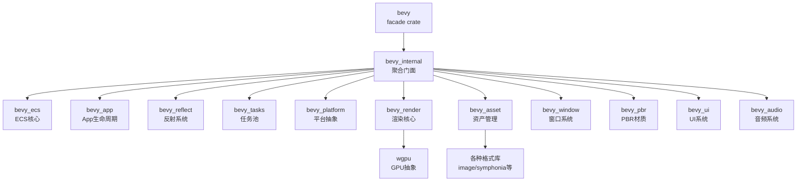
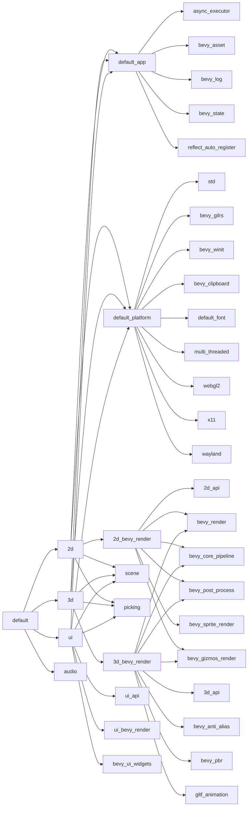

> [[Notes/Bevy/00-Bevy全解析主索引|← 返回 Bevy 全解析主索引]]

---

# Bevy 构建系统源码解析：Cargo Workspace 与 Feature 体系

> **分析范围**：Bevy 根目录 `Cargo.toml` 与 Workspace 整体架构，以及 Feature 分层设计体系。
> **分析轮次**：三轮完整分析（骨架扫描 → 血肉填充 → 关联辐射）。
> **源码版本**：Bevy 0.19.0-dev（`main` 分支）。

---

## 零、Bevy 的构建系统是什么？

如果你用过 C++ 的游戏引擎（如 Unreal Engine 的 UBT、chaos 的 CMake），可能会习惯一套独立的构建工具链。但 Bevy 是用 Rust 写的，它完全复用了 Rust 生态的构建系统——**Cargo**。

Cargo 是 Rust 的包管理器和构建工具，每个 Rust 项目都有一个 `Cargo.toml` 配置文件。当项目规模变大时，Cargo 支持 **Workspace** 模式：一个根 `Cargo.toml` 可以统一管理多个子 crate，每个子 crate 有自己的 `Cargo.toml`，但共享一个 `Cargo.lock` 和 `target/` 构建目录。

Bevy 作为一个大型游戏引擎，代码被拆成了 **60+ 个子 crate**。这些 crate 通过 Workspace 组织在一起，并通过 **Feature** 机制实现"按需编译"——你不需要的功能不会被打包进最终二进制，这在嵌入式和 WASM 场景下尤为重要。

---

## 一、模块定位与构建定义（接口层）

### 1.1 根 Cargo.toml 概览

> 文件：`Cargo.toml`（根目录），第 1~50 行

```toml
[package]
name = "bevy"
version = "0.19.0-dev"
edition = "2024"
categories = ["game-engines", "graphics", "gui", "rendering"]
description = "A refreshingly simple data-driven game engine and app framework"
exclude = ["assets/", "tools/", ".github/", "crates/", "examples/wasm/assets/"]
rust-version = "1.95.0"

[workspace]
resolver = "3"
members = [
  "crates/*",
  "crates/bevy_derive/compile_fail",
  "crates/bevy_ecs/compile_fail",
  "crates/bevy_reflect/compile_fail",
  "examples/mobile",
  "examples/no_std/*",
  "examples/reflection/auto_register_static",
  "examples/large_scenes/bistro",
  "examples/large_scenes/caldera_hotel",
  "examples/large_scenes/bevy_city",
  "examples/large_scenes/mipmap_generator",
  "benches",
  "tools/*",
  "errors",
]
```

根 `Cargo.toml` 承担两个角色：
1. **Package 定义**：`bevy` 这个 facade crate 本身，对外暴露统一的 API 入口。
2. **Workspace 定义**：通过 `[workspace]` 节管理所有子成员，使用 `resolver = "3"`（Cargo 的依赖解析器版本 3）。

> `resolver = "3"` 是 Rust 2024 edition 配套的解析器，改进了 features 的联合（feature unification）行为，确保不同 target 的依赖不会错误地共享 features。

### 1.2 Workspace 成员分类

| 成员路径 | 类型 | 说明 |
|---------|------|------|
| `crates/*` | 引擎核心 crate | 所有官方 crate，按功能拆分 |
| `crates/*/compile_fail` | UI 测试 | 验证编译错误的诊断输出稳定性 |
| `examples/*` | 示例程序 | 按平台/场景分类的大型示例 |
| `benches` | 基准测试 | 性能基准测试 crate |
| `tools/*` | 内部工具 | 不对外发布的开发工具 |
| `errors` | 错误码文档 | 自动检查代码块正确性的文档 crate |

### 1.3 全局 Lint 配置

> 文件：`Cargo.toml`（根目录），第 51~131 行

```toml
[workspace.lints.clippy]
doc_markdown = "warn"
manual_let_else = "warn"
match_same_arms = "warn"
redundant_closure_for_method_calls = "warn"
redundant_else = "warn"
semicolon_if_nothing_returned = "warn"
type_complexity = "allow"
undocumented_unsafe_blocks = "warn"
unwrap_or_default = "warn"
needless_lifetimes = "allow"
too_many_arguments = "allow"
nonstandard_macro_braces = "warn"

ptr_as_ptr = "warn"
ptr_cast_constness = "warn"
ref_as_ptr = "warn"

std_instead_of_core = "warn"
std_instead_of_alloc = "warn"
alloc_instead_of_core = "warn"

allow_attributes = "warn"
allow_attributes_without_reason = "warn"

[workspace.lints.rust]
missing_docs = "warn"
unexpected_cfgs = { level = "warn", check-cfg = ['cfg(docsrs_dep)'] }
unsafe_code = "deny"
unsafe_op_in_unsafe_fn = "warn"
unused_qualifications = "warn"
```

Bevy 在 Workspace 级别统一配置了 lint 规则：
- **Clippy**：强制文档格式、减少冗余代码、限制 `unsafe` 使用（`undocumented_unsafe_blocks`）。
- **Rustc**：`missing_docs = "warn"` 要求公共 API 必须有文档；`unsafe_code = "deny"` 在部分 crate 中完全禁止 unsafe（如 `bevy_internal`）。
- **no_std 友好**：`std_instead_of_core` / `alloc_instead_of_core` 等 lint 确保优先使用 `core` / `alloc`，维持 `no_std` 兼容性。

> 注意：根 `Cargo.toml` 还单独定义了一套 `[lints]`（非 workspace），用于 `bevy` facade crate 本身。这套 lint 与 workspace lint 基本一致，但放宽了 `std_instead_of_core` 等规则（设为 `allow`），因为 facade 面向最终用户，不需要强制 `no_std` 约束。

---

## 二、Feature 分层设计（数据层）

### 2.1 Feature 的三种语义层级

Bevy 的根 `Cargo.toml` 中有 **100+ 个 features**，但它们不是随意堆砌的，而是按明确的语义分层：

```
PROFILE（体验配置） → COLLECTION（功能集合） → MODULE（模块开关） → CAPABILITY（具体能力）
```

| 层级 | 示例 | 说明 |
|------|------|------|
| **PROFILE** | `2d`, `3d`, `ui`, `audio` | 面向用户的"体验套餐"，开箱即用 |
| **COLLECTION** | `default_app`, `default_platform`, `common_api` | 中层功能聚合，供 PROFILE 组合使用 |
| **MODULE** | `bevy_render`, `bevy_pbr`, `bevy_ui` | 与 crate 一一对应，启用即引入该模块 |
| **CAPABILITY** | `png`, `webgl2`, `trace_chrome`, `multi_threaded` | 最细粒度的能力开关，控制具体功能或后端 |

### 2.2 PROFILE 层：面向用户的体验套餐

> 文件：`Cargo.toml`（根目录），第 133~151 行

```toml
[features]
default = ["2d", "3d", "ui", "audio"]

# PROFILE: The default 2D Bevy experience.
2d = ["default_app", "default_platform", "2d_bevy_render", "scene", "picking"]

# PROFILE: The default 3D Bevy experience.
3d = ["default_app", "default_platform", "3d_bevy_render", "scene", "picking"]

# PROFILE: The default Bevy UI experience.
ui = [
  "default_app",
  "default_platform",
  "ui_api",
  "ui_bevy_render",
  "scene",
  "picking",
  "bevy_ui_widgets",
]
```

这是最上层的设计：用户只需要在 `Cargo.toml` 里写 `bevy = { version = "0.19", features = ["3d"] }`，就能得到一个完整的 3D 引擎体验。`2d` / `3d` / `ui` / `audio` 这四个 PROFILE 是 `default` 的组成部分，用户也可以 `default-features = false` 后按需选择。

### 2.3 COLLECTION 层：功能聚合基座

> 文件：`Cargo.toml`（根目录），第 173~262 行（节选）

```toml
# COLLECTION: The core pieces that most apps need.
default_app = [
  "async_executor",
  "bevy_asset",
  "bevy_log",
  "bevy_state",
  "reflect_auto_register",
]

# COLLECTION: Platform support features.
default_platform = [
  "std",
  "bevy_gilrs",
  "bevy_winit",
  "bevy_clipboard",
  "default_font",
  "multi_threaded",
  "webgl2",
  "x11",
  "wayland",
  "custom_cursor",
  "sysinfo_plugin",
]

# COLLECTION: Default scene definition features.
common_api = [
  "bevy_animation",
  "bevy_camera",
  "bevy_color",
  "bevy_gizmos",
  "bevy_image",
  "bevy_mesh",
  "bevy_shader",
  "bevy_material",
  "bevy_text",
  "bevy_window",
  "hdr",
  "png",
]
```

COLLECTION 层的设计意图是**解耦组合逻辑**：
- `default_app`：提供绝大多数应用需要的基础能力（资产、日志、状态机）。
- `default_platform`：平台相关（窗口、输入、多线程、WebGL、Wayland/X11）。
- `common_api`：渲染无关的通用 API（动画、相机、颜色、网格、材质等）。
- `2d_api` / `3d_api` / `ui_api`：在 `common_api` 基础上叠加各维度的专属模块。
- `2d_bevy_render` / `3d_bevy_render` / `ui_bevy_render`：最终把 API 层和渲染后端粘合起来。

这种分层使得"做一个无窗口的命令行工具"变得很简单：只需要 `default_app`，不需要 `default_platform` 和任何 `*_bevy_render`。

### 2.4 MODULE 层：与 crate 一一对应的开关

> 文件：`Cargo.toml`（根目录），第 280~409 行（节选）

```toml
# Provides rendering functionality
bevy_render = ["bevy_internal/bevy_render"]

# Adds PBR rendering
bevy_pbr = ["bevy_internal/bevy_pbr"]

# Provides sprite functionality
bevy_sprite = ["bevy_internal/bevy_sprite"]

# A custom ECS-driven UI framework
bevy_ui = ["bevy_internal/bevy_ui"]

# Provides audio functionality
bevy_audio = ["bevy_internal/bevy_audio"]
```

MODULE 层的 feature 名称和 crate 名称**完全一一对应**。这是 Bevy 构建系统的一个核心设计决策——用户不需要记两套命名：想用什么模块，就开一个同名 feature。

每个 MODULE feature 都透传到 `bevy_internal`（即 `"bevy_internal/bevy_render"`）。`bevy_internal` 再负责把 feature 转发给真正的子 crate，并拉取该模块所需的下游依赖链。

### 2.5 CAPABILITY 层：最细粒度的能力控制

| 类别 | 示例 | 控制内容 |
|------|------|---------|
| 图像格式 | `png`, `hdr`, `ktx2`, `basis-universal` | 纹理加载支持的格式 |
| 音频格式 | `vorbis`, `mp3`, `flac`, `wav` | 音频解码后端 |
| 着色器格式 | `shader_format_glsl`, `shader_format_spirv` | 接受的着色器语言 |
| 窗口后端 | `x11`, `wayland` | Linux 显示服务器协议 |
| Web 后端 | `webgl2`, `webgpu` | WASM 的图形 API |
| 调试工具 | `trace_chrome`, `trace_tracy`, `debug` | 性能追踪与调试 |
| 渲染特性 | `tonemapping_luts`, `smaa_luts`, `dlss` | 高级渲染效果 |

> 文件：`Cargo.toml`（根目录），第 440~500 行（节选）

```toml
# BMP image format support
bmp = ["bevy_internal/bmp"]

# DDS compressed texture support
dds = ["bevy_internal/dds"]

# EXR image format support
exr = ["bevy_internal/exr"]

# FLAC audio format support (through `symphonia`)
symphonia-flac = ["bevy_internal/symphonia-flac"]

# OGG/VORBIS audio format support (through `symphonia`)
symphonia-vorbis = ["bevy_internal/symphonia-vorbis"]
```

CAPABILITY 层的 feature 也遵循**同名透传**原则。例如 `png` 会一路透传到 `bevy_image` crate，由 `bevy_image` 决定是否引入 `image` crate 的 `png` feature。

---

## 三、Feature 级联机制与条件依赖（逻辑层）

### 3.1 `?/` 语法：条件级联

在 `bevy_internal` 的 `Cargo.toml` 中，大量使用了 Cargo 的 **`?/`** 语法：

> 文件：`crates/bevy_internal/Cargo.toml`，第 13~28 行

```toml
[features]
trace = [
  "bevy_app/trace",
  "bevy_asset?/trace",
  "bevy_core_pipeline?/trace",
  "bevy_anti_alias?/trace",
  "bevy_ecs/trace",
  "bevy_log/trace",
  "bevy_pbr?/trace",
  "bevy_render?/trace",
  "bevy_winit?/trace",
  "bevy_post_process?/trace",
]
```

`?/` 的含义是：**只有当该依赖已被启用时，才给它传递这个 feature**。例如 `bevy_asset?/trace` 表示：如果 `bevy_asset` 已经被某个 feature 激活（optional dependency），那么再给它打开 `trace` feature；如果 `bevy_asset` 根本没被引入，则忽略此项，不会报错。

没有这个语法的话，开启 `trace` 就会强制引入所有列出的 optional crate，导致编译体积暴涨。`?/` 让 feature 矩阵变得**稀疏且安全**。

### 3.2 依赖链自动推导

MODULE 层的 feature 不仅激活一个 crate，还会**自动拉取完整的下游依赖链**：

> 文件：`crates/bevy_internal/Cargo.toml`，第 248~276 行

```toml
bevy_render = [
  "dep:bevy_render",
  "bevy_camera",
  "bevy_shader",
  "bevy_color/wgpu-types",
  "bevy_color/encase",
]
bevy_core_pipeline = ["dep:bevy_core_pipeline", "bevy_render"]
bevy_anti_alias = ["dep:bevy_anti_alias", "bevy_core_pipeline"]
bevy_post_process = ["dep:bevy_post_process", "bevy_core_pipeline"]
bevy_pbr = [
  "dep:bevy_pbr",
  "bevy_light",
  "bevy_material",
  "bevy_core_pipeline",
  "bevy_gizmos_render?/bevy_pbr",
]
```

以 `bevy_pbr` 为例：
1. `dep:bevy_pbr` —— 引入 `bevy_pbr` crate 作为 optional 依赖。
2. `bevy_light` —— 自动启用光照模块（PBR 需要光）。
3. `bevy_material` —— 自动启用材质模块（PBR 是材质模型）。
4. `bevy_core_pipeline` —— 自动启用核心渲染管线（PBR 需要渲染基础设施）。
5. `bevy_gizmos_render?/bevy_pbr` —— 如果 gizmo 渲染也启用了，让它知道 PBR 的存在。

用户只需要开一个 `bevy_pbr`，所有必需的下游模块会自动就绪。这种**依赖链自动推导**极大降低了用户的认知负担。

### 3.3 多平台条件依赖

> 文件：`Cargo.toml`（根目录），第 736~779 行

```toml
[target.'cfg(not(target_family = "wasm"))'.dependencies]
bevy_dylib = { path = "crates/bevy_dylib", version = "0.19.0-dev", default-features = false, optional = true }

[target.'cfg(target_arch = "wasm32")'.dev-dependencies]
getrandom = { version = "0.4", default-features = false, features = ["wasm_js"] }
wasm-bindgen = { version = "0.2" }
web-sys = { version = "0.3", features = ["Window"] }
```

Bevy 使用 Cargo 的 **target 条件依赖**来实现跨平台适配：
- `bevy_dylib`（动态链接优化）只在非 WASM 平台可用。
- WASM 示例需要 `wasm-bindgen` 和 `web-sys` 等 JS 互操作库。
- 类似地，`bevy_internal` 中也有 `target.'cfg(target_os = "android")'.dependencies` 来控制 Android 专属依赖。

### 3.4 no_std 支持的分层架构

> 文件：`crates/bevy_internal/Cargo.toml`，第 403~452 行

```toml
std = [
  "bevy_a11y?/std",
  "bevy_app/std",
  "bevy_color?/std",
  "bevy_diagnostic/std",
  "bevy_ecs/std",
  ...
]

critical-section = [
  "bevy_a11y?/critical-section",
  "bevy_app/critical-section",
  "bevy_diagnostic/critical-section",
  "bevy_ecs/critical-section",
  ...
]
```

Bevy 核心（`bevy_ecs`、`bevy_app` 等）支持 `no_std` 编译：
- 关闭 `std` feature 时，使用 `core` + `alloc`。
- 在连标准库都没有的平台上，启用 `critical-section` 提供同步原语。
- 上层模块（渲染、窗口、音频）通常依赖 `std`，因此是 optional 的。

这种设计让 Bevy ECS 核心可以在**嵌入式设备**或**极端受限环境**中运行，而上层渲染模块按需附加。

---

## 四、上下层关系与跨模块交互

### 4.1 三层 crate 架构

Bevy 的 crate 依赖关系形成了清晰的三层：



- **facade 层**：`bevy` crate 本身，对外提供统一的 `use bevy::prelude::*`。
- **聚合层**：`bevy_internal`，负责 feature 透传、模块重导出、DefaultPlugins 编排。
- **核心层**：`bevy_ecs`、`bevy_app`、`bevy_reflect`、`bevy_tasks` 等，不依赖渲染/窗口。
- **功能层**：`bevy_render`、`bevy_asset`、`bevy_pbr`、`bevy_ui` 等，构建在核心层之上。
- **第三方层**：`wgpu`、`image`、`naga` 等外部 crate，被功能层依赖。

### 4.2 与 bevy_internal 的交互

`bevy` facade crate 本身几乎没有任何代码，它的 `Cargo.toml` 只有两个关键依赖：

> 文件：`Cargo.toml`（根目录），第 731~737 行

```toml
[dependencies]
bevy_internal = { path = "crates/bevy_internal", version = "0.19.0-dev", default-features = false }
tracing = { version = "0.1", default-features = false, optional = true }

[target.'cfg(not(target_family = "wasm"))'.dependencies]
bevy_dylib = { path = "crates/bevy_dylib", version = "0.19.0-dev", default-features = false, optional = true }
```

`bevy` 的几乎所有 features 都只是**透传给 `bevy_internal`**。这种设计使得：
- 用户始终只依赖 `bevy` 一个 crate。
- 实际的模块组织和 feature 转发逻辑集中在 `bevy_internal`。
- `bevy_dylib` 支持动态链接以加速迭代编译。

---

## 五、设计亮点与可迁移原理

### 5.1 Feature 命名的"认知一致性"

Bevy 最精妙的设计之一是 **feature 名称 = crate 名称 = 模块名称**。用户不需要记三套命名：
- 想用 sprite 功能 → 开 `bevy_sprite` feature。
- 代码里用 `bevy::sprite::Sprite`。
- 底层 crate 也叫 `bevy_sprite`。

这种一致性大幅降低了学习成本和出错概率。

### 5.2 稀疏 Feature 矩阵

通过 `?/` 语法和 optional dependency，Bevy 实现了**稀疏的 feature 矩阵**：
- 开启 `trace` 不会强制引入所有 crate。
- 开启 `bevy_pbr` 只会拉取渲染管线相关的下游依赖。
- 不同 feature 组合之间不会互相污染。

对于大型项目（尤其游戏引擎），feature 爆炸是一个常见问题。Bevy 的解决方案是：**分层聚合 + 条件级联 + 自动推导**。

### 5.3 可迁移到自研引擎的原理

| Bevy 做法 | 可迁移原理 |
|-----------|-----------|
| Workspace 拆分 60+ crate | 大型项目按功能域拆分为独立编译单元，缩短增量编译时间 |
| Feature 分层（PROFILE → MODULE → CAPABILITY） | 构建配置也应分层：用户层用"套餐"，开发者层用"模块"，底层用"能力" |
| `?/` 条件级联 | 避免 feature 的硬依赖传播，使用条件转发保持矩阵稀疏 |
| 依赖链自动推导 | 高层 feature 自动拉取完整的下游依赖，减少用户配置负担 |
| no_std 优先 + std 叠加 | 核心库从最精简环境出发，上层能力按需叠加 |
| target 条件依赖 | 跨平台项目应利用构建系统的平台条件，而非在代码里写大量 `#[cfg]` |

---

## 六、关键源码片段

### 6.1 PROFILE 的依赖关系（Mermaid）



### 6.2 Feature 透传路径示例

以用户开启 `png` feature 为例，完整的透传路径是：

```
bevy/Cargo.toml: png = ["bevy_internal/png"]
  → bevy_internal/Cargo.toml: png = ["bevy_image/png"]
    → bevy_image/Cargo.toml: png = ["image/png"]
      → image crate 启用 png 解码器
```

这种**逐层透传**的模式让每一层只关心自己的直接下游，不需要知道更底层的细节。

---

## 七、关联阅读

- [[Bevy-构建系统-源码解析：bevy_internal 聚合与条件编译]] —— 了解 `bevy_internal` 如何将 feature 转发到各个子 crate，以及 `DefaultPlugins` 的编排逻辑。
- [[Bevy-bevy_app-源码解析：App 构建与 Plugin 系统]] —— 了解 App 和 Plugin 系统如何与 Feature 体系配合，实现"开 feature = 加 plugin"的联动。
- [[Bevy-bevy_ecs-源码解析：World 与 Entity 生命周期]] —— Bevy ECS 核心 crate 的构建定义和 `no_std` 支持细节。
- [[Bevy-专题：Bevy 整体骨架与 crate 组合]] —— （计划中）跨全部核心 crate 的横向架构解析。

---

## 索引状态

- **所属阶段**：第一阶段 - 构建系统与 ECS 核心（1.1 构建系统）
- **对应索引条目**：[[Bevy-构建系统-源码解析：Cargo Workspace 与 Feature 体系]]
- **状态**：✅ 已完成三层剥离法分析
