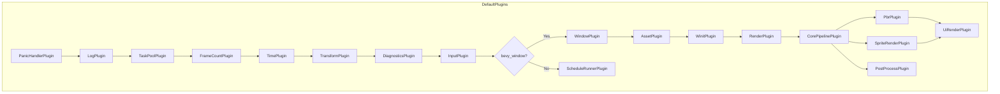

---
title: Bevy-构建系统-源码解析：bevy_internal 聚合与条件编译
date: 2026-05-06
tags:
  - bevy-source
  - build-system
  - bevy_internal
  - facade
  - plugin-group
  - conditional-compilation
aliases:
  - Bevy bevy_internal 聚合与条件编译
  - Bevy 门面模式与插件编排
---

> [[Notes/Bevy/00-Bevy全解析主索引|← 返回 Bevy 全解析主索引]]

---

# Bevy 构建系统源码解析：`bevy_internal` 聚合与条件编译

> **分析范围**：`bevy_internal` crate 的模块聚合机制、条件编译策略、`prelude` 统一入口、`DefaultPlugins` 插件组编排。
> **分析轮次**：三轮完整分析（骨架扫描 → 血肉填充 → 关联辐射）。
> **源码版本**：Bevy 0.19.0-dev（`main` 分支）。

---

## 零、`bevy_internal` 是什么？

在上一篇笔记中，我们看到 `bevy` facade crate 的 `Cargo.toml` 几乎只有一个依赖：`bevy_internal`。那么，`bevy_internal` 到底做了什么？

`bevy_internal` 是一个**纯粹的聚合门面（Facade）crate**。它本身几乎不包含任何业务逻辑代码，而是承担三个核心职责：

1. **模块重导出**：把散落在 40+ 个子 crate 中的 API，扁平化为 `bevy::ecs`、`bevy::render`、`bevy::pbr` 等短模块名。
2. **Prelude 聚合**：提供一个统一的 `bevy::prelude`，让用户只需 `use bevy::prelude::*` 就能拿到所有常用类型。
3. **插件组编排**：通过 `DefaultPlugins` 和 `MinimalPlugins` 定义插件的初始化顺序和条件编译，解决"谁先注册、谁后注册"的依赖问题。

> `bevy_internal` 的 `lib.rs` 顶部注释写得很清楚：
> ```rust
> //! This module is separated into its own crate to enable simple dynamic linking for Bevy,
> //! and should not be used directly
> ```
> 它之所以独立成一个 crate，主要是为了支持 `dynamic_linking` feature——通过动态链接 `bevy_internal` 来加速迭代编译。

---

## 一、模块定位与构建定义（接口层）

### 1.1 Cargo.toml 概览

> 文件：`crates/bevy_internal/Cargo.toml`，第 1~11 行

```toml
[package]
name = "bevy_internal"
version = "0.19.0-dev"
edition = "2024"
description = "An internal Bevy crate used to facilitate optional dynamic linking via the 'dynamic_linking' feature"
```

`bevy_internal` 的 `Cargo.toml` 有两个显著特点：
1. **依赖数量极多**：声明了 40+ 个 `optional = true` 的依赖（对应各个功能模块）。
2. **Feature 数量极多**：定义了 150+ 个 features，绝大多数是**透传/转发**性质。

### 1.2 目录结构

```
crates/bevy_internal/
├── Cargo.toml          # 核心：feature 定义与依赖声明
├── src/
│   ├── lib.rs          # 模块重导出（pub use bevy_xxx as xxx）
│   ├── prelude.rs      # 统一 prelude（聚合各子 crate 的 prelude::*）
│   └── default_plugins.rs  # DefaultPlugins / MinimalPlugins 插件组定义
└── README.md
```

整个 crate 只有 3 个 Rust 源文件，总代码量不到 400 行，却连接着 Bevy 引擎的全部脉络。

---

## 二、模块聚合与重导出（数据层）

### 2.1 `lib.rs` 的核心逻辑

> 文件：`crates/bevy_internal/src/lib.rs`，第 1~112 行

```rust
#![cfg_attr(docsrs, feature(doc_cfg))]
#![forbid(unsafe_code)]
#![no_std]

pub mod prelude;

mod default_plugins;
pub use default_plugins::*;

// 无条件导出的核心 crate（共 13 个）
pub use bevy_app as app;
pub use bevy_ecs as ecs;
pub use bevy_input as input;
pub use bevy_math as math;
pub use bevy_diagnostic as diagnostic;
pub use bevy_platform as platform;
pub use bevy_ptr as ptr;
pub use bevy_reflect as reflect;
pub use bevy_tasks as tasks;
pub use bevy_time as time;
pub use bevy_transform as transform;
pub use bevy_utils as utils;

// 条件导出的可选 crate
#[cfg(feature = "bevy_render")]
pub use bevy_render as render;

#[cfg(feature = "bevy_window")]
pub use bevy_window as window;

#[cfg(feature = "bevy_pbr")]
pub use bevy_pbr as pbr;

#[cfg(feature = "bevy_ui")]
pub use bevy_ui as ui;

#[cfg(feature = "bevy_audio")]
pub use bevy_audio as audio;

// ... 还有更多条件导出
```

`lib.rs` 的核心模式极其简单——对每一个子 crate 做 `pub use bevy_xxx as xxx;`。

但简单不代表没有设计：
- **核心 crate 无条件导出**：`bevy_app`、`bevy_ecs`、`bevy_input`、`bevy_math` 等 13 个 crate 是任何 Bevy 应用都需要的，因此不需要 `#[cfg]` 保护。
- **功能 crate 条件导出**：渲染、窗口、PBR、UI、音频等上层功能，只有在对应 feature 启用时才导出。
- **扁平化命名**：`bevy_render` 变成 `bevy::render`，`bevy_pbr` 变成 `bevy::pbr`。用户不需要记冗长的 crate 名。

### 2.2 条件编译的三种模式

在 `lib.rs` 中，条件编译主要使用 `#[cfg(feature = "...")]`：

| 模式 | 示例 | 用途 |
|------|------|------|
| Feature 开关 | `#[cfg(feature = "bevy_render")]` | 最常用的模式，与 Cargo feature 同名 |
| 平台专属 | `#[cfg(target_os = "android")]` | Android 专属模块 `bevy_android` |
| 组合条件 | `#[cfg(all(feature = "bevy_ui_widgets", feature = "bevy_sprite"))]` | 仅在 `default_plugins.rs` 中出现 |

### 2.3 `prelude.rs` 的聚合逻辑

> 文件：`crates/bevy_internal/src/prelude.rs`，第 1~116 行

```rust
#[doc(hidden)]
pub use crate::{
    app::prelude::*, ecs::prelude::*, input::prelude::*, math::prelude::*,
    platform::prelude::*, reflect::prelude::*, time::prelude::*,
    transform::prelude::*, utils::prelude::*, DefaultPlugins, MinimalPlugins,
};

#[doc(hidden)]
#[cfg(feature = "bevy_log")]
pub use crate::log::prelude::*;

#[doc(hidden)]
#[cfg(feature = "bevy_window")]
pub use crate::window::prelude::*;

#[doc(hidden)]
#[cfg(feature = "bevy_render")]
pub use crate::render::prelude::*;

#[doc(hidden)]
#[cfg(feature = "bevy_pbr")]
pub use crate::pbr::prelude::*;

// ... 更多条件聚合
```

`prelude.rs` 采用与 `lib.rs` **完全一致**的条件编译策略：
1. 先无条件聚合所有核心 crate 的 `prelude::*`。
2. 再按 feature 条件聚合可选 crate 的 `prelude::*`。
3. 额外导出 `bevy_derive` 的几个常用宏：`bevy_main`、`Deref`、`DerefMut`。

> `#[doc(hidden)]` 的作用是让这些 re-export 不出现在文档的公共 API 列表中，避免污染文档索引。用户通过 `use bevy::prelude::*` 使用时，这些类型依然可用。

---

## 三、DefaultPlugins 插件组编排（逻辑层）

### 3.1 `plugin_group!` 宏

> 文件：`crates/bevy_internal/src/default_plugins.rs`，第 1~114 行

```rust
use bevy_app::{plugin_group, Plugin};

plugin_group! {
    pub struct DefaultPlugins {
        bevy_app:::PanicHandlerPlugin,
        #[cfg(feature = "bevy_log")]
        bevy_log:::LogPlugin,
        bevy_app:::TaskPoolPlugin,
        bevy_diagnostic:::FrameCountPlugin,
        bevy_time:::TimePlugin,
        bevy_transform:::TransformPlugin,
        bevy_diagnostic:::DiagnosticsPlugin,
        bevy_input:::InputPlugin,
        #[cfg(feature = "bevy_input_focus")]
        bevy_input_focus:::InputFocusPlugin,
        #[cfg(feature = "bevy_input_focus")]
        bevy_input_focus:::InputDispatchPlugin,
        #[custom(cfg(not(feature = "bevy_window")))]
        bevy_app:::ScheduleRunnerPlugin,
        #[cfg(feature = "bevy_window")]
        bevy_window:::WindowPlugin,
        #[cfg(feature = "bevy_window")]
        bevy_a11y:::AccessibilityPlugin,
        // ... 更多插件
    }
}
```

`DefaultPlugins` 使用 `bevy_app` 提供的 `plugin_group!` 宏定义。这个宏接受一个结构体定义，其中每个字段都是一个插件（或嵌套的插件组），并自动生成 `PluginGroup` trait 的实现。

> `bevy_app:::PanicHandlerPlugin` 这种三冒号语法是 `plugin_group!` 宏的特殊语法，表示"使用这个路径的默认实例"。

### 3.2 插件初始化顺序的语义

`DefaultPlugins` 中插件的排列顺序**不是随意的**，它严格反映了 Bevy 的初始化依赖链：

```
1. PanicHandlerPlugin          -- 捕获 panic
2. LogPlugin                   -- 初始化日志
3. TaskPoolPlugin              -- 创建任务线程池
4. FrameCountPlugin            -- 帧计数器
5. TimePlugin                  -- 时间管理
6. TransformPlugin             -- 变换系统
7. DiagnosticsPlugin           -- 性能诊断
8. InputPlugin                 -- 输入事件
9. InputFocusPlugin            -- 输入焦点（可选）
10. ScheduleRunnerPlugin       -- 无窗口时的调度循环（回退）
11. WindowPlugin               -- 窗口管理（可选）
12. AccessibilityPlugin        -- 无障碍支持（可选）
13. WebAssetPlugin             -- HTTP/HTTPS 资产源（可选）
14. AssetPlugin                -- 资产系统（可选）
15. WorldSerializationPlugin   -- ECS 序列化（可选）
16. ScenePlugin                -- 场景系统（可选）
17. WinitPlugin                -- winit 窗口后端（可选）
18. RenderPlugin               -- 渲染核心（可选）
19. ImagePlugin                -- 图像处理（可选）
20. MeshPlugin                 -- 网格（可选）
21. CameraPlugin               -- 相机（可选）
22. LightPlugin                -- 光照（可选）
23. PipelinedRenderingPlugin   -- 流水线渲染（可选，非 WASM+多线程）
24. CorePipelinePlugin         -- 核心渲染管线（可选）
25. PostProcessPlugin          -- 后处理（可选）
26. AntiAliasPlugin            -- 抗锯齿（可选）
27. SpritePlugin               -- 2D 精灵（可选）
28. SpriteRenderPlugin         -- 精灵渲染（可选）
29. ClipboardPlugin            -- 剪贴板（可选）
30. TextPlugin                 -- 文字（可选）
31. UiPlugin                   -- UI 框架（可选）
32. UiRenderPlugin             -- UI 渲染（可选）
33. GltfPlugin                 -- GLTF 加载（可选）
34. PbrPlugin                  -- PBR 渲染（可选）
35. AudioPlugin                -- 音频（可选）
36. GilrsPlugin                -- 手柄输入（可选）
37. AnimationPlugin            -- 动画（可选）
38. GizmoPlugin                -- Gizmo 调试绘制（可选）
39. GizmoRenderPlugin          -- Gizmo 渲染（可选）
40. StatesPlugin               -- 状态机（可选）
41. CiTestingPlugin            -- CI 测试（可选）
42. RenderDebugOverlayPlugin   -- 渲染调试覆盖（可选）
43. HotPatchPlugin             -- 热补丁（可选）
44. UiWidgetsPlugins           -- UI 控件库（可选，插件组）
45. DefaultPickingPlugins      -- 拾取系统（可选，插件组）
46. IgnoreAmbiguitiesPlugin    -- 歧义忽略补丁（内部）
```

这个顺序保证了：
- **基础设施先行**：任务池、时间、变换在输入之前初始化。
- **资产在窗口之前**：`AssetPlugin` 在 `WinitPlugin` 之前，因为自定义光标等窗口功能需要资产系统就绪。
- **渲染管线按层级组装**：`RenderPlugin` → `CorePipelinePlugin` → `PostProcessPlugin` / `PbrPlugin` / `SpriteRenderPlugin`。
- **UI 在文字和精灵之后**：`UiPlugin` 依赖 `TextPlugin` 和 `SpritePlugin`。

### 3.3 `#[custom(cfg(...))]` 语法

注意 `DefaultPlugins` 中不仅有 `#[cfg(feature = "...")]`，还有 `#[custom(cfg(...))]`：

```rust
#[custom(cfg(not(feature = "bevy_window")))]
bevy_app:::ScheduleRunnerPlugin,
```

`#[custom]` 是 `plugin_group!` 宏支持的属性，它把内部的 `cfg` 表达式原样传递，用于处理更复杂的条件组合。例如：
- 没有窗口时回退到 `ScheduleRunnerPlugin`。
- 仅在 Unix/Windows 桌面平台启用 `TerminalCtrlCHandlerPlugin`。
- 仅在 `dlss` 启用且未强制禁用时初始化 `DlssInitPlugin`。
- 仅在非 WASM 且多线程环境下启用 `PipelinedRenderingPlugin`。

### 3.4 `IgnoreAmbiguitiesPlugin`：组合兼容性补丁

> 文件：`crates/bevy_internal/src/default_plugins.rs`，第 116~159 行

```rust
#[derive(Default)]
struct IgnoreAmbiguitiesPlugin;

impl Plugin for IgnoreAmbiguitiesPlugin {
    fn build(&self, app: &mut bevy_app::App) {
        #[cfg(all(feature = "bevy_ui_widgets", feature = "bevy_sprite"))]
        if app.is_plugin_added::<bevy_ui_widgets::EditableTextInputPlugin>()
            && app.is_plugin_added::<bevy_sprite::SpritePlugin>()
        {
            app.ignore_ambiguity(
                bevy_app::PostUpdate,
                bevy_ui_widgets::ImeSystems::UpdatePosition,
                bevy_sprite::update_text2d_layout,
            );
        }

        #[cfg(all(feature = "bevy_animation", feature = "bevy_ui"))]
        if app.is_plugin_added::<bevy_animation::AnimationPlugin>()
            && app.is_plugin_added::<bevy_ui::UiPlugin>()
        {
            app.ignore_ambiguity(
                bevy_app::PostUpdate,
                bevy_animation::advance_animations,
                bevy_ui::ui_layout_system,
            );
        }
    }
}
```

这是一个非常精巧的设计。Bevy 的 `Schedule` 在构建时会检查系统之间的**访问冲突歧义**（ambiguity）——如果两个系统可能读写同一组资源但没有明确的执行顺序约束，就会报错。

但某些 feature 组合下，这种冲突是**已知且可以接受的**：
- `bevy_ui_widgets` 的 `update_ime_position` 读取 `Window`。
- `bevy_sprite` 的 `update_text2d_layout` 写入 `Window` bounds。
- 它们运行在 `PostUpdate` 阶段，顺序对正确性没有影响。

`IgnoreAmbiguitiesPlugin` 在运行时检查这些插件是否都被添加了，如果是，就手动声明"忽略这两个系统之间的歧义"。

这体现了一个重要的工程原则：**模块应该是独立设计的，但组合时需要有兼容层**。`IgnoreAmbiguitiesPlugin` 就是这个兼容层。

### 3.5 `MinimalPlugins`：最小化运行

> 文件：`crates/bevy_internal/src/default_plugins.rs`，第 161~190 行

```rust
plugin_group! {
    pub struct MinimalPlugins {
        bevy_app:::TaskPoolPlugin,
        bevy_diagnostic:::FrameCountPlugin,
        bevy_time:::TimePlugin,
        bevy_app:::ScheduleRunnerPlugin,
        #[cfg(feature = "bevy_ci_testing")]
        bevy_dev_tools::ci_testing:::CiTestingPlugin,
    }
}
```

`MinimalPlugins` 只包含 4 个核心插件 + CI 测试插件：
- `TaskPoolPlugin`：任务池（并行计算基础）。
- `FrameCountPlugin`：帧计数。
- `TimePlugin`：时间管理。
- `ScheduleRunnerPlugin`：调度循环驱动（因为没有窗口，没有事件循环）。

这对于**命令行工具**、**服务器**、**测试**、**批处理脚本**等无窗口场景非常有用。用户可以通过 `ScheduleRunnerPlugin::run_loop(Duration)` 控制循环频率，或用 `run_once()` 只执行一帧。

---

## 四、Feature 转发与依赖管理（数据层深入）

### 4.1 三种 Feature 转发模式

`bevy_internal` 的 `Cargo.toml` 中，features 可以分成三类：

#### 模式一：模块开关 feature（与 crate 同名）

```toml
bevy_render = ["dep:bevy_render", "bevy_camera", "bevy_shader", "bevy_color/wgpu-types"]
bevy_pbr = ["dep:bevy_pbr", "bevy_light", "bevy_material", "bevy_core_pipeline"]
```

- `dep:bevy_render`：声明引入这个 optional 依赖。
- 后面的项：自动拉取该模块所需的下游依赖链。

#### 模式二：透传/聚合 feature（跨 crate 级联）

```toml
trace = [
  "bevy_app/trace",
  "bevy_asset?/trace",
  "bevy_ecs/trace",
  "bevy_render?/trace",
]

serialize = [
  "bevy_ecs/serialize",
  "bevy_math/serialize",
  "bevy_render?/serialize",
]

multi_threaded = [
  "std",
  "bevy_asset?/multi_threaded",
  "bevy_ecs/multi_threaded",
  "bevy_tasks/multi_threaded",
]
```

- `trace` / `serialize` / `multi_threaded` 等 feature 需要**同时开启多个 crate** 的对应能力。
- 使用 `?/` 避免硬依赖。

#### 模式三：具体功能 feature（端到端透传）

```toml
png = ["bevy_image/png"]
hdr = ["bevy_image/hdr"]
webgl = ["bevy_core_pipeline?/webgl", "bevy_render?/webgl", "bevy_pbr?/webgl"]
wayland = ["bevy_winit/wayland"]
```

- 图像格式、音频格式、窗口后端、Web 后端等 feature，直接从 `bevy_internal` 透传到最底层的实现 crate。

### 4.2 Optional Dependency 的声明策略

> 文件：`crates/bevy_internal/Cargo.toml`，第 481~574 行（节选）

```toml
[dependencies]
# bevy (no_std) —— 核心 crate，非 optional，default-features = false
bevy_app = { path = "../bevy_app", version = "0.19.0-dev", default-features = false }
bevy_ecs = { path = "../bevy_ecs", version = "0.19.0-dev", default-features = false }
bevy_input = { path = "../bevy_input", version = "0.19.0-dev", default-features = false }
bevy_math = { path = "../bevy_math", version = "0.19.0-dev", default-features = false }

# bevy (std required) —— 需要标准库的可选 crate
bevy_log = { path = "../bevy_log", version = "0.19.0-dev", optional = true }

# bevy (optional) —— 功能模块，全部 optional = true
bevy_render = { path = "../bevy_render", optional = true, version = "0.19.0-dev" }
bevy_pbr = { path = "../bevy_pbr", optional = true, version = "0.19.0-dev" }
bevy_ui = { path = "../bevy_ui", optional = true, version = "0.19.0-dev" }
bevy_audio = { path = "../bevy_audio", optional = true, version = "0.19.0-dev" }
```

依赖声明的策略分层非常清晰：
- **核心层**：`bevy_app`、`bevy_ecs`、`bevy_input`、`bevy_math` 等，非 optional，但 `default-features = false`，保证 `no_std` 优先。
- **标准库层**：`bevy_log` 等需要 `std` 的 crate，标记为 optional。
- **功能层**：所有上层功能模块（render、pbr、ui、audio 等），全部 `optional = true`。

### 4.3 平台条件依赖

```toml
[target.'cfg(target_os = "android")'.dependencies]
bevy_android = { path = "../bevy_android", version = "0.19.0-dev", default-features = false }

[target.'cfg(not(target_family = "wasm"))'.dependencies]
bevy_remote = { path = "../bevy_remote", version = "0.19.0-dev", default-features = true, optional = true }
```

- Android 平台自动引入 `bevy_android`。
- 非 WASM 平台允许 `bevy_remote` 使用默认 features（包含 HTTP 支持）。

---

## 五、设计亮点与可迁移原理

### 5.1 Facade 模式的极致运用

`bevy_internal` 是**门面模式（Facade Pattern）**的典型实现：
- 对外（用户）：提供统一的 `bevy::xxx` 命名空间。
- 对内（开发者）：子 crate 可以独立演进，不互相耦合。
- 中间层：`bevy_internal` 负责翻译和粘合。

这种模式的优点是**解耦**：如果某天 `bevy_render` 被拆成两个 crate，只需要修改 `bevy_internal` 的导出，用户代码不受影响。

### 5.2 插件组作为"启动编排器"

`DefaultPlugins` 解决了游戏引擎中一个经典难题：**模块众多，初始化顺序复杂**。UE 用 `.Build.cs` 的依赖链来解决，Bevy 用 `PluginGroup` 来解决。

`plugin_group!` 宏让插件的注册顺序**声明式**地写在代码里，而不是散落在各个 `main.rs` 中。这带来了几个好处：
- 顺序清晰可见，易于维护。
- 条件编译让不同配置自动得到正确的插件子集。
- 用户可以 `.add_plugins(DefaultPlugins.set(...))` 对默认配置进行覆盖和定制。

### 5.3 运行时歧义处理优于编译时放宽

`IgnoreAmbiguitiesPlugin` 的设计体现了**"组合兼容性"**的工程智慧：
- 不在每个子 crate 里硬编码"忽略和 XXX 的歧义"（那样会引入循环依赖）。
- 也不全局关闭歧义检查（那会掩盖真正的 bug）。
- 而是在组合层（`bevy_internal`）中，**运行时检测**是否同时存在冲突双方，再决定是否忽略。

### 5.4 可迁移到自研引擎的原理

| Bevy 做法 | 可迁移原理 |
|-----------|-----------|
| Facade crate 聚合 API | 大型项目应有一个统一的对外门面，隐藏内部重构 |
| Prelude 统一常用类型 | 提供项目的"标准库入口"，减少用户 import 负担 |
| PluginGroup 声明式编排 | 复杂系统的启动顺序应集中声明，而非分散在各处 |
| 运行时歧义兼容性补丁 | 模块间组合冲突应在组合层解决，而非侵入模块内部 |
| Feature = Crate 名 | 构建配置和代码模块的命名空间保持一致 |
| `?/` 条件级联 + 依赖链推导 | 高层开关自动推导完整的启用链，减少配置错误 |
| `default-features = false` 优先 | 库 crate 默认关闭所有非必需功能，由上层按需开启 |

---

## 六、关键源码片段

### 6.1 `DefaultPlugins` 的条件编译全景



### 6.2 模块导出路径对照表

| 底层 crate | `bevy_internal` 导出 | 用户使用路径 |
|-----------|---------------------|-------------|
| `bevy_ecs` | `pub use bevy_ecs as ecs;` | `bevy::ecs` |
| `bevy_app` | `pub use bevy_app as app;` | `bevy::app` |
| `bevy_render` | `#[cfg(...)] pub use bevy_render as render;` | `bevy::render` |
| `bevy_pbr` | `#[cfg(...)] pub use bevy_pbr as pbr;` | `bevy::pbr` |
| `bevy_ui` | `#[cfg(...)] pub use bevy_ui as ui;` | `bevy::ui` |
| `bevy_asset` | `#[cfg(...)] pub use bevy_asset as asset;` | `bevy::asset` |

---

## 七、关联阅读

- [[Bevy-构建系统-源码解析：Cargo Workspace 与 Feature 体系]] —— 了解根 `Cargo.toml` 的 Workspace 定义、Feature 分层设计和 `?/` 条件级联机制。
- [[Bevy-bevy_app-源码解析：App 构建与 Plugin 系统]] —— 了解 `Plugin`、`PluginGroup` trait 的定义和 `plugin_group!` 宏的实现。
- [[Bevy-bevy_app-源码解析：Startup 与 Update 调度]] —— 了解 `DefaultPlugins` 中各插件注册的 Schedule 和系统执行顺序。
- [[Bevy-专题：Bevy 整体骨架与 crate 组合]] —— （计划中）跨全部核心 crate 的横向架构解析。

---

## 索引状态

- **所属阶段**：第一阶段 - 构建系统与 ECS 核心（1.1 构建系统）
- **对应索引条目**：[[Bevy-构建系统-源码解析：bevy_internal 聚合与条件编译]]
- **状态**：已完成三层剥离法分析
