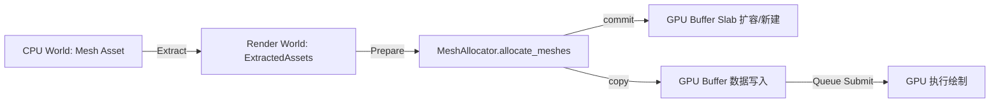

> [[Notes/Bevy/00-Bevy全解析主索引|← 返回 Bevy全解析主索引]]

## 零、这是什么？为什么需要它？

在 Bevy 的渲染架构中，CPU 侧的 `Mesh`（定义在 `bevy_mesh` crate 中）只是资产（Asset），它保存了顶点属性、索引数组等数据。这些数据必须在每一帧被提取到渲染世界（Render World），并最终上传到 GPU 缓冲区，才能被着色器读取。

**RenderMesh** 就是这个过程中的"渲染侧代表"。它不包含原始顶点字节数据本身，而是持有缓冲区的描述信息（顶点数量、AABB、索引格式、顶点布局引用）。真正负责把这些数据写进 GPU 的，是 **MeshAllocator**——一个基于 Slab 分配策略的 GPU 缓冲区管理器。

为什么需要 Slab 分配？如果每个 Mesh 都创建独立的 `wgpu::Buffer`，Draw Call 时就需要频繁绑定不同的缓冲区。Slab 分配把多个 Mesh 的顶点和索引数据打包到同一块大缓冲区中，使得连续绘制多个 Mesh 时无需重新绑定顶点缓冲区，显著降低 API 开销。

---

## 一、模块定位

```
crates/bevy_render/src/
├── mesh/
│   ├── mod.rs          # RenderMesh、RenderMeshBufferInfo、MeshRenderAssetPlugin
│   └── allocator.rs    # MeshAllocator、MeshSlabItem、ElementLayout、allocate_and_free_meshes
└── slab_allocator.rs   # SlabAllocator<T>、AllocationStage、DeallocationStage、GeneralSlab/LargeObjectSlab
```

| 文件 | 职责 |
|------|------|
| `mesh/mod.rs` | 定义 `RenderMesh`（GPU Mesh 的句柄+元数据），实现 `RenderAsset` trait，负责从 CPU `Mesh` 提取渲染所需信息 |
| `mesh/allocator.rs` | 定义 `MeshAllocator`（封装 `SlabAllocator<MeshSlabItem>`），处理顶点/索引/morph 数据的分配与释放 |
| `slab_allocator.rs` | 通用 Slab 分配器，管理 `GeneralSlab`（多对象共享）和 `LargeObjectSlab`（大对象独占），底层使用 `offset_allocator` |

---

## 二、接口层：谁把 Mesh 送进 GPU？

### 2.1 RenderMesh

文件: `src/mesh/mod.rs:61-80`

```rust
/// The render world representation of a [`Mesh`].
#[derive(Debug, Clone)]
pub struct RenderMesh {
    /// 顶点数量
    pub vertex_count: u32,
    /// 模型空间中心点
    pub aabb_center: Vec3,
    /// 缓冲区信息（是否使用索引、索引格式）
    pub buffer_info: RenderMeshBufferInfo,
    /// 预计算的管线 key（图元拓扑、strip index）
    pub key_bits: BaseMeshPipelineKey,
    /// 顶点缓冲区布局引用（指向 MeshVertexBufferLayouts 中的缓存布局）
    pub layout: MeshVertexBufferLayoutRef,
}
```

**`RenderMesh` 不是缓冲区本身，而是缓冲区的"身份证"。** 它告诉渲染管线：
- 这个 Mesh 有多少顶点？
- 索引是 `U16` 还是 `U32`？
- 顶点属性如何排布（`MeshVertexBufferLayoutRef`）？
- 绘制时用三角形列表还是三角形带（`key_bits`）？

### 2.2 MeshVertexBufferLayoutRef

文件: `bevy_mesh/src/vertex.rs:951`

```rust
pub struct MeshVertexBufferLayoutRef(pub Arc<MeshVertexBufferLayout>);
```

这是顶点布局的**引用计数句柄**。Bevy 中不同 Mesh 可能共享相同的顶点属性组合（比如都有 `POSITION` + `NORMAL` + `UV0`），通过 `Arc` 共享布局描述可以避免重复计算 `wgpu::VertexBufferLayout`。

### 2.3 MeshRenderAssetPlugin

文件: `src/mesh/mod.rs:33-57`

```rust
pub struct MeshRenderAssetPlugin;

impl Plugin for MeshRenderAssetPlugin {
    fn build(&self, app: &mut App) {
        app
            // Mesh 必须在 Image 之后准备，因为 morph target 依赖于图像
            .add_plugins(RenderAssetPlugin::<RenderMesh, GpuImage>::default())
            .add_plugins(MeshAllocatorPlugin);
        // ... 初始化 MeshVertexBufferLayouts
    }
}
```

这是一个**组合插件**：
1. 注册 `RenderAssetPlugin<RenderMesh, GpuImage>`，使得 `Mesh` 资产变更时自动触发提取（Extract）和准备（Prepare）阶段；
2. 注册 `MeshAllocatorPlugin`，在渲染世界插入 `MeshAllocator` 系统，负责实际的 GPU 缓冲区分配。

### 2.4 MeshAllocator

文件: `src/mesh/allocator.rs:44-57`

```rust
#[derive(Resource, Deref, DerefMut)]
pub struct MeshAllocator {
    #[deref]
    slab_allocator: SlabAllocator<MeshSlabItem>,
    /// 当前平台是否支持 base_vertex（WebGL 2 不支持）
    general_vertex_slabs_supported: bool,
}
```

`MeshAllocator` 是对通用 `SlabAllocator` 的特化封装。它通过 `#[deref]` 直接暴露 `SlabAllocator` 的方法，同时记录平台能力（`BASE_VERTEX`），决定是否可以把多个 Mesh 的顶点数据打包到同一块 slab。

---

## 三、数据层：RenderMesh 的字段与 Slab 分配

### 3.1 RenderMeshBufferInfo

文件: `src/mesh/mod.rs:111-118`

```rust
pub enum RenderMeshBufferInfo {
    Indexed { count: u32, index_format: IndexFormat },
    NonIndexed,
}
```

区分带索引和不带索引的绘制方式。`count` 是索引数量，`index_format` 对应 `wgpu::IndexFormat::Uint16` 或 `Uint32`。

### 3.2 MeshSlabItem

文件: `src/mesh/allocator.rs:100-110`

```rust
pub struct MeshSlabItem;

impl SlabItem for MeshSlabItem {
    type Key = MeshAllocationKey;   // 分配的唯一标识
    type Layout = ElementLayout;     // 单个元素（顶点/索引）的布局
    fn label() -> Cow<'static, str> { "mesh".into() }
}
```

`MeshSlabItem` 是**零大小类型（ZST）**，只用于给 `SlabAllocator` 提供关联类型。真正的分配键是 `MeshAllocationKey`：

文件: `src/mesh/allocator.rs:134-148`

```rust
pub struct MeshAllocationKey {
    pub mesh_id: AssetId<Mesh>,   // 资产 ID
    pub class: ElementClass,      // Vertex / Index / MorphTarget
}
```

同一个 Mesh 会在 Slab 分配器中有 1~3 个 `MeshAllocationKey`（顶点必有，索引和 morph 可选）。

### 3.3 ElementLayout：元素布局与 Slot 对齐

文件: `src/mesh/allocator.rs:176-189`

```rust
pub struct ElementLayout {
    class: ElementClass,         // Vertex / Index / MorphTarget
    size: u64,                   // 单个元素字节大小
    elements_per_slot: u32,      // 每个 slot 包含几个元素（对齐用）
}
```

**为什么需要 `elements_per_slot`？**

GPU 缓冲区在进行 `copy_buffer_to_buffer`（如 slab 扩容时）时，要求复制偏移和大小对齐到 `COPY_BUFFER_ALIGNMENT`（4 字节）。如果单个顶点大小不是 4 的倍数（比如 6 字节或 10 字节），直接按元素复制会破坏对齐要求。`ElementLayout` 通过把多个元素打包成一个 "slot"，确保 slot 的总大小是 4 的倍数。

文件: `src/mesh/allocator.rs:523-537`

```rust
fn new(class: ElementClass, size: u64) -> ElementLayout {
    const { assert!(4 == COPY_BUFFER_ALIGNMENT); }
    // 等价于 4 / gcd(4, size)，这里用查表实现
    let elements_per_slot = [1, 4, 2, 4][size as usize & 3];
    ElementLayout { class, size, elements_per_slot }
}
```

例如：
- `size = 2`（U16 索引）：`2 & 3 = 2`，`elements_per_slot = 2`，slot 大小 = 4 字节 ✅
- `size = 4`（U32 索引或常见顶点）：`4 & 3 = 0`，`elements_per_slot = 1`，slot 大小 = 4 字节 ✅
- `size = 6`（假设的顶点格式）：`6 & 3 = 2`，`elements_per_slot = 2`，slot 大小 = 12 字节 ✅（12 是 4 的倍数）

### 3.4 MeshSlabs：一个 Mesh 占用的 Slab ID

文件: `src/mesh/allocator.rs:113-123`

```rust
pub struct MeshSlabs {
    pub vertex_slab_id: MeshSlabId,
    pub index_slab_id: Option<MeshSlabId>,
    #[cfg(feature = "morph")]
    pub morph_target_slab_id: Option<MeshSlabId>,
}
```

一个 Mesh 的数据可能分散在 1~3 个 slab 中。`MeshAllocator::mesh_slabs()` 方法返回这些 ID，供后续查询 `mesh_vertex_slice()` 和 `mesh_index_slice()` 使用。

### 3.5 SlabAllocator 核心数据结构

文件: `src/slab_allocator.rs:56-77`

```rust
pub struct SlabAllocator<I: SlabItem> {
    pub slabs: HashMap<SlabId<I>, Slab<I>>,      // 所有 slab
    next_slab_id: SlabId<I>,
    pub key_to_slab: HashMap<I::Key, SlabId<I>>, // key -> slab 映射
    slab_layouts: HashMap<I::Layout, Vec<SlabId<I>>>, // 按布局分组的 slab
    pub extra_buffer_usages: BufferUsages,
}
```

Slab 分为两类：

```
Slab<I>
├── General(GeneralSlab<I>)       # 普通 slab：多个 Mesh 共享
│   ├── allocator: Allocator      # offset_allocator 实例
│   ├── buffer: Option<Buffer>    # GPU 缓冲区（可能尚未创建）
│   ├── resident_allocations      # 已上传 GPU 的分配
│   ├── pending_allocations       # 本帧新分配、等待上传
│   ├── element_layout            # 元素布局（大小+对齐）
│   └── current_slot_capacity     # 当前容量（slot 数）
└── LargeObject(LargeObjectSlab<I>) # 大对象 slab：独占一个 Buffer
    ├── buffer: Option<Buffer>
    └── element_layout
```

---

## 四、逻辑层：allocate_and_free_meshes 全流程

### 4.1 入口系统

文件: `src/mesh/allocator.rs:243-262`

```rust
pub fn allocate_and_free_meshes(
    mut mesh_allocator: ResMut<MeshAllocator>,
    mesh_allocator_settings: Res<MeshAllocatorSettings>,
    extracted_meshes: Res<ExtractedAssets<RenderMesh>>,
    mut mesh_vertex_buffer_layouts: ResMut<MeshVertexBufferLayouts>,
    render_device: Res<RenderDevice>,
    render_queue: Res<RenderQueue>,
) {
    // 1. 释放被移除或修改的 Mesh
    mesh_allocator.free_meshes(&extracted_meshes);
    // 2. 为新加入或修改的 Mesh 分配空间
    mesh_allocator.allocate_meshes(...);
}
```

该系统在 `RenderSystems::PrepareAssets` 阶段、且 **在 `prepare_assets::<RenderMesh>` 之前** 运行（`src/mesh/allocator.rs:201-204`）。这意味着：先分配 GPU 空间，再让 `RenderAssetPlugin` 完成其他准备。

### 4.2 释放流程 free_meshes

文件: `src/mesh/allocator.rs:499-517`

```rust
fn free_meshes(&mut self, extracted_meshes: &ExtractedAssets<RenderMesh>) {
    let mut deallocation_stage = self.slab_allocator.stage_deallocation();
    // 合并 removed 和 modified：修改过的 Mesh 需要先释放旧空间
    let meshes_to_free = extracted_meshes.removed.iter()
        .chain(extracted_meshes.modified.iter());
    for mesh_id in meshes_to_free {
        deallocation_stage.free(&MeshAllocationKey::new(*mesh_id, ElementClass::Vertex));
        deallocation_stage.free(&MeshAllocationKey::new(*mesh_id, ElementClass::Index));
        // ... morph
    }
    deallocation_stage.commit();
}
```

释放采用**批量提交**模式：
1. `stage_deallocation()` 创建 `DeallocationStage`；
2. 对每个 Mesh 的 Vertex/Index/Morph key 调用 `free()`；
3. `commit()` 真正从 `offset_allocator` 释放内存，并清理空 slab。

### 4.3 分配流程 allocate_meshes

文件: `src/mesh/allocator.rs:362-430`

```rust
fn allocate_meshes(&mut self, ...) {
    let mut allocation_stage = self.slab_allocator.stage_allocation();
    for (mesh_id, mesh) in &extracted_meshes.extracted {
        let vertex_buffer_size = mesh.get_vertex_buffer_size() as u64;
        if vertex_buffer_size == 0 { continue; }

        // --- 顶点数据 ---
        let vertex_element_layout = ElementLayout::vertex(..., mesh);
        if self.general_vertex_slabs_supported {
            allocation_stage.allocate(key, vertex_buffer_size, vertex_element_layout, settings);
        } else {
            // WebGL 2：每个 Mesh 独占一个 slab
            allocation_stage.allocate_large(key, vertex_element_layout);
        }

        // --- 索引数据 ---
        if let (Some(data), Some(layout)) = (mesh.get_index_buffer_bytes(), ElementLayout::index(mesh)) {
            allocation_stage.allocate(key, data.len() as u64, layout, settings);
        }

        // --- morph 数据 ---
        #[cfg(feature = "morph")]
        if let Some(morph_targets) = mesh.get_morph_targets() {
            allocation_stage.allocate(key, ..., MORPH_ATTRIBUTE_ELEMENT_LAYOUT, settings);
        }
    }
    // 执行 slab 扩容/新建
    allocation_stage.commit(render_device, render_queue);

    // 把实际数据拷贝进 slab
    for (mesh_id, mesh) in &extracted_meshes.extracted {
        self.copy_mesh_vertex_data(mesh_id, mesh, ...);
        self.copy_mesh_index_data(mesh_id, mesh, ...);
        // ... morph
    }
}
```

**关键设计：分配和上传分两步。**

第一步 `commit()` 只处理 slab 的容量变化（扩容或新建缓冲区），第二步才把数据写入。这样做的好处是：如果同一帧内多个 Mesh 被分配到同一个 slab，`commit()` 只需要创建/扩容一次缓冲区，避免中间状态的多次 realloc。

### 4.4 Slab 扩容与 GPU 拷贝

文件: `src/slab_allocator.rs:805-855`

```rust
fn reallocate_slab(&mut self, render_device, render_queue, slab_id, slab_to_grow) {
    let old_buffer = slab.buffer.take();
    // 创建新 Buffer（容量更大）
    let new_buffer = render_device.create_buffer(&BufferDescriptor {
        size: slab.current_slot_capacity as u64 * slab.element_layout.slot_size(),
        usage: BufferUsages::COPY_SRC | BufferUsages::COPY_DST | ...,
        mapped_at_creation: false,
    });
    slab.buffer = Some(new_buffer.clone());

    // 把旧 Buffer 的数据拷贝到新 Buffer
    if let Some(old_buffer) = old_buffer {
        let mut encoder = render_device.create_command_encoder(...);
        encoder.copy_buffer_to_buffer(&old_buffer, 0, &new_buffer, 0, ...);
        render_queue.submit([encoder.finish()]);
    }
}
```

扩容时通过 `CommandEncoder` 执行 GPU-to-GPU 拷贝，**不需要 CPU 介入搬运数据**。旧 Buffer 在提交后由 wgpu 内部回收。

### 4.5 数据上传 copy_element_data

文件: `src/slab_allocator.rs:928-999`

```rust
pub fn copy_element_data(&mut self, key, len, fill_data, render_device, render_queue) {
    match slab {
        Slab::General(general_slab) => {
            // 从 pending_allocations 中移除 -> 变为 resident_allocations
            let allocated_range = general_slab.pending_allocations.remove(key).unwrap();
            let buffer = general_slab.buffer.as_ref().unwrap();
            // 用 write_buffer_with 映射并写入
            if let Some(mut buffer) = render_queue.write_buffer_with(buffer, offset, size) {
                fill_data(buffer.slice(..len));
            }
            general_slab.resident_allocations.insert(key.clone(), allocated_range);
        }
        Slab::LargeObject(large_object_slab) => {
            // 大对象直接创建 mapped_at_creation=true 的 Buffer
            let buffer = render_device.create_buffer(&BufferDescriptor {
                size: len as u64,
                mapped_at_creation: true,
                ...
            });
            fill_data(buffer.slice(..).get_mapped_range_mut().slice(..len));
            buffer.unmap();
            large_object_slab.buffer = Some(buffer);
        }
    }
}
```

**GeneralSlab** 使用 `write_buffer_with`（staging buffer 方式），适合小块增量写入；**LargeObjectSlab** 使用 `mapped_at_creation` 直接映射写入，适合一次性写入大对象。

---

## 五、设计决策分析

### 5.1 为什么使用 Slab 分配？

**对比方案：每个 Mesh 一个独立 Buffer**

| 维度 | 独立 Buffer | Slab 分配 |
|------|-------------|-----------|
| Draw Call 绑定开销 | 高：每画一个 Mesh 都要 `set_vertex_buffer` | 低：同 slab 的 Mesh 只需一次绑定 |
| GPU 内存碎片 | 少：释放即回收 | 有：slab 内可能产生碎片 |
| Buffer 数量 | 多：O(N) 个 | 少：O(顶点布局种类) 个 |
| 扩容代价 | 无：大小固定 | 有：需要 GPU-to-GPU 拷贝 |

Bevy 选择 Slab 分配的核心动机是**减少 Draw Call 前的状态变更**。现代渲染器中，CPU 侧提交命令的速度往往是瓶颈，而 `set_vertex_buffer` 是常见的状态变更点。把多个 Mesh 塞进同一块 Buffer，配合 `base_vertex` 参数，就能用同一个缓冲区连续绘制多个物体。

### 5.2 为什么区分 general_vertex_slabs_supported？

文件: `src/mesh/allocator.rs:50-56`

```rust
/// 这对应 DownlevelFlags::BASE_VERTEX，在 WebGL 2 上未设置。
/// 在该平台上，我们必须给每个顶点数组自己的缓冲区，
/// 因为绘制时无法调整第一个顶点。
general_vertex_slabs_supported: bool,
```

`BASE_VERTEX` 是 `glDrawElementsBaseVertex` 的等价功能。没有这个特性时，`drawIndexed` 调用无法指定一个偏移量来跳过缓冲区前面的顶点。如果多个 Mesh 的顶点数据被放在同一块缓冲区中，第二个 Mesh 的顶点会被第一个 Mesh 的顶点布局干扰。

因此，在 WebGL 2 上，Bevy 退化为**每个 Mesh 独占一个 LargeObjectSlab**（`allocate_large`），牺牲一点绑定效率换取兼容性。

### 5.3 为什么用 offset_allocator 而不是自定义分配器？

`offset_allocator` 是 Sebastian Aaltonen 的 C++ `OffsetAllocator` 的 Rust 移植，专为**硬实时**场景设计：
- 分配和释放都是 O(1)；
- 使用幂次分组策略，内存碎片可控；
- 支持 32-bit 偏移量，适合 GPU 缓冲区管理。

Bevy 直接复用它，避免了重复造轮子，也保证了分配性能的上限。

---

## 六、上下文：RenderAsset 生命周期



1. **Extract**：`Mesh` 资产变化时，`RenderAssetPlugin` 把数据搬到渲染世界；
2. **PrepareAssets**：`allocate_and_free_meshes` 系统先运行，分配/释放 slab 空间；
3. **Prepare**：`prepare_assets::<RenderMesh>` 完成其他资源准备；
4. **Queue**：渲染命令被提交到 GPU；
5. **Render**：GPU 执行绘制。

---

## 七、关键代码片段

### RenderAsset::prepare_asset 的实现

文件: `src/mesh/mod.rs:165-223`

```rust
fn prepare_asset(
    mesh: Self::SourceAsset,
    _mesh_id: AssetId<Self::SourceAsset>,
    (_, _, mesh_vertex_buffer_layouts, _): &mut SystemParamItem<Self::Param>,
    _: Option<&Self>,
) -> Result<Self, PrepareAssetError<Self::SourceAsset>> {
    let (buffer_info, index_format) = match mesh.indices() {
        Some(indices) => (RenderMeshBufferInfo::Indexed { ... }, Some(indices.into())),
        None => (RenderMeshBufferInfo::NonIndexed, None),
    };
    let mesh_vertex_buffer_layout = mesh.get_mesh_vertex_buffer_layout(mesh_vertex_buffer_layouts);
    let key_bits = BaseMeshPipelineKey::from_primitive_topology_and_strip_index(...);
    Ok(RenderMesh {
        vertex_count: mesh.count_vertices() as u32,
        aabb_center: match mesh.compute_aabb() { Some(aabb) => aabb.center.into(), None => Vec3::ZERO },
        buffer_info,
        key_bits,
        layout: mesh_vertex_buffer_layout,
    })
}
```

**中文注释**：`prepare_asset` 不直接创建 GPU 缓冲区。它只是把 CPU `Mesh` 的元数据（顶点数、索引格式、布局引用）打包成 `RenderMesh`。真正的 GPU 分配由后续的 `MeshAllocator` 系统完成。这种**关注点分离**使得 `RenderAsset` trait 保持通用，而平台相关的缓冲区策略可以独立演进。

---

## 八、延伸阅读

- [[Notes/Bevy/00-Bevy全解析主索引|Bevy 全解析主索引]]
- `bevy_mesh/src/mesh.rs`：`Mesh` CPU 侧数据结构的定义
- `bevy_mesh/src/vertex.rs`：`MeshVertexBufferLayout`、`VertexAttribute` 定义
- `crates/bevy_render/src/render_asset.rs`：`RenderAssetPlugin` 提取-准备框架
- `crates/bevy_render/src/renderer/mod.rs`：`RenderDevice`、`RenderQueue` wgpu 封装

---

## 九、索引状态

- [x] 无数字前缀文件名
- [x] 源码分析笔记归档在 `Notes/Bevy/第三阶段-渲染管线/`
- [x] 包含返回 `[[Notes/Bevy/00-Bevy全解析主索引]]` 的导航链接
- [ ] 需在 `Notes/Bevy/00-Bevy全解析主索引.md` 中添加本笔记链接
