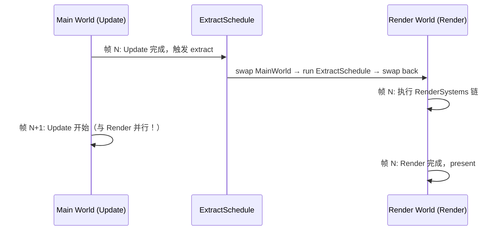

> [[Notes/Bevy/00-Bevy全解析主索引|← 返回 Bevy 全解析主索引]]

# Bevy-bevy_render-源码解析：RenderApp 与提取阶段

> **分析范围**：`crates/bevy_render/src/lib.rs`、`extract_plugin.rs`、`extract_component.rs`、`extract_resource.rs`、`extract_instances.rs`、`extract_param.rs`、`sync_world.rs`、`sync_component.rs` | **分析轮次**：第一轮 + 第二轮 + 第三轮全量 | **源码版本**：Bevy 0.19.0-dev

---

## 零、RenderApp 与提取阶段是什么？为什么需要它？

Bevy 的渲染不发生在主 ECS `World` 中，而是运行在一个**独立的渲染子世界（Render World）**里。这个设计的核心动机是**并行化**：当 GPU 正在渲染第 N 帧时，CPU 的逻辑系统可以同时计算第 N+1 帧的 gameplay 状态。如果渲染和模拟共享同一个 World，所有资源访问都会串行化，CPU 和 GPU 无法真正重叠工作。

但问题是：渲染需要知道场景中的相机位置、网格数据、变换矩阵、材质参数等——这些信息全在主 World 里。所以每帧必须有一个**数据搬运阶段**：把主 World 中渲染所需的数据**提取（Extract）**到渲染 World。这就是 **ExtractSchedule** 的职责。

> **一句话总结**：RenderApp 是渲染的专属 ECS 世界；提取阶段是每帧从主世界到渲染世界的"数据快照"。

---

## 一、模块定位与构建定义

### 1.1 Cargo.toml 定位

> 文件：`crates/bevy_render/Cargo.toml`

`bevy_render` 是 Bevy 渲染系统的核心 crate，版本 `0.19.0-dev`。它依赖 `bevy_app`（SubApp 机制）、`bevy_ecs`（ECS 核心）、`bevy_asset`（资源系统）、`wgpu`（GPU 后端抽象）等。关键特性包括 `multi_threaded`（并行渲染）、`webgl`/`webgpu`（Web 后端切换）。

### 1.2 关键文件职责表

| 文件 | 行数 | 职责 |
|------|------|------|
| `src/lib.rs` | ~587 | `RenderPlugin` 总入口、`RenderSystems` 管线阶段定义、`Render` Schedule 构建 |
| `src/extract_plugin.rs` | ~254 | `ExtractPlugin`：创建 `RenderApp` SubApp，配置 `ExtractSchedule` 和世界交换逻辑 |
| `src/extract_component.rs` | ~133 | `ExtractComponent` trait：定义组件如何从主世界提取到渲染世界 |
| `src/extract_resource.rs` | ~90 | `ExtractResource` trait：定义资源（Resource）的提取逻辑 |
| `src/extract_instances.rs` | ~140 | `ExtractInstance` trait：高性能批量提取到 HashMap，绕过 ECS 组件插入开销 |
| `src/extract_param.rs` | ~120 | `Extract<P>` 系统参数：让提取系统直接读取主世界数据 |
| `src/sync_world.rs` | ~400 | 主世界 ↔ 渲染世界的实体同步（创建、销毁、映射） |
| `src/sync_component.rs` | ~80 | `SyncComponent` trait：定义组件在主世界删除时如何在渲染世界同步删除 |
| `src/pipelined_rendering.rs` | ~200 | 流水线渲染：让 `Render` Schedule 与主世界 `Update` 并行执行 |

---

## 二、第一轮：接口层（What）

### 2.1 RenderPlugin — 渲染总入口

> 文件：`src/lib.rs`，第 128~149 行、第 348~417 行

```rust
#[derive(Default)]
pub struct RenderPlugin {
    pub render_creation: RenderCreation,
    pub synchronous_pipeline_compilation: bool,
    pub debug_flags: RenderDebugFlags,
}
```

`RenderPlugin` 是整个渲染系统的启动器。`build` 方法完成以下关键工作：

1. 初始化 `Shader` 资产和加载器
2. 调用 `insert_future_resources` 异步初始化 wgpu 后端
3. 添加 `ExtractPlugin` —— 这是主世界与渲染世界的桥梁
4. 注册一系列子插件：`WindowRenderPlugin`、`CameraPlugin`、`ViewPlugin`、`MeshRenderAssetPlugin`、`TexturePlugin` 等
5. 在 `RenderApp` 中配置 `RenderScheduleOrder`、`RenderAssetBytesPerFrameLimiter` 等资源

### 2.2 RenderSystems — 渲染管线阶段

> 文件：`src/lib.rs`，第 154~208 行

```rust
#[derive(Debug, Hash, PartialEq, Eq, Clone, SystemSet)]
pub enum RenderSystems {
    ExtractCommands,      // 应用提取阶段的 deferred commands
    PrepareAssets,        // 准备 GPU 资产（Mesh、Texture 等）
    PrepareMeshes,        // 准备网格数据
    CreateViews,          // 创建额外视图（如阴影贴图）
    Specialize,           // 管线特化（根据材质/网格组合生成专属管线）
    PrepareViews,         // 准备视图资源和 uniform
    Queue,                // 将可见实体加入渲染阶段
    PhaseSort,            // 排序阶段项
    Prepare,              // 准备渲染资源、BindGroup
    Render,               // 实际执行 GPU 渲染命令
    Cleanup,              // 清理临时资源
    PostCleanup,          // 最终清理临时实体
}
```

这些阶段通过 `Render::base_schedule()` 配置为严格链式执行（`chain()`），构成了 Bevy 渲染一帧的完整流水线。

### 2.3 ExtractPlugin — 提取阶段的核心插件

> 文件：`src/extract_plugin.rs`，第 16~77 行

```rust
pub struct ExtractPlugin {
    /// 每帧提取开始前执行的回调
    pub pre_extract: fn(&mut World, &mut World),
}

impl Plugin for ExtractPlugin {
    fn build(&self, app: &mut App) {
        app.add_plugins(SyncWorldPlugin);
        app.init_resource::<ScratchMainWorld>();

        let mut render_app = SubApp::new();
        let mut extract_schedule = Schedule::new(ExtractSchedule);
        extract_schedule.set_build_settings(ScheduleBuildSettings {
            auto_insert_apply_deferred: false,
            ..default()
        });
        extract_schedule.set_apply_final_deferred(false);

        render_app
            .add_schedule(Render::base_schedule())
            .add_schedule(extract_schedule)
            .allow_ambiguous_resource::<MainWorld>();

        let pre_extract = self.pre_extract;
        render_app.set_extract(move |main_world, render_world| {
            pre_extract(main_world, render_world);
            entity_sync_system(main_world, render_world);
            extract(main_world, render_world);
        });

        app.insert_sub_app(RenderApp, render_app);
    }
}
```

`ExtractPlugin` 的核心职责：
1. 创建 `RenderApp`（`SubApp` 类型）
2. 配置 `ExtractSchedule`：**禁用自动 apply_deferred**，确保提取命令延迟到 `RenderSystems::ExtractCommands` 才执行
3. 设置 `extract` 闭包：每帧先执行 `pre_extract`，然后同步实体，最后运行提取

### 2.4 提取相关 Trait 与系统

| Trait/类型 | 文件 | 职责 |
|-----------|------|------|
| `ExtractComponent` | `extract_component.rs:30` | 定义组件提取规则：`QueryData → Option<Out>` |
| `ExtractComponentPlugin<C>` | `extract_component.rs:60` | 为指定组件注册提取系统到 `ExtractSchedule` |
| `ExtractResource` | `extract_resource.rs:18` | 定义资源提取规则：`Source → Self` |
| `ExtractResourcePlugin<R>` | `extract_resource.rs:33` | 为指定资源注册提取系统 |
| `ExtractInstance` | `extract_instances.rs:31` | 高性能实例提取，输出到 `HashMap` Resource 而非 ECS 组件 |
| `Extract<P>` | `extract_param.rs:50` | 系统参数包装器，让提取系统直接访问 `MainWorld` 中的任意数据 |

---

## 三、第二轮：数据层（How - Structure）

### 3.1 核心数据结构关系

```
App (主应用)
├── World (主世界)
│   ├── Camera, Mesh, Transform, Material ...
│   └── ScratchMainWorld (临时世界，用于交换)
│
└── SubApp: RenderApp (渲染子应用)
    ├── World (渲染世界)
    │   ├── MainWorld (资源: 当前帧的主世界快照)
    │   ├── ExtractedCamera, ExtractedView ...
    │   ├── RenderMesh, GpuImage ...
    │   └── ViewBinnedRenderPhases, ViewSortedRenderPhases ...
    │
    ├── Schedule: ExtractSchedule
    └── Schedule: Render (RenderSystems 链式阶段)
```

### 3.2 MainWorld — 被"借"到渲染世界的主世界

> 文件：`src/extract_plugin.rs`，第 101~106 行

```rust
#[derive(Resource, Default, Deref, DerefMut)]
pub struct MainWorld(World);
```

`MainWorld` 是一个**资源**，但它的内部是一个完整的 `World`。在提取阶段，整个主世界被 `core::mem::replace`  swap 进渲染世界，提取系统可以通过 `Res<MainWorld>` 或 `Extract<Query<...>>` 读取主世界数据。提取完成后，世界被 swap 回去。

### 3.3 ScratchMainWorld — 避免每帧分配的世界

> 文件：`src/extract_plugin.rs`，第 110~111 行

```rust
#[derive(Resource, Default)]
struct ScratchMainWorld(World);
```

如果没有 `ScratchMainWorld`，每帧 swap 都需要分配一个新的空 `World`。`ScratchMainWorld` 复用上一次 swap 留下的空世界，避免每帧堆分配。

### 3.4 RenderEntity / MainEntity — 跨世界实体映射

> 文件：`src/sync_world.rs`

```rust
// 主世界实体在渲染世界的对应物
#[derive(Component)]
pub struct RenderEntity(pub Entity);  // 渲染世界中的实体 ID

// 渲染世界实体对应的主世界实体
#[derive(Component)]
pub struct MainEntity(pub Entity);    // 主世界中的实体 ID
```

当主世界的一个实体被标记为 `SyncToRenderWorld` 时，`SyncWorldPlugin` 会在渲染世界创建一个对应实体，并在两者间建立双向映射。提取系统使用 `RenderEntity` 来确定应该把组件插入到渲染世界的哪个实体上。

### 3.5 ExtractComponent 的数据流

> 文件：`src/extract_component.rs`，第 30~48 行

```rust
pub trait ExtractComponent<F = ()>: SyncComponent<F> {
    type QueryData: ReadOnlyQueryData;   // 主世界查询的数据
    type QueryFilter: QueryFilter;        // 过滤条件
    type Out: Bundle<Effect: NoBundleEffect>; // 输出到渲染世界的组件包

    fn extract_component(item: QueryItem<'_, '_, Self::QueryData>) -> Option<Self::Out>;
}
```

一个典型实现（如 `ExtractComponentPlugin::<Transform>`）：
- `QueryData = &'static GlobalTransform`
- `Out = GlobalTransform`
- 提取系统遍历所有有 `RenderEntity` + `GlobalTransform` 的实体，把 `GlobalTransform` clone 到渲染世界

### 3.6 ExtractInstances — 绕过 ECS 的高性能批量提取

> 文件：`src/extract_instances.rs`，第 31~56 行

```rust
pub trait ExtractInstance: Send + Sync + Sized + 'static {
    type QueryData: ReadOnlyQueryData;
    type QueryFilter: QueryFilter;
    fn extract(item: QueryItem<'_, '_, Self::QueryData>) -> Option<Self>;
}

#[derive(Resource)]
pub struct ExtractedInstances<EI>(pub MainEntityHashMap<EI>);
```

与 `ExtractComponent` 不同，`ExtractInstance` 不创建 ECS 组件，而是把数据收集到一个**全局 HashMap Resource** 中。这对于大量实例（如粒子、草地）性能更高，因为避免了 ECS archetype 变更开销。

---

## 四、第三轮：逻辑层（How - Behavior）

### 4.1 extract() 函数：世界交换的核心逻辑

> 文件：`src/extract_plugin.rs`，第 115~126 行

```rust
pub fn extract(main_world: &mut World, render_world: &mut World) {
    // 1. 从主世界取出 ScratchMainWorld
    let scratch_world = main_world.remove_resource::<ScratchMainWorld>().unwrap();
    // 2. 把主世界替换为空的 scratch 世界
    let inserted_world = core::mem::replace(main_world, scratch_world.0);
    // 3. 把原主世界作为资源插入渲染世界
    render_world.insert_resource(MainWorld(inserted_world));
    // 4. 在渲染世界运行 ExtractSchedule
    render_world.run_schedule(ExtractSchedule);
    // 5. 把主世界从渲染世界取出
    let inserted_world = render_world.remove_resource::<MainWorld>().unwrap();
    // 6. 把主世界 swap 回去
    let scratch_world = core::mem::replace(main_world, inserted_world.0);
    // 7. 把空的 scratch 世界存回主世界，供下帧复用
    main_world.insert_resource(ScratchMainWorld(scratch_world));
}
```

**关键决策点**：
- 为什么用 `mem::replace` 而不是 `clone`？`World` 的 clone 代价极高（包含所有实体、组件、资源）。`mem::replace` 只是交换两个指针/句柄，O(1) 操作。
- 为什么需要 `ScratchMainWorld`？如果不复用空 World，每帧都需要 `World::new()` 分配内部存储。

### 4.2 entity_sync_system：跨世界实体生命周期同步

> 文件：`src/sync_world.rs`

```rust
pub fn entity_sync_system(main_world: &mut World, render_world: &mut World) {
    // 1. 处理主世界新创建的 SyncToRenderWorld 实体
    //    → 在渲染世界 spawn 对应实体，插入 RenderEntity + MainEntity
    // 2. 处理主世界销毁的 SyncToRenderWorld 实体
    //    → 在渲染世界 despawn 对应实体
    // 3. 处理主世界实体的组件添加/移除（通过 Observer）
    //    → 通过 SyncComponent 在渲染世界同步
}
```

Bevy 使用 **Observer 模式**（`OnAdd`、`OnRemove`）来监听主世界实体的变化，而不是每帧全量扫描。这大幅降低了同步开销。

### 4.3 提取系统的执行流程

以 `extract_components::<GlobalTransform>` 为例：

```rust
fn extract_components<C: ExtractComponent<F>, F>(
    mut commands: Commands,
    mut previous_len: Local<usize>,
    query: Extract<Query<(RenderEntity, C::QueryData), C::QueryFilter>>,
) {
    let mut values = Vec::with_capacity(*previous_len);
    for (entity, query_item) in &query {
        if let Some(component) = C::extract_component(query_item) {
            values.push((entity, component));
        } else {
            commands.entity(entity).remove::<C::Target>();
        }
    }
    *previous_len = values.len();
    commands.try_insert_batch(values);  // 批量插入，减少命令缓冲区碎片
}
```

**关键决策点**：
- `previous_len` 用于预分配 `Vec` 容量，避免每帧重新分配。这是基于"本帧实体数与上帧相近"的假设。
- `try_insert_batch` 一次性批量插入所有组件，比逐实体 `commands.insert` 效率高得多。
- 提取失败（`extract_component` 返回 `None`）时，主动移除目标组件，确保渲染世界状态与主世界一致。

### 4.4 流水线渲染：extract 与 update 并行

> 文件：`src/pipelined_rendering.rs`

当启用 `PipelinedRenderingPlugin` 时：
- 主世界的 `Update` Schedule 和渲染世界的 `Render` Schedule 可以**并行执行**
- `ExtractSchedule` 仍然需要串行（因为它要访问主世界）
- `apply_extract_commands` 被放在 `RenderSystems::ExtractCommands`，在 `Render` Schedule 开始时执行，允许提取命令与主世界逻辑并行



---

## 五、设计决策分析

### 5.1 设计决策：为什么用 SubApp 而不是在主世界直接加渲染系统？

**问题背景**：渲染需要大量专用资源和系统，且渲染与 gameplay 的更新频率/时序不同。

**naive 方案**：在主世界增加 `RenderStage`，把渲染系统直接插入主 Schedule。
- 优点：简单，不需要数据同步。
- 缺点：CPU gameplay 和 GPU 渲染完全串行；渲染系统会阻塞主线程的逻辑更新；无法利用多核让逻辑和渲染并行。

**实际方案**：`SubApp` + 独立的渲染 World。
- 优点：
  - 渲染和 gameplay 可以**完全并行**（pipelined rendering）
  - 渲染世界可以有自己独立的 ECS 架构（如不同的组件集、不同的 SystemSet 配置）
  - 数据隔离： gameplay 系统无法意外修改渲染资源
- 代价：
  - 需要显式的提取机制（ExtractSchedule）
  - 跨世界实体映射增加了心智负担
  - 提取阶段引入了一帧的潜在延迟

**对比其他引擎**：
- **UE**：使用独立的 Render Thread，通过 `FRenderCommand` 队列与 Game Thread 通信。数据通过 `FPrimitiveSceneProxy` 提取到渲染线程。
- **chaos**：通常使用单线程或简单的任务队列，较少有独立的渲染 World 概念。

### 5.2 设计决策：为什么提取用 World swap 而不是只读引用？

**naive 方案**：`extract()` 接收 `&World`（主世界只读引用），提取系统直接查询。
- 优点：语义清晰，不需要 move。
- 缺点：
  - `&World` 无法运行 `SystemState`（许多 Bevy 系统参数需要 `&mut World` 来初始化）
  - `Extract<P>` 系统参数需要 `SystemState<P>` 存储在 `MainWorld` 上，需要 `&mut World` 来维护状态

**实际方案**：`mem::replace` 把主世界 move 进渲染世界作为资源。
- 优点：`MainWorld` 是 `Resource`，提取系统可以拿到 `ResMut<MainWorld>`，即 `&mut World`，可以运行任意系统参数。
- 代价：swap 操作虽然 O(1)，但需要非常小心生命周期管理；如果 panics 发生在 swap 中间，可能导致主世界丢失。

---

## 六、关联辐射（Context）

### 6.1 与上层模块的关系
- **bevy_app**：`SubApp` 机制和 `AppLabel` 是 `RenderApp` 的基础设施。`RenderPlugin` 本身就是标准 Plugin。
- **bevy_ecs**：`Schedule`、`SystemSet`、`World`、`Commands` 是提取和渲染的底层机制。
- **bevy_asset**：资产（`Mesh`、`Image`、`Shader`）在主世界加载，通过 `RenderAsset` trait 提取到渲染世界。

### 6.2 与下层模块的关系
- **RenderSystems**：提取完成后，渲染世界进入 `Render` Schedule 的链式阶段（`PrepareAssets` → `Queue` → `Render`）
- **sync_world**：实体同步是提取的前提；没有 `RenderEntity` 映射，提取系统不知道把组件写给谁。
- **pipelined_rendering**：在提取之上实现并行渲染，是性能最大化的关键。

### 6.3 跨引擎对照
| 维度 | Bevy (SubApp + Extract) | UE (Render Thread) |
|------|------------------------|-------------------|
| 数据同步 | World swap + ECS 提取 | `ENQUEUE_RENDER_COMMAND` + Proxy 对象 |
| 并行模型 | 两帧重叠（N 渲染 ∥ N+1 逻辑） | 游戏线程提交命令队列，渲染线程消费 |
| 实体映射 | `RenderEntity` / `MainEntity` 双向组件 | `FPrimitiveSceneProxy` + `FSceneInterface` |
| 生命周期 | `SyncWorldPlugin` + Observer 驱动 | 每帧全量重建 Scene（旧版）或增量更新 |

### 6.4 设计亮点总结
1. **World swap 是零成本抽象**：`mem::replace` 避免了 World clone，使提取阶段极轻量。
2. **Scratch world 复用**：避免每帧堆分配，细节体现工程成熟度。
3. **Observer 驱动同步**：不扫描全量实体，只处理变化， scalable 到大量实体。
4. **延迟 apply_deferred**：提取命令与主世界并行执行，最大化 pipelining 潜力。

---

## 七、关键源码片段

### 7.1 世界交换（extract 函数核心）

> 文件：`src/extract_plugin.rs`，第 115~126 行

```rust
pub fn extract(main_world: &mut World, render_world: &mut World) {
    let scratch_world = main_world.remove_resource::<ScratchMainWorld>().unwrap();
    let inserted_world = core::mem::replace(main_world, scratch_world.0);
    render_world.insert_resource(MainWorld(inserted_world));
    render_world.run_schedule(ExtractSchedule);
    let inserted_world = render_world.remove_resource::<MainWorld>().unwrap();
    let scratch_world = core::mem::replace(main_world, inserted_world.0);
    main_world.insert_resource(ScratchMainWorld(scratch_world));
}
```

### 7.2 ExtractComponent trait 定义

> 文件：`src/extract_component.rs`，第 30~48 行

```rust
pub trait ExtractComponent<F = ()>: SyncComponent<F> {
    type QueryData: ReadOnlyQueryData;
    type QueryFilter: QueryFilter;
    type Out: Bundle<Effect: NoBundleEffect>;
    fn extract_component(item: QueryItem<'_, '_, Self::QueryData>) -> Option<Self::Out>;
}
```

### 7.3 Extract 系统参数

> 文件：`src/extract_param.rs`，第 50~64 行

```rust
pub struct Extract<'w, 's, P: SystemParam>(
    <P as SystemParam>::Item<'w, 's>,
);

unsafe impl<P: ReadOnlySystemParam> ReadOnlySystemParam for Extract<P> {}
```

`Extract<P>` 将任意只读系统参数 `P` 转发到 `MainWorld` 上执行，让提取系统可以像查询主世界一样写代码。

---

## 八、关联阅读

- [[Bevy-bevy_app-源码解析：App 构建与 Plugin 系统]] — SubApp 机制详解
- [[Bevy-bevy_ecs-源码解析：Schedule 与 System 并行调度]] — Schedule 链式配置与 SystemSet
- [[Bevy-bevy_render-源码解析：Render Schedule 与渲染管线驱动]] — Render 阶段详解
- [[Bevy-bevy_render-源码解析：View 与 Camera]] — 视图提取与准备
- [[Bevy-bevy_asset-源码解析：AssetServer 与 Handle]] — RenderAsset 提取管线

---

## 九、索引状态

- **所属阶段**：第三阶段-渲染管线
- **对应索引条目**：`[[Bevy-bevy_render-源码解析：RenderApp 与提取阶段]]`
- **分析轮次**：第一轮 + 第二轮 + 第三轮全量
- **覆盖范围**：
  - ✅ RenderPlugin 与 RenderApp 初始化
  - ✅ ExtractPlugin 与 ExtractSchedule
  - ✅ ExtractComponent / ExtractResource / ExtractInstance / Extract
  - ✅ sync_world 实体同步机制
  - ✅ 世界 swap 与 ScratchMainWorld
  - ✅ 流水线渲染架构
