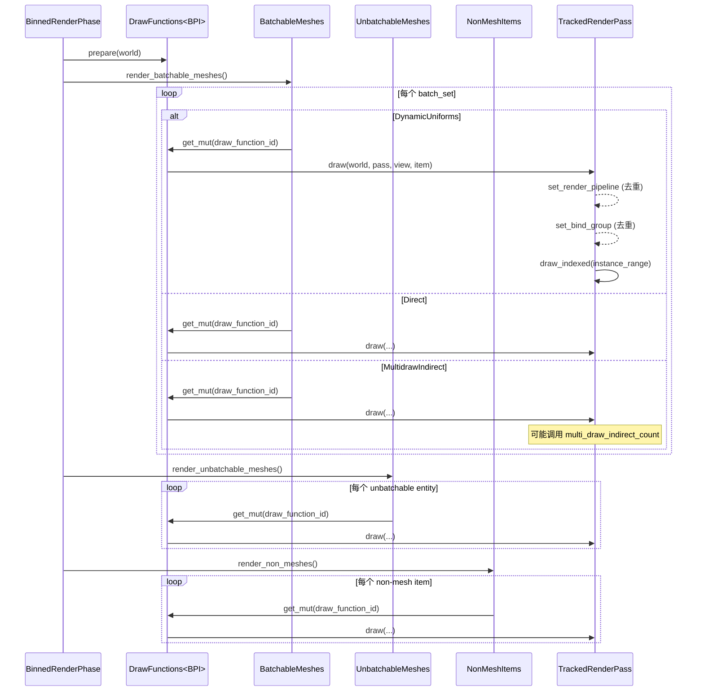

> [[Notes/Bevy/00-Bevy全解析主索引|← 返回 Bevy 全解析主索引]]

## 零、What and Why

在实时渲染中，CPU 端最后一步工作是把"哪些东西要画、按什么顺序画"整理成一份清单交给 GPU。Bevy 的 `render_phase` 模块就是这份清单的制造车间。它不是简单的数组，而是根据绘制需求拆成了两种策略：**Binned（分箱）**适合不透明物体，顺序不重要，只要批次够多；**Sorted（排序）**适合透明物体，必须从远到近保证混合正确。理解 RenderPhase，就是理解 Bevy 如何在 CPU 端完成从"可见实体"到"GPU 命令"的最后一次组织。

Bevy 0.19 在这个模块里引入了 **GPU preprocessing** 和 **multidraw indirect**，把原本 CPU 逐实体准备 uniform 的工作 offload 到 compute shader。这使得 `BinnedRenderPhase` 内部结构比以前复杂得多——它不再只是"放进一个 vec 里排序"，而是维护了一套 CPU/GPU 混合的 bin、batch set、indirect parameters 层级结构。本文从接口层→数据层→逻辑层三层剥离，逐行拆解这套机制。

---

## 一、Module 定位与构建定义

| 文件 | 职责 | 关键导出 |
|------|------|----------|
| `src/render_phase/mod.rs` | RenderPhase 核心定义：`BinnedRenderPhase`、`SortedRenderPhase`、`PhaseItem` trait、batch set 结构、binning/sorting/render 逻辑 | `PhaseItem`, `BinnedPhaseItem`, `SortedPhaseItem`, `ViewBinnedRenderPhases`, `ViewSortedRenderPhases` |
| `src/render_phase/draw.rs` | `Draw` trait 与 `RenderCommand` trait，DrawFunctions 注册表 | `Draw`, `RenderCommand`, `DrawFunctions`, `RenderCommandState` |
| `src/render_phase/draw_state.rs` | `TrackedRenderPass`：带状态去重的 wgpu RenderPass 包装 | `TrackedRenderPass`, `DrawState` |
| `src/render_phase/rangefinder.rs` | 3D 视图空间深度计算，用于透明物体排序 | `ViewRangefinder3d` |
| `src/batching/mod.rs` | Batch 数据抽象：`GetBatchData` / `GetFullBatchData`，以及 sorted phase 的通用 batch 逻辑 | `GetBatchData`, `GetFullBatchData`, `sort_binned_render_phase` |
| `src/batching/gpu_preprocessing.rs` | GPU 预处理路径：compute shader 生成 instance buffer、indirect draw parameters | `GpuPreprocessingMode`, `GpuPreprocessingSupport`, `BatchedInstanceBuffers` |
| `src/batching/no_gpu_preprocessing.rs` | CPU fallback：直接写 `GpuArrayBuffer` | `BatchedInstanceBuffer`, `batch_and_prepare_binned_render_phase` |

---

## 二、第一轮：接口层

### 2.1 PhaseItem —— 所有绘制项的公共接口

```rust
// src/render_phase/mod.rs:1924-1955
pub trait PhaseItem: Sized + Send + Sync + 'static {
    const AUTOMATIC_BATCHING: bool = true;
    fn entity(&self) -> Entity;
    fn main_entity(&self) -> MainEntity;
    fn draw_function(&self) -> DrawFunctionId;
    fn batch_range(&self) -> &Range<u32>;
    fn batch_range_mut(&mut self) -> &mut Range<u32>;
    fn extra_index(&self) -> PhaseItemExtraIndex;
    fn batch_range_and_extra_index_mut(&mut self) -> (&mut Range<u32>, &mut PhaseItemExtraIndex);
}
```

- **`entity` / `main_entity`**：分别对应 render world 和 main world 的实体 ID。Bevy 用 `MainEntity` 做跨世界关联。
- **`draw_function`**：每个 `PhaseItem` 绑定一个 `DrawFunctionId`，渲染时到 `DrawFunctions<P>` 注册表里查找实际的绘制逻辑。
- **`batch_range`**：如果多个 item 被合并成一个 batch，只需要画一次，`batch_range` 记录这个 batch 覆盖的 instance 范围，后续 item 直接跳过。
- **`extra_index`**：可以是 `DynamicOffset`（WebGL 2 无 storage buffer 时的 dynamic uniform offset）或 `IndirectParametersIndex`（GPU culling 时的 indirect draw 参数索引）。两者互斥，打包在一个 `enum` 里。

### 2.2 BinnedPhaseItem —— 不透明物体的分箱策略

```rust
// src/render_phase/mod.rs:2036-2063
pub trait BinnedPhaseItem: PhaseItem {
    type BinKey: Clone + Send + Sync + PartialEq + Eq + Ord + Hash;
    type BatchSetKey: PhaseItemBatchSetKey;
    fn new(
        batch_set_key: Self::BatchSetKey,
        bin_key: Self::BinKey,
        representative_entity: (Entity, MainEntity),
        batch_range: Range<u32>,
        extra_index: PhaseItemExtraIndex,
    ) -> Self;
}
```

- **`BinKey`**：决定实体进哪个 bin。通常按 pipeline id → draw function id → material bind group → mesh 的顺序排列字段，这样相邻 bin 的绑定变化最少，减少 GPU state 切换。
- **`BatchSetKey`**：比 `BinKey` 更粗粒度，用于把多个 bin 合并成一个 **batch set**，供 `multi_draw_indirect` 一次调用绘制。
- **`new`**：Binned 的 phase item 不长期存储在数据结构中，而是**在渲染前即时构造（just-in-time）**，省内存。

### 2.3 SortedPhaseItem —— 透明物体的排序策略

```rust
// src/render_phase/mod.rs:2084-2132
pub trait SortedPhaseItem: PhaseItem {
    type SortKey: Ord;
    fn sort_key(&self) -> Self::SortKey;
    fn sort(items: &mut IndexMap<(Entity, MainEntity), Self, EntityHash>);
    fn recalculate_sort_keys(
        items: &mut IndexMap<(Entity, MainEntity), Self, EntityHash>,
        view: &ExtractedView,
    );
    fn indexed(&self) -> bool;
}
```

- **`SortKey`**：通常是一个 `f32` 距离值（view-space Z）。越小越先画。
- **`recalculate_sort_keys`**：排序前调用，把每个 item 的 `SortKey` 根据当前 view 位置重新计算。透明 3D 物体用这个算深度。
- **`sort`**：默认用 `sort_unstable_by_key`，因为 batch 内相同类型的 item 已经可以用稳定排序保证顺序，其他情况 unstable 更快。

### 2.4 Draw trait —— 绘制函数的抽象

```rust
// src/render_phase/draw.rs:24-42
pub trait Draw<P: PhaseItem>: Send + Sync + 'static {
    fn prepare(&mut self, world: &'_ World) {}
    fn draw<'w>(
        &mut self,
        world: &'w World,
        pass: &mut TrackedRenderPass<'w>,
        view: Entity,
        item: &P,
    ) -> Result<(), DrawError>;
}
```

- **`prepare`**：每 phase 开始前调用一次，可以做一次性初始化。
- **`draw`**：真正往 `TrackedRenderPass` 里写命令。`PhaseItem` 的 `batch_range` 长度决定了画完这个 batch 后跳过多少个 item。

### 2.5 RenderCommand trait —— 可组合的绘制原子

```rust
// src/render_phase/draw.rs:181-220
pub trait RenderCommand<P: PhaseItem> {
    type Param: SystemParam + 'static;
    type ViewQuery: ReadOnlyQueryData;
    type ItemQuery: ReadOnlyQueryData;
    fn render<'w>(
        item: &P,
        view: ROQueryItem<'w, '_, Self::ViewQuery>,
        entity: Option<ROQueryItem<'w, '_, Self::ItemQuery>>,
        param: SystemParamItem<'w, '_, Self::Param>,
        pass: &mut TrackedRenderPass<'w>,
    ) -> RenderCommandResult;
}
```

- **`Param`**：通用的 ECS 资源/查询参数，比如 `SRes<PipelineCache>`。
- **`ViewQuery`**：从 view 实体（camera/light）上读取的数据，比如 `&ExtractedView`。
- **`ItemQuery`**：从被绘制实体上读取的数据。注意 Bevy 并不总是把 mesh 实体提取到 render world，此时这个参数会是 `None`。
- 多个 `RenderCommand` 可以用 tuple 组合成一个 `Draw` 函数。`draw.rs:230-287` 的宏为 0~15 元组实现了组合逻辑，按顺序执行每个 command，遇到 `Skip` 或 `Failure` 提前返回。

### 2.6 CachedRenderPipelinePhaseItem + SetItemPipeline

```rust
// src/render_phase/mod.rs:2138-2169
pub trait CachedRenderPipelinePhaseItem: PhaseItem {
    fn cached_pipeline(&self) -> CachedRenderPipelineId;
}

pub struct SetItemPipeline;
impl<P: CachedRenderPipelinePhaseItem> RenderCommand<P> for SetItemPipeline {
    type Param = SRes<PipelineCache>;
    type ViewQuery = ();
    type ItemQuery = ();
    fn render<'w>(...,
        pipeline_cache: SystemParamItem<'w, '_, Self::Param>,
        pass: &mut TrackedRenderPass<'w>,
    ) -> RenderCommandResult {
        if let Some(pipeline) = pipeline_cache.into_inner().get_render_pipeline(item.cached_pipeline()) {
            pass.set_render_pipeline(pipeline);
            RenderCommandResult::Success
        } else {
            RenderCommandResult::Skip
        }
    }
}
```

这是最常见的 render command：从 `PipelineCache` 取出已编译的 `RenderPipeline` 并绑定到 `TrackedRenderPass`。

---

## 三、第二轮：数据层

### 3.1 BinnedRenderPhase 整体结构

`BinnedRenderPhase` 是不透明物体的核心容器。它的设计哲学是：**用 BinKey 把实体分到不同桶里，同桶内再按 GPU 能力决定是否 multidraw、batch 或单独绘制。**

```rust
// src/render_phase/mod.rs:110-171
pub struct BinnedRenderPhase<BPI>
where BPI: BinnedPhaseItem,
{
    pub multidrawable_meshes: IndexMap<BPI::BatchSetKey, RenderMultidrawableBatchSet<BPI>>,
    pub batchable_meshes: IndexMap<(BPI::BatchSetKey, BPI::BinKey), RenderBin>,
    pub unbatchable_meshes: IndexMap<(BPI::BatchSetKey, BPI::BinKey), UnbatchableBinnedEntities>,
    pub non_mesh_items: IndexMap<(BPI::BatchSetKey, BPI::BinKey), NonMeshEntities>,
    pub(crate) batch_sets: BinnedRenderPhaseBatchSets<BPI::BinKey>,
    cached_entity_bin_keys: MainEntityHashMap<CachedBinnedEntity<BPI>>,
    gpu_preprocessing_mode: GpuPreprocessingMode,
}
```

**ASCII 结构图：**

```text
BinnedRenderPhase<BPI>
├── multidrawable_meshes: IndexMap<BatchSetKey, RenderMultidrawableBatchSet>
│   └── 每个 BatchSet 内部
│       ├── bin_key_to_bin_index: HashMap<BinKey, RenderBinIndex>
│       ├── bins: Vec<Option<RenderMultidrawableBin>>
│       │   └── entity_to_binned_mesh_instance_index: HashMap<MainEntity, RenderBinnedMeshInstanceIndex>
│       ├── gpu_buffers: RenderMultidrawableBatchSetGpuBuffers
│       │   ├── render_binned_mesh_instance_buffer: RawBufferVec<GpuRenderBinnedMeshInstance>
│       │   └── bin_index_to_indirect_parameters_offset_buffer: RawBufferVec<u32>
│       └── render_binned_mesh_instances_cpu: Vec<CpuRenderBinnedMeshInstance>
│
├── batchable_meshes: IndexMap<(BatchSetKey, BinKey), RenderBin>
│   └── entities: IndexMap<MainEntity, InputUniformIndex>
│
├── unbatchable_meshes: IndexMap<(BatchSetKey, BinKey), UnbatchableBinnedEntities>
│   └── entities + buffer_indices (sparse/dense 两种存储)
│
├── non_mesh_items: IndexMap<(BatchSetKey, BinKey), NonMeshEntities>
│   └── 插件自定义绘制命令，Bevy 本身不使用
│
└── batch_sets: BinnedRenderPhaseBatchSets<BinKey>
    ├── DynamicUniforms(Vec<SmallVec<[BinnedRenderPhaseBatch; 1]>>)   // GpuPreprocessingMode::None
    ├── Direct(Vec<BinnedRenderPhaseBatch>)                           // PreprocessingOnly
    └── MultidrawIndirect(Vec<BinnedRenderPhaseBatchSet<BinKey>>)     // Culling
```

### 3.2 RenderMultidrawableBatchSet 详解

这是 Bevy 0.19 新增的最复杂数据结构，专门为 **GPU culling + multidraw indirect** 设计。源码里甚至画了一张 ASCII 图（`mod.rs:394-440`），说明作者也觉得它复杂。

核心思想：**CPU 只维护 entity→bin 的映射和 bin→indirect offset 的映射；GPU buffer 里存的是每个 mesh instance 的 `input_uniform_index` 和 `bin_index`。compute shader 根据这些信息生成 `PreprocessWorkItem`，再由 GPU 完成 culling 和 indirect parameters 填充。**

关键字段：
- **`bin_key_to_bin_index`**：稳定的 bin 索引，frame-to-frame 不变（除非 bin 被删除）。
- **`indirect_parameters_offset_to_bin_index`**：indirect draw 参数数组是紧密排列的，每个 bin 占一个 slot。这个数组把 offset 映射回 bin_index。
- **`gpu_buffers.render_binned_mesh_instance_buffer`**：每个实体对应一个 `GpuRenderBinnedMeshInstance { input_uniform_index, bin_index }`。注意这些**不按 bin 聚集**，compute shader 负责 unpack。
- **`gpu_buffers.bin_index_to_indirect_parameters_offset_buffer`**：每个 bin 的 indirect parameters 在 buffer 中的 offset。

### 3.3 RenderBin（普通 batchable）

```rust
// src/render_phase/mod.rs:175-180
pub struct RenderBin {
    entities: IndexMap<MainEntity, InputUniformIndex, EntityHash>,
}
```

简单得多：同一 bin 里的所有实体共享 pipeline + draw function + material，可以合并成一个 draw call，通过 instance buffer 区分不同实体。

### 3.4 UnbatchableBinnedEntityIndexSet —— 为 WebGL 2 做的特殊优化

```rust
// src/render_phase/mod.rs:828-853
pub(crate) enum UnbatchableBinnedEntityIndexSet {
    NoEntities,
    Sparse { instance_range: Range<u32>, first_indirect_parameters_index: Option<NonMaxU32> },
    Dense(Vec<UnbatchableBinnedEntityIndices>),
}
```

- **`NoEntities`**：空，无分配。
- **`Sparse`**：正常平台路径。unbatchable 实体的 instance index 是连续的，不需要逐实体存 dynamic offset。这是零分配的 fast path。
- **`Dense`**：WebGL 2 回退路径。每个实体都要存自己的 `instance_index` 和 `dynamic_offset`，因为 uniform buffer size 限制导致必须拆分。

### 3.5 BatchSet 与 Batch 的区别

```rust
// src/render_phase/mod.rs:788-804
pub struct BinnedRenderPhaseBatch {
    pub representative_entity: (Entity, MainEntity),
    pub instance_range: Range<u32>,
    pub extra_index: PhaseItemExtraIndex,
}

// src/render_phase/mod.rs:764-776
pub struct BinnedRenderPhaseBatchSet<BK> {
    pub(crate) first_batch: BinnedRenderPhaseBatch,
    pub(crate) bin_key: BK,
    pub(crate) batch_count: u32,
    pub(crate) index: u32,
    pub(crate) first_work_item_index: u32,
}
```

- **Batch**：一次 draw call 能画的 instance 范围。如果 dynamic offset 变化（WebGL 2），同一个 bin 会拆成多个 batch。
- **BatchSet**：一组可以 multidraw 在一起的 batch。在支持 storage buffer 的平台上，一个 batch set 通常只有一个 batch；在 WebGL 2 上，dynamic uniform 迫使拆分时，一个 batch set 包含多个 batch。

---

## 四、第三轮：逻辑层

### 4.1 实体如何被 Binned（add 流程）

```rust
// src/render_phase/mod.rs:953-1045
pub fn add(&mut self, batch_set_key, bin_key, (entity, main_entity),
           input_uniform_index, mut phase_type) {
    // 如果用户禁用了 indirect drawing，强制降级为 BatchableMesh
    if self.gpu_preprocessing_mode == GpuPreprocessingMode::PreprocessingOnly
        && phase_type == BinnedRenderPhaseType::MultidrawableMesh {
        phase_type = BinnedRenderPhaseType::BatchableMesh;
    }

    match phase_type {
        MultidrawableMesh => { /* 放入 multidrawable_meshes */ }
        BatchableMesh     => { /* 放入 batchable_meshes */ }
        UnbatchableMesh   => { /* 放入 unbatchable_meshes */ }
        NonMesh           => { /* 放入 non_mesh_items */ }
    }
    self.update_cache(main_entity, Some(CachedBinKey { ... }));
}
```

`phase_type` 由调用者（如 `queue_material_meshes`）根据 `GpuPreprocessingSupport` 和实体属性决定：
- 如果平台支持 `Culling` 且实体可 batch → `MultidrawableMesh`
- 如果平台只支持 `PreprocessingOnly` 或用户禁用 indirect → `BatchableMesh`
- 如果实体有 `NoAutomaticBatching` 或其他原因 → `UnbatchableMesh`

`cached_entity_bin_keys` 是一张哈希表，记录每个 `MainEntity` 当前在哪个 bin 里。这样当实体变化（如材质替换）时，系统可以快速找到旧位置并移除，再重新 add。

### 4.2 排序（PhaseSort）

```rust
// src/batching/mod.rs:197-208
pub fn sort_binned_render_phase<BPI>(mut phases: ResMut<ViewBinnedRenderPhases<BPI>>)
where BPI: BinnedPhaseItem,
{
    for phase in phases.values_mut() {
        phase.multidrawable_meshes.sort_unstable_keys();
        phase.batchable_meshes.sort_unstable_keys();
        phase.unbatchable_meshes.sort_unstable_keys();
        phase.non_mesh_items.sort_unstable_keys();
    }
}
```

Binned phase 的排序只排 `BinKey` 和 `BatchSetKey`，**bin 内部不排序**。因为不透明物体的绘制顺序对正确性没有影响，只要 state 切换最少即可。

Sorted phase 的排序在 `sort_phase_system`（`mod.rs:2173-2186`）中完成，先调用 `recalculate_sort_keys` 计算深度，再 `sort_unstable_by_key`。

### 4.3 CPU Batching 流程（no_gpu_preprocessing）

```rust
// src/batching/no_gpu_preprocessing.rs:108-182
pub fn batch_and_prepare_binned_render_phase<BPI, GFBD>(...) {
    for phase in phases.values_mut() {
        // 1. batchable：遍历每个 bin，把实体顺序写入 GpuArrayBuffer
        for bin in phase.batchable_meshes.values_mut() {
            let mut batch_set: SmallVec<[BinnedRenderPhaseBatch; 1]> = smallvec![];
            for main_entity in bin.entities().keys() {
                let Some(buffer_data) = GFBD::get_binned_batch_data(&system_param_item, *main_entity) else { continue; };
                let instance = gpu_array_buffer.push(buffer_data);
                // dynamic offset 变化时拆 batch（仅 WebGL 2）
                if !batch_set.last().is_some_and(|batch| ...) {
                    batch_set.push(BinnedRenderPhaseBatch { ... });
                }
                if let Some(batch) = batch_set.last_mut() {
                    batch.instance_range.end = instance.index + 1;
                }
            }
            phase.batch_sets.dynamic_uniforms_push(batch_set);
        }
        // 2. unbatchable：逐实体写 buffer，每个实体单独一个 draw call
        for unbatchables in phase.unbatchable_meshes.values_mut() { ... }
    }
}
```

### 4.4 GPU Batching 流程（gpu_preprocessing）

GPU 路径下，`batch_and_prepare_binned_render_phase` 不再直接写 `GpuArrayBuffer`，而是：
1. 在 `queuing` 阶段（如 `queue_material_meshes`）就把 `BufferInputData`（如 `MeshInputUniform`）推到 `current_input_buffer`。
2. `get_index_and_compare_data` 返回这个 input uniform 的索引，供 `add()` 存入 `BinnedRenderPhase`。
3. 在 `PrepareResources` 阶段，compute shader 读取 `render_binned_mesh_instance_buffer`，根据 `input_uniform_index` 查找 input data，展开为最终的 `MeshUniform`，写入输出 buffer。
4. 同时 compute shader 可以执行 GPU culling，把被 culled 的实例的 indirect draw count 设为 0。

### 4.5 渲染（Render）—— TrackedRenderPass 的去重机制

```rust
// src/render_phase/draw_state.rs:24-126
#[derive(Debug, Default)]
struct DrawState {
    pipeline: Option<RenderPipelineId>,
    bind_groups: Vec<(Option<BindGroupId>, Vec<u32>)>,
    vertex_buffers: Vec<Option<BufferSliceKey>>,
    index_buffer: Option<(BufferSliceKey, IndexFormat)>,
    stores_state: bool,
}
```

`TrackedRenderPass` 包装了 wgpu 的 `RenderPass`，在每次设置 state 时先检查是否与当前缓存一致，一致则跳过。这对 GPU 命令录制有显著性能提升，因为往 command buffer 里写冗余的 `set_pipeline` / `set_bind_group` 本身是 IO 操作。

关键方法：
- `set_render_pipeline`（`draw_state.rs:165-173`）：如果 `pipeline_id` 相同，直接 return。
- `set_bind_group`（`draw_state.rs:182-213`）：比较 `bind_group_id` 和 `dynamic_uniform_indices`。
- `set_vertex_buffer` / `set_index_buffer`：比较 `(BufferId, offset, size)`。
- `wgpu_pass()`（`draw_state.rs:157-160`）：如果调用者需要直接访问底层 `RenderPass`，内部状态会被 `reset_tracking()` 清空，避免后续去重错误。

### 4.6 BinnedRenderPhase::render 完整流程（Sequence Diagram）



---

## 五、设计决策分析

### 决策 1：为什么区分 Binned 与 Sorted 两种 Phase？

**问题**：为什么不能所有物体都用同一种排序/分箱策略？

**分析**：

| 维度 | Binned（Opaque） | Sorted（Transparent） |
|------|------------------|----------------------|
| 正确性要求 | 顺序无关（depth test 保证正确） | 必须 back-to-front（painter's algorithm） |
| CPU 开销 | O(n) 分箱 + 排序 bin key | O(n log n) 全局排序 |
| GPU 开销 | 可 multidraw/batch，draw call 极少 | 难以 batch，draw call 较多 |
| 典型代表 | `Opaque3d`, `AlphaMask3d` | `Transparent3d` |

如果不区分，透明物体用 Binned 会导致混合顺序错误；不透明物体用 Sorted 则白白浪费 CPU 在不必要的全局排序上，且破坏了 batching 机会。Bevy 的折中是把两者都暴露为 trait，让 phase 定义者根据语义选择。

### 决策 2：为什么把状态跟踪放在 TrackedRenderPass 而不是 wgpu 层？

**问题**：wgpu 本身不就已经有 state caching 了吗？为什么 Bevy 还要在应用层再做一次？

**分析**：

wgpu 的 `RenderPass` 确实会做一些内部的 state validation，但它**不会跨 draw call 去重**。也就是说，如果你连续两次 `set_pipeline`，wgpu 会把两条命令都写入 command buffer，由 GPU driver 在运行时处理。而 `TrackedRenderPass` 在**CPU 录制阶段**就把第二次 `set_pipeline` 完全跳过，command buffer 里根本不出现这条命令。

这在移动端和集成显卡上尤为重要：
1. **Command buffer 大小**：每少一条命令，上传给 GPU 的数据就更少。
2. **Driver 开销**：GPU driver 解析冗余命令也需要时间。
3. **Validation layer**：即使在 debug 模式下，跳过冗余命令也能减少 validation 开销。

Bevy 把 `DrawState` 设计成一个独立的结构（`draw_state.rs:24-35`），与 `TrackedRenderPass` 解耦，这样如果未来 wgpu 提供了 native state deduplication，可以比较容易地移除或替换这层包装。

---

## 六、关联辐射

- **向上**：`PhaseItem` 的 `draw_function` 指向 `DrawFunctions<P>`，后者在 `bevy_material` 或 `bevy_pbr` 中注册具体的 draw 函数（如 `DrawMaterial`）。
- **向下**：`TrackedRenderPass` 最终调用 wgpu 的 `RenderPass` 方法，生成真正的 GPU 命令。
- **横向**：`ViewBinnedRenderPhases<BPI>` 和 `ViewSortedRenderPhases<SPI>` 是按 view 组织的资源，与 `ExtractedView`（`src/view/mod.rs`）一一对应。
- **跨模块**：`GetBatchData` / `GetFullBatchData` 在 `bevy_pbr` 中由 `MeshPipeline` 实现，把 `MeshUniform` 数据写入 instance buffer。

---

## 七、关键源码片段

### 7.1 PhaseItemExtraIndex —— dynamic offset 与 indirect index 的互斥设计

```rust
// src/render_phase/mod.rs:1974-2001
pub enum PhaseItemExtraIndex {
    None,
    DynamicOffset(u32),
    IndirectParametersIndex {
        range: Range<u32>,
        batch_set_index: Option<NonMaxU32>,
    },
}
```

作者注释明确说明：indirect draw 需要 storage buffer，而 dynamic offset 正是没有 storage buffer 时的 workaround，所以两者不可能同时出现。这个设计省了一个 `u32` 的存储。

### 7.2 ViewRangefinder3d —— 透明排序的深度计算

```rust
// src/render_phase/rangefinder.rs:4-25
pub struct ViewRangefinder3d {
    view_from_world_row_2: Vec4,
}
impl ViewRangefinder3d {
    pub fn from_world_from_view(world_from_view: &Affine3A) -> ViewRangefinder3d {
        let view_from_world = world_from_view.inverse();
        ViewRangefinder3d {
            view_from_world_row_2: Mat4::from(view_from_world).row(2),
        }
    }
    pub fn distance(&self, position: &Vec3) -> f32 {
        // row 2 of inverse view matrix dotted with world position = view-space Z
        self.view_from_world_row_2.dot(position.extend(1.0))
    }
}
```

这里没有做完整的 `clip_from_world * position`，而是利用 view matrix 的第三行直接点乘世界坐标，得到 view-space Z。这是性能优化的典型手法：预计算一行向量，避免完整矩阵乘法。

### 7.3 DrawFunctions 的 RwLock 设计

```rust
// src/render_phase/draw.rs:113-141
#[derive(Resource)]
pub struct DrawFunctions<P: PhaseItem> {
    internal: RwLock<DrawFunctionsInternal<P>>,
}
impl<P: PhaseItem> DrawFunctions<P> {
    pub fn read(&self) -> RwLockReadGuard<'_, DrawFunctionsInternal<P>> { ... }
    pub fn write(&self) -> RwLockWriteGuard<'_, DrawFunctionsInternal<P>> { ... }
}
```

注册 draw function 发生在 `App::finish`（插件初始化），而读取发生在每帧的 `Render` 阶段。RwLock 允许无锁的并发读（多个 phase 可能同时渲染），写只发生一次。注意 `prepare` 需要 `write()` 锁，但它在 `render` 前调用，且只调用一次。

---

## 八、关联阅读

- [[Notes/Bevy/第三阶段-渲染管线/Bevy-bevy_render-源码解析：View 与 Camera|Bevy-bevy_render-源码解析：View 与 Camera]]
- [[Notes/Bevy/第三阶段-渲染管线/Bevy-bevy_pbr-源码解析：MeshPipeline 与材质系统|MeshPipeline 与材质系统]]
- [[Notes/Bevy/第三阶段-渲染管线/Bevy-wgpu-源码解析：RenderPass 与 CommandEncoder|wgpu RenderPass 底层机制]]

---

## 九、索引状态

- 笔记状态：🟢 已完成
- 源码版本：bevy 0.19.0-dev (bevy_render crate)
- 最后更新：2026-05-14
- 关联笔记：View 与 Camera、MeshPipeline、CommandEncoder
