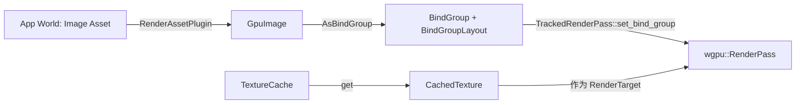

> [[Notes/Bevy/00-Bevy全解析主索引|← 返回 Bevy全解析主索引]]

## 零、这是什么？为什么需要它？

在 GPU 渲染管线中，着色器（Shader）需要访问两类外部数据：
1. Buffer 数据：Uniform、Storage Buffer，用于传递矩阵、材质参数、结构化数据；
2. Texture 数据：图片、深度图、Render Target，用于采样颜色、法线、高度等信息。

在 wgpu 中，这些资源不能直接被着色器使用，必须通过 BindGroup 绑定到管线上。BindGroup 描述了哪些资源绑定到哪些槽位（binding），而 BindGroupLayout 则预先声明了这个接口的形状。

Bevy 的 bevy_render crate 在这一层做了两件事：
- Resource Wrappers：用轻量的 Rust 结构体封装 wgpu::Texture、wgpu::BindGroup 等，解决生命周期和跨线程共享问题；
- AsBindGroup 宏：通过派生宏让用户自定义材质时，只需要在字段上标记 #[uniform(0)]、#[texture(1)] 等，就能自动生成 BindGroup 和 BindGroupLayout。

理解 Texture 和 BindGroup 的源码，是理解 Bevy 材质系统（bevy_material）和渲染命令提交的关键前提。

---

## 一、模块定位

```
crates/bevy_render/src/
├── render_resource/
│   ├── texture.rs            # Texture、TextureView、Sampler 封装
│   ├── bind_group.rs         # BindGroup、AsBindGroup、PreparedBindGroup
│   ├── bind_group_layout.rs  # BindGroupLayout 封装
│   ├── bind_group_entries.rs # BindGroupEntries 构造助手
│   └── buffer.rs             # Buffer、BufferSlice 封装
└── texture/
    ├── mod.rs                # TexturePlugin
    ├── gpu_image.rs          # GpuImage：Image 的 GPU 表示
    └── texture_cache.rs      # TextureCache：帧内临时纹理复用池
```

| 文件 | 职责 |
|------|------|
| render_resource/texture.rs | 定义 Texture、TextureView、Sampler 三个轻量包装器 |
| render_resource/bind_group.rs | 定义 BindGroup、AsBindGroup trait、PreparedBindGroup |
| render_resource/bind_group_layout.rs | 定义 BindGroupLayout 包装器 |
| render_resource/bind_group_entries.rs | 提供类型安全的 BindGroup 条目构造泛型 |
| render_resource/buffer.rs | 定义 Buffer、BufferSlice 包装器 |
| texture/gpu_image.rs | GpuImage 是 Image 资产的 GPU 侧表示 |
| texture/texture_cache.rs | 缓存帧内反复创建的临时纹理 |

---

## 二、接口层：Texture、BindGroup 与 AsBindGroup

### 2.1 Texture / TextureView / Sampler

文件: src/render_resource/texture.rs

```rust
// line 27-30
pub struct Texture {
    id: TextureId,
    value: WgpuWrapper<wgpu::Texture>,
}

// line 67-70
pub struct TextureView {
    id: TextureViewId,
    value: WgpuWrapper<wgpu::TextureView>,
}

// line 133-136
pub struct Sampler {
    id: SamplerId,
    value: WgpuWrapper<wgpu::Sampler>,
}
```

这三个结构体都是薄包装（thin wrapper）：
- 内部持有 WgpuWrapper<wgpu::xxx>，用于引用计数和跨线程安全；
- 外部暴露一个自增的 Id（通过 define_atomic_id! 宏生成），用于快速比较和哈希；
- 实现 Deref，可以直接调用底层 wgpu 对象的方法。

为什么需要 Id？

wgpu::Texture 本身没有实现 Eq/Hash，而 Bevy 的渲染系统需要频繁比较资源是否相同（比如缓存管线状态）。TextureId 是一个全局唯一的原子整数，比较和哈希都是 O(1) 的整数操作。

### 2.2 BindGroup

文件: src/render_resource/bind_group.rs:33-36

```rust
pub struct BindGroup {
    id: BindGroupId,
    value: WgpuWrapper<wgpu::BindGroup>,
}
```

BindGroup 同样使用 id + WgpuWrapper 的模式。特别的是，它实现了 PartialEq、Eq、Hash（基于 BindGroupId），这意味着两个 BindGroup 实例只要 Id 相同就被视为相等——即使它们内部指向同一个 wgpu 对象的不同 Arc 克隆。

### 2.3 BindGroupLayout

文件: src/render_resource/bind_group_layout.rs:16-19

```rust
pub struct BindGroupLayout {
    id: BindGroupLayoutId,
    value: WgpuWrapper<wgpu::BindGroupLayout>,
}
```

BindGroupLayout 是静态接口描述：它只声明 binding 0 是一个 uniform buffer，binding 1 是一个 2D texture，不绑定具体资源。渲染管线在创建时就需要 BindGroupLayout，而 BindGroup 是在绘制前动态创建的。

### 2.4 AsBindGroup：从 Rust 类型到 GPU 绑定的桥梁

文件: src/render_resource/bind_group.rs:500-618

```rust
pub trait AsBindGroup {
    type Data: Send + Sync;
    type Param: SystemParam + 'static;

    fn label() -> &'static str;

    fn as_bind_group(
        &self,
        layout_descriptor: &BindGroupLayoutDescriptor,
        render_device: &RenderDevice,
        pipeline_cache: &PipelineCache,
        param: &mut SystemParamItem<'_, '_, Self::Param>,
    ) -> Result<PreparedBindGroup, AsBindGroupError>;

    fn unprepared_bind_group(...);
    fn bind_group_layout(render_device: &RenderDevice) -> BindGroupLayout;
    fn bind_group_layout_entries(...) -> Vec<BindGroupLayoutEntry>;
    // ... bindless 相关
}
```

AsBindGroup 是 Bevy 材质系统的核心抽象。任何实现了这个 trait 的类型（如 StandardMaterial、ColorMaterial）都可以被转换成：
- 一个 BindGroup（运行时资源绑定）；
- 一个 BindGroupLayout（管线接口声明）；
- 一段 Data（如材质 Key，用于管线特化）。

Bevy 提供了 #[derive(AsBindGroup)] 宏，让用户只需标注字段属性即可自动生成实现。

### 2.5 GpuImage：Image 的 GPU 表示

文件: src/texture/gpu_image.rs:17-24

```rust
pub struct GpuImage {
    pub texture: Texture,
    pub texture_view: TextureView,
    pub sampler: Sampler,
    pub texture_descriptor: TextureDescriptor<...>,
    pub texture_view_descriptor: Option<TextureViewDescriptor<...>>,
    pub had_data: bool,
}
```

GpuImage 实现了 RenderAsset，是 Image（CPU 侧图像资产）到 GPU 纹理的桥梁：
- texture：实际的 GPU 纹理对象；
- texture_view：纹理视图（可以限制 Mip 层级、格式重解释）；
- sampler：采样器（过滤模式、寻址模式）；
- had_data：标记原始 Image 是否包含像素数据，用于防止重复提取。

---

## 三、数据层：GpuImage 上传策略与 TextureCache

### 3.1 GpuImage::prepare_asset 的上传逻辑

文件: src/texture/gpu_image.rs:63-180

```rust
fn prepare_asset(
    image: Self::SourceAsset,
    _: AssetId<Self::SourceAsset>,
    (render_device, render_queue, default_sampler): &mut SystemParamItem<Self::Param>,
    previous_asset: Option<&Self>,
) -> Result<Self, PrepareAssetError<Self::SourceAsset>> {
    let had_data = image.data.is_some();
    let texture = if let Some(prev) = previous_asset
        && prev.texture_descriptor == image.texture_descriptor
        && (!had_data || prev.texture_descriptor.usage.contains(TextureUsages::COPY_DST))
        && let Some(block_bytes) = image.texture_descriptor.format.block_copy_size(None)
    {
        // 情况 A：描述符没变，复用旧 Texture，通过 write_texture 更新数据
        if let Some(ref data) = image.data {
            render_queue.write_texture(
                prev.texture.as_image_copy(),
                data,
                TexelCopyBufferLayout { offset: 0, bytes_per_row: ..., rows_per_image: ... },
                image.texture_descriptor.size,
            );
        }
        prev.texture.clone()
    } else if let Some(ref data) = image.data {
        // 情况 B：描述符变了但有数据，创建新 Texture 并上传
        render_device.create_texture_with_data(render_queue, &image.texture_descriptor, image.data_order, data)
    } else {
        // 情况 C：没有数据（如 RenderTarget），创建空 Texture
        let new_texture = render_device.create_texture(&image.texture_descriptor);
        // copy_on_resize 时可能从旧 Texture 拷贝
        ...
        new_texture
    };
    // ... TextureView 和 Sampler 的复用/创建逻辑
}
```

**GpuImage 的三种上传路径：**

```
Image 变化了？
├── 描述符相同 && 允许 COPY_DST
│   └── 复用旧 Texture + write_texture（GPU 队列写入，无分配） ← 最快
├── 描述符不同 && 有像素数据
│   └── create_texture_with_data（创建新 Texture + staging 上传） ← 常规
└── 无像素数据（RenderTarget）
    └── create_texture（空纹理） ← 仅分配
```

**为什么优先复用旧 Texture？**

创建 wgpu::Texture 涉及 GPU 内存分配，代价远高于 write_texture（后者使用 staging buffer，是异步的）。对于每帧更新的纹理（如视频流、动态 UI），复用旧对象可以显著减少 GPU 内存抖动。

### 3.2 TextureCache：帧内纹理复用

文件: src/texture/texture_cache.rs:30-33

```rust
#[derive(Resource, Default)]
pub struct TextureCache {
    textures: HashMap<TextureDescriptor<'static>, Vec<CachedTextureMeta>>,
}
```

TextureCache 解决的是帧内临时纹理的分配问题。例如后处理链中的中间结果：Bloom 需要多张不同尺寸的纹理，如果每帧都 create_texture 再丢弃，会产生大量 GPU 内存分配开销。

文件: src/texture/texture_cache.rs:38-84

```rust
pub fn get(&mut self, render_device: &RenderDevice, descriptor: TextureDescriptor<'static>) -> CachedTexture {
    match self.textures.entry(descriptor) {
        Entry::Occupied(mut entry) => {
            // 查找未占用的缓存纹理
            for texture in entry.get_mut().iter_mut() {
                if !texture.taken {
                    texture.frames_since_last_use = 0;
                    texture.taken = true;
                    return CachedTexture { texture: texture.texture.clone(), default_view: texture.default_view.clone() };
                }
            }
            // 没有空闲的，创建新的并加入缓存池
            let texture = render_device.create_texture(&entry.key().clone());
            ...
        }
        Entry::Vacant(entry) => {
            // 这种描述符从来没缓存过，创建并插入
            let texture = render_device.create_texture(entry.key());
            ...
        }
    }
}
```

**核心机制**：
- 以 TextureDescriptor 为 key（包含尺寸、格式、用途等），管理一组同类型纹理；
- 每个纹理有 taken 标记，同一帧内已经被借用的不会重复借出；
- update() 每帧执行，把 taken 重置为 false，并回收超过 3 帧未使用的纹理。

文件: src/texture/texture_cache.rs:92-102

```rust
pub fn update(&mut self) {
    self.textures.retain(|_, textures| {
        for texture in textures.iter_mut() {
            texture.frames_since_last_use += 1;
            texture.taken = false;
        }
        textures.retain(|texture| texture.frames_since_last_use < 3);
        !textures.is_empty()
    });
}
```

**3 帧回收策略**是一种保守的延迟释放：考虑到 GPU 异步执行，一帧内使用的纹理可能在后续 1~2 帧内仍然被 GPU 命令引用。保留 3 帧可以避免过早释放导致的 use-after-free。

---

## 四、逻辑层：BindGroup 的构造与绑定

### 4.1 AsBindGroup::as_bind_group 的默认实现

文件: src/render_resource/bind_group.rs:530-556

```rust
fn as_bind_group(&self, layout_descriptor, render_device, pipeline_cache, param)
    -> Result<PreparedBindGroup, AsBindGroupError>
{
    // 1. 从 PipelineCache 获取已编译的 BindGroupLayout
    let layout = &pipeline_cache.get_bind_group_layout(layout_descriptor);

    // 2. 调用 unprepared_bind_group，获取 (binding_index, OwnedBindingResource) 列表
    let UnpreparedBindGroup { bindings } =
        Self::unprepared_bind_group(self, layout, render_device, param, false)?;

    // 3. 转换为 wgpu::BindGroupEntry
    let entries = bindings.iter().map(|(index, binding)| BindGroupEntry {
        binding: *index,
        resource: binding.get_binding(),
    }).collect::<Vec<_>>();

    // 4. 创建 wgpu::BindGroup
    let bind_group = render_device.create_bind_group(Self::label(), layout, &entries);

    Ok(PreparedBindGroup { bindings, bind_group })
}
```

**两层分离设计**：
- unprepared_bind_group：由派生宏生成，负责把用户材质的字段（Handle<Image>、LinearRgba 等）转换成 OwnedBindingResource；
- as_bind_group：框架统一实现，负责把 OwnedBindingResource 转换成 wgpu::BindGroupEntry 并创建最终的 BindGroup。

### 4.2 OwnedBindingResource：所有权与引用的统一

文件: src/render_resource/bind_group.rs:653-658

```rust
pub enum OwnedBindingResource {
    Buffer(Buffer),
    TextureView(TextureViewDimension, TextureView),
    Sampler(SamplerBindingType, Sampler),
    Data(OwnedData),   // 需要进一步打包到 Buffer 中的原始数据
}
```

这个枚举的巧妙之处在于：
- Buffer、TextureView、Sampler 都是有所有权的克隆体（通过 Arc 共享底层 wgpu 对象）；
- Data 是一个特殊的变体：它只是一段 Vec<u8>，没有对应的 wgpu 对象，需要由调用者（如 MaterialBindGroupAllocator）把它写进统一的 Uniform Buffer 中。

文件: src/render_resource/bind_group.rs:666-681

```rust
impl OwnedBindingResource {
    pub fn get_binding(&self) -> BindingResource<'_> {
        match self {
            OwnedBindingResource::Buffer(buffer) => buffer.as_entire_binding(),
            OwnedBindingResource::TextureView(_, view) => BindingResource::TextureView(view),
            OwnedBindingResource::Sampler(_, sampler) => BindingResource::Sampler(sampler),
            OwnedBindingResource::Data(_) => panic!("OwnedData has no binding resource"),
        }
    }
}
```

**为什么 Data 不能独立绑定？**

BindingResource 只能引用已存在的 wgpu::Buffer、TextureView 或 Sampler。OwnedData 只是一段 CPU 内存，必须先写入 GPU Buffer 才能绑定。这个设计允许 AsBindGroup 的派生宏统一返回资源列表，而具体的 Buffer 上传延迟到框架层处理。

### 4.3 BindGroupEntries：类型安全的条目构造

文件: src/render_resource/bind_group_entries.rs:95-129

```rust
pub struct BindGroupEntries<'b, const N: usize = 1> {
    entries: [BindGroupEntry<'b>; N],
}

impl<'b, const N: usize> BindGroupEntries<'b, N> {
    pub fn sequential(resources: impl IntoBindingArray<'b, N>) -> Self {
        let mut i = 0;
        Self {
            entries: resources.into_array().map(|resource| {
                let binding = i;
                i += 1;
                BindGroupEntry { binding, resource }
            }),
        }
    }

    pub fn with_indices(indexed_resources: impl IntoIndexedBindingArray<'b, N>) -> Self {
        Self {
            entries: indexed_resources.into_array().map(|(binding, resource)| {
                BindGroupEntry { binding, resource }
            }),
        }
    }
}
```

Bevy 原生创建 BindGroup 的 wgpu API 需要手写 `Vec<BindGroupEntry>`，容易出错且冗长。`BindGroupEntries` 利用 const generics 和 variadic tuple 宏，允许这样写：

```rust
render_device.create_bind_group(
    "my_bind_group",
    &my_layout,
    &BindGroupEntries::sequential((&my_sampler, my_uniform)),
);
```

文件: src/render_resource/bind_group_entries.rs:203-223

```rust
macro_rules! impl_to_binding_slice {
    ($N: expr, $(#[$meta:meta])* $(($T: ident, $I: ident)),*) => {
        $(#[$meta])*
        impl<'b, $($T: IntoBinding<'b>),*> IntoBindingArray<'b, $N> for ($($T,)*) {
            fn into_array(self) -> [BindingResource<'b>; $N] {
                let ($($I,)*) = self;
                [$($I.into_binding(), )*]
            }
        }
    }
}

all_tuples_with_size!(impl_to_binding_slice, 1, 32, T, s);
```

`all_tuples_with_size!` 宏来自 `variadics_please` crate，它为 1 到 32 元组生成 `IntoBindingArray` 实现。这意味着你可以一次性传入最多 32 个资源，自动按顺序分配 binding index。

---

## 五、设计决策分析

### 5.1 为什么使用 WgpuWrapper + 原子 Id 的模式？

Bevy 的渲染架构大量使用 ECS（Entity-Component-System），资源以 Components 或 Resources 的形式在系统之间传递。wgpu 对象（如 Texture、BindGroup）通常不是 Send/Sync 的，或者生命周期管理复杂。

**WgpuWrapper** 内部使用 `Arc<wgpu::Texture>`（或类似结构），使得：
- Texture 可以安全地 Clone（只增加 Arc 计数）；
- 跨线程传递不需要深拷贝；
- wgpu 对象的生命周期由 Arc 自动管理。

**原子 Id** 解决了另一个问题：ECS 中经常需要比较两个资源是否相同。如果直接用 `Arc::ptr_eq`，比较的是 Arc 指针而非底层对象。而 Id 是创建时分配的全局唯一整数，无论 Clone 多少次，同一个底层对象的 Id 始终相同。

### 5.2 为什么把 BindGroup 构造拆成 prepared 和 unprepared？

在 Bevy 的材质系统中，存在两类材质：
- **简单材质**：字段直接对应 Shader 的 binding，如 ColorMaterial；
- **扩展材质**：如 ExtendedMaterial，它在基础材质上添加额外字段，需要合并两个 BindGroupLayout。

如果 `as_bind_group` 是完全由派生宏生成的，ExtendedMaterial 就无法控制基础材质的绑定过程。拆分为 `unprepared_bind_group`（生成资源列表）和 `as_bind_group`（创建最终 BindGroup）后：
- 派生宏只需实现 `unprepared_bind_group`，返回 `OwnedBindingResource` 列表；
- 框架统一实现 `as_bind_group`，处理 PipelineCache 查询、BindGroup 创建；
- ExtendedMaterial 可以在自己的 `unprepared_bind_group` 中调用基础材质的 `unprepared_bind_group`，然后合并结果。

这种分层让 bindless 模式的实现也变得更简单：框架层可以在 `as_bind_group` 中统一判断是否启用 bindless，而不需要每个派生宏都处理这个逻辑。

### 5.3 TextureCache 的 3 帧回收策略是否合理？

对于典型的双缓冲或三缓冲渲染器，GPU 可能滞后 CPU 1~2 帧。如果 TextureCache 在第 N 帧释放了纹理，而 GPU 还在执行第 N-1 帧的命令（该命令使用了这个纹理），就会导致 GPU use-after-free。

3 帧的保守策略覆盖了大多数情况，但也带来了轻微的内存膨胀。Bevy 把这个阈值硬编码为 3，意味着：如果一个临时纹理只在一帧中使用，它会在缓存中保留 3 帧才被释放。对于高分辨率后处理纹理（如 4K HDR），这可能会浪费几十 MB 显存。

**权衡**：在正确性和内存开销之间，Bevy 优先选择正确性。对于显存敏感的应用，可以通过自定义回收策略或手动管理 RenderTarget 来优化。

---

## 六、上下文：Texture 与 BindGroup 在渲染管线中的位置



1. **Asset 到 GpuImage**：Image 资产通过 `RenderAssetPlugin` 转换成 `GpuImage`（Texture + TextureView + Sampler）；
2. **Material 到 BindGroup**：Material 通过 `AsBindGroup` 转换成 `BindGroup` 和 `BindGroupLayout`；
3. **RenderPass 绑定**：`TrackedRenderPass` 在绘制前调用 `set_bind_group`，把 BindGroup 绑定到管线；
4. **临时纹理复用**：后处理阶段通过 `TextureCache` 获取临时纹理作为 RenderTarget，避免重复分配。

---

## 七、关键代码片段

### TexturePlugin 的注册逻辑

文件: src/texture/mod.rs:28-45

```rust
impl Plugin for TexturePlugin {
    fn build(&self, app: &mut App) {
        app.add_plugins((
            RenderAssetPlugin::<GpuImage>::default(),
            ExtractResourcePlugin::<ManualTextureViews>::default(),
        ))
        .init_resource::<ManualTextureViews>();
        if let Some(render_app) = app.get_sub_app_mut(RenderApp) {
            render_app
                .init_resource::<ManualTextureViews>()
                .init_gpu_resource::<TextureCache>()
                .allow_ambiguous_resource::<TextureCache>()
                .add_systems(
                    Render,
                    update_texture_cache_system.in_set(RenderSystems::Cleanup),
                );
        }
    }
}
```

**中文注释**：TexturePlugin 把 GpuImage 注册为 RenderAsset，使得 Image 资产的变化自动同步到 GPU。同时它在渲染世界初始化 TextureCache，并在 Cleanup 阶段调用 update_texture_cache_system 回收过期纹理。allow_ambiguous_resource 允许 TextureCache 在不同系统中以可变/不可变方式同时访问，因为某些后处理系统可能在同一阶段同时 get 和 retain 缓存。

---

## 八、延伸阅读

- [[Notes/Bevy/00-Bevy全解析主索引|Bevy 全解析主索引]]
- crates/bevy_render/src/render_resource/pipeline_cache.rs：PipelineCache 如何缓存 BindGroupLayout 和 RenderPipeline
- crates/bevy_material/src/material.rs：MaterialPlugin 如何使用 AsBindGroup
- crates/bevy_render/src/render_phase/mod.rs：RenderPhase 和 TrackedRenderPass 的绑定命令提交
- crates/bevy_render/src/renderer/mod.rs：RenderDevice、RenderQueue 的 wgpu 封装细节

---

## 九、索引状态

- [x] 无数字前缀文件名
- [x] 源码分析笔记归档在 Notes/Bevy/第三阶段-渲染管线/
- [x] 包含返回 [[Notes/Bevy/00-Bevy全解析主索引]] 的导航链接
- [ ] 需在 Notes/Bevy/00-Bevy全解析主索引.md 中添加本笔记链接
