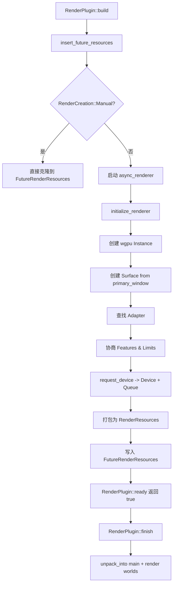

> [[Notes/Bevy/00-Bevy全解析主索引|← 返回 Bevy 全解析主索引]]

---

## 零、这是什么，以及为什么需要它

### 0.1 wgpu 是什么

**wgpu** 是一个用 Rust 编写的、基于 WebGPU 标准 API 的跨平台图形和计算库。它并不是直接操作 GPU 的驱动，而是位于你的代码和底层图形 API（Vulkan、Metal、DirectX 12、OpenGL）之间的一层抽象。换句话说，wgpu 是一个**硬件抽象层（HAL）**，让你写一套代码就能在 Windows、macOS、Linux、Web 等不同平台上运行。

Bevy 选择 wgpu 作为其渲染后端，意味着 Bevy 不需要为每个平台写一套渲染代码——这是现代游戏引擎的标配策略。

### 0.2 为什么需要再包一层

既然 wgpu 已经提供了跨平台抽象，Bevy 为什么还要再包装一次？原因有三：

1. **生命周期与所有权**：Bevy 的 ECS（Entity Component System）要求资源可以被 clone 和 share。wgpu 的 `Device`、`Queue`、`Adapter` 等类型本身不是 ECS 友好的 `Resource`，Bevy 需要用 `Arc` + 自定义包装把它们变成可在多个 system、多个 world（main world / render world）之间安全共享的资源。

2. **WebGL 与 WebGPU 的兼容坑**：在 Web 平台上，如果启用了 `atomics`（多线程 WASM），wgpu 的类型默认不是 `Send` 和 `Sync` 的。Bevy 需要一个**条件编译包装器**来在 native 平台上透传、在 web 平台上附加 `SendWrapper`，才能满足 ECS 的线程安全约束。

3. **异步初始化与 Plugin 生命周期**：wgpu 的 `request_adapter` 和 `request_device` 是异步 API。但 Bevy 的 `Plugin::build` 是同步的。Bevy 设计了一套**"先占位、后填充"**的机制（`FutureRenderResources`），让渲染器可以在后台异步初始化，同时不阻塞主线程的 ECS 搭建。

### 0.3 本文聚焦的问题链

- Bevy 如何把 wgpu 的底层类型变成 ECS `Resource`？
- `WgpuWrapper` 解决了什么跨平台问题？
- `initialize_renderer` 的异步链路是怎样的？
- Feature 和 Limits 如何协商？
- 为什么不用裸 `Arc<wgpu::Device>`，而是 `Arc<WgpuWrapper<Device>>`？

---

## 一、模块定位

`bevy_render` crate 的 `renderer` 模块是 Bevy 与 wgpu 交互的**唯一入口**。所有 GPU 资源的创建、命令的提交、适配器的查询，都经由这一层完成。

| 文件路径 | 行数 | 职责 |
|---------|------|------|
| `src/renderer/mod.rs` | ~366 | 渲染器根模块；定义 `RenderQueue`、`RenderAdapter`、`RenderInstance`、`RenderAdapterInfo`、`initialize_renderer`；包含 `render_system` |
| `src/renderer/render_device.rs` | ~310 | 定义 `RenderDevice`；封装 `wgpu::Device` 的所有资源创建 API |
| `src/renderer/wgpu_wrapper.rs` | ~50 | 定义 `WgpuWrapper<T>`；跨平台 `Send/Sync` 条件编译包装器 |
| `src/settings.rs` | ~335 | 定义 `WgpuSettings`、`RenderCreation`、`RenderResources`；初始化配置与资源打包 |
| `src/lib.rs` | ~587 | 定义 `FutureRenderResources`；`RenderPlugin` 生命周期（`build`/`ready`/`finish`） |

```text
bevy_render/src/
├── renderer/
│   ├── mod.rs               # 渲染后端入口：初始化流程 + 核心 Resource 类型
│   ├── render_device.rs     # RenderDevice：GPU 资源工厂
│   ├── render_context.rs    # RenderContext：帧级渲染上下文（本文不涉及）
│   └── wgpu_wrapper.rs      # WgpuWrapper：跨平台类型安全包装
├── settings.rs              # 配置结构体与资源打包
└── lib.rs                   # RenderPlugin 生命周期 + FutureRenderResources
```

---

## 二、接口层：六大核心类型与初始化函数

### 2.1 资源类型的统一模式

Bevy 将所有 wgpu 核心句柄包装为 ECS `Resource`，遵循一个**统一模板**：

```rust
// src/renderer/mod.rs L124-L139
#[derive(Resource, Clone, Deref, DerefMut)]
pub struct RenderQueue(pub Arc<WgpuWrapper<Queue>>);

#[derive(Resource, Clone, Debug, Deref, DerefMut)]
pub struct RenderAdapter(pub Arc<WgpuWrapper<Adapter>>);

#[derive(Resource, Clone, Deref, DerefMut)]
pub struct RenderInstance(pub Arc<WgpuWrapper<Instance>>);

#[derive(Resource, Clone, Deref, DerefMut)]
pub struct RenderAdapterInfo(pub WgpuWrapper<AdapterInfo>);
```

注意这里的设计细节：
- `RenderQueue`、`RenderAdapter`、`RenderInstance` 包的是 `Arc<WgpuWrapper<T>>` —— 因为这三个对象需要在 main world 和 render world **同时存在**（通过 `clone` 共享）。
- `RenderAdapterInfo` 只包 `WgpuWrapper<T>`（无 `Arc`）—— 它是纯数据，不需要共享引用，clone 时直接复制内部数据即可。

### 2.2 RenderDevice —— 资源创建的中心工厂

`RenderDevice` 是 Bevy 渲染代码中最常被访问的资源。它位于 `src/renderer/render_device.rs`（L14-L28）：

```rust
#[derive(Resource, Clone)]
pub struct RenderDevice {
    device: WgpuWrapper<wgpu::Device>,
}

impl From<wgpu::Device> for RenderDevice {
    fn from(device: wgpu::Device) -> Self {
        Self::new(WgpuWrapper::new(device))
    }
}
```

`RenderDevice` 不提供 `Deref` 到 `wgpu::Device`（不像 `RenderQueue` 那样），而是显式地**逐一转发 API**：创建 buffer、texture、shader、pipeline、bind group 等。这样做的好处是：
- 可以在转发层插入 Bevy 的自定义逻辑（如 `create_bind_group` 返回 Bevy 自己的 `BindGroup` 类型）。
- 可以控制 unsafe API（如 `create_shader_module`）的暴露范围。
- 避免外部代码直接依赖 `wgpu::Device` 的全部接口，降低未来升级 wgpu 版本的耦合度。

### 2.3 WgpuWrapper —— 被隐藏的关键角色

```rust
// src/renderer/wgpu_wrapper.rs L7-L10
#[derive(Debug, Clone)]
pub struct WgpuWrapper<T>(
    #[cfg(not(all(target_arch = "wasm32", target_feature = "atomics")))] T,
    #[cfg(all(target_arch = "wasm32", target_feature = "atomics"))] send_wrapper::SendWrapper<T>,
);
```

这是整个跨平台兼容性的基石。下一章会深入展开。

### 2.4 initialize_renderer —— 异步初始化入口

```rust
// src/renderer/mod.rs L181
pub async fn initialize_renderer(
    backends: Backends,
    primary_window: Option<RawHandleWrapperHolder>,
    options: &WgpuSettings,
    #[cfg(feature = "raw_vulkan_init")]
    raw_vulkan_init_settings: raw_vulkan_init::RawVulkanInitSettings,
) -> RenderResources
```

这是 Bevy 与 wgpu 建立连接的**唯一通道**。它返回的 `RenderResources` 是一个元组结构体，打包了初始化后的所有核心对象。第四章会完整走一遍这个异步流程。

---

## 三、数据层：条件编译、内部结构与资源打包

### 3.1 WgpuWrapper 的跨平台本质

在 native 平台（Windows/macOS/Linux/Android），`WgpuWrapper<T>` 就是一个**零开销包装**（zero-cost wrapper）：

```rust
// 非 WASM 或 WASM 但无 atomics
type WgpuWrapper<T> = T;  // 逻辑上等价
```

在 `wasm32 + atomics` 平台上，它变成：

```rust
type WgpuWrapper<T> = send_wrapper::SendWrapper<T>;
```

`SendWrapper` 的作用是把一个**只能在特定线程上访问/销毁**的值标记为 `Send + Sync`。wgpu 的 WebGL 后端在多线程 WASM 下有这样的限制：底层 JS 对象（如 WebGL context）只能在创建它们的线程上操作。`SendWrapper` 会在跨线程访问/销毁时 panic，从而**把运行时错误提前暴露**，而不是让数据竞争静默发生。

```text
WgpuWrapper<T>
├── Native (非 wasm32 或无 atomics)
│   └── 直接持有 T
│   └── 自动满足 Send + Sync（因为 wgpu native 类型本身就是）
│
└── Web (wasm32 + atomics)
    └── 持有 send_wrapper::SendWrapper<T>
    └── 手动 unsafe impl Send + Sync（L15-L18）
    └── 跨线程访问/销毁时会 panic
```

Bevy 在这里显式写了 `unsafe impl`：

```rust
// src/renderer/wgpu_wrapper.rs L15-L18
#[cfg(all(target_arch = "wasm32", target_feature = "atomics"))]
unsafe impl<T> Send for WgpuWrapper<T> {}
#[cfg(all(target_arch = "wasm32", target_feature = "atomics"))]
unsafe impl<T> Sync for WgpuWrapper<T> {}
```

这是安全的，因为 `SendWrapper` 本身就是 `Send + Sync`，只是被包了一层。Bevy 的 unsafe 标记是在声明："我们知道自己在做什么，wgpu 的线程限制由 SendWrapper 在运行时保证。"

### 3.2 RenderDevice 的内部结构

```text
RenderDevice (Resource, Clone)
│
└── device: WgpuWrapper<wgpu::Device>
    ├── Native: wgpu::Device
    └── Web: SendWrapper<wgpu::Device>
```

注意 `RenderDevice` 没有 `DerefMut`，只有内部的 `WgpuWrapper` 提供了 `Deref`/`DerefMut`。这意味着 `RenderDevice` 的方法都是自己显式实现的转发层。这种"厚包装"策略让 Bevy 拥有完全的 API 控制权。

### 3.3 RenderResources —— 初始化结果的打包

```rust
// src/settings.rs L166-L174
#[derive(Clone)]
pub struct RenderResources(
    pub RenderDevice,
    pub RenderQueue,
    pub RenderAdapterInfo,
    pub RenderAdapter,
    pub RenderInstance,
    #[cfg(feature = "raw_vulkan_init")] pub renderer::raw_vulkan_init::AdditionalVulkanFeatures,
);
```

`RenderResources` 是一个**元组结构体**（tuple struct），而不是带名字字段的结构体。原因是它只在初始化流程内部流转，不需要对外暴露字段名。它的核心方法是 `unpack_into`（L184-L219），负责把打包的资源**解包并插入到 ECS World** 中：

```text
RenderResources::unpack_into
│
├── main_world 插入：
│   ├── RenderDevice
│   ├── RenderQueue
│   ├── RenderAdapterInfo
│   ├── RenderAdapter
│   └── CompressedImageFormatSupport
│
└── render_world 插入：
    ├── RenderInstance
    ├── PipelineCache（根据新 device 重建）
    ├── DeviceErrorHandler
    ├── RenderDevice
    ├── RenderQueue
    ├── RenderAdapter
    └── RenderAdapterInfo
```

这里有一个关键设计：**main world 和 render world 各自持有独立的资源副本**（通过 `Arc::clone` 共享底层 wgpu 对象）。这样 render world 可以在独立线程上运行渲染 system，而不会与主世界的游戏逻辑竞争。

---


## 四、逻辑层：initialize_renderer 的异步初始化链路

### 4.1 整体流程图



### 4.2 第一步：创建 Instance

```rust
// src/renderer/mod.rs L188-L209
let instance_descriptor = wgpu::InstanceDescriptor {
    backends,
    flags: options.instance_flags,
    memory_budget_thresholds: options.instance_memory_budget_thresholds,
    display: None,
    backend_options: wgpu::BackendOptions {
        gl: wgpu::GlBackendOptions { /* GLES 版本等 */ },
        dx12: wgpu::Dx12BackendOptions { /* 着色器编译器等 */ },
        noop: wgpu::NoopBackendOptions { enable: false },
    },
};

let instance = Instance::new(instance_descriptor);
```

`Instance` 是 wgpu 的**全局入口**，它不绑定到任何特定窗口或 GPU。`InstanceDescriptor` 中的 `backends` 字段决定了 wgpu 会尝试加载哪些后端（Vulkan、Metal、DX12、GL 等）。Bevy 通过 `WgpuSettings::default()` 自动选择：
- Native 平台：`Backends::all()`
- WebGL 模式（`webgl` feature，非 `webgpu`）：`Backends::GL`
- WebGPU 模式（`webgpu` feature）：`Backends::BROWSER_WEBGPU`

### 4.3 第二步：创建 Surface

```rust
// src/renderer/mod.rs L222-L238
let surface = primary_window.and_then(|wrapper| {
    let maybe_handle = wrapper
        .0
        .lock()
        .expect("Couldn't get the window handle in time for renderer initialization");
    if let Some(wrapper) = maybe_handle.as_ref() {
        // SAFETY: Plugins should be set up on the main thread.
        let handle = unsafe { wrapper.get_handle() };
        Some(
            instance
                .create_surface(handle)
                .expect("Failed to create wgpu surface"),
        )
    } else {
        None
    }
});
```

`Surface` 是 wgpu 与窗口系统交换缓冲区的桥梁。这里有两个值得注意的点：

1. **`RawHandleWrapperHolder`**：Bevy 使用了一个持有者模式来传递窗口句柄，因为窗口句柄可能还没准备好（如多线程环境下）。`lock()` + `Option` 的组合提供了安全的延迟获取。

2. **`unsafe { wrapper.get_handle() }`**：获取原生窗口句柄（如 Windows 的 `HWND`、Linux 的 `X11 Window`）涉及平台特定的 unsafe 操作。Bevy 的 SAFETY 注释指出："插件应在主线程上设置"，确保了句柄的生命周期安全。

### 4.4 第三步：查找 Adapter

这是初始化流程中最复杂的部分。Bevy 提供了**两条查找路径**：

**路径 A：按名称精确匹配**（仅 Native）

```rust
// src/renderer/mod.rs L148-L177
async fn find_adapter_by_name(
    instance: &Instance,
    options: &WgpuSettings,
    compatible_surface: Option<&wgpu::Surface<'_>>,
    adapter_name: &str,
) -> Option<Adapter> {
    for adapter in instance.enumerate_adapters(options.backends.expect("...")).await {
        let info = adapter.get_info();
        // 跳过不支持当前 surface 的 adapter
        if let Some(surface) = compatible_surface
            && !adapter.is_surface_supported(surface)
        {
            continue;
        }
        // 名称包含匹配
        if info.name.to_lowercase().contains(&adapter_name.to_lowercase()) {
            return Some(adapter);
        }
    }
    None
}
```

**路径 B：通过 wgpu 自动选择**

```rust
// src/renderer/mod.rs L275-L284
let request_adapter_options = RequestAdapterOptions {
    power_preference: options.power_preference,
    compatible_surface: surface.as_ref(),
    force_fallback_adapter,
};

selected_adapter = instance
    .request_adapter(&request_adapter_options)
    .await
    .ok();
```

`power_preference`（`LowPower` / `HighPerformance`）让用户可以控制是选集成显卡还是独立显卡。`force_fallback_adapter` 则强制使用软件渲染（如 SwiftShader）。

Bevy 的 fallback chain 如下：

```text
1. 用户指定了 adapter_name？
   ├── Native: 遍历所有 adapter，按名称子串匹配
   └── WASM: 不支持，发出 warn
2. 如果路径 1 没找到（或未指定）
   └── 调用 instance.request_adapter(...) 让 wgpu 自动选择
3. 如果还是失败
   └── panic!(GPU_NOT_FOUND_ERROR_MESSAGE)
```

### 4.5 第四步：Feature 与 Limits 协商

找到 Adapter 后，Bevy 不会直接把 Adapter 的能力全部暴露给 Device，而是做一次**策略化的裁剪**：

```rust
// src/renderer/mod.rs L298-L328
let mut features = wgpu::Features::empty();
let mut limits = options.limits.clone();

if matches!(options.priority, WgpuSettingsPriority::Functionality) {
    // 策略：最大化功能
    features = adapter.features();
    if adapter_info.device_type == DeviceType::DiscreteGpu {
        // 独立显卡去掉 MAPPABLE_PRIMARY_BUFFERS（PCI-E 传输瓶颈）
        features.remove(wgpu::Features::MAPPABLE_PRIMARY_BUFFERS);
    }
    limits = adapter.limits();
}

// 强制禁用用户指定的不想要的 features
if let Some(disabled_features) = options.disabled_features {
    features.remove(disabled_features);
}
// 强制启用用户明确要求的 features
features |= options.features;

// Limits 约束：取更保守的值
if let Some(constrained_limits) = options.constrained_limits.as_ref() {
    limits = limits.or_worse_values_from(constrained_limits);
}
```

这里体现了 Bevy 的**三层配置策略**（`WgpuSettingsPriority`）：

| 优先级 | 含义 | 适用场景 |
|-------|------|---------|
| `WebGPU` | 使用 WebGPU 默认的 features 和 limits | 需要与 WebGPU 标准完全兼容 |
| `Functionality` | 使用 Adapter 和 Backend 支持的最大功能 | Native 平台，最大化性能 |
| `WebGL2` | WebGPU 默认 limits + WebGL2 兼容约束 | 需要兼容 WebGL2 的旧浏览器 |

`or_worse_values_from` 这个 API 名字很有意思：它表示"取更差的值"——对于 `max_xxx` 限制，取最小值；对于 `min_xxx` 限制，取最大值。这样确保不会声称支持超出实际能力的参数。

### 4.6 第五步：请求 Device 和 Queue

```rust
// src/renderer/mod.rs L330-L352
let device_descriptor = wgpu::DeviceDescriptor {
    label: options.device_label.as_ref().map(AsRef::as_ref),
    required_features: features,
    required_limits: limits,
    experimental_features: unsafe { wgpu::ExperimentalFeatures::enabled() },
    memory_hints: options.memory_hints.clone(),
    trace: Trace::Off,
};

let (device, queue) = adapter.request_device(&device_descriptor).await.unwrap();
```

`request_device` 是异步的，因为它可能需要与驱动程序协商。成功后返回的 `device` 和 `queue` 是**一一绑定**的——一个逻辑设备对应一个提交队列。

### 4.7 第六步：打包返回

```rust
// src/renderer/mod.rs L357-L365
RenderResources(
    RenderDevice::from(device),
    RenderQueue(Arc::new(WgpuWrapper::new(queue))),
    RenderAdapterInfo(WgpuWrapper::new(adapter_info)),
    RenderAdapter(Arc::new(WgpuWrapper::new(adapter))),
    RenderInstance(Arc::new(WgpuWrapper::new(instance))),
)
```

---


## 五、设计决策分析

### 5.1 决策一：为什么用 WgpuWrapper 而不是裸 Arc<wgpu::Device>？

#### 朴素方案

```rust
// 想象中的简单包装
pub struct RenderDevice(pub Arc<wgpu::Device>);
pub struct RenderQueue(pub Arc<wgpu::Queue>);
```

这个方案在 native 平台上完全能工作。wgpu 的 Device 和 Queue 在 native 后端（Vulkan/Metal/DX12）上本身就是 Send + Sync 的，Arc 足以支持多线程共享。

#### 实际方案

```rust
// src/renderer/mod.rs
pub struct RenderQueue(pub Arc<WgpuWrapper<Queue>>);

// src/renderer/render_device.rs
pub struct RenderDevice {
    device: WgpuWrapper<wgpu::Device>,
}
```

Bevy 额外加了一层 WgpuWrapper。原因是什么？

**WebGL + atomics 的线程陷阱**

在多线程 WASM（target_arch = wasm32 + target_feature = atomics）下，wgpu 的 WebGL 后端底层是对 JavaScript WebGLRenderingContext 的包装。JS 的 WebGL context 有严格的线程亲和性：它只能在创建它的那个线程上调用。如果通过标准 Rust 的 Send/Sync 把这些类型传到其他线程，会导致未定义行为——可能表现为静默的数据损坏，或者 WASM runtime 的 panic。

wgpu 本身在这个配置下不会自动实现 Send/Sync。但 Bevy 的 ECS 是多线程 by design 的：system 可以在任何线程上运行，resource 必须满足 Send + Sync。

WgpuWrapper 的解决方案是运行时检查：
- Native：直接透传 T，零开销。
- WebGL + atomics：使用 send_wrapper::SendWrapper<T>，它在跨线程访问/销毁时会主动 panic，把潜在的 UB 变成显式的运行时错误。

```text
朴素方案的问题：
├── Native: 正常工作
├── WebGPU (WASM): 正常工作（WebGPU 支持多线程）
└── WebGL + atomics (WASM): 编译失败！或更糟——运行时 UB
    └── wgpu::Device 不是 Send + Sync
    └── Arc<wgpu::Device> 无法作为 ECS Resource

实际方案的收益：
├── Native: 零开销抽象（WgpuWrapper<T> == T）
├── WebGPU: 零开销抽象
└── WebGL + atomics: 运行时安全（SendWrapper 在线程越界时 panic）
    └── 允许编译通过，因为手动 unsafe impl Send/Sync
```

这是一个典型的"用运行时检查换取跨平台统一抽象"的权衡。Bevy 没有选择为 WebGL 单独写一套渲染代码，而是用条件编译 + 包装器让同一套代码在所有平台上编译。

---

### 5.2 决策二：为什么异步初始化 + FutureRenderResources？

#### 朴素方案

```rust
impl Plugin for RenderPlugin {
    fn build(&self, app: &mut App) {
        // 同步阻塞等待 GPU 初始化
        let (device, queue, adapter, instance) = block_on(initialize_renderer(...));
        app.insert_resource(RenderDevice::from(device));
        app.insert_resource(RenderQueue(Arc::new(...)));
        // ...
    }
}
```

这个方案的问题：
1. 阻塞主线程：request_adapter 和 request_device 可能需要数百毫秒（驱动初始化、shader cache 编译等）。阻塞会导致游戏启动时画面冻结。
2. Web 平台兼容性：在浏览器中，request_adapter 返回的是 JavaScript Promise。如果在主线程上同步阻塞等待 Promise，会造成死锁（浏览器事件循环被阻塞，Promise 永远无法 resolve）。

#### 实际方案

Bevy 设计了一个三阶段生命周期：

```text
RenderPlugin 生命周期
│
├── build() [同步]
│   ├── 创建空的 FutureRenderResources（Arc<Mutex<Option<RenderResources>>>）
│   ├── 启动异步任务：initialize_renderer -> 填充 FutureRenderResources
│   └── 继续搭建 ECS、注册 system（不阻塞）
│
├── ready() [每帧检查]
│   └── 检查 FutureRenderResources 是否已填充
│       ├── 已填充 -> 返回 true，进入 finish
│       └── 未填充 -> 返回 false，继续等待
│
└── finish() [同步]
    ├── 从 FutureRenderResources 取出 RenderResources
    ├── 调用 unpack_into() 插入 main_world + render_world
    └── 删除 FutureRenderResources（一次性使用）
```

代码实现（src/lib.rs）：

```rust
// L341-L342：FutureRenderResources 是一个共享的、可变的空槽
#[derive(Resource, Default, Clone, Deref)]
pub(crate) struct FutureRenderResources(Arc<Mutex<Option<RenderResources>>>);

// L498-L526：在 build 阶段启动异步初始化
fn insert_future_resources(render_creation: &RenderCreation, main_world: &mut World) -> bool {
    let future_resources = FutureRenderResources::default();
    let success = render_creation.create_render(future_resources.clone(), primary_window, ...);
    if success {
        main_world.insert_resource(future_resources);
    }
    success
}

// L437-L450：ready 阶段轮询
fn ready(&self, app: &App) -> bool {
    app.world()
        .get_resource::<FutureRenderResources>()
        .and_then(|frr| frr.try_lock().map(|locked| locked.is_some()).ok())
        .unwrap_or(true)
}

// L452-L466：finish 阶段解包
fn finish(&self, app: &mut App) {
    if let Some(future_render_resources) = app.world_mut().remove_resource::<FutureRenderResources>() {
        let render_resources = future_render_resources.0.lock().unwrap().take().unwrap();
        render_resources.unpack_into(main.world_mut(), render.world_mut(), ...);
    }
}
```

平台差异处理（src/settings.rs L276-L297）：

```rust
let async_renderer = async move {
    let render_resources = renderer::initialize_renderer(...).await;
    *future_resources.lock().unwrap() = Some(render_resources);
};

// WASM：spawn_local 让异步任务在浏览器事件循环中运行
#[cfg(target_arch = "wasm32")]
bevy_tasks::IoTaskPool::get().spawn_local(async_renderer).detach();

// Native：block_on 直接在当前线程阻塞等待（但发生在 Plugin 之外）
#[cfg(not(target_arch = "wasm32"))]
bevy_tasks::block_on(async_renderer);
```

注意一个细节：native 平台上也调用了 block_on。这看起来和"不阻塞主线程"矛盾？实际上，block_on 确实会阻塞，但阻塞的是 Plugin 构建过程，而不是游戏主循环。在 Bevy 的启动流程中，所有 Plugin 的 build 都在游戏循环开始前完成。对于 native 平台，启动时的短暂阻塞是可以接受的。而 Web 平台由于事件循环的死锁风险，必须使用 spawn_local。Bevy 在这里做了平台特化的正确选择。

---

### 5.3 决策三：WebGL vs WebGPU vs Native 的功能选择策略

Bevy 通过编译时 feature + 运行时 WgpuSettingsPriority 的组合来管理跨平台能力差异：

```rust
// src/settings.rs L72-L82
let default_backends = if cfg!(all(
    feature = "webgl",
    target_arch = "wasm32",
    not(feature = "webgpu")
)) {
    Backends::GL
} else if cfg!(all(feature = "webgpu", target_arch = "wasm32")) {
    Backends::BROWSER_WEBGPU
} else {
    Backends::all()
};
```

| 编译目标 | 激活 feature | 默认 backends | limits 来源 |
|---------|-------------|--------------|------------|
| Native | 无 | Vulkan/Metal/DX12 | Limits::default() 或 Functionality |
| WASM + webgpu | webgpu | BROWSER_WEBGPU | Limits::default() |
| WASM + webgl | webgl | GL | Limits::downlevel_webgl2_defaults() |

WebGL2 模式下，limits 会被压到很低：纹理尺寸、绑定组数量、存储缓冲区数量等都受到严格限制。这是由 WebGL2 硬件能力的现实决定的——许多移动 GPU 的 WebGL2 驱动并不支持 WebGPU 级别的功能。


## 六、Context：这些代码在什么上下文中运行

### 6.1 与 RenderPlugin 的协作关系

`bevy_render` 的渲染后端不是独立运行的，而是被 `RenderPlugin` 调度和管理。理解以下三个 Plugin 方法至关重要：

| 方法 | 触发时机 | 职责 |
|-----|---------|------|
| `build()` | App 启动时，同步调用 | 注册 asset、启动异步初始化、创建 render world、注册 schedule |
| `ready()` | 每帧开始时检查 | 判断异步初始化是否完成；返回 false 则整个 App 不进入 update |
| `finish()` | `ready()` 首次返回 true 后 | 将初始化完成的资源解包到两个 world 中，开始正式渲染 |

这意味着在 `ready()` 返回 true 之前，**没有任何渲染 system 会运行**。Bevy 的渲染管线是在"GPU 就绪"之后才真正启动的。

### 6.2 两个 World 的架构

Bevy 使用**双世界模型**（Dual World）：

- **Main World**：运行游戏逻辑、物理、AI、输入处理等。持有 `RenderDevice`、`RenderQueue`、`RenderAdapterInfo`、`RenderAdapter` 的克隆副本。
- **Render World**：运行渲染专用 system（如提取、准备、渲染图）。持有 `RenderInstance`、`PipelineCache`、`DeviceErrorHandler` 等渲染特有的资源。

`RenderResources::unpack_into` 的职责就是把同一套 wgpu 对象同时注入到两个 world 中，让两边可以独立运行而不需要频繁跨 world 通信。

### 6.3 render_system 的简要位置

```rust
// src/renderer/mod.rs L69-L121
pub fn render_system(world: &mut World, state: &mut SystemState<Query<(&ViewTarget, &ExtractedCamera)>>) {
    // 1. 运行 RenderGraph schedule
    world.run_schedule(RenderGraph);

    // 2. 提交截图和 GPU 回读命令
    {
        let render_device = world.resource::<RenderDevice>();
        let render_queue = world.resource::<RenderQueue>();
        let mut encoder = render_device.create_command_encoder(&wgpu::CommandEncoderDescriptor::default());
        crate::view::screenshot::submit_screenshot_commands(world, &mut encoder);
        crate::gpu_readback::submit_readback_commands(world, &mut encoder);
        render_queue.submit([encoder.finish()]);
    }

    // 3. Present 窗口帧
    {
        world.resource_scope(|world, mut windows: Mut<ExtractedWindows>| {
            for window in windows.values_mut() {
                if view_needs_present || window.needs_initial_present {
                    window.present();
                }
            }
        });
    }
}
```

`render_system` 是渲染的**最高层调度器**。它不负责具体的绘制，而是驱动整个 `RenderGraph` 的执行，然后处理截图、GPU readback，最后调用 `present()` 把画面显示到窗口。

---

## 七、关键代码片段

### 7.1 WgpuWrapper 完整实现

```rust
// src/renderer/wgpu_wrapper.rs L1-L50
/// A wrapper to safely make wgpu types Send / Sync on web with atomics enabled.
///
/// On web with atomics enabled the inner value can only be accessed
/// or dropped on the wgpu thread or else a panic will occur.
/// On other platforms the wrapper simply contains the wrapped value.
#[derive(Debug, Clone)]
pub struct WgpuWrapper<T>(
    #[cfg(not(all(target_arch = "wasm32", target_feature = "atomics")))] T,
    #[cfg(all(target_arch = "wasm32", target_feature = "atomics"))] send_wrapper::SendWrapper<T>,
);

// SAFETY: SendWrapper is always Send + Sync.
#[cfg(all(target_arch = "wasm32", target_feature = "atomics"))]
#[expect(unsafe_code, reason = "Blanket-impl Send requires unsafe.")]
unsafe impl<T> Send for WgpuWrapper<T> {}
#[cfg(all(target_arch = "wasm32", target_feature = "atomics"))]
#[expect(unsafe_code, reason = "Blanket-impl Sync requires unsafe.")]
unsafe impl<T> Sync for WgpuWrapper<T> {}

impl<T> WgpuWrapper<T> {
    pub fn new(t: T) -> Self {
        #[cfg(not(all(target_arch = "wasm32", target_feature = "atomics")))]
        return Self(t);
        #[cfg(all(target_arch = "wasm32", target_feature = "atomics"))]
        return Self(send_wrapper::SendWrapper::new(t));
    }

    pub fn into_inner(self) -> T {
        #[cfg(not(all(target_arch = "wasm32", target_feature = "atomics")))]
        return self.0;
        #[cfg(all(target_arch = "wasm32", target_feature = "atomics"))]
        return self.0.take();
    }
}

impl<T> core::ops::Deref for WgpuWrapper<T> {
    type Target = T;
    fn deref(&self) -> &Self::Target { &self.0 }
}

impl<T> core::ops::DerefMut for WgpuWrapper<T> {
    fn deref_mut(&mut self) -> &mut Self::Target { &mut self.0 }
}
```

### 7.2 Feature/Limits 协商核心逻辑

```rust
// src/renderer/mod.rs L298-L328
let mut features = wgpu::Features::empty();
let mut limits = options.limits.clone();

// 策略 A：最大化功能（Functionality 模式）
if matches!(options.priority, WgpuSettingsPriority::Functionality) {
    features = adapter.features();
    if adapter_info.device_type == DeviceType::DiscreteGpu {
        // 独立显卡禁用 MAPPABLE_PRIMARY_BUFFERS（PCI-E 瓶颈）
        features.remove(wgpu::Features::MAPPABLE_PRIMARY_BUFFERS);
    }
    limits = adapter.limits();
}

// 策略 B：应用用户自定义约束
if let Some(disabled_features) = options.disabled_features {
    features.remove(disabled_features);
}
features |= options.features;  // 强制启用

if let Some(constrained_limits) = options.constrained_limits.as_ref() {
    limits = limits.or_worse_values_from(constrained_limits);
}
```

### 7.3 RenderCreation::create_render 的平台分支

```rust
// src/settings.rs L266-L297
pub(crate) fn create_render(&self, future_resources: FutureRenderResources, primary_window: Option<RawHandleWrapperHolder>, ...) -> bool {
    match self {
        RenderCreation::Manual(resources) => {
            *future_resources.lock().unwrap() = Some(resources.clone());
        }
        RenderCreation::Automatic(render_creation) => {
            let Some(backends) = render_creation.backends else { return false; };
            let settings = render_creation.clone();

            let async_renderer = async move {
                let render_resources = renderer::initialize_renderer(backends, primary_window, &settings, ...).await;
                *future_resources.lock().unwrap() = Some(render_resources);
            };

            // Web：spawn_local 避免阻塞浏览器事件循环
            #[cfg(target_arch = "wasm32")]
            bevy_tasks::IoTaskPool::get().spawn_local(async_renderer).detach();
            // Native：block_on 同步等待（发生在启动阶段，非运行时）
            #[cfg(not(target_arch = "wasm32"))]
            bevy_tasks::block_on(async_renderer);
        }
    }
    true
}
```

---

## 八、相关阅读

- [[Notes/Bevy/00-Bevy全解析主索引|Bevy 全解析主索引]]
- [[Notes/Bevy/渲染图调度|Bevy 渲染图（RenderGraph）调度]]（待补充）
- [[Notes/Bevy/提取-准备-渲染|Bevy 的 Extract-Prepare-Render 三阶段]]（待补充）
- wgpu 官方文档：`https://wgpu.rs/`
- WebGPU 标准规范：`https://www.w3.org/TR/webgpu/`
- `send-wrapper` crate 文档：`https://docs.rs/send-wrapper/`

---

## 九、索引状态

| 模块 | 状态 | 关联笔记 |
|-----|------|---------|
| wgpu 后端抽象（本文） | 已完成 | 渲染管线基础层 |
| RenderGraph 调度 | 待解析 | 依赖 RenderDevice、RenderQueue |
| Extract-Prepare-Render 三阶段 | 待解析 | 依赖 FutureRenderResources 生命周期 |
| PipelineCache 管线缓存 | 待解析 | 依赖 RenderDevice、RenderAdapter |
| WindowSurface / SwapChain | 待解析 | 依赖 RenderInstance、Surface |
| 资源创建（Buffer/Texture/BindGroup） | 待解析 | 依赖 RenderDevice |

---

> [[Notes/Bevy/00-Bevy全解析主索引|← 返回 Bevy 全解析主索引]]
