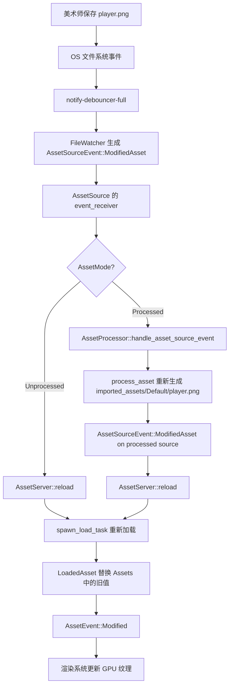

> [[Notes/Bevy/00-Bevy全解析主索引|← 返回 Bevy全解析主索引]]

# Bevy `bevy_asset` 源码解析：AssetEvents 与热重载

## 模块定位

资产不是静态的。游戏运行时，资产可能被**添加**、**修改**、**替换**或**释放**。Bevy 的 `AssetEvent` 系统提供了观察这些变化的机制，让其他系统可以响应资产的动态生命周期。

而**热重载（Hot Reloading）**则是开发工作流中的杀手级特性：当美术师在 Photoshop 中保存一张新纹理时，Bevy 应该能在不重启游戏的情况下自动检测变更、重新加载并更新所有引用该纹理的实体。

本节解析 `AssetEvent` 的完整事件模型，以及 Bevy 如何通过**文件监控**和**资产处理器（AssetProcessor）**实现热重载。

---

## 一、接口层（What）

### 1.1 `AssetEvent`：资产生命周期的五种事件

```rust
#[derive(Message, Reflect)]
pub enum AssetEvent<A: Asset> {
    Added { id: AssetId<A> },
    Modified { id: AssetId<A> },
    Removed { id: AssetId<A> },
    Unused { id: AssetId<A> },
    LoadedWithDependencies { id: AssetId<A> },
}
```

> 文件：`crates/bevy_asset/src/event.rs`，第 49~61 行

| 变体 | 触发时机 | 典型用途 |
|------|---------|---------|
| `Added` | 资产首次插入 `Assets<T>` | 为新加载的网格创建 GPU buffer |
| `Modified` | 资产值被可变访问后修改 | 更新已变更纹理的 GPU 绑定 |
| `Removed` | 资产从 `Assets<T>` 中被移除 | 清理 GPU 资源，释放显存 |
| `Unused` | 最后一个 `Strong Handle` 被释放 | 调试用，监控资产内存压力 |
| `LoadedWithDependencies` | 资产及其所有递归依赖都加载完成 | 切换游戏状态（如"加载完成，进入关卡"） |

`AssetEvent<A>` 是一个 **ECS Message**（不是 Resource）。这意味着：

- 它使用 `bevy_ecs` 的 `Messages<T>` 存储，支持多生产者/多消费者；
- 不同资产类型有独立的消息通道，不会产生类型混淆；
- 读取端通过 `MessageReader<AssetEvent<A>>` 访问，旧事件会在帧边界自动清理。

### 1.2 `InternalAssetEvent`：加载任务与主线程的桥梁

异步加载任务完成后，不能直接操作 ECS World，而是发送 `InternalAssetEvent`：

```rust
pub(crate) enum InternalAssetEvent {
    Loaded { index: ErasedAssetIndex, loaded_asset: ErasedLoadedAsset },
    LoadedWithDependencies { index: ErasedAssetIndex },
    Failed { index: ErasedAssetIndex, error: AssetLoadError, path: AssetPath<'static> },
}
```

> 文件：`crates/bevy_asset/src/server/mod.rs`（内部枚举，在 info.rs 等处引用）

`AssetServerData` 内部使用 `crossbeam_channel::unbounded` 作为 `InternalAssetEvent` 的传输通道。选择 `crossbeam` 而非 `async-channel` 的原因是：**发送端在异步任务中，接收端在同步的 ECS system 中**，需要无锁、高吞吐的 MPMC 通道。

### 1.3 `AssetProcessor` 与 `AssetMode`

Bevy 0.15 引入了资产预处理管线，由 `AssetMode` 控制：

```rust
pub enum AssetMode {
    Unprocessed,  // 直接读取原始文件（默认）
    Processed,    // 读取预处理后的文件（imported_assets/Default/）
}
```

> 文件：`crates/bevy_asset/src/lib.rs`，第 292~314 行

当启用 `asset_processor` cargo feature 时，`AssetPlugin` 会：

1. 创建一个独立的 `AssetProcessor`；
2. 在 `Startup` 阶段调用 `AssetProcessor::start`；
3. `AssetProcessor` 在后台扫描 `assets/` 目录，按需转换/压缩/优化资产，输出到 `imported_assets/Default/`；
4. 主 `AssetServer` 从 `Processed` 源加载最终资产。

> 文件：`crates/bevy_asset/src/processor/mod.rs`，第 82~179 行

---

## 二、数据层（How - Structure）

### 2.1 事件流转的两级架构

```
异步加载任务
    │
    ▼
crossbeam_channel ──► InternalAssetEvent
    │
    ▼
handle_internal_asset_events (PreUpdate, &mut World)
    │
    ├──► Assets<T>::insert ──► queued_events.push(Added/Modified)
    │
    ├──► Messages<AssetEvent<T>>::write(LoadedWithDependencies)
    │
    └──► Messages<AssetLoadFailedEvent<T>>::write
    │
    ▼
Assets::asset_events (PostUpdate)
    │
    ├──► AssetChanges<T>::insert(id, tick)  (用于 AssetChanged query filter)
    │
    └──► messages.write_batch(queued_events.drain(..))
    │
    ▼
用户 System ──► MessageReader<AssetEvent<T>>::read()
```

这种**两级架构**（`InternalAssetEvent` → `AssetEvent`）的核心原因是：**异步任务无权直接操作 ECS World**，必须通过一个持有 `&mut World` 的 system 作为"网关"。

### 2.2 `AssetChanges<T>`：为 `AssetChanged` Query Filter 服务

```rust
pub struct AssetChanges<A: Asset> {
    changes: HashMap<AssetId<A>, Tick>,
}
```

> 文件：`crates/bevy_asset/src/asset_changed.rs`

当 `Assets::asset_events` 刷新事件时，会把 `Added` / `Modified` / `LoadedWithDependencies` 的 id 和当前 tick 记录到 `AssetChanges<T>` 中。用户可以在 Query 中使用 `AssetChanged` filter：

```rust
fn update_materials(
    mut materials: Query<&mut Handle<StandardMaterial>, AssetChanged<StandardMaterial>>,
) { ... }
```

这意味着：**不需要手动遍历事件列表，ECS Query 系统会自动过滤出"资产已变更"的组件**。

### 2.3 热重载的数据结构：`AssetSourceEvent`

`AssetSource`（文件系统、网络、内存等）通过 `AssetWatcher` trait 监控变更，产生 `AssetSourceEvent`：

```rust
pub enum AssetSourceEvent {
    AddedAsset(PathBuf),
    ModifiedAsset(PathBuf),
    RemovedAsset(PathBuf),
    RenamedAsset { old: PathBuf, new: PathBuf },
    AddedMeta(PathBuf),
    ModifiedMeta(PathBuf),
    RemovedMeta(PathBuf),
    RenamedMeta { old: PathBuf, new: PathBuf },
    AddedFolder(PathBuf),
    RemovedFolder(PathBuf),
    RenamedFolder { old: PathBuf, new: PathBuf },
    RemovedUnknown { path: PathBuf, is_meta: bool },
}
```

> 文件：`crates/bevy_asset/src/io/mod.rs`

`file_watcher` feature 启用时，Bevy 使用 `notify-debouncer-full` 库监控磁盘文件系统，将 OS 级文件事件转换为 `AssetSourceEvent`，然后推送到 `AssetSource` 的事件接收端。

### 2.4 `ProcessorTransactionLog`：崩溃安全的预处理日志

`AssetProcessor` 使用**预写式日志（Write-Ahead Logging）**保证崩溃安全：

```rust
pub trait ProcessorTransactionLog: Send + Sync {
    async fn begin_processing(&mut self, path: &AssetPath<'_>);
    async fn end_processing(&mut self, path: &AssetPath<'_>);
    async fn unrecoverable(&mut self);
}
```

每次处理资产前写 `begin_processing`，成功后写 `end_processing`。如果进程崩溃后重启，发现某个资产只有 `begin` 没有 `end`，就会重新处理该资产。

> 文件：`crates/bevy_asset/src/processor/log.rs`

---

## 三、逻辑层（How - Behavior）

### 3.1 `handle_internal_asset_events` — 事件网关

这是资产系统中最关键的 system 之一，它持有 `&mut World`，因此可以操作任何 Resource 和 Message：

```rust
pub(crate) fn handle_internal_asset_events(world: &mut World) {
    let asset_server = world.resource::<AssetServer>().clone();
    // 消费所有 InternalAssetEvent
    while let Ok(event) = asset_server.data.asset_event_receiver.try_recv() {
        match event {
            InternalAssetEvent::Loaded { index, loaded_asset } => {
                let mut infos = asset_server.write_infos();
                infos.process_asset_load(index, loaded_asset, world, &asset_server.data.asset_event_sender);
            }
            InternalAssetEvent::LoadedWithDependencies { index } => {
                // 调用 dependency_loaded_event_sender 中注册的 per-type 回调
                // 该回调会向 Messages<AssetEvent<A>> 写入 LoadedWithDependencies
            }
            InternalAssetEvent::Failed { index, error, path } => {
                let mut infos = asset_server.write_infos();
                infos.process_asset_fail(index, error);
                // 调用 dependency_failed_event_sender 中注册的 per-type 回调
            }
        }
    }
}
```

> 文件：`crates/bevy_asset/src/server/mod.rs`（第 1000 行之后，因文件较长未在上下文显示）

**为什么需要 `&mut World`？**

- `process_asset_load` 需要把资产插入 `Assets<T>`，而 `T` 是动态类型；
- `LoadedWithDependencies` 需要向 `Messages<AssetEvent<T>>` 写入事件；
- Bevy 使用 `TypeIdMap<fn(&mut World, AssetIndex)>` 来存储每种资产类型的回调函数，避免运行时反射开销。

### 3.2 依赖完成事件的触发链

当 `process_asset_load` 发现某个资产的所有递归依赖都已加载时：

1. 向 `asset_event_sender` 发送 `InternalAssetEvent::LoadedWithDependencies`；
2. `handle_internal_asset_events` 收到后，查找 `dependency_loaded_event_sender` 中该类型的回调；
3. 回调函数本质上是：

```rust
fn sender<A: Asset>(world: &mut World, index: AssetIndex) {
    world.resource_mut::<Messages<AssetEvent<A>>>()
        .write(AssetEvent::LoadedWithDependencies { id: index.into() });
}
```

> 文件：`crates/bevy_asset/src/server/mod.rs`，第 204~235 行

这种**函数指针表**的设计让 `handle_internal_asset_events` 可以在完全类型擦除的环境下，把事件准确地路由到对应的 `Messages<AssetEvent<T>>`。

### 3.3 热重载的完整链路



在 `Processed` 模式下，热重载是**两阶段**的：

1. 源文件变更触发 `AssetProcessor` 重新处理；
2. 处理后的文件变更触发 `AssetServer` 重新加载。

### 3.4 `AssetProcessor::start` 的任务调度

```rust
pub fn start(processor: Res<Self>) {
    let processor = processor.clone();
    IoTaskPool::get().spawn(async move {
        processor.initialize().await.unwrap();
        let (new_task_sender, new_task_receiver) = async_channel::unbounded();
        processor.queue_initial_processing_tasks(&new_task_sender).await;

        // 启动执行任务的工作流
        IoTaskPool::get().spawn(async move {
            processor.execute_processing_tasks(new_task_sender, new_task_receiver).await;
        }).detach();

        processor.data.wait_until_finished().await;
        processor.spawn_source_change_event_listeners(&new_task_sender);
    }).detach();
}
```

> 文件：`crates/bevy_asset/src/processor/mod.rs`，第 253~290 行

`AssetProcessor` 使用 `async_channel` 作为任务队列，`execute_processing_tasks` 用 `select_biased!` 同时监听：

- `new_task_receiver`：新资产需要处理；
- `task_finished_receiver`：当前处理中的任务完成。

当所有 pending 任务归零时，处理器状态从 `Processing` 变为 `Finished`，然后启动文件监听器进入"等待变更"的常驻模式。

---

## 四、上下层关系

| 方向 | 交互对象 | 方式 |
|------|---------|------|
| **下层** | `notify-debouncer-full` | 文件系统监控（`file_watcher` feature） |
| **下层** | `bevy_tasks::IoTaskPool` | 异步 IO 和预处理任务 |
| **下层** | `bevy_ecs::Messages<T>` | `AssetEvent` 的存储与分发 |
| **上层** | `bevy_render` | 监听 `AssetEvent<Image>` 以更新 `GpuImage` |
| **上层** | `bevy_pbr` | 监听 `AssetEvent<StandardMaterial>` 以重绑 uniform |
| **同层** | `AssetServer` | `reload()` 触发重新加载，复用现有 handle |

---

## 五、设计亮点

1. **两级事件架构**：`InternalAssetEvent`（线程间）→ `AssetEvent`（ECS 内），严格分离异步边界与同步边界；
2. **`&mut World` 网关模式**：`handle_internal_asset_events` 是唯一能同时操作 `Assets<T>`、发送 `Messages<T>`、更新 `AssetInfos` 的地方，避免了复杂的锁竞争；
3. **`dependency_loaded_event_sender` 函数指针表**：用 `TypeIdMap<fn(&mut World, AssetIndex)>` 实现类型擦除下的精确事件路由，零运行时反射开销；
4. **`AssetChanged` Query Filter**：把"资产是否变更"的查询从"遍历事件列表"升级为"ECS 原生过滤"，对开发者完全透明；
5. **WAL 崩溃恢复**：`AssetProcessor` 的 transaction log 让资产预处理具备数据库级别的崩溃安全。

---

## 六、关键源码片段

### `AssetEvent` 定义与消息语义

> 文件：`crates/bevy_asset/src/event.rs`，第 47~61 行

```rust
#[derive(Message, Reflect)]
pub enum AssetEvent<A: Asset> {
    Added { id: AssetId<A> },
    Modified { id: AssetId<A> },
    Removed { id: AssetId<A> },
    Unused { id: AssetId<A> },
    LoadedWithDependencies { id: AssetId<A> },
}
```

### `Assets::asset_events` — 事件刷新系统

> 文件：`crates/bevy_asset/src/assets.rs`，第 595~614 行

```rust
pub(crate) fn asset_events(
    mut assets: ResMut<Self>,
    mut messages: MessageWriter<AssetEvent<A>>,
    asset_changes: Option<ResMut<AssetChanges<A>>>,
    ticks: SystemChangeTick,
) {
    if let Some(mut asset_changes) = asset_changes {
        for new_event in &assets.queued_events {
            match new_event {
                Removed { id } | AssetEvent::Unused { id } => asset_changes.remove(id),
                Added { id } | Modified { id } | LoadedWithDependencies { id } => {
                    asset_changes.insert(*id, ticks.this_run());
                }
            };
        }
    }
    messages.write_batch(assets.queued_events.drain(..));
}
```

### `AssetProcessor::handle_asset_source_event` — 文件变更路由

> 文件：`crates/bevy_asset/src/processor/mod.rs`，第 486~589 行

```rust
async fn handle_asset_source_event(
    &self,
    source: &AssetSource,
    event: AssetSourceEvent,
    new_task_sender: &async_channel::Sender<(AssetSourceId<'static>, PathBuf)>,
) {
    match event {
        AssetSourceEvent::AddedAsset(path)
        | AssetSourceEvent::AddedMeta(path)
        | AssetSourceEvent::ModifiedAsset(path)
        | AssetSourceEvent::ModifiedMeta(path) => {
            let _ = new_task_sender.send((source.id(), path)).await;
        }
        AssetSourceEvent::RemovedAsset(path) => {
            self.handle_removed_asset(source, path).await;
        }
        // ... 其他分支
    }
}
```

---

## 七、关联阅读

- [[Bevy-bevy_asset-源码解析：AssetServer 与 Handle]] — Handle 生命周期与资产存储
- [[Bevy-bevy_asset-源码解析：AssetLoader 与加载管线]] — 加载完成如何触发事件
- [[Bevy-bevy_asset-源码解析：Asset 依赖与标签]] — 依赖加载完成与 `LoadedWithDependencies`
- [[Bevy-bevy_ecs-源码解析：Event 与 Commands 延迟执行]] — ECS Message 机制详解
- [[Bevy-专题：资源加载全链路]] — 从磁盘文件到 GPU 资源的端到端分析

---

> **索引状态**：本笔记属于第二阶段「基础层与反射系统」→ 2.2 资产与加载（bevy_asset）。对应索引中的 `[[Bevy-bevy_asset-源码解析：AssetEvents 与热重载]]`。
