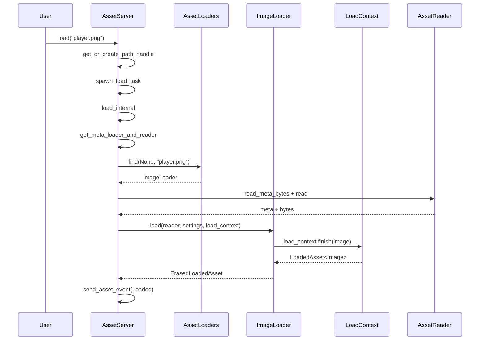

> [[Notes/Bevy/00-Bevy全解析主索引|← 返回 Bevy全解析主索引]]

# Bevy `bevy_asset` 源码解析：AssetLoader 与加载管线

## 模块定位

如果说 `AssetServer` 是资产系统的"调度中心"，那么 **`AssetLoader`** 就是车间里实际干活的"技工"。每种资产类型（如 `Image`、`Mesh`、`Scene`）都对应一个或多个 `AssetLoader` 实现，负责把原始字节流解析成可用的 Rust 数据结构。

本节深入加载管线的完整链路：从**如何根据路径找到正确的 Loader**，到**Loader 如何在异步环境中递归加载依赖**，再到 **`LoadContext` 如何收集子资产和依赖关系**。

---

## 一、接口层（What）

### 1.1 `AssetLoader` trait

```rust
pub trait AssetLoader: TypePath + Send + Sync + 'static {
    type Asset: Asset;
    type Settings: Settings + Default + Serialize + for<'a> Deserialize<'a>;
    type Error: Into<BevyError>;

    fn load(
        &self,
        reader: &mut dyn Reader,
        settings: &Self::Settings,
        load_context: &mut LoadContext,
    ) -> impl ConditionalSendFuture<Output = Result<Self::Asset, Self::Error>>;

    fn extensions(&self) -> &[&str] { &[] }
}
```

> 文件：`crates/bevy_asset/src/loader.rs`，第 32~52 行

`AssetLoader` 是一个**关联类型 trait**（associated type trait），设计上刻意把"加载器本身"和"加载出的资产类型"分离：

- `AssetLoader` 由用户实现为一个独立的结构体（如 `ImageLoader`），而不是为 `Image` 实现；
- `Settings` 允许通过 `.meta` 文件或代码覆盖加载参数；
- `load` 返回 `impl ConditionalSendFuture`，意味着它既可以是 `async` 块，也兼容单线程 WASM。

### 1.2 `ErasedAssetLoader`：类型擦除层

由于 Rust 不支持直接存储泛型 trait object，Bevy 提供了类型擦除层：

```rust
pub trait ErasedAssetLoader: Send + Sync + 'static {
    fn load<'a>(
        &'a self,
        reader: &'a mut dyn Reader,
        settings: &'a dyn Settings,
        load_context: LoadContext<'a>,
    ) -> BoxedFuture<'a, Result<ErasedLoadedAsset, BevyError>>;
    fn extensions(&self) -> &[&str];
    fn deserialize_meta(&self, meta: &[u8]) -> Result<Box<dyn AssetMetaDyn>, DeserializeMetaError>;
    fn default_meta(&self) -> Box<dyn AssetMetaDyn>;
    fn asset_type_id(&self) -> TypeId;
    // ...
}
```

> 文件：`crates/bevy_asset/src/loader.rs`，第 55~78 行

所有 `AssetLoader` 都自动实现 `ErasedAssetLoader`（通过 blanket impl）。`AssetServer` 内部只操作 `Arc<dyn ErasedAssetLoader>`，完全不需要关心具体类型。

### 1.3 `LoadContext`：加载期间的"工作台"

```rust
pub struct LoadContext<'a> {
    pub(crate) asset_server: &'a AssetServer,
    pub(crate) should_load_dependencies: bool,
    pub(crate) asset_path: AssetPath<'static>,
    pub(crate) dependencies: HashSet<ErasedAssetIndex>,
    pub(crate) loader_dependencies: HashMap<AssetPath<'static>, AssetHash>,
    pub(crate) labeled_assets: Vec<LabeledAsset>,
    pub(crate) label_to_asset_index: HashMap<CowArc<'static, str>, usize>,
    pub(crate) asset_id_to_asset_index: HashMap<UntypedAssetId, usize>,
}
```

> 文件：`crates/bevy_asset/src/loader.rs`，第 365~386 行

`LoadContext` 是 `AssetLoader::load` 的第三个参数，也是加载管线的核心协作对象。Loader 通过它：

- **递归加载依赖**：`load_context.load("textures/diffuse.png")` 返回 `Handle<Image>`；
- **注册子资产（labeled assets）**：`load_context.add_labeled_asset("Mesh0", mesh)`；
- **读取原始字节**：`load_context.read_asset_bytes(path).await`；
- **完成加载**：`load_context.finish(my_asset)` 返回 `LoadedAsset<A>`。

### 1.4 `LoadBuilder` 与 `NestedLoadBuilder`

Bevy 0.15+ 引入了 builder 模式来支持更复杂的加载配置：

```rust
let handle: Handle<Image> = asset_server
    .load_builder()
    .with_settings(|s: &mut ImageLoaderSettings| { s.format = ImageFormat::Png; })
    .override_unapproved()
    .load("textures/player.png");
```

`NestedLoadBuilder` 则是 `LoadContext` 内部使用的版本，供 Loader 在加载过程中递归调用。

> 文件：`crates/bevy_asset/src/loader_builders.rs`，第 31~358 行

---

## 二、数据层（How - Structure）

### 2.1 `AssetLoaders`：Loader 注册表

```rust
pub(crate) struct AssetLoaders {
    loaders: Vec<MaybeAssetLoader>,
    type_id_to_loaders: TypeIdMap<Vec<usize>>,
    extension_to_loaders: HashMap<Box<str>, Vec<usize>>,
    type_path_to_loader: HashMap<&'static str, usize>,
    type_path_to_preregistered_loader: HashMap<&'static str, usize>,
}
```

> 文件：`crates/bevy_asset/src/server/loaders.rs`，第 14~21 行

| 索引 | 用途 |
|------|------|
| `type_id_to_loaders` | 按资产 TypeId 查找（如 `TypeId::of::<Image>()`） |
| `extension_to_loaders` | 按文件扩展名查找（如 `"png"`、`"gltf"`） |
| `type_path_to_loader` | 按 Loader 的 `TypePath` 查找（如 `"bevy_image::ImageLoader"`） |
| `type_path_to_preregistered_loader` | 预注册占位，用于解决插件加载顺序问题 |

### 2.2 `MaybeAssetLoader`：延迟加载支持

```rust
pub(crate) enum MaybeAssetLoader {
    Ready(Arc<dyn ErasedAssetLoader>),
    Pending {
        sender: async_broadcast::Sender<Arc<dyn ErasedAssetLoader>>,
        receiver: async_broadcast::Receiver<Arc<dyn ErasedAssetLoader>>,
    },
}
```

> 文件：`crates/bevy_asset/src/server/loaders.rs`，第 274~280 行

`Pending` 状态解决了**插件注册顺序问题**：如果某个系统在 `AssetLoader` 注册之前就开始加载资产，Bevy 不会报错，而是阻塞在该 `receiver` 上，直到真正的 Loader 被注册后通过 `broadcast` 唤醒。

### 2.3 `LoadedAsset` 与 `ErasedLoadedAsset`

```rust
pub struct LoadedAsset<A: Asset> {
    pub(crate) value: A,
    pub(crate) dependencies: HashSet<ErasedAssetIndex>,
    pub(crate) loader_dependencies: HashMap<AssetPath<'static>, AssetHash>,
    pub(crate) labeled_assets: Vec<LabeledAsset>,
    pub(crate) label_to_asset_index: HashMap<CowArc<'static, str>, usize>,
    pub(crate) asset_id_to_asset_index: HashMap<UntypedAssetId, usize>,
}
```

> 文件：`crates/bevy_asset/src/loader.rs`，第 144~157 行

`LoadedAsset` 携带的信息远超单个资产值：

- **`dependencies`**：通过 `Handle` 引用的普通依赖（如材质引用的纹理）。这些依赖必须在主资产被认为"完全加载"之前完成；
- **`loader_dependencies`**：加载过程中直接读取的辅助文件（如 `.gltf` 引用的 `.bin` 文件）。用于资产处理器（`AssetProcessor`）的变更检测；
- **`labeled_assets`**：一个文件产出多个子资产时的映射表（如 GLTF 文件中的多个 mesh）。

`ErasedLoadedAsset` 是其类型擦除版本，内部用 `Box<dyn AssetContainer>` 存储资产值。

---

## 三、逻辑层（How - Behavior）

### 3.1 Loader 查找算法

当 `AssetServer` 需要加载一个路径时，它通过 `AssetLoaders::find` 解析出最合适的 Loader：

```rust
pub(crate) fn find(
    &self,
    asset_type_id: Option<TypeId>,
    asset_path: &AssetPath<'_>,
) -> Option<MaybeAssetLoader> {
    // 1. 如果已知目标资产类型，先按 TypeId 找候选
    let candidates = if let Some(type_id) = asset_type_id { ... };

    // 2. 如果候选唯一，直接返回
    if candidates.len() == 1 { return ...; }

    // 3. 否则按扩展名查找，并与 TypeId 候选交叉验证
    if let Some(full_extension) = asset_path.get_full_extension() {
        if let Some(&index) = try_extension(full_extension) { return ...; }
        for extension in AssetPath::iter_secondary_extensions(full_extension) {
            if let Some(&index) = try_extension(extension) { return ...; }
        }
    }

    // 4. 最后的 fallback：返回 TypeId 候选中最后一个注册的
    candidates?.last().copied().and_then(|index| self.get_by_index(index))
}
```

> 文件：`crates/bevy_asset/src/server/loaders.rs`，第 155~238 行

**解析策略**：

- 对于 `"my_asset.config.ron"`，`get_full_extension()` 返回 `"config.ron"`，然后 `iter_secondary_extensions` 会依次尝试 `"config.ron"` 和 `"ron"`；
- 如果同一类型注册了多个 Loader（如两个不同的 `ImageLoader`），**后注册的会覆盖先注册的**（`list.push` + `indices.last()`）。

### 3.2 加载管线的完整调用链



> 文件：`crates/bevy_asset/src/server/mod.rs`，第 741~949 行

`load_internal` 的核心逻辑（简化版）：

1. **解析元数据**：先读 `.meta` 文件（如果有），获取 Loader 类型和 `Settings`；
2. **查找 Loader**：通过扩展名或 meta 中指定的类型找到 `ErasedAssetLoader`；
3. **创建/复用 Handle**：如果是新路径，分配新的 `AssetIndex`；如果已加载过，复用现有 handle；
4. **调用 Loader**：传入 `Reader`、`Settings`、`LoadContext`；
5. **处理子资产**：如果 `AssetPath` 包含 label（如 `"scene.gltf#Mesh0"`），从 `LoadedAsset::labeled_assets` 中查找对应的子资产；
6. **发送事件**：通过 `InternalAssetEvent::Loaded` 通知主线程。

### 3.3 `LoadContext::finish` — 依赖收集的自动化

```rust
pub fn finish<A: Asset>(mut self, value: A) -> LoadedAsset<A> {
    value.visit_dependencies(&mut |asset_id| {
        let (type_id, index) = match asset_id {
            UntypedAssetId::Index { type_id, index } => (type_id, index),
            UntypedAssetId::Uuid { .. } => return,
        };
        self.dependencies.insert(ErasedAssetIndex { index, type_id });
    });
    LoadedAsset { value, dependencies: self.dependencies, ... }
}
```

> 文件：`crates/bevy_asset/src/loader.rs`，第 534~558 行

这里体现了 `VisitAssetDependencies` trait 的威力：Loader 开发者只需要在资产结构体中持有 `Handle<T>`，并 `#[derive(Asset)]`（它会自动 derive `VisitAssetDependencies`），`finish` 时就会自动遍历所有字段，收集依赖关系。**开发者不需要手动维护依赖列表**。

### 3.4 `NestedLoadBuilder::load_internal` — 递归加载的 deferred 语义

当 Loader 内部调用 `load_context.load("xxx.png")` 时，实际走的是：

```rust
fn load_internal<'a>(self, type_id: TypeId, path: AssetPath<'a>) -> UntypedHandle {
    let handle = if self.load_context.should_load_dependencies {
        self.load_context.asset_server.load_with_meta_transform(...)
    } else {
        self.load_context.asset_server.get_or_create_path_handle_erased(...)
    };
    let index = (&handle).try_into().unwrap();
    self.load_context.dependencies.insert(index);
    handle
}
```

> 文件：`crates/bevy_asset/src/loader_builders.rs`，第 224~254 行

关键点在于 `should_load_dependencies`：

- 在正常游戏运行时（`AssetMode::Unprocessed`），该值为 `true`，会**立即发起异步加载**；
- 在资产处理器场景（`AssetProcessor`），该值可能为 `false`，只记录依赖关系而不实际加载内容。

---

## 四、上下层关系

| 方向 | 交互对象 | 方式 |
|------|---------|------|
| **下层** | `bevy_asset::io::AssetReader` | `Reader` trait 提供异步字节流 |
| **下层** | `ron` / `serde` | `.meta` 文件的序列化/反序列化 |
| **同层** | `AssetServer` | `LoadContext` 持有 `&AssetServer`，可发起嵌套加载 |
| **上层** | `bevy_image::ImageLoader` | 将 PNG/WEBP 解码为 GPU 纹理数据 |
| **上层** | `bevy_gltf::GltfLoader` | 解析 GLTF，产出 Mesh、Material、Animation 等子资产 |
| **上层** | `bevy_scene::SceneLoader` | 反序列化 `.scn.ron` 为 ECS World 快照 |

---

## 五、设计亮点

1. **Loader 与 Asset 类型解耦**：一个 `ImageLoader` 加载出 `Image`，而不是为 `Image` 实现 `AssetLoader`。这让同一个资产类型可以有不同的加载策略；
2. **自动依赖收集**：`VisitAssetDependencies` + `#[derive(Asset)]` 让依赖追踪对 Loader 作者透明；
3. **Pending Loader 机制**：通过 `async_broadcast` 优雅解决了插件注册顺序问题，避免了复杂的初始化阶段锁；
4. **Loader 查找的多级回退**：TypeId → full_extension → secondary_extension → fallback，兼顾精确性和易用性；
5. **`should_load_dependencies` 开关**：同一套 `LoadContext` API 同时服务于运行时加载和资产预处理两种场景。

---

## 六、关键源码片段

### `AssetLoaders::find` — Loader 解析算法

> 文件：`crates/bevy_asset/src/server/loaders.rs`，第 155~238 行

```rust
pub(crate) fn find(
    &self,
    asset_type_id: Option<TypeId>,
    asset_path: &AssetPath<'_>,
) -> Option<MaybeAssetLoader> {
    let candidates = if let Some(type_id) = asset_type_id {
        if asset_path.label().is_none() {
            Some(self.type_id_to_loaders.get(&type_id)?)
        } else { None }
    } else { None };

    let try_extension = |extension| {
        self.extension_to_loaders.get(extension)?.iter().rev()
            .find(|index| candidates.map_or(true, |c| c.contains(index)))
            .copied()
    };

    if let Some(full) = asset_path.get_full_extension() {
        if let Some(idx) = try_extension(full) { return self.get_by_index(idx); }
        for ext in AssetPath::iter_secondary_extensions(full) {
            if let Some(idx) = try_extension(ext) { return self.get_by_index(idx); }
        }
    }

    candidates?.last().copied().and_then(|index| self.get_by_index(index))
}
```

### `LoadContext::add_loaded_labeled_asset` — 子资产注册

> 文件：`crates/bevy_asset/src/loader.rs`，第 490~523 行

```rust
pub fn add_loaded_labeled_asset<A: Asset>(
    &mut self,
    label: impl Into<CowArc<'static, str>>,
    loaded_asset: LoadedAsset<A>,
) -> Handle<A> {
    let label = label.into();
    let loaded_asset: ErasedLoadedAsset = loaded_asset.into();
    let labeled_path = self.asset_path.clone().with_label(label.clone());
    let handle = self.asset_server.get_or_create_path_handle(labeled_path, None);
    let asset = LabeledAsset { asset: loaded_asset, handle: handle.clone().untyped() };
    match self.label_to_asset_index.entry(label) {
        Entry::Occupied(entry) => { self.labeled_assets[*entry.get()] = asset; }
        Entry::Vacant(entry) => {
            entry.insert(self.labeled_assets.len());
            self.asset_id_to_asset_index.insert(handle.id().untyped(), self.labeled_assets.len());
            self.labeled_assets.push(asset);
        }
    }
    handle
}
```

---

## 七、关联阅读

- [[Bevy-bevy_asset-源码解析：AssetServer 与 Handle]] — 调度中心、Handle 引用计数与资产存储
- [[Bevy-bevy_asset-源码解析：AssetEvents 与热重载]] — 加载完成后的状态传播与文件监控
- [[Bevy-bevy_asset-源码解析：Asset 依赖与标签]] — `AssetPath` 语法与子资产机制
- [[Bevy-专题：资源加载全链路]] — 从 `AssetServer::load` 到 GPU 纹理的跨 crate 完整链路

---

> **索引状态**：本笔记属于第二阶段「基础层与反射系统」→ 2.2 资产与加载（bevy_asset）。对应索引中的 `[[Bevy-bevy_asset-源码解析：AssetLoader 与加载管线]]`。
