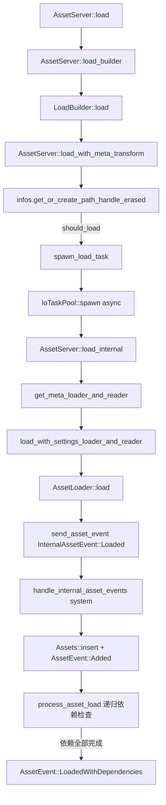
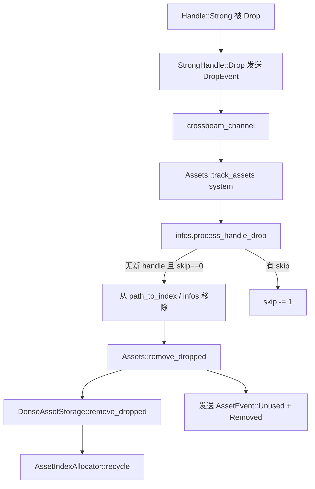

> [[Notes/Bevy/00-Bevy全解析主索引|← 返回 Bevy全解析主索引]]

# Bevy `bevy_asset` 源码解析：AssetServer 与 Handle

## 模块定位

`bevy_asset` 是 Bevy 引擎的**资产加载与管理核心 crate**。它解决游戏开发中最基础的问题之一：如何把磁盘上的美术/设计资源（纹理、模型、音频、场景等）异步加载到内存中，并以一种高效、类型安全、支持引用计数的方式供 ECS 世界使用。

本节聚焦资产系统的"门面"——`AssetServer` 与 `Handle`。如果说 `Assets<T>` 是资产的"仓库"，那么 `AssetServer` 就是负责"进货"的调度中心，而 `Handle` 则是仓库里每个货位的"门牌号"。

---

## 一、接口层（What）

### 1.1 公共 API 概览

`AssetServer` 被设计为一个 **ECS Resource**，对外暴露的核心能力非常简洁：

| 方法 | 职责 |
|------|------|
| `load(path)` | 发起异步加载，返回强引用 `Handle<A>` |
| `reload(path)` | 热重载指定路径的资产 |
| `register_loader<L>()` | 注册某种扩展名对应的 `AssetLoader` |
| `register_asset<A>()` | 注册资产类型，初始化存储与事件系统 |
| `load_state(id)` / `is_loaded_with_dependencies(id)` | 查询加载状态 |

`Handle<A>` 则是用户与资产交互的主要句柄：

| 变体 | 语义 |
|------|------|
| `Handle::Strong(Arc<StrongHandle>)` | 强引用，持有期间资产不会被释放 |
| `Handle::Uuid(Uuid, PhantomData)` | 弱引用/稳定标识，不保证资产存活，也不阻止释放 |

> 文件：`crates/bevy_asset/src/server/mod.rs`，第 66~68 行

```rust
#[derive(Resource, Clone)]
pub struct AssetServer {
    pub(crate) data: Arc<AssetServerData>,
}
```

`AssetServer` 本身是一个轻量壳，所有状态都托管在 `Arc<AssetServerData>` 中，因此它可以被自由克隆并在多线程中共享。

### 1.2 `AssetPlugin` 的初始化链路

`AssetPlugin::build` 是资产系统进入 ECS 世界的入口。它完成三件事：

1. **构建 `AssetSourceBuilders`**：将默认文件源（`assets/` 目录）和嵌入资源源注册进来；
2. **根据 `AssetMode` 创建 `AssetServer`**：`Unprocessed` 模式直接读原始文件，`Processed` 模式则走预处理后目录，并可选择启动 `AssetProcessor`；
3. **注册 ECS 系统**：在 `PreUpdate` 阶段运行 `handle_internal_asset_events`，在 `PostUpdate` 阶段刷新每种类型的 `AssetEvent`。

> 文件：`crates/bevy_asset/src/lib.rs`，第 350~438 行

---

## 二、数据层（How - Structure）

### 2.1 `AssetServerData`：调度中心的状态

```rust
pub(crate) struct AssetServerData {
    pub(crate) infos: RwLock<AssetInfos>,
    pub(crate) loaders: Arc<RwLock<AssetLoaders>>,
    asset_event_sender: Sender<InternalAssetEvent>,
    asset_event_receiver: Receiver<InternalAssetEvent>,
    sources: Arc<AssetSources>,
    mode: AssetServerMode,
    meta_check: AssetMetaCheck,
    unapproved_path_mode: UnapprovedPathMode,
}
```

- **`infos: RwLock<AssetInfos>`**：所有已加载/加载中资产的元信息库，是并发访问的核心瓶颈点；
- **`loaders: Arc<RwLock<AssetLoaders>>`**：已注册的加载器表，支持按扩展名、类型名、TypeId 查找；
- **事件通道**：`crossbeam_channel` 的无界通道，异步加载任务完成后通过它向主线程发送 `InternalAssetEvent`；
- **`sources: Arc<AssetSources>`**：抽象的资产来源集合（文件系统、网络、内存、嵌入资源等）。

### 2.2 `AssetInfos`：资产元信息的"账本"

`AssetInfos` 是资产系统的核心数据结构，维护了三张关键映射：

```rust
pub(crate) struct AssetInfos {
    path_to_index: HashMap<AssetPath<'static>, TypeIdMap<AssetIndex>>,
    infos: HashMap<ErasedAssetIndex, AssetInfo>,
    handle_providers: TypeIdMap<AssetHandleProvider>,
    // ... 其他字段
}
```

| 字段 | 作用 |
|------|------|
| `path_to_index` | 路径 → (TypeId → AssetIndex) 的映射。同一路径可能对应不同类型的资产（如通过 label 区分的子资产） |
| `infos` | `ErasedAssetIndex` → `AssetInfo` 的映射，记录每个资产的加载状态、依赖、等待者等 |
| `handle_providers` | 每种资产类型对应一个 `AssetHandleProvider`，负责分配该类型的 `AssetIndex` 和 `StrongHandle` |

> 文件：`crates/bevy_asset/src/server/info.rs`，第 80~100 行

### 2.3 `AssetHandleProvider` 与引用计数

每种资产类型在初始化时（`init_asset<A>()`）都会创建一个 `AssetHandleProvider`：

```rust
pub struct AssetHandleProvider {
    pub(crate) allocator: Arc<AssetIndexAllocator>,
    pub(crate) drop_sender: Sender<DropEvent>,
    pub(crate) drop_receiver: Receiver<DropEvent>,
    pub(crate) type_id: TypeId,
}
```

- **`AssetIndexAllocator`**：使用**世代索引（generational index）**分配 `AssetIndex`（`generation: u32 + index: u32`）。索引回收时会递增 generation，从而避免 ABA 问题；
- **`drop_sender/drop_receiver`**：`StrongHandle` 被 Drop 时，会通过 `crossbeam_channel` 发送一个 `DropEvent`。`Assets::track_assets` 系统在每帧 `PreUpdate` 阶段消费这些事件，决定资产是否该从 `Assets<T>` 中移除。

> 文件：`crates/bevy_asset/src/handle.rs`，第 22~79 行
> 文件：`crates/bevy_asset/src/assets.rs`，第 46~92 行

### 2.4 `StrongHandle`：引用计数的物理载体

```rust
pub struct StrongHandle {
    pub(crate) index: AssetIndex,
    pub(crate) type_id: TypeId,
    pub(crate) asset_server_managed: bool,
    pub(crate) path: Option<AssetPath<'static>>,
    pub(crate) meta_transform: Option<MetaTransform>,
    pub(crate) drop_sender: Sender<DropEvent>,
}

impl Drop for StrongHandle {
    fn drop(&mut self) {
        let _ = self.drop_sender.send(DropEvent {
            index: ErasedAssetIndex::new(self.index, self.type_id),
            asset_server_managed: self.asset_server_managed,
        });
    }
}
```

这里的设计亮点是：**引用计数不是通过 `Arc` 的 strong_count 来管理资产生命周期，而是通过独立的 channel 发送 Drop 事件**。原因有二：

1. `Handle` 可能被克隆很多次，但 `Assets<T>` 中的资产只需要在**最后一个强引用消失**时才释放；
2. `track_assets` 系统需要在 ECS 的同步点统一处理所有 drop 事件，避免在异步任务中直接修改 `Assets` Resource。

### 2.5 `Assets<T>`：资产的实际存储

`Assets<A>` 是一个 ECS Resource，内部使用双轨存储：

```rust
pub struct Assets<A: Asset> {
    dense_storage: DenseAssetStorage<A>,   // AssetId::Index → A
    hash_map: HashMap<Uuid, A>,            // AssetId::Uuid → A
    handle_provider: AssetHandleProvider,
    queued_events: Vec<AssetEvent<A>>,
    duplicate_handles: HashMap<AssetIndex, u16>,
}
```

- **`DenseAssetStorage`**：基于 `Vec<Entry<A>>` 的稠密数组存储，`Entry` 用 `None` / `Some { value, generation }` 表示插槽状态。这是 runtime 分配的默认路径，O(1) 索引访问；
- **`hash_map`**：供编译期/跨运行稳定引用的 `Uuid` 资产使用；
- **`duplicate_handles`**：记录通过 `get_strong_handle()` 额外生成的强引用计数，防止用户手动创建的强引用与资产释放冲突。

> 文件：`crates/bevy_asset/src/assets.rs`，第 105~275 行

---

## 三、逻辑层（How - Behavior）

### 3.1 加载流程：从 `load()` 到资产入库

一条 `asset_server.load("scene.gltf")` 的完整调用链如下：



> 文件：`crates/bevy_asset/src/server/mod.rs`，第 364~608 行

**关键设计点**：

- `load()` 是**非阻塞**的。它立刻返回一个 `Handle::Strong`，但资产数据此时还不存在；
- 实际的 IO 和反序列化发生在 `IoTaskPool` 的异步任务中；
- 加载完成后，通过 `crossbeam_channel` 发送 `InternalAssetEvent::Loaded`，由 ECS 的 `PreUpdate` system `handle_internal_asset_events` 统一处理；
- `handle_internal_asset_events` 需要 `&mut World`，因为它要同时操作 `Assets<T>`、发送 `AssetEvent`、更新 `AssetInfos` 中的依赖状态。

### 3.2 依赖状态传播

`AssetInfo` 中记录了三种加载状态：

| 状态 | 含义 |
|------|------|
| `load_state` | 资产本身是否已加载完成 |
| `dep_load_state` | 直接依赖（通过 `Handle` 引用）是否全部加载完成 |
| `rec_dep_load_state` | 递归依赖（依赖的依赖）是否全部加载完成 |

当某个资产加载完成后，`process_asset_load` 会：

1. 先递归处理所有 labeled subassets；
2. 将主资产插入 `Assets<T>`；
3. 检查自己的 `dependencies` 集合中每个依赖的 `rec_dep_load_state`；
4. 若所有递归依赖都已 `Loaded`，则发送 `InternalAssetEvent::LoadedWithDependencies`；
5. 同时遍历 `dependents_waiting_on_recursive_dep_load`，向等待者传播状态。

> 文件：`crates/bevy_asset/src/server/info.rs`，第 397~577 行

这种**反向依赖传播**（从依赖项通知被依赖项）避免了轮询，是一种典型的观察者模式变体。

### 3.3 Handle Drop 与资产释放



> 文件：`crates/bevy_asset/src/assets.rs`，第 573~590 行
> 文件：`crates/bevy_asset/src/server/info.rs`，第 710~757 行

`process_handle_drop` 有一个精妙的**handle_drops_to_skip** 机制：当 `get_or_create_path_handle_internal` 发现某个路径的所有强引用都已消失、但 `AssetInfo` 还在时，它会创建一个新的 `StrongHandle` 并把 `handle_drops_to_skip += 1`。这样，旧 handle 的 drop 事件被消费时不会误删资产。

### 3.4 多线程策略

`bevy_asset` 的并发模型可以概括为：

- **读写锁分离**：`AssetInfos` 用 `RwLock` 保护，`load()` 入口获取写锁创建 handle，异步任务中读锁查找 loader；
- **异步 IO**：所有文件读取、网络请求都在 `IoTaskPool`（基于 `async_executor`）中执行；
- **事件同步**：异步任务不直接操作 ECS World，而是通过 channel 发送事件，由 ECS system 在固定调度点统一消费；
- **单线程回退**：在 WASM 或非 `multi_threaded` 环境下，`spawn_load_task` 会提前 `drop(infos)` 再 spawn，避免死锁。

> 文件：`crates/bevy_asset/src/server/mod.rs`，第 573~608 行

---

## 四、上下层关系

| 方向 | 交互对象 | 方式 |
|------|---------|------|
| **下层** | `bevy_tasks::IoTaskPool` | 异步加载任务的线程池 |
| **下层** | `bevy_ecs::World / Resources` | `Assets<T>` 是 Resource，`AssetEvent<T>` 是 Message |
| **下层** | `bevy_reflect` | `Asset` 要求 `TypePath`，`Handle` 支持 `Reflect` |
| **上层** | `bevy_render` | `Mesh`、`Image`、`Shader` 等渲染资源通过 `Handle` 引用 |
| **上层** | `bevy_scene` / `bevy_gltf` | 场景加载器在 `LoadContext` 中递归加载子资产 |
| **同层** | `AssetLoader` | `AssetServer` 委托具体类型的加载逻辑给 `AssetLoader` |

---

## 五、设计亮点

1. **世代索引 + 回收队列**：`AssetIndexAllocator` 用 `AtomicU32` 单调递增分配新索引，回收时通过 channel 缓冲旧索引，下一帧 `flush()` 时才真正复用。这消除了 ABA 问题，且无需锁；
2. **channel-based drop 通知**：不依赖 `Arc::strong_count`，而是显式发送 drop 事件。这让 ECS system 成为资产释放的唯一决策者，避免了异步代码直接操作 World 的复杂性；
3. **路径 → 多类型索引的映射**：`path_to_index: HashMap<AssetPath, TypeIdMap<AssetIndex>>` 允许同一路径（如 `scene.gltf#Mesh0`）根据 label 和类型指向不同的资产；
4. **加载状态的三层分解**：`load_state` / `dep_load_state` / `rec_dep_load_state` 让用户可以精确判断"资产是否可用"，而不仅仅是"是否加载完成"。

---

## 六、关键源码片段

### `AssetServer::spawn_load_task` — 异步任务的启动

> 文件：`crates/bevy_asset/src/server/mod.rs`，第 573~608 行

```rust
pub(crate) fn spawn_load_task<G: Send + Sync + 'static>(
    &self,
    handle: UntypedHandle,
    path: AssetPath<'static>,
    mut infos: RwLockWriteGuard<'_, AssetInfos>,
    guard: G,
) {
    infos.stats.started_load_tasks += 1;
    // 单线程环境下必须先释放锁，否则异步任务会死锁
    #[cfg(any(target_arch = "wasm32", not(feature = "multi_threaded")))]
    drop(infos);

    let owned_handle = handle.clone();
    let server = self.clone();
    let task = IoTaskPool::get().spawn(async move {
        if let Err(err) = server
            .load_internal(Some(owned_handle), path, false, None)
            .await
        {
            error!("{}", err);
        }
        drop(guard); // guard 在加载完成或失败时才释放
    });
    // ...
}
```

### `AssetInfos::process_asset_load` — 依赖传播核心

> 文件：`crates/bevy_asset/src/server/info.rs`，第 397~577 行

```rust
pub(crate) fn process_asset_load(
    &mut self,
    loaded_asset_index: ErasedAssetIndex,
    loaded_asset: ErasedLoadedAsset,
    world: &mut World,
    sender: &Sender<InternalAssetEvent>,
) {
    // 1. 先递归处理 labeled subassets
    for asset in loaded_asset.labeled_assets { ... }
    // 2. 将主资产插入 World 中的 Assets<T>
    loaded_asset.value.insert(loaded_asset_index.index, world);
    // 3. 检查依赖状态
    let dep_load_state = match (loading_deps.len(), failed_deps.len()) { ... };
    let rec_dep_load_state = match (loading_rec_deps.len(), failed_rec_deps.len()) { ... };
    // 4. 通知等待者
    for id in dependents_waiting_on_load { ... }
}
```

---

## 七、关联阅读

- [[Bevy-bevy_asset-源码解析：AssetLoader 与加载管线]] — 深入 `AssetLoader` trait、`LoadContext` 和加载管线的具体实现
- [[Bevy-bevy_asset-源码解析：AssetEvents 与热重载]] — `AssetEvent` 的五种变体、`AssetProcessor` 与文件监控机制
- [[Bevy-bevy_asset-源码解析：Asset 依赖与标签]] — `AssetPath` 的 source/path/label 三元组、子资产机制
- [[Bevy-bevy_ecs-源码解析：World 与 Entity 生命周期]] — 理解 `Assets<T>` 作为 ECS Resource 的上下文
- [[Bevy-bevy_ecs-源码解析：Event 与 Commands 延迟执行]] — `AssetEvent` 使用 `Messages<T>` 的 ECS 消息机制

---

> **索引状态**：本笔记属于第二阶段「基础层与反射系统」→ 2.2 资产与加载（bevy_asset）。对应索引中的 `[[Bevy-bevy_asset-源码解析：AssetServer 与 Handle]]`。
