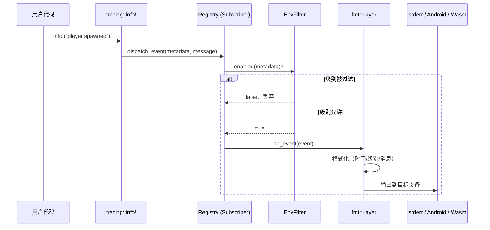

> [[Notes/Bevy/00-Bevy全解析主索引|← 返回 Bevy全解析主索引]]

**所属阶段**：第二阶段-基础层 / 2.4 基础工具 crate

---

## 模块定位

`bevy_log` 是 Bevy 引擎的日志基础设施 crate，职责非常聚焦：**将 Rust 生态中成熟的 `tracing` 库接入 Bevy 的 Plugin 生命周期，并做跨平台适配**。

它的设计哲学是"不重复造轮子"——Bevy 没有自研日志系统，而是完全依赖 `tracing` + `tracing-subscriber` 的组合，再通过 `LogPlugin` 在 App 构建阶段完成全局 subscriber 的初始化。`bevy_diagnostic` 则在此基础上，提供了一套 ECS 原生的性能诊断数据收集与输出机制。

| 分析对象 | 源码路径 | 代码规模 |
|---------|---------|---------|
| `bevy_log` | `<BEVY_SOURCE_ROOT>/crates/bevy_log/` | ~580 行 |
| `bevy_diagnostic` | `<BEVY_SOURCE_ROOT>/crates/bevy_diagnostic/` | ~1,300 行 |

---

## 第 1 层：接口层（What）

### 1.1 日志宏：直接 re-export 自 tracing

Bevy 提供的日志 API 几乎全部是 `tracing` crate 的"透传"。在 `bevy_log/src/lib.rs` 中，核心宏被直接 pub use：

> 文件：`crates/bevy_log/src/lib.rs`，第 47~50 行

```rust
pub use tracing::{
    self, debug, debug_span, error, error_span, event, info, info_span, trace, trace_span, warn,
    warn_span, Level,
};
```

`prelude` 模块则进一步把最常用的宏打包，方便用户通过 `use bevy::prelude::*` 一次引入：

> 文件：`crates/bevy_log/src/lib.rs`，第 33~44 行

```rust
pub mod prelude {
    pub use tracing::{
        debug, debug_span, error, error_span, info, info_span, trace, trace_span, warn, warn_span,
    };
    pub use crate::{debug_once, error_once, info_once, trace_once, warn_once};
    pub use bevy_utils::once;
}
```

这意味着：**用户在 Bevy 里写 `info!("hello")`，本质上就是在调用 `tracing::info!`**。Bevy 没有对这些宏做二次封装，保持了与 Rust 生态的完全兼容。

### 1.2 日志级别

`tracing` 定义了 5 个级别，由重到轻：

| 级别 | 宏 | 用途 |
|------|-----|------|
| `ERROR` | `error!` | 发生了错误，程序可能无法继续正常执行 |
| `WARN` | `warn!` | 出现了意料之外但可恢复的情况 |
| `INFO` | `info!` | 一般性信息，默认开启 |
| `DEBUG` | `debug!` | 调试信息，开发时有用 |
| `TRACE` | `trace!` | 最细粒度的跟踪信息，非常 noisy |

Bevy 的默认全局级别是 `INFO`，但通过 `LogPlugin::filter` 可以为不同模块设置不同阈值（见下文）。

### 1.3 `*_once` 宏：防刷屏利器

Bevy 额外提供了一组 `*_once` 宏，解决 ECS System 中"每帧都触发日志导致刷屏"的问题：

> 文件：`crates/bevy_log/src/once.rs`，第 4~49 行

```rust
#[macro_export]
macro_rules! trace_once {
    ($($arg:tt)+) => ({
        $crate::once!($crate::trace!($($arg)+))
    });
}
// ... debug_once, info_once, warn_once, error_once 结构相同
```

这些宏底层依赖 `bevy_utils::once` 宏，通过在每个调用点创建一个静态 `OnceFlag`，保证**同一调用位置只执行一次**：

> 文件：`crates/bevy_utils/src/once.rs`，第 28~35 行

```rust
macro_rules! once {
    ($expression:expr) => {{
        static SHOULD_FIRE: $crate::OnceFlag = $crate::OnceFlag::new();
        if SHOULD_FIRE.set() {
            $expression;
        }
    }};
}
```

> **注意**：`*_once` 是"按调用点去重"，不是按消息内容去重。同一消息出现在不同行号仍然会分别打印一次。

### 1.4 可视化/屏幕日志输出

**Bevy 官方目前没有内置的"游戏内屏幕日志（on-screen console）"**。日志的输出渠道取决于目标平台：

| 平台 | 输出目标 | 实现方式 |
|------|---------|---------|
| 桌面（Windows/Linux/macOS） | `stderr` | `tracing_subscriber::fmt::Layer` |
| Android | Android Logcat | 自定义 `AndroidLayer`（`android_log_sys`） |
| Wasm32 | 浏览器 Console | `tracing_wasm::WASMLayer` |
| iOS | os_log | `tracing_oslog::OsLogger` |

Bevy 的诊断数据（帧率、帧时间等）可以通过 `LogDiagnosticsPlugin` 定期输出到控制台，但这不是"游戏内 UI 日志"，而是终端日志。如果需要屏幕日志，社区有第三方插件实现。

### 1.5 `LogPlugin`：日志系统的入口

`LogPlugin` 是 `DefaultPlugins` 的一部分，是用户与日志系统交互的主要接口：

> 文件：`crates/bevy_internal/src/default_plugins.rs`，第 5~10 行

```rust
pub struct DefaultPlugins {
    bevy_app::PanicHandlerPlugin,
    #[cfg(feature = "bevy_log")]
    bevy_log::LogPlugin,
    bevy_app::TaskPoolPlugin,
    bevy_diagnostic::FrameCountPlugin,
    // ...
}
```

---

## 第 2 层：数据层（How - Structure）

### 2.1 `LogPlugin` 配置参数

> 文件：`crates/bevy_log/src/lib.rs`，第 218~250 行

```rust
pub struct LogPlugin {
    /// 使用 EnvFilter 语法控制各模块日志级别
    pub filter: String,
    /// 全局最低日志级别
    pub level: Level,
    /// 用户自定义 Layer（追加到默认 Layer 之后）
    pub custom_layer: fn(app: &mut App) -> Option<BoxedLayer>,
    /// 覆盖默认 fmt::Layer（如去掉时间戳）
    pub fmt_layer: fn(app: &mut App) -> Option<BoxedFmtLayer>,
}
```

四个字段的分工非常清晰：
- `filter` + `level` 控制**哪些日志能输出**（过滤层）。
- `custom_layer` 控制**额外输出到哪**（追加输出层，如写入文件、发送到远程）。
- `fmt_layer` 控制**默认终端输出的格式**（覆盖层）。

默认过滤字符串 `DEFAULT_FILTER`  suppress 了一些底层库的 noisy 日志：

> 文件：`crates/bevy_log/src/lib.rs`，第 270~282 行

```rust
pub const DEFAULT_FILTER: &str = concat!(
    "wgpu=error,",
    "naga=warn,",
    "symphonia_bundle_mp3::demuxer=warn,",
    // ... 多个音频格式 demuxer 设为 warn
    "calloop::loop_logic=error,",
    "calloop::sources=debug,",
);
```

### 2.2 `tracing-subscriber` 的 Layer 架构

`tracing-subscriber` 使用**分层（Layer）架构**：一个 `Registry` 作为核心 subscriber，多个 `Layer` 叠加在其上，每个 Layer 可以独立决定是否处理某个事件。

Bevy 中 subscriber 的类型链通过条件编译组合：

> 文件：`crates/bevy_log/src/lib.rs`，第 255~267 行

```rust
#[cfg(feature = "trace")]
type BaseSubscriber =
    Layered<EnvFilter, Layered<Option<Box<dyn Layer<Registry> + Send + Sync>>, Registry>>;

#[cfg(feature = "trace")]
type PreFmtSubscriber = Layered<tracing_error::ErrorLayer<BaseSubscriber>, BaseSubscriber>;

#[cfg(not(feature = "trace"))]
type PreFmtSubscriber =
    Layered<EnvFilter, Layered<Option<Box<dyn Layer<Registry> + Send + Sync>>, Registry>>;
```

层次结构（以 `trace` feature 开启时为例）：

```
Registry
  └── Option<custom_layer>
      └── EnvFilter（日志级别过滤）
          └── tracing_error::ErrorLayer（panic 时捕获 span 栈）
              └── fmt::Layer（终端格式化输出）
                  └── [可选] Chrome Layer / Tracy Layer / Android Layer / ...
```

这种设计让"过滤"和"输出"完全解耦：一个 Layer 负责"要不要输出"，另一个 Layer 负责"输出到哪里、以什么格式"。

### 2.3 平台适配 Layer 的数据结构

以 Android 为例，Bevy 实现了一个自定义 `Layer`：

> 文件：`crates/bevy_log/src/android_tracing.rs`，第 10~12 行

```rust
#[derive(Default)]
pub(crate) struct AndroidLayer;
```

它内部没有复杂状态，只是一个无状态的结构体。真正的工作在 `Layer` trait 的实现中完成——将 `tracing` 事件转换为 Android 的 `__android_log_write` 调用。

类似地，Tracy 性能分析器和 Chrome  tracing 的输出也通过 `Layer` 实现：
- `tracing_tracy::TracyLayer` —— 实时性能分析
- `tracing_chrome::ChromeLayer` —— 输出 Chrome 浏览器可读的 JSON 火焰图

### 2.4 `bevy_diagnostic` 的核心数据结构

诊断系统使用 ECS 原生的方式存储数据：

> 文件：`crates/bevy_diagnostic/src/diagnostic.rs`，第 114~136 行

```rust
/// 单次测量值
pub struct DiagnosticMeasurement {
    pub time: Instant,
    pub value: f64,
}

/// 一条诊断时间线（如 FPS、帧时间）
pub struct Diagnostic {
    path: DiagnosticPath,
    pub suffix: Cow<'static, str>,
    history: VecDeque<DiagnosticMeasurement>,
    sum: f64,                    // 缓存的求和，用于 O(1) 平均
    ema: f64,                    // 指数移动平均
    ema_smoothing_factor: f64,
    max_history_length: usize,
    pub is_enabled: bool,
}
```

`DiagnosticsStore` 作为 `Resource` 存储在 `World` 中，内部是一个 `HashMap<DiagnosticPath, Diagnostic>`：

> 文件：`crates/bevy_diagnostic/src/diagnostic.rs`，第 304~307 行

```rust
#[derive(Debug, Default, Resource)]
pub struct DiagnosticsStore {
    diagnostics: HashMap<DiagnosticPath, Diagnostic, PassHash>,
}
```

`DiagnosticPath` 使用预计算的 FNV-1a hash 加速查找：

> 文件：`crates/bevy_diagnostic/src/diagnostic.rs`，第 21~35 行

```rust
pub struct DiagnosticPath {
    path: Cow<'static, str>,
    hash: u64,  // const 上下文预计算
}

impl DiagnosticPath {
    pub const fn const_new(path: &'static str) -> DiagnosticPath {
        DiagnosticPath {
            path: Cow::Borrowed(path),
            hash: fnv1a_hash_str_64(path),
        }
    }
}
```

### 2.5 `Diagnostics` SystemParam 与延迟写入

诊断测量不是直接写入 `DiagnosticsStore`，而是通过 `SystemBuffer` 延迟应用：

> 文件：`crates/bevy_diagnostic/src/diagnostic.rs`，第 347~401 行

```rust
#[derive(SystemParam)]
pub struct Diagnostics<'w, 's> {
    store: Res<'w, DiagnosticsStore>,
    queue: Deferred<'s, DiagnosticsBuffer>,  // 延迟缓冲
}

#[derive(Default)]
struct DiagnosticsBuffer(HashMap<DiagnosticPath, DiagnosticMeasurement, PassHash>);

impl SystemBuffer for DiagnosticsBuffer {
    fn queue(&mut self, _system_meta: &SystemMeta, mut world: DeferredWorld) {
        // System 执行结束后，一次性将缓冲中的测量值写入 DiagnosticsStore
        let Some(mut diagnostics) = world.get_resource_mut::<DiagnosticsStore>() else { return };
        for (path, measurement) in self.0.drain() {
            if let Some(diagnostic) = diagnostics.get_mut(&path) {
                diagnostic.add_measurement(measurement);
            }
        }
    }
}
```

这种设计与 ECS 的 `Commands` 机制一致：**在 System 执行期间只收集数据，在 System 结束后统一提交**，避免多线程并发修改 `DiagnosticsStore`。

---

## 第 3 层：逻辑层（How - Behavior）

### 3.1 一条日志的完整调用链

以用户在 System 中调用 `info!("player spawned")` 为例，完整链路如下：



具体代码层面，`LogPlugin::build` 在 App 初始化时设置全局 subscriber：

> 文件：`crates/bevy_log/src/lib.rs`，第 295~400 行

```rust
impl Plugin for LogPlugin {
    fn build(&self, app: &mut App) {
        let subscriber = Registry::default();
        let subscriber = subscriber.with((self.custom_layer)(app));  // 用户自定义 Layer
        let subscriber = subscriber.with(self.build_filter_layer()); // EnvFilter
        // ... 条件编译追加 ErrorLayer / fmt_layer / Chrome / Tracy / Android / Wasm / iOS
        let subscriber_already_set =
            tracing::subscriber::set_global_default(finished_subscriber).is_err();
        // ... 错误处理
    }
}
```

关键细节：
1. **`Registry::default()`** 是 `tracing-subscriber` 的核心 subscriber，负责事件的存储和分发。
2. **`set_global_default()`** 将 subscriber 设为进程全局。Rust 的 `tracing` 生态中，subscriber 必须是全局唯一的，因此 `LogPlugin` 的文档明确说明**不要在同一进程添加两次**。
3. **`LogTracer::init()`** 将 `log` crate 的日志也桥接到 `tracing`，确保即使第三方库使用 `log::info!`，也能被 `tracing-subscriber` 捕获。

### 3.2 过滤器的构建与优先级

`LogPlugin::build_filter_layer()` 展示了过滤规则的组合逻辑：

> 文件：`crates/bevy_log/src/lib.rs`，第 403~432 行

```rust
fn build_filter_layer(&self) -> EnvFilter {
    // 1. 先解析默认过滤器（含 self.level + DEFAULT_FILTER）
    let default_filters =
        EnvFilter::builder().parse_lossy(format!("{}, {}", self.level, self.filter));
    // 2. 再叠加 RUST_LOG 环境变量中的规则
    let env_filters = std::env::var(EnvFilter::DEFAULT_ENV).unwrap_or_default();
    let result = env_filters
        .split(',')
        .filter(|s| !s.is_empty())
        .try_fold(default_filters.clone(), |filters, directive| {
            directive.parse().map(|d| filters.add_directive(d))
        });
    // 3. 环境变量格式错误时回退到默认过滤器
    match result { ... }
}
```

**优先级规则**：`EnvFilter` 中"更具体的规则"优先。例如 `warn,my_crate=trace` 表示全局只输出 `warn` 及以上，但 `my_crate` 模块可以输出 `trace` 级别。`RUST_LOG` 环境变量可以覆盖 `LogPlugin` 的默认配置。

### 3.3 多线程 ECS 调度中的线程安全

Bevy 的日志系统在多线程场景下的安全由 `tracing` 本身保证：

1. **`Registry` 是 `Send + Sync`**：`tracing-subscriber` 的 `Registry` 使用无锁数据结构（如 `sharded_slab`）存储 span 数据，并发写入时是线程安全的。
2. **`fmt::Layer` 使用 `MutexWriter`**：`tracing-subscriber` 的格式化 Layer 在写入 `stderr` / `stdout` 时会通过互斥锁保证输出不交错。
3. **诊断数据通过 `SystemBuffer` 延迟提交**：`DiagnosticsBuffer` 在每个 System 的本地缓冲中收集测量值，在 System 结束后的单线程 `apply` 阶段写入 `DiagnosticsStore`，天然避免了并发冲突。

这意味着：用户在任意 System 中随意调用 `info!()`，无需担心线程安全问题——`tracing` 已经处理好了。

### 3.4 日志与 `bevy_diagnostic` 的关系

`bevy_diagnostic` 本身不依赖 `bevy_log`（它的 `Cargo.toml` 中没有 `bevy_log` 依赖），而是通过 `log` crate 输出诊断数据：

> 文件：`crates/bevy_diagnostic/src/log_diagnostics_plugin.rs`，第 8 行

```rust
use log::{debug, info};
```

但注意：`log` crate 的日志会被 `LogTracer::init()` 桥接到 `tracing`，因此诊断日志最终仍由 `tracing-subscriber` 处理。这是一种**松耦合**设计——`bevy_diagnostic` 只负责"收集数据"和"调用 log 宏"，不关心日志最终输出到哪里。

`LogDiagnosticsPlugin` 的工作流程：

> 文件：`crates/bevy_diagnostic/src/log_diagnostics_plugin.rs`，第 100~112 行、第 188~196 行

```rust
impl Plugin for LogDiagnosticsPlugin {
    fn build(&self, app: &mut App) {
        app.insert_resource(LogDiagnosticsState { timer: ..., filter: ... });
        app.add_systems(PostUpdate, Self::log_diagnostics_system);
    }
}

fn log_diagnostics_system(
    mut state: ResMut<LogDiagnosticsState>,
    time: Res<Time<Real>>,
    diagnostics: Res<DiagnosticsStore>,
) {
    if state.timer.tick(time.delta()).is_finished() {
        Self::log_diagnostics(&state, &diagnostics);  // 通过 info! 输出
    }
}
```

`FrameTimeDiagnosticsPlugin` 则负责**生产**诊断数据：

> 文件：`crates/bevy_diagnostic/src/frame_time_diagnostics_plugin.rs`，第 72~88 行

```rust
pub fn diagnostic_system(
    mut diagnostics: Diagnostics,
    time: Res<Time<Real>>,
    frame_count: Res<FrameCount>,
) {
    diagnostics.add_measurement(&Self::FRAME_COUNT, || frame_count.0 as f64);
    let delta_seconds = time.delta_secs_f64();
    if delta_seconds == 0.0 { return; }
    diagnostics.add_measurement(&Self::FRAME_TIME, || delta_seconds * 1000.0);
    diagnostics.add_measurement(&Self::FPS, || 1.0 / delta_seconds);
}
```

### 3.5 崩溃日志与 Panic 处理

Bevy 本身没有独立的"崩溃转储（crash dump）"机制（如 `.dmp` 文件），但在 `trace` feature 开启时，`LogPlugin` 会设置一个自定义 panic hook，在崩溃时输出当前的 **span trace**：

> 文件：`crates/bevy_log/src/lib.rs`，第 298~305 行

```rust
#[cfg(feature = "trace")]
{
    let old_handler = std::panic::take_hook();
    std::panic::set_hook(Box::new(move |infos| {
        eprintln!("{}", tracing_error::SpanTrace::capture());
        old_handler(infos);
    }));
}
```

`tracing_error::SpanTrace` 类似于栈跟踪，但显示的是**当前活跃的 tracing span 层级**而非函数调用栈。这对于理解"panic 发生在哪个 System / 哪个 Render Pass"非常有价值。

此外，`trace_tracy_memory` feature 可以将全局分配器替换为 Tracy 的 `ProfiledAllocator`，在 Tracy 中分析内存分配：

> 文件：`crates/bevy_log/src/lib.rs`，第 25~28 行

```rust
#[cfg(feature = "trace_tracy_memory")]
#[global_allocator]
static GLOBAL: tracy_client::ProfiledAllocator<std::alloc::System> =
    tracy_client::ProfiledAllocator::new(std::alloc::System, 100);
```

### 3.6 插件级别的日志过滤

Bevy 的日志过滤粒度可以精确到 crate 和模块级别。例如：

```rust
LogPlugin {
    filter: "warn,my_game=debug,my_game::physics=trace".to_string(),
    level: Level::INFO,
    ..Default::default()
}
```

这得益于 `EnvFilter` 的 directive 语法。`tracing-subscriber` 在运行时会为每个日志事件匹配最具体的 directive。`LogPlugin` 的默认配置已经 suppress 了 `wgpu`、`naga` 等底层库的 verbose 输出，让终端保持干净。

---

## 与上下层模块的关系

### 上层依赖（谁在使用 `bevy_log`）

通过 Grep 统计，`bevy_log` 在 Bevy 的 60+ 个 crate 中被广泛引用。几乎所有核心 crate 都通过 `use bevy_log::{info, warn, error, debug, trace}` 输出日志。例如：

- `bevy_render`：渲染管线中输出 GPU 资源错误、shader 编译警告
- `bevy_asset`：资源加载失败时输出 `error!`
- `bevy_winit`：窗口事件跟踪输出 `trace!`

### 下层依赖（`bevy_log` 依赖谁）

- `bevy_app`：实现 `Plugin` trait
- `bevy_ecs`：`tracing-chrome` feature 下需要 `Resource` derive
- `bevy_utils`：`once!` 宏
- `bevy_platform`：`SyncCell`（用于 `FlushGuard`）

### 与 `bevy_diagnostic` 的协作关系

```
┌─────────────────────┐     ┌──────────────────────┐
│ FrameTimeDiagnosticsPlugin │     │ LogDiagnosticsPlugin       │
│ (生产诊断数据)            │────▶│ (消费诊断数据 → 输出到日志) │
└─────────────────────┘     └──────────────────────┘
         │                              │
         ▼                              ▼
  DiagnosticsStore (Resource)    log::info! (经 LogTracer)
         │                              │
         └──────────────┬───────────────┘
                        ▼
                tracing-subscriber
                        ▼
                   stderr / Tracy / Chrome
```

---

## 设计亮点与可迁移经验

### 1. **"不重复造轮子"的务实态度**

Bevy 没有自研日志系统，而是直接接入 Rust 生态最成熟的 `tracing`。这不仅减少了维护成本，也让 Bevy 用户能无缝使用 `tracing` 生态的丰富工具（Jaeger、Zipkin、Prometheus、Chrome 火焰图等）。对于自研引擎的启示是：**基础设施层优先复用生态成熟方案，把精力集中在游戏引擎特有的价值上**。

### 2. **Plugin 作为初始化器的模式**

`LogPlugin` 的核心工作是在 `build()` 中调用 `set_global_default()` 完成一次性全局配置。这是 Bevy 中"全局状态通过 Plugin 初始化"的典型模式。类似地，自研引擎也可以设计一个"启动时一次性配置、运行时只读"的全局服务初始化机制。

### 3. **Layer 架构的可扩展性**

`tracing-subscriber` 的 Layer 模型让"过滤"、"格式化"、"输出目标"三者完全解耦。Bevy 通过 `custom_layer` 和 `fmt_layer` 两个回调，让用户可以在不修改源码的情况下注入自定义行为。这种**"钩子（hook）+ 默认实现"**的设计对于引擎的可扩展性至关重要。

### 4. **`*_once` 宏的防刷屏设计**

ECS 的 System 每帧都会执行，如果其中包含日志宏，终端会被刷屏。`*_once` 宏用极低的成本（每个调用点一个静态 `OnceFlag`）解决了这个问题。这是一个非常实用的**引擎工具层设计**：为高频执行的逻辑提供"单次触发"的语法糖。

### 5. **诊断数据的延迟提交模式**

`DiagnosticsBuffer` 作为 `SystemBuffer` 的实现，展示了 ECS 中处理"并发写入共享状态"的标准解法：先在线程本地缓冲，再在统一时点批量提交。这种模式可以迁移到任何需要"System 中收集数据、最终汇总到全局 Resource"的场景（如性能计数器、事件统计）。

### 6. **平台适配的零成本抽象**

Bevy 对不同平台的日志输出通过条件编译和统一的 `Layer` trait 实现。`AndroidLayer` 只有 99 行代码，但完美桥接了 Android 的 `__android_log_write`。这展示了如何用 Rust 的条件编译实现**零运行时开销的平台适配**。

---

## 关键源码文件速查

| 文件 | 职责 |
|------|------|
| `crates/bevy_log/src/lib.rs` | `LogPlugin`、宏 re-export、subscriber 组装 |
| `crates/bevy_log/src/android_tracing.rs` | Android Logcat 适配 Layer |
| `crates/bevy_log/src/once.rs` | `*_once` 宏定义 |
| `crates/bevy_diagnostic/src/diagnostic.rs` | `Diagnostic`、`DiagnosticsStore`、`DiagnosticsBuffer` |
| `crates/bevy_diagnostic/src/log_diagnostics_plugin.rs` | 将诊断数据输出到日志 |
| `crates/bevy_diagnostic/src/frame_time_diagnostics_plugin.rs` | 帧时间 / FPS 诊断数据生产 |
| `crates/bevy_diagnostic/src/frame_count.rs` | 全局帧计数器 `FrameCount` |

---

## 关联阅读

- 同阶段：`[[Bevy-bevy_utils-源码解析：工具类型与便利宏]]`
- 同阶段：`[[Bevy-bevy_diagnostic-源码解析：性能诊断与帧率]]`
- 同阶段：`[[Bevy-bevy_time-源码解析：Time 与 Timer]]`
- 第一阶段：`[[Bevy-bevy_app-源码解析：App 构建与 Plugin 系统]]` — 理解 Plugin 生命周期
- 第一阶段：`[[Bevy-bevy_ecs-源码解析：Resource 全局状态]]` — 理解 `DiagnosticsStore` 的存储模型

---

## 索引状态

- **所属阶段**：第二阶段-基础层 / 2.4 基础工具 crate
- **索引对应**：`00-Bevy全解析主索引.md` 中 `[[Bevy-bevy_log-源码解析：日志与 tracing 集成]]`
- **分析轮次**：第一轮骨架扫描 + 第二轮血肉填充合并执行（本笔记覆盖接口层、数据层、逻辑层）
- **建议更新**：将索引中对应条目状态由 `⬜` 更新为 `✅`
