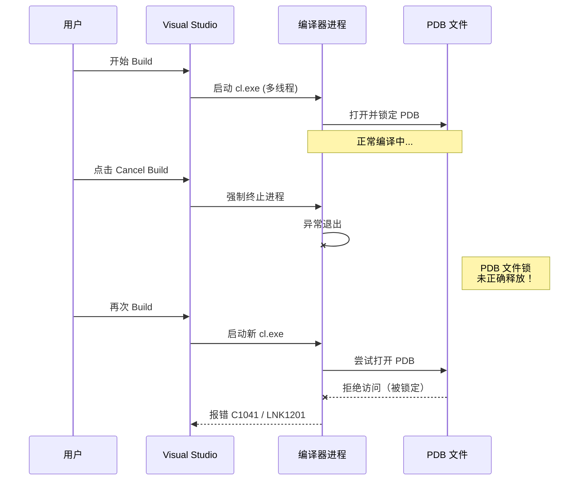
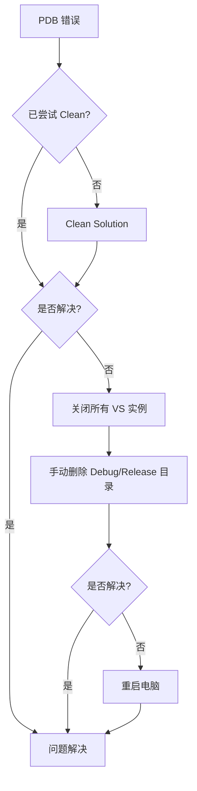

> [[索引|← 返回 C++编程索引]]

# Visual Studio PDB 文件锁定问题

> [!info] 背景
> 在 Visual Studio 编译过程中，如果中途取消 Build，经常会弹出 "program database" 相关错误，导致后续编译失败。本文解释其原理和解决方案。

---

## 一、问题现象

### 1.1 典型错误信息

```
error C1041: cannot open program database 'xxx.pdb';
if multiple CL.EXE write to the same .PDB file, use /FS

fatal error LNK1201: error writing to program database 'xxx.pdb';
check for insufficient disk space, invalid path, or insufficient privilege

Cannot open program database. The file is being used by another process.
```

### 1.2 触发场景

- 编译过程中强制取消（点击 "Cancel Build"）
- VS 崩溃或卡死后强制关闭
- 多项目同时编译时资源竞争
- 杀毒软件扫描 PDB 文件时

---

## 二、PDB 在编译中的角色

### 2.1 PDB 是什么？

**PDB（Program Database）** 存储调试信息，但它在编译过程中的作用不止于此：

```
编译流程中的 PDB：

源文件1.cpp ──┐
源文件2.cpp ──┼── 编译器 (cl.exe) ── 目标文件 (.obj)
源文件3.cpp ──┘           │
                          ↓
                    实时写入 PDB
                          │
链接器 (link.exe) ←───────┘
    ↓
可执行文件 (.exe/.dll) + 完整 PDB
```

### 2.2 编译时 PDB 的生命周期

| 阶段 | PDB 状态 | 操作 |
|------|---------|------|
| 编译开始 | 创建/打开 | 编译器进程独占锁定 |
| 编译过程中 | 持续写入 | 记录类型、符号、行号信息 |
| 编译结束 | 关闭释放 | 文件锁解除 |
| 编译取消 | **异常状态** | 锁可能未正确释放 |

---

## 三、为什么取消编译会导致 PDB 锁定？

### 3.1 根本原因：文件锁未释放



### 3.2 多线程编译加剧问题

当开启并行编译 (`/MP` 选项) 时，多个编译器实例同时写入同一个 PDB：

```
编译线程1 ──┐
编译线程2 ──┼── 同时竞争写入 ──→ PDB 文件锁定冲突
编译线程3 ──┘
编译线程4 ──┘
```

**中途取消时**：
- 部分线程已写入完成
- 部分线程被强制终止
- PDB 处于**不一致状态** + **文件锁残留**

---

## 四、解决方案

### 4.1 临时解决（已出现问题后）

> [!warning] Clean vs Rebuild 的区别
> - **Clean Solution**：只删除生成的文件（.obj, .pdb, .exe 等），**不会自动编译**，需要手动再点 Build
> - **Rebuild Solution**：Clean + Build 的组合，清理后自动重新编译
> - 如果 PDB 被锁定，选择 Clean 或 Rebuild 都可以解决问题

| 方法 | 操作步骤 | 实际效果 | 适用场景 |
|------|---------|---------|---------|
| **Clean Solution** | `Build → Clean Solution` 或右键 → 清理 | 删除所有生成文件（包括被锁定的 PDB）| 想手动控制何时重新编译 |
| **Rebuild Solution** | `Build → Rebuild Solution` 或右键 → 重新生成 | 先 Clean 再自动 Build | 一步到位，最常用 |
| **手动删除** | 删除 `Debug/` 或 `Release/` 目录 | 强制移除被锁文件 | Clean 无效时使用 |
| **重启 VS** | 关闭 Visual Studio 再打开 | 释放所有文件句柄 | 删除后仍报错 |
| **重启电脑** | 终极方案 | 确保所有进程释放 | 以上方法都无效 |

### 4.2 预防措施

#### 方案 A：使用 `/FS` 选项（推荐）

```
项目属性 → C/C++ → 命令行 → 附加选项：
添加：/FS
```

**作用**：强制使用串行化 PDB 写入，避免多线程冲突

**什么是 `/FS`？**

`/FS` = **F**orce **S**ynchronous PDB Writes（强制同步 PDB 写入）

```
不加 /FS 时：                      加了 /FS 后：

线程1 ──┐                          线程1 ──┐
线程2 ──┼── 同时抢占写入 ──→ PDB    线程2 ──┼──→ MSPDBSRV.EXE ──→ PDB
线程3 ──┘    （容易冲突！）          线程3 ──┘    （排队串行写入）
```

**工作原理：**

| 方面    | 说明                                        |
| ----- | ----------------------------------------- |
| 解决的问题 | 多线程编译 (`/MP`) 时多个 cl.exe 同时写入同一 PDB 导致的冲突 |
| 实现机制  | 启动独立服务进程 `MSPDBSRV.EXE` 专门协调 PDB 写入       |
| 效果    | 所有编译器通过服务排队写入，避免文件锁竞争                     |
| 代价    | 略微增加编译时间（写入串行化），但通常可接受                    |

**为什么能减少 PDB 锁定问题？**

- 不加 `/FS`：每个 cl.exe 直接打开 PDB，强制终止时某些进程的锁可能没释放
- 加了 `/FS`：统一通过服务进程访问，即使取消编译也更容易正确清理

> [!tip]
> 对于大型项目或使用 `/MP` 多线程编译的情况，`/FS` 是微软官方推荐的解决方案。

#### 方案 B：分离各项目的 PDB

```
项目属性 → C/C++ → 输出文件 → 程序数据库文件名：
从默认的 $(IntDir)vc$(PlatformToolsetVersion).pdb
改为：$(IntDir)$(ProjectName).pdb
```

这样每个项目有独立的 PDB，减少竞争。

#### 方案 C：禁用并行编译（牺牲速度）

```
项目属性 → C/C++ → 常规 → 多处理器编译：
设为：否 (/MP-)
```

### 4.3 方案对比

| 方案 | 优点 | 缺点 | 适用场景 |
|------|------|------|---------|
| `/FS` | 简单有效，不牺牲并行编译 | 略微增加编译时间 | **推荐日常使用** |
| 分离 PDB | 彻底避免多项目冲突 | 需要为每个项目配置 | 大型解决方案 |
| 禁用 `/MP` | 完全避免锁竞争 | 编译速度显著下降 | 小型项目或调试时 |

---

## 五、深入理解：PDB 锁定机制

### 5.1 Windows 文件锁定原理

```
进程A ── 打开文件 ── 请求独占锁 ── 获得访问权 ── 写入数据
                              ↓
进程B ── 尝试打开 ── 请求锁失败 ── 返回 "文件被占用" 错误
```

### 5.2 为什么重启 VS 能解决问题？

```
进程生命周期：
    cl.exe 进程 ── 持有 PDB 句柄
         ↓ 强制终止/崩溃
    句柄未关闭 ── 内核中的文件锁残留
         ↓ 重启 VS
    新进程启动 ── 原进程完全销毁
         ↓
    文件锁释放 ── 新编译器可以访问 PDB
```

### 5.3 如何查看哪个进程锁定了 PDB？

使用 **Process Explorer**（Sysinternals 工具）：

```
1. 下载 Process Explorer
2. 按 Ctrl+F 打开搜索
3. 输入 pdb 文件名
4. 查看持有该文件的进程
```

或者在命令行使用 Handle 工具：

```powershell
# 需要下载 handle.exe
handle.exe myproject.pdb
```

---

## 六、最佳实践总结

### 编译习惯

1. **避免频繁取消编译** - 等待当前编译完成
2. **使用 Clean Build** - 出现问题先 Clean 再 Build
3. **定期清理解决方案** - 删除旧的中间文件

### 项目配置建议

```
推荐设置（项目属性）：
├── C/C++ → 命令行 → /FS
├── C/C++ → 输出文件 → $(IntDir)$(ProjectName).pdb
└── 链接器 → 调试 → 生成程序数据库文件 → 是
```

### 故障排查流程



---

## 七、相关参考

- [[C++编程/调试器核心概念与原理.md|调试器核心概念与原理]] - 理解 PDB/DWARF 格式
- [[C++编程/GDB调试指南.md|GDB 调试学习笔记]] - 跨平台调试工具
- [Microsoft Docs: /FS (Force Synchronous PDB Writes)](https://docs.microsoft.com/en-us/cpp/build/reference/fs-force-synchronous-pdb-writes)
- [Sysinternals Process Explorer](https://docs.microsoft.com/en-us/sysinternals/downloads/process-explorer)

---

## 八、常见误区澄清

| 误区 | 真相 |
|------|------|
| "PDB 只是调试用的，不影响编译" | ❌ PDB 在编译过程中就被持续写入 |
| "取消编译只是停止，不会有副作用" | ❌ 强制终止会导致资源未释放 |
| "重启 VS 太麻烦，再点一次 Build 就行" | ❌ 文件锁还在，必须释放后才能访问 |
| "/FS 会显著减慢编译速度" | ⚠️ 略有影响，但通常可接受 |

---

> [!tip] 一句话总结
> PDB 锁定问题的本质是 **Windows 文件锁机制 + 编译器多线程写入 + 强制终止进程** 的共同结果。使用 `/FS` 选项是最简单有效的预防措施。
