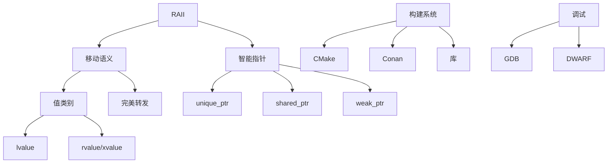

# C++ 知识索引

> [!info] 学习哲学
> C++ 是一门**多范式**编程语言，掌握它需要理解：
> 1. **底层机制** — 内存模型、对象布局、编译过程
> 2. **现代特性** — C++11/14/17/20/23 引入的改进
> 3. **工程实践** — 如何写出安全、高效、可维护的代码

---

## Why：为什么要深入理解 C++？

| 场景 | C++ 的优势 |
|------|-----------|
| **系统编程** | 直接操作硬件、零开销抽象 |
| **游戏开发** | 性能关键路径、内存精确控制 |
| **实时系统** | 确定性的性能、无 GC 暂停 |
| **嵌入式** | 资源受限环境下的高效执行 |
| **高频交易** | 纳秒级延迟要求 |

> [!note] 核心权衡
> C++ 提供**高性能**和**精细控制**，代价是**复杂性**和**学习曲线**。
> 理解底层机制，才能写出既高效又安全的现代 C++ 代码。

---

## What：知识体系架构

```
C++ 知识体系
│
├── 语言基础
│   ├── 类型系统
│   ├── 值类别（左值/右值）
│   ├── 对象生存期
│   └── 类型转换
│
├── 内存管理
│   ├── 内存模型
│   ├── 智能指针
│   ├── RAII 惯用法
│   └── 移动语义
│
├── 编译与链接
│   ├── 编译过程
│   ├── 静态/动态库
│   └── 构建系统
│
├── 调试与优化
│   ├── 调试器原理
│   ├── GDB 使用
│   └── 性能分析
│
└── 现代 C++ 特性
    ├── 关键字（explicit/noexcept/decltype）
    ├── 完美转发
    ├── 编译期计算
    └── 宏与元编程
```

---

## How：按主题导航

### 🎯 核心必学（优先级 ★★★）

| 主题 | 笔记 | 核心要点 | 难度 |
|------|------|---------|------|
| **值类别与移动语义** | [[C++编程/C++ 值类别与移动语义\|值类别与移动语义]] | lvalue/rvalue/xvalue、std::move、完美转发 | ⭐⭐⭐ |
| **对象生存期与 RAII** | [[C++编程/C++ 对象生存期与 RAII\|对象生存期与 RAII]] | 所有权模型、智能指针、资源管理 | ⭐⭐⭐ |
| **构建系统** | [[构建系统/构建系统：make 与 CMake\|make 与 CMake]] | CMake 现代实践、目标导向 | ⭐⭐ |

### 🔧 关键字详解

| 关键字 | 笔记 | 一句话概括 |
|--------|------|-----------|
| `explicit` | [[C++编程/C++ explicit 关键字\|explicit]] | 禁止隐式类型转换 |
| `inline` | [[C++编程/C++ inline 关键字\|inline]] | 内联展开，不是强制的 |
| `noexcept` | [[C++编程/C++ noexcept 关键字\|noexcept]] | 标记不抛异常，优化移动操作 |
| `decltype` | [[C++编程/C++ decltype 关键字\|decltype]] | 获取表达式类型 |
| `volatile` | [[C++编程/C++ volatile 关键字\|volatile]] | 禁止优化，用于硬件访问 |

### 🛠️ 编译与构建

| 主题 | 笔记 | 说明 |
|------|------|------|
| **编译过程** | [[构建系统/C++编译过程原理\|编译过程原理]] | 预处理 → 编译 → 汇编 → 链接 |
| **编译选项** | [[构建系统/C++编译选项\|编译选项]] | GCC/Clang 常用选项 |
| **静态/动态库** | [[构建系统/静态库与动态库\|静态库与动态库]] | 链接原理、使用场景 |
| **Conan 包管理** | [[构建系统/Conan 依赖管理详解\|Conan 依赖管理]] | 现代 C++ 依赖管理 |

### 🧬 元编程与代码生成

| 主题 | 笔记 | 核心要点 | 难度 |
|------|------|---------|------|
| **宏编程** | [[C++编程/C++ 宏编程\|宏编程]] | 预处理器、X-Macro、反射代码生成、变参宏 | ⭐⭐⭐ |

### 🐛 调试技术

| 主题 | 笔记 | 核心内容 |
|------|------|---------|
| **调试器原理** | [[C++编程/调试器核心概念与原理\|调试器核心概念与原理]] | 断点、单步执行、变量查看原理 |
| **变量定位** | [[C++编程/调试器如何找到变量位置——进程隔离与DWARF调试信息\|变量定位原理]] | DWARF 格式、调试信息 |
| **INT3 断点** | [[C++编程/调试器INT3断点插入的位置详解\|INT3 断点]] | 软件断点实现机制 |
| **GDB 指南** | [[C++编程/GDB调试指南\|GDB 调试指南]] | 常用命令速查 |
| **PDB 锁定** | [[C++编程/Visual Studio PDB 文件锁定问题\|PDB 锁定问题]] | Windows 调试问题解决 |

### 🔄 类型系统

| 主题 | 笔记 | 核心内容 |
|------|------|---------|
| **类型转换** | [[C++编程/C++类型转换\|类型转换]] | static_cast/dynamic_cast/reinterpret_cast/const_cast |

### 📦 标准库与容器

| 主题 | 笔记 | 核心内容 |
|------|------|---------|
| **unordered_map 底层原理** | [[C++编程/C++ unordered_map 的底层原理与性能陷阱\|unordered_map 原理与性能]] | bucket 机制、分离链接法、cache miss、rehash 代价 |

---

## 📚 学习路径推荐

### 阶段 1：基础夯实（1-2 周）

```
C++ 基础复习
    ↓
类型转换机制
    ↓
对象生存期与 RAII
```

**目标**：理解对象何时创建、何时销毁，掌握智能指针基本使用。

---

### 阶段 2：现代 C++ 核心（2-3 周）

```
值类别（lvalue/rvalue/xvalue）
    ↓
移动语义与 std::move
    ↓
完美转发与 std::forward
    ↓
五法则 / 零法则
```

**目标**：理解为什么 `std::move` 不移动、什么时候用 `noexcept`、如何写异常安全的类。

**关键产出**：能正确实现支持移动语义的类，理解 `vector` 扩容时的行为。

---

### 阶段 3：工程实践（持续）

```
CMake 现代实践
    ↓
Conan 依赖管理
    ↓
调试器原理（理解底层）
    ↓
库的设计（静态/动态）
    ↓
宏与元编程（引擎代码生成）
```

**目标**：能搭建跨平台的 C++ 项目，理解调试器如何工作。

---

## 🔗 知识点关联图



> [!note] 图例对应笔记
> - **RAII** → [[C++编程/C++ 对象生存期与 RAII\|对象生存期与 RAII]]
> - **移动语义** → [[C++编程/C++ 值类别与移动语义\|值类别与移动语义]]
> - **GDB** → [[C++编程/GDB调试指南\|GDB 调试指南]]
> - **DWARF** → [[C++编程/调试器如何找到变量位置——进程隔离与DWARF调试信息\|变量定位原理]]

---

## 🎯 面试高频考点

| 考点 | 相关笔记 | 典型问题 |
|------|---------|---------|
| **智能指针** | [[C++编程/C++ 对象生存期与 RAII\|RAII]] | shared_ptr 循环引用怎么解决？unique_ptr 怎么转移所有权？ |
| **移动语义** | [[C++编程/C++ 值类别与移动语义\|值类别]] | 什么时候会触发移动构造？std::move 后对象还能用吗？ |
| **虚函数** | [[C++编程/C++ 虚函数与多态本质\|虚函数与多态本质]] | 虚函数表原理、纯虚函数、虚析构函数 |
| **内存对齐** | （待补充） | sizeof 计算、内存对齐规则、#pragma pack |
| **模板** | （待补充） | SFINAE、偏特化、变参模板 |
| **宏编程** | [[C++编程/C++ 宏编程\|宏编程]] | `#` / `##` / `__VA_ARGS__`、X-Macro、常见陷阱 |

---

## 📖 扩展阅读

- **《Effective Modern C++》** — Scott Meyers，现代 C++ 必读
- **《C++ Primer》** — 全面的语言参考
- **cppreference.com** — 权威在线文档

---

> [!quote] 现代 C++ 信条
> - 能写 `auto` 就不写类型名
- 能用智能指针就不用裸指针
- 能用 `std::vector` 就不用裸数组
- 能用值返回就不要返回引用（依赖 RVO）
- 能用 `constexpr` 就在编译期计算

---

> 最后更新：2026-03-28
