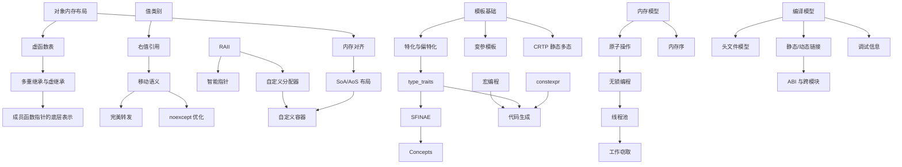

# 编程知识索引

> [[Notes/索引/知识总索引|← 返回 知识总索引]]

> [!info]
> 本索引面向**游戏引擎级 C++ 开发**，覆盖 SelfGameEngine 自研引擎与 Unreal Engine 等工业级代码库中的高频挑战。每篇笔记只聚焦一个核心机制或问题，用问题链驱动叙述。

---

## 学习路径

```
对象模型与内存布局
    ↓
值类别与对象生存期
    ↓
内存管理与分配策略
    ↓
类型系统与类型操作
    ↓
模板机制与泛型编程
    ↓
编译期计算与代码生成
    ↓
并发与内存模型
    ↓
标准库原理与引擎替代方案
    ↓
编译链接与 ABI
    ↓
异常安全与错误处理
```

---

## 一、对象模型与内存布局

> 当我在引擎里写一个 `struct Transform` 或继承 `UObject`，内存到底怎么排布？虚指针与动态派发的开销来自哪里？

| 状态  | 笔记                         | 核心问题                         | 引擎映射                                  |
| :-: | :------------------------- | :--------------------------- | :------------------------------------ |
|  ✅  | [[对象内存布局：从 struct 到 class\|对象内存布局：从 struct 到 class]] | C 结构体与 C++ 对象的内存排布差异，成员对齐与填充 | SelfGameEngine 数学类型的 packed 对齐策略      |
|  ✅  | [[虚函数与多态本质\|虚函数与多态本质]] | 虚函数表、虚指针、动态派发的底层实现           | UE `UObject` 虚函数表、反射虚函数覆盖             |
|  ✅  | [[成员函数指针的底层表示\|成员函数指针的底层表示]] | 成员函数指针比普通函数指针大的原因、调用机制       | 委托（Delegate）系统的实现基础                   |

---

## 二、值类别与对象生存期

> `std::move` 后对象还能用吗？函数返回大对象时拷贝了吗？引擎的「帧临时内存」为什么不会泄漏？

| 状态 | 笔记 | 核心问题 | 引擎映射 |
|:---:|:---|:---|:---|
| ✅ | [[值类别与移动语义\|值类别与移动语义]] | lvalue/rvalue/xvalue 的区分动机、`std::move` 的本质 | 容器扩容时的元素迁移、资源「偷取」 |
| ⬜ | 右值引用与万能引用 | `T&&` 的两种含义、引用折叠规则 | 泛型容器接口设计 |
| ⬜ | 完美转发 | `std::forward` 的必要性、与 `std::move` 的区别 | 引擎 `Array::emplace`、工厂函数 |
| ⬜ | 返回值优化与 guaranteed elision | RVO/NRVO 的编译器机制、C++17 强制省略 | 函数返回 `Mat4`/`Quat` 时的性能预期 |
| ✅ | [[对象生存期与 RAII\|对象生存期与 RAII]] | 构造析构顺序、临时对象生命周期、悬垂引用 | 资源生命周期管理、帧分配器 |
| ⬜ | 移动语义后的对象状态约定 | 移动构造后源对象的状态、合法操作集合 | 移动后对象的置空策略 |

---

## 三、内存管理与分配策略

> 引擎为什么禁用 `new/delete`？FrameArena 怎么保证一帧后全释放？

| 状态  | 笔记                                     | 核心问题                                                             | 引擎映射                                  |
| :-: | :------------------------------------- | :--------------------------------------------------------------- | :------------------------------------ |
|  ✅  | [[原始内存操作与对象生命周期的边界\|原始内存操作与对象生命周期的边界]] | `memcpy`/`memset`/`memmove` 的边界、trivially copyable、placement new | 帧分配器内存初始化、ECS 组件批量构造、网络包解析            |
|  ⬜  | 栈分配与堆分配的实现差异                           | 栈帧布局、`malloc` 的底层开销                                              | FrameArena 的栈式分配器设计                   |
|  ⬜  | 内存对齐规则与 SIMD 对齐                        | 对齐要求、padding 计算、`#pragma pack`、过度对齐                              | 16/32 字节对齐、SSE/AVX 指令要求               |
|  ⬜  | 缓存行、false sharing 与内存布局                | CPU 缓存层级、MESI 协议、伪共享的检测与避免                                       | ECS 组件数组的并发访问布局优化                     |
|  ⬜  | 自定义内存分配器的设计                            | `new`/`delete` 重载、分配器接口、调试装饰器                                    | FrameArena、ObjectPool、BinnedAllocator |
|  ✅  | [[对象生存期与 RAII\|智能指针与所有权模型]]            | `unique_ptr`/`shared_ptr`/`weak_ptr` 的边界、循环引用                    | UE `TSharedPtr`/`TWeakObjectPtr`      |
|  ⬜  | 引擎中的内存调试与泄漏检测                          | 分配追踪、调用栈记录、哨兵值检查                                                 | 内存分析面板、泄漏报告                           |

---

## 四、类型系统与类型操作

> 引擎反射系统怎么在编译期知道一个类型有多大？`concept` 怎么替代冗长的 SFINAE？

| 状态 | 笔记 | 核心问题 | 引擎映射 |
|:---:|:---|:---|:---|
| ✅ | [[类型转换\|类型转换：static、dynamic、reinterpret、const]] | 四种转换的分工、使用场景、安全风险 | 引擎中类型转换的安全策略 |
| ⬜ | RTTI 的实现成本与替代方案 | `typeid`/`dynamic_cast` 的底层、禁用 RTTI 后的做法 | 引擎自建类型注册表 |
| ✅ | [[explicit 关键字\|explicit 与隐式转换构造函数]] | 隐式转换的陷阱、`explicit` 的防御作用 | UE 宏生成的 `explicit` 构造函数 |
| ✅ | [[decltype 关键字\|decltype 与 auto 类型推导]] | `decltype`/`auto` 推导规则差异、`decltype(auto)` | 泛型代码中返回值类型的精确表达 |
| ⬜ | SFINAE：替换失败不是错误 | 编译期条件分支、enable_if 的实现原理 | 容器对 `trivially_copyable` 的特化 |
| ⬜ | C++20 Concepts 与约束式泛型 | `concept`/`requires` 的声明式约束、与 SFINAE 的对比 | 引擎接口的 concept 化表达 |
| ⬜ | type_traits 原理与应用 | 类型萃取的实现、编译期类型查询 | 反射代码生成中的类型萃取基础 |

---

## 五、模板机制与泛型编程

> 引擎的 `TArray`、`TMap` 怎么在不依赖标准库的情况下实现泛型？UHT 代码生成用了什么模板技巧？

| 状态 | 笔记 | 核心问题 | 引擎映射 |
|:---:|:---|:---|:---|
| ⬜ | 模板的编译模型与实例化机制 | 两阶段编译、模板定义为什么通常在头文件 | 引擎模板容器的编译分离策略 |
| ⬜ | 全特化与偏特化 | 针对特定类型的优化定制、偏特化的模式匹配 | `HashMap<int>` 与 `HashMap<StringId>` 的不同策略 |
| ⬜ | 变参模板与参数包展开 | 递归展开、折叠表达式、`sizeof...` | 日志格式化、委托的多参数绑定 |
| ⬜ | CRTP：奇异递归模板模式 | 静态多态的编译期派发、与虚函数的性能对比 | 引擎组件基类的静态派发设计 |
| ⬜ | 模板元编程基础 | 类型作为数据、编译期计算、类型列表 | 编译期分支、编译期类型遍历 |
| ✅ | [[decltype 关键字\|typename 与依赖名解析]] | 依赖名的二义性、`typename` 的强制使用场景 | 泛型代码中嵌套类型的规范写法 |

---

## 六、编译期计算与代码生成

> UE 的 UHT 怎么在编译前生成 `.generated.cpp`？引擎的 `StringId` 怎么做到编译期哈希？

| 状态 | 笔记 | 核心问题 | 引擎映射 |
|:---:|:---|:---|:---|
| ✅ | [[constexpr 关键字\|constexpr 与编译期计算]] | 编译期函数的限制演进、与宏和模板元编程的对比 | 编译期数学表、编译期类型 ID |
| ⬜ | consteval 与 constinit | 强制编译期求值、静态初始化保证 | 编译期哈希、全局常量初始化 |
| ✅ | [[宏编程\|宏编程与 X-Macro 模式]] | 预处理器的能力边界、X-Macro、变参宏、代码生成 | UHT 代码生成、属性宏、反射注册宏 |
| ⬜ | 编译期字符串与编译期哈希 | `constexpr` 字符串处理、字符串哈希的编译期实现 | `StringId`（`const char*` → 编译期 hash） |
| ⬜ | 编译期断言与错误信息定制 | `static_assert` 的触发时机、C++17 自定义错误信息 | 引擎静态检查（如 `sizeof(Component) <= 64`） |

---

## 七、并发与内存模型

> ECS 的并行 System 读写同一组件会不会崩溃？`memory_order_relaxed` 到底「放松」了什么？

| 状态 | 笔记 | 核心问题 | 引擎映射 |
|:---:|:---|:---|:---|
| ⬜ | C++11 内存模型与 happens-before | 顺序一致性、数据竞争的定义、同步关系 | 跨线程组件读写、主线程回调投递 |
| ⬜ | 原子操作与无锁编程基础 | `std::atomic` 的特化、CAS 循环、ABA 问题 | 任务队列的 lock-free 实现 |
| ⬜ | 内存序：relaxed、acquire、release、seq_cst | 四种内存序的具体语义、选错的后果 | 并行 System 的读写屏障、命令缓冲提交 |
| ⬜ | 条件变量与虚假唤醒 | 等待-通知机制、谓词等待的必要性 | 线程池的任务等待与唤醒 |
| ⬜ | thread_local 的实现与边界 | 线程局部存储的存储位置、生命周期、平台差异 | 每线程帧分配器、随机数生成器状态 |
| ⬜ | 工作窃取队列与线程池设计 | 任务分解、双端队列窃取、负载均衡 | SelfGameEngine 线程池核心架构 |
| ⬜ | 异步编程模型与 future/promise | 异步结果传递、`std::async` 的实现方式 | 异步加载资源的回调封装 |

---

## 八、标准库原理与引擎替代方案

> SelfGameEngine 为什么不用 `std::vector`？`std::unordered_map` 的 cache miss 问题在哪？

| 状态 | 笔记 | 核心问题 | 引擎映射 |
|:---:|:---|:---|:---|
| ⬜ | std::vector 的扩容策略与摊还分析 | 增长因子的选择、reallocate 时的元素迁移 | 引擎 `Array` 的增长因子与内存预留 |
| ✅ | [[unordered_map 的底层原理与性能陷阱\|unordered_map 的原理与性能陷阱]] | 桶链结构、rehash 代价、cache miss、开放寻址法替代 | 引擎 `HashMap`、SparseSet 的设计动机 |
| ⬜ | std::function 的实现与开销 | 类型擦除、小对象优化、虚函数调用开销 | 引擎委托系统的轻量级替代设计 |
| ⬜ | 短字符串优化与引擎字符串设计 | SSO 布局、`std::string` 的内存结构、与引擎字符串对比 | SSO、`StringId`、固定缓冲字符串 |
| ⬜ | 模板特化与内联优化 | `std::sort` 比 `qsort` 快的根本原因 | 引擎排序算法的泛型实现 |
| ⬜ | SoA、AoS 与 AOSOA | 三种数据布局的内存访问模式、SIMD 友好性对比 | ECS 组件存储、粒子系统数据布局 |

---

## 九、编译链接与 ABI

> 为什么改了一个头文件会触发全量编译？DLL 边界传递 `std::string` 为什么崩溃？

| 状态 | 笔记 | 核心问题 | 引擎映射 |
|:---:|:---|:---|:---|
| ⬜ | 头文件模型、前向声明与 Modules | 预处理器的文本替换本质、编译时间爆炸的根因 | 引擎 PCH、模块划分、接口最小化 |
| ⬜ | 静态库与动态库的链接原理 | 符号解析、重定位、运行时加载、符号可见性 | 引擎模块的静态/动态组织策略 |
| ✅ | [[inline 关键字\|inline 与 ODR 规则]] | `inline` 的真正语义、链接期行为、与内联优化的关系 | 头文件中模板函数与内联函数的组织 |
| ⬜ | ABI 不稳定与跨模块边界 | STL 跨 DLL 传递的危险、内存分配器差异、虚表边界 | UE `DLLEXPORT`、引擎模块接口设计 |
| ✅ | [[调试器核心概念与原理\|调试器核心概念与原理]] | 断点、单步执行、变量查看的底层机制 | 调试器原理、条件断点实现 |
| ✅ | [[调试器如何找到变量位置——进程隔离与DWARF调试信息\|DWARF 调试信息格式]] | DWARF 格式、调试信息编码、虚拟内存映射 | 调试信息的生成与剥离 |
| ✅ | [[调试器INT3断点插入的位置详解\|INT3 软件断点机制]] | 指令替换、0xCC 编码、多线程断点竞争 | 调试器原理 |
| ⬜ | 编译优化与调试信息映射 | 内联、寄存器分配、指令重排对调试的影响 | 优化开关对调试的影响与应对 |
| ✅ | [[GDB调试指南\|GDB 调试指南]] | GDB 常用命令、断点设置、栈回溯、内存查看 | 跨平台调试实践 |
| ✅ | [[Visual Studio PDB 文件锁定问题\|PDB 文件锁定问题]] | Windows 调试构建中的 PDB 句柄占用、增量链接 | Windows 调试问题解决 |

---

## 十、异常安全与错误处理

> UE 和 SelfGameEngine 为什么都禁用异常？没有异常怎么传播错误？

| 状态 | 笔记 | 核心问题 | 引擎映射 |
|:---:|:---|:---|:---|
| ✅ | [[noexcept 关键字\|noexcept 与异常规格]] | `noexcept` 的语义、对移动语义优化的影响 | `noexcept` 移动构造对容器扩容的优化 |
| ⬜ | 引擎禁用异常的设计考量 | 确定性、性能、跨模块 ABI、与 C 代码互操作 | SelfGameEngine/UE 的异常策略 |
| ⬜ | Result 模式与错误传播策略 | 错误码 vs 异常、`std::expected`、断言与崩溃报告 | 引擎错误码体系、错误传播边界 |

---

## 知识点关联图



---

## 与引擎开发的映射速查

| 引擎模块 | 依赖的 C++ 知识主题 | 关键笔记 |
|---------|------------------|---------|
| **ECS 组件存储** | 内存布局、SoA/AoS、对齐、模板 | SoA/AoS 布局、内存对齐规则 |
| **自定义容器** | 模板、分配器、移动语义 | 模板实例化机制、自定义分配器、noexcept 移动 |
| **反射系统** | 宏编程、模板元编程、类型特征 | 宏编程与 X-Macro、type_traits、编译期字符串哈希 |
| **线程池与任务** | 并发内存模型、原子操作、条件变量 | 内存模型与 happens-before、原子操作与无锁编程 |
| **RHI/渲染抽象** | DLL 边界、虚函数、内存屏障 | 虚函数表、ABI 与跨模块边界、内存序 |
| **Pak/VFS 系统** | 文件 IO、模板、错误处理 | Result 模式与错误传播策略 |
| **构建系统** | 编译模型、链接、Modules | 头文件模型与 Modules、静态库与动态库 |
| **编辑器/AI 桥接** | 反射、DLL、脚本绑定 | RTTI 替代方案、ABI 与跨模块边界 |

---

> 最后更新：2026-05-10
>
> 维护说明：新增笔记时在此索引中更新状态列（✅ 已完成 / 🔄 重写中 / ⬜ 待产出），并同步更新关联图。
