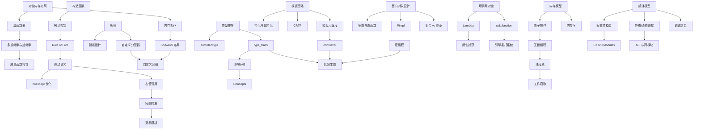

# 编程知识索引

> [[Notes/索引/知识总索引|← 返回 知识总索引]]

> [!info]
> 本索引面向**游戏引擎级 C++ 开发**，覆盖 C++ Primer、Effective C++、Effective Modern C++、More Effective C++ 等经典著作的核心议题，并映射到 SelfGameEngine 自研引擎与 Unreal Engine 等工业级代码库中的高频挑战。每篇笔记只聚焦一个核心机制或问题，用问题链驱动叙述。

---

## 学习路径

```
对象内存模型与底层机制
    ↓
构造、析构与拷贝控制（Rule of Three/Five/Zero）
    ↓
值类别与移动语义
    ↓
完美转发与泛型接口
    ↓
资源管理与对象生存期
    ↓
类型系统与类型推导
    ↓
模板机制与泛型编程
    ↓
编译期计算与代码生成
    ↓
面向对象设计原则
    ↓
运算符重载与可调用对象
    ↓
并发与内存模型
    ↓
标准库原理与引擎替代方案
    ↓
编译链接、ABI 与调试
    ↓
异常安全与错误处理
    ↓
现代 C++ 演进与惯用法
```

---

## 一、对象内存模型与底层机制

> 当我在引擎里写一个 `struct Transform` 或继承 `UObject`，内存到底怎么排布？虚指针与动态派发的开销来自哪里？SIMD 指令为什么要求 16 字节对齐？

| 状态  | 笔记                                                   | 核心问题                                                | 引擎映射                             |
| :-: | :--------------------------------------------------- | :-------------------------------------------------- | :------------------------------- |
|  ✅  | [[对象内存布局：从 struct 到 class\|对象内存布局：从 struct 到 class]] | C 结构体与 C++ 对象的内存排布差异，成员对齐与填充                        | SelfGameEngine 数学类型的 packed 对齐策略 |
|  ✅  | [[虚函数与多态本质\|虚函数与多态本质]]                               | 虚函数表、虚指针、动态派发的底层实现                                  | UE `UObject` 虚函数表、反射虚函数覆盖        |
|  ✅  | [[成员函数指针的底层表示\|成员函数指针的底层表示]]                         | 成员函数指针比普通函数指针大的原因、调用机制                              | 委托（Delegate）系统的实现基础              |
|  ⬜  | 多重继承与虚继承的内存排布                                        | 多基类布局、vbase offset、虚基类表指针                           | 引擎中多重继承的使用策略与内存代价                |
|  ⬜  | 内存对齐规则与 SIMD 对齐                                      | 对齐要求、padding 计算、`#pragma pack`、过度对齐（over-alignment） | 16/32 字节对齐、SSE/AVX 指令要求          |
|  ⬜  | 缓存行、false sharing 与内存布局                              | CPU 缓存层级、MESI 协议、伪共享的检测与避免                          | ECS 组件数组的并发访问布局优化                |

---

## 二、构造、析构与拷贝控制

> 引擎里为什么禁用默认拷贝？移动构造后源对象是什么状态？Rule of Five 不遵守会发生什么？

| 状态  | 笔记                            | 核心问题                                            | 引擎映射                        |
| :-: | :---------------------------- | :---------------------------------------------- | :-------------------------- |
|  ⬜  | 构造函数：默认、显式、委托与继承构造            | 构造函数的生成规则、explicit 的防御、`= default` / `= delete` | UE 宏生成的 explicit 构造函数       |
|  ✅  | [[初始化列表与成员初始化顺序\|初始化列表与成员初始化顺序]]       | 列表初始化 vs 赋值初始化、成员初始化顺序陷阱                        | 引擎中复杂对象的构造初始化策略             |
|  ⬜  | 析构函数：多态基类必须 virtual           | 何时需要 virtual 析构、异常与析构函数（terminate）              | UE `UObject` 析构链、对象销毁机制     |
|  ✅  | [[拷贝构造函数与拷贝赋值运算符\|拷贝构造函数与拷贝赋值运算符]]      | 编译器何时自动生成、深浅拷贝的区别、自赋值安全                         | 引擎中禁止拷贝的设计（如 `NonCopyable`） |
|  ✅  | [[值类别与移动语义\|值类别与移动语义]]        | 移动构造/移动赋值的实现、资源「偷取」机制                           | 容器扩容时的元素迁移、大型对象的性能优化        |
|  ⬜  | 移动语义后的对象状态约定（Day 4 前置）        | 移动构造后源对象的状态、合法操作集合、可析构保证                        | 移动后对象的置空策略                  |
|  ✅  | [[Rule of Three Five Zero\|Rule of Three, Five and Zero]] | 什么时候需要自定义拷贝控制、什么时候编译器生成的就够了                     | 引擎资源句柄类的设计准则                |
|  ✅  | [[拷贝并交换惯用法\|拷贝并交换惯用法]] | 通过 non-throwing swap 实现异常安全的赋值                  | 引擎中异常安全容器的赋值实现              |
|  ⬜  | 对象构造与析构的顺序                    | 基类/成员构造顺序、多重继承的构造顺序、析构的逆序                       | 引擎初始化系统的阶段控制                |

---

## 三、值类别与引用语义

> `std::move` 后对象还能用吗？函数返回大对象时拷贝了吗？`T&&` 什么时候是万能引用？

| 状态 | 笔记 | 核心问题 | 引擎映射 |
|:---:|:---|:---|:---|
| ✅ | [[值类别与移动语义\|值类别与移动语义]] | lvalue/rvalue/xvalue/glvalue/prvalue 的区分动机 | 容器扩容时的元素迁移、资源「偷取」 |
| ⬜ | 右值引用与引用折叠 | `T&&` 的两种含义、引用折叠规则、万能引用 vs 右值引用 | 泛型容器接口设计、模板参数推导 |
| ⬜ | std::move 的本质 | `move` 只是强制类型转换、不移动任何数据、命名返回值优化 | 引擎中资源转移的显式表达 |
| ✅ | [[noexcept 关键字\|noexcept 与异常规格]] | `noexcept` 的语义、对移动语义优化的影响 | `noexcept` 移动构造对容器扩容的优化 |
| ⬜ | 返回值优化与 guaranteed elision（Day 26 前置） | RVO/NRVO 的编译器机制、C++17 强制省略（prvalue 语义改革） | 函数返回 `Mat4`/`Quat` 时的性能预期 |
| ⬜ | 引用语义：引用 vs 指针的选择 | 引用的底层实现（别名）、不能重新绑定、必须初始化 | 函数参数传递、返回值设计 |

---

## 四、完美转发与泛型接口

> 引擎的 `Array::emplace`、工厂函数怎么做到不损失性能地转发参数？`std::forward` 和 `std::move` 到底差在哪？

| 状态 | 笔记 | 核心问题 | 引擎映射 |
|:---:|:---|:---|:---|
| ⬜ | 完美转发（Day 10/38 前置） | `std::forward` 的必要性、与 `std::move` 的本质区别 | 引擎 `Array::emplace`、工厂函数 |
| ⬜ | 万能引用与模板参数推导 | `T&&` 在模板中的万能引用语义、推导规则 | 泛型接口的参数设计 |
| ⬜ | 引用折叠规则详解 | `& + &&` 的折叠结果、为什么能同时接受左值和右值 | 泛型代码中的引用类型推导 |
| ⬜ | 完美转发的失败情形 | 大括号初始化、0/NULL、位域等转发失败场景 | 引擎泛型接口的边界处理 |
| ⬜ | 变参模板与参数包展开 | 递归展开、折叠表达式（C++17）、`sizeof...` | 日志格式化、委托的多参数绑定 |
| ⬜ | 针对万能引用的重载策略 | 传值、tag dispatch、SFINAE 约束、Concepts 约束 | 引擎中重载决议的复杂性管理 |

---

## 五、资源管理与对象生存期

> 引擎为什么禁用 `new/delete`？FrameArena 怎么保证一帧后全释放？智能指针的循环引用怎么破？

| 状态 | 笔记 | 核心问题 | 引擎映射 |
|:---:|:---|:---|:---|
| ✅ | [[对象生存期与 RAII\|对象生存期与 RAII]] | 构造析构顺序、临时对象生命周期、悬垂引用 | 资源生命周期管理、帧分配器 |
| ✅ | [[原始内存操作与对象生命周期的边界\|原始内存操作与对象生命周期的边界]] | `memcpy`/`memset`/`memmove` 的边界、trivially copyable、placement new | 帧分配器内存初始化、ECS 组件批量构造、网络包解析 |
| ⬜ | 智能指针与所有权模型（Day 6/9 前置） | `unique_ptr`/`shared_ptr`/`weak_ptr` 的边界、循环引用、`make_shared`/`make_unique` | UE `TSharedPtr`/`TWeakObjectPtr`、SelfGameEngine 所有权策略 |
| ⬜ | 栈分配与堆分配的实现差异 | 栈帧布局、`malloc`/`free` 的底层开销、栈溢出的检测 | FrameArena 的栈式分配器设计 |
| ⬜ | 自定义内存分配器的设计 | `new`/`delete` 重载、分配器接口、调试装饰器、内存池 | FrameArena、ObjectPool、BinnedAllocator |
| ⬜ | 引擎中的内存调试与泄漏检测 | 分配追踪、调用栈记录、哨兵值检查、内存分析工具 | 内存分析面板、泄漏报告 |

---

## 六、类型系统与类型推导

> 引擎反射系统怎么在编译期知道一个类型有多大？`concept` 怎么替代冗长的 SFINAE？

| 状态 | 笔记 | 核心问题 | 引擎映射 |
|:---:|:---|:---|:---|
| ✅ | [[类型转换\|类型转换：static、dynamic、reinterpret、const]] | 四种转换的分工、使用场景、安全风险 | 引擎中类型转换的安全策略 |
| ✅ | [[explicit 关键字\|explicit 与隐式转换构造函数]] | 隐式转换的陷阱、`explicit` 的防御作用 | UE 宏生成的 `explicit` 构造函数 |
| ✅ | [[decltype 关键字\|decltype 与 auto 类型推导]] | `decltype`/`auto` 推导规则差异、`decltype(auto)` | 泛型代码中返回值类型的精确表达 |
| ⬜ | auto 类型推导详解（Day 18 前置） | `auto` 的三种推导形式、`auto` 与 `auto&` 与 `auto&&` 的区别 | 现代 C++ 代码中的变量声明策略 |
| ⬜ | RTTI 的实现成本与替代方案 | `typeid`/`dynamic_cast` 的底层、禁用 RTTI 后的做法 | 引擎自建类型注册表、反射系统 |
| ⬜ | SFINAE：替换失败不是错误（Day 17 前置） | 编译期条件分支、`enable_if` 的实现原理、SFINAE-friendly 设计 | 容器对 `trivially_copyable` 的特化 |
| ⬜ | C++20 Concepts 与约束式泛型（Day 19 前置） | `concept`/`requires` 的声明式约束、与 SFINAE 的对比 | 引擎接口的 concept 化表达 |
| ⬜ | type_traits 原理与应用 | 类型萃取的实现、编译期类型查询、类型变换 | 反射代码生成中的类型萃取基础 |
| ⬜ | 强类型枚举（enum class） | 作用域枚举、底层类型指定、与旧枚举的差异 | 引擎中的类型安全枚举定义 |

---

## 七、模板机制与泛型编程

> 引擎的 `TArray`、`TMap` 怎么在不依赖标准库的情况下实现泛型？UHT 代码生成用了什么模板技巧？

| 状态 | 笔记 | 核心问题 | 引擎映射 |
|:---:|:---|:---|:---|
| ⬜ | 模板的编译模型与实例化机制 | 两阶段编译、模板定义为什么通常在头文件、显式实例化 | 引擎模板容器的编译分离策略 |
| ⬜ | 全特化与偏特化 | 针对特定类型的优化定制、偏特化的模式匹配 | `HashMap<int>` 与 `HashMap<StringId>` 的不同策略 |
| ✅ | [[decltype 关键字\|typename 与依赖名解析]] | 依赖名的二义性、`typename` 的强制使用场景 | 泛型代码中嵌套类型的规范写法 |
| ⬜ | CRTP：奇异递归模板模式 | 静态多态的编译期派发、与虚函数的性能对比、Barton-Nackman trick | 引擎组件基类的静态派发设计 |
| ⬜ | 模板元编程基础 | 类型作为数据、编译期计算、类型列表、编译期分支 | 编译期数学表、编译期类型 ID |
| ⬜ | 模板参数推导规则 | 类型推导中的退化（decay）、数组与函数指针推导 | 泛型接口的参数设计陷阱 |
| ⬜ | 模板与友元 | 模板类的友元声明、友元注入（ADL） | 引擎中模板类的访问控制设计 |

---

## 八、编译期计算与代码生成

> UE 的 UHT 怎么在编译前生成 `.generated.cpp`？引擎的 `StringId` 怎么做到编译期哈希？

| 状态  | 笔记                                  | 核心问题                                 | 引擎映射                                 |
| :-: | :---------------------------------- | :----------------------------------- | :----------------------------------- |
|  ✅  | [[constexpr 关键字\|constexpr 与编译期计算]] | 编译期函数的限制演进、与宏和模板元编程的对比               | 编译期数学表、编译期类型 ID                      |
|  ⬜  | consteval 与 constinit               | 强制编译期求值、静态初始化保证、与 constexpr 的边界      | 编译期哈希、全局常量初始化                        |
|  ✅  | [[宏编程\|宏编程与 X-Macro 模式]]            | 预处理器的能力边界、X-Macro、变参宏、代码生成           | UHT 代码生成、属性宏、反射注册宏                   |
|  ⬜  | 编译期字符串与编译期哈希                        | `constexpr` 字符串处理、字符串哈希的编译期实现、FNV-1a | `StringId`（`const char*` → 编译期 hash） |
|  ⬜  | 编译期断言与错误信息定制                        | `static_assert` 的触发时机、C++17 自定义错误信息  | 引擎静态检查（如 `sizeof(Component) <= 64`）  |
|  ⬜  | 变量模板与编译期数据表                         | C++14 变量模板、编译期查找表、编译期字符串操作           | 编译期配置表、静态路由表                         |

---

## 九、面向对象设计原则

> public 继承是否真的是 is-a？Pimpl 怎么降低编译依赖？为什么非成员非友元函数有时更好？

| 状态 | 笔记 | 核心问题 | 引擎映射 |
|:---:|:---|:---|:---|
| ⬜ | 继承的语义：is-a、has-a、is-implemented-in-terms-of | public/protected/private 继承的设计意图、复合 vs 继承 | 引擎模块的层级关系设计 |
| ⬜ | 接口继承与实现继承 | 纯虚接口、非纯虚函数的默认实现、虚函数的遮掩问题 | UE 的接口类设计（`UINTERFACE`） |
| ⬜ | 多态基类的设计准则 | 虚析构的必要性、抽象基类的价值、NVI（Non-Virtual Interface）模式 | 引擎中基类接口的设计模式 |
| ⬜ | Pimpl（Pointer to Implementation）惯用法 | 编译防火墙、前向声明最小化、智能指针封装 pimpl | 引擎头文件的编译依赖管理 |
| ⬜ | 非成员非友元函数优于成员函数 | 封装性最大化、可扩展性、ADL 的合理应用 | 引擎工具函数的组织方式 |
| ⬜ | 访问控制与封装设计 | private 成员的必要性、getter/setter 的代价、暴露内部 handle 的风险 | 引擎中严格的数据封装策略 |

---

## 十、运算符重载与可调用对象

> lambda 捕获引用悬垂怎么办？`std::function` 的类型擦除开销在哪？引擎的委托系统怎么设计的？

| 状态 | 笔记 | 核心问题 | 引擎映射 |
|:---:|:---|:---|:---|
| ⬜ | 运算符重载的原则与陷阱（Day 22 前置） | 哪些运算符该重载、对称性、自赋值安全、与内置语义的一致性 | 引擎数学类型的运算符设计（`Vec3`、`Mat4`） |
| ⬜ | 自增自减的前置与后置 | `operator++()` vs `operator++(int)` 的语义差异、效率差异 | 迭代器的前置/后置自增实现 |
| ⬜ | 类型转换运算符 | `operator T()` 的隐式转换风险、`explicit` 转换运算符（C++11） | 引擎中的显式类型转换设计 |
| ⬜ | Lambda 表达式与闭包（Day 23 前置） | 捕获模式（值/引用/初始化捕获）、闭包类型、泛型 lambda（C++14） | 引擎中回调与异步操作的 lambda 使用 |
| ⬜ | Lambda 捕获的悬垂风险 | 引用捕获栈变量、this 捕获的陷阱、移动捕获（C++14 初始化捕获） | 帧回调中的 lambda 生命周期管理 |
| ⬜ | std::function 的实现与开销（Day 24/69 前置） | 类型擦除、小对象优化（SOO）、虚函数调用开销、与函数指针的对比 | 引擎委托系统的轻量级替代设计 |
| ⬜ | 函数对象与引擎委托系统 | 可调用对象的类别、std::bind 的问题、引擎 Delegate 的实现策略 | UE `DECLARE_DELEGATE`、SelfGameEngine 信号系统 |

---

## 十一、并发与内存模型

> ECS 的并行 System 读写同一组件会不会崩溃？`memory_order_relaxed` 到底「放松」了什么？

| 状态 | 笔记 | 核心问题 | 引擎映射 |
|:---:|:---|:---|:---|
| ⬜ | C++11 内存模型与 happens-before | 顺序一致性、数据竞争的定义、同步关系、sequenced-before | 跨线程组件读写、主线程回调投递 |
| ⬜ | 原子操作与无锁编程基础 | `std::atomic` 的特化、CAS 循环、ABA 问题、LL/SC 架构差异 | 任务队列的 lock-free 实现 |
| ⬜ | 内存序：relaxed、acquire、release、seq_cst | 四种内存序的具体语义、选错的后果、memory fence | 并行 System 的读写屏障、命令缓冲提交 |
| ⬜ | 条件变量与虚假唤醒 | 等待-通知机制、谓词等待的必要性、`wait_for` 的精度问题 | 线程池的任务等待与唤醒 |
| ⬜ | thread_local 的实现与边界 | 线程局部存储的存储位置、生命周期、平台差异、动态加载问题 | 每线程帧分配器、随机数生成器状态 |
| ⬜ | 工作窃取队列与线程池设计 | 任务分解、双端队列窃取、负载均衡、任务亲和性 | SelfGameEngine 线程池核心架构 |
| ⬜ | 异步编程模型与 future/promise | 异步结果传递、`std::async` 的实现方式（launch policy）、packaged_task | 异步加载资源的回调封装 |
| ⬜ | 并发中的 volatile 误用 | `volatile` 不保证原子性、不保证顺序、与 `atomic` 的本质区别 | C++11 后并发编程的正确工具选择 |

---

## 十二、标准库原理与引擎替代方案

> SelfGameEngine 为什么不用 `std::vector`？`std::unordered_map` 的 cache miss 问题在哪？

| 状态 | 笔记 | 核心问题 | 引擎映射 |
|:---:|:---|:---|:---|
| ⬜ | std::vector 的扩容策略与摊还分析（Day 37 前置） | 增长因子的选择、reallocate 时的元素迁移、强异常安全 | 引擎 `Array` 的增长因子与内存预留 |
| ✅ | [[unordered_map 的底层原理与性能陷阱\|unordered_map 的原理与性能陷阱]] | 桶链结构、rehash 代价、cache miss、开放寻址法替代 | 引擎 `HashMap`、SparseSet 的设计动机 |
| ⬜ | std::function 的实现与开销 | 类型擦除、小对象优化、虚函数调用开销 | 引擎委托系统的轻量级替代设计 |
| ⬜ | 短字符串优化与引擎字符串设计 | SSO 布局、`std::string` 的内存结构、与引擎字符串对比 | SSO、`StringId`、固定缓冲字符串 |
| ⬜ | 迭代器分类与算法复杂度保证 | 输入/前向/双向/随机访问迭代器、`std::sort` 的复杂度 | 引擎容器迭代器的设计与算法适配 |
| ⬜ | SoA、AoS 与 AOSOA | 三种数据布局的内存访问模式、SIMD 友好性对比、切换代价 | ECS 组件存储、粒子系统数据布局 |
| ⬜ | C++20 ranges 与视图 | range adapter、惰性求值、管道操作、与迭代器的对比 | 引擎中数据处理管道的现代设计 |
| ⬜ | tuple 与结构化绑定 | `std::tuple` 的内存布局、`std::get`、结构化绑定的底层 | 多返回值函数、编译期类型列表遍历 |

---

## 十三、编译链接、ABI 与调试

> 为什么改了一个头文件会触发全量编译？DLL 边界传递 `std::string` 为什么崩溃？断点是怎么被调试器插入的？

| 状态 | 笔记 | 核心问题 | 引擎映射 |
|:---:|:---|:---|:---|
| ⬜ | 头文件模型、前向声明与 C++20 Modules | 预处理器的文本替换本质、编译时间爆炸的根因、模块的接口单元 | 引擎 PCH、模块划分、接口最小化 |
| ⬜ | 静态库与动态库的链接原理 | 符号解析、重定位、运行时加载、符号可见性（visibility） | 引擎模块的静态/动态组织策略 |
| ✅ | [[inline 关键字\|inline 与 ODR 规则]] | `inline` 的真正语义、链接期行为、与内联优化的关系 | 头文件中模板函数与内联函数的组织 |
| ⬜ | ABI 不稳定与跨模块边界 | STL 跨 DLL 传递的危险、内存分配器差异、虚表边界、RTTI 边界 | UE `DLLEXPORT`、引擎模块接口设计 |
| ✅ | [[调试器核心概念与原理\|调试器核心概念与原理]] | 断点、单步执行、变量查看的底层机制 | 调试器原理、条件断点实现 |
| ✅ | [[调试器如何找到变量位置——进程隔离与DWARF调试信息\|DWARF 调试信息格式]] | DWARF 格式、调试信息编码、虚拟内存映射 | 调试信息的生成与剥离 |
| ✅ | [[调试器INT3断点插入的位置详解\|INT3 软件断点机制]] | 指令替换、0xCC 编码、多线程断点竞争 | 调试器原理 |
| ⬜ | 编译优化与调试信息映射 | 内联、寄存器分配、指令重排对调试的影响、`-g` 与 `-O2` 的共存 | 优化开关对调试的影响与应对 |
| ✅ | [[GDB调试指南\|GDB 调试指南]] | GDB 常用命令、断点设置、栈回溯、内存查看、脚本化调试 | 跨平台调试实践 |
| ✅ | [[Visual Studio PDB 文件锁定问题\|PDB 文件锁定问题]] | Windows 调试构建中的 PDB 句柄占用、增量链接 | Windows 调试问题解决 |

---

## 十四、异常安全与错误处理

> UE 和 SelfGameEngine 为什么都禁用异常？没有异常怎么传播错误？强异常安全怎么保证？

| 状态 | 笔记 | 核心问题 | 引擎映射 |
|:---:|:---|:---|:---|
| ✅ | [[noexcept 关键字\|noexcept 与异常规格]] | `noexcept` 的语义、对移动语义优化的影响、terminate 行为 | `noexcept` 移动构造对容器扩容的优化 |
| ⬜ | 异常安全保证等级 | 基本保证、强保证、不抛异常保证、copy-and-swap 实现强保证 | 引擎中异常安全的资源操作设计 |
| ⬜ | 引擎禁用异常的设计考量 | 确定性、性能、跨模块 ABI、与 C 代码互操作、代码体积 | SelfGameEngine/UE 的异常策略 |
| ⬜ | Result 模式与错误传播策略 | 错误码 vs 异常、`std::expected`（C++23）、断言与崩溃报告 | 引擎错误码体系、错误传播边界、崩溃收集 |

---

## 十五、现代 C++ 演进与惯用法

> C++11/14/17/20/23 带来了什么引擎级改变？哪些旧写法应该被替换？

| 状态 | 笔记 | 核心问题 | 引擎映射 |
|:---:|:---|:---|:---|
| ⬜ | nullptr 与 NULL 的替代 | `NULL` 的整型歧义、`nullptr` 的类型安全、与 `0` 的区别 | 引擎中空指针的统一表达 |
| ⬜ | 默认与删除的函数（= default / = delete） | 显式控制编译器生成、`= delete` 禁用函数、`= default` 优化 | 引擎中禁止拷贝、显式默认构造 |
| ⬜ | 委托构造与继承构造 | 构造函数之间的委托、基类构造的继承、减少重复代码 | 引擎中多构造函数类的代码精简 |
| ⬜ | 结构化绑定与 if/switch 初始化语句 | C++17 结构化绑定的底层、`if (auto x = ...)` 的作用域控制 | 现代 C++ 代码的简洁表达 |
| ⬜ | 折叠表达式与变量模板 | C++17 折叠表达式、C++14 变量模板、编译期计算的简化 | 模板元编程的现代化表达 |
| ⬜ | 三路比较运算符 <=> | C++20 太空船运算符、强/弱/偏序关系、编译器自动生成 | 引擎类型的比较运算符简化 |
| ✅ | [[volatile 关键字\|volatile 的语义与误用]] | `volatile` 的原始语义、与并发的关系、C++11 后的定位 | 硬件寄存器映射、信号处理器的正确使用 |

---

## 知识点关联图



---

## 与引擎开发的映射速查

| 引擎模块 | 依赖的 C++ 知识主题 | 关键笔记 |
|---------|------------------|---------|
| **ECS 组件存储** | 内存布局、SoA/AoS、对齐、模板 | SoA/AoS 布局、内存对齐规则、缓存行与 false sharing |
| **自定义容器** | 模板、分配器、移动语义、拷贝控制 | Rule of Five、自定义分配器、noexcept 移动、迭代器分类 |
| **反射系统** | 宏编程、模板元编程、类型特征、编译期哈希 | 宏编程与 X-Macro、type_traits、编译期字符串哈希 |
| **线程池与任务** | 并发内存模型、原子操作、条件变量、无锁队列 | 内存模型与 happens-before、原子操作与无锁编程、工作窃取 |
| **RHI/渲染抽象** | DLL 边界、虚函数、内存屏障、ABI | 虚函数表、ABI 与跨模块边界、内存序 |
| **Pak/VFS 系统** | 文件 IO、模板、错误处理 | Result 模式与错误传播策略 |
| **构建系统** | 编译模型、链接、Modules、Pimpl | 头文件模型与 Modules、Pimpl 编译防火墙 |
| **编辑器/AI 桥接** | 反射、DLL、脚本绑定、Lambda | RTTI 替代方案、ABI 与跨模块、Lambda 与闭包 |
| **数学库** | 运算符重载、内存对齐、返回值优化 | 运算符重载原则、SIMD 对齐、RVO/NRVO |
| **资源管理** | RAII、智能指针、自定义分配器 | 智能指针所有权、自定义分配器设计、帧分配器 |

---

## 与刻意练习的映射速查

> 以下映射对应 [[Notes/学习计划/C++基础恢复70天计划.md|C++ 基础恢复 70 天计划]]（笔记先行版）。每篇笔记的产出/阅读进度直接影响对应练习的完成质量。

### 已有笔记 → 练习映射

| 笔记 | 对应练习 | 说明 |
|:---|:---|:---|
| [[对象内存布局：从 struct 到 class\|对象内存布局]] | Day 1：`String` 构造/析构 | 理解 `char*` 成员的内存分配 |
| [[对象生存期与 RAII\|对象生存期与 RAII]] | Day 2：`String` 边界处理 | 理解析构时为什么 `delete[]` |
| [[原始内存操作与对象生命周期的边界\|原始内存操作]] | Day 6：`UniquePtr` / Day 9：`SharedPtr` | `placement new`、控制块内存布局 |
| [[值类别与移动语义\|值类别与移动语义]] | Day 3：`String` 拷贝构造/赋值 | 深拷贝 vs 移动的本质区别 |
| [[noexcept 关键字\|noexcept 与异常规格]] | Day 4：`String` 移动构造/赋值 | 移动语义优化的前提 |
| [[explicit 关键字\|explicit 与隐式转换]] | Day 5：`Array<T, N>` | 防止模板类的意外隐式转换 |
| [[decltype 关键字\|decltype 与 auto]] | Day 5：`Array<T, N>` | 泛型接口中的类型推导 |
| [[类型转换\|类型转换]] | Day 6：`UniquePtr` | 删除器类型安全 |
| [[虚函数与多态本质\|虚函数与多态本质]] | Day 8：`Function` / Day 25：事件系统 | 类型擦除的底层机制 |
| [[成员函数指针的底层表示\|成员函数指针]] | Day 8：`Function` | 委托系统实现基础 |
| [[constexpr 关键字\|constexpr 与编译期计算]] | Day 10：`MakeShared` / Day 11/15/20：编译期编程 | 编译期计算能力 |
| [[宏编程\|宏编程与 X-Macro]] | Day 11/16：代码生成 | 预处理器生成枚举映射 |
| [[inline 关键字\|inline 与 ODR]] | Day 20：编译期哈希 | 头文件中的 ODR 合规 |
| [[调试器核心概念与原理\|调试器核心概念]] | Day 27：GDB 调试实践 | 调试原理到实践的衔接 |
| [[unordered_map 的底层原理与性能陷阱\|unordered_map]] | Day 13：`Variant` / Day 32：LRU / Day 50：哈希表 | 哈希策略与性能陷阱 |
| [[volatile 关键字\|volatile 的语义与误用]] | Day 12：`FileGuard` | 硬件寄存器与并发误区辨析 |

### 待产出笔记 → 练习前置（关键缺口）

> 以下笔记在索引中已规划但尚未产出文件，对应练习在计划中标注为「待产出」。建议在练习前先完成笔记学习。

| 待产出笔记 | 前置练习 | 缺口紧急度 |
|:---|:---|:---:|
| 移动语义后的对象状态约定 | Day 4：`String` 移动构造/赋值 | 🟡 中 |
| 完美转发 | Day 10：`MakeShared` / Day 38：`emplace_back` | 🟡 中 |
| SFINAE | Day 17：`IsIntegral` | 🟡 中 |
| `auto` 类型推导详解 | Day 18：`EnableIf` | 🟡 中 |
| C++20 Concepts | Day 19：`concept` 约束 | 🟢 低 |
| 运算符重载的原则与陷阱 | Day 22：`Vec3` | 🟡 中 |
| Lambda 表达式与闭包 | Day 23：委托系统 | 🟡 中 |
| `std::function` 的实现与开销 | Day 24：`Function` / Day 69：事件系统 | 🟡 中 |
| 返回值优化与 guaranteed elision | Day 26：`Vec3` 返回优化 | 🟢 低 |
| `std::vector` 的扩容策略 | Day 37：`Vector` | 🟡 中 |
| 智能指针与所有权模型 | Day 9：`SharedPtr` | 🟡 中 |
| C++11 内存模型与 happens-before | Day 64-70：并发模块 | 🟢 低（后期） |
| 原子操作与无锁编程基础 | Day 64：自旋锁 | 🟢 低（后期） |
| 条件变量与虚假唤醒 | Day 65：互斥锁 | 🟢 低（后期） |

---

> 最后更新：2026-06-11
>
> 维护说明：新增笔记时在此索引中更新状态列（✅ 已完成 / 🔄 重写中 / ⬜ 待产出），并同步更新关联图。模块顺序遵循「先对象模型、再类型系统、再泛型、再工程实践」的认知路径，参考 C++ Primer + Effective C++ 系列的经典编排。新增「与刻意练习的映射速查」章节，笔记状态变更时需同步更新对应练习的前置依赖。