	
> [[Notes/索引/知识总索引|← 返回 知识总索引]]

# 编程知识索引

> [!info]
> 本索引面向**有编程经验、希望系统补全 C++ 类设计与工程实践的开发者**，尤其针对游戏引擎开发场景。已删除「程序基础」阶段，路线从「类与对象」直接开始；如果你刚接触 C++ 语法，请先补完变量、控制流、数组等基础后再进入本路线。

---

## 学习路径总览

---

## 第一阶段：类与对象入门

> 类不是「带函数的 struct」这么简单。本阶段先学会写一个安全的类：成员怎么放、访问控制怎么设、构造和析构什么时候执行、`this` 到底是什么。

| 状态  | 笔记                                                                    | 核心问题                                                     | 引擎映射                  |
| :-: | :-------------------------------------------------------------------- | :------------------------------------------------------- | :-------------------- |
|  ✅  | [[Notes/C++编程/类与对象入门/结构体与类：成员、访问控制与 this 指针\|结构体与类：成员、访问控制与 this 指针]] | `struct` 与 `class` 的差异、`public`/`private`、`this` 指针的隐式传递 | 引擎中 `POD` 类型与复杂类的分界   |
|  ✅  | [[Notes/C++编程/类与对象入门/构造函数与析构函数基础\|构造函数与析构函数基础]]                       | 默认构造、带参构造、析构的执行时机、RAII 思想的萌芽                             | 资源类（文件句柄、锁）为什么写在析构里释放 |
|  ✅  | [[Notes/C++编程/类与对象入门/类的作用域与友元\|类的作用域与友元]]                             | 类作用域、嵌套类、`friend` 的使用与滥用边界                               | 引擎中访问控制与测试友元的取舍       |

---

## 第二阶段：参数传递、const 与返回值语义

> 引用、指针、传值、const、返回值——这些选择每天都在做，但引擎代码里一旦选错就是悬垂引用、拷贝爆炸或 API 语义混乱。本阶段只保留真正会踩坑的点，不再重复基础语法。

| 状态 | 笔记 | 核心问题 | 引擎映射 |
|:---:|:---|:---|:---|
| ✅ | [[Notes/C++编程/参数传递与返回值语义/引用、指针与参数传递\|引用、指针与参数传递]] | 传值/传引用/传指针的取舍、引用的不可重新绑定、悬垂引用风险 | 引擎函数接口的参数设计准则 |
| ✅ | [[Notes/C++编程/参数传递与返回值语义/const 正确性与返回值语义\|const 正确性与返回值语义]] | `const` 修饰变量、参数、成员函数、返回值的完整语义 | 引擎接口中 `const&`、mutable 与返回策略的约定 |

---

## 第三阶段：对象内存模型与底层机制

> 当我在引擎里写一个 `struct Transform` 或继承 `UObject`，内存到底怎么排布？虚指针与动态派发的开销来自哪里？SIMD 指令为什么要求 16 字节对齐？

| 状态  | 笔记                                                                           | 核心问题                                                | 引擎映射                             |
| :-: | :--------------------------------------------------------------------------- | :-------------------------------------------------- | :------------------------------- |
|  ✅  | [[Notes/C++编程/对象内存模型与底层机制/对象内存布局：从 struct 到 class\|对象内存布局：从 struct 到 class]] | C 结构体与 C++ 对象的内存排布差异，成员对齐与填充                        | SelfGameEngine 数学类型的 packed 对齐策略 |
|  ✅  | [[Notes/C++编程/对象内存模型与底层机制/虚函数与多态本质\|虚函数与多态本质]]                               | 虚函数表、虚指针、动态派发的底层实现                                  | UE `UObject` 虚函数表、反射虚函数覆盖        |
|  ✅  | [[Notes/C++编程/对象内存模型与底层机制/成员函数指针的底层表示\|成员函数指针的底层表示]]                         | 成员函数指针比普通函数指针大的原因、调用机制                              | 委托（Delegate）系统的实现基础              |
|  ✅  | [[Notes/C++编程/对象内存模型与底层机制/内存对齐规则与 SIMD 对齐\|内存对齐规则与 SIMD 对齐]]                 | 对齐要求、padding 计算、`#pragma pack`、过度对齐（over-alignment） | 16/32 字节对齐、SSE/AVX 指令要求          |
|  ✅  | [[Notes/C++编程/对象内存模型与底层机制/缓存行、false sharing 与内存布局\|缓存行、false sharing 与内存布局]] | CPU 缓存层级、MESI 协议、伪共享的检测与避免                          | ECS 组件数组的并发访问布局优化                |

---

## 第四阶段：构造、析构与拷贝控制

> 引擎里为什么禁用默认拷贝？Rule of Five 不遵守会发生什么？`= default` / `= delete` 怎么控制编译器行为？

| 状态 | 笔记 | 核心问题 | 引擎映射 |
|:---:|:---|:---|:---|
| ✅ | [[Notes/C++编程/构造、析构与拷贝控制/构造函数：默认、显式、委托与继承构造\|构造函数：默认、显式、委托与继承构造]] | 构造函数的生成规则、explicit 的防御、委托构造、继承构造 | UE 宏生成的 explicit 构造函数 |
| ✅ | [[Notes/C++编程/构造、析构与拷贝控制/默认与删除的函数\|默认与删除的函数（= default / = delete）]] | 显式控制编译器生成、`=` delete 禁用函数、`=` default 优化 | 引擎中禁止拷贝、显式默认构造 |
| ✅ | [[Notes/C++编程/构造、析构与拷贝控制/初始化列表与成员初始化顺序\|初始化列表与成员初始化顺序]] | 列表初始化 vs 赋值初始化、成员初始化顺序陷阱 | 引擎中复杂对象的构造初始化策略 |
| ✅ | [[Notes/C++编程/构造、析构与拷贝控制/析构函数：多态基类必须 virtual\|析构函数：多态基类必须 virtual]] | 何时需要 virtual 析构、异常与析构函数（terminate） | UE `UObject` 析构链、对象销毁机制 |
| ✅ | [[Notes/C++编程/构造、析构与拷贝控制/拷贝构造函数与拷贝赋值运算符\|拷贝构造函数与拷贝赋值运算符]] | 编译器何时自动生成、深浅拷贝的区别、自赋值安全 | 引擎中禁止拷贝的设计（如 `NonCopyable`） |
| ✅ | [[Notes/C++编程/构造、析构与拷贝控制/Rule of Three Five Zero\|Rule of Three, Five and Zero]] | 什么时候需要自定义拷贝控制、什么时候编译器生成的就够了 | 引擎资源句柄类的设计准则 |
| ✅ | [[Notes/C++编程/构造、析构与拷贝控制/拷贝并交换惯用法\|拷贝并交换惯用法]] | 通过 non-throwing swap 实现异常安全的赋值 | 引擎中异常安全容器的赋值实现 |
| ✅ | [[Notes/C++编程/构造、析构与拷贝控制/union 与类型安全\|union 与类型安全]] | union 的内存共享机制、类型标签、placement new 与显式析构、`std::variant` 的类型安全封装 | 引擎事件系统、类型安全多态负载 |
| ⬜ | [[Notes/C++编程/构造、析构与拷贝控制/对象构造与析构的顺序\|对象构造与析构的顺序]] | 基类/成员构造顺序、多重继承的构造顺序、析构的逆序 | 引擎初始化系统的阶段控制 |

---

## 第五阶段：运算符重载基础

> 想让 `Vec3 a = b + c` 像数学一样自然，就要自己定义运算符。但赋值运算符、类型转换运算符必须放在拷贝控制之后才能讲透。本阶段聚焦「哪些运算符可以重载、哪些不应该重载、怎么避免踩坑」。

| 状态 | 笔记 | 核心问题 | 引擎映射 |
|:---:|:---|:---|:---|
| ✅ | [[Notes/C++编程/运算符重载基础/运算符重载的原则与陷阱\|运算符重载的原则与陷阱]] | 哪些运算符该重载、对称性、自赋值安全、与内置语义的一致性 | 引擎数学类型的运算符设计（`Vec3`、`Mat4`） |
| ✅ | [[Notes/C++编程/运算符重载基础/自增自减的前置与后置\|自增自减的前置与后置]] | `operator++()` vs `operator++(int)` 的语义差异、效率差异 | 迭代器的前置/后置自增实现 |
| ✅ | [[Notes/C++编程/运算符重载基础/explicit 与隐式转换控制\|explicit 与隐式转换控制]] | 单参数构造函数与类型转换运算符的隐式转换风险、`explicit` 的双向控制 | 引擎中显式类型转换设计 |

---

## 第六阶段：值类别、移动语义与完美转发

> `std::move` 后对象还能用吗？函数返回大对象时拷贝了吗？`T&&` 什么时候是万能引用？本阶段把「移动」这件事一次性讲透，不再分散在拷贝控制和异常安全两个阶段。

| 状态  | 笔记                                                                            | 核心问题                                       | 引擎映射                      |
| :-: | :---------------------------------------------------------------------------- | :----------------------------------------- | :------------------------ |
|  ✅  | [[Notes/C++编程/值类别与引用语义/值类别与移动语义\|值类别与移动语义]]                                   | lvalue/rvalue/xvalue/glvalue/prvalue 的区分动机 | 容器扩容时的元素迁移、资源「偷取」         |
|  ✅  | [[Notes/C++编程/值类别与引用语义/右值引用与引用折叠\|右值引用与引用折叠]]                                 | `T&&` 的两种含义、引用折叠规则、万能引用 vs 右值引用            | 泛型容器接口设计、模板参数推导           |
|  ⬜  | [[Notes/C++编程/值类别与引用语义/std::move 的本质\|std::move 的本质]]                         | `move` 只是强制类型转换、不移动任何数据、命名返回值优化            | 引擎中资源转移的显式表达              |
|  ✅  | [[Notes/C++编程/值类别与引用语义/移动语义后的对象状态约定\|移动语义后的对象状态约定]]                           | 移动构造后源对象的状态、合法操作集合、可析构保证                   | 移动后对象的置空策略                |
|  ✅  | [[Notes/C++编程/值类别与引用语义/noexcept 关键字\|noexcept 与异常规格]]                         | `noexcept` 的语义、对移动语义优化的影响                  | `noexcept` 移动构造对容器扩容的优化   |
|  ✅  | [[Notes/C++编程/值类别与引用语义/返回值优化与 guaranteed elision\|返回值优化与 guaranteed elision]] | RVO/NRVO 的编译器机制、C++17 强制省略（prvalue 语义改革）   | 函数返回 `Mat4`/`Quat` 时的性能预期 |
|  ✅  | [[Notes/C++编程/完美转发与泛型接口/完美转发\|完美转发]]                                          | `std::forward` 的必要性、与 `std::move` 的本质区别    | 引擎 `Array::emplace`、工厂函数  |
|  ⬜  | [[Notes/C++编程/完美转发与泛型接口/万能引用与模板参数推导\|万能引用与模板参数推导]]                            | `T&&` 在模板中的万能引用语义、推导规则                     | 泛型接口的参数设计                 |
|  ⬜  | [[Notes/C++编程/完美转发与泛型接口/引用折叠规则详解\|引用折叠规则详解]]                                  | `& + &&` 的折叠结果、为什么能同时接受左值和右值               | 泛型代码中的引用类型推导              |
|  ⬜  | [[Notes/C++编程/完美转发与泛型接口/完美转发的失败情形\|完美转发的失败情形]]                                | 大括号初始化、0/NULL、位域等转发失败场景                    | 引擎泛型接口的边界处理               |
|  ⬜  | [[Notes/C++编程/完美转发与泛型接口/变参模板与参数包展开\|变参模板与参数包展开]]                              | 递归展开、折叠表达式（C++17）、`sizeof...`              | 日志格式化、委托的多参数绑定            |
|  ⬜  | [[Notes/C++编程/完美转发与泛型接口/针对万能引用的重载策略\|针对万能引用的重载策略]]                            | 传值、tag dispatch、SFINAE 约束、Concepts 约束      | 引擎中重载决议的复杂性管理             |

---

## 第七阶段：资源管理与对象生存期

> 引擎为什么禁用 `new/delete`？FrameArena 怎么保证一帧后全释放？智能指针的循环引用怎么破？

| 状态 | 笔记 | 核心问题 | 引擎映射 |
|:---:|:---|:---|:---|
| ✅ | [[Notes/C++编程/资源管理与对象生存期/对象生存期与 RAII\|对象生存期与 RAII]] | 构造析构顺序、临时对象生命周期、悬垂引用 | 资源生命周期管理、帧分配器 |
| ✅ | [[Notes/C++编程/资源管理与对象生存期/原始内存操作与对象生命周期的边界\|原始内存操作与对象生命周期的边界]] | `memcpy`/`memset`/`memmove` 的边界、trivially copyable、placement new | 帧分配器内存初始化、ECS 组件批量构造、网络包解析 |
| ✅ | [[Notes/C++编程/资源管理与对象生存期/智能指针与所有权模型\|智能指针与所有权模型]] | `unique_ptr`/`shared_ptr`/`weak_ptr` 的边界、循环引用、`make_shared`/`make_unique` | UE `TSharedPtr`/`TWeakObjectPtr`、SelfGameEngine 所有权策略 |
| ⬜ | [[Notes/C++编程/资源管理与对象生存期/栈分配与堆分配的实现差异\|栈分配与堆分配的实现差异]] | 栈帧布局、`malloc`/`free` 的底层开销、栈溢出的检测 | FrameArena 的栈式分配器设计 |
| ⬜ | [[Notes/C++编程/资源管理与对象生存期/自定义内存分配器的设计\|自定义内存分配器的设计]] | `new`/`delete` 重载、分配器接口、调试装饰器、内存池 | FrameArena、ObjectPool、BinnedAllocator |
| ⬜ | [[Notes/C++编程/资源管理与对象生存期/引擎中的内存调试与泄漏检测\|引擎中的内存调试与泄漏检测]] | 分配追踪、调用栈记录、哨兵值检查、内存分析工具 | 内存分析面板、泄漏报告 |

---

## 第八阶段：类型系统与类型推导

> 引擎反射系统怎么在编译期知道一个类型有多大？`concept` 怎么替代冗长的 SFINAE？

| 状态  | 笔记                                                                     | 核心问题                                           | 引擎映射                         |
| :-: | :--------------------------------------------------------------------- | :--------------------------------------------- | :--------------------------- |
|  ✅  | [[Notes/C++编程/类型系统与类型推导/类型转换\|类型转换：static、dynamic、reinterpret、const]]  | 四种转换的分工、使用场景、安全风险                              | 引擎中类型转换的安全策略                 |
|  ✅  | [[Notes/C++编程/类型系统与类型推导/decltype 关键字\|decltype 与 auto 类型推导]]           | `decltype`/`auto` 推导规则差异、`decltype(auto)`      | 泛型代码中返回值类型的精确表达              |
|  ✅  | [[Notes/C++编程/类型系统与类型推导/auto 类型推导详解\|auto 类型推导详解]]                     | `auto` 的三种推导形式、`auto` 与 `auto&` 与 `auto&&` 的区别 | 现代 C++ 代码中的变量声明策略            |
|  ⬜  | [[Notes/C++编程/类型系统与类型推导/RTTI 的实现成本与替代方案\|RTTI 的实现成本与替代方案]]             | `typeid`/dynamic_cast` 的底层、禁用 RTTI 后的做法        | 引擎自建类型注册表、反射系统               |
|  ✅  | [[Notes/C++编程/类型系统与类型推导/SFINAE：替换失败不是错误\|SFINAE：替换失败不是错误]]             | 编译期条件分支、`enable_if` 的实现原理、SFINAE-friendly 设计   | 容器对 `trivially_copyable` 的特化 |
|  ✅  | [[Notes/C++编程/类型系统与类型推导/C++20 Concepts 与约束式泛型\|C++20 Concepts 与约束式泛型]] | `concept`/`requires` 的声明式约束、与 SFINAE 的对比       | 引擎接口的 concept 化表达            |
|  ✅  | [[Notes/C++编程/类型系统与类型推导/type_traits 原理与应用\|type_traits 原理与应用]]         | 类型萃取的实现、编译期类型查询、类型变换                           | 反射代码生成中的类型萃取基础               |
|  ⬜  | [[Notes/C++编程/类型系统与类型推导/强类型枚举\|强类型枚举]]                                 | 作用域枚举、底层类型指定、与旧枚举的差异                           | 引擎中的类型安全枚举定义                 |

---

## 第九阶段：模板机制与泛型编程

> 引擎的 `TArray`、`TMap` 怎么在不依赖标准库的情况下实现泛型？UHT 代码生成用了什么模板技巧？

| 状态 | 笔记 | 核心问题 | 引擎映射 |
|:---:|:---|:---|:---|
| ✅ | [[Notes/C++编程/模板机制与泛型编程/类模板基础与模板参数推导\|类模板基础与模板参数推导]] | 类模板语法、类型参数与非类型参数、模板参数推导、模板代码为什么放头文件 | 引擎泛型容器 `Array<T, N>` 的设计基础 |
| ⬜ | [[Notes/C++编程/模板机制与泛型编程/模板的编译模型与实例化机制\|模板的编译模型与实例化机制]] | 两阶段编译、模板定义为什么通常在头文件、显式实例化 | 引擎模板容器的编译分离策略 |
| ⬜ | [[Notes/C++编程/模板机制与泛型编程/全特化与偏特化\|全特化与偏特化]] | 针对特定类型的优化定制、偏特化的模式匹配 | `HashMap<int>` 与 `HashMap<StringId>` 的不同策略 |
| ⬜ | [[Notes/C++编程/模板机制与泛型编程/typename 与依赖名解析\|typename 与依赖名解析]] | 依赖名的二义性、`typename` 的强制使用场景 | 泛型代码中嵌套类型的规范写法 |
| ⬜ | [[Notes/C++编程/模板机制与泛型编程/CRTP：奇异递归模板模式\|CRTP：奇异递归模板模式]] | 静态多态的编译期派发、与虚函数的性能对比、Barton-Nackman trick | 引擎组件基类的静态派发设计 |
| ⬜ | [[Notes/C++编程/模板机制与泛型编程/模板元编程基础\|模板元编程基础]] | 类型作为数据、编译期计算、类型列表、编译期分支 | 编译期数学表、编译期类型 ID |
| ⬜ | [[Notes/C++编程/模板机制与泛型编程/模板参数推导规则\|模板参数推导规则]] | 类型推导中的退化（decay）、数组与函数指针推导 | 泛型接口的参数设计陷阱 |
| ⬜ | [[Notes/C++编程/模板机制与泛型编程/模板与友元\|模板与友元]] | 模板类的友元声明、友元注入（ADL） | 引擎中模板类的访问控制设计 |

---

## 第十阶段：编译期计算与代码生成

> UE 的 UHT 怎么在编译前生成 `.generated.cpp`？引擎的 `StringId` 怎么做到编译期哈希？

| 状态 | 笔记 | 核心问题 | 引擎映射 |
|:---:|:---|:---|:---|
| ✅ | [[Notes/C++编程/编译期计算与代码生成/constexpr 关键字\|constexpr 与编译期计算]] | 编译期函数的限制演进、与宏和模板元编程的对比 | 编译期数学表、编译期类型 ID |
| ⬜ | [[Notes/C++编程/编译期计算与代码生成/consteval 与 constinit\|consteval 与 constinit]] | 强制编译期求值、静态初始化保证、与 constexpr 的边界 | 编译期哈希、全局常量初始化 |
| ✅ | [[Notes/C++编程/编译期计算与代码生成/宏编程\|宏编程与 X-Macro 模式]] | 预处理器的能力边界、X-Macro、变参宏、代码生成 | UHT 代码生成、属性宏、反射注册宏 |
| ⬜ | [[Notes/C++编程/编译期计算与代码生成/编译期字符串与编译期哈希\|编译期字符串与编译期哈希]] | `constexpr` 字符串处理、字符串哈希的编译期实现、FNV-1a | `StringId`（`const char*` → 编译期 hash） |
| ⬜ | [[Notes/C++编程/编译期计算与代码生成/编译期断言与错误信息定制\|编译期断言与错误信息定制]] | `static_assert` 的触发时机、C++17 自定义错误信息 | 引擎静态检查（如 `sizeof(Component) <= 64`） |
| ⬜ | [[Notes/C++编程/编译期计算与代码生成/变量模板与编译期数据表\|变量模板与编译期数据表]] | C++14 变量模板、编译期查找表、编译期字符串操作 | 编译期配置表、静态路由表 |

---

## 第十一阶段：面向对象设计原则

> public 继承是否真的是 is-a？Pimpl 怎么降低编译依赖？为什么非成员非友元函数有时更好？

| 状态 | 笔记 | 核心问题 | 引擎映射 |
|:---:|:---|:---|:---|
| ⬜ | [[Notes/C++编程/面向对象设计原则/继承的语义\|继承的语义：is-a、has-a、is-implemented-in-terms-of]] | public/protected/private 继承的设计意图、复合 vs 继承 | 引擎模块的层级关系设计 |
| ⬜ | [[Notes/C++编程/面向对象设计原则/接口继承与实现继承\|接口继承与实现继承]] | 纯虚接口、非纯虚函数的默认实现、虚函数的遮掩问题 | UE 的接口类设计（`UINTERFACE`） |
| ⬜ | [[Notes/C++编程/面向对象设计原则/多态基类的设计准则\|多态基类的设计准则]] | 虚析构的必要性、抽象基类的价值、NVI（Non-Virtual Interface）模式 | 引擎中基类接口的设计模式 |
| ⬜ | [[Notes/C++编程/面向对象设计原则/Pimpl 惯用法\|Pimpl（Pointer to Implementation）惯用法]] | 编译防火墙、前向声明最小化、智能指针封装 pimpl | 引擎头文件的编译依赖管理 |
| ⬜ | [[Notes/C++编程/面向对象设计原则/非成员非友元函数优于成员函数\|非成员非友元函数优于成员函数]] | 封装性最大化、可扩展性、ADL 的合理应用 | 引擎工具函数的组织方式 |
| ⬜ | [[Notes/C++编程/面向对象设计原则/访问控制与封装设计\|访问控制与封装设计]] | private 成员的必要性、getter/setter 的代价、暴露内部 handle 的风险 | 引擎中严格的数据封装策略 |

---

## 第十二阶段：可调用对象与委托系统

> lambda 捕获引用悬垂怎么办？`std::function` 的类型擦除开销在哪？引擎的委托系统怎么设计的？

| 状态 | 笔记 | 核心问题 | 引擎映射 |
|:---:|:---|:---|:---|
| ✅ | [[Notes/C++编程/可调用对象与委托系统/Lambda 表达式与闭包\|Lambda 表达式与闭包]] | 捕获模式（值/引用/初始化捕获）、闭包类型、泛型 lambda（C++14） | 引擎中回调与异步操作的 lambda 使用 |
| ⬜ | [[Notes/C++编程/可调用对象与委托系统/Lambda 捕获的悬垂风险\|Lambda 捕获的悬垂风险]] | 引用捕获栈变量、this 捕获的陷阱、移动捕获（C++14 初始化捕获） | 帧回调中的 lambda 生命周期管理 |
| ✅ | [[Notes/C++编程/可调用对象与委托系统/std-function 的实现与开销\|std::function 的实现与开销]] | 类型擦除、小对象优化（SOO）、虚函数调用开销、与函数指针的对比 | 引擎委托系统的轻量级替代设计 |
| ✅ | [[Notes/C++编程/可调用对象与委托系统/函数对象与引擎委托系统\|函数对象与引擎委托系统]] | 可调用对象的类别、`std::bind` 的问题、引擎 Delegate 的实现策略 | UE `DECLARE_DELEGATE`、SelfGameEngine 信号系统 |

---

## 第十三阶段：并发与内存模型

> ECS 的并行 System 读写同一组件会不会崩溃？`memory_order_relaxed` 到底「放松」了什么？

| 状态 | 笔记 | 核心问题 | 引擎映射 |
|:---:|:---|:---|:---|
| ✅ | [[Notes/C++编程/并发与内存模型/C++11 内存模型与 happens-before\|C++11 内存模型与 happens-before]] | 顺序一致性、数据竞争的定义、同步关系、sequenced-before | 跨线程组件读写、主线程回调投递 |
| ✅ | [[Notes/C++编程/并发与内存模型/原子操作与无锁编程基础\|原子操作与无锁编程基础]] | `std::atomic` 的特化、CAS 循环、ABA 问题、LL/SC 架构差异 | 任务队列的 lock-free 实现 |
| ✅ | [[Notes/C++编程/并发与内存模型/内存序：relaxed、acquire、release、seq_cst\|内存序：relaxed、acquire、release、seq_cst]] | 四种内存序的具体语义、选错的后果、memory fence | 并行 System 的读写屏障、命令缓冲提交 |
| ✅ | [[Notes/C++编程/并发与内存模型/条件变量与虚假唤醒\|条件变量与虚假唤醒]] | 等待-通知机制、谓词等待的必要性、`wait_for` 的精度问题 | 线程池的任务等待与唤醒 |
| ✅ | [[Notes/C++编程/并发与内存模型/thread_local 的实现与边界\|thread_local 的实现与边界]] | 线程局部存储的存储位置、生命周期、平台差异、动态加载问题 | 每线程帧分配器、随机数生成器状态 |
| ✅ | [[Notes/C++编程/并发与内存模型/工作窃取队列与线程池设计\|工作窃取队列与线程池设计]] | 任务分解、双端队列窃取、负载均衡、任务亲和性 | SelfGameEngine 线程池核心架构 |
| ✅ | [[Notes/C++编程/并发与内存模型/异步编程模型与 future-promise\|异步编程模型与 future/promise]] | 异步结果传递、`std::async` 的实现方式（launch policy）、packaged_task | 异步加载资源的回调封装 |

---

## 第十四阶段：标准库原理与引擎替代方案

> SelfGameEngine 为什么不用 `std::vector`？`std::unordered_map` 的 cache miss 问题在哪？

| 状态 | 笔记 | 核心问题 | 引擎映射 |
|:---:|:---|:---|:---|
| ✅ | [[Notes/C++编程/标准库原理与引擎替代方案/vector 的扩容策略与摊还分析\|std::vector 的扩容策略与摊还分析]] | 增长因子的选择、reallocate 时的元素迁移、强异常安全 | 引擎 `Array` 的增长因子与内存预留 |
| ✅ | [[Notes/C++编程/标准库原理与引擎替代方案/unordered_map 的底层原理与性能陷阱\|unordered_map 的原理与性能陷阱]] | 桶链结构、rehash 代价、cache miss、开放寻址法替代 | 引擎 `HashMap`、SparseSet 的设计动机 |
| ⬜ | [[Notes/C++编程/标准库原理与引擎替代方案/短字符串优化与引擎字符串设计\|短字符串优化与引擎字符串设计]] | SSO 布局、`std::string` 的内存结构、与引擎字符串对比 | SSO、`StringId`、固定缓冲字符串 |
| ✅ | [[Notes/C++编程/标准库原理与引擎替代方案/迭代器分类与算法复杂度保证\|迭代器分类与算法复杂度保证]] | 输入/前向/双向/随机访问迭代器、`std::sort` 的复杂度 | 引擎容器迭代器的设计与算法适配 |
| ✅ | [[Notes/C++编程/标准库原理与引擎替代方案/SoA、AoS 与 AOSOA\|SoA、AoS 与 AOSOA]] | 三种数据布局的内存访问模式、SIMD 友好性对比、切换代价 | ECS 组件存储、粒子系统数据布局 |
| ⬜ | [[Notes/C++编程/标准库原理与引擎替代方案/C++20 ranges 与视图\|C++20 ranges 与视图]] | range adapter、惰性求值、管道操作、与迭代器的对比 | 引擎中数据处理管道的现代设计 |
| ⬜ | [[Notes/C++编程/标准库原理与引擎替代方案/tuple 与结构化绑定\|tuple 与结构化绑定]] | `std::tuple` 的内存布局、`std::get`、结构化绑定的底层 | 多返回值函数、编译期类型列表遍历 |

---

## 第十五阶段：编译链接、ABI 与调试

> 为什么改了一个头文件会触发全量编译？DLL 边界传递 `std::string` 为什么崩溃？断点是怎么被调试器插入的？

| 状态 | 笔记 | 核心问题 | 引擎映射 |
|:---:|:---|:---|:---|
| ⬜ | [[Notes/C++编程/编译链接与调试/头文件模型、前向声明与 C++20 Modules\|头文件模型、前向声明与 C++20 Modules]] | 预处理器的文本替换本质、编译时间爆炸的根因、模块的接口单元 | 引擎 PCH、模块划分、接口最小化 |
| ⬜ | [[Notes/C++编程/编译链接与调试/静态库与动态库的链接原理\|静态库与动态库的链接原理]] | 符号解析、重定位、运行时加载、符号可见性（visibility） | 引擎模块的静态/动态组织策略 |
| ✅ | [[Notes/C++编程/编译链接与调试/inline 关键字\|inline 与 ODR 规则]] | `inline` 的真正语义、链接期行为、与内联优化的关系 | 头文件中模板函数与内联函数的组织 |
| ⬜ | [[Notes/C++编程/编译链接与调试/ABI 不稳定与跨模块边界\|ABI 不稳定与跨模块边界]] | STL 跨 DLL 传递的危险、内存分配器差异、虚表边界、RTTI 边界 | UE `DLLEXPORT`、引擎模块接口设计 |
| ✅ | [[Notes/C++编程/编译链接与调试/调试器核心概念与原理\|调试器核心概念与原理]] | 断点、单步执行、变量查看的底层机制 | 调试器原理、条件断点实现 |
| ✅ | [[Notes/C++编程/编译链接与调试/调试器如何找到变量位置——进程隔离与DWARF调试信息\|DWARF 调试信息格式]] | DWARF 格式、调试信息编码、虚拟内存映射 | 调试信息的生成与剥离 |
| ✅ | [[Notes/C++编程/编译链接与调试/调试器INT3断点插入的位置详解\|INT3 软件断点机制]] | 指令替换、0xCC 编码、多线程断点竞争 | 调试器原理 |
| ⬜ | [[Notes/C++编程/编译链接与调试/编译优化与调试信息映射\|编译优化与调试信息映射]] | 内联、寄存器分配、指令重排对调试的影响、`-g` 与 `-O2` 的共存 | 优化开关对调试的影响与应对 |
| ✅ | [[Notes/C++编程/编译链接与调试/GDB调试指南\|GDB 调试指南]] | GDB 常用命令、断点设置、栈回溯、内存查看、脚本化调试 | 跨平台调试实践 |
| ✅ | [[Notes/C++编程/编译链接与调试/Visual Studio PDB 文件锁定问题\|PDB 文件锁定问题]] | Windows 调试构建中的 PDB 句柄占用、增量链接 | Windows 调试问题解决 |

---

## 第十六阶段：异常安全与错误处理

> UE 和 SelfGameEngine 为什么都禁用异常？没有异常怎么传播错误？强异常安全怎么保证？

| 状态 | 笔记 | 核心问题 | 引擎映射 |
|:---:|:---|:---|:---|
| ⬜ | [[Notes/C++编程/异常安全与错误处理/异常安全保证等级\|异常安全保证等级]] | 基本保证、强保证、不抛异常保证、copy-and-swap 实现强保证 | 引擎中异常安全的资源操作设计 |
| ⬜ | [[Notes/C++编程/异常安全与错误处理/引擎禁用异常的设计考量\|引擎禁用异常的设计考量]] | 确定性、性能、跨模块 ABI、与 C 代码互操作、代码体积 | SelfGameEngine/UE 的异常策略 |
| ⬜ | [[Notes/C++编程/异常安全与错误处理/Result 模式与错误传播策略\|Result 模式与错误传播策略]] | 错误码 vs 异常、`std::expected`（C++23）、断言与崩溃报告 | 引擎错误码体系、错误传播边界、崩溃收集 |

---

## 第十七阶段：现代 C++ 演进与惯用法

> C++11/14/17/20/23 带来了什么引擎级改变？哪些旧写法应该被替换？本阶段只保留无法归入前面专题的独立现代特性，避免与拷贝控制、模板、编译期计算重复。

| 状态 | 笔记 | 核心问题 | 引擎映射 |
|:---:|:---|:---|:---|
| ⬜ | [[Notes/C++编程/现代 C++ 演进与惯用法/nullptr 与 NULL 的替代\|nullptr 与 NULL 的替代]] | `NULL` 的整型歧义、`nullptr` 的类型安全、与 `0` 的区别 | 引擎中空指针的统一表达 |
| ⬜ | [[Notes/C++编程/现代 C++ 演进与惯用法/结构化绑定与 if-switch 初始化语句\|结构化绑定与 if/switch 初始化语句]] | C++17 结构化绑定的底层、`if (auto x = ...)` 的作用域控制 | 现代 C++ 代码的简洁表达 |
| ⬜ | [[Notes/C++编程/现代 C++ 演进与惯用法/三路比较运算符\|三路比较运算符 <=>]] | C++20 太空船运算符、强/弱/偏序关系、编译器自动生成 | 引擎类型的比较运算符简化 |
| ✅ | [[Notes/C++编程/现代 C++ 演进与惯用法/volatile 关键字\|volatile 的语义与误用]] | `volatile` 的原始语义、与并发的关系、C++11 后的定位 | 硬件寄存器映射、信号处理器的正确使用 |

---

## 知识点关联图

```mermaid
graph TD
    ClassIntro[类与对象入门] --> MembersAccess[成员与访问控制]
    MembersAccess --> Constructors[构造函数基础]
    Constructors --> Destructors[析构函数基础]
    ClassIntro --> ThisPointer[this 指针]
    ClassIntro --> Friends[类作用域与友元]

    ParamPass[参数传递、const 与返回值语义] --> RefPtr[引用、指针与参数传递]
    ParamPass --> ConstReturn[const 正确性与返回值语义]

    MemoryLayout[对象内存布局] --> VTable[虚函数表]
    MemoryLayout --> Alignment[内存对齐]
    VTable --> MemberFuncPtr[成员函数指针]

    Construct[构造、析构与拷贝控制] --> DefaultDelete[= default / = delete]
    Construct --> InitList[初始化列表]
    Construct --> CopyControl[拷贝控制]
    CopyControl --> RuleOfFive[Rule of Five]
    CopyControl --> CopySwap[拷贝并交换]

    Operators[运算符重载基础] --> OpPrinciples[运算符重载原则]
    OpPrinciples --> IncDec[前置/后置自增]
    OpPrinciples --> ExplicitCtrl[explicit 与隐式转换控制]

    MoveSem[值类别、移动语义与完美转发] --> ValueCategories[值类别]
    ValueCategories --> RRef[右值引用]
    RRef --> StdMove[std::move]
    RRef --> MoveState[移动后对象状态]
    MoveSem --> Noexcept[noexcept]
    MoveSem --> RVO[RVO/NRVO]
    RRef --> PerfectFwd[完美转发]
    PerfectFwd --> Variadic[变参模板]

    RAII[资源管理与对象生存期] --> SmartPtr[智能指针]
    RAII --> Allocator[自定义分配器]
    Allocator --> Container[自定义容器]
    Alignment --> SoA[SoA/AoS 布局]
    SoA --> Container

    TypeDeduce[类型推导] --> AutoDecl[auto/decltype]
    TypeDeduce --> TypeTraits[type_traits]
    TypeTraits --> SFINAE[SFINAE]
    SFINAE --> Concepts[Concepts]
    TypeTraits --> CodeGen[代码生成]

    Template[模板基础] --> Spec[特化与偏特化]
    Template --> Typename[typename 与依赖名]
    Template --> CRTP[CRTP]
    Template --> MetaProg[模板元编程]
    MetaProg --> Constexpr[constexpr]
    Constexpr --> CodeGen
    Macro[宏编程] --> CodeGen

    OOP[面向对象设计] --> Poly[多态与虚函数]
    OOP --> Pimpl[Pimpl]
    OOP --> Composition[复合 vs 继承]

    Callable[可调用对象] --> Lambda[Lambda]
    Lambda --> Closure[闭包捕获]
    Callable --> Function[std::function]
    Function --> Delegate[引擎委托系统]

    MemModel[内存模型] --> Atomic[原子操作]
    Atomic --> LockFree[无锁编程]
    MemModel --> MemOrder[内存序]
    LockFree --> ThreadPool[线程池]
    ThreadPool --> WorkSteal[工作窃取]

    Build[编译模型] --> Header[头文件模型]
    Header --> Modules[C++20 Modules]
    Build --> Link[静态/动态链接]
    Link --> ABI[ABI 与跨模块]
    Build --> DebugInfo[调试信息]
```

---

## 与引擎开发的映射速查

| 引擎模块 | 依赖的 C++ 知识主题 | 关键笔记 |
|---------|------------------|---------|
| **ECS 组件存储** | 内存布局、SoA/AoS、对齐、模板 | SoA/AoS 布局、内存对齐规则、缓存行与 false sharing |
| **自定义容器** | 模板、分配器、移动语义、拷贝控制 | Rule of Five、自定义分配器、noexcept 移动、迭代器分类 |
| **反射系统** | 宏编程、模板元编程、类型特征、编译期哈希 | 宏编程与 X-Macro、type_traits、编译期字符串哈希 |
| **线程池与任务** | 并发内存模型、原子操作、条件变量、无锁队列 | 内存模型与 happens-before、原子操作与无锁编程、工作窃取 |
| **RHI/渲染抽象** | DLL 边界、虚函数、内存屏障、ABI | 虚函数表、ABI 与跨模块边界、内存序 |
| **Pak/VFS 系统** | 文件 IO、模板、错误处理 | Result 模式与错误传播策略 |
| **构建系统** | 编译模型、链接、Modules、Pimpl | 头文件模型与 Modules、Pimpl 编译防火墙 |
| **编辑器/AI 桥接** | 反射、DLL、脚本绑定、Lambda | RTTI 替代方案、ABI 与跨模块、Lambda 与闭包 |
| **数学库** | 运算符重载、内存对齐、返回值优化 | 运算符重载原则、SIMD 对齐、RVO/NRVO |
| **资源管理** | RAII、智能指针、自定义分配器 | 智能指针所有权、自定义分配器设计、帧分配器 |

---

## 与刻意练习的映射速查

> 以下映射对应 [[Notes/学习计划/C++基础恢复70天计划.md|C++ 基础恢复练习计划]]（笔记先行版）。新计划不再限定 70 天，按本索引的 17 个阶段组织，每个练习可覆盖多篇笔记。

### 阶段 → 练习速查

| 阶段 | 练习编号 | 练习主题 | 覆盖笔记 |
|:---|:---:|:---|:---|
| 第一阶段 | 1.1 | `FileGuard` | 结构体与类、构造函数与析构函数基础、类的作用域与友元 |
| 第一阶段 | 1.2 | `String` 构造/析构 | 对象内存布局、构造函数与析构函数基础 |
| 第二阶段 | 2.1 | 参数传递重构 | 引用、指针与参数传递、const 正确性与返回值语义 |
| 第三阶段 | 3.1 | 内存布局与对齐 | 对象内存布局、内存对齐规则与 SIMD 对齐、缓存行与 false sharing |
| 第三阶段 | 3.2 | 手动虚表多态 | 虚函数与多态本质、成员函数指针的底层表示 |
| 第四阶段 | 4.1 | 完善 `String`（拷贝） | 初始化列表、拷贝构造/赋值、Rule of Five、拷贝并交换 |
| 第四阶段 | 4.2 | `NonCopyable` / `NonMovable` | Rule of Five、= default / = delete |
| 第五阶段 | 5.1 | `Vec2` / `Vec3` | 运算符重载原则、自增自减、explicit 与隐式转换控制 |
| 第六阶段 | 6.1 | `String` 移动语义与 `noexcept` | 值类别与移动语义、右值引用、std::move 本质、noexcept、移动后状态 |
| 第六阶段 | 6.2 | `emplace_back` | 完美转发、万能引用、引用折叠 |
| 第七阶段 | 7.1 | `UniquePtr` | 对象生存期与 RAII、原始内存操作 |
| 第七阶段 | 7.2 | `SharedPtr` + `MakeShared` | 智能指针与所有权模型、原始内存操作、完美转发 |
| 第七阶段 | 7.3 | 对象池 / 帧分配器 | 栈分配与堆分配、自定义内存分配器、内存对齐 |
| 第八阶段 | 8.1 | `IsIntegral` / `EnableIf` | SFINAE、type_traits |
| 第八阶段 | 8.2 | `concept` 约束 `max` | C++20 Concepts、auto 类型推导 |
| 第九阶段 | 9.1 | `Array<T, N>` | 模板编译模型、模板参数推导、typename 与依赖名 |
| 第九阶段 | 9.2 | `HashMap` 特化策略 | 全特化与偏特化、unordered_map 原理 |
| 第九阶段 | 9.3 | CRTP 计数器混入 | CRTP |
| 第十阶段 | 10.1 | 编译期阶乘/斐波那契 | constexpr、consteval/constinit |
| 第十阶段 | 10.2 | X-Macro 枚举映射 | 宏编程 |
| 第十阶段 | 10.3 | 编译期字符串哈希 | 编译期字符串与哈希、编译期断言 |
| 第十一阶段 | 11.1 | Pimpl 重构 | Pimpl、访问控制与封装 |
| 第十一阶段 | 11.2 | 引擎子系统接口 | 继承语义、接口继承、多态基类、非成员非友元函数 |
| 第十二阶段 | 12.1 | 类型擦除 `Function` | Lambda 表达式与闭包、Lambda 捕获悬垂、std::function |
| 第十二阶段 | 12.2 | 多播委托事件系统 | 函数对象与引擎委托系统、虚函数与多态 |
| 第十三阶段 | 13.1 | 自旋锁与内存序 | 内存模型、原子操作、内存序 |
| 第十三阶段 | 13.2 | 线程池 | 条件变量、工作窃取队列 |
| 第十三阶段 | 13.3 | 无锁队列 | 原子操作、内存序 |
| 第十三阶段 | 13.4 | `thread_local` 帧分配器 | thread_local、自定义内存分配器 |
| 第十四阶段 | 14.1 | `Vector` | std::vector 扩容策略、返回值优化、完美转发 |
| 第十四阶段 | 14.2 | 哈希表（拉链/开放寻址） | unordered_map 原理 |
| 第十四阶段 | 14.3 | ECS `ComponentArray` | SoA/AoS、缓存行与 false sharing |
| 第十四阶段 | 14.4 | 短字符串优化（SSO） | 短字符串优化、原始内存操作 |
| 第十五阶段 | 15.1 | GDB 调试实践 | 调试器核心概念、GDB 指南、编译优化与调试 |
| 第十五阶段 | 15.2 | 头文件编译依赖分析 | 头文件模型、Pimpl |
| 第十六阶段 | 16.1 | `Result<T, E>` | Result 模式、引擎禁用异常 |
| 第十六阶段 | 16.2 | 强异常安全赋值 | 异常安全保证等级、拷贝并交换 |
| 第十七阶段 | 17.1 | 现代 C++ 重构 | nullptr、结构化绑定、<=> |
| 第十七阶段 | 17.2 | volatile 正确使用 | volatile 的语义与误用 |

### 待产出笔记 → 练习前置（关键缺口）

> 以下笔记在索引中已规划但尚未产出文件，对应练习在计划中标注为「待产出」。建议在练习前先完成笔记学习。

| 待产出笔记 | 影响练习 | 缺口紧急度 |
|:---|:---|:---:|
| 引用、指针与参数传递 | 2.1 | 🟡 中 |
| const 正确性与返回值语义 | 2.1 | 🟡 中 |
| 对象构造与析构的顺序 | 4.1 | 🟢 低 |
| std::move 的本质 | 6.1 | 🟡 中 |
| 万能引用与模板参数推导 | 6.2、7.2 | 🔴 高 |
| 引用折叠规则详解 | 6.2 | 🟡 中 |
| 自定义内存分配器的设计 | 7.3、13.4 | 🟡 中 |
| C++20 Concepts 与约束式泛型 | 8.2 | 🟢 低 |
| 模板的编译模型与实例化机制 | 9.1 | 🟡 中 |
| 模板参数推导规则 | 9.1 | 🟡 中 |
| 全特化与偏特化 | 9.2 | 🟡 中 |
| typename 与依赖名解析 | 9.1 | 🟡 中 |
| CRTP：奇异递归模板模式 | 9.3 | 🟡 中 |
| 编译期字符串与编译期哈希 | 10.3 | 🟡 中 |
| 继承的语义 | 11.2 | 🟡 中 |
| 接口继承与实现继承 | 11.2 | 🟡 中 |
| 多态基类的设计准则 | 11.2 | 🟡 中 |
| Lambda 捕获的悬垂风险 | 12.1 | 🟡 中 |
| 短字符串优化与引擎字符串设计 | 14.4 | 🟡 中 |
| 头文件模型、前向声明与 C++20 Modules | 15.2 | 🟡 中 |
| Result 模式与错误传播策略 | 16.1 | 🔴 高 |
| 异常安全保证等级 | 16.2 | 🔴 高 |

---

> 最后更新：2026-06-28
>
> 维护说明：本版重构重点：① 压缩「引用与指针」阶段为两篇；② 将「运算符重载」后移至拷贝控制之后；③ 把移动语义相关内容集中到一个阶段；④ 合并 explicit、删除重复/错位的 planned notes；⑤ 修正 `std::function`、`std::vector`、`typename` 等错链。新增笔记时在此索引中更新状态列（✅ 已完成 / 🔄 重写中 / ⬜ 待产出），并同步更新关联图。
