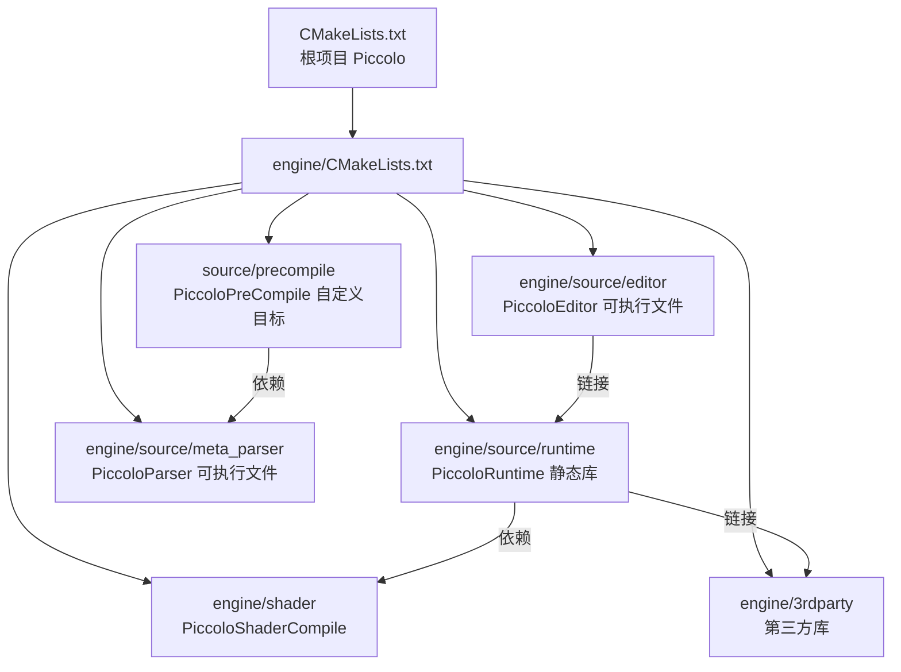

> [← 返回 Piccolo 索引]([[Notes/Piccolo/索引|Piccolo 索引]])

# 构建系统-源码解析：CMake 顶层架构与模块组织

## Why：为什么要学习 Piccolo 的构建系统？

- **问题背景**：游戏引擎由数十个模块、多种编程语言（C++、GLSL、Lua）和大量第三方库交织而成。如果没有清晰的构建编排，新成员很难理解模块边界、编译顺序和资源流向。
- **不用它的后果**：手动维护跨平台 Makefile 或 IDE 工程文件几乎不可能；Shader 代码变更无法自动触发重编译；反射生成的元数据与源码不同步会导致运行时序列化崩溃。
- **应用场景**：
  1. 将 Piccolo 迁移到新平台（如新增 Linux 发行版支持）。
  2. 在自研引擎中引入自动 Shader 编译或 C++ 反射生成。
  3. 拆分 Editor 与 Runtime，实现纯服务器/无头（headless）构建。

## What：Piccolo 的构建系统是什么？

Piccolo 采用 **CMake** 作为核心构建系统，并在其上自定义了两条代码生成管线：**Shader 编译管线**（GLSL → SPIR-V → C++ Header）和 **C++ 反射生成管线**（libclang 解析头文件 → 生成序列化/反射代码）。

整个构建系统的拓扑可以用以下模块关系概括：



## How：Piccolo 是如何组织 CMake 的？

### 1. 根目录：最小化入口

`D:/workspace/Piccolo/CMakeLists.txt` 只有 24 行，职责极其单一：

- 声明 C++17 标准；
- 禁止源码内构建（In-source build guard）；
- 设置 `PICCOLO_ROOT_DIR`、`CMAKE_INSTALL_PREFIX` 和 `BINARY_ROOT_DIR`；
- 最后直接进入 `add_subdirectory(engine)`。

> 文件：`CMakeLists.txt`，第 1~24 行

```cpp
cmake_minimum_required(VERSION 3.19 FATAL_ERROR)
project(Piccolo VERSION 0.1.0)
set(CMAKE_CXX_STANDARD 17)
set(CMAKE_CXX_STANDARD_REQUIRED ON)
set(BUILD_SHARED_LIBS OFF)
set(PICCOLO_ROOT_DIR "${CMAKE_CURRENT_SOURCE_DIR}")
set(CMAKE_INSTALL_PREFIX "${PICCOLO_ROOT_DIR}/bin")
set(BINARY_ROOT_DIR "${CMAKE_INSTALL_PREFIX}/")
add_subdirectory(engine)
```

### 2. Engine 层：四大子系统串联

`engine/CMakeLists.txt` 是构建系统的真正调度中心，依次引入：

| 顺序 | 子目录 | 编译目标 | 作用 |
|------|--------|----------|------|
| 1 | `shader/` | `PiccoloShaderCompile` | 将所有 `.glsl` 编译为 `.spv`，再嵌入为 C++ Header |
| 2 | `3rdparty/` | 多个第三方静态库 | imgui、glfw、spdlog、JoltPhysics、sol2、lua 等 |
| 3 | `source/runtime/` | `PiccoloRuntime` | 引擎核心静态库 |
| 4 | `source/editor/` | `PiccoloEditor` | 编辑器可执行程序 |
| 5 | `source/meta_parser/` | `PiccoloParser` | 基于 libclang 的反射解析器 |
| 6 | `source/precompile/precompile.cmake` | `PiccoloPreCompile` | 在编译前调用 PiccoloParser 生成反射代码 |

> 文件：`engine/CMakeLists.txt`，第 50~65 行

```cpp
set(SHADER_COMPILE_TARGET PiccoloShaderCompile)
add_subdirectory(shader)
add_subdirectory(3rdparty)
add_subdirectory(source/runtime)
add_subdirectory(source/editor)
add_subdirectory(source/meta_parser)
set(CODEGEN_TARGET "PiccoloPreCompile")
include(source/precompile/precompile.cmake)
add_dependencies(PiccoloRuntime "${CODEGEN_TARGET}")
add_dependencies("${CODEGEN_TARGET}" "PiccoloParser")
```

### 3. 关键依赖链解析

从上面的 `add_dependencies` 可以读出**构建时序约束**：

```
PiccoloEditor
    └── 链接 PiccoloRuntime
            └── 构建时依赖 PiccoloPreCompile
                        └── 构建时依赖 PiccoloParser
```

这意味着：
1. `PiccoloParser` 必须首先编译成功（它是一个独立可执行文件）。
2. 然后 `PiccoloPreCompile` 运行，调用 `PiccoloParser` 扫描头文件并生成反射/序列化代码。
3. 接着 `PiccoloRuntime` 才能编译（因为它需要预生成的代码）。
4. 最后 `PiccoloEditor` 链接 `PiccoloRuntime` 并执行 Post-Build 资源复制。

### 4. Runtime 的 include 策略

`engine/source/runtime/CMakeLists.txt` 中可以看到 Piccolo 采用了**多层 include 路径**设计：

- `engine/source`：允许 `#include "runtime/..."`
- `engine/source/runtime`：允许模块内部短路径 include
- `engine/source/runtime/function/render/include`：渲染层的公共接口目录，被上层或其他模块使用
- `engine/shader/generated/cpp`：自动生成的 Shader 字节码头文件目录

这种分层设计让**公共接口目录**与**实现目录**在物理路径上自然隔离。

## 与上下层的关系

- **上层调用者**：Editor (`PiccoloEditor`) 是唯一的顶层可执行文件目标。它通过 `target_link_libraries(${TARGET_NAME} PiccoloRuntime)` 链接整个引擎。
- **下层依赖**：
  - `PiccoloRuntime` 链接了 8 个第三方库（spdlog、glfw、imgui、Jolt、lua_static、sol2、Vulkan、json11）和 2 个内部生成的依赖（Shader Header、Precompile Codegen）。
  - `PiccoloParser` 直接依赖 LLVM/libclang，与引擎运行时完全解耦。

## 设计亮点与可迁移原理

1. **根 CMake 极简、子系统自包含**
   - 根目录只负责项目元信息和全局变量，真正的构建逻辑下沉到 `engine/CMakeLists.txt`。这种"薄根厚枝"的结构非常利于大型仓库的横向扩展。
   - **可迁移点**：自研引擎也应保持根 CMake 的极简，按模块拆分 `CMakeLists.txt`，避免一个文件膨胀到数百行。

2. **代码生成目标与编译目标显式解耦**
   - Shader 编译和 C++ 反射生成都被抽象为独立的 CMake Target（`PiccoloShaderCompile`、`PiccoloPreCompile`），通过 `add_dependencies` 显式声明时序。
   - **可迁移点**：不要试图在 `add_library` 里内联执行 `execute_process` 来做代码生成。独立的 Custom Target 更易于调试、缓存和并行构建。

3. **Runtime 公共接口目录隔离**
   - `function/render/include` 被单独 expose 为 include 路径，其他模块不应直接 include `function/render/internal/...`。
   - **可迁移点**：在自研引擎中，为每个子系统明确划定 `public/include` 和 `private/src` 边界，可以减少模块间隐式耦合。

## 关键源码片段

> 文件：`engine/CMakeLists.txt`，第 23~26 行

```cpp
if(CMAKE_CXX_COMPILER_ID STREQUAL "MSVC")
    add_compile_options("/MP")
    set_property(DIRECTORY ${CMAKE_SOURCE_DIR} PROPERTY VS_STARTUP_PROJECT PiccoloEditor)
endif()
```

MSVC 的 `/MP` 选项开启多核编译，`VS_STARTUP_PROJECT` 让 Visual Studio 打开解决方案时默认启动 Editor 项目。

## 关联阅读

- [[构建系统-源码解析：预编译与反射生成机制|预编译与反射生成机制]]
- [[构建系统-源码解析：Shader 编译流程|Shader 编译流程]]
- [[编辑器-源码解析：主循环与初始化流程|主循环与初始化流程]]

---

**索引状态**：第一轮（接口层/骨架扫描）已完成。
