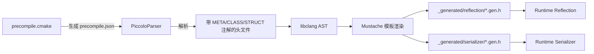

> [← 返回 Piccolo 索引]([[Notes/Piccolo/索引|Piccolo 索引]])

# 构建系统-源码解析：预编译与反射生成机制

## Why：为什么要学习 Piccolo 的反射生成机制？

- **问题背景**：C++ 原生不支持运行期反射。游戏引擎中大量的配置加载、序列化保存、编辑器属性面板都依赖"类名→字段列表→读写函数"的映射关系。手写这些映射既枯燥又极易遗漏。
- **不用它的后果**：每新增一个 Component 就要手写对应的 JSON 序列化和反序列化代码；编辑器无法自动识别新字段；Lua 绑定需要逐字段重复注册。
- **应用场景**：
  1. 为自研引擎引入零侵入的 C++ 反射方案。
  2. 理解如何利用 Clang 前端能力，在不修改编译器的情况下解析自定义注解。
  3. 设计教学引擎或工具链中的代码生成管线。

## What：Piccolo 的预编译与反射生成是什么？

Piccolo 的反射系统由**构建时生成器**（`meta_parser`）和**运行时反射库**（`runtime/core/meta`）两部分组成，中间通过自动生成的代码桥接。



## How：Piccolo 是如何实现的？

### 1. precompile.cmake：构建时的调度器

`engine/source/precompile/precompile.cmake` 定义了一个自定义目标 `PiccoloPreCompile`，它的职责是：

1. 读取模板文件 `precompile.json.in`，将其中的占位符 `@PICCOLO_RUNTIME_HEADS@` 和 `@PICCOLO_EDITOR_HEADS@` 替换为实际的运行时/编辑器头文件列表，生成 `precompile.json`。
2. 在构建阶段调用 `PiccoloParser`，传入 `precompile.json` 作为输入，告诉解析器需要扫描哪些头文件。

> 文件：`engine/source/precompile/precompile.json.in`，第 1 行

```cpp
@PICCOLO_RUNTIME_HEADS@,@PICCOLO_EDITOR_HEADS@
```

> 文件：`engine/source/precompile/precompile.cmake`，第 37~58 行

```cpp
set(PRECOMPILE_TARGET "PiccoloPreCompile")
add_custom_target(${PRECOMPILE_TARGET} ALL
    COMMAND ${CMAKE_COMMAND} -E echo "**** [Precompile] BEGIN "
    COMMAND
        ${PRECOMPILE_PARSER} "${PICCOLO_PRECOMPILE_PARAMS_PATH}"
                             "${PARSER_INPUT}"
                             "${ENGINE_ROOT_DIR}/source"
                             ${sys_include}
                             "Piccolo"
                             0
    COMMAND ${CMAKE_COMMAND} -E echo "+++ Precompile finished +++"
)
```

### 2. meta_parser：基于 libclang 的代码生成器

`PiccoloParser` 是一个独立的可执行程序，源码位于 `engine/source/meta_parser/parser/`。

#### 2.1 入口与参数

> 文件：`engine/source/meta_parser/parser/main.cpp`，第 11~40 行

```cpp
int main(int argc, char* argv[])
{
    // argv[1]: project_file_name (precompile.json)
    // argv[2]: source_include_file_name (生成的统一头文件)
    // argv[3]: include_path (项目源码根目录)
    // argv[4]: sys_include (系统头文件目录)
    // argv[5]: module_name
    // argv[6]: show_errors (0 或 1)
    MetaParser::prepare();
    result = parse(argv[1], argv[2], argv[3], argv[4], argv[5], argv[6]);
    return result;
}
```

#### 2.2 核心类 MetaParser

> 文件：`engine/source/meta_parser/parser/parser/parser.h`，第 15~56 行

```cpp
class MetaParser
{
public:
    static void prepare(void);
    int  parse(void);
    void generateFiles(void);
private:
    CXIndex           m_index;
    CXTranslationUnit m_translation_unit;
    std::unordered_map<std::string, SchemaMoudle> m_schema_modules;
    std::vector<Generator::GeneratorInterface*>   m_generators;
    // ...
};
```

`MetaParser::parse()` 的核心流程：
1. 读取 `precompile.json` 中的头文件列表；
2. 生成一个统一的 include 头文件（`parser_header.h`），内部 `#include` 所有目标头；
3. 调用 `libclang` 解析该统一头文件，得到 AST；
4. 递归遍历命名空间，把带 `annotate` 属性的 `class/struct` 提取为 `Class` 对象，按源文件分组存入 `m_schema_modules`。

#### 2.3 AST 封装层：Cursor 与 Language Types

- **`Cursor`**：对 `libclang` 的 `CXCursor` 的轻量封装，提供 `getKind()`、`getSpelling()`、`getChildren()` 等方法。
- **`CursorType`**：对 `CXType` 的封装，用于获取类型签名。
- **`Class` / `Field` / `Method`**：从 AST 节点映射出的 C++ 语言对象模型，均继承自 `TypeInfo`。

#### 2.4 元数据注解：META 宏

Piccolo 在源码中使用宏来标记需要反射的类与字段：

> 文件：`engine/source/runtime/core/meta/reflection/reflection.h`，第 13~23 行

```cpp
#if defined(__REFLECTION_PARSER__)
#define META(...) __attribute__((annotate(#__VA_ARGS__)))
#define CLASS(class_name, ...) class __attribute__((annotate(#__VA_ARGS__))) class_name
#define STRUCT(struct_name, ...) struct __attribute__((annotate(#__VA_ARGS__))) struct_name
#else
#define META(...)
#define CLASS(class_name, ...) class class_name
#define STRUCT(struct_name, ...) struct struct_name
#endif
```

这是一个**零成本抽象**设计：
- 在 `meta_parser` 中，定义了 `__REFLECTION_PARSER__`，因此 `META(...)` 展开为 Clang 的 `annotate` 属性，可被 AST 读取。
- 在正常编译时，`META(...)` 展开为空，完全不影响编译性能或二进制体积。

### 3. 代码生成：Mustache 模板驱动

`meta_parser` 使用 `mustache.hpp` 作为模板引擎，模板文件存放在 `engine/template/` 目录：

| 模板文件 | 输出 |
|----------|------|
| `commonReflectionFile.mustache` | 单文件 `.reflection.gen.h` |
| `allReflectionFile.mustache` | `all_reflection.h`（汇总） |
| `commonSerializerGenFile.mustache` | 单文件 `.serializer.gen.h` |
| `allSerializer.h.mustache` / `allSerializer.ipp.mustache` | `all_serializer.h` / `.ipp` |

生成器分为两类：
- **`ReflectionGenerator`**：为每个带反射标记的类生成注册函数，将类名、字段、方法注册到全局映射表。
- **`SerializerGenerator`**：为每个类生成 `serialize` / `deserialize` 函数实现。

### 4. 运行时反射系统

生成的反射代码最终会被编译进 `PiccoloRuntime`，运行时通过 `runtime/core/meta/reflection/reflection.h` 中的 API 访问：

> 文件：`engine/source/runtime/core/meta/reflection/reflection.h`，第 111~151 行（节选）

```cpp
class TypeMeta
{
public:
    static TypeMeta newMetaFromName(std::string type_name);
    int getFieldsList(FieldAccessor*& out_list);
    int getMethodsList(MethodAccessor*& out_list);
    FieldAccessor getFieldByName(const char* name);
    MethodAccessor getMethodByName(const char* name);
};

class FieldAccessor
{
public:
    void* get(void* instance);
    void  set(void* instance, void* value);
    const char* getFieldName() const;
};
```

运行时通过字符串类名即可获取字段访问器，实现完全动态的读写。

## 与上下层的关系

- **上层调用者**：`precompile.cmake` 是 CMake 构建流程的一部分，由 `engine/CMakeLists.txt` 通过 `add_dependencies(PiccoloRuntime PiccoloPreCompile)` 驱动。
- **下层依赖**：
  - `meta_parser` 依赖 LLVM/libclang 的头文件和库；
  - 运行时反射库不依赖任何第三方库，仅使用 STL 容器和 `std::function`；
  - 生成的代码需要被 `PiccoloRuntime` 编译和链接。

## 设计亮点与可迁移原理

1. **零成本注解宏（META / CLASS / STRUCT）**
   - 利用 `__attribute__((annotate(...)))` 和条件编译，让反射标记在解析时存在、在正式编译时消失。这比在源码中手写冗长的反射注册代码要优雅得多。
   - **可迁移点**：自研引擎若使用 Clang/LLVM 作为工具链，可以直接复用这一模式；若使用 MSVC，则需要寻找对应方案（如使用 Clang 前端做构建时代码生成，即使主编译器是 MSVC）。

2. **构建时代码生成器与运行时库解耦**
   - `meta_parser` 是一个完全独立的可执行程序，不链接引擎运行时。这种解耦让代码生成器可以任意使用重型依赖（如 libclang），而不污染引擎运行时的体积和编译时间。
   - **可迁移点**：在自研引擎中，任何代码生成工具（Shader 变体生成、协议代码生成、UI 绑定生成）都应作为独立工具存在，通过 CMake Custom Target 调用。

3. **模板驱动生成，而非硬编码字符串拼接**
   - 使用 Mustache 模板将生成逻辑与输出格式分离。当需要改变生成代码风格（如从 C++11 迁移到 C++20）时，只需修改模板文件，无需改动解析器。
   - **可迁移点**：小型引擎的代码生成器很容易退化为大量 `std::string` 拼接，应尽早引入模板引擎隔离变化点。

## 关键源码片段

> 文件：`engine/source/runtime/core/meta/reflection/reflection.h`，第 25~27 行

```cpp
#define REFLECTION_BODY(class_name) \
    friend class Reflection::TypeFieldReflectionOparator::Type##class_name##Operator; \
    friend class Serializer;
```

每个需要反射的类都会在类体内放置 `REFLECTION_BODY(ClassName)`，这样生成的 `TypeXxxOperator` 和 `Serializer` 就能访问私有字段。

## 关联阅读

- [[构建系统-源码解析：CMake 顶层架构与模块组织|CMake 顶层架构与模块组织]]
- [[核心层-源码解析：反射系统的运行时实现|反射系统的运行时实现]]
- [[核心层-源码解析：序列化器设计|序列化器设计]]

---

**索引状态**：第一轮（接口层/骨架扫描）已完成。
