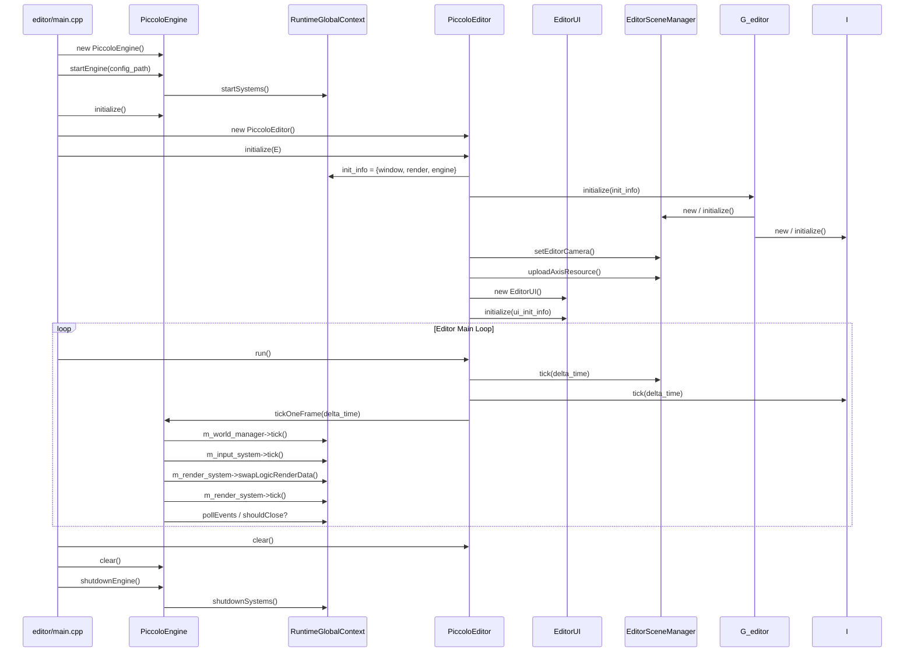

> [← 返回 Piccolo 索引]([[Notes/Piccolo/索引|Piccolo 索引]])

# 编辑器-源码解析：主循环与初始化流程

## Why：为什么要学习 Piccolo 的编辑器启动链路？

- **问题背景**：游戏引擎通常采用"编辑器 + 运行时"的双层架构。编辑器负责场景编辑、资源浏览和属性调试；运行时负责逻辑更新和渲染输出。理解两者的启动顺序和交互边界，是把握引擎全貌的关键。
- **不用它的后果**：在自研引擎中，很容易把编辑器逻辑和运行时逻辑混为一谈，导致循环耦合、资源生命周期混乱、头文件互相穿透。
- **应用场景**：
  1. 剥离或复用 Piccolo 的 Runtime，实现纯游戏模式（无编辑器窗口）。
  2. 设计自研引擎的 Editor-Runtime 边界协议。
  3. 理解单线程引擎的 Logic-Render 数据交换模式。

## What：Piccolo 的编辑器层是什么？

Piccolo 采用 **Editor 包裹 Runtime** 的双层架构：

- **`PiccoloEngine`**（运行时核心）：负责全局系统初始化、主循环驱动、逻辑帧和渲染帧调度。
- **`PiccoloEditor`**（编辑器层）：在 Engine 之上构建，负责 UI 渲染、场景管理、输入处理和编辑命令分发。

两者在 `editor/main.cpp` 中依次创建，但生命周期控制权在 Editor 手中。



## How：Piccolo 是如何实现的？

### 1. 入口：editor/main.cpp

> 文件：`engine/source/editor/source/main.cpp`，第 15~35 行

```cpp
int main(int argc, char** argv)
{
    std::filesystem::path executable_path(argv[0]);
    std::filesystem::path config_file_path = executable_path.parent_path() / "PiccoloEditor.ini";

    Piccolo::PiccoloEngine* engine = new Piccolo::PiccoloEngine();
    engine->startEngine(config_file_path.generic_string());
    engine->initialize();

    Piccolo::PiccoloEditor* editor = new Piccolo::PiccoloEditor();
    editor->initialize(engine);

    editor->run();
    editor->clear();

    engine->clear();
    engine->shutdownEngine();

    return 0;
}
```

这段代码揭示了三条关键信息：
1. **Engine 先于 Editor 启动**：`startEngine()` 会拉起所有运行时全局系统（窗口、渲染、物理、世界管理等）。
2. **Editor 持有 Engine 指针**：`editor->initialize(engine)` 把 Engine 注入编辑器，供后续调用。
3. **Editor 控制主循环**：`editor->run()` 内部是 while 循环，Engine 的 `tickOneFrame()` 被 Editor 每帧调用。

### 2. PiccoloEngine 的生命周期

> 文件：`engine/source/runtime/engine.h`，第 14~52 行

```cpp
class PiccoloEngine
{
public:
    void startEngine(const std::string& config_file_path);
    void shutdownEngine();
    void initialize();
    void clear();

    bool tickOneFrame(float delta_time);
    float calculateDeltaTime();
};
```

> 文件：`engine/source/runtime/engine.cpp`，第 20~36 行

```cpp
void PiccoloEngine::startEngine(const std::string& config_file_path)
{
    Reflection::TypeMetaRegister::metaRegister();
    g_runtime_global_context.startSystems(config_file_path);
    LOG_INFO("engine start");
}

void PiccoloEngine::shutdownEngine()
{
    LOG_INFO("engine shutdown");
    g_runtime_global_context.shutdownSystems();
    Reflection::TypeMetaRegister::metaUnregister();
}
```

`startEngine()` 只做两件事：
1. **注册反射系统**：`TypeMetaRegister::metaRegister()` 将所有生成的反射元数据注册到全局映射表。
2. **启动全局系统**：`g_runtime_global_context.startSystems(config_file_path)` 按顺序创建并初始化日志、文件、配置、资源、窗口、渲染、物理、世界管理等子系统。

### 3. PiccoloEditor 的初始化

> 文件：`engine/source/editor/source/editor.cpp`，第 28~47 行

```cpp
void PiccoloEditor::initialize(PiccoloEngine* engine_runtime)
{
    assert(engine_runtime);

    g_is_editor_mode = true;
    m_engine_runtime = engine_runtime;

    EditorGlobalContextInitInfo init_info = {
        g_runtime_global_context.m_window_system.get(),
        g_runtime_global_context.m_render_system.get(),
        engine_runtime};
    g_editor_global_context.initialize(init_info);

    g_editor_global_context.m_scene_manager->setEditorCamera(
        g_runtime_global_context.m_render_system->getRenderCamera());
    g_editor_global_context.m_scene_manager->uploadAxisResource();

    m_editor_ui = std::make_shared<EditorUI>();
    WindowUIInitInfo ui_init_info = {
        g_runtime_global_context.m_window_system,
        g_runtime_global_context.m_render_system};
    m_editor_ui->initialize(ui_init_info);
}
```

Editor 初始化流程：
1. 设置全局标志 `g_is_editor_mode = true`，运行时系统会据此调整行为（如启用 Editor Camera）。
2. 构造 `EditorGlobalContextInitInfo`，将运行时的 `WindowSystem`、`RenderSystem` 和 `PiccoloEngine` 指针传入。
3. `g_editor_global_context.initialize()` 创建 `EditorSceneManager` 和 `EditorInputManager`。
4. 将运行时 RenderCamera 同步到 EditorSceneManager，并上传坐标轴（Axis）调试资源。
5. 创建 `EditorUI` 并初始化，绑定到同一个窗口和渲染系统上。

### 4. 主循环：Editor 驱动 Engine

> 文件：`engine/source/editor/source/editor.cpp`，第 51~64 行

```cpp
void PiccoloEditor::run()
{
    assert(m_engine_runtime);
    assert(m_editor_ui);
    float delta_time;
    while (true)
    {
        delta_time = m_engine_runtime->calculateDeltaTime();
        g_editor_global_context.m_scene_manager->tick(delta_time);
        g_editor_global_context.m_input_manager->tick(delta_time);
        if (!m_engine_runtime->tickOneFrame(delta_time))
            return;
    }
}
```

Editor 的主循环每帧执行：
1. **计算 Δt**：`calculateDeltaTime()` 基于 `std::chrono::steady_clock` 计算距上一帧的时间间隔。
2. **编辑器场景 tick**：处理 Gizmo、相机控制、对象选择等编辑逻辑。
3. **编辑器输入 tick**：处理键盘/鼠标命令（如 W/A/S/D 移动相机、T/R/C 切换变换模式）。
4. **引擎 tick**：调用 `tickOneFrame()`，执行游戏逻辑和渲染。

### 5. Engine 的单帧调度

> 文件：`engine/source/runtime/engine.cpp`，第 68~103 行

```cpp
bool PiccoloEngine::tickOneFrame(float delta_time)
{
    logicalTick(delta_time);
    calculateFPS(delta_time);

    // single thread
    // exchange data between logic and render contexts
    g_runtime_global_context.m_render_system->swapLogicRenderData();

    rendererTick(delta_time);

    g_runtime_global_context.m_window_system->pollEvents();
    g_runtime_global_context.m_window_system->setTitle(
        std::string("Piccolo - " + std::to_string(getFPS()) + " FPS").c_str());

    const bool should_window_close = g_runtime_global_context.m_window_system->shouldClose();
    return !should_window_close;
}

void PiccoloEngine::logicalTick(float delta_time)
{
    g_runtime_global_context.m_world_manager->tick(delta_time);
    g_runtime_global_context.m_input_system->tick();
}

bool PiccoloEngine::rendererTick(float delta_time)
{
    g_runtime_global_context.m_render_system->tick(delta_time);
    return true;
}
```

在单线程模式下，一帧的时序是：

```
Logic Tick (World + Input)
    ↓
Swap Logic/Render Data
    ↓
Render Tick
    ↓
Poll Window Events
    ↓
Check Window Close
```

`swapLogicRenderData()` 是逻辑层与渲染层的数据交换点。逻辑帧产生的渲染指令/变换数据在这里提交给渲染线程（或渲染上下文），然后渲染系统开始绘制。

## 与上下层的关系

- **上层调用者**：`PiccoloEditor` 是用户直接交互的入口，它通过 `m_engine_runtime->tickOneFrame()` 驱动整个引擎运转。
- **下层依赖**：
  - `PiccoloEngine` 依赖 `RuntimeGlobalContext` 中的所有系统（WorldManager、RenderSystem、WindowSystem 等）；
  - `PiccoloEditor` 依赖 `EditorGlobalContext`（SceneManager、InputManager）和 `EditorUI`；
  - Editor 层只链接 `PiccoloRuntime`，不直接操作 Vulkan 或物理引擎。

## 设计亮点与可迁移原理

1. **Engine 与 Editor 的生命周期分离**
   - `PiccoloEngine` 不知道自己被 Editor 使用。它的 `run()` 方法可以独立驱动一个纯游戏窗口；Editor 只是在外层用自己的循环替代了 `engine->run()`。这种设计让 Engine 完全不依赖 Editor 代码。
   - **可迁移点**：自研引擎应保证 Runtime 库不 `#include` 任何 Editor 头文件。Editor 可以依赖 Runtime，但反向依赖必须为零。

2. **单线程 Logic-Render 交替模型**
   - Piccolo 目前采用单线程模式，通过 `swapLogicRenderData()` 明确划分逻辑帧和渲染帧的边界。这虽然限制了 CPU 利用率，但极大地降低了数据竞争和同步复杂度，非常适合教学引擎。
   - **可迁移点**：小型引擎起步阶段不必急于引入多线程渲染。先通过一个 `swap` 函数明确分离逻辑与渲染数据，是未来升级为双/三缓冲渲染线程的最小前提。

3. **全局上下文（GlobalContext）作为系统聚合器**
   - `g_runtime_global_context` 以 `std::shared_ptr` 持有所有子系统，`startSystems()` 和 `shutdownSystems()` 统一控制创建/销毁顺序。这比让每个系统都做成单例要清晰得多。
   - **可迁移点**：用显式的 Context 结构体聚合全局系统，而不是到处使用 `Singleton::getInstance()`。Context 的初始化顺序一目了然，也便于单元测试时注入 Mock 系统。

## 关键源码片段

> 文件：`engine/source/runtime/engine.cpp`，第 68~91 行

```cpp
bool PiccoloEngine::tickOneFrame(float delta_time)
{
    logicalTick(delta_time);
    calculateFPS(delta_time);

    // single thread
    // exchange data between logic and render contexts
    g_runtime_global_context.m_render_system->swapLogicRenderData();

    rendererTick(delta_time);

    g_runtime_global_context.m_window_system->pollEvents();

    const bool should_window_close = g_runtime_global_context.m_window_system->shouldClose();
    return !should_window_close;
}
```

## 关联阅读

- [[构建系统-源码解析：CMake 顶层架构与模块组织|CMake 顶层架构与模块组织]]
- [[编辑器-源码解析：UI 系统与 ImGui 集成|UI 系统与 ImGui 集成]]
- [[编辑器-源码解析：场景管理与视口交互|场景管理与视口交互]]
- [[核心层-源码解析：平台抽象层|平台抽象层]]

---

**索引状态**：第一轮（接口层/骨架扫描）已完成。
