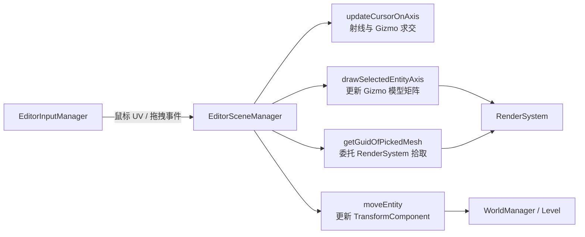

> [[Notes/Piccolo/索引|← 返回 Piccolo 索引]]

# 编辑器-源码解析：场景管理与视口交互

## Why：为什么要学习 Piccolo 的场景管理？

- **问题背景**：编辑器中 80% 的交互都集中在"选择对象 → 显示 Gizmo → 拖拽变换"这个循环上。如果这套机制设计混乱，后续的关卡编辑、资源摆放、动画调试都会举步维艰。
- **不用它的后果**：自研编辑器若直接集成第三方 Gizmo 库（如 ImGuizmo），虽然能快速出效果，但会隐藏坐标系变换、射线检测、视口同步等核心原理，长期来看不利于定制扩展。
- **应用场景**：
  1. 为自研引擎手写一套轻量级 Gizmo 系统。
  2. 理解屏幕空间鼠标 UV 与世界空间射线之间的映射关系。
  3. 设计编辑器的对象拾取（Pick）和变换操作管线。

## What：Piccolo 的编辑器场景管理是什么？

`EditorSceneManager` 是 Piccolo 编辑器中负责**场景交互**的核心类。它不提供完整的场景图管理（那是 `WorldManager` 的职责），而是专注于编辑态的视口交互：

- **对象选择**：维护当前选中的 `GObjectID`，并同步到 Inspector 面板。
- **Gizmo 显示**：在选中对象的位置上绘制平移/旋转/缩放坐标轴。
- **射线求交**：将鼠标位置转换为世界空间射线，检测当前悬停在 Gizmo 的哪个轴上。
- **变换操作**：根据鼠标拖拽，实时更新选中对象的 `TransformComponent`（位置、旋转、缩放）。
- **对象拾取**：将鼠标 UV 传给渲染系统，返回拾取到的网格 GUID。



## How：Piccolo 是如何实现的？

### 1. 对象选择状态管理

> 文件：`engine/source/editor/include/editor_scene_manager.h`，第 67~75 行

```cpp
class EditorSceneManager
{
public:
    void onGObjectSelected(GObjectID selected_gobject_id);
    std::weak_ptr<GObject> getSelectedGObject() const;
    // ...
private:
    GObjectID m_selected_gobject_id{ k_invalid_gobject_id };
    Matrix4x4 m_selected_object_matrix{ Matrix4x4::IDENTITY };
    EditorAxisMode m_axis_mode{ EditorAxisMode::TranslateMode };
};
```

当用户在 `World Objects` 面板点击对象，或执行 Pick 操作时，`onGObjectSelected()` 会被调用。它会：
1. 更新 `m_selected_gobject_id`；
2. 缓存选中对象的当前变换矩阵（用于 Gizmo 对齐和撤销的基准）；
3. 调用 `drawSelectedEntityAxis()` 通知渲染系统显示 Gizmo。

### 2. Gizmo 资源的注册与上传

> 文件：`engine/source/editor/source/editor_scene_manager.cpp`，第 539~572 行

```cpp
void EditorSceneManager::uploadAxisResource()
{
    auto& instance_id_allocator   = g_editor_global_context.m_render_system->getGOInstanceIdAllocator();
    auto& mesh_asset_id_allocator = g_editor_global_context.m_render_system->getMeshAssetIdAllocator();

    // 平移轴
    {
        GameObjectPartId axis_instance_id = {0xFFAA, 0xFFAA};
        MeshSourceDesc   mesh_source_desc = {"%%translation_axis%%"};
        m_translation_axis.m_instance_id   = instance_id_allocator.allocGuid(axis_instance_id);
        m_translation_axis.m_mesh_asset_id = mesh_asset_id_allocator.allocGuid(mesh_source_desc);
    }
    // 旋转轴
    {
        GameObjectPartId axis_instance_id = {0xFFBB, 0xFFBB};
        MeshSourceDesc   mesh_source_desc = {"%%rotate_axis%%"};
        m_rotation_axis.m_instance_id   = instance_id_allocator.allocGuid(axis_instance_id);
        m_rotation_axis.m_mesh_asset_id = mesh_asset_id_allocator.allocGuid(mesh_source_desc);
    }
    // 缩放轴
    {
        GameObjectPartId axis_instance_id = {0xFFCC, 0xFFCC};
        MeshSourceDesc   mesh_source_desc = {"%%scale_axis%%"};
        m_scale_aixs.m_instance_id   = instance_id_allocator.allocGuid(axis_instance_id);
        m_scale_aixs.m_mesh_asset_id = mesh_asset_id_allocator.allocGuid(mesh_source_desc);
    }

    g_editor_global_context.m_render_system->createAxis(
        {m_translation_axis, m_rotation_axis, m_scale_aixs},
        {m_translation_axis.m_mesh_data, m_rotation_axis.m_mesh_data, m_scale_aixs.m_mesh_data});
}
```

`uploadAxisResource()` 在编辑器初始化时被调用一次。它向 `RenderSystem` 注册了三种 Gizmo 网格资源，并分配了特殊的 Instance ID 和 Mesh Asset ID（以 `0xFF` 开头，避免与普通游戏对象冲突）。`RenderSystem` 内部会根据这些 ID 生成对应的 `RenderEntity`，并在需要时绘制。

### 3. Gizmo 的位置同步

> 文件：`engine/source/editor/source/editor_scene_manager.cpp`，第 209~240 行

```cpp
void EditorSceneManager::drawSelectedEntityAxis()
{
    std::shared_ptr<GObject> selected_object = getSelectedGObject().lock();

    if (g_is_editor_mode && selected_object != nullptr)
    {
        const TransformComponent* transform_component = selected_gobject->tryGetComponentConst(TransformComponent);

        Vector3    scale;
        Quaternion rotation;
        Vector3    translation;
        transform_component->getMatrix().decomposition(translation, scale, rotation);
        Matrix4x4 translation_matrix = Matrix4x4::getTrans(translation);
        Matrix4x4 scale_matrix       = Matrix4x4::buildScaleMatrix(1.0f, 1.0f, 1.0f);
        Matrix4x4 axis_model_matrix  = translation_matrix * scale_matrix;
        RenderEntity* selected_aixs  = getAxisMeshByType(m_axis_mode);

        if (m_axis_mode == EditorAxisMode::TranslateMode || m_axis_mode == EditorAxisMode::RotateMode)
        {
            selected_aixs->m_model_matrix = axis_model_matrix;
        }
        else if (m_axis_mode == EditorAxisMode::ScaleMode)
        {
            selected_aixs->m_model_matrix = axis_model_matrix * Matrix4x4(rotation);
        }

        g_editor_global_context.m_render_system->setVisibleAxis(*selected_aixs);
    }
    else
    {
        g_editor_global_context.m_render_system->setVisibleAxis(std::nullopt);
    }
}
```

Gizmo 的模型矩阵只包含**平移**（对于平移/旋转模式）或**平移+旋转**（对于缩放模式），不包含选中对象的实际缩放。这保证了 Gizmo 本身不会因为对象被压扁或放大而变形，是编辑器 UX 的标准做法。

### 4. 鼠标射线与 Gizmo 的求交

> 文件：`engine/source/editor/source/editor_scene_manager.cpp`，第 46~187 行（节选）

`updateCursorOnAxis()` 是 Gizmo 交互的核心算法，输入是鼠标在视口内的 UV 坐标和窗口尺寸，输出是高亮轴的索引（0=X, 1=Y, 2=Z, 3=无）。

核心步骤：

1. **屏幕 UV → 世界射线**：
```cpp
float window_forward = game_engine_window_size.y / 2.0f / Math::tan(Math::degreesToRadians(camera_fov) / 2.0f);
Vector2 screen_center_uv = Vector2(cursor_uv.x, 1 - cursor_uv.y) - Vector2(0.5, 0.5);
Vector3 world_ray_dir =
    camera_forward * window_forward +
    camera_right * (float)game_engine_window_size.x * screen_center_uv.x +
    camera_up * (float)game_engine_window_size.y * screen_center_uv.y;
```

2. **世界射线 → Gizmo 局部空间**：
```cpp
Vector4 local_ray_origin = model_matrix.inverse() * Vector4(camera_position, 1.0f);
Quaternion inversed_rotation = model_rotation.inverse();
Vector3 local_ray_dir = inversed_rotation * world_ray_dir;
```

3. **与三个坐标平面对求交**：分别与 YOZ、XOZ、XOY 平面求交，得到三个交点。

4. **轴命中判断（以平移模式为例）**：
   - 先判断射线是否近平面（`cos_alpha <= 0.15`，即视角与法线夹角约 80°~100°），如果是，则检查交点是否落在某个轴的邻近矩形区域内；
   - 若未命中，再检查交点是否落在轴的圆柱形邻域内（距离阈值 `DIST_THRESHOLD = 0.6f`）。

5. **旋转模式**：检查交点到原点的距离是否接近 1（即单位圆环），阈值 `DIST_THRESHOLD = 0.2f`。

### 5. 对象变换：鼠标拖拽驱动 Transform 更新

> 文件：`engine/source/editor/source/editor_scene_manager.cpp`，第 301~537 节（节选）

`moveEntity()` 接收鼠标新旧位置、引擎窗口位置和尺寸、当前高亮轴索引、以及操作前的模型矩阵，然后分三种模式计算新的 `TransformComponent`：

#### 平移模式
将鼠标在屏幕空间的位移投影到选中轴的裁剪空间方向上，再乘以角度速度系数，得到世界空间的移动向量：
```cpp
Vector3 move_vector = {0, 0, 0};
if (cursor_on_axis == 0) move_vector.x = delta_mouse_move_uv.dotProduct(axis_x_direction_uv) * angularVelocity;
// ...
transform_component->setPosition(new_translation);
```

#### 旋转模式
利用鼠标在裁剪空间中相对对象中心的二维向量叉积判断旋转方向，结合位移大小计算旋转弧度，再构建四元数：
```cpp
float move_direction = last_move_vector.x * new_move_vector.y - new_move_vector.x * last_move_vector.y;
if (move_direction < 0) move_radian = -move_radian;
Quaternion move_rot;
move_rot.fromAngleAxis(Radian(move_radian), axis_of_rotation);
// ...
transform_component->setRotation(new_rotation);
```

#### 缩放模式
根据鼠标位移与轴方向的点积正负，决定缩放增量方向，步长固定为 `0.01f`：
```cpp
Vector3 delta_scale_vector = {0, 0, 0};
if (cursor_on_axis == 0) delta_scale_vector.x = 0.01f;
if (delta_mouse_move_uv.dotProduct(axis_x_direction_uv) < 0) delta_scale_vector = -delta_scale_vector;
new_model_scale = model_scale + delta_scale_vector;
// ...
transform_component->setScale(new_scale);
```

### 6. 对象拾取（Pick）

> 文件：`engine/source/editor/source/editor_scene_manager.cpp`，第 574~577 行

```cpp
size_t EditorSceneManager::getGuidOfPickedMesh(const Vector2& picked_uv) const
{
    return g_editor_global_context.m_render_system->getGuidOfPickedMesh(picked_uv);
}
```

Piccolo 的 Pick 逻辑没有自己做射线与场景三角形求交，而是**委托给 RenderSystem**。渲染系统会在独立的 Pick Pass 中，以鼠标 UV 为中心渲染一个 1x1（或极小）的像素区域，读取该像素对应的物体 ID。这是一种典型的 GPU-based Picking 方案，比 CPU 端做射线求交更高效、更精确。

## 与上下层的关系

- **上层调用者**：`EditorInputManager` 在鼠标移动/点击/拖拽时调用 `EditorSceneManager` 的 `updateCursorOnAxis()`、`moveEntity()`、`onGObjectSelected()`；`EditorUI` 的 `World Objects` 面板也会直接调用 `onGObjectSelected()`。
- **下层依赖**：
  - `TransformComponent`：读取和修改选中对象的位置、旋转、缩放；
  - `RenderSystem`：上传/显示 Gizmo 资源，执行 GPU Picking；
  - `WorldManager / Level`：通过 `GObjectID` 查找实际的游戏对象。

## 设计亮点与可迁移原理

1. **纯数学实现 Gizmo，零第三方依赖**
   - Piccolo 没有引入 ImGuizmo 或其他 Gizmo 库，而是自己实现了射线-平面求交、轴命中检测、屏幕空间到局部空间的转换。这套代码虽然冗长，但完整展示了编辑器的核心数学原理。
   - **可迁移点**：对于学习目的和小型引擎，手写 Gizmo 比集成第三方库更有价值。它能强迫你理解视图矩阵、投影矩阵、NDC 到屏幕空间的映射关系。

2. **Gizmo 模型矩阵与对象缩放解耦**
   - `drawSelectedEntityAxis()` 在构建 Gizmo 模型矩阵时刻意排除了对象的原始缩放，只保留了平移（和旋转）。这保证了无论对象被缩放到多大，Gizmo 始终保持统一大小，是编辑器可用性的关键细节。
   - **可迁移点**：自研编辑器的 Gizmo 必须独立于被操作对象的变换，否则选中一个微小或巨大的对象时，Gizmo 会不可见或充满屏幕。

3. **GPU-based Picking 替代 CPU 射线求交**
   - 对象拾取完全委托给 `RenderSystem`，利用 GPU 渲染一个 Pick Pass 来读取像素级对象 ID。这种方式避免了在 CPU 端维护复杂的场景 BVH 和三角形相交测试。
   - **可迁移点**：对于网格数量不多或教学用途的引擎，GPU Picking 是更轻量的选择。但要注意它需要额外的渲染通道和 GPU-CPU 回读（readback）机制。

## 关键源码片段

> 文件：`engine/source/editor/source/editor_scene_manager.cpp`，第 72~86 行

```cpp
Vector4 local_ray_origin = model_matrix.inverse() * Vector4(camera_position, 1.0f);
Vector3 local_ray_origin_xyz = Vector3(local_ray_origin.x, local_ray_origin.y, local_ray_origin.z);
Quaternion inversed_rotation = model_rotation.inverse();
inversed_rotation.normalise();
Vector3 local_ray_dir = inversed_rotation * world_ray_dir;
```

这是将世界空间射线转换到 Gizmo 局部空间的核心代码，只有在这个局部空间下，才能用简单的平面/圆柱/圆环距离测试判断轴命中。

## 关联阅读

- [[编辑器-源码解析：主循环与初始化流程|主循环与初始化流程]]
- [[编辑器-源码解析：UI 系统与 ImGui 集成|UI 系统与 ImGui 集成]]
- [[框架层-源码解析：Transform 与 Camera 组件|Transform 与 Camera 组件]]
- [[渲染层-源码解析：主相机 Pass 与光照|主相机 Pass 与光照]]

---

**索引状态**：第一轮（接口层/骨架扫描）已完成。
