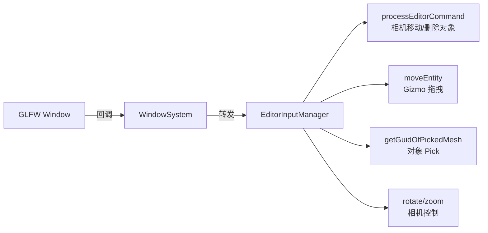

> [[Notes/Piccolo/索引|← 返回 Piccolo 索引]]

# 编辑器-源码解析：输入管理与文件服务

## Why：为什么要学习 Piccolo 的输入管理与文件服务？

- **问题背景**：编辑器中的输入来源复杂：键盘控制相机、鼠标拖拽 Gizmo、滚轮缩放视口、左键点击 Pick 对象。如果输入分发逻辑混乱，很容易造成编辑器和运行时输入互相覆盖、UI 控件与视口操作冲突。
- **不用它的后果**：直接在 GLFW 回调里写大量业务逻辑，导致代码耦合、测试困难；文件浏览功能重复造轮子，无法与项目的资产目录结构对齐。
- **应用场景**：
  1. 设计自研引擎的编辑器输入分发管线。
  2. 理解 GLFW 回调如何与 ImGui 的输入处理共存。
  3. 实现一个轻量级的项目内资产浏览器。

## What：Piccolo 的编辑器输入管理与文件服务是什么？

`EditorInputManager` 是编辑器层与 `WindowSystem`（GLFW）之间的输入桥接器。它注册了一系列 GLFW 回调，将原始输入事件转换为高层编辑命令（如相机移动、Gizmo 拖拽、对象 Pick）。

`EditorFileService` 是一个极简的文件树构建器，负责扫描 `asset/` 目录，生成可供 ImGui 渲染的树形结构。



## How：Piccolo 是如何实现的？

### 1. 输入回调的注册

> 文件：`engine/source/editor/source/editor_input_manager.cpp`，第 23~42 行

```cpp
void EditorInputManager::registerInput()
{
    g_editor_global_context.m_window_system->registerOnResetFunc(
        std::bind(&EditorInputManager::onReset, this));
    g_editor_global_context.m_window_system->registerOnCursorPosFunc(
        std::bind(&EditorInputManager::onCursorPos, this, _1, _2));
    g_editor_global_context.m_window_system->registerOnCursorEnterFunc(
        std::bind(&EditorInputManager::onCursorEnter, this, _1));
    g_editor_global_context.m_window_system->registerOnScrollFunc(
        std::bind(&EditorInputManager::onScroll, this, _1, _2));
    g_editor_global_context.m_window_system->registerOnMouseButtonFunc(
        std::bind(&EditorInputManager::onMouseButtonClicked, this, _1, _2));
    g_editor_global_context.m_window_system->registerOnWindowCloseFunc(
        std::bind(&EditorInputManager::onWindowClosed, this));
    g_editor_global_context.m_window_system->registerOnKeyFunc(
        std::bind(&EditorInputManager::onKey, this, _1, _2, _3, _4));
}
```

`WindowSystem` 封装了 GLFW 的所有回调接口。`EditorInputManager` 在初始化时将自己的成员函数注册进去。这种**委托模式**让编辑器层不必直接依赖 GLFW 头文件，也便于运行时替换底层窗口库。

### 2. 编辑命令位掩码

> 文件：`engine/source/editor/include/editor_input_manager.h`，第 13~26 行

```cpp
enum class EditorCommand : unsigned int
{
    camera_left      = 1 << 0,  // A
    camera_back      = 1 << 1,  // S
    camera_foward    = 1 << 2,  // W
    camera_right     = 1 << 3,  // D
    camera_up        = 1 << 4,  // Q
    camera_down      = 1 << 5,  // E
    translation_mode = 1 << 6,  // T
    rotation_mode    = 1 << 7,  // R
    scale_mode       = 1 << 8,  // C
    exit             = 1 << 9,  // Esc
    delete_object    = 1 << 10, // Delete
};
```

键盘事件不直接触发行为，而是修改 `unsigned int m_editor_command` 这个位掩码。在 `processEditorCommand()` 中统一读取并执行：

> 文件：`engine/source/editor/source/editor_input_manager.cpp`，第 53~90 行

```cpp
void EditorInputManager::processEditorCommand()
{
    float camera_speed = m_camera_speed;
    std::shared_ptr editor_camera = g_editor_global_context.m_scene_manager->getEditorCamera();
    Quaternion camera_rotate = editor_camera->rotation().inverse();
    Vector3 camera_relative_pos(0, 0, 0);

    if ((unsigned int)EditorCommand::camera_foward & m_editor_command)
        camera_relative_pos += camera_rotate * Vector3 {0, camera_speed, 0};
    if ((unsigned int)EditorCommand::camera_back & m_editor_command)
        camera_relative_pos += camera_rotate * Vector3 {0, -camera_speed, 0};
    // ... W/A/S/D/Q/E 同理
    if ((unsigned int)EditorCommand::delete_object & m_editor_command)
        g_editor_global_context.m_scene_manager->onDeleteSelectedGObject();

    editor_camera->move(camera_relative_pos);
}
```

位掩码设计的好处：
- **支持组合按键**：可以同时按住 W 和 A 实现斜向移动；
- **帧率无关**：按键状态在 `tick()` 中每帧读取，与 GLFW 回调触发频率解耦；
- **易于扩展**：新增命令只需增加一个枚举位，无需改动命令处理框架。

### 3. 鼠标移动与视口边界判定

> 文件：`engine/source/editor/source/editor_input_manager.cpp`，第 188~231 行

```cpp
void EditorInputManager::onCursorPos(double xpos, double ypos)
{
    if (!g_is_editor_mode) return;

    float angularVelocity = 180.0f / Math::max(m_engine_window_size.x, m_engine_window_size.y);
    if (m_mouse_x >= 0.0f && m_mouse_y >= 0.0f)
    {
        if (g_editor_global_context.m_window_system->isMouseButtonDown(GLFW_MOUSE_BUTTON_RIGHT))
        {
            glfwSetInputMode(..., GLFW_CURSOR, GLFW_CURSOR_DISABLED);
            g_editor_global_context.m_scene_manager->getEditorCamera()->rotate(
                Vector2(ypos - m_mouse_y, xpos - m_mouse_x) * angularVelocity);
        }
        else if (g_editor_global_context.m_window_system->isMouseButtonDown(GLFW_MOUSE_BUTTON_LEFT))
        {
            g_editor_global_context.m_scene_manager->moveEntity(
                xpos, ypos, m_mouse_x, m_mouse_y,
                m_engine_window_pos, m_engine_window_size,
                m_cursor_on_axis,
                g_editor_global_context.m_scene_manager->getSelectedObjectMatrix());
        }
        else
        {
            glfwSetInputMode(..., GLFW_CURSOR, GLFW_CURSOR_NORMAL);
            if (isCursorInRect(m_engine_window_pos, m_engine_window_size))
            {
                Vector2 cursor_uv = Vector2(
                    (m_mouse_x - m_engine_window_pos.x) / m_engine_window_size.x,
                    (m_mouse_y - m_engine_window_pos.y) / m_engine_window_size.y);
                updateCursorOnAxis(cursor_uv);
            }
        }
    }
    m_mouse_x = xpos;
    m_mouse_y = ypos;
}
```

`onCursorPos` 根据鼠标按键状态执行三种截然不同的操作：
	1. **右键按住**：隐藏鼠标光标，按鼠标位移旋转 Editor Camera；
1. **左键按住**：调用 `EditorSceneManager::moveEntity()` 进行 Gizmo 拖拽变换；
2. **无按键**：如果在 `Game Engine` 窗口内，更新 Gizmo 轴高亮状态。

这里有一个关键细节：**`m_engine_window_pos` 和 `m_engine_window_size` 由 `EditorUI` 的 `showEditorGameWindow()` 实时同步**。输入管理器与 UI 面板通过这两个变量精确共享视口边界。

### 4. 滚轮缩放与相机速度调节

> 文件：`engine/source/editor/source/editor_input_manager.cpp`，第 241~267 行

```cpp
void EditorInputManager::onScroll(double xoffset, double yoffset)
{
    if (!g_is_editor_mode) return;
    if (isCursorInRect(m_engine_window_pos, m_engine_window_size))
    {
        if (g_editor_global_context.m_window_system->isMouseButtonDown(GLFW_MOUSE_BUTTON_RIGHT))
        {
            if (yoffset > 0) m_camera_speed *= 1.2f;
            else             m_camera_speed *= 0.8f;
        }
        else
        {
            g_editor_global_context.m_scene_manager->getEditorCamera()->zoom(
                (float)yoffset * 2.0f);
        }
    }
}
```

滚轮行为也做了上下文感知：
- 若同时按住右键，滚轮调节相机飞行速度；
- 若未按右键，滚轮控制相机 FOV 缩放（Zoom）。

### 5. 对象 Pick：左键点击

> 文件：`engine/source/editor/source/editor_input_manager.cpp`，第 269~292 行

```cpp
void EditorInputManager::onMouseButtonClicked(int key, int action)
{
    if (!g_is_editor_mode) return;
    if (m_cursor_on_axis != 3) return; // 如果鼠标悬停在 Gizmo 轴上，不触发 Pick

    if (isCursorInRect(m_engine_window_pos, m_engine_window_size))
    {
        if (key == GLFW_MOUSE_BUTTON_LEFT)
        {
            Vector2 picked_uv(
                (m_mouse_x - m_engine_window_pos.x) / m_engine_window_size.x,
                (m_mouse_y - m_engine_window_pos.y) / m_engine_window_size.y);
            size_t select_mesh_id = g_editor_global_context.m_scene_manager->getGuidOfPickedMesh(picked_uv);
            size_t gobject_id = g_editor_global_context.m_render_system->getGObjectIDByMeshID(select_mesh_id);
            g_editor_global_context.m_scene_manager->onGObjectSelected(gobject_id);
        }
    }
}
```

左键点击的逻辑非常清晰：先检查是否在 Gizmo 轴上（`m_cursor_on_axis != 3` 时优先处理 Gizmo 操作），再计算鼠标 UV，交给 `RenderSystem` 做 GPU Picking，最后通过 `GObjectID` 选中对象。

### 6. 文件服务：轻量级资产浏览器

> 文件：`engine/source/editor/include/editor_file_service.h`，第 12~38 行

```cpp
struct EditorFileNode
{
    std::string         m_file_name;
    std::string         m_file_type;
    std::string         m_file_path;
    int                 m_node_depth;
    EditorFileNodeArray m_child_nodes;
};

class EditorFileService
{
    EditorFileNodeArray m_file_node_array;
    EditorFileNode      m_root_node{ "asset", "Folder", "asset", -1 };

public:
    EditorFileNode* getEditorRootNode() { return m_file_node_array.empty() ? nullptr : m_file_node_array[0].get(); }
    void buildEngineFileTree();
};
```

`EditorFileService` 是一个极简的文件树服务：
- `buildEngineFileTree()` 扫描引擎的 `asset/` 目录；
- 生成以 `EditorFileNode` 为节点的树形结构；
- `EditorUI` 的 `showEditorFileContentWindow()` 通过递归遍历这棵树，用 `ImGui::TreeNodeEx` 渲染出资产浏览器的文件列表。

当用户点击 `.object` 类型文件时，`EditorUI::onFileContentItemClicked()` 会根据文件路径创建一个新的 `GObject` 并加入当前关卡。

## 与上下层的关系

- **上层调用者**：`PiccoloEditor` 每帧调用 `m_input_manager->tick()` 驱动命令处理；GLFW 窗口事件通过 `WindowSystem` 回调触发输入管理器。
- **下层依赖**：
  - `WindowSystem`：提供 GLFW 回调注册和鼠标状态查询；
  - `EditorSceneManager`：执行 Gizmo 交互、相机控制、对象 Pick 和删除；
  - `RenderSystem`：在 Pick 操作中提供 `getGObjectIDByMeshID()`；
  - `EditorFileService`：独立构建文件树，不依赖运行时系统。

## 设计亮点与可迁移原理

1. **位掩码命令模式：输入与行为解耦**
   - `EditorInputManager` 不把 GLFW 回调和业务逻辑混在一起。回调只负责设置/清除位掩码，`tick()` 中统一处理。这让逻辑帧的输入状态完全可控，也便于实现按键组合的优先级管理。
   - **可迁移点**：自研引擎的输入系统应采用类似的"采集层 → 状态层 → 行为层"三层架构，避免在窗口回调里直接修改游戏状态。

2. **视口边界作为输入过滤条件**
   - 所有与视口相关的输入操作（相机旋转、Gizmo 拖拽、Pick、滚轮缩放）都会先调用 `isCursorInRect()` 判断鼠标是否在 `Game Engine` 窗口内。这防止了用户在点击 UI 面板时误操作 3D 视口。
   - **可迁移点**：编辑器必须建立"输入焦点区域"概念。不要让全局鼠标事件无条件穿透到 3D 场景中。

3. **EditorFileService 的极简树模型**
   - 用简单的递归结构体 `EditorFileNode` 描述文件树，没有引入复杂的文件系统监控或数据库索引。对于教学引擎和中小型项目，这种"按需构建"的策略足够用。
   - **可迁移点**：小型引擎不需要集成重型资源管理系统。先用递归扫描 + 树形结构满足浏览器需求，后续再按需升级为异步缓存或数据库驱动。

## 关键源码片段

> 文件：`engine/source/editor/source/editor_input_manager.cpp`，第 188~216 行

```cpp
void EditorInputManager::onCursorPos(double xpos, double ypos)
{
    if (!g_is_editor_mode) return;

    if (m_mouse_x >= 0.0f && m_mouse_y >= 0.0f)
    {
        if (g_editor_global_context.m_window_system->isMouseButtonDown(GLFW_MOUSE_BUTTON_RIGHT))
        {
            glfwSetInputMode(..., GLFW_CURSOR, GLFW_CURSOR_DISABLED);
            g_editor_global_context.m_scene_manager->getEditorCamera()->rotate(
                Vector2(ypos - m_mouse_y, xpos - m_mouse_x) * angularVelocity);
        }
        else if (g_editor_global_context.m_window_system->isMouseButtonDown(GLFW_MOUSE_BUTTON_LEFT))
        {
            g_editor_global_context.m_scene_manager->moveEntity(...);
        }
        else
        {
            // 更新 Gizmo 轴高亮
        }
    }
    m_mouse_x = xpos;
    m_mouse_y = ypos;
}
```

## 关联阅读

- [[编辑器-源码解析：主循环与初始化流程|主循环与初始化流程]]
- [[编辑器-源码解析：场景管理与视口交互|场景管理与视口交互]]
- [[输入层-源码解析：输入事件分发机制|输入事件分发机制]]

---

**索引状态**：第一轮（接口层/骨架扫描）已完成。
