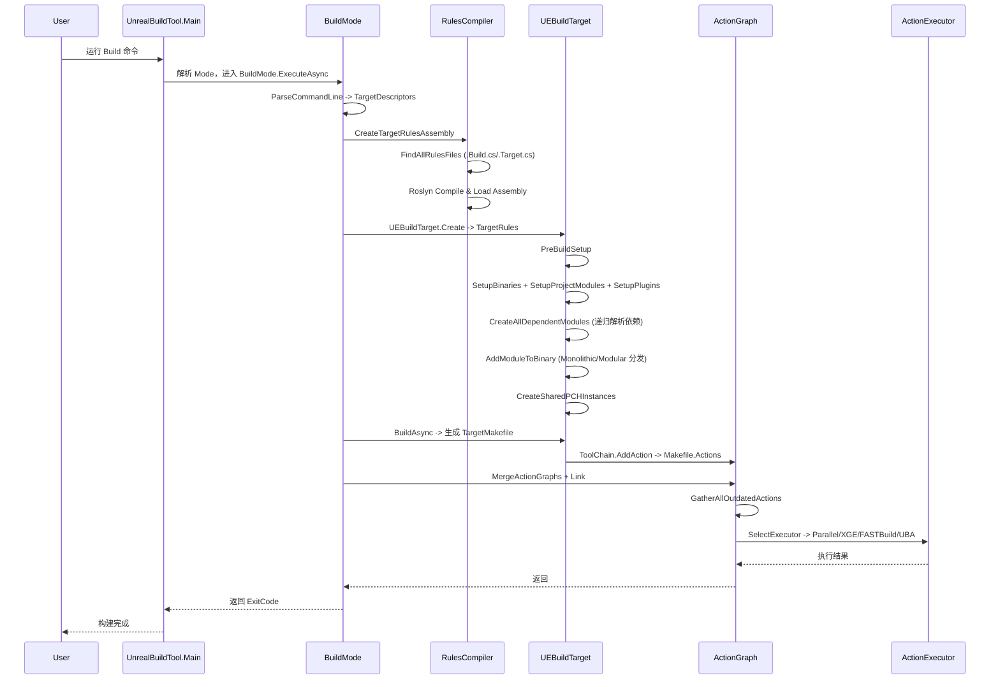

> [← 返回 00-UE全解析主索引]([[00-UE全解析主索引|UE全解析主索引]])

# UE-构建系统-源码解析：UBT 构建体系总览

> **本轮分析阶段**：第三轮 — 关联辐射 + 知识沉淀（Context）
> 
> **目标**：完成对 UnrealBuildTool（UBT）的全流程源码级解析，建立从规则编译到二进制输出的完整认知。

---

## Why：为什么要理解 UBT？

在大多数游戏引擎中，构建系统往往是一个"能跑就行"的脚本集合。但 UE 的代码量达到数百万行、模块数上千、支持平台十余个，传统 Makefile 或 CMake 已无法承载其复杂度。UBT 是 Epic 为此量身打造的**自宿主 C# 构建系统**，它将规则解析、依赖分析、代码生成、动作调度全部内聚到一个 .NET 8 可执行程序中。

理解 UBT 的价值在于：
- **排查构建问题**：链接失败、PCH 冲突、模块循环依赖、增量构建失效等问题的根源都在 UBT 源码中。
- **定制构建流程**：添加新平台、新工具链、自定义代码生成步骤都需要修改 UBT。
- **迁移工程经验**：UBT 的 DAG 调度、动态规则编译、多级执行器抽象是大型 C++ 项目构建系统的优秀参考。

---

## What：UBT 是什么？

UBT（UnrealBuildTool）是 UE 构建体系的**唯一入口**。它的核心职责包括：

| 职责 | 说明 |
|------|------|
| **规则发现与编译** | 扫描 `.Build.cs`/`.Target.cs`，通过 Roslyn 动态编译为 C# Assembly |
| **构建目标解析** | 将 `TargetRules` + `ModuleRules` 解析为内存中的 `UEBuildTarget` + `UEBuildModule` 图 |
| **构建图生成** | 内部生成显式 DAG（`ActionGraph`），不依赖外部构建工具 |
| **动作执行** | 通过 `ActionExecutor` 调度本地并行编译、XGE 分布式编译、FASTBuild、UBA 远程编译 |
| **IDE 工程生成** | 反向生成 `.sln`、`.vcxproj`、Xcode、Makefile 等 |

> **规模**：282 个 `.cs` 文件，约 14.1 万行代码。最大单体类 `UEBuildTarget.cs`（约 6,580 行）。

**源码根目录**：`D:\workspace\UnrealEngine-release\Engine\Source\Programs\UnrealBuildTool\`

---

## How：UBT 的完整构建流程

### 1. 入口与模式分发

> 文件：`Engine/Source/Programs/UnrealBuildTool/UnrealBuildTool.cs`，第 396~520 行

```csharp
private static int Main(string[] ArgumentsArray)
{
    // 1. 启动性能采集
    // 2. 解析全局参数（-Help -Verbose -Mode=xxx）
    // 3. 确定 ModeType（默认 BuildMode）
    // 4. 读取 XML 配置
    // 5. 创建并执行 ToolMode 实例
}
```

`Main()` 并不直接处理构建逻辑，而是通过反射创建对应的 `ToolMode` 子类实例。UBT 支持 20 余种模式，核心模式包括：

| 模式 | 类 | 职责 |
|------|-----|------|
| `Build` | `BuildMode` | 默认模式，编译目标 |
| `GenerateProjectFiles` | `GenerateProjectFilesMode` | 生成 IDE 工程文件 |
| `Clean` | `CleanMode` | 清理中间文件 |
| `BuildGraph` | `BuildGraphMode` | 执行 UAT 的 BuildGraph 脚本 |

### 2. 规则编译：从 `.Build.cs` 到 `RulesAssembly`

这是 UBT 最具特色的设计——**规则不是被解析的，而是被编译并执行的**。

#### 2.1 发现流程

> 文件：`Engine/Source/Programs/UnrealBuildTool/System/RulesCompiler.cs`，第 88~344 行

```csharp
public static RulesAssembly CreateTargetRulesAssembly(
    FileReference? ProjectFile, string TargetName, ...)
{
    // 1. 创建 Engine RulesAssembly（含引擎模块和程序 Target）
    RulesAssembly EngineAssembly = CreateEngineRulesAssembly(...);
    
    // 2. 若存在项目文件，创建 Project RulesAssembly
    if (ProjectFile != null)
    {
        return CreateProjectRulesAssembly(EngineAssembly, ProjectFile, ...);
    }
    return EngineAssembly;
}
```

**发现算法**（`Shared/EpicGames.Build/System/Rules.cs`，第 209~331 行）：
- 递归扫描 `Engine/Source/{Runtime,Developer,Editor,ThirdParty,Programs}` 和项目的 `Source/` 目录
- `.build.cs` → 模块规则
- `.target.cs` → 目标规则
- `.ubtignore` → 停止该目录及其子目录的搜索

#### 2.2 Roslyn 动态编译

> 文件：`Engine/Source/Programs/UnrealBuildTool/System/DynamicCompilation.cs`，第 322~403 行

```csharp
CompiledAssembly = DynamicCompilation.CompileAndLoadAssembly(
    AssemblyFileName, 
    AssemblySourceFiles, 
    Logger, 
    ReferencedAssembies: ReferencedAssembies, 
    ...
);
```

编译流程：
1. **增量判断** `RequiresCompilation()`：检查 DLL 是否存在、源文件时间戳、`UnrealBuildTool.dll` 是否更新、Manifest 中 `SourceFiles` 列表和 `EngineVersion` 是否变化。
2. **Roslyn 编译**：`CSharpSyntaxTree.ParseText()` 并行解析所有源文件 → `CSharpCompilation.Create()` → `Compilation.Emit()` 输出 `.dll` 和 `.pdb`。
3. **加载**：`Assembly.LoadFile()` 加载到当前进程。
4. **缓存 Manifest**：`Intermediate/Build/BuildRules/{Name}Manifest.json` 记录所有源文件路径和引擎版本。

> **设计亮点**：项目 Assembly 以 Engine Assembly 为 `Parent`，通过 `ReferencedAssembies` 引用父 DLL，使项目规则能直接继承引擎的 `ModuleRules` / `TargetRules` 基类。

#### 2.3 规则实例化

> 文件：`Engine/Source/Programs/UnrealBuildTool/System/RulesAssembly.cs`，第 448~927 行

- `CreateModuleRules()`：通过反射查找 `{ModuleName}` 类型，调用 `new ModuleRules(ReadOnlyTargetRules)`
- `CreateTargetRules()`：查找 `{TargetName}Target` 类型，支持平台覆盖（如 `UE5Editor_Win64`）

### 3. 构建目标解析：UEBuildTarget 的模块依赖图

`UEBuildTarget` 是 UBT 中最大的单体类（约 6,580 行），负责将 `TargetRules` 展开为完整的模块依赖图和二进制产物清单。

#### 3.1 核心 orchestration 方法

> 文件：`Engine/Source/Programs/UnrealBuildTool/Configuration/UEBuildTarget.cs`，第 4098 行

```csharp
public void PreBuildSetup(ILogger Logger)
{
    // 1. 创建 Launch Module 和主 Binary
    SetupBinaries();
    
    // 2. 根据 .uproject 创建项目模块
    SetupProjectModules();
    
    // 3. 解析并启用插件
    SetupPlugins();
    
    // 4. 递归展开所有模块依赖
    foreach (UEBuildBinary Binary in Binaries)
    {
        Binary.CreateAllDependentModules((Name, RefChain) => FindOrCreateModuleByName(...), Logger);
    }
    
    // 5. 将未绑定模块分发到 Binary
    foreach (UEBuildModuleCPP Module in DependencyModules)
    {
        if (Module.Binary == null) { AddModuleToBinary(Module); }
    }
    
    // 6. 模块合并（Monolithic 相关）
    SetupMergeModules();
    
    // 7. 验证循环依赖、PCH 设置等
}
```

#### 3.2 模块工厂：懒加载与缓存

> 文件：`Engine/Source/Programs/UnrealBuildTool/Configuration/UEBuildTarget.cs`，第 6324、6471、6481 行

```csharp
Dictionary<string, UEBuildModule> Modules; // 大小写不敏感，全局模块注册表

UEBuildModule FindOrCreateModuleByName(string Name)
{
    if (!Modules.ContainsKey(Name))
    {
        ModuleRules Rules = RulesAssembly.CreateModuleRules(Name, ...);
        Modules[Name] = InstantiateModule(Rules); // UEBuildModuleCPP 或 External
    }
    return Modules[Name];
}
```

#### 3.3 Public / Private / DynamicallyLoaded 依赖处理

这三种依赖的区分体现在模块绑定、PCH 生成、合并策略等多个环节：

| 依赖类型 | 传递性 | 对 PCH 的影响 | 对合并的影响 |
|----------|--------|---------------|--------------|
| `PublicDependencyModuleNames` | ✅ 可传递 | 参与 Shared PCH 依赖 walk | 参与模块合并 |
| `PrivateDependencyModuleNames` | ❌ 不可传递 | 参与 Shared PCH 依赖 walk | 参与模块合并 |
| `DynamicallyLoadedModuleNames` | ❌ 不可传递 | **不参与** Shared PCH | **不参与**模块合并 |

> 实际的依赖边遍历算法（Public 传递、Private 不传递）实现在 `UEBuildModule.GetDependencies()` / `GetAllDependencyModules()` 中。

#### 3.4 Monolithic vs Modular：策略分岔点

> 文件：`Engine/Source/Programs/UnrealBuildTool/Configuration/UEBuildTarget.cs`，第 4806 行

```csharp
public void AddModuleToBinary(UEBuildModuleCPP Module)
{
    if (ShouldCompileMonolithic())
    {
        // 所有模块链接进一个可执行文件
        Module.Binary = Binaries[0];
        Module.Binary.AddModule(Module);
    }
    else
    {
        // 每个模块一个独立的 DLL
        Module.Binary = CreateDynamicLibraryForModule(Module);
        Binaries.Add(Module.Binary);
    }
}
```

| 维度 | Monolithic | Modular |
|------|------------|---------|
| 输出 | 单个 `.exe` 或 `.dll` | 大量模块 `.dll` + 主可执行文件 |
| 启动速度 | 快（无运行时加载开销） | 慢（需加载数十至数百个 DLL） |
| 编辑器 | 不适用 | 必需（编辑器动态加载插件/模块） |
| 中间文件 | 强制放入项目目录 | 引擎模块可共享引擎 Intermediate |

#### 3.5 PCH（预编译头）的生成与匹配

> 文件：`Engine/Source/Programs/UnrealBuildTool/Configuration/UEBuildTarget.cs`，第 4394、4444 行

**Shared PCH 发现与排序**：
1. 收集所有声明了 `SharedPCHHeaderFile` 的模块。
2. 计算每个 Shared PCH **被其他 Shared PCH 依赖的数量**作为优先级。
3. 按优先级**降序**排列——被越多其他 PCH 包含的越靠前。

**Shared PCH 实例创建**：
1. 遍历所有 Binary 中的 C++ 模块。
2. 跳过已声明 `PrivatePCHHeaderFile` 的模块。
3. 获取模块的**直接依赖**（不含 DynamicallyLoaded）。
4. 在 `GlobalCompileEnvironment.SharedPCHs` 列表中按顺序找到**第一个匹配的 Shared PCH 模板**。
5. 为模块创建具体的 PCH 编译 Action。

### 4. 构建图生成：ActionGraph

ActionGraph 是 UBT 内部维护的**显式 DAG**，不依赖外部构建工具。

#### 4.1 DAG 的节点与边

> 文件：`Engine/Source/Programs/UnrealBuildTool/System/Action.cs`，第 225、740 行

| 类 | 作用 |
|----|------|
| `Action` | 原始构建动作（命令行、输入输出文件） |
| `LinkedAction` | 包装 `Action` 并注入 DAG 结构 |
| `IExternalAction` | 统一访问接口 |

`LinkedAction` 的关键字段：
- `PrerequisiteActions` (`HashSet<LinkedAction>`)：显式的 DAG 边
- `NumTotalDependentActions`：下游依赖本节点的动作总数
- `SortIndex`：拓扑排序后的优先级

#### 4.2 DAG 生成流程

```
ToolChain 层（VCToolChain / ClangToolChain）
  └─ Graph.CreateAction(ActionType.Compile / Link)
  └─ 填充 PrerequisiteItems / ProducedItems
  └─ Graph.AddAction(action) → 写入 TargetMakefile.Actions

BuildMode
  └─ 从 Makefile 读取 Actions
  └─ 包装为 LinkedAction
  └─ MergeActionGraphs() 按 ProducedItems 去重
  └─ ActionGraph.Link()
       ├─ 构建 ItemToProducingAction 字典
       ├─ DetectActionGraphCycles() 检测循环依赖
       ├─ 填充 PrerequisiteActions
       └─ SortActionList() 拓扑排序
```

#### 4.3 增量构建：如何判断 Action 是否过期

> 文件：`Engine/Source/Programs/UnrealBuildTool/System/ActionGraph.cs`，第 266、937 行

三阶段判断流程：

**阶段 1：Prefetch**
- 并行读取所有 Action 的 `.d` 依赖文件到 `CppDependencyCache`

**阶段 2：IsIndividualActionOutdated（并行）**
- 产物不存在 → outdated
- 产物大小为 0（`.obj`/`.o` 除外）→ outdated
- `ActionHistory` 中记录的命令行/编译器版本发生变化 → outdated
- 输入文件时间戳 > 最老产物时间戳（+1s 容错）→ outdated
- `.d` 文件中的头文件比输出新或不存在 → outdated

**阶段 3：IsActionOutdatedDueToPrerequisites（串行递归）**
- 递归检查上游 `PrerequisiteActions` 是否有 outdated
- 支持 `bIgnoreOutdatedImportLibraries`：若依赖仅来自 `.lib` 可跳过

> `ActionHistory` 持久化记录每个输出文件上次的生成命令和版本，路径通常在 `Intermediate/Build/ActionHistory.bin`。

### 5. 动作执行：ActionExecutor

> 文件：`Engine/Source/Programs/UnrealBuildTool/System/ActionExecutor.cs` 及 `Executors/` 目录

#### 5.1 执行器接口

```csharp
abstract Task<bool> ExecuteActionsAsync(
    IEnumerable<LinkedAction> ActionsToExecute, 
    ILogger Logger, 
    IActionArtifactCache? actionArtifactCache = null);
```

#### 5.2 执行器实现一览

| 执行器 | 文件 | 说明 |
|--------|------|------|
| `ParallelExecutor` | `Executors/ParallelExecutor.cs` | 本地并行执行器（默认 fallback） |
| `XGE` | `Executors/XGE.cs` | IncrediBuild 分布式编译 |
| `SNDBS` | `Executors/SNDBS.cs` | Sony SN-DBS 分布式编译 |
| `FASTBuild` | `Executors/Experimental/FASTBuild.cs` | FASTBuild 集成 |
| `UBAExecutor` | `Executors/UnrealBuildAccelerator/UBAExecutor.cs` | Epic 自研远程+缓存执行器 |

#### 5.3 执行器切换机制

> 文件：`Engine/Source/Programs/UnrealBuildTool/System/ActionGraph.cs`，第 379、427 行

```csharp
foreach (string Name in BuildConfiguration.RemoteExecutorPriority)
{
    ActionExecutor? Executor = GetRemoteExecutorByName(Name, ...);
    if (Executor != null) return Executor;
}
return new ParallelExecutor(...);
```

优先级按配置顺序尝试：
- **XGE**：检查 `bAllowXGE && XGE.IsAvailable() && ActionCount >= XGE.MinActions`
- **SNDBS/FASTBuild**：检查 `bAllow* && *.IsAvailable() && ActionCount >= MinActionsForRemote`
- **UBA**：**不检查最小 Action 数**，仅检查 `bAllowUBAExecutor && UBAExecutor.IsAvailable()`

### 6. 热重载（HotReload）与 LiveCoding

> 文件：`Engine/Source/Programs/UnrealBuildTool/System/HotReload.cs`

UBT 支持三种热重载模式：

| 模式 | 触发条件 | 行为 |
|------|----------|------|
| `FromEditor` | 编辑器请求重载特定模块 | 生成带 `-0001` 后缀的 DLL |
| `FromIDE` | IDE 中点击 Build 且编辑器正在运行 | 同上 |
| `LiveCoding` / `LiveCodingPassThrough` | Live Coding 会话活跃 | 重定向 `.obj`/`.rsp` 到 `.lc.*`，输出 `LiveCodingManifest.json` |

**ActionGraph 补丁流程**（`HotReload.PatchActionsForTarget()`，第 629~827 行）：
1. 读取 `HotReloadState.bin`，恢复上一次的重载文件映射。
2. 对需要热重载的模块，计算新的输出路径（追加 `NextSuffix`）。
3. 更新 Link Action 的输入/输出文件、response 文件。
4. 重新计算 `ActionGraph.GetActionsToExecute()`。
5. 更新 `HotReloadState.bin` 并保存。

### 7. 完整构建流程时序图



---

## 上下层模块关系

### UBT 依赖的下层模块/库

| 下层 | 作用 |
|------|------|
| `Microsoft.CodeAnalysis.CSharp` (Roslyn) | 动态编译 `.Build.cs` 规则 |
| `System.Reflection` | 反射实例化 `ModuleRules` / `TargetRules` |
| `EpicGames.Build` (Shared) | 规则文件扫描、Build 配置共享 |
| `EpicGames.UHT` (Shared) | UHT 头文件生成（通过外部进程调用） |
| `EpicGames.Core` (Shared) | 文件系统、日志、命令行解析等通用基础设施 |

### 依赖 UBT 的上层模块/工具

| 上层 | 作用 |
|------|------|
| **UAT (AutomationTool)** | 调用 UBT 完成打包、Cook、部署 |
| **IDE / 编辑器** | 通过 UBT 生成 `.sln`、`.vcxproj` |
| **LiveCoding** | 消费 UBT 输出的 `LiveCodingManifest.json` |

---

## 设计亮点与可迁移经验

1. **自宿主 C# 构建系统**
   - UBT 不依赖外部构建工具（除最终调用 MSVC/Clang 外），将规则解析、依赖分析、工程生成、动作调度全部内聚到一个程序中。这避免了 CMake + Makefile + Python 脚本之间的接口摩擦。

2. **动态规则编译**
   - `.Build.cs` 是被编译并执行的 C# 代码，而非静态 DSL。开发者可以使用完整的语言特性（条件编译、循环、函数复用、类型检查），同时 UBT 通过 Roslyn 和 Manifest 缓存保证了增量编译性能。

3. **显式 DAG 与增量构建**
   - ActionGraph 是内存中的显式 DAG，不依赖文件系统时间戳隐式推导依赖。增量构建通过 `ActionHistory` + `.d` 文件 + 上游 outdated 传播三阶段判断，精确且可预测。

4. **平台扩展的 glob 机制**
   - `.csproj` 通过 glob 自动汇入 `Engine/Platforms/*/Source/Programs/UnrealBuildTool/**/*.cs`，新增平台无需修改核心代码即可扩展 UBT。

5. **多级执行器抽象**
   - `ActionExecutor` 接口允许无缝切换本地并行编译、XGE 分布式编译、FASTBuild、UBA 远程编译。这对大型团队协作和 CI/CD 至关重要。

6. **热重载状态持久化**
   - `HotReloadState.bin` 将热重载的文件映射持久化到磁盘，支持多次增量热重载而不需要重新链接整个目标。

---

## 关键源码片段

### RulesCompiler 编译规则 Assembly

> 文件：`Engine/Source/Programs/UnrealBuildTool/System/RulesCompiler.cs`，第 137~196 行

```csharp
private static RulesAssembly CreateEngineRulesAssemblyInternal(...)
{
    // 扫描引擎模块和插件
    List<FileReference> ModuleFiles = Rules.FindAllRulesFiles(..., RulesFileType.Module);
    List<FileReference> TargetFiles = Rules.FindAllRulesFiles(..., RulesFileType.Target);
    
    // 构造 RulesAssembly，内部调用 Roslyn 编译
    return new RulesAssembly(..., ModuleFiles, TargetFiles, ...);
}
```

### UEBuildTarget 的 Monolithic/Modular 分发

> 文件：`Engine/Source/Programs/UnrealBuildTool/Configuration/UEBuildTarget.cs`，第 4806~4850 行

```csharp
public void AddModuleToBinary(UEBuildModuleCPP Module)
{
    if (ShouldCompileMonolithic())
    {
        Module.Binary = Binaries[0];
        Module.Binary.AddModule(Module);
    }
    else
    {
        Module.Binary = CreateDynamicLibraryForModule(Module);
        Binaries.Add(Module.Binary);
    }
}
```

### ActionGraph 的 DAG Link 与排序

> 文件：`Engine/Source/Programs/UnrealBuildTool/System/ActionGraph.cs`

```csharp
public static void Link(List<LinkedAction> Actions, ILogger Logger, bool Sort)
{
    // 1. 构建产出物到产生它的 Action 的映射
    Dictionary<FileItem, LinkedAction> ItemToProducingAction = ...;
    
    // 2. 检测循环依赖
    DetectActionGraphCycles(Actions, ItemToProducingAction, Logger);
    
    // 3. 填充 PrerequisiteActions
    foreach (LinkedAction Action in Actions)
    {
        foreach (FileItem PrerequisiteItem in Action.PrerequisiteItems)
        {
            if (ItemToProducingAction.TryGetValue(PrerequisiteItem, out LinkedAction? ProducingAction))
            {
                Action.PrerequisiteActions.Add(ProducingAction);
            }
        }
    }
    
    // 4. 拓扑排序
    if (Sort) { SortActionList(Actions, Logger); }
}
```

### 执行器选择逻辑

> 文件：`Engine/Source/Programs/UnrealBuildTool/System/ActionGraph.cs`，第 379~427 行

```csharp
ActionExecutor? GetRemoteExecutorByName(string Name, ...)
{
    switch (Name)
    {
        case "XGE": return (bAllowXGE && XGE.IsAvailable() && ActionCount >= XGE.MinActions) ? new XGE() : null;
        case "UBA": return (bAllowUBAExecutor && UBAExecutor.IsAvailable()) ? new UBAExecutor(...) : null;
        // ...
    }
}
```

---

## 关联阅读

- [[00-UE全解析主索引|UE全解析主索引]]
- [[UE-构建系统-源码解析：UHT 反射代码生成]]（待产出）
- [[UE-构建系统-源码解析：模块依赖与 Build.cs]]（待产出）
- [[UE-专题：构建到部署的完整流水线]]（待产出）

---

## 索引状态

- **所属 UE 阶段**：第一阶段-构建系统
- **对应 UE 笔记**：[[UE-构建系统-源码解析：UBT 构建体系总览]]
- **本轮分析完成度**：第三轮（关联辐射 + 知识沉淀）✅ — 已完成 UBT 构建体系的全流程源码解析
