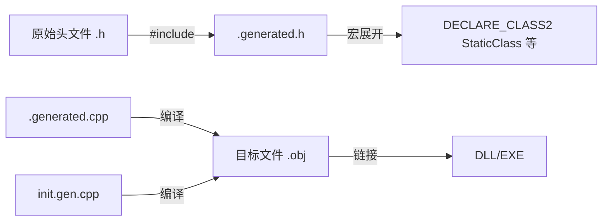
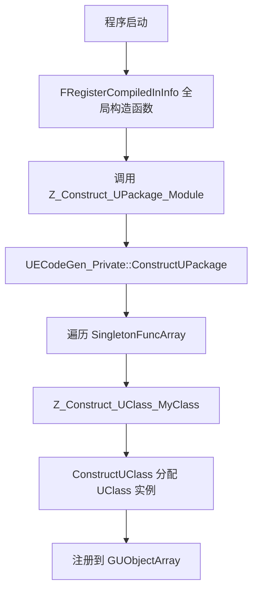

> [← 返回 UE全解析主索引]([[00-UE全解析主索引|UE全解析主索引]])

# UE-构建系统-源码解析：UHT 反射代码生成

## 模块定位

- **UE 模块路径**：`Engine/Source/Programs/Shared/EpicGames.UHT/`
- **项目文件**：`EpicGames.UHT.csproj`（C# 类库，目标框架 `net8.0`）
- **UBT 调用入口**：`Programs/UnrealBuildTool/Modes/UnrealHeaderToolMode.cs`
- **核心依赖**：`EpicGames.Core`、`EpicGames.Build`
- **产物输出**：`.generated.h`、`.generated.cpp`、模块级别的 `.h` / `.cpp`

> UHT（Unreal Header Tool）是 UE 的反射代码生成器。它解析 C++ 头文件中的 `UCLASS`/`USTRUCT`/`UENUM`/`UFUNCTION`/`UPROPERTY` 等宏，生成 UObject 反射系统所需的元数据注册代码。

---

## 接口梳理（第 1 层）

### 目录结构

```
EpicGames.UHT/
├── EpicGames.UHT.csproj          # .NET 8 类库项目
├── Parsers/                       # 头文件解析器
│   ├── UhtHeaderFileParser.cs    # 顶层头文件解析入口
│   ├── UhtClassParser.cs         # UCLASS/UINTERFACE 解析
│   ├── UhtPropertyParser.cs      # UPROPERTY 解析
│   ├── UhtFunctionParser.cs      # UFUNCTION 解析
│   ├── UhtEnumParser.cs          # UENUM 解析
│   ├── UhtScriptStructParser.cs  # USTRUCT 解析
│   └── ...
├── Types/                         # UHT 内部类型系统（映射到 UObject 体系）
│   ├── UhtType.cs                # 所有类型的基类
│   ├── UhtClass.cs               # 对应 UClass
│   ├── UhtProperty.cs            # 对应 UProperty
│   ├── UhtFunction.cs            # 对应 UFunction
│   ├── UhtScriptStruct.cs        # 对应 UScriptStruct
│   ├── UhtEnum.cs                # 对应 UEnum
│   └── Properties/               # 各种具体属性类型子类
├── Tokenizer/                     # 词法分析器
│   ├── UhtToken.cs               # Token 定义
│   ├── UhtTokenBufferReader.cs   # 基于缓冲区的 Token 读取器
│   └── UhtTokenReader*.cs        # 各种读取扩展
├── Exporters/CodeGen/             # C++ 代码生成器
│   ├── UhtCodeGenerator.cs       # 代码生成总控
│   ├── UhtHeaderCodeGenerator*.cs# 按头文件生成 .generated.h/.cpp
│   └── UhtPackageCodeGenerator*.cs# 按模块生成 Package 级代码
├── Specifiers/                    # 宏修饰符解析
│   ├── UhtClassSpecifiers.cs     # UCLASS() 内参数解析
│   ├── UhtPropertySpecifiers.cs  # UPROPERTY() 内参数解析
│   └── ...
├── Tables/                        # 查找表与注册表
│   ├── UhtKeywordTable.cs        # 关键字分发表
│   ├── UhtSpecifierTable.cs      # 修饰符表
│   └── UhtExporterTable.cs       # 导出器注册表
└── Utils/                         # 工具与 Session
    ├── UhtSession.cs             # UHT 运行会话主控
    ├── UhtFileManager.cs         # 文件 I/O 抽象
    └── UhtConfig.cs              # 配置接口
```

### 核心类与职责

| 文件 | 核心类 | 职责 |
|------|--------|------|
| `Utils/UhtSession.cs` | `UhtSession` | 一次 UHT 运行的全局上下文，管理模块、头文件、类型表、导出器 |
| `Types/UhtType.cs` | `UhtType` | 所有被解析类型的抽象基类，含 Outer/Children/ MetaData |
| `Types/UhtClass.cs` | `UhtClass` | 表示一个 `UCLASS`/`UINTERFACE`，含 `ClassFlags`、`Super` |
| `Types/UhtProperty.cs` | `UhtProperty` | 表示一个 `UPROPERTY`，含 `PropertyFlags`、`Category` |
| `Parsers/UhtHeaderFileParser.cs` | `UhtHeaderFileParser` | 逐 Token 解析头文件，分发到各类专用 Parser |
| `Exporters/CodeGen/UhtCodeGenerator.cs` | `UhtCodeGenerator` | 注册为 Exporter，生成 `.generated.*` 文件 |

### 解析流程入口

> 文件：`Engine/Source/Programs/Shared/EpicGames.UHT/Utils/UhtSession.cs`，第 1326~1437 行

```csharp
public void Run(string manifestFilePath, CommandLineArguments? arguments = null)
{
    StepReadManifestFile(manifestFilePath);
    StepPrepareModules();
    StepPrepareHeaders();
    StepParseHeaders();
    StepPopulateTypeTable();
    StepResolveInvalidCheck();
    StepBindSuperAndBases();
    RecursiveStructCheck();
    StepResolveBases();
    StepResolveProperties();
    StepResolveFinal();
    StepResolveValidate();
    StepCollectReferences();
    TopologicalSortHeaderFiles();
    StepExport();
}
```

`Run` 方法是 UHT 的**主骨架**，整个反射代码生成被拆成 15+ 个顺序步骤：

1. **ReadManifest** → 读取 UBT 生成的 `.uhtmanifest` JSON
2. **PrepareModules** → 为每个模块建立 `UhtModule`
3. **PrepareHeaders** → 为每个头文件建立 `UhtHeaderFile`
4. **ParseHeaders** → 并行解析所有头文件（`GoWide` 时多线程）
5. **PopulateTypeTable** → 将解析出的类型注册到符号表
6. **ResolveInvalidCheck** → 剔除无效类型（如未找到接口实现的 NativeInterface）
7. **BindSuperAndBases** → 绑定基类引用
8. **RecursiveStructCheck** → 检查循环引用
9. **ResolveBases** → 完全解析继承链
10. **ResolveProperties** → 解析属性类型引用
11. **ResolveFinal** → 最终解析（依赖属性已解析完的数据）
12. **ResolveValidate** → 验证规则检查
13. **CollectReferences** → 收集头文件间引用关系
14. **TopologicalSortHeaderFiles** → 拓扑排序，决定生成顺序
15. **Export** → 调用注册的所有 Exporter（主要是 CodeGen）

---

## 数据结构（第 2 层）

### UhtType 的内存模型与符号表

> 文件：`Engine/Source/Programs/Shared/EpicGames.UHT/Types/UhtType.cs`，第 778~1000 行

```csharp
public abstract class UhtType : IUhtMessageSite, IUhtMessageLineNumber
{
    public UhtSession Session => Module.Session;
    public UhtModule Module { get; }
    public UhtType? Outer { get; set; } = null;
    public virtual UhtPackage Package { get { ... } } // 沿 Outer 链追溯到根
    public string SourceName { get; set; }
    public string EngineName { get => _engineName ?? SourceName; set => _engineName = value; }
    public abstract UhtEngineType EngineType { get; }
    public UhtMetaData MetaData { get; set; }
    public List<UhtType> Children => _children ?? UhtType.s_emptyTypeList;
    public int TypeIndex { get; } // 全局唯一递增 ID
}
```

UHT 内部类型系统与运行时 UObject 体系**同构**：

- `UhtClass` → `UClass`
- `UhtProperty` → `FProperty`（旧称 UProperty）
- `UhtFunction` → `UFunction`
- `UhtScriptStruct` → `UScriptStruct`
- `UhtEnum` → `UEnum`

每个 `UhtType` 都有 `Outer` 引用，构成树形结构。例如：

```
UhtPackage (模块包)
├── UhtClass (UCLASS)
│   ├── UhtProperty (UPROPERTY)
│   ├── UhtFunction (UFUNCTION)
│   │   └── UhtProperty (参数/返回值)
│   └── UhtScriptStruct (嵌套 USTRUCT)
├── UhtEnum (UENUM)
└── UhtFunction (Delegate)
```

### 双符号表：SourceName vs EngineName

> 文件：`Engine/Source/Programs/Shared/EpicGames.UHT/Utils/UhtSession.cs`，第 2382~2406 行

```csharp
_sourceNameSymbolTable = new UhtSymbolTable(TypeCount);
_engineNameSymbolTable = new UhtSymbolTable(TypeCount);
```

- **SourceName**：C++ 源码中的实际名字（含前缀，如 `AActor`、`FVector`）
- **EngineName**：UObject 反射系统使用的名字（去掉前缀，如 `Actor`、`Vector`）

UHT 维护两张符号表，分别支持源码级查找和引擎级查找。`FindTypeInternal` 根据 `UhtFindOptions.EngineName | UhtFindOptions.SourceName` 决定查哪张表。

---

## 行为分析（第 3 层）

### 解析器：Token 分发与 Scope 嵌套

#### UhtParsingScope：解析作用域栈

> 文件：`Engine/Source/Programs/Shared/EpicGames.UHT/Parsers/UhtParsingScope.cs`，第 18~118 行

```csharp
public class UhtParsingScope : IDisposable
{
    public UhtHeaderFileParser HeaderParser { get; }
    public UhtParsingScope? ParentScope { get; }
    public UhtType ScopeType { get; } // 当前正在解析的类型
    public UhtKeywordTable ScopeKeywordTable { get; }
    public UhtAccessSpecifier AccessSpecifier { get; set; } = UhtAccessSpecifier.Public;
}
```

UHT 采用 **Scope 嵌套** 的方式处理 C++ 的块结构：

1. **Global Scope**：解析头文件全局作用域，匹配 `UCLASS`/`USTRUCT`/`UENUM`
2. **Class Scope**：进入类体后，匹配 `UPROPERTY`/`UFUNCTION`/`GENERATED_BODY`
3. **Function Scope**：进入函数签名，解析参数列表

#### 关键字属性分发表

> 文件：`Engine/Source/Programs/Shared/EpicGames.UHT/Tables/UhtKeywordTable.cs`，第 17~80 行

```csharp
[AttributeUsage(AttributeTargets.Method, AllowMultiple = true)]
public sealed class UhtKeywordAttribute : Attribute
{
    public string? Extends { get; set; } // 所属 KeywordTable
    public string? Keyword { get; set; }
    public UhtCompilerDirective AllowedCompilerDirectives { get; set; }
}
```

Parser 中的每个关键字处理器都是 **静态私有方法 + 属性标记**：

> 文件：`Engine/Source/Programs/Shared/EpicGames.UHT/Parsers/UhtClassParser.cs`，第 19~54 行

```csharp
[UhtKeyword(Extends = UhtTableNames.Global)]
private static UhtParseResult UCLASSKeyword(UhtParsingScope topScope, UhtParsingScope actionScope, ref UhtToken token)
{
    return ParseUClass(topScope, ref token);
}

[UhtKeyword(Extends = UhtTableNames.Class)]
[UhtKeyword(Extends = UhtTableNames.Class, Keyword = "GENERATED_BODY")]
private static UhtParseResult GENERATED_UCLASS_BODYKeyword(...)
{
    classObj.HasGeneratedBody = true;
    classObj.GeneratedBodyAccessSpecifier = topScope.AccessSpecifier;
    ...
}
```

运行时通过反射扫描所有带 `[UhtKeyword]` 的方法，填充到 `UhtKeywordTable` 中。当 `UhtHeaderFileParser.ParseStatement` 遇到 Identifier 时，会**自内向外**遍历 Scope 链查找匹配处理器：

> 文件：`Engine/Source/Programs/Shared/EpicGames.UHT/Parsers/UhtHeaderFileParser.cs`，第 701~722 行

```csharp
private static UhtParseResult DispatchKeyword(UhtParsingScope topScope, ref UhtToken token)
{
    UhtParseResult parseResult = UhtParseResult.Unhandled;
    for (UhtParsingScope? currentScope = topScope; 
         currentScope != null && parseResult == UhtParseResult.Unhandled; 
         currentScope = currentScope.ParentScope)
    {
        if (currentScope.ScopeKeywordTable.TryGetValue(token.Value, out UhtKeyword keywordInfo))
        {
            ...
            parseResult = keywordInfo.Delegate(topScope, currentScope, ref token);
        }
    }
    return parseResult;
}
```

### UCLASS 解析调用链

`ParseUClass` 的完整流程：

> 文件：`Engine/Source/Programs/Shared/EpicGames.UHT/Parsers/UhtClassParser.cs`，第 57~144 行

```csharp
private static UhtParseResult ParseUClass(UhtParsingScope parentScope, ref UhtToken token)
{
    UhtClass classObj = new(parentScope.HeaderFile, parentScope.HeaderParser.GetNamespace(), 
                            parentScope.ScopeType, token.InputLine);
    using UhtParsingScope topScope = new(parentScope, classObj, 
        parentScope.Session.GetKeywordTable(UhtTableNames.Class), UhtAccessSpecifier.Private);
    
    // 1. 解析 UCLASS(...) 内的修饰符
    UhtSpecifierParser specifiers = UhtSpecifierParser.GetThreadInstance(...);
    specifiers.ParseSpecifiers();
    
    // 2. 消费 "class" 关键字、API 宏、类名
    topScope.TokenReader.Require("class");
    topScope.TokenReader.TryOptionalAPIMacro(out UhtToken apiMacroToken);
    classObj.SourceName = topScope.TokenReader.GetIdentifier().Value.ToString();
    classObj.EngineName = UhtUtilities.GetEngineNameParts(classObj.SourceName).EngineName.ToString();
    
    // 3. 解析继承链（Super + Bases）
    UhtParserHelpers.ParseInheritance(..., out UhtInheritance inheritance);
    classObj.SuperIdentifier = inheritance.SuperIdentifier;
    classObj.BaseIdentifiers = inheritance.BaseIdentifiers;
    
    // 4. 解析类体 { ... }
    topScope.HeaderParser.ParseStatements('{', '}', true);
    topScope.TokenReader.Require(';');
    
    // 5. 必须包含 GENERATED_BODY()
    if (classObj.GeneratedBodyLineNumber == -1)
    {
        topScope.TokenReader.LogError("Expected a GENERATED_BODY() at the start of the class");
    }
}
```

### UPROPERTY 解析：两阶段解析

#### 第一阶段：解析时生成占位符

> 文件：`Engine/Source/Programs/Shared/EpicGames.UHT/Parsers/UhtPropertyParser.cs`，第 490~525 行

```csharp
public static void Parse(UhtParsingScope topScope, EPropertyFlags disallowPropertyFlags, 
    UhtPropertyParseOptions options, UhtPropertyCategory category, UhtPropertyDelegate propertyDelegate)
{
    using UhtThreadBorrower<UhtPropertySpecifierContext> borrower = new(true);
    UhtPropertySpecifierContext specifierContext = borrower.Instance;
    specifierContext.PropertySettings.Reset(...);
    ParseInternal(topScope, options, specifierContext, propertyDelegate);
}
```

`ParseInternal` 先解析 `UPROPERTY(...)` 修饰符，然后读取类型 Token 序列。对于复杂类型（如 `TArray<FVector>`、`TSoftObjectPtr<AActor>`），**解析阶段可能无法立即确定具体属性子类**，于是生成一个 `UhtPreResolveProperty` 占位符：

> 文件：`Engine/Source/Programs/Shared/EpicGames.UHT/Parsers/UhtPropertyParser.cs`，第 369~447 行

```csharp
public class UhtPreResolveProperty : UhtProperty
{
    public UhtPropertySettings PropertySettings { get; set; }
    // 保存了未解析的 TypeTokens，供后续 Resolve 使用
}
```

#### 第二阶段：Resolve 时替换为具体类型

> 文件：`Engine/Source/Programs/Shared/EpicGames.UHT/Parsers/UhtPropertyParser.cs`，第 534~565 行

```csharp
public static void ResolveChildren(UhtType type, UhtPropertyParseOptions options)
{
    for (int index = 0; index < type.Children.Count; ++index)
    {
        if (type.Children[index] is UhtPreResolveProperty property)
        {
            propertySettings.Reset(property, propertyOptions);
            UhtProperty? resolved = ResolveProperty(UhtPropertyResolvePhase.Resolving, propertySettings);
            if (resolved != null)
            {
                if (inSymbolTable && resolved != property)
                    type.Session.ReplaceTypeInSymbolTable(property, resolved);
                type.Children[index] = resolved;
            }
        }
    }
}
```

`ResolveProperty` 通过重放保存的 TypeTokens，调用 `UhtPropertyType.Delegate` 匹配到具体子类（如 `UhtArrayProperty`、`UhtObjectProperty`）。这种**解析-Resolve 分离**的设计使得：

- **ParseHeaders 阶段可以完全并行**（每个头文件独立解析，不依赖其他头文件中的类型定义）
- **Resolve 阶段统一做类型链接**（此时符号表已填充，可以查找 `FVector`/`AActor` 等外部类型）

### 代码生成：.generated.h 与 .generated.cpp

#### .generated.h：宏展开工厂

> 文件：`Engine/Source/Programs/Shared/EpicGames.UHT/Exporters/CodeGen/UhtHeaderCodeGeneratorHFile.cs`，第 35~237 行

`.generated.h` 的核心职责是：**把 `GENERATED_BODY()` 展开为编译器能看懂的 C++ 代码**。生成内容包括：

1. **前置声明（Forward Declarations）**
   对头文件中引用的外部类型做前向声明，避免循环包含。

2. **Class 宏体**
   为每个 `UCLASS` 生成 `DECLARE_CLASS2`、`StaticClass()` 声明、`_getUObject` 虚函数等：

   > 文件：`Engine/Source/Programs/Shared/EpicGames.UHT/Exporters/CodeGen/UhtHeaderCodeGeneratorHFile.cs`，第 1625~1665 行

   ```cpp
   private: \
       static void StaticRegisterNativesMyClass(); \
       friend struct ::Z_Construct_UClass_MyClass_Statics; \
       static UClass* GetPrivateStaticClass(); \
   public: \
       DECLARE_CLASS2(MyClass, MyBaseClass, COMPILED_IN_FLAGS(...), ...)
   ```

3. **Struct 宏体**
   为每个 `USTRUCT` 生成 `StaticStruct()` 声明、`Super` 类型别名、`UE_NET_DECLARE_FASTARRAY` 等。

4. **Enum FOREACH 宏**
   为每个 `UENUM` 生成可遍历的 `FOREACH_ENUM_XXX(op)` 宏，以及 `TIsUEnumClass` 特化。

5. **文件 ID 定义**
   ```cpp
   #define CURRENT_FILE_ID FID_Engine_Source_Runtime_CoreUObject_Public_UObject_Object_h
   ```
   用于 `.generated.cpp` 中标识元数据归属的文件。

#### .generated.cpp：元数据定义工厂

> 文件：`Engine/Source/Programs/Shared/EpicGames.UHT/Exporters/CodeGen/UhtHeaderCodeGeneratorCppFile.cs`，第 42~300 行

`.generated.cpp` 包含真正的**静态数据定义和构造逻辑**。以 `UClass` 为例，它会生成：

1. **跨模块引用声明（Cross Module References）**
   如果当前头文件引用了其他模块的类型，生成 `extern` 声明：
   ```cpp
   extern UE_CONSTINIT_UOBJECT_DECL UClass Z_ConstInit_UClass_UObject;
   ```

2. **UClass 的 Statics 结构体**
   ```cpp
   struct Z_Construct_UClass_MyClass_Statics {
       static UECodeGen_Private::FPropertyParamsBase* const PropPointers[];
       static UECodeGen_Private::FClassParams ClassParams;
   };
   ```

3. **属性参数数组**
   每个 `UPROPERTY` 都会生成一个对应的 `FPropertyParams` 静态实例，描述属性名、偏移、Flags、类型等。

4. **UClass 构造函数/工厂函数**
   ```cpp
   UClass* Z_Construct_UClass_MyClass()
   {
       // 调用 UECodeGen_Private::ConstructUClass
   }
   ```

#### 模块级 init.gen.cpp：注册入口

> 文件：`Engine/Source/Programs/Shared/EpicGames.UHT/Exporters/CodeGen/UhtPackageCodeGeneratorCppFile.cs`，第 30~230 行

每个模块会生成一个 `ModuleName.init.gen.cpp`，它是**运行时反射注册的入口**：

```cpp
// 1. 声明空链接函数（防止链接器优化掉）
void EmptyLinkFunctionForGeneratedCodeCoreUObject_init() {}

// 2. 跨模块引用声明
extern UClass* Z_Construct_UClass_UObject();

// 3. 包（UPackage）的静态构造
static FPackageRegistrationInfo Z_Registration_Info_UPackage_CoreUObject;
FORCENOINLINE UPackage* Z_Construct_UPackage_CoreUObject()
{
    if (!Z_Registration_Info_UPackage_CoreUObject.OuterSingleton)
    {
        static UObject* (*const SingletonFuncArray[])() = {
            (UObject* (*)())Z_Construct_UClass_UObject,
            (UObject* (*)())Z_Construct_UClass_UClass,
            ...
        };
        static const UECodeGen_Private::FPackageParams PackageParams = {
            "CoreUObject",
            SingletonFuncArray,
            UE_ARRAY_COUNT(SingletonFuncArray),
            PKG_CompiledIn,
            BodiesHash,
            DeclarationsHash,
            MetaDataParams
        };
        UECodeGen_Private::ConstructUPackage(Z_Registration_Info_UPackage_CoreUObject.OuterSingleton, PackageParams);
    }
    return Z_Registration_Info_UPackage_CoreUObject.OuterSingleton;
}

// 4. 编译期注册器（main 之前执行）
static FRegisterCompiledInInfo Z_CompiledInDeferPackage_UPackage_CoreUObject(
    Z_Construct_UPackage_CoreUObject, TEXT("CoreUObject"), ...);
```

### 多线程模型：什么时候并行，什么时候串行

UHT 的并发策略非常精巧，遵循 **"无依赖则并行，有依赖则串行"** 的原则：

| 阶段 | 并发性 | 原因 |
|------|--------|------|
| `StepParseHeaders` | **并行** (`GoWide`) | 每个头文件独立解析，不共享可变状态 |
| `StepPopulateTypeTable` | 串行 | 需要向全局符号表添加类型 |
| `StepResolveBases` | **并行** | 基类绑定只需读取符号表 |
| `StepResolveProperties` | **并行** | 属性类型查找是只读操作 |
| `StepResolveFinal` | **串行** | `IsMultiThreadedResolvePhase` 返回 `false`，存在跨属性依赖 |
| `StepResolveValidate` | **并行** | 验证规则彼此独立 |
| `StepCollectReferences` | **并行** | 引用收集彼此独立 |
| `TopologicalSortHeaderFiles` | 串行 | 全局拓扑排序 |
| **Export (Header)** | 按依赖拓扑**并行** | 同模块内按拓扑顺序串行，不同模块间并行 |
| **Export (Module)** | **并行** | 模块间无依赖 |

> 文件：`Engine/Source/Programs/Shared/EpicGames.UHT/Utils/UhtSession.cs`，第 1490~1506 行

```csharp
public void ForEachHeaderNoErrorCheck(Action<UhtHeaderFile> action, bool allowGoWide)
{
    if (GoWide && allowGoWide)
    {
        Parallel.ForEach(_headerFiles, headerFile =>
        {
            TryHeader(action, headerFile);
        });
    }
    else
    {
        foreach (UhtHeaderFile headerFile in _headerFiles)
        {
            TryHeader(action, headerFile);
        }
    }
}
```

### 拓扑排序与循环依赖检测

#### 头文件拓扑排序

> 文件：`Engine/Source/Programs/Shared/EpicGames.UHT/Utils/UhtSession.cs`，第 2629~2652 行

```csharp
private void TopologicalSortHeaderFiles()
{
    List<TopologicalState> states = new(HeaderFileTypeCount);
    foreach (UhtHeaderFile headerFile in HeaderFiles)
    {
        if (states[headerFile.HeaderFileTypeIndex] == TopologicalState.Unmarked)
        {
            TopologicalHeaderVisit(states, headerFile, headerStack);
        }
    }
}
```

基于 `#include` 关系做 DFS 拓扑排序，确保代码生成时**被依赖的头文件先生成**。如果检测到环，会报错：

```
Circular dependency detected:
  HeaderA.h includes/requires 'HeaderB.h'
  HeaderB.h includes/requires 'HeaderA.h'
```

#### 结构体循环继承检测

> 文件：`Engine/Source/Programs/Shared/EpicGames.UHT/Utils/UhtSession.cs`，第 2730~2749 行

`RecursiveStructCheck` 基于 `Super`/`Bases` 关系做拓扑排序，检测类/结构体的循环继承（如 `A : B`、`B : A`）。

---

## 与上下层的关系

### 上层：UBT 如何调用 UHT

完整的 UBT → UHT 调用链路：

1. `UEBuildTarget.Build()` 准备所有模块的 `ModuleRules`
2. 收集所有含反射宏的头文件，生成 `.uhtmanifest`（JSON 格式）
3. `ExternalExecution.ExecuteHeaderToolIfNecessary()` 检查 UHT 是否需要运行（基于文件时间戳和缓存）
4. `UnrealHeaderToolMode.Execute()` 构造 `UhtSession`，调用 `Run(manifestPath)`
5. UHT 返回后，UBT 读取 `.externaldependencies` 文件，将生成的 `.generated.cpp` 加入编译文件列表

> 文件：`Engine/Source/Programs/UnrealBuildTool/Modes/UnrealHeaderToolMode.cs`，第 25~180 行

UBT 中的 `UhtConfigImpl` 负责把 UBT 的配置体系（`.ini` 文件）桥接到 UHT 的 `IUhtConfig` 接口。

### 同层：UHT 产物如何被编译器消费



- `.generated.h` 中的宏在预处理阶段展开为类体内代码
- `.generated.cpp` 中的 `Z_Construct_UClass_XXX` 函数在链接后成为可被调用的符号
- `init.gen.cpp` 中的 `FRegisterCompiledInInfo` 静态对象是**全局对象**，在 `main()` 之前执行构造函数，触发 `Z_Construct_UPackage_xxx`，进而递归构造所有 `UClass`

### 下层：运行时 UObject 注册链路



---

## 设计亮点与可迁移经验

### 1. 轻量级词法分析器替代完整编译器前端

UHT 不构建完整 C++ AST，而是：
- 只识别 `#if`/`#ifdef`/`#include` 等简单预处理指令
- 只解析 `UCLASS()`/`UPROPERTY()` 等宏调用附近的上下文
- 跳过普通 C++ 函数体和无关声明

**可迁移经验**：对于代码生成工具，不需要复刻编译器前端。针对目标宏做**局部词法解析**即可，复杂度和维护成本大幅降低。

### 2. 解析-Resolve-生成的三阶段流水线

```
Parse（并行） → Populate Symbol Table（串行） → Resolve（部分并行） → Export（拓扑排序后并行）
```

**可迁移经验**：代码生成任务天然适合分阶段并发。第一阶段只读解析可完全并行；第二阶段统一链接需串行；第三阶段按依赖拓扑排序后再并行生成。

### 3. 编译期注册模式（Static Registration Pattern）

UHT 生成的 `FRegisterCompiledInInfo` 利用 C++ 全局对象的构造函数在 `main()` 之前执行代码，完成反射注册。这是 UE 实现"零配置反射"的关键。

**可迁移经验**：需要模块自注册时，可以用静态全局对象+函数指针数组的模式，避免运行时扫描 DLL 导出表。

### 4. 属性驱动的插件扩展体系

`[UhtExporter]`、`[UhtKeyword]` 等属性让 UHT 的解析器和生成器可以**零配置注册**。新增一个代码生成后端只需：
1. 写一个静态方法
2. 打上 `[UhtExporter]` 标记
3. 编译进同一个程序集

**可迁移经验**：用 C# 的 Attribute + 反射做插件注册，比手动维护注册表更易于扩展。

### 5. 双命名空间（SourceName / EngineName）的兼容性设计

C++ 侧用 `AActor`（含前缀），蓝图/编辑器侧用 `Actor`（无前缀）。UHT 在生成代码时同时维护两张符号表，确保编译器和运行时都能找到正确的名字。

---

## 关联阅读

- 前序笔记：[[UE-构建系统-源码解析：UBT 构建体系总览]]
- 后续笔记（待产出）：[[UE-构建系统-源码解析：模块依赖与 Build.cs]]
- 相关专题：[[UE-专题：反射与代码生成]]
- 相关专题：[[UE-专题：内存管理全链路]]

---

## 索引状态

- **所属 UE 阶段**：第一阶段 - 构建系统
- **对应 UE 笔记**：UE-构建系统-源码解析：UHT 反射代码生成
- **本轮完成度**：✅ 第三轮（已完成骨架扫描、血肉填充、关联辐射）
- **更新日期**：2026-04-17
