> [← 返回 UE全解析主索引]([[00-UE全解析主索引|UE全解析主索引]])

# UE-Chaos-源码解析：Chaos 物理引擎

## Why：为什么要深入理解 Chaos？

Chaos 是 UE5 的默认物理引擎，替代了 UE4 时代的 PhysX。它不仅支撑传统的刚体碰撞与约束，还引入了破坏（Destruction）、场系统（Field System）、几何集合（Geometry Collection）等高级特性。理解 Chaos 的粒子体系、约束容器与 GBF 求解器，是掌握 UE5 物理模拟、性能优化与自定义物理扩展的基础。

## What：Chaos 是什么？

Chaos 由三个模块组成清晰的分层架构：

- **`ChaosCore`**：L0 数学基座，提供向量、矩阵、隐式几何、SIMD 工具，**零物理业务逻辑**，不依赖 UObject。
- **`Chaos`**：L1 物理核心算法层，包含粒子、约束、碰撞检测、求解器、场系统、几何集合等全部物理实现。
- **`ChaosSolverEngine`**：L2 引擎封装层，将 Chaos 求解器包装为 UE 可识别的 UObject/Actor/Component，供游戏框架直接调用。

---

## 模块定位

### ChaosCore
- **路径**：`Engine/Source/Runtime/Experimental/ChaosCore/`
- **Build.cs**：`ChaosCore.Build.cs`
- **依赖**：`Core`, `IntelISPC`
- **定位**：纯数学/几何基元库，可被独立工具链复用。

### Chaos
- **路径**：`Engine/Source/Runtime/Experimental/Chaos/`
- **Build.cs**：`Chaos.Build.cs`
- **依赖**：`ChaosCore`, `CoreUObject`, `GeometryCore`, `Voronoi`, `NNE` 等
- **定位**：物理引擎全部算法实现，核心类均为非 UObject。

### ChaosSolverEngine
- **路径**：`Engine/Source/Runtime/Experimental/ChaosSolverEngine/`
- **Build.cs**：`ChaosSolverEngine.Build.cs`
- **依赖**：`Engine`, `RenderCore`, `RHI`, `DeveloperSettings`, `DataflowEngine` 等
- **定位**：UE 游戏框架与 Chaos 的"胶水层"，UCLASS 密集。

---

## 接口梳理（第 1 层）

### ChaosCore 核心类型

| 类型 | 说明 |
|------|------|
| `FVec3` / `FMatrix33` / `FRotation3` | 底层 SIMD 友好的线性代数类型 |
| `FAABB3` | AABB 及向量化版本 |
| `FSphere` / `FCapsule` / `FPlane` | 基础隐式几何图元 |

### Chaos 核心数据结构

| 类型 | 说明 |
|------|------|
| `TGeometryParticle` / `TKinematicGeometryParticle` / `TPBDRigidParticle` | 从静态 → 运动学 → 刚体的四级粒子继承体系 |
| `TGeometryParticleHandle` | SOA 安全访问句柄，对外部系统暴露粒子接口 |
| `FPBDRigidsEvolutionGBF` | GBF（Gauss-Seidel / Jacobi 混合）刚体主求解器 |
| `FPBDConstraintContainer` | 所有约束的基类，统一分配与图着色求解接口 |
| `FSpatialAccelerationBroadPhase` | 基于空间加速结构的 BroadPhase |
| `FImplicitObject` / `FConvex` / `FHeightField` | 隐式几何对象层级 |
| `FFieldSystem` / `FFieldNodeBase` | 统一力场/破坏场的节点图系统 |

### ChaosSolverEngine UObject 封装

| 类型 | 说明 |
|------|------|
| `UChaosSolver` | 求解器的最小 UObject 包装壳 |
| `AChaosSolverActor` | 场景中可放置的物理求解器 Actor |
| `UChaosDebugDrawComponent` | Chaos 物理调试绘制组件 |
| `UChaosEventListenerComponent` | 监听并转发碰撞、破碎等物理事件 |
| `UChaosGameplayEventDispatcher` | 将 Chaos 内部事件转换为 Gameplay 事件 |
| `UChaosSolverSettings` | 全局 Chaos 求解器项目设置（`config=Engine`） |

---

## 数据结构与行为分析（第 2~3 层）

### 粒子体系与 SOA+Handle 模式

Chaos 内部粒子**不是 UObject**，它们由 `FPBDRigidsSOAs` 在物理内存池中直接分配。粒子的继承体系如下：

```
TGeometryParticle        (静态几何)
  └── TKinematicGeometryParticle  (运动学)
        └── TPBDRigidParticle     (刚体)
              └── TPBDRigidClusteredParticle  (聚集刚体/破碎)
```

> 文件：`Engine/Source/Runtime/Experimental/Chaos/Public/Chaos/GeometryParticles.h`，第 150~680 行

`TGeometryParticlesImp<T, d, SimType>` 是 SOA（Structure of Arrays）的核心实现。每个粒子属性都是一个独立的 `TArrayCollectionArray`：

```cpp
TArrayCollectionArray<FUniqueIdx> MUniqueIdx;
TArrayCollectionArray<TSerializablePtr<FGeometryParticleHandle>> MGeometryParticleHandle;
TArrayCollectionArray<FGeometryParticle*> MGeometryParticle;
TArrayCollectionArray<IPhysicsProxyBase*> MPhysicsProxy;
TArrayCollectionArray<FShapeInstanceArray> MShapesArray;
TArrayCollectionArray<TAABB<T,d>> MLocalBounds;
TArrayCollectionArray<TVector<T,d>> MCCDAxisThreshold;
TArrayCollectionArray<TAABB<T, d>> MWorldSpaceInflatedBounds;
TArrayCollectionArray<FConstraintHandleArray> MParticleConstraints;
TArrayCollectionArray<FParticleCollisions> MParticleCollisions;
TArrayCollectionArray<Private::FPBDIslandParticle*> MGraphNode;
```

**SOA 的优势**：
- 缓存友好：遍历所有粒子的速度时，只访问连续内存的 `V` 数组。
- SIMD 友好：可向量化批量计算。
- 视图灵活：通过 `TParticleView` 可以构建“所有动态粒子”、“所有运动学粒子”等子集视图，而无需复制数据。

**Handle 的安全访问**：
`TGeometryParticleHandle` 是外部系统与 Chaos 粒子交互的安全门面。Handle 内部只保存两个指针（`GeometryParticles` + `ParticleIdx`），通过索引访问 SOA 中的属性。当粒子被销毁时，Handle 对应的索引可能被回收，但外部系统通过 `FWeakParticleHandle`（线程安全的 `TSharedPtr`）来检测有效性。

### TPBDRigidParticle 成员布局

> 文件：`Engine/Source/Runtime/Experimental/Chaos/Public/Chaos/PBDRigidParticles.h`

`TPBDRigidParticle` 在 `TGeometryParticle` 基础上增加了动力学属性：

| 属性 | 说明 |
|------|------|
| `M() / InvM()` | 质量与逆质量 |
| `I() / InvI()` | 惯性张量与逆惯性张量（对角化，局部空间） |
| `V() / W()` | 线速度与角速度 |
| `P() / Q()` | 求解后的预测位置/旋转（Solve 目标） |
| `X() / R()` | 当前帧最终位置/旋转 |
| `XCom() / RCom()` | 质心位置/旋转 |
| `Acceleration() / AngularAcceleration()` | 加速度与角加速度 |
| `LinearImpulseVelocity() / AngularImpulseVelocity()` | 冲量速度 |
| `ObjectState()` | 状态：Static / Kinematic / Dynamic / Sleeping |
| `CCDEnabled()` / `MACDEnabled()` | 连续碰撞检测 / 运动感知碰撞检测开关 |
| `KinematicTarget()` | 运动学目标（仅一帧有效） |

### FSingleParticlePhysicsProxy：Game Thread 与 Solver 的桥梁

> 文件：`Engine/Source/Runtime/Experimental/Chaos/Public/PhysicsProxy/SingleParticlePhysicsProxy.h`，第 57~203 行

`FSingleParticlePhysicsProxy` 继承自 `IPhysicsProxyBase`，是 UObject 世界与 Chaos 粒子的唯一合法通道：

```cpp
class FSingleParticlePhysicsProxy : public IPhysicsProxyBase
{
    TUniquePtr<FGeometryParticle> Particle;   // GT 侧粒子副本
    FGeometryParticleHandle* Handle;          // PT 侧粒子句柄
    FPhysicsObjectUniquePtr Reference;
    // ...
public:
    FRigidBodyHandle_External& GetGameThreadAPI();     // GT 读写接口
    FRigidBodyHandle_Internal* GetPhysicsThreadAPI();  // PT 只读接口
    void PushToPhysicsState(...);                      // GT → PT 数据推送
    bool PullFromPhysicsState(...);                    // PT → GT 结果拉取
};
```

**数据流转**：
1. **GT 修改属性**：Gameplay 代码通过 `GetGameThreadAPI()` 修改 `Particle` 的位置、速度等。
2. **标记 Dirty**：Proxy 被加入 Solver 的 `MarshallingManager` 的 DirtyProxy 列表。
3. **PushPhysicsState**：在 `FPhysicsSolverBase::AdvanceAndDispatch_External` 中，GT 将 DirtyProxy 的数据序列化到 `FPushPhysicsData`。
4. **ProcessPushedData_Internal**：PT 任务反序列化数据，更新 `Handle` 指向的 SOA 粒子。
5. **Solve 完成后**：PT 通过 `BufferPhysicsResults` 将结果写入 `FPullPhysicsData`。
6. **PullFromPhysicsState**：GT 在下一帧或异步插值时读取结果，同步回 `UStaticMeshComponent` 等 UObject。

### GBF 求解器主循环：AdvanceOneTimeStepImpl

> 文件：`Engine/Source/Runtime/Experimental/Chaos/Public/Chaos/PBDRigidsEvolutionGBF.h`，第 50~374 行
> 文件：`Engine/Source/Runtime/Experimental/Chaos/Private/Chaos/PBDRigidsEvolutionGBF.cpp`，第 528~854 行

`FPBDRigidsEvolutionGBF::AdvanceOneTimeStepImpl` 是每帧物理推进的核心。其内部流程如下（按源码顺序）：

```mermaid
flowchart TD
    A[AdvanceOneTimeStepImpl Dt] --> B[ReleasePendingIndices]
    B --> C[PreIntegrateCallback]
    C --> D[Integrate: 外力积分]
    D --> E[ApplyKinematicTargets]
    E --> F[PostIntegrateCallback]
    F --> G[UpdateConstraintPositionBasedState]
    G --> H[ComputeIntermediateSpatialAcceleration]
    H --> I[BroadPhase]
    I --> J[MidPhaseModifier]
    J --> K[NarrowPhase GJK/EPA]
    K --> L[PostDetectCollisionsCallback]
    L --> M[TransferJointConstraintCollisions]
    M --> N[CCD Modifiers]
    N --> O[InertiaConditioning]
    O --> P[CCDManager::ApplyCCD]
    P --> Q[CollisionModifiers]
    Q --> R[CreateConstraintGraph]
    R --> S[CreateIslands]
    S --> T[PruneExpiredCollisions]
    T --> U[PreSolveCallback]
    U --> V[ReloadParticlesCache]
    V --> W[IslandGroupManager::BuildGroups]
    W --> X[IslandGroupManager::Solve]
    X --> Y[CCDManager::ProjectCCD]
    Y --> Z[SaveParticlePostSolve]
    Z --> AA[UpdateSleep / UpdateDisable]
    AA --> AB[Clustering.AdvanceClustering]
    AB --> AC[CaptureRewindData]
    AC --> AD[ParticleUpdatePosition]
    AD --> AE[IslandManager::EndTick]
    AE --> AF[DetectProbeCollisions]
```



**关键阶段详解**：

#### 1. Integrate（外力积分）
> 文件：`Engine/Source/Runtime/Experimental/Chaos/Private/Chaos/PBDRigidsEvolutionGBF.cpp`，第 856~1059 行

`Integrate(Dt)` 遍历所有 `ActiveParticlesArray` 中的刚体，执行：
- 应用所有 `ForceRules`（默认包含重力 `FPerParticleGravity`）
- 欧拉步进：`V += Acceleration * Dt; W += AngularAcceleration * Dt`
- 应用冲量速度：`V += LinearImpulseVelocity; W += AngularImpulseVelocity`
- EtherDrag（线性/角阻力衰减）
- Gyroscopic Torque（陀螺力矩修正）
- 速度 Clamp（`MaxLinearSpeedSq`、`HackMaxVelocity`）
- 预测位置更新：`PCoM = PCoM + V * Dt; QCoM = IntegrateRotation(QCoM, W, Dt)`
- 更新包围盒：根据速度和 `BoundsThickness` 扩展 `WorldSpaceInflatedBounds`
- CCD 物体特殊处理：如果位移超过 `CCDAxisThreshold`，则沿速度反向 Sweep 扩展 Bounds

在多线程模式下，`TaskDispatcher.DispatchIntegrate(IntegrateWork)` 将积分任务分派到 TaskGraph。

#### 2. BroadPhase & NarrowPhase

> 文件：`Engine/Source/Runtime/Experimental/Chaos/Private/Chaos/PBDRigidsEvolutionGBF.cpp`，第 626~646 行

```cpp
CollisionDetector.GetBroadPhase().SetSpatialAcceleration(InternalAcceleration);
CollisionDetector.RunBroadPhase(Dt, GetCurrentStepResimCache());
CollisionDetector.RunNarrowPhase(Dt, GetCurrentStepResimCache());
```

- **BroadPhase**：`FSpatialAccelerationBroadPhase` 使用 `ISpatialAccelerationCollection`（默认 Dynamic AABB Tree）找出所有潜在碰撞对（Overlap Pairs）。
- **NarrowPhase**：对每一对重叠的 Shape，调用 GJK/EPA/SAT 计算精确的接触点 `FContactPoint`，包括穿透深度 `Phi`、法线、切线、碰撞面索引。

碰撞约束 `FPBDCollisionConstraint` 在 NarrowPhase 中被创建或更新。约束使用 **Manifold**（接触点集合）来近似接触面，支持 One-Shot Manifold（每帧重新检测）和 Incremental Manifold（迭代内增量更新）。

#### 3. CCD（连续碰撞检测）
> 文件：`Engine/Source/Runtime/Experimental/Chaos/Private/Chaos/PBDRigidsEvolutionGBF.cpp`，第 676~686 行、第 995~1007 行

CCD 在 `Integrate` 阶段通过扩展 Bounds 标记可能高速穿透的物体。在 NarrowPhase 后：
- `CCDManager.ApplyCCD`：对所有标记的碰撞约束执行 Sweep 检测，计算 TOI（Time of Impact）。
- 如果发现 TOI < 1，将粒子回滚到首次接触时刻的位置，并更新 Manifold。
- `CCDManager.ProjectCCD`：在约束求解后，防止 CCD 物体被约束求解推出世界边界。

#### 4. Constraint Graph 与 Island 求解
> 文件：`Engine/Source/Runtime/Experimental/Chaos/Public/Chaos/PBDRigidsEvolution.h`，第 923~945 行
> 文件：`Engine/Source/Runtime/Experimental/Chaos/Public/Chaos/Island/IslandGroupManager.h`，第 76~187 行

```cpp
void CreateConstraintGraph()
{
    IslandManager.UpdateParticles();           // 将新粒子加入图
    for (FPBDConstraintContainer* Container : ConstraintContainers)
    {
        Container->AddConstraintsToGraph(GetIslandManager());
    }
}

void CreateIslands()
{
    IslandManager.UpdateIslands();             // 将连通子图打包为 Island
}
```

- **Constraint Graph**：每个粒子是图节点，每个约束（碰撞、关节、悬挂、角色地面约束）是边。`FPBDIslandManager` 维护粒子与约束的邻接关系。
- **Island**：一个连通子图即一个 Island。Island 之间完全独立，可并行求解。
- **Island Group**：`FPBDIslandGroupManager::BuildGroups` 将 Island 分配到多个 Group，尽量让每个 Group 的约束数均衡。Group 之间通过 `ParallelFor` 并行求解。

### 约束容器多态机制

> 文件：`Engine/Source/Runtime/Experimental/Chaos/Public/Chaos/PBDConstraintContainer.h`，第 18~109 行

所有自定义约束必须继承 `FPBDConstraintContainer`：

```cpp
class FPBDConstraintContainer
{
public:
    virtual int32 GetNumConstraints() const = 0;
    virtual void ResetConstraints() = 0;
    virtual void PrepareTick() = 0;
    virtual void UnprepareTick() = 0;
    virtual void UpdatePositionBasedState(const FReal Dt) {}
    virtual void AddConstraintsToGraph(Private::FPBDIslandManager& IslandManager) = 0;
    virtual TUniquePtr<FConstraintContainerSolver> CreateSceneSolver(const int32 Priority) = 0;
    virtual TUniquePtr<FConstraintContainerSolver> CreateGroupSolver(const int32 Priority) = 0;
};
```

`FPBDRigidsEvolutionGBF` 在构造时注册了 5 种约束容器（按优先级排序）：
1. `SuspensionConstraints`（悬挂约束）
2. `CollisionConstraints`（碰撞约束）
3. `JointConstraints.LinearConstraints`（线性关节求解器）
4. `JointConstraints.NonLinearConstraints`（非线性关节求解器）
5. `CharacterGroundConstraints`（角色地面约束）

每种容器在 `Solve` 阶段会创建自己的 `FConstraintContainerSolver`（GroupSolver），并在 Island Group 内按优先级依次求解。这允许用户扩展自定义约束（如载具悬架、软体约束）而不修改核心求解器代码。

### 碰撞约束容器详解

> 文件：`Engine/Source/Runtime/Experimental/Chaos/Public/Chaos/Collision/PBDCollisionConstraint.h`，第 224~1000 行

`FPBDCollisionConstraint` 继承自 `FPBDCollisionConstraintHandle`，包含：
- `FGeometryParticleHandle* Particle[2]`：碰撞双方粒子
- `const FImplicitObject* Implicit[2]`：碰撞使用的隐式几何
- `const FShapeInstance* Shape[2]`：形状实例（含材质、局部变换）
- `TArray<FManifoldPoint> ManifoldPoints`：接触点集合
- `FPBDCollisionConstraintMaterial Material`：动态摩擦、静摩擦、恢复系数、质量缩放等
- `FFlags Flags`：CCD 开关、Probe 标志、Disabled 标志、MaterialSet 标志等

碰撞约束通过 `Private::FCollisionConstraintAllocator` 堆分配，具有稳定地址，支持 Warm Starting（复用上一帧的摩擦锚点）。

---

## PhysicsSolverBase：Push/Pull、子步进与 Rewind

### 多线程任务调度

> 文件：`Engine/Source/Runtime/Experimental/Chaos/Public/Chaos/Framework/PhysicsSolverBase.h`，第 107~219 行
> 文件：`Engine/Source/Runtime/Experimental/Chaos/Private/Chaos/Framework/PhysicsSolverBase.cpp`，第 88~191 行

`FPhysicsSolverBase` 通过 TaskGraph 调度三个核心任务：


- **`FPhysicsSolverProcessPushDataTask`**：在 PT 上执行，调用 `ProcessPushedData_Internal`，将 GT 推送的序列化数据应用到粒子。
- **`FPhysicsSolverFrozenGTPreSimCallbacks`**：如果注册了 `RunOnFrozenGameThread` 的回调，在 GT 上执行（此时 PT 等待）。
- **`FPhysicsSolverAdvanceTask`**：在 PT 上执行，调用 `AdvanceSolverBy` 推进物理模拟。

线程模式由 `EThreadingModeTemp` 控制：
- `SingleThread`：所有步骤在 GT 同步执行。
- `TaskGraph`：默认异步模式，三个任务通过 `FGraphEvent` 顺序依赖调度。
- `DedicatedThread`：（已废弃）专用物理线程。

### PushPhysicsState 内部流程

> 文件：`Engine/Source/Runtime/Experimental/Chaos/Private/PBDRigidsSolver.cpp`，第 1485~1618 行

```cpp
void FPBDRigidsSolver::PushPhysicsState(const FReal DeltaTime, const int32 NumSteps, const int32 NumExternalSteps)
{
    FPushPhysicsData* PushData = MarshallingManager.GetProducerData_External();
    const FReal DynamicsWeight = FReal(1) / FReal(NumExternalSteps);
    
    DirtyProxiesData->ParallelForEachProxy([...](int32 DataIdx, FDirtyProxy& Dirty)
    {
        // SingleParticleProxy: 同步粒子属性、Shape、动力学权重
        // GeometryCollection: 调用 PushStateOnGameThread
        // Joint/Suspension/CharacterGround: 同步约束属性
    });
    
    MarshallingManager.Step_External(DeltaTime, NumSteps, GetSolverSubstep_External());
}
```

`ParallelForEachProxy` 并行处理所有 Dirty Proxy：
- 对 `FSingleParticlePhysicsProxy`：调用 `Particle->SyncRemoteData`，将 GT 的 `FGeometryParticle` 属性同步到序列化缓冲区。
- 对 `FGeometryCollectionPhysicsProxy`：调用 `PushStateOnGameThread` 同步破碎体状态。
- 对约束 Proxy：同步关节/悬挂/角色地面约束的设置。

### ProcessPushedData_Internal 内部流程

> 文件：`Engine/Source/Runtime/Experimental/Chaos/Private/PBDRigidsSolver.cpp`，第 1877~2076 行

PT 在 `FPhysicsSolverProcessPushDataTask` 中调用：

1. **更新 SimCallbackObjects**：注册/注销 MidPhase、CCD、Contact、Strain 等 Modifier。
2. **RewindData 缓存**：如果启用了网络回滚，缓存当前帧的脏数据（`CacheCurrentDirtyData`）。
3. **ProcessSinglePushedData_Internal**：反序列化每个 Proxy 的 Dirty 数据，更新 PT 粒子：
   - 创建/销毁粒子 Handle
   - 同步位置、旋转、速度、质量、形状等
   - 注册新粒子到 `IslandManager` 和空间加速结构
4. **执行 SimCommands**：运行用户通过 `EnqueueCommandImmediate` 或 `EnqueueCommandScheduled_External` 提交的 PT 命令。

### PullResults 与 CompleteSceneSimulation

> 文件：`Engine/Source/Runtime/Experimental/Chaos/Private/PBDRigidsSolver.cpp`，第 2255~2740 行

Solve 完成后，`FPhysicsSolverAdvanceTask` 调用 `CompleteSceneSimulation`：

```cpp
void FPBDRigidsSolver::CompleteSceneSimulation()
{
    EventPreBuffer.Broadcast(MLastDt);
    GetDirtyParticlesBuffer()->CaptureSolverData(this);
    BufferPhysicsResults();
}
```

`BufferPhysicsResults` 将 PT 的粒子状态写入 `FPullPhysicsData`：
- 遍历 `DirtyParticlesView`，收集所有在模拟中被修改的粒子。
- 对 `FSingleParticlePhysicsProxy`：调用 `BufferPhysicsResults(FDirtyRigidParticleData&)` 序列化位置、旋转、速度、睡状态等。
- 对 `FGeometryCollectionPhysicsProxy` 和 `FClusterUnionPhysicsProxy`：分别收集破碎体和集群状态。
- 对约束 Proxy：收集关节和角色地面约束的结果。
- 如果启用了 `FRewindData`：将重模拟误差校正数据写入 `PullData->DirtyRigidErrors`。

GT 在后续帧通过 `FPhysicsSolverBase::PullPhysicsStateForEachDirtyProxy_External` 将结果拉取回对应的 Proxy 和 Component。

### 子步进（Substepping）

> 文件：`Engine/Source/Runtime/Experimental/Chaos/Private/Chaos/Framework/PhysicsSolverBase.cpp`，第 432~576 行

在 `AdvanceAndDispatch_External` 中：
- 如果 `MMaxSubSteps > 1` 且 `Dt > MMaxDeltaTime`，则将一帧切分为多个子步。
- 每个子步生成独立的 `FPushPhysicsData`，但通过相同的 `ExternalTimestamp` 关联。
- `FPhysicsSolverAdvanceTask` 中，`PseudoFraction` 用于运动学目标的插值：
  ```cpp
  const FReal PseudoFraction = PushData->bSolverSubstepped
      ? (FReal)1 / (FReal)(PushData->IntervalNumSteps - PushData->IntervalStep)
      : 1.0f;
  ```

### 网络回滚（Rewind / Resimulation）

> 文件：`Engine/Source/Runtime/Experimental/Chaos/Public/RewindData.h`
> 文件：`Engine/Source/Runtime/Experimental/Chaos/Private/PBDRigidsSolver.cpp`，第 445~640 行

`FPhysicsSolverBase` 支持网络物理预测回滚：
- `FRewindData`：环形缓冲区，缓存最近 N 帧的粒子状态、碰撞约束、用户输入。
- `IRewindCallback`：用户自定义回滚逻辑，比较服务器状态与本地预测状态，触发重模拟。
- `FEvolutionResimCache`：在 `AdvanceOneTimeStepTask` 中，如果当前帧需要 Resim，则：
  1. `RewindData->ApplyInputs` 将历史输入重放。
  2. `RewindData->AdvanceFrame` 创建 `FEvolutionResimCache`。
  3. `ReloadParticlesCache` 从缓存恢复未脱同步 Island 的粒子状态，避免完全重算。
  4. 只对标记为 `HardDesync` 的 Island 执行完整物理求解。

---

## 上下层关系

### 与 PhysicsCore 的交互

> 文件：`Engine/Source/Runtime/Experimental/Chaos/Public/PhysicsProxy/SingleParticlePhysicsProxy.h`
> 文件：`Engine/Source/Runtime/PhysicsCore/Public/Chaos/`

`PhysicsCore` 是 UE 的物理抽象层（`FChaosEngineInterface`）。

```
UStaticMeshComponent / UPrimitiveComponent
    └── FBodyInstance (PhysicsCore)
        └── FChaosEngineInterface
            └── FPhysicsActorHandle ≈ FSingleParticlePhysicsProxy*
                └── FPBDRigidsSolver (Chaos)
```

**数据流入（GT → Solver）**：
- `FBodyInstance::SetBodyTransform` → `FSingleParticlePhysicsProxy::SetTransform` → 标记 Dirty → `PushPhysicsState` → PT 粒子更新。
- `FBodyInstance::AddForce` → `FSingleParticlePhysicsProxy::AddForce` → 同上。

**数据流出（Solver → GT）**：
- `BufferPhysicsResults` → `FSingleParticlePhysicsProxy::PullFromPhysicsState` → `FBodyInstance::SetBodyTransform` → `UPrimitiveComponent` 更新渲染/逻辑变换。

### 与 ChaosSolverEngine 的交互

> 文件：`Engine/Source/Runtime/Experimental/ChaosSolverEngine/Public/ChaosSolverActor.h`

```
AChaosSolverActor (ChaosSolverEngine)
    └── UChaosSolver
        └── FChaosSolversModule::CreateSolver
            └── FPBDRigidsSolver (Chaos)
```

`AChaosSolverActor` 将 Solver 接入 `UWorld` 的 Tick 管线：
- `Tick` → `FPhysScene_ChaosInterface::StartFrame` → `FPBDRigidsSolver::AdvanceAndDispatch_External`
- 通过 `FChaosSolversModule` 管理 Solver 生命周期（单例或场景级）。

`UChaosEventListenerComponent` 和 `UChaosGameplayEventDispatcher` 订阅 `FEventManager` 的碰撞/破碎事件，将 PT 事件转换为 Blueprint 事件。

### 与 GeometryCollectionEngine 的交互

> 文件：`Engine/Source/Runtime/Experimental/Chaos/Private/PBDRigidsSolver.cpp`，第 950~999 行

```
UGeometryCollectionComponent (GeometryCollectionEngine)
    └── FGeometryCollectionPhysicsProxy
        └── FPBDRigidsSolver::RegisterObject
            └── TPBDRigidClusteredParticleHandle (Chaos)
```

**破碎模拟数据流**：
- **初始化**：`FGeometryCollectionPhysicsProxy::Initialize` 在 Solver 中创建大量 `TPBDRigidClusteredParticleHandle`，并建立父子 Cluster 关系。
- **场系统驱动**：`FPerSolverFieldSystem` 每帧评估 `FFieldNodeBase`，对破碎体施加力或触发断裂（Strain）。
- **Clustering**：`FRigidClustering::AdvanceClustering` 在 Solve 后处理破碎事件，将父 Cluster 解体为子粒子，并更新约束图。
- **事件回传**：碰撞/断裂事件通过 `FEventManager` 返回 `UGeometryCollectionComponent`，触发材质脱落、粒子特效等。

---

## 设计亮点与可迁移经验

1. **严格的三层解耦**：`ChaosCore` → `Chaos` → `ChaosSolverEngine` 的层级清晰，L0 可被独立数学工具复用，L1 理论上可脱离 UE 运行。`COMPILE_WITHOUT_UNREAL_SUPPORT` 编译开关进一步强化了这种解耦思想。

2. **SOA + Handle 模式**：粒子属性以 Structure of Arrays 存储，外部通过 Handle 安全访问，兼顾缓存友好性与接口安全性。`TGeometryParticlesImp` 使用 `TArrayCollectionArray` 实现属性的动态注册，使得不同粒子类型可以灵活组合属性列，而无需多重继承带来的内存膨胀。

3. **约束容器的多态统一**：所有约束继承 `FPBDConstraintContainer`，通过 `AddConstraintsToGraph` 自动参与 Island 构建，通过 `CreateGroupSolver` 创建并行求解器。这种设计使得新增自定义约束（如载具悬架、软体约束）无需修改核心求解循环。

4. **TaskGraph 驱动的异步物理管线**：`FPhysicsSolverBase` 将 PushData → Advance → BufferResults 拆分为顺序依赖的 TaskGraph 任务，支持单线程、异步、子步进、网络回滚等多种模式，体现了“计算与调度分离”的设计。

5. **Island 分组与并行求解**：通过约束图将物理世界切分为独立的 Island，再均衡分配到 Island Group，利用 `ParallelFor` 并行求解。这是大规模物理场景性能扩展的关键。

6. **Rewind / Resim 架构**：`FRewindData` 环形缓冲区 + `FEvolutionResimCache` 的缓存机制，使得网络物理预测只需要对脱同步 Island 重算，其余 Island 直接回放历史状态，极大降低了回滚开销。

---

## 关键源码片段

> 文件：`Engine/Source/Runtime/Experimental/Chaos/Public/Chaos/PBDRigidsEvolutionGBF.h`，第 133~136 行

```cpp
class CHAOS_API FPBDRigidsEvolutionGBF : public FPBDRigidsEvolutionBase
{
public:
    // GBF 刚体主求解器，每帧调用 Advance 推进物理状态
    void Advance(const FReal Dt, const FReal MaxStepDt, const int32 MaxSteps);
    void AdvanceOneTimeStep(const FReal dt, const FSubStepInfo& SubStepInfo = FSubStepInfo());
};
```

> 文件：`Engine/Source/Runtime/Experimental/Chaos/Private/Chaos/PBDRigidsEvolutionGBF.cpp`，第 528~610 行（AdvanceOneTimeStepImpl 前半段）

```cpp
void FPBDRigidsEvolutionGBF::AdvanceOneTimeStepImpl(const FReal Dt, const FSubStepInfo& SubStepInfo)
{
    // 1. 释放上一帧待回收的 UniqueIdx
    if(SubStepInfo.Step == 0) { Base::ReleasePendingIndices(); }

    // 2. PreIntegrate 回调 + 外力积分 + 运动学目标
    if (PreIntegrateCallback != nullptr) { PreIntegrateCallback(Dt); }
    Integrate(Dt);
    ApplyKinematicTargets(Dt, SubStepInfo.PseudoFraction);
    if (PostIntegrateCallback != nullptr) { PostIntegrateCallback(Dt); }

    // 3. 更新约束位置状态 + 构建中间空间加速结构
    UpdateConstraintPositionBasedState(Dt);
    Base::ComputeIntermediateSpatialAcceleration();
    TaskDispatcher.WaitTaskEndSpatial();

    // 4. 碰撞检测：BroadPhase → MidPhaseModifier → NarrowPhase
    CollisionDetector.GetBroadPhase().SetSpatialAcceleration(InternalAcceleration);
    CollisionDetector.RunBroadPhase(Dt, GetCurrentStepResimCache());
    if (MidPhaseModifiers) { ApplyMidPhaseModifier(Dt); }
    CollisionDetector.RunNarrowPhase(Dt, GetCurrentStepResimCache());
}
```

> 文件：`Engine/Source/Runtime/Experimental/Chaos/Public/Chaos/GeometryParticles.h`，第 640~660 行

```cpp
// SOA 核心：所有粒子属性都是独立的 TArrayCollectionArray
TArrayCollectionArray<FUniqueIdx> MUniqueIdx;
TArrayCollectionArray<TSerializablePtr<FGeometryParticleHandle>> MGeometryParticleHandle;
TArrayCollectionArray<FGeometryParticle*> MGeometryParticle;
TArrayCollectionArray<IPhysicsProxyBase*> MPhysicsProxy;
TArrayCollectionArray<FShapeInstanceArray> MShapesArray;
TArrayCollectionArray<TAABB<T,d>> MLocalBounds;
TArrayCollectionArray<TVector<T,d>> MCCDAxisThreshold;
TArrayCollectionArray<TAABB<T, d>> MWorldSpaceInflatedBounds;
TArrayCollectionArray<FConstraintHandleArray> MParticleConstraints;
TArrayCollectionArray<FParticleCollisions> MParticleCollisions;
TArrayCollectionArray<Private::FPBDIslandParticle*> MGraphNode;
```

> 文件：`Engine/Source/Runtime/Experimental/Chaos/Public/PhysicsProxy/SingleParticlePhysicsProxy.h`，第 73~105 行

```cpp
class FSingleParticlePhysicsProxy : public IPhysicsProxyBase
{
public:
    // GT 侧 API：读写 Game Thread 粒子副本
    FORCEINLINE FRigidBodyHandle_External& GetGameThreadAPI()
    {
        return (FRigidBodyHandle_External&)*this;
    }
    // PT 侧 API：只读 Physics Thread 粒子句柄
    FORCEINLINE FRigidBodyHandle_Internal* GetPhysicsThreadAPI()
    {
        return GetHandle_LowLevel() == nullptr ? nullptr : (FRigidBodyHandle_Internal*)this;
    }
    FParticleHandle* GetHandle_LowLevel() { return Handle; }
};
```

> 文件：`Engine/Source/Runtime/Experimental/Chaos/Public/Chaos/PBDConstraintContainer.h`，第 18~99 行

```cpp
class FPBDConstraintContainer
{
public:
    virtual int32 GetNumConstraints() const = 0;
    virtual void ResetConstraints() = 0;
    virtual void PrepareTick() = 0;
    virtual void UnprepareTick() = 0;
    virtual void UpdatePositionBasedState(const FReal Dt) {}
    virtual void AddConstraintsToGraph(Private::FPBDIslandManager& IslandManager) = 0;
    virtual TUniquePtr<FConstraintContainerSolver> CreateSceneSolver(const int32 Priority) = 0;
    virtual TUniquePtr<FConstraintContainerSolver> CreateGroupSolver(const int32 Priority) = 0;
};
```

> 文件：`Engine/Source/Runtime/Experimental/Chaos/Private/Chaos/Framework/PhysicsSolverBase.cpp`，第 432~576 行（AdvanceAndDispatch_External 核心逻辑）

```cpp
FGraphEventRef FPhysicsSolverBase::AdvanceAndDispatch_External(FReal InDt)
{
    // ... 子步进计算 ...
    if (NumSteps > 0)
    {
        PushPhysicsState(InternalDt, NumSteps, FMath::Max(ExternalSteps, 1));
        ExternalSteps = 0;
    }

    while(FPushPhysicsData* PushData = MarshallingManager.StepInternalTime_External())
    {
        if(ThreadingMode == EThreadingModeTemp::SingleThread)
        {
            FAllSolverTasks ImmediateTask(*this, PushData);
            ImmediateTask.AdvanceSolver();
        }
        else
        {
            PendingTasks = TGraphTask<FPhysicsSolverProcessPushDataTask>::CreateTask(&Prereqs)
                .ConstructAndDispatchWhenReady(*this, PushData);
            // ... GTPreSimCallbacks ... AdvanceTask ...
        }
    }
    return BlockingTasks;
}
```

> 文件：`Engine/Source/Runtime/Experimental/Chaos/Public/Chaos/Island/IslandGroupManager.h`，第 114~135 行

```cpp
class FPBDIslandGroupManager
{
public:
    CHAOS_API int32 BuildGroups(const bool bIsResimming);
    CHAOS_API void Solve(const FReal Dt);
private:
    CHAOS_API void SolveSerial(const FReal Dt);
    CHAOS_API void SolveParallelFor(const FReal Dt);
    CHAOS_API void SolveParallelTasks(const FReal Dt);
};
```

---

## 关联阅读

- [[UE-PhysicsCore-源码解析：物理抽象与接口]]
- [[UE-Engine-源码解析：Actor 与 Component 模型]]
- [[UE-Engine-源码解析：场景图与变换传播]]
- [[UE-Core-源码解析：数学库与 SIMD]]

---

## 索引状态

- **所属阶段**：第三阶段 3.4 空间、物理与导航
- **分析完成度**：第一轮 ✅，第二轮 ✅，第三轮 ✅，整体完成度：骨架扫描 + 数据结构/行为分析 + 关联辐射
